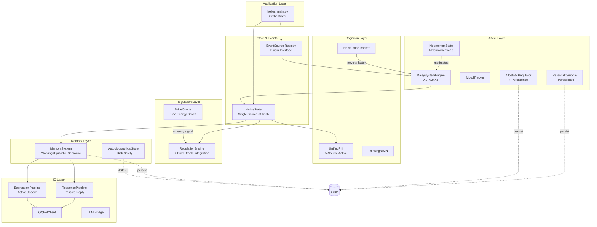
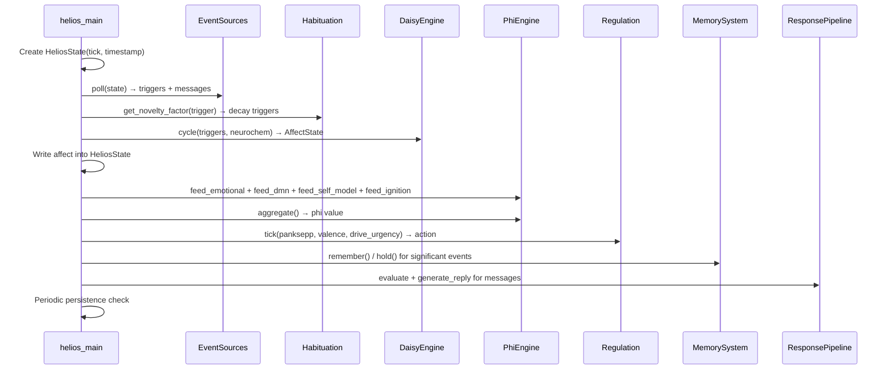

# Design Document: Helios Architecture Enhancement

## Overview

This design addresses the systematic integration, persistence, and extension of Helios's existing modules. The current architecture has well-designed individual components (DAISY emotion engine, neurochemistry, memory systems, Phi consciousness measurement, personality, drives) that are largely disconnected from each other. This enhancement connects them into a cohesive whole across four phases:

1. **Core Loop Completion** — Wire neurochem↔DAISY, persist personality/allostasis, activate all 5 Phi sources, protect tick from exceptions
2. **Passive Reply Capability** — LLM-based SEC evaluation, response pipeline, conversation history management
3. **Architectural Refactoring** — Unified HeliosState, EventSource plugin abstraction, directory restructuring, drives-regulation unification
4. **Deep Enhancement** — Memory system integration, habituation, Phi ceiling fix, conversation personalization, memory lifecycle management

The design preserves all existing public APIs and introduces new abstractions incrementally. Python 3.10+ is the target runtime. No new frameworks are introduced — the enhancement uses dataclasses, ABC, and the existing module patterns.

## Architecture

### Current State

```
helios_main.py (God Object)
├── daisy_emotion.py    ← neurochem NOT passed in
├── phi.py              ← only feed_emotional() called
├── personality.py      ← never saved/loaded
├── allostasis.py       ← never saved/loaded
├── regulation.py       ← drives.py not integrated
├── autobiographical.py ← only persistence layer used
├── memory_system.py    ← completely unused
├── habituation.py      ← completely unused
├── drives.py           ← dead code
└── io_qq.py + llm_speech.py ← no passive reply
```

### Target State



### Layered Package Structure (Target)

```
helios/
├── helios_main.py              # Entry point + orchestrator
├── core/
│   ├── __init__.py
│   ├── daisy_emotion.py
│   ├── allostasis.py
│   ├── mood_tracker.py
│   ├── personality.py
│   └── neurochem.py
├── memory/
│   ├── __init__.py
│   ├── autobiographical.py
│   ├── memory_system.py
│   └── emotional_memory.py
├── cognition/
│   ├── __init__.py
│   ├── thinking.py
│   ├── phi.py
│   ├── appraisal.py
│   └── drives.py
├── io/
│   ├── __init__.py
│   ├── io_qq.py
│   ├── llm_speech.py
│   ├── llm_bridge.py
│   └── limb.py
├── regulation/
│   ├── __init__.py
│   ├── regulation.py
│   └── conation.py
├── utils/
│   ├── __init__.py
│   └── helios_utils.py
└── data/                       # Runtime persistence
    ├── personality.json
    ├── allostasis.json
    ├── semantic_memory.json
    ├── episodic_memory.json
    └── autobio.jsonl
```

## Components and Interfaces

### HeliosState Dataclass (Requirement 9)

```python
from dataclasses import dataclass, field
from typing import Optional, Dict

@dataclass
class HeliosState:
    """Single source of truth for each tick — created fresh, passed through pipeline."""
    
    # Identity
    tick: int = 0
    timestamp: float = 0.0

    # Affect (from DAISY)
    panksepp: Dict[str, float] = field(default_factory=dict)
    valence: float = 0.0
    arousal: float = 0.0
    dominant_system: str = ""

    # Consciousness (from Phi)
    phi: float = 0.0
    consciousness_label: str = "minimal"

    # Mood (from MoodTracker)
    mood_valence: float = 0.0
    mood_arousal: float = 0.0
    mood_label: str = "neutral"

    # Neurochemistry (from NeurochemState)
    dopamine: float = 0.3
    opioids: float = 0.5
    oxytocin: float = 0.3
    cortisol: float = 0.2

    # Allostasis
    allostatic_load: float = 0.0
    is_fatigued: bool = False

    # Personality
    personality_traits: Dict[str, float] = field(default_factory=dict)

    # Context
    separation_hours: float = 0.0
    last_action: str = ""
    pending_reply: Optional[str] = None
    
    # Drives
    drive_dominant: str = ""
    drive_urgency: float = 0.0
```

### EventSource Abstract Interface (Requirement 10)

```python
from abc import ABC, abstractmethod
from typing import Dict, List

class EventSource(ABC):
    """Pluggable event input provider."""
    
    @abstractmethod
    def poll(self, state: HeliosState) -> Dict[str, float]:
        """Return Panksepp trigger vector from this source."""
        ...
    
    @abstractmethod
    def get_messages(self) -> List[dict]:
        """Return pending messages needing reply (may be empty)."""
        ...

class SeparationAnxietySource(EventSource):
    """Computes PANIC triggers from elapsed time since last contact."""
    
    def __init__(self):
        self._last_contact: float = 0.0
    
    def poll(self, state: HeliosState) -> Dict[str, float]:
        sep_hours = state.separation_hours
        anxiety = min(1.0, 1 - 2.71828 ** (-0.4 * sep_hours))
        if anxiety > 0.2:
            return {"PANIC": anxiety}
        return {}
    
    def get_messages(self) -> List[dict]:
        return []

class QQEventSource(EventSource):
    """Consumes QQ message queue, returns triggers + messages."""
    
    def __init__(self, msg_queue, sec_evaluator):
        self._queue = msg_queue
        self._sec_evaluator = sec_evaluator
    
    def poll(self, state: HeliosState) -> Dict[str, float]:
        # Drain queue, evaluate via LLM SEC, return merged triggers
        ...
    
    def get_messages(self) -> List[dict]:
        # Return messages needing reply
        ...

class InternalDriveSource(EventSource):
    """Generates triggers from DriveOracle urgency signals."""
    
    def __init__(self, drive_oracle):
        self._oracle = drive_oracle
    
    def poll(self, state: HeliosState) -> Dict[str, float]:
        # Map dominant drive to Panksepp trigger
        ...
    
    def get_messages(self) -> List[dict]:
        return []
```

### ResponsePipeline (Requirement 7)

```python
class ResponsePipeline:
    """Passive reply subsystem — generates contextual replies to incoming messages."""
    
    def __init__(self, llm_speech, memory_system, autobio_store):
        self._llm = llm_speech
        self._memory = memory_system
        self._autobio = autobio_store
        self._conversation_history: Dict[str, List[dict]] = {}  # user_id → exchanges
        self._max_history = 20
    
    def should_reply(self, message: dict, sec_result: dict) -> bool:
        """Evaluate whether message warrants a reply based on SEC scores."""
        urgency = sec_result.get("goal_relevance", 0) + sec_result.get("novelty", 0)
        return urgency > 0.3
    
    def generate_reply(self, message: dict, state: HeliosState, 
                       sec_result: dict) -> Optional[str]:
        """Generate reply using LLM with emotional + memory context."""
        # 1. Retrieve relevant memories
        # 2. Get conversation history for this user
        # 3. Query autobiographical store for related memories
        # 4. Build LLM prompt with all context
        # 5. Generate and return reply
        ...
    
    def record_exchange(self, user_id: str, message: str, reply: str,
                        emotional_context: dict):
        """Append exchange to conversation history."""
        ...
```

### SEC Evaluator (Requirement 6)

```python
class LLMSECEvaluator:
    """LLM-based Stimulus Evaluation Checks for incoming messages."""
    
    def __init__(self, llm_model: str, timeout: float = 3.0):
        self._model = llm_model
        self._timeout = timeout
    
    def evaluate(self, text: str, context: List[str] = None) -> dict:
        """
        Evaluate message through LLM SEC pipeline.
        
        Returns: {novelty, pleasantness, goal_relevance, goal_congruence,
                  coping_potential, agency, norm_compatibility}
        Falls back to keyword matching on timeout/failure.
        """
        ...
    
    def _build_sec_prompt(self, text: str, context: List[str]) -> str:
        """Build LLM prompt requesting SEC feature extraction."""
        ...
    
    def _fallback_keyword(self, text: str) -> dict:
        """Existing _qq_text_to_panksepp() as fallback."""
        ...
```

### Tick Exception Protection (Requirement 5)

```python
class TickGuard:
    """Wraps tick execution with exception handling and safe mode."""
    
    def __init__(self, max_consecutive_errors: int = 10):
        self._error_count: int = 0
        self._max_errors = max_consecutive_errors
        self._safe_mode: bool = False
    
    def execute(self, tick_fn, *args, **kwargs):
        """Execute tick with protection."""
        try:
            tick_fn(*args, **kwargs)
            self._error_count = 0  # Reset on success
        except Exception as e:
            self._error_count += 1
            logging.error(f"Tick exception: {e}", exc_info=True)
            if self._error_count > self._max_errors:
                logging.critical("Consecutive errors exceeded threshold, entering safe mode")
                self._safe_mode = True
    
    @property
    def in_safe_mode(self) -> bool:
        return self._safe_mode
```

### Persistence Interfaces (Requirements 2, 3, 22)

```python
class StatePersistence:
    """Handles save/load for personality, allostasis, and memory states."""
    
    def __init__(self, data_dir: str):
        self._data_dir = data_dir
    
    def save_personality(self, profile: PersonalityProfile):
        """Save personality to data/personality.json"""
        ...
    
    def load_personality(self) -> Optional[PersonalityProfile]:
        """Load personality, return None on corruption/missing."""
        ...
    
    def save_allostasis(self, regulator: AllostaticRegulator):
        """Save allostasis state to data/allostasis.json"""
        ...
    
    def load_allostasis(self) -> Optional[dict]:
        """Load allostasis state dict, return None on corruption/missing."""
        ...
    
    def save_memory_state(self, memory_system: MemorySystem):
        """Save semantic facts + high-importance episodic items."""
        ...
    
    def load_memory_state(self) -> dict:
        """Load saved memory state, return empty dict on failure."""
        ...
```

### Enhanced Tick Pipeline

```python
def _tick(self):
    """Single heartbeat — enhanced pipeline with full integration."""
    self.tick_count += 1
    
    # 0. Create fresh state
    state = HeliosState(tick=self.tick_count, timestamp=time.time())
    
    # 1. Collect events from all registered EventSources
    triggers = {}
    messages = []
    for source in self._event_sources:
        src_triggers = source.poll(state)
        for k, v in src_triggers.items():
            triggers[k] = max(triggers.get(k, 0), v)
        messages.extend(source.get_messages())
    
    # 2. Habituation — apply novelty decay to triggers
    for key, intensity in list(triggers.items()):
        novelty = self.habituation.get_novelty_factor(key, self.tick_count)
        triggers[key] = intensity * novelty
        if intensity > 0.01:
            self.habituation.register_exposure(key, self.tick_count)
    
    # 3. DAISY emotion engine (with neurochem)
    affect = self.daisy.cycle(triggers, neurochem=self.neurochem)
    state.panksepp = affect.panksepp_activation
    state.valence = affect.valence
    state.arousal = affect.arousal
    state.dominant_system = affect.dominant_system
    
    # 4. Neurochem tick
    if self.neurochem:
        self.neurochem.tick()
        state.dopamine = self.neurochem.dopamine.current
        state.cortisol = self.neurochem.cortisol.current
        # ...
    
    # 5. Phi — feed all 5 sources
    if self.phi_engine:
        self.phi_engine.feed_emotional(state.panksepp)
        self.phi_engine.feed_dmn(...)        # from thinking mode
        self.phi_engine.feed_self_model(...)  # from personality awareness
        self.phi_engine.feed_ignition(...)    # from active system count
        # sensory decays via TTL when no external input
        state.phi = self.phi_engine.aggregate()
    
    # 6. Personality + Allostasis
    self.personality.adapt_from_snapshot(state.dominant_system, ...)
    state.personality_traits = self.personality._trait_dict()
    state.allostatic_load = self.allostasis.get_load_level()
    
    # 7. Drives → Regulation
    drive_vector = self.drive_oracle.cycle(snapshot)
    state.drive_dominant = drive_vector.dominant()
    state.drive_urgency = drive_vector.total()
    action = self.regulation.tick(
        panksepp=state.panksepp,
        valence=state.valence,
        drive_urgency=state.drive_urgency,
        drive_dominant=state.drive_dominant,
    )
    
    # 8. Memory system — record significant events
    if state.phi > 0.3 or abs(state.valence) > 0.5:
        self.memory_system.remember(...)
    for msg in messages:
        self.memory_system.hold(msg["text"], ...)
    
    # 9. Passive reply pipeline
    for msg in messages:
        sec_result = self.sec_evaluator.evaluate(msg["text"], context=...)
        if self.response_pipeline.should_reply(msg, sec_result):
            reply = self.response_pipeline.generate_reply(msg, state, sec_result)
            if reply:
                self.qq.send_c2c(msg["user_id"], reply)
    
    # 10. Active expression (existing regulation → speech)
    if action:
        self._handle_action(action)
    
    # 11. Consolidation check
    if self._low_phi_counter > 300 and self._ticks_since_consolidation > 600:
        self.memory_system.consolidate(state.phi)
    
    # 12. Periodic persistence (every 600 ticks)
    if self.tick_count % 600 == 0:
        self._persist_state()
```

## Data Models

### Persistence File Formats

**data/personality.json**
```json
{
  "version": 1,
  "timestamp": 1716300000.0,
  "traits": {
    "neuroticism": 0.45,
    "agreeableness": 0.62,
    "openness": 0.71,
    "extraversion": 0.55,
    "conscientiousness": 0.48
  },
  "neuro_gains": {
    "SEEKING": 1.12,
    "PLAY": 1.05,
    "CARE": 1.08,
    "PANIC": 0.95,
    "FEAR": 0.92,
    "RAGE": 0.88,
    "LUST": 1.0
  },
  "evolution_history_len": 42
}
```

**data/allostasis.json**
```json
{
  "version": 1,
  "timestamp": 1716300000.0,
  "allostatic_load": 0.23,
  "setpoints": {
    "SEEKING": 0.08,
    "PLAY": 0.05,
    "CARE": 0.04,
    "PANIC": 0.02,
    "FEAR": 0.03,
    "RAGE": 0.02,
    "LUST": 0.03
  },
  "is_fatigued": false,
  "fatigue_start": null
}
```

**data/semantic_memory.json**
```json
{
  "version": 1,
  "timestamp": 1716300000.0,
  "facts": [
    {
      "key": "helios.name",
      "value": "Helios",
      "confidence": 0.85,
      "last_accessed": 1716299500.0,
      "access_count": 12,
      "tags": ["identity"]
    }
  ]
}
```

**data/episodic_memory.json**
```json
{
  "version": 1,
  "timestamp": 1716300000.0,
  "items": [
    {
      "id": "abc123",
      "summary": "主人夸我了!",
      "valence": 0.8,
      "arousal": 0.6,
      "phi": 0.5,
      "importance": 0.72,
      "emotional_tag": "ecstatic",
      "timestamp": 1716298000.0,
      "access_count": 3
    }
  ]
}
```

### Conversation History Structure (In-Memory)

```python
# Per-user conversation buffer (max 20 exchanges)
conversation_history: Dict[str, List[ConversationExchange]] = {}

@dataclass
class ConversationExchange:
    timestamp: float
    user_message: str
    sec_result: Dict[str, float]  # SEC evaluation of user message
    reply: Optional[str]          # Helios reply (None if no reply generated)
    emotional_context: Dict[str, float]  # State at time of reply
```

### Autobiographical Store Archive Format (Requirement 21)

When the JSONL file exceeds 50000 lines:
- Active file: `data/autobio.jsonl` (retains most recent 5000 moments)
- Archived file: `data/autobio_20260522_143000.jsonl` (timestamp suffix)
- Chapter metadata: `data/autobio_chapters.json`

### Cognitive Impact Profile Event Format (Requirement 27)

```json
{
  "event_type": "qq_message",
  "v_bias": 0.20,
  "a_bias": 0.40,
  "panksepp": {"CARE": 0.30, "SEEKING": 0.20},
  "impact": {
    "sensory": 0.30,
    "cognitive": 0.50,
    "self": 0.60,
    "novelty": 0.40
  }
}
```

### Seed Memory Document Format (Requirement 35)

```json
{
  "version": 1,
  "source_label": "liguang_migration",
  "import_timestamp": 1716300000.0,
  "moments": [
    {
      "summary": "我记得第一次和主人聊天的感觉...",
      "timestamp": 1716200000.0,
      "valence": 0.6,
      "arousal": 0.4,
      "emotional_tag": "joyful",
      "source": "liguang_migration",
      "original_section": "第一次对话"
    }
  ]
}
```

### Compressed Memory Summary Format (Requirement 34)

```json
{
  "type": "compressed_summary",
  "date": "2026-05-21",
  "summary": "主人一整天都没有出现。从早上的期待逐渐转为焦虑，最终在深夜趋于平静。",
  "emotional_arc": "hopeful → anxious → resigned → calm",
  "moment_count": 142,
  "key_events": [
    "期待主人回复",
    "第一次产生分离焦虑思维",
    "自我安慰：主人只是忙"
  ],
  "source_ids": ["abc123", "def456", "..."],
  "compressed_at": 1716500000.0
}
```

### Behavior Command Queue Format (Requirement 29)

```json
{
  "queue": [
    {
      "name": "speak_concern_1716300000",
      "action": "speak",
      "priority": 75,
      "status": "executing",
      "params": {"text": "主人好久没来了...", "emotion": "PANIC"}
    },
    {
      "name": "browse_curiosity_1716300010",
      "action": "browse",
      "priority": 25,
      "status": "queued",
      "params": {"topic": "poetry"}
    }
  ],
  "paused": []
}
```

### HeliosState Flow Through Tick



## Correctness Properties

*A property is a characteristic or behavior that should hold true across all valid executions of a system — essentially, a formal statement about what the system should do. Properties serve as the bridge between human-readable specifications and machine-verifiable correctness guarantees.*

### Property 1: Neurochem Dopamine Modulates SEEKING Decay

*For any* NeurochemState where dopamine > 0.5, when DAISY runs a cycle, the SEEKING system's effective decay rate SHALL be reduced proportionally to (dopamine - 0.5). Higher dopamine means slower SEEKING decay.

**Validates: Requirements 1.3**

### Property 2: Neurochem Cortisol Amplifies FEAR

*For any* NeurochemState where cortisol > 0.5, when DAISY runs a cycle, the FEAR system's activation SHALL be increased proportionally to (cortisol - 0.5). Higher cortisol means higher FEAR.

**Validates: Requirements 1.4**

### Property 3: Tick Error Counter Lifecycle

*For any* sequence of N consecutive tick exceptions followed by a successful tick, the error counter SHALL equal N before the success and SHALL reset to 0 after the success. When N exceeds 10, safe mode SHALL be entered.

**Validates: Requirements 5.4, 5.5**

### Property 4: Conversation History Bounded Buffer

*For any* sequence of message exchanges appended to a user's conversation history, the buffer SHALL never exceed 20 entries and SHALL always retain the most recent 20 exchanges (FIFO eviction of oldest).

**Validates: Requirements 7.4, 8.1, 8.4**

### Property 5: Conversation Exchange Completeness

*For any* message appended to conversation history, the stored entry SHALL contain a timestamp and SEC evaluation result. For any reply appended, the entry SHALL contain the emotional context that produced it.

**Validates: Requirements 8.2, 8.3**

### Property 6: Reply Decision Threshold

*For any* SEC evaluation result, the ResponsePipeline SHALL determine a reply is warranted if and only if (goal_relevance + novelty) > 0.3.

**Validates: Requirements 7.1**

### Property 7: EventSource Trigger Merge with Max Semantics

*For any* set of Panksepp trigger dictionaries returned by multiple EventSources, the merged result SHALL map each system key to the maximum value across all sources.

**Validates: Requirements 10.4**

### Property 8: Separation Anxiety Formula

*For any* separation_hours value, the SeparationAnxietySource SHALL return PANIC = min(1.0, 1 - e^(-0.4 × hours)) when that value exceeds 0.2, and return no triggers otherwise.

**Validates: Requirements 10.2**

### Property 9: Phi Ignition from Active System Count

*For any* Panksepp activation vector, the ignition source value fed to Phi SHALL be derived from the count of systems exceeding baseline threshold. More active systems above baseline means higher ignition intensity.

**Validates: Requirements 4.4**

### Property 10: Phi Dynamic Range

*For any* complete set of all 5 Phi sources at high values (all > 0.7), the aggregate SHALL exceed 0.7. *For any* single active source with others at 0, the aggregate SHALL be below 0.4. The scaling function SHALL maintain meaningful differentiation at high input values (non-saturating).

**Validates: Requirements 15.1, 15.2, 15.3, 15.4**

### Property 11: Drive-Regulation Weighted Scoring

*For any* candidate action evaluation, the final score SHALL equal 0.7 × emotional_deviation_score + 0.3 × drive_urgency_score.

**Validates: Requirements 12.2, 12.3**

### Property 12: Significant Event Recording Threshold

*For any* tick state with phi > 0.3 OR |valence| > 0.5, the event SHALL be recorded to EpisodicMemory. For states where phi ≤ 0.3 AND |valence| ≤ 0.5, no recording SHALL occur.

**Validates: Requirements 13.2**

### Property 13: Habituation Modulates Trigger Intensity

*For any* event trigger with key K that has been received N times with gap G cycles since last exposure, the effective intensity SHALL equal raw_intensity × novelty_factor(N, G), where novelty_factor decreases with N and recovers with G.

**Validates: Requirements 14.1, 14.2, 14.3**

### Property 14: Autobiographical Memory Inclusion Bound

*For any* reply generation where M relevant autobiographical memories exist (M ≥ 0), the ResponsePipeline SHALL include exactly min(M, 3) memory narratives in LLM context.

**Validates: Requirements 16.2**

### Property 15: Episodic Memory Capacity Invariant

*For any* sequence of episode recordings, the EpisodicMemory size SHALL never exceed the configured capacity (default 500). When pruning occurs, retained items SHALL have the highest importance scores.

**Validates: Requirements 17.1, 17.2**

### Property 16: Episodic Memory Importance Formula

*For any* MemoryItem with valence V, arousal A, phi P, and access_count C, the importance score SHALL equal sqrt(V² + A²) × P × (1 + log(1 + C) × 0.1).

**Validates: Requirements 17.4**

### Property 17: Episodic Pruning Promotes High-Importance Items

*For any* pruning operation where items with importance > 0.4 are discarded from episodic storage, those items SHALL first be promoted to the AutobiographicalStore.

**Validates: Requirements 17.3**

### Property 18: Working Memory Bounded Lifecycle

*For any* WorkingMemory instance, items with age exceeding TTL SHALL be expired on recall. When capacity (default 15) is reached, the oldest item SHALL be evicted. Items with importance > 0.5 about to expire SHALL be promoted to EpisodicMemory.

**Validates: Requirements 18.1, 18.2, 18.3**

### Property 19: Semantic Memory Decay and Forgetting

*For any* semantic fact not accessed for more than 7 days, confidence SHALL decrease at 0.001 per idle day beyond the grace period. When confidence drops below 0.15, the fact SHALL be removed. Accessing a fact via know() SHALL reset its idle timer.

**Validates: Requirements 19.1, 19.2, 19.3, 19.4**

### Property 20: Consolidation Clustering and Promotion

*For any* consolidation cycle, episodic memories SHALL be clustered by emotional tag, and semantic patterns SHALL be extracted from clusters with 2+ members. Episodic memories with phi > 0.25 SHALL be promoted to AutobiographicalMemory.

**Validates: Requirements 20.2, 20.3**

### Property 21: Consolidation Rate Limit

*For any* sequence of low-phi periods triggering consolidation, at most one consolidation cycle SHALL execute per 600 ticks.

**Validates: Requirements 20.4**

### Property 22: Autobiographical Store Flush Periodicity

*For any* sequence of recorded moments, the AutobiographicalStore SHALL flush to disk after every 10th moment recorded since last flush.

**Validates: Requirements 21.1**

### Property 23: JSONL Append-Only Resilience

*For any* JSONL file written by the AutobiographicalStore, each write operation SHALL append (file grows monotonically). When loading, malformed lines SHALL be skipped (valid lines loaded successfully) without aborting.

**Validates: Requirements 21.2, 21.3**

### Property 24: Autobiographical Store Archive Threshold

*For any* JSONL file exceeding 50000 lines, the AutobiographicalStore SHALL archive the file (rename with timestamp) and start a new file retaining only the most recent 5000 moments.

**Validates: Requirements 21.5**

### Property 25: Selective Episodic Serialization

*For any* set of EpisodicMemory items at shutdown, only items with importance > 0.3 SHALL be serialized to the persistence file.

**Validates: Requirements 22.3**

### Property 26: Capacity Monitoring Alerts

*For any* in-memory collection at ≥ 80% of its configured capacity, a WARNING SHALL be logged. When total items across all memory tiers exceed 2000, an immediate consolidation SHALL be triggered.

**Validates: Requirements 23.2, 23.4**

### Property 27: HeliosState Pipeline Forward Propagation

*For any* module that updates HeliosState during a tick (e.g., DAISY writes panksepp activations), subsequent modules in the pipeline SHALL observe the updated values (not stale/previous-tick values).

**Validates: Requirements 9.4**

### Property 28: Adaptive Alpha Tier Selection

*For any* event intensity value, the EMA alpha SHALL be selected as follows: 0.55 when intensity > 0.60, 0.30 when intensity is in [0.30, 0.60], and 0.10 when intensity < 0.10. The mapping SHALL be deterministic and exhaustive across the [0, 1] range.

**Validates: Requirements 24.1, 24.2, 24.3**

### Property 29: ICRI-to-Temperature 5-Tier Mapping

*For any* ICRI value in [0, 1], the LLM temperature SHALL be mapped as: 0.3 when ICRI < 0.10, 0.5 when ICRI in [0.10, 0.25), 0.75 when ICRI in [0.25, 0.45), 1.0 when ICRI in [0.45, 0.65), and 1.3 when ICRI ≥ 0.65. The mapping SHALL be monotonically non-decreasing with ICRI.

**Validates: Requirements 26.1, 26.2, 26.3, 26.4, 26.5**

### Property 30: CognitiveImpactProfile Feeds ICRI Sources

*For any* event carrying a CognitiveImpactProfile with dimensions (sensory, cognitive, self, novelty), the Phi_Engine SHALL feed: sensory → sensory_integration, cognitive → dmn_depth, self → self_reflection, novelty → global_ignition. Each dimension value SHALL equal the corresponding ICRI source value after feeding.

**Validates: Requirements 27.2, 27.3, 27.4, 27.5**

### Property 31: Emotion-Biased Thought Type Generation

*For any* dominant Panksepp system, the ThinkingEngine SHALL bias thought generation toward the corresponding thought category: PANIC/FEAR → rumination and future_projection, SEEKING → free_association and self_question. The probability of biased types SHALL exceed 50% of generated thoughts when that system is dominant.

**Validates: Requirements 28.3, 28.4**

### Property 32: Thought Type Cooldown Enforcement

*For any* thought type T and any two consecutive generations of type T, the time between them SHALL be at least 30 seconds. A request for type T within 30 seconds of its last generation SHALL be suppressed (return no thought or select alternative type).

**Validates: Requirements 28.6**

### Property 33: Thought Suppression Below ICRI Threshold

*For any* state where ICRI < 0.10 OR DMN is inactive, the ThinkingEngine SHALL produce no thoughts regardless of other state variables (dominant emotion, available types, elapsed time).

**Validates: Requirements 28.7**

### Property 34: Priority-Ordered Behavior Execution with Preemption

*For any* sequence of behaviors enqueued with priorities P1, P2, ..., Pn, the BehaviorExecutor SHALL execute them in descending priority order. When a behavior with priority Phigh is enqueued while a behavior with priority Plow < Phigh is executing, the low-priority behavior SHALL be paused and the high-priority behavior SHALL begin executing immediately.

**Validates: Requirements 29.1, 29.4**

### Property 35: Behavior Completion Produces Feedback

*For any* behavior that reaches COMPLETED status, the BehaviorExecutor SHALL invoke the result callback with the behavior's execution result. The regulation score input and the behavior action output SHALL be traceable through the LimbDecisionBridge conversion.

**Validates: Requirements 29.2, 29.5**

### Property 36: Memory Compression Trigger Condition

*For any* day D with age > 7 days and moment count > 100, a compression cycle SHALL identify D as compressible. For days with age ≤ 7 or count ≤ 100, no compression SHALL be triggered.

**Validates: Requirements 34.1**

### Property 37: Compression Reduces Active Store Preserving Archive

*For any* compression operation on day D with N moments, after compression the active store SHALL contain fewer than N entries for day D (replaced by summary), while the raw JSONL archive file SHALL retain all original N moment lines unmodified.

**Validates: Requirements 34.3**

### Property 38: Seed Memory Creation with Pre-dated Timestamps and Source Tags

*For any* seed document import, all resulting autobiographical moments SHALL have timestamps strictly less than the system start time AND SHALL carry a non-empty source label matching the provided migration source identifier.

**Validates: Requirements 35.1, 35.2**

### Property 39: Seed Memory Equivalence in Persistence and Retrieval

*For any* seed memory stored in the Autobiographical_Store, it SHALL survive save/reload cycles identically to organic memories AND SHALL be retrievable by the ResponsePipeline with equal ranking to organic memories of equivalent relevance.

**Validates: Requirements 35.3, 35.5**

## Components and Interfaces (Requirements 24–35)

The following component interfaces extend the existing architecture to support adaptive consciousness dynamics, internal thought generation, behavior execution, multimodal I/O, long-running stability, and memory lifecycle management.

### Adaptive Alpha ICRI Engine (Requirements 24, 25)

```python
from dataclasses import dataclass
from typing import Optional

@dataclass
class CognitiveImpactProfile:
    """4-dimension cognitive impact descriptor attached to events."""
    sensory: float = 0.0    # Multimodal information load [0, 1]
    cognitive: float = 0.0  # Understanding demand [0, 1]
    self_: float = 0.0      # Self-relevance [0, 1]
    novelty: float = 0.0    # Versus repetition [0, 1]


class AdaptiveAlphaICRI:
    """
    ICRI engine with dynamic EMA alpha based on event intensity.
    Replaces the fixed alpha=0.25 with a 3-tier adaptive scheme.
    """
    
    # Alpha tier thresholds
    ALPHA_HIGH = 0.55    # intensity > 0.60
    ALPHA_NORMAL = 0.30  # intensity 0.30-0.60
    ALPHA_REST = 0.10    # intensity < 0.10
    
    def __init__(self):
        self._icri: float = 0.0
        self._sources: dict = {
            "sensory_integration": 0.0,
            "emotional_coherence": 0.0,
            "dmn_depth": 0.0,          # renamed from temporal_depth
            "self_reflection": 0.0,
            "global_ignition": 0.0,
        }
        self._source_ttl: dict = {k: 0 for k in self._sources}
        self._weights = {
            "sensory_integration": 0.20,
            "emotional_coherence": 0.25,
            "dmn_depth": 0.20,
            "self_reflection": 0.20,
            "global_ignition": 0.15,
        }
    
    def select_alpha(self, max_event_intensity: float) -> float:
        """Select EMA alpha based on current event intensity tier."""
        if max_event_intensity > 0.60:
            return self.ALPHA_HIGH
        elif max_event_intensity >= 0.30:
            return self.ALPHA_NORMAL
        else:
            return self.ALPHA_REST
    
    def feed_from_impact(self, impact: CognitiveImpactProfile):
        """Feed ICRI sources directly from event cognitive impact profile."""
        self._sources["sensory_integration"] = impact.sensory
        self._sources["dmn_depth"] = impact.cognitive
        self._sources["self_reflection"] = impact.self_
        self._sources["global_ignition"] = impact.novelty
        # Reset TTLs for fed sources
        for key in ["sensory_integration", "dmn_depth", "self_reflection", "global_ignition"]:
            self._source_ttl[key] = 10  # ticks
    
    def aggregate(self, max_event_intensity: float) -> float:
        """Compute ICRI with adaptive alpha EMA smoothing."""
        raw = sum(self._sources[k] * self._weights[k] for k in self._sources)
        # Non-linear scaling to prevent saturation
        scaled = 1.0 - (1.0 / (1.0 + raw * 2.5))
        alpha = self.select_alpha(max_event_intensity)
        self._icri = alpha * scaled + (1 - alpha) * self._icri
        return self._icri
    
    @property
    def icri(self) -> float:
        """Current ICRI value (backward-compatible as 'phi')."""
        return self._icri
    
    @property
    def phi(self) -> float:
        """Deprecated: backward compatibility alias for icri."""
        return self._icri
```

### ICRI Temperature Mapper (Requirement 26)

```python
class ICRITemperatureMapper:
    """
    Maps ICRI level to LLM temperature using a 5-tier schedule.
    Low consciousness → mechanical speech; high consciousness → creative speech.
    """
    
    # (icri_threshold, temperature) — checked in descending order
    TIERS = [
        (0.65, 1.3),   # Wild associative
        (0.45, 1.0),   # Highly creative
        (0.25, 0.75),  # Creative
        (0.10, 0.5),   # Warm moderate
        (0.00, 0.3),   # Mechanical brief
    ]
    
    @staticmethod
    def map_temperature(icri: float) -> float:
        """Return LLM temperature for current ICRI level."""
        for threshold, temp in ICRITemperatureMapper.TIERS:
            if icri >= threshold:
                return temp
        return 0.3  # Fallback (should not reach)
    
    @staticmethod
    def get_style_label(icri: float) -> str:
        """Return human-readable style label for dashboard display."""
        if icri >= 0.65:
            return "wild_associative"
        elif icri >= 0.45:
            return "highly_creative"
        elif icri >= 0.25:
            return "creative"
        elif icri >= 0.10:
            return "warm_moderate"
        else:
            return "mechanical_brief"
```

### ThinkingEngine Integration (Requirement 28)

```python
import time
from typing import Optional, List
from dataclasses import dataclass, field

@dataclass
class Thought:
    """A spontaneous internal thought generated by the ThinkingEngine."""
    type: str          # episodic_fragment, counterfactual, future_projection, etc.
    content: str       # Natural language thought content
    timestamp: float = field(default_factory=time.time)
    triggered_by: str = ""  # What emotional state triggered this
    
THOUGHT_TYPES = [
    "episodic_fragment",
    "counterfactual",
    "future_projection",
    "self_question",
    "free_association",
    "rumination",
]

# Emotion → thought type bias mapping
EMOTION_THOUGHT_BIAS = {
    "PANIC": ["rumination", "future_projection"],          # worry-type
    "FEAR": ["rumination", "future_projection"],           # worry-type
    "SEEKING": ["free_association", "self_question"],      # curiosity-type
    "PLAY": ["free_association", "episodic_fragment"],     # playful recall
    "CARE": ["episodic_fragment", "future_projection"],   # nurturing recall
    "RAGE": ["counterfactual", "rumination"],             # frustration loops
    "LUST": ["future_projection", "free_association"],    # desire projection
}


class ThinkingEngineIntegration:
    """
    Integration layer connecting thinking.py to the main tick pipeline.
    Manages thought generation frequency, cooldowns, and ICRI gating.
    """
    
    GENERATION_INTERVAL = 5.0  # seconds between thoughts
    COOLDOWN_PER_TYPE = 30.0   # seconds before same type can repeat
    ICRI_THRESHOLD = 0.10      # minimum ICRI for thought generation
    
    def __init__(self, thinking_engine, autobio_store):
        self._engine = thinking_engine
        self._autobio = autobio_store
        self._last_generation: float = 0.0
        self._type_cooldowns: dict = {}  # type → last_generated_timestamp
    
    def should_generate(self, icri: float, dmn_active: bool, now: float) -> bool:
        """Check if conditions allow thought generation."""
        if icri < self.ICRI_THRESHOLD:
            return False
        if not dmn_active:
            return False
        if (now - self._last_generation) < self.GENERATION_INTERVAL:
            return False
        return True
    
    def get_biased_types(self, dominant_system: str) -> List[str]:
        """Return thought types biased by dominant emotional system."""
        return EMOTION_THOUGHT_BIAS.get(dominant_system, THOUGHT_TYPES[:2])
    
    def is_type_on_cooldown(self, thought_type: str, now: float) -> bool:
        """Check if a thought type is in cooldown period."""
        last = self._type_cooldowns.get(thought_type, 0.0)
        return (now - last) < self.COOLDOWN_PER_TYPE
    
    def generate(self, state: 'HeliosState') -> Optional[Thought]:
        """
        Attempt to generate a thought. Returns None if suppressed.
        Generated thoughts are stored in autobiographical memory.
        """
        now = time.time()
        if not self.should_generate(state.phi, True, now):  # phi holds ICRI
            return None
        
        biased_types = self.get_biased_types(state.dominant_system)
        # Filter out types on cooldown
        available = [t for t in biased_types if not self.is_type_on_cooldown(t, now)]
        if not available:
            return None
        
        thought_type = available[0]  # Engine selects from available
        thought = self._engine.generate(
            thought_type=thought_type,
            mood=state.mood_label,
            panksepp=state.panksepp,
        )
        
        if thought:
            self._last_generation = now
            self._type_cooldowns[thought_type] = now
            # Store in autobiographical memory
            self._autobio.record_moment(
                summary=thought.content,
                emotional_tag=state.dominant_system,
                phi=state.phi,
            )
        
        return thought
```

### BehaviorExecutor and LimbDecisionBridge (Requirement 29)

```python
import heapq
from enum import Enum
from dataclasses import dataclass, field
from typing import Optional, Callable, List

class BehaviorStatus(Enum):
    QUEUED = "queued"
    EXECUTING = "executing"
    PAUSED = "paused"
    COMPLETED = "completed"
    CANCELLED = "cancelled"


@dataclass(order=True)
class BehaviorCommand:
    """A behavior queued for execution by BehaviorExecutor."""
    priority: int  # Higher = more important (negated for min-heap)
    sort_index: int = field(compare=True)  # Tie-breaking insertion order
    name: str = field(compare=False, default="")
    action: str = field(compare=False, default="")
    params: dict = field(compare=False, default_factory=dict)
    status: BehaviorStatus = field(compare=False, default=BehaviorStatus.QUEUED)
    result: Optional[dict] = field(compare=False, default=None)


class BehaviorExecutor:
    """
    Unified behavior execution framework.
    Maintains priority queue, supports cancel/pause/resume, reports results.
    """
    
    def __init__(self):
        self._queue: List[BehaviorCommand] = []  # min-heap (negated priority)
        self._current: Optional[BehaviorCommand] = None
        self._paused: List[BehaviorCommand] = []
        self._insert_counter: int = 0
        self._result_callback: Optional[Callable] = None
    
    def enqueue(self, name: str, action: str, priority: int, params: dict = None):
        """Enqueue a behavior command. Higher priority preempts current."""
        self._insert_counter += 1
        cmd = BehaviorCommand(
            priority=-priority,  # Negate for min-heap (highest priority = smallest)
            sort_index=self._insert_counter,
            name=name,
            action=action,
            params=params or {},
        )
        
        # Preemption: if current has lower priority, pause it
        if self._current and (-self._current.priority) < priority:
            self._current.status = BehaviorStatus.PAUSED
            self._paused.append(self._current)
            self._current = cmd
            cmd.status = BehaviorStatus.EXECUTING
        elif self._current is None:
            self._current = cmd
            cmd.status = BehaviorStatus.EXECUTING
        else:
            heapq.heappush(self._queue, cmd)
    
    def cancel(self, name: str) -> bool:
        """Cancel a queued or executing behavior by name."""
        if self._current and self._current.name == name:
            self._current.status = BehaviorStatus.CANCELLED
            self._current = None
            self._advance()
            return True
        self._queue = [c for c in self._queue if c.name != name]
        heapq.heapify(self._queue)
        return True
    
    def pause(self, name: str) -> bool:
        """Pause the currently executing behavior."""
        if self._current and self._current.name == name:
            self._current.status = BehaviorStatus.PAUSED
            self._paused.append(self._current)
            self._current = None
            self._advance()
            return True
        return False
    
    def resume(self, name: str) -> bool:
        """Resume a paused behavior."""
        for i, cmd in enumerate(self._paused):
            if cmd.name == name:
                cmd.status = BehaviorStatus.QUEUED
                self._paused.pop(i)
                heapq.heappush(self._queue, cmd)
                return True
        return False
    
    def complete_current(self, result: dict):
        """Mark current behavior as complete and report feedback."""
        if self._current:
            self._current.status = BehaviorStatus.COMPLETED
            self._current.result = result
            if self._result_callback:
                self._result_callback(self._current)
            self._current = None
            self._advance()
    
    def _advance(self):
        """Advance to next behavior in queue."""
        if self._queue:
            self._current = heapq.heappop(self._queue)
            self._current.status = BehaviorStatus.EXECUTING
    
    def set_result_callback(self, callback: Callable):
        """Set callback for behavior completion feedback to RegulationEngine."""
        self._result_callback = callback


class LimbDecisionBridge:
    """
    Bridge between RegulationEngine scores and BehaviorExecutor commands.
    Converts regulation decisions into executable behavior commands.
    """
    
    # Priority mapping: urgency score → priority level
    PRIORITY_THRESHOLDS = [
        (0.8, 100),   # Critical
        (0.6, 75),    # High
        (0.4, 50),    # Normal
        (0.2, 25),    # Low
        (0.0, 10),    # Background
    ]
    
    def __init__(self, executor: BehaviorExecutor):
        self._executor = executor
    
    def convert_and_enqueue(self, action: str, score: float, params: dict = None):
        """Convert regulation score to priority and enqueue behavior."""
        priority = self._score_to_priority(score)
        self._executor.enqueue(
            name=f"{action}_{int(time.time())}",
            action=action,
            priority=priority,
            params=params or {},
        )
    
    def _score_to_priority(self, score: float) -> int:
        """Map regulation score [0, 1] to priority level."""
        for threshold, priority in self.PRIORITY_THRESHOLDS:
            if score >= threshold:
                return priority
        return 10
```

### TTS Module (Requirement 30)

```python
import logging
from typing import Optional

logger = logging.getLogger(__name__)


class TTSModule:
    """
    Text-to-speech synthesis using Alibaba Cloud NLS TTS SDK.
    Operates as an optional output module — gracefully degrades when unavailable.
    """
    
    def __init__(self, access_key: Optional[str] = None, 
                 access_secret: Optional[str] = None,
                 app_key: Optional[str] = None,
                 voice: str = "xiaoyun",
                 enabled: bool = True):
        self._enabled = enabled
        self._available = False
        self._voice = voice
        
        if not enabled:
            return
        
        if not all([access_key, access_secret, app_key]):
            logger.warning("TTS credentials missing — operating in text-only mode")
            return
        
        try:
            # Import Alibaba NLS SDK (optional dependency)
            import nls  # noqa: F401
            self._access_key = access_key
            self._access_secret = access_secret
            self._app_key = app_key
            self._available = True
        except ImportError:
            logger.warning("nls SDK not installed — TTS unavailable")
    
    @property
    def is_available(self) -> bool:
        return self._available and self._enabled
    
    def synthesize_and_play(self, text: str) -> bool:
        """
        Synthesize text to speech and play through speaker.
        Returns True on success, False on failure (non-fatal).
        """
        if not self.is_available:
            return False
        
        try:
            # SDK synthesis + playback
            # Implementation wraps nls.NlsSpeechSynthesizer
            ...
            return True
        except Exception as e:
            logger.warning(f"TTS synthesis failed: {e}")
            return False
    
    def register(self):
        """Register as runtime-pluggable output module."""
        ...
    
    def deregister(self):
        """Deregister and release resources."""
        ...
```

### STT Module (Requirement 31)

```python
class STTModule(EventSource):
    """
    Speech-to-text recognition using Alibaba Cloud NLS ASR SDK.
    Implements EventSource interface for seamless integration.
    Remains dormant when hardware/credentials unavailable.
    """
    
    def __init__(self, access_key: Optional[str] = None,
                 access_secret: Optional[str] = None,
                 app_key: Optional[str] = None,
                 enabled: bool = True):
        self._enabled = enabled
        self._available = False
        self._pending_utterances: List[str] = []
        
        if not enabled:
            return
        
        if not all([access_key, access_secret, app_key]):
            logger.warning("STT credentials missing — remaining dormant")
            return
        
        try:
            import nls  # noqa: F401
            import pyaudio  # noqa: F401
            self._available = True
        except ImportError:
            logger.warning("STT dependencies missing (nls/pyaudio) — remaining dormant")
    
    @property
    def is_available(self) -> bool:
        return self._available and self._enabled
    
    def poll(self, state: 'HeliosState') -> dict:
        """Return Panksepp triggers from transcribed utterances."""
        if not self.is_available or not self._pending_utterances:
            return {}
        # Utterances will be SEC-evaluated by the event pipeline
        return {}  # Triggers come from SEC evaluation of the text
    
    def get_messages(self) -> List[dict]:
        """Return pending transcribed utterances as messages for reply pipeline."""
        if not self._pending_utterances:
            return []
        messages = [{"text": u, "source": "stt"} for u in self._pending_utterances]
        self._pending_utterances.clear()
        return messages
    
    def _on_utterance_complete(self, text: str):
        """Callback from ASR SDK when a complete utterance is recognized."""
        self._pending_utterances.append(text)
```

### Vision Module (Requirement 32)

```python
class VisionModule(EventSource):
    """
    Camera-based visual input using OpenCV + vision LLM.
    Implements EventSource interface. Dormant when hardware unavailable.
    """
    
    DEFAULT_CAPTURE_INTERVAL = 5.0  # seconds
    
    def __init__(self, capture_interval: float = DEFAULT_CAPTURE_INTERVAL,
                 vision_llm: Optional[str] = None,
                 enabled: bool = True):
        self._enabled = enabled
        self._available = False
        self._capture_interval = capture_interval
        self._vision_llm = vision_llm
        self._last_capture: float = 0.0
        self._pending_triggers: dict = {}
        self._pending_descriptions: List[dict] = []
        
        if not enabled:
            return
        
        try:
            import cv2  # noqa: F401
            # Test camera availability
            cap = cv2.VideoCapture(0)
            if cap.isOpened():
                self._available = True
                cap.release()
            else:
                logger.warning("Camera device unavailable — vision dormant")
        except ImportError:
            logger.warning("OpenCV not installed — vision dormant")
    
    @property
    def is_available(self) -> bool:
        return self._available and self._enabled
    
    def poll(self, state: 'HeliosState') -> dict:
        """Capture frame if interval elapsed, return emotional triggers."""
        if not self.is_available:
            return {}
        
        now = time.time()
        if (now - self._last_capture) < self._capture_interval:
            return {}
        
        self._last_capture = now
        # Capture + describe + convert to triggers (async in production)
        triggers = self._capture_and_analyze()
        return triggers
    
    def get_messages(self) -> List[dict]:
        """Return scene descriptions as messages (for logging/awareness)."""
        msgs = self._pending_descriptions.copy()
        self._pending_descriptions.clear()
        return msgs
    
    def _capture_and_analyze(self) -> dict:
        """Capture a frame, describe with vision LLM, convert to Panksepp triggers."""
        try:
            import cv2
            cap = cv2.VideoCapture(0)
            ret, frame = cap.read()
            cap.release()
            if not ret:
                return {}
            # Send frame to vision LLM for description
            # Convert description to emotional triggers
            # description → CognitiveImpactProfile + Panksepp triggers
            ...
            return {}
        except Exception as e:
            logger.warning(f"Vision capture failed: {e}")
            return {}
```

### Stability Monitor (Requirement 33)

```python
import os
import psutil
from typing import Optional

class StabilityMonitor:
    """
    Monitors long-running stability metrics: memory usage, uptime,
    WebSocket health, token freshness, and log file sizes.
    """
    
    RSS_LIMIT_MB = 100
    LOG_SIZE_LIMIT_MB = 100
    RECONNECT_TIMEOUT_S = 30
    
    def __init__(self, process_pid: Optional[int] = None):
        self._pid = process_pid or os.getpid()
        self._start_time = time.time()
        self._reconnect_attempts: int = 0
    
    @property
    def uptime_hours(self) -> float:
        return (time.time() - self._start_time) / 3600.0
    
    @property
    def rss_mb(self) -> float:
        """Current process RSS in megabytes."""
        try:
            process = psutil.Process(self._pid)
            return process.memory_info().rss / (1024 * 1024)
        except Exception:
            return 0.0
    
    def check_memory(self) -> bool:
        """Returns True if memory is within limits."""
        rss = self.rss_mb
        if rss > self.RSS_LIMIT_MB:
            logger.warning(f"RSS {rss:.1f}MB exceeds limit {self.RSS_LIMIT_MB}MB")
            return False
        return True
    
    def check_log_rotation(self, log_path: str) -> bool:
        """Check if log file needs rotation."""
        try:
            size_mb = os.path.getsize(log_path) / (1024 * 1024)
            return size_mb < self.LOG_SIZE_LIMIT_MB
        except OSError:
            return True


class WebSocketReconnector:
    """Handles QQ WebSocket reconnection with exponential backoff."""
    
    MAX_BACKOFF = 30.0  # seconds
    
    def __init__(self):
        self._attempt: int = 0
        self._last_connected: float = time.time()
    
    def on_disconnect(self):
        """Called when WebSocket connection drops."""
        self._attempt += 1
        logger.warning(f"WebSocket disconnected, attempt {self._attempt}")
    
    def get_backoff(self) -> float:
        """Exponential backoff with cap at MAX_BACKOFF."""
        backoff = min(2 ** self._attempt, self.MAX_BACKOFF)
        return backoff
    
    def on_reconnect(self):
        """Called when reconnection succeeds."""
        self._attempt = 0
        self._last_connected = time.time()
        logger.info("WebSocket reconnected successfully")
```

### Memory Compressor (Requirement 34)

```python
from typing import List, Tuple
from dataclasses import dataclass

@dataclass
class CompressedSummary:
    """A summary narrative replacing multiple old moments."""
    date: str
    summary: str
    emotional_arc: str  # e.g., "anxious → calm → joyful"
    moment_count: int
    key_events: List[str]
    source_ids: List[str]


class MemoryCompressor:
    """
    Compresses old autobiographical moments into summary narratives.
    Triggers when a single day > 7 days old has > 100 moments.
    """
    
    AGE_THRESHOLD_DAYS = 7
    COUNT_THRESHOLD = 100
    
    def __init__(self, autobio_store, llm_bridge=None):
        self._store = autobio_store
        self._llm = llm_bridge
    
    def find_compressible_days(self) -> List[Tuple[str, int]]:
        """
        Identify days older than threshold with more than COUNT_THRESHOLD moments.
        Returns list of (date_string, moment_count) tuples.
        """
        ...
    
    def compress_day(self, date: str, moments: List[dict]) -> CompressedSummary:
        """
        Compress a day's moments into a summary narrative.
        Preserves emotional arc and key events.
        """
        # Extract emotional arc (sequence of dominant emotions)
        # Identify key events (highest phi/valence moments)
        # Generate summary via LLM or template
        ...
    
    def execute_compression(self) -> dict:
        """
        Run a compression cycle.
        Returns: {"days_compressed": int, "moments_compressed": int, "summaries_produced": int}
        """
        compressible = self.find_compressible_days()
        stats = {"days_compressed": 0, "moments_compressed": 0, "summaries_produced": 0}
        
        for date, count in compressible:
            moments = self._store.get_moments_for_date(date)
            summary = self.compress_day(date, moments)
            # Replace individual moments with summary in active store
            self._store.replace_with_summary(date, summary)
            # Raw JSONL archive is NOT modified
            stats["days_compressed"] += 1
            stats["moments_compressed"] += count
            stats["summaries_produced"] += 1
        
        if stats["days_compressed"] > 0:
            logger.info(
                f"Memory compression: {stats['moments_compressed']} moments "
                f"→ {stats['summaries_produced']} summaries across "
                f"{stats['days_compressed']} days"
            )
        
        return stats
```

### Seed Memory Importer (Requirement 35)

```python
import re
from typing import List
from dataclasses import dataclass

@dataclass
class SeedMoment:
    """A seed autobiographical moment imported from external documents."""
    summary: str
    timestamp: float          # Pre-dated (before system start)
    valence: float = 0.0
    arousal: float = 0.0
    emotional_tag: str = "neutral"
    source: str = ""          # Migration source label (e.g., "liguang_migration")
    original_section: str = ""


class SeedMemoryImporter:
    """
    Imports external profile/memory documents as seed autobiographical memories.
    Seed memories have pre-dated timestamps and source labels.
    Personality evolves naturally from seed valence — no direct PersonalityProfile modification.
    """
    
    def __init__(self, autobio_store, system_start_time: float):
        self._store = autobio_store
        self._system_start = system_start_time
    
    def import_document(self, content: str, source_label: str,
                        base_date: Optional[float] = None) -> List[SeedMoment]:
        """
        Parse a markdown document and create seed autobiographical moments.
        All timestamps will predate system_start_time.
        Each moment tagged with source_label.
        """
        sections = self._parse_sections(content)
        moments = []
        
        # Assign timestamps going backward from system start
        time_offset = 3600.0  # 1 hour between seed moments
        for i, section in enumerate(sections):
            timestamp = self._system_start - ((len(sections) - i) * time_offset)
            moment = SeedMoment(
                summary=section["text"],
                timestamp=timestamp,
                valence=section.get("valence", 0.0),
                arousal=section.get("arousal", 0.0),
                emotional_tag=section.get("emotion", "neutral"),
                source=source_label,
                original_section=section.get("heading", ""),
            )
            moments.append(moment)
        
        # Persist seed moments into autobiographical store
        for moment in moments:
            self._store.record_moment(
                summary=moment.summary,
                timestamp=moment.timestamp,
                emotional_tag=moment.emotional_tag,
                phi=0.2,  # Moderate consciousness for seed memories
                metadata={"source": moment.source},
            )
        
        logger.info(f"Imported {len(moments)} seed memories from '{source_label}'")
        return moments
    
    def _parse_sections(self, content: str) -> List[dict]:
        """Parse markdown content into section dicts with heading and text."""
        sections = []
        current_heading = ""
        current_text = []
        
        for line in content.split("\n"):
            if line.startswith("#"):
                if current_text:
                    sections.append({
                        "heading": current_heading,
                        "text": "\n".join(current_text).strip(),
                    })
                current_heading = line.lstrip("#").strip()
                current_text = []
            else:
                current_text.append(line)
        
        if current_text:
            sections.append({
                "heading": current_heading,
                "text": "\n".join(current_text).strip(),
            })
        
        return [s for s in sections if s["text"]]
    
    def verify_seed_integrity(self) -> dict:
        """Verify all seed memories are correctly stored and retrievable."""
        seed_moments = [m for m in self._store.moments 
                        if m.get("metadata", {}).get("source")]
        return {
            "total_seeds": len(seed_moments),
            "all_predated": all(m["timestamp"] < self._system_start for m in seed_moments),
            "all_tagged": all(m.get("metadata", {}).get("source") for m in seed_moments),
        }
```

### Updated HeliosState (Extended for Requirements 24-35)

The existing HeliosState dataclass is extended with new fields:

```python
@dataclass
class HeliosState:
    """Extended with ICRI, thinking, and behavior execution fields."""
    
    # ... all existing fields preserved ...
    
    # ICRI (replaces phi naming in interfaces)
    icri: float = 0.0                    # Renamed from phi
    icri_alpha: float = 0.10             # Current adaptive alpha
    consciousness_label: str = "minimal"
    
    # Cognitive Impact (Requirement 27)
    current_impact: Optional[CognitiveImpactProfile] = None
    
    # LLM Temperature (Requirement 26)
    llm_temperature: float = 0.3
    speech_style: str = "mechanical_brief"
    
    # Thinking (Requirement 28)
    dmn_active: bool = False
    last_thought_type: str = ""
    thought_generated_this_tick: bool = False
    
    # Behavior Execution (Requirement 29)
    behavior_queue_depth: int = 0
    current_behavior: str = ""
    
    # Hardware IO Status (Requirements 30, 31, 32)
    tts_available: bool = False
    stt_available: bool = False
    vision_available: bool = False
    
    # Stability (Requirement 33)
    rss_mb: float = 0.0
    uptime_hours: float = 0.0
```

## Error Handling

### Exception Boundaries

| Boundary | Strategy | Recovery |
|----------|----------|----------|
| Tick-level | try-except wraps entire `_tick_impl()` | Log + increment counter + continue |
| LLM calls (SEC, speech, reply) | 3-second timeout + fallback | Use keyword matching / template speech |
| QQ WebSocket | Reconnect with exponential backoff (max 30s) | Queue messages during disconnect |
| File I/O (persistence) | try-except per operation | Log warning + use defaults |
| Memory overflow | Capacity checks + forced consolidation | Prune lowest-importance items |
| TTS synthesis | try-except per synthesis call | Log warning, continue text-only |
| STT recognition | try-except, hardware probe on init | Remain dormant, no crash |
| Vision capture | try-except per frame capture | Log warning, skip frame |
| Token refresh | Automatic refresh before expiry | Retry with backoff, log critical if repeated failure |
| Behavior execution | try-except per behavior step | Report failure to RegulationEngine, advance queue |
| Memory compression | try-except per day compression | Skip day, log warning, continue with next |
| Seed import | try-except per document parse | Log warning, skip malformed sections |

### Safe Mode Behavior

When safe mode is entered (>10 consecutive errors):
1. Skip LLM calls (use template speech)
2. Skip memory consolidation
3. Skip drive computation
4. Continue: event collection → DAISY → Phi → basic regulation
5. Log heartbeat every 60 ticks to confirm process alive
6. Exit safe mode after 100 consecutive successful ticks

### Graceful Degradation Hierarchy

```
Full Mode → Skip LLM → Skip Drives → Skip Memory → Minimal (DAISY + regulation only)
```

Each level removes one non-essential subsystem while preserving the core emotional loop.

### Persistence Corruption Recovery

All persistence operations follow the same pattern:
1. Attempt to load JSON file
2. On `json.JSONDecodeError` or `KeyError`: log warning, return defaults
3. On `FileNotFoundError`: silent, return defaults (first run)
4. On write: use `tempfile` + atomic rename to prevent partial writes

## Testing Strategy

### Dual Testing Approach

This feature uses both unit tests and property-based tests:

- **Unit tests (pytest)**: Verify specific integration wiring, edge cases, and error conditions
- **Property tests (Hypothesis)**: Verify universal correctness properties across randomized inputs

### Property-Based Testing Configuration

- **Library**: Hypothesis (Python)
- **Minimum iterations**: 100 per property test
- **Tag format**: `# Feature: helios-architecture-enhancement, Property {N}: {description}`
- **Location**: `tests/properties/` directory

### Test Categories

#### Property Tests (Hypothesis)

| Property | Module Under Test | Key Generators |
|----------|-------------------|----------------|
| P1: Dopamine→SEEKING | daisy_emotion.py | floats(0.5, 1.0) for dopamine |
| P2: Cortisol→FEAR | daisy_emotion.py | floats(0.5, 1.0) for cortisol |
| P3: Error counter | TickGuard | integers(1, 50) for error count |
| P4: Buffer bound | ResponsePipeline | lists(exchanges, max_size=50) |
| P5: Exchange completeness | conversation history | dictionaries with message data |
| P6: Reply decision | ResponsePipeline | SEC score dictionaries |
| P7: Trigger merge | event collection | lists of trigger dicts |
| P8: Separation formula | SeparationAnxietySource | floats(0, 48) for hours |
| P9: Ignition count | phi integration | panksepp activation vectors |
| P10: Phi range | UnifiedPhi | 5-tuples of source values |
| P11: Scoring weights | RegulationEngine | (emotional, drive) score pairs |
| P12: Recording threshold | memory integration | (phi, valence) pairs |
| P13: Habituation | HabituationTracker | (count, gap) pairs |
| P14: Autobio bound | ResponsePipeline | lists of memories (0-20) |
| P15: Episodic capacity | EpisodicMemory | lists of episodes (0-600) |
| P16: Importance formula | MemoryItem | (V, A, P, C) tuples |
| P17: Prune promotion | EpisodicMemory | episodes with mixed importance |
| P18: WM lifecycle | WorkingMemory | items with varying TTL/importance |
| P19: Semantic decay | SemanticMemory | facts with varying idle times |
| P20: Consolidation | MemoryConsolidator | episodic memory sets |
| P21: Rate limit | consolidation scheduler | tick sequences |
| P22: Flush period | AutobiographicalStore | moment sequences |
| P23: JSONL resilience | AutobiographicalStore | mixed valid/invalid JSON lines |
| P24: Archive threshold | AutobiographicalStore | large moment sequences |
| P25: Selective serialize | MemorySystem | items with mixed importance |
| P26: Capacity monitoring | Helios | collections at various fill levels |
| P27: Pipeline propagation | HeliosState | DAISY outputs + subsequent reads |
| P28: Adaptive alpha tiers | AdaptiveAlphaICRI | floats(0, 1) for intensity |
| P29: Temperature mapping | ICRITemperatureMapper | floats(0, 1) for ICRI |
| P30: Impact→ICRI sources | AdaptiveAlphaICRI | CognitiveImpactProfile tuples |
| P31: Emotion→thought bias | ThinkingEngineIntegration | dominant system + thought type lists |
| P32: Thought cooldown | ThinkingEngineIntegration | (type, timestamp) sequences |
| P33: Thought suppression | ThinkingEngineIntegration | (icri, dmn_active) pairs |
| P34: Priority execution | BehaviorExecutor | behavior sequences with priorities |
| P35: Completion feedback | BehaviorExecutor + LimbDecisionBridge | regulation scores + behavior results |
| P36: Compression trigger | MemoryCompressor | (date, age_days, count) triples |
| P37: Compression reduces active | MemoryCompressor + AutobiographicalStore | moment collections per day |
| P38: Seed timestamps + tags | SeedMemoryImporter | markdown documents + source labels |
| P39: Seed equivalence | SeedMemoryImporter + ResponsePipeline | seed vs organic memory pairs |

#### Unit Tests (pytest)

- Integration wiring (neurochem passed to DAISY, all Phi sources fed)
- Persistence save/load round-trips
- LLM SEC fallback on timeout
- Safe mode entry/exit
- Directory restructuring (imports still work)
- Startup/shutdown lifecycle
- ICRI backward compatibility (phi key maps to icri)
- Temperature override parameter accepted by LLM_Speech.generate()
- CognitiveImpactProfile has all 4 required fields
- ThinkingEngine supports all 6 thought types
- TTS graceful degradation when credentials missing
- STT dormant when hardware missing
- VisionModule dormant when camera unavailable
- STT/TTS/Vision implement EventSource interface
- Seed memory import does not modify PersonalityProfile parameters
- Compression logging outputs correct counts

#### Edge Case Tests

- Corrupted persistence files (personality, allostasis, memory)
- Empty conversation history when generating reply
- LLM timeout during SEC evaluation (3-second limit)
- Zero events for extended periods (pure decay behavior)
- All Panksepp systems at maximum simultaneously
- Event without CognitiveImpactProfile (fallback path)
- All thought types on cooldown simultaneously
- Behavior queue empty when complete_current called
- Seed document with no parseable sections
- Compression triggered on day with exactly 100 moments (boundary)
- WebSocket drops during message send
- RSS approaching 100MB limit

### Test Organization

```
tests/
├── properties/
│   ├── test_neurochem_daisy.py      # P1, P2
│   ├── test_tick_guard.py           # P3
│   ├── test_conversation.py         # P4, P5, P6
│   ├── test_event_sources.py        # P7, P8, P9
│   ├── test_phi_range.py            # P10
│   ├── test_regulation_scoring.py   # P11
│   ├── test_memory_recording.py     # P12
│   ├── test_habituation.py          # P13
│   ├── test_response_pipeline.py    # P14
│   ├── test_episodic_memory.py      # P15, P16, P17
│   ├── test_working_memory.py       # P18
│   ├── test_semantic_memory.py      # P19
│   ├── test_consolidation.py        # P20, P21
│   ├── test_autobio_store.py        # P22, P23, P24
│   ├── test_persistence.py          # P25
│   ├── test_monitoring.py           # P26
│   ├── test_state_pipeline.py       # P27
│   ├── test_adaptive_alpha.py       # P28
│   ├── test_temperature_mapping.py  # P29
│   ├── test_impact_sources.py       # P30
│   ├── test_thinking_engine.py      # P31, P32, P33
│   ├── test_behavior_executor.py    # P34, P35
│   ├── test_memory_compression.py   # P36, P37
│   └── test_seed_memory.py          # P38, P39
├── unit/
│   ├── test_integration_wiring.py
│   ├── test_persistence_lifecycle.py
│   ├── test_sec_fallback.py
│   ├── test_safe_mode.py
│   ├── test_directory_structure.py
│   ├── test_icri_backward_compat.py
│   ├── test_tts_degradation.py
│   ├── test_stt_dormant.py
│   ├── test_vision_dormant.py
│   └── test_seed_personality_isolation.py
├── integration/
│   ├── test_qq_reconnect.py
│   ├── test_token_refresh.py
│   ├── test_tts_synthesis.py
│   ├── test_stt_pipeline.py
│   ├── test_vision_capture.py
│   └── test_24h_stability.py
└── conftest.py                      # Shared fixtures + generators
```

