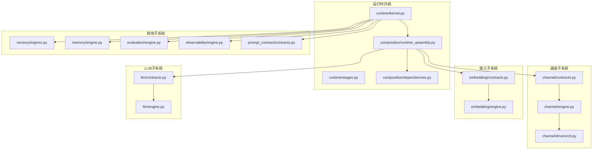
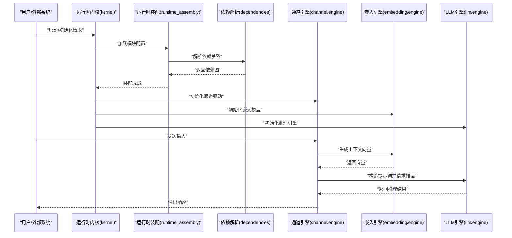
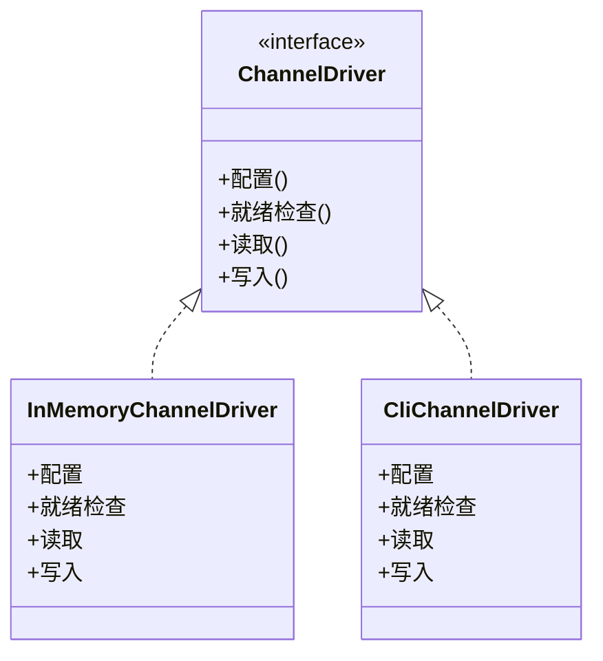
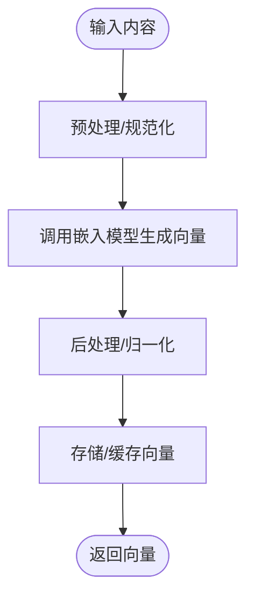
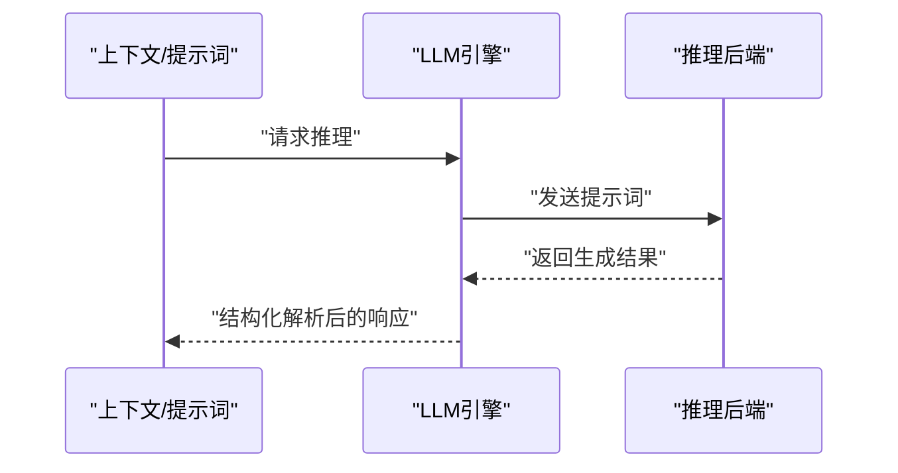
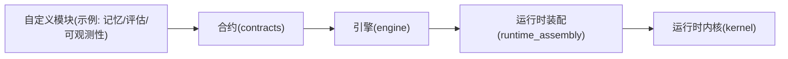
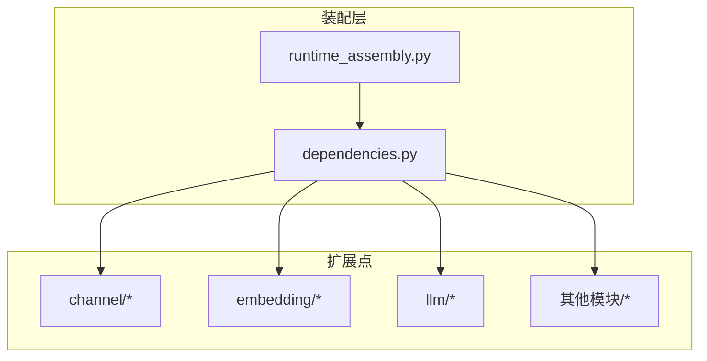

# 扩展点

<cite>
**本文引用的文件**
- [README.md](file://README.md)
- [API_AND_OPS_CONTRACT_GUIDE.md](file://helios_v2/docs/API_AND_OPS_CONTRACT_GUIDE.md)
- [ARCHITECTURE_BOUNDARIES.md](file://helios_v2/docs/ARCHITECTURE_BOUNDARIES.md)
- [brain.mmd](file://helios_v2/docs/brain.mmd)
- [channel/contracts.py](file://helios_v2/src/helios_v2/channel/contracts.py)
- [channel/engine.py](file://helios_v2/src/helios_v2/channel/engine.py)
- [channel/drivers/cli.py](file://helios_v2/src/helios_v2/channel/drivers/cli.py)
- [embedding/contracts.py](file://helios_v2/src/helios_v2/embedding/contracts.py)
- [embedding/engine.py](file://helios_v2/src/helios_v2/embedding/engine.py)
- [llm/contracts.py](file://helios_v2/src/helios_v2/llm/contracts.py)
- [llm/engine.py](file://helios_v2/src/helios_v2/llm/engine.py)
- [composition/runtime_assembly.py](file://helios_v2/src/helios_v2/composition/runtime_assembly.py)
- [composition/dependencies.py](file://helios_v2/src/helios_v2/composition/dependencies.py)
- [runtime/kernel.py](file://helios_v2/src/helios_v2/runtime/kernel.py)
- [runtime/stages.py](file://helios_v2/src/helios_v2/runtime/stages.py)
- [prompt_contract/contracts.py](file://helios_v2/src/helios_v2/prompt_contract/contracts.py)
- [sensory/ingress.py](file://helios_v2/src/helios_v2/sensory/ingress.py)
- [memory/engine.py](file://helios_v2/src/helios_v2/memory/engine.py)
- [evaluation/engine.py](file://helios_v2/src/helios_v2/evaluation/engine.py)
- [observability/engine.py](file://helios_v2/src/helios_v2/observability/engine.py)
- [tests/test_channel_contracts.py](file://helios_v2/tests/test_channel_contracts.py)
- [tests/test_channel_engine.py](file://helios_v2/tests/test_channel_engine.py)
- [tests/test_llm_contracts.py](file://helios_v2/tests/test_llm_contracts.py)
- [tests/test_llm_engine.py](file://helios_v2/tests/test_llm_engine.py)
- [tests/test_embedding_contracts.py](file://helios_v2/tests/test_embedding_contracts.py)
- [tests/test_embedding_engine.py](file://helios_v2/tests/test_embedding_engine.py)
- [tests/test_runtime_composition.py](file://helios_v2/tests/test_runtime_composition.py)
- [tests/test_runtime_kernel_observability.py](file://helios_v2/tests/test_runtime_kernel_observability.py)
</cite>

## 目录
1. [简介](#简介)
2. [项目结构](#项目结构)
3. [核心组件](#核心组件)
4. [架构总览](#架构总览)
5. [详细组件分析](#详细组件分析)
6. [依赖关系分析](#依赖关系分析)
7. [性能考量](#性能考量)
8. [故障排查指南](#故障排查指南)
9. [结论](#结论)
10. [附录](#附录)

## 简介
本文件面向希望在Helios v2中进行扩展开发的工程师与研究者，提供完整且可操作的扩展点参考。内容覆盖以下扩展维度：
- 通道驱动扩展：自定义输入/输出通道（如CLI、语音、视觉等）
- 嵌入模型扩展：替换或增强向量表示生成能力
- LLM推理扩展：替换或增强大语言模型推理引擎
- 自定义模块集成：通过合约与装配机制集成新的认知/行为模块

文档同时阐述扩展点的注册机制、生命周期管理、版本兼容性策略，并给出最佳实践、性能优化建议与安全注意事项。

## 项目结构
Helios v2采用按“功能域+合约-引擎”分层的模块化组织方式，核心扩展点分布在以下子系统：
- 通道子系统：负责外部交互与内部表达的桥接
- 嵌入子系统：负责语义向量化与相似度计算
- LLM子系统：负责基于提示词的推理与生成
- 运行时内核与装配：负责模块编排、依赖注入与生命周期管理
- 其他认知/行为子系统：记忆、评估、可观测性等

图表来源
- [runtime/kernel.py](file://helios_v2/src/helios_v2/runtime/kernel.py)
- [runtime/stages.py](file://helios_v2/src/helios_v2/runtime/stages.py)
- [composition/runtime_assembly.py](file://helios_v2/src/helios_v2/composition/runtime_assembly.py)
- [composition/dependencies.py](file://helios_v2/src/helios_v2/composition/dependencies.py)
- [channel/contracts.py](file://helios_v2/src/helios_v2/channel/contracts.py)
- [channel/engine.py](file://helios_v2/src/helios_v2/channel/engine.py)
- [channel/drivers/cli.py](file://helios_v2/src/helios_v2/channel/drivers/cli.py)
- [embedding/contracts.py](file://helios_v2/src/helios_v2/embedding/contracts.py)
- [embedding/engine.py](file://helios_v2/src/helios_v2/embedding/engine.py)
- [llm/contracts.py](file://helios_v2/src/helios_v2/llm/contracts.py)
- [llm/engine.py](file://helios_v2/src/helios_v2/llm/engine.py)
- [sensory/ingress.py](file://helios_v2/src/helios_v2/sensory/ingress.py)
- [memory/engine.py](file://helios_v2/src/helios_v2/memory/engine.py)
- [evaluation/engine.py](file://helios_v2/src/helios_v2/evaluation/engine.py)
- [observability/engine.py](file://helios_v2/src/helios_v2/observability/engine.py)
- [prompt_contract/contracts.py](file://helios_v2/src/helios_v2/prompt_contract/contracts.py)

章节来源
- [README.md](file://README.md)
- [API_AND_OPS_CONTRACT_GUIDE.md](file://helios_v2/docs/API_AND_OPS_CONTRACT_GUIDE.md)
- [ARCHITECTURE_BOUNDARIES.md](file://helios_v2/docs/ARCHITECTURE_BOUNDARIES.md)
- [brain.mmd](file://helios_v2/docs/brain.mmd)

## 核心组件
本节概述四大扩展方向的核心构件与职责边界。

- 通道驱动扩展
  - 合约与描述符：定义通道驱动的配置、状态与就绪报告
  - 引擎与驱动：实现通道驱动的具体行为，支持内存/CLI等
  - 集成点：通过运行时装配注册到内核

- 嵌入模型扩展
  - 合约：定义向量生成、相似度计算等接口
  - 引擎：实现具体嵌入逻辑，可替换第三方服务

- LLM推理扩展
  - 合约：定义提示词构建、调用协议与响应处理
  - 引擎：实现推理流程，可接入不同推理后端

- 自定义模块集成
  - 合约：明确输入/输出契约
  - 装配：通过依赖注入与运行时内核完成编排
  - 生命周期：由内核统一调度与观测

章节来源
- [channel/contracts.py](file://helios_v2/src/helios_v2/channel/contracts.py)
- [channel/engine.py](file://helios_v2/src/helios_v2/channel/engine.py)
- [embedding/contracts.py](file://helios_v2/src/helios_v2/embedding/contracts.py)
- [embedding/engine.py](file://helios_v2/src/helios_v2/embedding/engine.py)
- [llm/contracts.py](file://helios_v2/src/helios_v2/llm/contracts.py)
- [llm/engine.py](file://helios_v2/src/helios_v2/llm/engine.py)
- [composition/runtime_assembly.py](file://helios_v2/src/helios_v2/composition/runtime_assembly.py)
- [composition/dependencies.py](file://helios_v2/src/helios_v2/composition/dependencies.py)
- [runtime/kernel.py](file://helios_v2/src/helios_v2/runtime/kernel.py)

## 架构总览
下图展示了扩展点在运行时中的交互关系与数据流：

图表来源
- [runtime/kernel.py](file://helios_v2/src/helios_v2/runtime/kernel.py)
- [composition/runtime_assembly.py](file://helios_v2/src/helios_v2/composition/runtime_assembly.py)
- [composition/dependencies.py](file://helios_v2/src/helios_v2/composition/dependencies.py)
- [channel/engine.py](file://helios_v2/src/helios_v2/channel/engine.py)
- [embedding/engine.py](file://helios_v2/src/helios_v2/embedding/engine.py)
- [llm/engine.py](file://helios_v2/src/helios_v2/llm/engine.py)

## 详细组件分析

### 通道驱动扩展
通道驱动是Helios与外部世界交互的入口/出口。扩展目标包括：
- 新增输入通道（如语音识别、视觉输入）
- 新增输出通道（如TTS、动作执行）
- 替换现有驱动（如CLI驱动）

关键合约与实现要点：
- 合约定义了驱动的配置、状态与就绪报告，确保运行时可验证驱动可用性
- 引擎提供默认实现（如内存通道），便于测试与快速原型
- CLI驱动演示了最小可用驱动的实现模式

图表来源
- [channel/contracts.py](file://helios_v2/src/helios_v2/channel/contracts.py)
- [channel/engine.py](file://helios_v2/src/helios_v2/channel/engine.py)
- [channel/drivers/cli.py](file://helios_v2/src/helios_v2/channel/drivers/cli.py)

扩展示例路径（不展示代码，仅提供定位）：
- 新建通道驱动：参考CLI驱动的实现模式，实现合约接口并注册到装配器
  - [channel/drivers/cli.py](file://helios_v2/src/helios_v2/channel/drivers/cli.py)
  - [channel/contracts.py](file://helios_v2/src/helios_v2/channel/contracts.py)
- 注册与装配：在运行时装配中声明驱动并注入到内核
  - [composition/runtime_assembly.py](file://helios_v2/src/helios_v2/composition/runtime_assembly.py)
  - [runtime/kernel.py](file://helios_v2/src/helios_v2/runtime/kernel.py)

章节来源
- [channel/contracts.py](file://helios_v2/src/helios_v2/channel/contracts.py)
- [channel/engine.py](file://helios_v2/src/helios_v2/channel/engine.py)
- [channel/drivers/cli.py](file://helios_v2/src/helios_v2/channel/drivers/cli.py)
- [tests/test_channel_contracts.py](file://helios_v2/tests/test_channel_contracts.py)
- [tests/test_channel_engine.py](file://helios_v2/tests/test_channel_engine.py)

### 嵌入模型扩展
嵌入子系统负责将文本/多模态内容映射到向量空间，支撑检索、聚类与相似度计算等任务。

扩展目标：
- 替换嵌入模型供应商（如从本地替换为云服务）
- 增强预处理/后处理逻辑（如规范化、降噪）

图表来源
- [embedding/contracts.py](file://helios_v2/src/helios_v2/embedding/contracts.py)
- [embedding/engine.py](file://helios_v2/src/helios_v2/embedding/engine.py)

扩展示例路径（不展示代码，仅提供定位）：
- 实现新的嵌入引擎：遵循合约接口，实现向量生成与相似度计算
  - [embedding/contracts.py](file://helios_v2/src/helios_v2/embedding/contracts.py)
  - [embedding/engine.py](file://helios_v2/src/helios_v2/embedding/engine.py)
- 在运行时装配中替换默认实现
  - [composition/runtime_assembly.py](file://helios_v2/src/helios_v2/composition/runtime_assembly.py)
  - [composition/dependencies.py](file://helios_v2/src/helios_v2/composition/dependencies.py)

章节来源
- [embedding/contracts.py](file://helios_v2/src/helios_v2/embedding/contracts.py)
- [embedding/engine.py](file://helios_v2/src/helios_v2/embedding/engine.py)
- [tests/test_embedding_contracts.py](file://helios_v2/tests/test_embedding_contracts.py)
- [tests/test_embedding_engine.py](file://helios_v2/tests/test_embedding_engine.py)

### LLM推理扩展
LLM子系统负责将上下文与提示词转换为结构化输出，支持多轮对话、规划与决策。

扩展目标：
- 切换推理后端（如从OpenAI切换到本地模型）
- 自定义提示词构建策略与输出解析
- 增加重试、限流与可观测性

图表来源
- [llm/contracts.py](file://helios_v2/src/helios_v2/llm/contracts.py)
- [llm/engine.py](file://helios_v2/src/helios_v2/llm/engine.py)

扩展示例路径（不展示代码，仅提供定位）：
- 实现新的推理引擎：遵循合约接口，封装调用协议与错误处理
  - [llm/contracts.py](file://helios_v2/src/helios_v2/llm/contracts.py)
  - [llm/engine.py](file://helios_v2/src/helios_v2/llm/engine.py)
- 在运行时装配中替换默认实现
  - [composition/runtime_assembly.py](file://helios_v2/src/helios_v2/composition/runtime_assembly.py)
  - [composition/dependencies.py](file://helios_v2/src/helios_v2/composition/dependencies.py)

章节来源
- [llm/contracts.py](file://helios_v2/src/helios_v2/llm/contracts.py)
- [llm/engine.py](file://helios_v2/src/helios_v2/llm/engine.py)
- [tests/test_llm_contracts.py](file://helios_v2/tests/test_llm_contracts.py)
- [tests/test_llm_engine.py](file://helios_v2/tests/test_llm_engine.py)

### 自定义模块集成接口
除上述三大扩展方向外，还可集成新的认知/行为模块（如记忆、评估、可观测性等）。集成遵循统一的合约-引擎模式，并通过运行时内核与装配器完成编排。

图表来源
- [memory/engine.py](file://helios_v2/src/helios_v2/memory/engine.py)
- [evaluation/engine.py](file://helios_v2/src/helios_v2/evaluation/engine.py)
- [observability/engine.py](file://helios_v2/src/helios_v2/observability/engine.py)
- [composition/runtime_assembly.py](file://helios_v2/src/helios_v2/composition/runtime_assembly.py)
- [runtime/kernel.py](file://helios_v2/src/helios_v2/runtime/kernel.py)

扩展示例路径（不展示代码，仅提供定位）：
- 定义模块合约与引擎：参考现有模块的实现模式
  - [prompt_contract/contracts.py](file://helios_v2/src/helios_v2/prompt_contract/contracts.py)
  - [sensory/ingress.py](file://helios_v2/src/helios_v2/sensory/ingress.py)
- 在装配器中注册模块
  - [composition/runtime_assembly.py](file://helios_v2/src/helios_v2/composition/runtime_assembly.py)
  - [composition/dependencies.py](file://helios_v2/src/helios_v2/composition/dependencies.py)

章节来源
- [memory/engine.py](file://helios_v2/src/helios_v2/memory/engine.py)
- [evaluation/engine.py](file://helios_v2/src/helios_v2/evaluation/engine.py)
- [observability/engine.py](file://helios_v2/src/helios_v2/observability/engine.py)
- [prompt_contract/contracts.py](file://helios_v2/src/helios_v2/prompt_contract/contracts.py)
- [sensory/ingress.py](file://helios_v2/src/helios_v2/sensory/ingress.py)
- [composition/runtime_assembly.py](file://helios_v2/src/helios_v2/composition/runtime_assembly.py)
- [composition/dependencies.py](file://helios_v2/src/helios_v2/composition/dependencies.py)
- [runtime/kernel.py](file://helios_v2/src/helios_v2/runtime/kernel.py)

## 依赖关系分析
运行时装配与依赖解析负责将各扩展点组合为可运行的整体。关键关系如下：

图表来源
- [composition/runtime_assembly.py](file://helios_v2/src/helios_v2/composition/runtime_assembly.py)
- [composition/dependencies.py](file://helios_v2/src/helios_v2/composition/dependencies.py)

章节来源
- [composition/runtime_assembly.py](file://helios_v2/src/helios_v2/composition/runtime_assembly.py)
- [composition/dependencies.py](file://helios_v2/src/helios_v2/composition/dependencies.py)
- [tests/test_runtime_composition.py](file://helios_v2/tests/test_runtime_composition.py)

## 性能考量
- 模块解耦与延迟初始化：通过合约与装配器实现按需加载，降低启动开销
- 缓存与批处理：对嵌入与LLM调用实施缓存与批量处理，减少重复计算与网络往返
- 并发与限流：在通道与LLM引擎中引入并发控制与速率限制，避免资源争用
- 观测与指标：利用可观测性模块记录关键指标，辅助性能调优
- 测试与回归：通过单元与集成测试保障扩展点的稳定性与性能基线

## 故障排查指南
- 通道驱动问题
  - 检查驱动就绪状态与配置参数
  - 对比默认驱动行为，逐步定位差异
  - 参考测试用例验证合约一致性
  - 参考路径：[tests/test_channel_contracts.py](file://helios_v2/tests/test_channel_contracts.py)，[tests/test_channel_engine.py](file://helios_v2/tests/test_channel_engine.py)

- 嵌入模型问题
  - 校验输入预处理与输出后处理逻辑
  - 对比不同实现的向量质量与性能
  - 参考路径：[tests/test_embedding_contracts.py](file://helios_v2/tests/test_embedding_contracts.py)，[tests/test_embedding_engine.py](file://helios_v2/tests/test_embedding_engine.py)

- LLM推理问题
  - 校验提示词构建与输出解析
  - 检查重试、超时与限流策略
  - 参考路径：[tests/test_llm_contracts.py](file://helios_v2/tests/test_llm_contracts.py)，[tests/test_llm_engine.py](file://helios_v2/tests/test_llm_engine.py)

- 运行时装配问题
  - 校验依赖解析与模块注册顺序
  - 使用内核可观测性确认模块生命周期
  - 参考路径：[tests/test_runtime_composition.py](file://helios_v2/tests/test_runtime_composition.py)，[tests/test_runtime_kernel_observability.py](file://helios_v2/tests/test_runtime_kernel_observability.py)

章节来源
- [tests/test_channel_contracts.py](file://helios_v2/tests/test_channel_contracts.py)
- [tests/test_channel_engine.py](file://helios_v2/tests/test_channel_engine.py)
- [tests/test_embedding_contracts.py](file://helios_v2/tests/test_embedding_contracts.py)
- [tests/test_embedding_engine.py](file://helios_v2/tests/test_embedding_engine.py)
- [tests/test_llm_contracts.py](file://helios_v2/tests/test_llm_contracts.py)
- [tests/test_llm_engine.py](file://helios_v2/tests/test_llm_engine.py)
- [tests/test_runtime_composition.py](file://helios_v2/tests/test_runtime_composition.py)
- [tests/test_runtime_kernel_observability.py](file://helios_v2/tests/test_runtime_kernel_observability.py)

## 结论
Helios v2通过清晰的合约-引擎分层与运行时装配机制，为通道驱动、嵌入模型、LLM推理与自定义模块提供了高内聚、低耦合的扩展框架。开发者可依据本文档的扩展点与最佳实践，快速实现定制化能力，并在保证性能与可观测性的前提下，实现平滑演进与版本兼容。

## 附录
- 架构边界与所有权说明：帮助明确扩展范围与责任边界
- API与运维契约指南：规范扩展的接口契约与运维要求
- 脑图与设计文档：提供高层架构视图与模块关系说明

章节来源
- [ARCHITECTURE_BOUNDARIES.md](file://helios_v2/docs/ARCHITECTURE_BOUNDARIES.md)
- [API_AND_OPS_CONTRACT_GUIDE.md](file://helios_v2/docs/API_AND_OPS_CONTRACT_GUIDE.md)
- [brain.mmd](file://helios_v2/docs/brain.mmd)