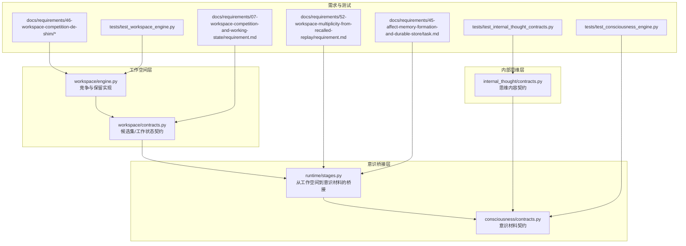
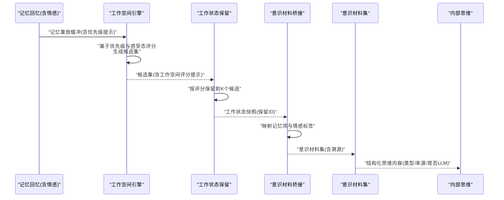
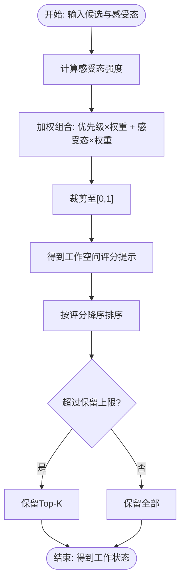
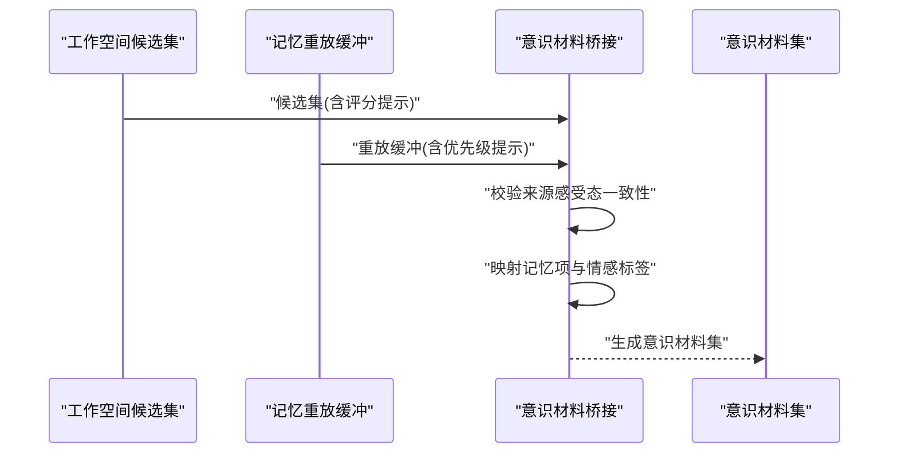
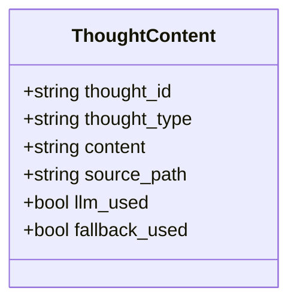
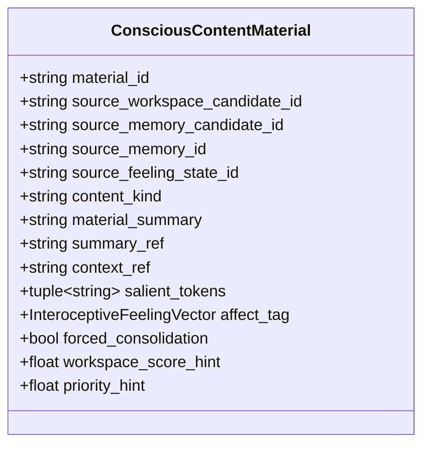

# 工作空间数据结构

<cite>
**本文引用的文件**
- [workspace/engine.py](file://helios_v2/src/helios_v2/workspace/engine.py)
- [workspace/contracts.py](file://helios_v2/src/helios_v2/workspace/contracts.py)
- [consciousness/contracts.py](file://helios_v2/src/helios_v2/consciousness/contracts.py)
- [internal_thought/contracts.py](file://helios_v2/src/helios_v2/internal_thought/contracts.py)
- [runtime/stages.py](file://helios_v2/src/helios_v2/runtime/stages.py)
- [docs/requirements/46-workspace-competition-de-shim/design.md](file://helios_v2/docs/requirements/46-workspace-competition-de-shim/design.md)
- [docs/requirements/46-workspace-competition-de-shim/requirement.md](file://helios_v2/docs/requirements/46-workspace-competition-de-shim/requirement.md)
- [docs/requirements/07-workspace-competition-and-working-state/requirement.md](file://helios_v2/docs/requirements/07-workspace-competition-and-working-state/requirement.md)
- [docs/requirements/52-workspace-multiplicity-from-recalled-replay/requirement.md](file://helios_v2/docs/requirements/52-workspace-multiplicity-from-recalled-replay/requirement.md)
- [docs/requirements/45-affect-memory-formation-and-durable-store/task.md](file://helios_v2/docs/requirements/45-affect-memory-formation-and-durable-store/task.md)
- [tests/test_workspace_engine.py](file://helios_v2/tests/test_workspace_engine.py)
- [tests/test_consciousness_engine.py](file://helios_v2/tests/test_consciousness_engine.py)
- [tests/test_internal_thought_contracts.py](file://helios_v2/tests/test_internal_thought_contracts.py)
</cite>

## 目录
1. [引言](#引言)
2. [项目结构](#项目结构)
3. [核心组件](#核心组件)
4. [架构总览](#架构总览)
5. [详细组件分析](#详细组件分析)
6. [依赖关系分析](#依赖关系分析)
7. [性能考虑](#性能考虑)
8. [故障排查指南](#故障排查指南)
9. [结论](#结论)
10. [附录](#附录)

## 引言
本文件聚焦于Helios工作空间系统中的核心数据结构与流程，围绕以下主题展开：
- WorkspaceContent（工作空间候选集）与WorkingStateSnapshot（工作状态快照）的结构化定义与约束
- ThoughtContent（思维内容）的类型化承载与校验
- AttentionWeight（注意力权重）在竞争评分与保留策略中的作用机制
- 工作空间竞争算法的数据支撑与实现边界
- 工作空间状态的序列化格式、并发访问控制与一致性保证
- 思维内容的分类体系、优先级计算与动态调整规则
- 工作空间数据的内存管理、垃圾回收与性能优化策略

## 项目结构
Helios v2中，工作空间相关能力由“workspace”“consciousness”“internal_thought”“runtime”等模块协同实现，并通过需求文档明确边界与契约。

**图表来源**
- [workspace/engine.py:349-430](file://helios_v2/src/helios_v2/workspace/engine.py#L349-L430)
- [workspace/contracts.py](file://helios_v2/src/helios_v2/workspace/contracts.py)
- [consciousness/contracts.py:49-74](file://helios_v2/src/helios_v2/consciousness/contracts.py#L49-L74)
- [runtime/stages.py:754-825](file://helios_v2/src/helios_v2/runtime/stages.py#L754-L825)
- [docs/requirements/46-workspace-competition-de-shim/design.md:26-52](file://helios_v2/docs/requirements/46-workspace-competition-de-shim/design.md#L26-L52)
- [docs/requirements/07-workspace-competition-and-working-state/requirement.md:88-95](file://helios_v2/docs/requirements/07-workspace-competition-and-working-state/requirement.md#L88-L95)
- [docs/requirements/52-workspace-multiplicity-from-recalled-replay/requirement.md:14-18](file://helios_v2/docs/requirements/52-workspace-multiplicity-from-recalled-replay/requirement.md#L14-L18)
- [docs/requirements/45-affect-memory-formation-and-durable-store/task.md:56-65](file://helios_v2/docs/requirements/45-affect-memory-formation-and-durable-store/task.md#L56-L65)

**章节来源**
- [workspace/engine.py:349-430](file://helios_v2/src/helios_v2/workspace/engine.py#L349-L430)
- [workspace/contracts.py](file://helios_v2/src/helios_v2/workspace/contracts.py)
- [consciousness/contracts.py:49-74](file://helios_v2/src/helios_v2/consciousness/contracts.py#L49-L74)
- [runtime/stages.py:754-825](file://helios_v2/src/helios_v2/runtime/stages.py#L754-L825)
- [docs/requirements/46-workspace-competition-de-shim/design.md:26-52](file://helios_v2/docs/requirements/46-workspace-competition-de-shim/design.md#L26-L52)
- [docs/requirements/07-workspace-competition-and-working-state/requirement.md:88-95](file://helios_v2/docs/requirements/07-workspace-competition-and-working-state/requirement.md#L88-L95)
- [docs/requirements/52-workspace-multiplicity-from-recalled-replay/requirement.md:14-18](file://helios_v2/docs/requirements/52-workspace-multiplicity-from-recalled-replay/requirement.md#L14-L18)
- [docs/requirements/45-affect-memory-formation-and-durable-store/task.md:56-65](file://helios_v2/docs/requirements/45-affect-memory-formation-and-durable-store/task.md#L56-L65)

## 核心组件
本节对关键数据模型进行逐项解析，包括字段语义、约束条件、复杂度与典型用途。

- WorkspaceCandidate（工作空间候选）
  - 字段要点：候选标识、来源记忆候选标识、来源感受态标识、优先级提示、强制巩固标志、工作空间评分提示
  - 约束：必须具备非空标识；评分提示用于后续排序与保留
  - 复杂度：构建过程线性于候选数量
  - 用途：作为工作空间竞争的输入单元

- WorkspaceCandidateSet（工作空间候选集）
  - 字段要点：集合标识、来源感受态标识、候选元组、运行tick标识
  - 约束：集合内候选唯一且与来源感受态一致
  - 复杂度：查询按候选ID映射为O(n)
  - 用途：跨阶段传递的竞争结果载体

- WorkingStateSnapshot（工作状态快照）
  - 字段要点：状态标识、保留的候选ID集合、来源工作空间候选集标识、来源感受态标识、运行tick标识
  - 约束：保留集合必须来自同一候选集；非空候选集保证非空工作状态
  - 复杂度：保留选择按评分降序O(n log n)
  - 用途：作为意识层的注意力瓶颈输入

- ConsciousContentMaterial（意识材料）
  - 字段要点：材料标识、来源工作空间候选标识、来源记忆候选标识、来源记忆标识、来源感受态标识、内容类型、摘要、引用、显著词元、情感标签、强制巩固标志、工作空间评分提示、优先级提示
  - 约束：所有标识非空；情感标签与评分提示需在有效范围
  - 复杂度：构建O(n)，n为候选数
  - 用途：承载可报告意识内容的完整溯源信息

- ConsciousContentMaterialSet（意识材料集）
  - 字段要点：集合标识、来源工作空间候选集标识、来源工作状态标识、材料元组、运行tick标识
  - 约束：材料集与工作状态保持一致的来源关系
  - 复杂度：遍历O(n)
  - 用途：一次循环的意识材料输出

- ThoughtContent（思维内容）
  - 字段要点：思维标识、思维类型、内容文本、来源路径、是否使用LLM、是否使用回退
  - 约束：标识、类型、内容与来源路径均非空
  - 复杂度：承载O(1)
  - 用途：内部思维的结构化输出

**章节来源**
- [workspace/engine.py:349-430](file://helios_v2/src/helios_v2/workspace/engine.py#L349-L430)
- [workspace/engine.py:396-430](file://helios_v2/src/helios_v2/workspace/engine.py#L396-L430)
- [workspace/contracts.py](file://helios_v2/src/helios_v2/workspace/contracts.py)
- [consciousness/contracts.py:49-74](file://helios_v2/src/helios_v2/consciousness/contracts.py#L49-L74)
- [runtime/stages.py:754-825](file://helios_v2/src/helios_v2/runtime/stages.py#L754-L825)
- [internal_thought/contracts.py:116-135](file://helios_v2/src/helios_v2/internal_thought/contracts.py#L116-L135)

## 架构总览
下图展示从记忆回忆到工作空间竞争、再到意识材料生成与思维内容产出的整体数据流。

**图表来源**
- [workspace/engine.py:349-430](file://helios_v2/src/helios_v2/workspace/engine.py#L349-L430)
- [workspace/engine.py:396-430](file://helios_v2/src/helios_v2/workspace/engine.py#L396-L430)
- [runtime/stages.py:754-825](file://helios_v2/src/helios_v2/runtime/stages.py#L754-L825)
- [consciousness/contracts.py:49-74](file://helios_v2/src/helios_v2/consciousness/contracts.py#L49-L74)
- [internal_thought/contracts.py:116-135](file://helios_v2/src/helios_v2/internal_thought/contracts.py#L116-L135)

## 详细组件分析

### 工作空间竞争与保留（AttentionWeight与Score）
- 竞争评分函数
  - 权重构成：优先级权重与感受态权重
  - 感受态评分：综合唤醒、紧张与痛苦倾向，映射至单位区间
  - 候选评分：加权求和后裁剪至[0,1]
- 保留策略
  - 采用有界保留（BoundedAttentionRetentionPath），按评分降序选取Top-K
  - 确保非空候选集不产生空工作状态，保留ID集合严格来自候选集
  - 确定性tie-break以满足契约要求

**图表来源**
- [workspace/engine.py:349-430](file://helios_v2/src/helios_v2/workspace/engine.py#L349-L430)
- [workspace/engine.py:396-430](file://helios_v2/src/helios_v2/workspace/engine.py#L396-L430)
- [docs/requirements/46-workspace-competition-de-shim/design.md:26-52](file://helios_v2/docs/requirements/46-workspace-competition-de-shim/design.md#L26-L52)
- [docs/requirements/46-workspace-competition-de-shim/requirement.md:28-36](file://helios_v2/docs/requirements/46-workspace-competition-de-shim/requirement.md#L28-L36)

**章节来源**
- [workspace/engine.py:349-430](file://helios_v2/src/helios_v2/workspace/engine.py#L349-L430)
- [workspace/engine.py:396-430](file://helios_v2/src/helios_v2/workspace/engine.py#L396-L430)
- [docs/requirements/46-workspace-competition-de-shim/design.md:26-52](file://helios_v2/docs/requirements/46-workspace-competition-de-shim/design.md#L26-L52)
- [docs/requirements/46-workspace-competition-de-shim/requirement.md:28-36](file://helios_v2/docs/requirements/46-workspace-competition-de-shim/requirement.md#L28-L36)

### 从工作空间到意识材料（ConsciousContentMaterial）
- 映射关系
  - 工作空间候选 → 记忆重放缓冲候选 → 记忆项（含内容与情感标签）
  - 生成意识材料时，严格校验来源感受态一致性与映射完整性
- 材料属性
  - 内容类型、摘要、上下文引用、显著词元、情感标签、强制巩固标志、评分与优先级提示均沿用上游
- 产物形态
  - ConsciousContentMaterialSet按循环tick生成，供意识层消费

**图表来源**
- [runtime/stages.py:754-825](file://helios_v2/src/helios_v2/runtime/stages.py#L754-L825)
- [consciousness/contracts.py:49-74](file://helios_v2/src/helios_v2/consciousness/contracts.py#L49-L74)

**章节来源**
- [runtime/stages.py:754-825](file://helios_v2/src/helios_v2/runtime/stages.py#L754-L825)
- [consciousness/contracts.py:49-74](file://helios_v2/src/helios_v2/consciousness/contracts.py#L49-L74)

### 思维内容（ThoughtContent）的分类与来源
- 结构化承载
  - 思维标识、类型、内容文本、来源路径、是否使用LLM、是否使用回退
- 分类体系
  - 类型字段用于区分不同思维模式（如刺激反应思维等）
- 动态调整
  - 是否使用LLM与回退取决于当前阶段的决策与可用资源

**图表来源**
- [internal_thought/contracts.py:116-135](file://helios_v2/src/helios_v2/internal_thought/contracts.py#L116-L135)

**章节来源**
- [internal_thought/contracts.py:116-135](file://helios_v2/src/helios_v2/internal_thought/contracts.py#L116-L135)
- [tests/test_internal_thought_contracts.py:30-38](file://helios_v2/tests/test_internal_thought_contracts.py#L30-L38)

### 数据模型与契约（ConsciousContentMaterial）
- 关键字段与约束
  - 所有标识非空；情感标签与评分提示在有效范围；强制巩固标志与评分提示沿用上游
- 证明链
  - 材料集保留完整的来源链：工作空间候选、记忆候选、记忆项、感受态
- 无私有穿透
  - 意识层仅消费公开材料，不直接访问内部阶段细节

**图表来源**
- [consciousness/contracts.py:49-74](file://helios_v2/src/helios_v2/consciousness/contracts.py#L49-L74)

**章节来源**
- [consciousness/contracts.py:49-74](file://helios_v2/src/helios_v2/consciousness/contracts.py#L49-L74)
- [docs/requirements/07-workspace-competition-and-working-state/requirement.md:88-95](file://helios_v2/docs/requirements/07-workspace-competition-and-working-state/requirement.md#L88-L95)

## 依赖关系分析
- 组件耦合
  - 工作空间引擎与保留路径强耦合，评分与保留共同决定注意力瓶颈
  - 意识材料桥接依赖工作空间候选集与记忆重放缓冲的正确映射
- 外部依赖
  - 感受态提供情感强度信号，作为注意力权重的一部分
  - 记忆系统提供重放缓冲与情感标签，作为评分与材料生成的基础
- 循环依赖规避
  - 通过契约与阶段化执行避免循环调用

**图表来源**
- [workspace/engine.py:349-430](file://helios_v2/src/helios_v2/workspace/engine.py#L349-L430)
- [workspace/contracts.py](file://helios_v2/src/helios_v2/workspace/contracts.py)
- [runtime/stages.py:754-825](file://helios_v2/src/helios_v2/runtime/stages.py#L754-L825)
- [consciousness/contracts.py:49-74](file://helios_v2/src/helios_v2/consciousness/contracts.py#L49-L74)
- [internal_thought/contracts.py:116-135](file://helios_v2/src/helios_v2/internal_thought/contracts.py#L116-L135)

**章节来源**
- [workspace/engine.py:349-430](file://helios_v2/src/helios_v2/workspace/engine.py#L349-L430)
- [runtime/stages.py:754-825](file://helios_v2/src/helios_v2/runtime/stages.py#L754-L825)
- [consciousness/contracts.py:49-74](file://helios_v2/src/helios_v2/consciousness/contracts.py#L49-L74)
- [internal_thought/contracts.py:116-135](file://helios_v2/src/helios_v2/internal_thought/contracts.py#L116-L135)

## 性能考虑
- 时间复杂度
  - 竞争评分：O(n)
  - 排序与保留：O(n log n)，其中n为候选数
  - 材料桥接：O(n)
- 空间复杂度
  - 候选集与工作状态均为线性规模；材料集随候选数线性增长
- 优化策略
  - 评分与保留分离，便于参数学习与热更新
  - 保留上限固定，降低后续阶段处理压力
  - 材料生成阶段复用上游映射，减少重复计算
- 内存管理与GC
  - 使用不可变数据结构（frozen dataclass）降低拷贝成本
  - 通过阶段化输出与短生命周期对象，配合Python GC进行回收
- 并发与一致性
  - 当前实现为单线程循环；若引入并发，建议：
    - 使用不可变数据结构与只读共享
    - 在阶段边界进行显式锁或无锁队列保护
    - 通过版本号或时间戳确保跨阶段一致性

[本节为通用性能指导，不直接分析具体文件]

## 故障排查指南
- 常见错误与定位
  - 来源感受态不一致：检查工作空间候选集与记忆重放缓冲的来源感受态是否一致
  - 映射缺失：确认每个工作空间候选都能映射到对应的重放缓冲候选与记忆项
  - 校验失败：检查标识非空、评分与情感标签范围、强制巩固标志等
- 测试验证
  - 使用工作空间引擎与意识材料的测试用例，覆盖边界场景（空候选集、相同评分的tie-break、强制巩固候选未被保留等）

**章节来源**
- [runtime/stages.py:754-825](file://helios_v2/src/helios_v2/runtime/stages.py#L754-L825)
- [tests/test_workspace_engine.py](file://helios_v2/tests/test_workspace_engine.py)
- [tests/test_consciousness_engine.py](file://helios_v2/tests/test_consciousness_engine.py)

## 结论
本文系统梳理了Helios工作空间系统中的核心数据结构与流程，明确了：
- 工作空间竞争评分与保留策略的实现边界与契约约束
- 从记忆到意识材料再到思维内容的完整数据链路
- 数据模型的字段语义、复杂度与一致性保障
- 序列化与并发控制的实践建议
这些内容为后续扩展（如参数学习、保留上限热更新、多阶段并发）提供了清晰的数据基础与实现参考。

[本节为总结性内容，不直接分析具体文件]

## 附录
- 相关需求与设计文档
  - 工作空间竞争与保留的职责划分与目标
  - 从回忆到工作空间再到意识材料的端到端要求
  - 情感记忆持久化与召回对工作空间多样性的影响
- 测试参考
  - 工作空间引擎与意识材料的测试用例，覆盖边界与一致性校验

**章节来源**
- [docs/requirements/46-workspace-competition-de-shim/design.md:26-52](file://helios_v2/docs/requirements/46-workspace-competition-de-shim/design.md#L26-L52)
- [docs/requirements/46-workspace-competition-de-shim/requirement.md:15-19](file://helios_v2/docs/requirements/46-workspace-competition-de-shim/requirement.md#L15-L19)
- [docs/requirements/52-workspace-multiplicity-from-recalled-replay/requirement.md:14-18](file://helios_v2/docs/requirements/52-workspace-multiplicity-from-recalled-replay/requirement.md#L14-L18)
- [docs/requirements/45-affect-memory-formation-and-durable-store/task.md:56-65](file://helios_v2/docs/requirements/45-affect-memory-formation-and-durable-store/task.md#L56-L65)
- [tests/test_workspace_engine.py](file://helios_v2/tests/test_workspace_engine.py)
- [tests/test_consciousness_engine.py](file://helios_v2/tests/test_consciousness_engine.py)