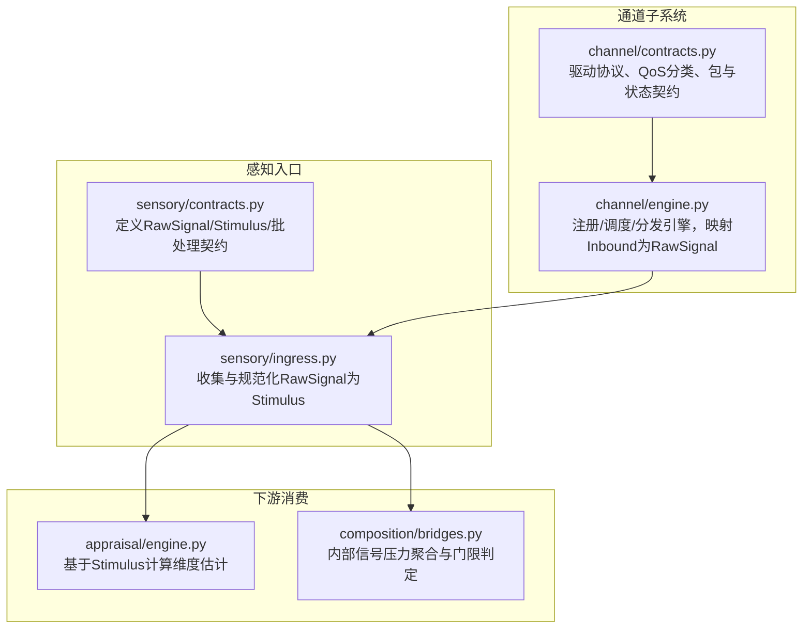
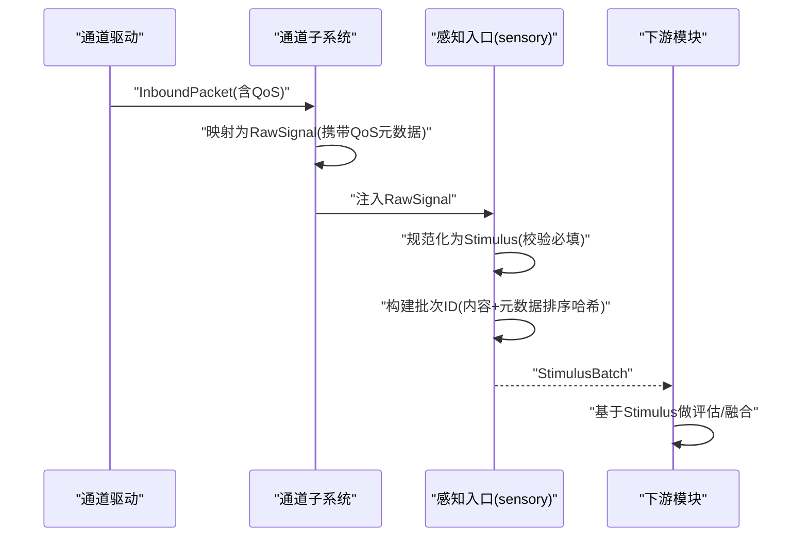
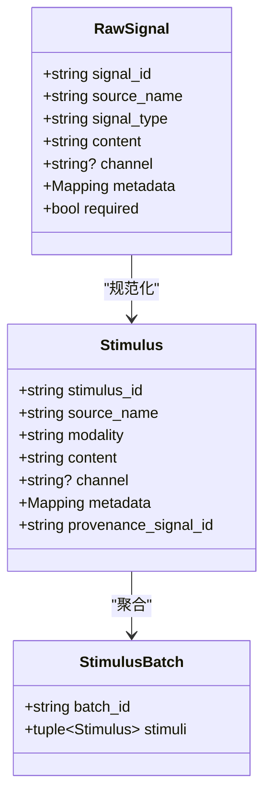
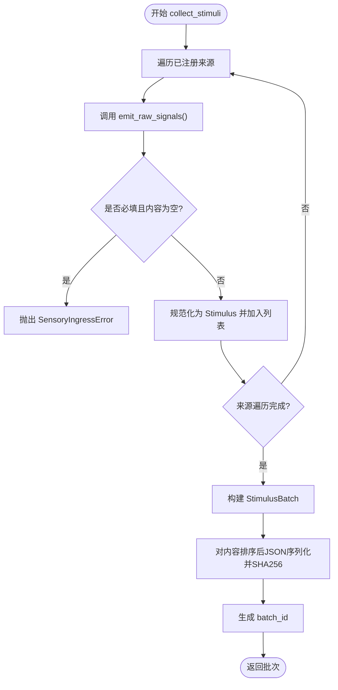
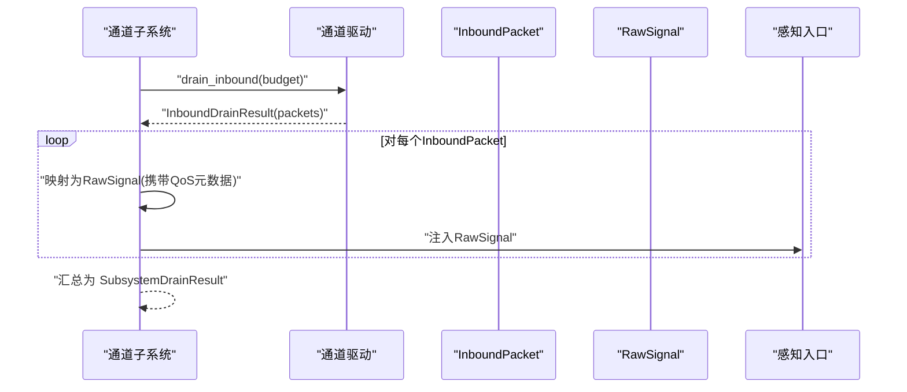
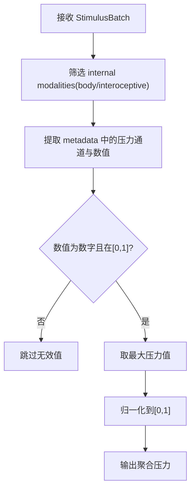
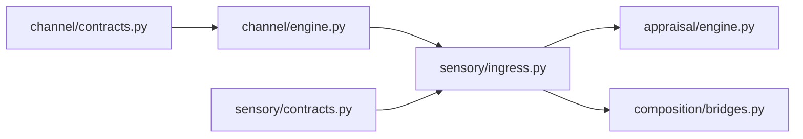

# 感知数据结构

<cite>
**本文档引用的文件**
- [sensory/contracts.py](file://helios_v2/src/helios_v2/sensory/contracts.py)
- [sensory/ingress.py](file://helios_v2/src/helios_v2/sensory/ingress.py)
- [channel/contracts.py](file://helios_v2/src/helios_v2/channel/contracts.py)
- [channel/engine.py](file://helios_v2/src/helios_v2/channel/engine.py)
- [test_sensory_ingress.py](file://helios_v2/tests/test_sensory_ingress.py)
- [test_channel_engine.py](file://helios_v2/tests/test_channel_engine.py)
- [test_interoceptive_feeling_contracts.py](file://helios_v2/tests/test_interoceptive_feeling_contracts.py)
- [test_interoceptive_feeling_engine.py](file://helios_v2/tests/test_interoceptive_feeling_engine.py)
- [appraisal/engine.py](file://helios_v2/src/helios_v2/appraisal/engine.py)
- [composition/bridges.py](file://helios_v2/src/helios_v2/composition/bridges.py)
- [channel/drivers/__init__.py](file://helios_v2/src/helios_v2/channel/drivers/__init__.py)
</cite>

## 目录
1. [简介](#简介)
2. [项目结构](#项目结构)
3. [核心组件](#核心组件)
4. [架构总览](#架构总览)
5. [详细组件分析](#详细组件分析)
6. [依赖分析](#依赖分析)
7. [性能考量](#性能考量)
8. [故障排查指南](#故障排查指南)
9. [结论](#结论)
10. [附录](#附录)

## 简介
本文件面向Helios感知系统，系统化梳理感知数据结构与协议，覆盖以下主题：
- 感知输入模型：Stimulus、SensoryInput、ChannelData的结构定义与语义边界
- 刺激类型与多模态融合：不同模态（如interoceptive、body、text）的规范与过滤
- 感知通道协议：RawSignal到Stimulus的规范化流程、批次去重与溯源
- 预处理规则、特征提取与质量控制：必填字段校验、内容空值处理、批次一致性哈希
- 标准化格式、传输协议与存储：JSON序列化、元数据冻结、批次ID生成
- 可扩展性设计：新通道接入方法、兼容性保障与跨模块契约

## 项目结构
感知相关代码主要分布在v2版本的sensory与channel子系统中，并通过测试用例验证契约与行为。

**图表来源**
- [sensory/contracts.py:26-138](file://helios_v2/src/helios_v2/sensory/contracts.py#L26-L138)
- [sensory/ingress.py:55-144](file://helios_v2/src/helios_v2/sensory/ingress.py#L55-L144)
- [channel/contracts.py:23-654](file://helios_v2/src/helios_v2/channel/contracts.py#L23-L654)
- [channel/engine.py:44-311](file://helios_v2/src/helios_v2/channel/engine.py#L44-L311)
- [appraisal/engine.py:470-507](file://helios_v2/src/helios_v2/appraisal/engine.py#L470-L507)
- [composition/bridges.py:1527-1560](file://helios_v2/src/helios_v2/composition/bridges.py#L1527-L1560)

**章节来源**
- [sensory/contracts.py:1-279](file://helios_v2/src/helios_v2/sensory/contracts.py#L1-L279)
- [sensory/ingress.py:1-207](file://helios_v2/src/helios_v2/sensory/ingress.py#L1-L207)
- [channel/contracts.py:1-654](file://helios_v2/src/helios_v2/channel/contracts.py#L1-L654)
- [channel/engine.py:1-593](file://helios_v2/src/helios_v2/channel/engine.py#L1-L593)

## 核心组件
- RawSignal：原始信号载体，携带来源标识、类型、内容、通道、元数据与必填标志
- Stimulus：规范化后的感知单元，包含来源、模态、内容、通道、元数据与溯源ID
- StimulusBatch：一次运行周期内的不可变刺激批次，具备唯一批次ID
- SensoryIngress：采集与规范化器，负责注册来源、校验必填项、构建批次ID
- ChannelDriver/ChannelSubsystem：通道驱动与框架，负责将Inbound包映射为RawSignal并注入sensory

**章节来源**
- [sensory/contracts.py:26-138](file://helios_v2/src/helios_v2/sensory/contracts.py#L26-L138)
- [sensory/ingress.py:77-144](file://helios_v2/src/helios_v2/sensory/ingress.py#L77-L144)
- [channel/contracts.py:540-654](file://helios_v2/src/helios_v2/channel/contracts.py#L540-L654)
- [channel/engine.py:66-311](file://helios_v2/src/helios_v2/channel/engine.py#L66-L311)

## 架构总览
感知数据流从各通道驱动的Inbound包开始，经通道框架映射为RawSignal，再由sensory ingress规范化为Stimulus并生成批次；下游模块（如appraisal、composition）消费Stimulus进行进一步处理。

**图表来源**
- [channel/engine.py:44-63](file://helios_v2/src/helios_v2/channel/engine.py#L44-L63)
- [channel/engine.py:189-247](file://helios_v2/src/helios_v2/channel/engine.py#L189-L247)
- [sensory/ingress.py:55-74](file://helios_v2/src/helios_v2/sensory/ingress.py#L55-L74)
- [sensory/ingress.py:32-52](file://helios_v2/src/helios_v2/sensory/ingress.py#L32-L52)
- [appraisal/engine.py:470-507](file://helios_v2/src/helios_v2/appraisal/engine.py#L470-L507)

## 详细组件分析

### 数据模型与契约
- RawSignal
  - 关键字段：signal_id、source_name、signal_type、content、channel、metadata、required
  - 冻结策略：metadata在构造后冻结为只读视图
  - 必填校验：required为True且content为空时触发错误
- Stimulus
  - 关键字段：stimulus_id、source_name、modality、content、channel、metadata、provenance_signal_id
  - 冻结策略：metadata在构造后冻结为只读视图
  - 规范化：由RawSignal映射而来，保留原始signal_id作为溯源
- StimulusBatch
  - 关键字段：batch_id、stimuli
  - 去重与稳定性：基于内容与元数据排序后的JSON序列化进行SHA256哈希，确保相同内容产生相同批次ID

**图表来源**
- [sensory/contracts.py:26-85](file://helios_v2/src/helios_v2/sensory/contracts.py#L26-L85)

**章节来源**
- [sensory/contracts.py:21-70](file://helios_v2/src/helios_v2/sensory/contracts.py#L21-L70)

### 感知入口（SensoryIngress）
- 注册来源：按source_name唯一注册，重复名称抛出异常
- 收集与规范化：遍历所有来源发出的RawSignal，对必填字段进行严格校验；可选空内容跳过但不隐藏
- 批次ID生成：对Stimulus列表按来源与ID排序后序列化，使用SHA256生成稳定批次ID
- 操作记录：提供IngestSignalOp与PublishStimulusBatchOp用于审计与编排

**图表来源**
- [sensory/ingress.py:114-144](file://helios_v2/src/helios_v2/sensory/ingress.py#L114-L144)
- [sensory/ingress.py:55-74](file://helios_v2/src/helios_v2/sensory/ingress.py#L55-L74)
- [sensory/ingress.py:32-52](file://helios_v2/src/helios_v2/sensory/ingress.py#L32-L52)

**章节来源**
- [sensory/ingress.py:77-207](file://helios_v2/src/helios_v2/sensory/ingress.py#L77-L207)

### 通道协议与传输（ChannelDriver/ChannelSubsystem）
- 传输内生QoS：InboundPacket携带QoS类别（control/interactive/bulk/background），通过保留元数据键透传至RawSignal
- 映射规则：InboundPacket → RawSignal（保留packet_id为signal_id，packet_type为signal_type，driver_id为channel）
- 入站调度：NAPI风格公平轮询，按预算限制drain_inbound，支持溢出计数统计
- 出站分发：按执行优先级排序，超出预算的决策延迟至下一tick，未知目标驱动返回“不可用”结果
- 驱动契约：统一的descriptor/status/config/drain/send/static_readiness接口，便于扩展与测试

**图表来源**
- [channel/engine.py:189-247](file://helios_v2/src/helios_v2/channel/engine.py#L189-L247)
- [channel/engine.py:44-63](file://helios_v2/src/helios_v2/channel/engine.py#L44-L63)
- [channel/contracts.py:340-372](file://helios_v2/src/helios_v2/channel/contracts.py#L340-L372)

**章节来源**
- [channel/contracts.py:23-654](file://helios_v2/src/helios_v2/channel/contracts.py#L23-L654)
- [channel/engine.py:66-311](file://helios_v2/src/helios_v2/channel/engine.py#L66-L311)

### 多模态数据融合与内部信号处理
- 内部信号过滤：仅接受body或interoceptive模态的内部信号进入后续处理
- 压力信号聚合：从interoceptive模态中提取特定通道的压力值，取最大值并限定范围[0,1]
- 维度估计：appraisal基于Stimulus计算威胁、奖励、新颖度、社交与不确定性等维度

**图表来源**
- [composition/bridges.py:1527-1546](file://helios_v2/src/helios_v2/composition/bridges.py#L1527-L1546)
- [test_interoceptive_feeling_contracts.py:103-125](file://helios_v2/tests/test_interoceptive_feeling_contracts.py#L103-L125)

**章节来源**
- [composition/bridges.py:1527-1560](file://helios_v2/src/helios_v2/composition/bridges.py#L1527-L1560)
- [test_interoceptive_feeling_contracts.py:89-125](file://helios_v2/tests/test_interoceptive_feeling_contracts.py#L89-L125)

### 刺激类型与内容规范
- 模态约定：signal_type决定Stimulus.modality，如text、interoceptive、body等
- 内容要求：required为True时content必须非空；否则可选空内容被跳过
- 溯源保持：provenance_signal_id保留原始signal_id，便于审计与回溯

**章节来源**
- [sensory/ingress.py:55-74](file://helios_v2/src/helios_v2/sensory/ingress.py#L55-L74)
- [sensory/ingress.py:196-200](file://helios_v2/src/helios_v2/sensory/ingress.py#L196-L200)

## 依赖分析
- 感知入口依赖通道子系统提供的RawSignal映射能力
- 通道子系统依赖驱动协议实现drain与send
- 下游模块（appraisal、composition）依赖Stimulus契约进行维度估计与内部信号处理

**图表来源**
- [channel/contracts.py:540-654](file://helios_v2/src/helios_v2/channel/contracts.py#L540-L654)
- [channel/engine.py:66-311](file://helios_v2/src/helios_v2/channel/engine.py#L66-L311)
- [sensory/contracts.py:26-138](file://helios_v2/src/helios_v2/sensory/contracts.py#L26-L138)
- [sensory/ingress.py:77-144](file://helios_v2/src/helios_v2/sensory/ingress.py#L77-L144)
- [appraisal/engine.py:470-507](file://helios_v2/src/helios_v2/appraisal/engine.py#L470-L507)
- [composition/bridges.py:1527-1560](file://helios_v2/src/helios_v2/composition/bridges.py#L1527-L1560)

**章节来源**
- [channel/contracts.py:1-654](file://helios_v2/src/helios_v2/channel/contracts.py#L1-L654)
- [channel/engine.py:1-593](file://helios_v2/src/helios_v2/channel/engine.py#L1-L593)
- [sensory/contracts.py:1-279](file://helios_v2/src/helios_v2/sensory/contracts.py#L1-L279)
- [sensory/ingress.py:1-207](file://helios_v2/src/helios_v2/sensory/ingress.py#L1-L207)

## 性能考量
- 批次哈希：对Stimulus集合排序后序列化，避免重复计算与内存浪费
- 预算控制：入站drain与出站dispatch均受预算约束，防止拥塞与资源耗尽
- 公平调度：入站drain采用轮询策略，避免饥饿
- 可观测性：提供详细的运维操作记录（IngestSignalOp/PublishStimulusBatchOp），便于诊断

## 故障排查指南
- 必填字段缺失：当RawSignal的signal_id、source_name、signal_type为空，或required为True且content为空时，会抛出SensoryIngressError
- 重复来源注册：同一source_name重复注册会触发ValueError
- 批次溯源不完整：PublishStimulusBatchOp校验Stimulus的source_name与provenance_signal_id，缺失则报错
- 通道错误：ChannelError覆盖驱动ID为空、重复注册、未知目标驱动、负预算、配置非法等情况
- 内部信号过滤：非body/interoceptive模态的内部信号会被拒绝

**章节来源**
- [sensory/ingress.py:55-74](file://helios_v2/src/helios_v2/sensory/ingress.py#L55-L74)
- [sensory/ingress.py:109-112](file://helios_v2/src/helios_v2/sensory/ingress.py#L109-L112)
- [sensory/ingress.py:196-200](file://helios_v2/src/helios_v2/sensory/ingress.py#L196-L200)
- [channel/contracts.py:33-41](file://helios_v2/src/helios_v2/channel/contracts.py#L33-L41)
- [test_interoceptive_feeling_contracts.py:103-125](file://helios_v2/tests/test_interoceptive_feeling_contracts.py#L103-L125)

## 结论
本文件系统化梳理了Helios感知系统的数据结构与协议，明确了RawSignal到Stimulus的规范化路径、批次稳定性机制、通道QoS标记与公平调度策略，并给出了内部信号过滤与维度估计的实践要点。通过严格的契约与测试覆盖，系统在可扩展性、兼容性与可观测性方面提供了清晰的设计边界。

## 附录

### 标准化格式与传输协议
- 序列化：StimulusBatch以JSON序列化，键按字母序排列，使用紧凑分隔符
- 元数据：所有Mapping在构造后冻结为只读视图，避免并发修改
- QoS标记：通过保留元数据键在RawSignal与Stimulus间传递，供appraisal读取

**章节来源**
- [sensory/ingress.py:32-52](file://helios_v2/src/helios_v2/sensory/ingress.py#L32-L52)
- [sensory/contracts.py:21-23](file://helios_v2/src/helios_v2/sensory/contracts.py#L21-L23)
- [channel/engine.py:44-63](file://helios_v2/src/helios_v2/channel/engine.py#L44-L63)
- [channel/contracts.py:25-30](file://helios_v2/src/helios_v2/channel/contracts.py#L25-L30)

### 可扩展性设计与新通道接入
- 新通道接入步骤
  1) 实现ChannelDriver接口，声明driver_id、descriptor、status、config_snapshot、drain_inbound、send_outbound、static_readiness
  2) 在通道子系统中注册驱动，确保driver_id唯一
  3) 通过InboundPacket承载内容与QoS，框架自动映射为RawSignal并注入sensory
  4) 在appraisal/composition等模块按需消费Stimulus
- 兼容性保障
  - 通道子系统不参与信号语义解释，仅负责传输与调度
  - 新增通道不影响现有契约与行为，遵循统一的QoS与状态契约

**章节来源**
- [channel/contracts.py:540-654](file://helios_v2/src/helios_v2/channel/contracts.py#L540-L654)
- [channel/engine.py:66-123](file://helios_v2/src/helios_v2/channel/engine.py#L66-L123)
- [channel/drivers/__init__.py:1-17](file://helios_v2/src/helios_v2/channel/drivers/__init__.py#L1-L17)