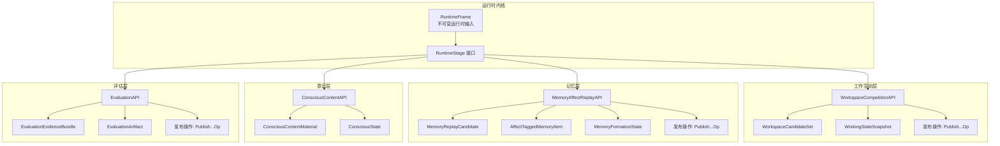
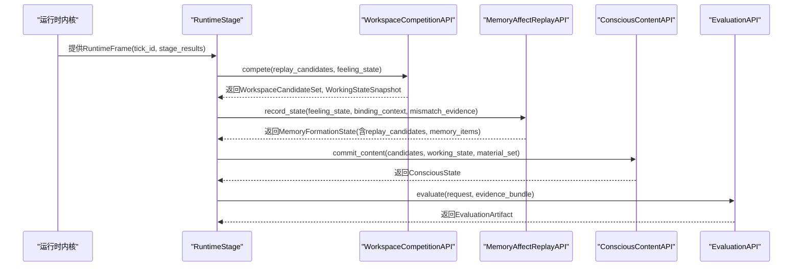
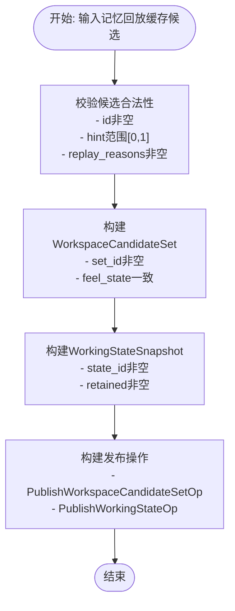
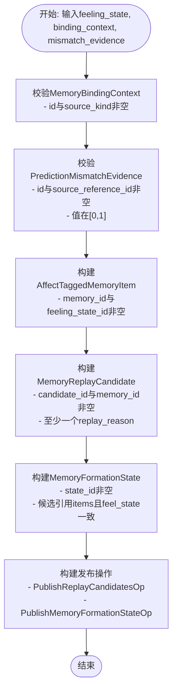
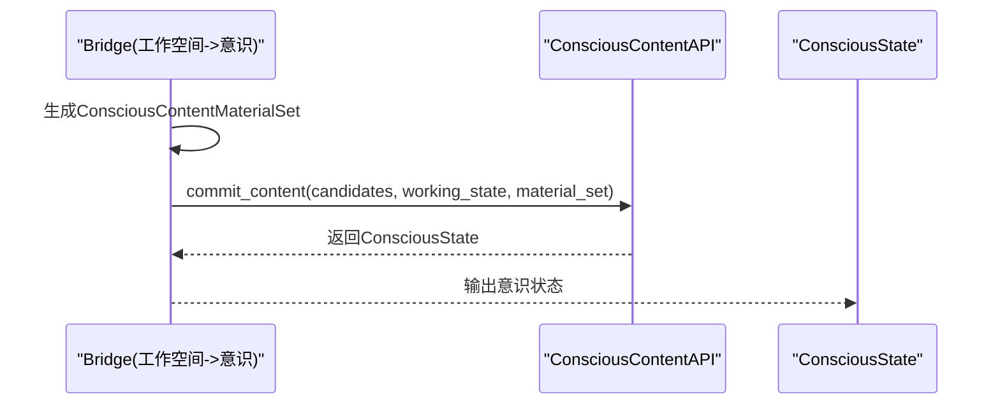
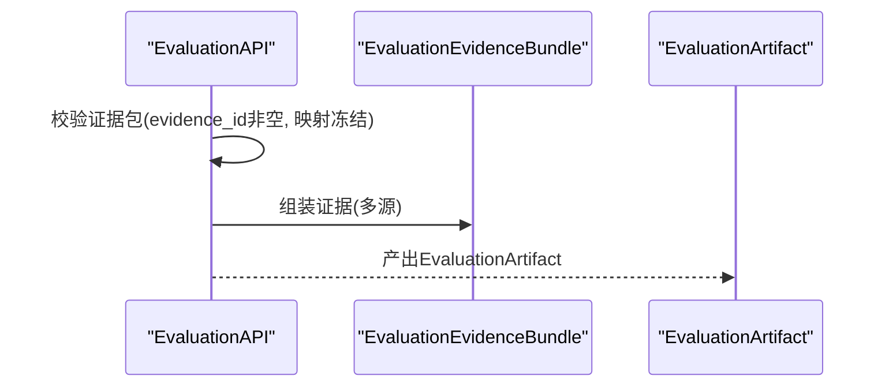
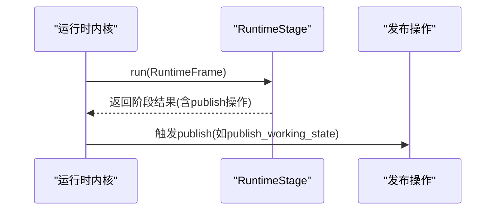
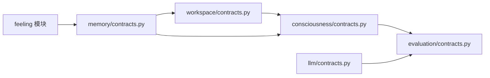

# 数据结构

<cite>
**本文引用的文件**
- [runtime/contracts.py](file://helios_v2/src/helios_v2/runtime/contracts.py)
- [workspace/contracts.py](file://helios_v2/src/helios_v2/workspace/contracts.py)
- [memory/contracts.py](file://helios_v2/src/helios_v2/memory/contracts.py)
- [evaluation/contracts.py](file://helios_v2/src/helios_v2/evaluation/contracts.py)
- [consciousness/contracts.py](file://helios_v2/src/helios_v2/consciousness/contracts.py)
- [runtime/stages.py](file://helios_v2/src/helios_v2/runtime/stages.py)
- [llm/contracts.py](file://helios_v2/src/helios_v2/llm/contracts.py)
- [test_runtime_stage_chain.py](file://helios_v2/tests/test_runtime_stage_chain.py)
- [test_observability_timeline.py](file://helios_v2/tests/test_observability_timeline.py)
</cite>

## 目录
1. [简介](#简介)
2. [项目结构](#项目结构)
3. [核心组件](#核心组件)
4. [架构总览](#架构总览)
5. [详细组件分析](#详细组件分析)
6. [依赖分析](#依赖分析)
7. [性能考虑](#性能考虑)
8. [故障排查指南](#故障排查指南)
9. [结论](#结论)
10. [附录](#附录)

## 简介
本文件面向Helios v2运行时内核与各“拥有者”模块，系统性梳理公开数据模型与契约（Contracts），覆盖运行时帧、工作空间候选与工作态快照、记忆影响与回放、意识内容材料集与状态、评估证据与产物等核心数据结构。文档同时给出字段定义、类型约束、验证规则、序列化建议、JSON Schema思路、完整性校验策略、版本演进与迁移指引，以及结构间的关系图与转换示例。

## 项目结构
Helios v2采用“拥有者”分层架构：每个功能域由独立拥有者负责，通过明确的契约进行交互；运行时内核以不可变的RuntimeFrame驱动各阶段执行。核心数据结构主要分布在runtime、workspace、memory、evaluation、consciousness等子包的contracts.py中，另有部分在runtime/stages.py中用于桥接与组装。

图表来源
- [runtime/contracts.py:30-50](file://helios_v2/src/helios_v2/runtime/contracts.py#L30-L50)
- [workspace/contracts.py:240-344](file://helios_v2/src/helios_v2/workspace/contracts.py#L240-L344)
- [memory/contracts.py:410-510](file://helios_v2/src/helios_v2/memory/contracts.py#L410-L510)
- [evaluation/contracts.py:304-331](file://helios_v2/src/helios_v2/evaluation/contracts.py#L304-L331)
- [consciousness/contracts.py:410-439](file://helios_v2/src/helios_v2/consciousness/contracts.py#L410-L439)

章节来源
- [runtime/contracts.py:1-50](file://helios_v2/src/helios_v2/runtime/contracts.py#L1-L50)
- [workspace/contracts.py:1-344](file://helios_v2/src/helios_v2/workspace/contracts.py#L1-L344)
- [memory/contracts.py:1-510](file://helios_v2/src/helios_v2/memory/contracts.py#L1-L510)
- [evaluation/contracts.py:1-331](file://helios_v2/src/helios_v2/evaluation/contracts.py#L1-L331)
- [consciousness/contracts.py:397-439](file://helios_v2/src/helios_v2/consciousness/contracts.py#L397-L439)

## 核心组件
本节对关键数据结构进行逐项说明，包括字段、类型、约束与验证规则。

- 运行时帧 RuntimeFrame
  - 字段
    - tick_id: 整数，表示当前运行时刻度
    - stage_results: 映射，键为阶段名，值为该阶段结果对象；构造时冻结为只读视图
  - 约束与验证
    - 构造后stage_results被冻结，防止外部修改
  - 序列化建议
    - 建议以JSON字典形式序列化，键为字段名，值为对应字段值；注意冻结映射的可序列化性
  - JSON Schema要点
    - 类型：对象；属性：tick_id为整数，stage_results为对象或null
  - 完整性检查
    - 非空tick_id；stage_results可为空但不为None时需保证键非空且值可序列化

- 工作空间竞争配置 WorkspaceCompetitionConfig
  - 字段
    - legal_min_score, legal_max_score: 浮点数，范围[0,1]，且最小值不大于最大值
    - working_state_bootstrap_id: 非空字符串
    - mandatory_learned_parameters: 必须包含“competition_policy”、“candidate_retention_policy”、“working_state_update_policy”
  - 约束与验证
    - 调用__post_init__进行参数集合一致性与范围校验
  - 序列化建议
    - JSON对象，键为字段名，值为对应数值或字符串
  - JSON Schema要点
    - 属性：legal_min_score与legal_max_score为数值且在[0,1]区间；working_state_bootstrap_id为非空字符串；mandatory_learned_parameters为固定枚举集合

- 工作空间候选 WorkspaceCandidate
  - 字段
    - candidate_id: 非空字符串
    - source_memory_candidate_id: 非空字符串
    - source_feeling_state_id: 非空字符串
    - priority_hint, workspace_score_hint: 可选浮点数，若提供则必须在[0,1]
  - 约束与验证
    - 构造时校验id非空与hint范围
  - 序列化建议
    - JSON对象，可选字段省略或为null
  - JSON Schema要点
    - 必填字段为字符串；可选字段为数值或null

- 工作空间候选集合 WorkspaceCandidateSet
  - 字段
    - set_id: 非空字符串
    - source_feeling_state_id: 非空字符串
    - candidates: 候选元组，要求所有元素的source_feeling_state_id一致
    - tick_id: 可选整数
  - 约束与验证
    - 构造时校验set_id与feeling_state_id非空，以及候选一致性
  - 序列化建议
    - JSON数组（candidates）+ 对象（其他字段）
  - JSON Schema要点
    - candidates为对象数组；其余字段为标量

- 工作态快照 WorkingStateSnapshot
  - 字段
    - state_id: 非空字符串
    - source_candidate_set_id: 非空字符串
    - retained_candidate_ids: 非空字符串元组
    - tick_id: 可选整数
  - 约束与验证
    - 构造时校验id非空与retained列表无空值
  - 序列化建议
    - JSON对象，retained_candidate_ids为字符串数组
  - JSON Schema要点
    - retained_candidate_ids为非空字符串数组

- 记忆影响与回放配置 MemoryAffectReplayConfig
  - 字段
    - legal_min_priority, legal_max_priority: 浮点数，范围[0,1]，且最小值不大于最大值
    - storage_bootstrap_state_id: 非空字符串
    - mandatory_learned_parameters: 必须包含“memory_family_write_policy”、“replay_priority_policy”、“consolidation_policy”
  - 约束与验证
    - 调用__post_init__进行参数集合一致性与范围校验
  - 序列化建议
    - JSON对象
  - JSON Schema要点
    - 数值范围校验与枚举集合

- 记忆内容包 MemoryContentPacket
  - 字段
    - content_kind: 非空字符串
    - summary_ref, context_ref: 可空字符串
    - salient_tokens: 非空字符串元组
  - 约束与验证
    - 至少一个引用或token非空；tokens不得含空值
  - 序列化建议
    - JSON对象，salient_tokens为字符串数组
  - JSON Schema要点
    - 至少一个引用或token存在；tokens为非空字符串数组

- 记忆绑定上下文 MemoryBindingContext
  - 字段
    - context_id: 非空字符串
    - source_kind: 非空字符串
    - content: MemoryContentPacket
  - 约束与验证
    - 构造时校验id与kind非空
  - 序列化建议
    - JSON对象，content为嵌套对象
  - JSON Schema要点
    - content为MemoryContentPacket对象

- 影响标记记忆条目 AffectTaggedMemoryItem
  - 字段
    - memory_id: 非空字符串
    - family: “episodic”|“semantic”|“autobiographical”
    - source_feeling_state_id: 非空字符串
    - affect_tag: 感觉向量（来自feeling模块）
    - content: MemoryContentPacket
    - binding_context_id: 可空字符串
    - tick_id: 可选整数
  - 约束与验证
    - 构造时校验id与feeling_state_id非空
  - 序列化建议
    - JSON对象，affect_tag按其内部结构序列化
  - JSON Schema要点
    - family为固定枚举；affect_tag为对象

- 记忆回放缓存候选 MemoryReplayCandidate
  - 字段
    - candidate_id: 非空字符串
    - memory_id: 非空字符串
    - family: “episodic”|“semantic”|“autobiographical”
    - source_feeling_state_id: 非空字符串
    - replay_reasons: 非空枚举元组，支持“high_affect_intensity”、“unresolved_tension_or_discomfort”、“prediction_mismatch_or_surprise”
    - forced_consolidation: 布尔
    - priority_hint: 可选浮点数，若提供则在[0,1]
  - 约束与验证
    - 至少一个replay_reason；priority_hint范围校验
  - 序列化建议
    - JSON对象，replay_reasons为字符串数组
  - JSON Schema要点
    - replay_reasons为固定枚举集合；priority_hint为数值或null

- 记忆形成状态 MemoryFormationState
  - 字段
    - state_id: 非空字符串
    - source_feeling_state_id: 非空字符串
    - memory_items: AffectTaggedMemoryItem元组
    - replay_candidates: MemoryReplayCandidate元组
    - tick_id: 可选整数
  - 约束与验证
    - 所有候选必须引用已发布的memory_items；候选的feeling_state_id需与owner state一致
  - 序列化建议
    - JSON对象，items与candidates为数组
  - JSON Schema要点
    - items与candidates为对象数组；一致性校验在上层逻辑完成

- 意识内容材料 ConsciousContentMaterial
  - 字段
    - material_id: 非空字符串
    - source_workspace_candidate_id: 非空字符串
    - source_memory_candidate_id: 非空字符串
    - source_memory_id: 非空字符串
    - source_feeling_state_id: 非空字符串
    - content_kind: 字符串
    - material_summary: 文本摘要
    - summary_ref, context_ref: 可空字符串
    - salient_tokens: 字符串元组
    - affect_tag: 感觉向量
    - forced_consolidation: 布尔
    - workspace_score_hint, priority_hint: 可选数值
  - 约束与验证
    - 来自workspace与memory的provenance保持一致；构造时校验必要字段
  - 序列化建议
    - JSON对象，tokens为数组
  - JSON Schema要点
    - 各字段类型与可空性明确

- 意识内容材料集 ConsciousContentMaterialSet
  - 字段
    - set_id: 非空字符串
    - source_workspace_candidate_set_id: 非空字符串
    - source_working_state_id: 非空字符串
    - materials: ConsciousContentMaterial元组
    - tick_id: 可选整数
  - 约束与验证
    - 构造时校验set_id与provenance一致性
  - 序列化建议
    - JSON对象，materials为数组
  - JSON Schema要点
    - materials为对象数组

- 意识状态 ConsciousState
  - 字段
    - state_id: 非空字符串
    - material_set_id: 非空字符串
    - committed_by: 非空字符串（拥有者标识）
    - tick_id: 可选整数
  - 约束与验证
    - 构造时校验id非空
  - 序列化建议
    - JSON对象
  - JSON Schema要点
    - 标识性字段为字符串

- 评估请求 EvaluationRequest
  - 字段
    - request_id: 非空字符串
    - scenario_kind: “runtime_tick”|“session_window”
    - time_window_summary: 映射，构造时冻结为只读视图
  - 约束与验证
    - 构造时校验id非空、场景种类合法、映射非空
  - 序列化建议
    - JSON对象，time_window_summary为对象
  - JSON Schema要点
    - 场景种类为固定枚举；time_window_summary为对象

- 评估证据包 EvaluationEvidenceBundle
  - 字段
    - bundle_id: 非空字符串
    - source_request_id: 非空字符串
    - thought_evidence, action_evidence, planner_evidence, governance_evidence, writeback_evidence, autonomy_evidence, prompt_evidence, outward_expression_evidence, outward_expression_externalization_evidence: 元组，每项包含evidence_id等字段
    - execution_timeline_evidence, prior_consequence_claim_evidence: 可选元组
  - 约束与验证
    - 构造时冻结映射并校验每项evidence_id非空
  - 序列化建议
    - JSON对象，证据数组中每项为对象
  - JSON Schema要点
    - 多个证据数组；每项对象包含evidence_id

- 评估产物 EvaluationArtifact
  - 字段
    - artifact_id: 非空字符串
    - source_bundle_id: 非空字符串
    - dimension_scores: 映射，键为字符串，值为数值
    - gap_summary: 映射，键为字符串，值为对象
    - fidelity_warnings: FidelityWarning元组
    - long_range_diagnostics: 映射，键为字符串，值为对象
  - 约束与验证
    - 构造时冻结映射并校验维度分数与摘要非空
  - 序列化建议
    - JSON对象，warnings为数组
  - JSON Schema要点
    - dimension_scores与gap_summary、long_range_diagnostics为对象；warnings为对象数组

- LLM请求 LlmRequest 与使用统计 LlmUsage
  - 字段
    - LlmRequest: messages为LlmMessage元组，response_format为固定枚举，metadata为映射
    - LlmUsage: prompt_tokens, completion_tokens, total_tokens为可空整数，均非负
  - 约束与验证
    - messages类型校验；usage字段非负校验；metadata冻结
  - 序列化建议
    - JSON对象，messages为数组
  - JSON Schema要点
    - response_format为固定枚举；usage字段为整数或null

章节来源
- [runtime/contracts.py:30-50](file://helios_v2/src/helios_v2/runtime/contracts.py#L30-L50)
- [workspace/contracts.py:35-163](file://helios_v2/src/helios_v2/workspace/contracts.py#L35-L163)
- [memory/contracts.py:40-287](file://helios_v2/src/helios_v2/memory/contracts.py#L40-L287)
- [evaluation/contracts.py:78-279](file://helios_v2/src/helios_v2/evaluation/contracts.py#L78-L279)
- [llm/contracts.py:109-146](file://helios_v2/src/helios_v2/llm/contracts.py#L109-L146)

## 架构总览
下图展示从运行时内核到各拥有者的调用链与数据传递路径，重点体现RuntimeFrame作为输入、Workspace/Memory桥接生成意识材料、最终由意识层提交为ConsciousState，再进入评估层形成EvaluationArtifact的过程。

图表来源
- [runtime/stages.py:783-825](file://helios_v2/src/helios_v2/runtime/stages.py#L783-L825)
- [workspace/contracts.py:240-271](file://helios_v2/src/helios_v2/workspace/contracts.py#L240-L271)
- [memory/contracts.py:410-442](file://helios_v2/src/helios_v2/memory/contracts.py#L410-L442)
- [evaluation/contracts.py:304-331](file://helios_v2/src/helios_v2/evaluation/contracts.py#L304-L331)
- [consciousness/contracts.py:410-439](file://helios_v2/src/helios_v2/consciousness/contracts.py#L410-L439)

## 详细组件分析

### 组件A：工作空间层（Workspace）
- 功能定位
  - 将记忆回放缓存候选与感觉状态整合，输出工作空间候选集合与工作态快照
- 关键流程
  - 输入：MemoryReplayCandidate元组 + InteroceptiveFeelingState
  - 输出：WorkspaceCandidateSet + WorkingStateSnapshot
- 数据流图

图表来源
- [workspace/contracts.py:71-163](file://helios_v2/src/helios_v2/workspace/contracts.py#L71-L163)
- [workspace/contracts.py:165-220](file://helios_v2/src/helios_v2/workspace/contracts.py#L165-L220)

章节来源
- [workspace/contracts.py:1-344](file://helios_v2/src/helios_v2/workspace/contracts.py#L1-L344)

### 组件B：记忆层（Memory）
- 功能定位
  - 基于感觉状态与绑定上下文形成影响标记的记忆条目与回放缓存候选
- 关键流程
  - 输入：InteroceptiveFeelingState + MemoryBindingContext（可选）+ PredictionMismatchEvidence（可选）
  - 输出：MemoryFormationState（含memory_items与replay_candidates）
- 数据流图

图表来源
- [memory/contracts.py:96-287](file://helios_v2/src/helios_v2/memory/contracts.py#L96-L287)
- [memory/contracts.py:289-342](file://helios_v2/src/helios_v2/memory/contracts.py#L289-L342)

章节来源
- [memory/contracts.py:1-510](file://helios_v2/src/helios_v2/memory/contracts.py#L1-L510)

### 组件C：意识层（Consciousness）
- 功能定位
  - 使用工作空间候选与工作态快照，结合显式材料集，提交为报告性意识状态
- 关键流程
  - 输入：WorkspaceCandidateSet + WorkingStateSnapshot + ConsciousContentMaterialSet
  - 输出：ConsciousState
- 序列图

图表来源
- [runtime/stages.py:783-825](file://helios_v2/src/helios_v2/runtime/stages.py#L783-L825)
- [consciousness/contracts.py:410-439](file://helios_v2/src/helios_v2/consciousness/contracts.py#L410-L439)

章节来源
- [runtime/stages.py:783-825](file://helios_v2/src/helios_v2/runtime/stages.py#L783-L825)
- [consciousness/contracts.py:397-439](file://helios_v2/src/helios_v2/consciousness/contracts.py#L397-L439)

### 组件D：评估层（Evaluation）
- 功能定位
  - 基于多源证据组装评估产物，输出只读诊断产物
- 关键流程
  - 输入：EvaluationRequest + EvaluationEvidenceBundle
  - 输出：EvaluationArtifact
- 序列图

图表来源
- [evaluation/contracts.py:179-279](file://helios_v2/src/helios_v2/evaluation/contracts.py#L179-L279)
- [evaluation/contracts.py:304-331](file://helios_v2/src/helios_v2/evaluation/contracts.py#L304-L331)

章节来源
- [evaluation/contracts.py:1-331](file://helios_v2/src/helios_v2/evaluation/contracts.py#L1-L331)

### 组件E：运行时阶段（RuntimeStage）
- 功能定位
  - 实现运行时内核的阶段接口，消费RuntimeFrame并协调各拥有者
- 关键流程
  - 输入：RuntimeFrame
  - 输出：阶段结果对象（如WorkspaceCompetitionStageResult）
- 序列图

图表来源
- [runtime/contracts.py:41-50](file://helios_v2/src/helios_v2/runtime/contracts.py#L41-L50)
- [runtime/stages.py:1126-1138](file://helios_v2/src/helios_v2/runtime/stages.py#L1126-L1138)

章节来源
- [runtime/contracts.py:1-50](file://helios_v2/src/helios_v2/runtime/contracts.py#L1-L50)
- [runtime/stages.py:1126-1158](file://helios_v2/src/helios_v2/runtime/stages.py#L1126-L1158)

## 依赖分析
- 模块耦合
  - workspace依赖memory的MemoryReplayCandidate与feeling的InteroceptiveFeelingState
  - memory依赖feeling的InteroceptiveFeelingState与InteroceptiveFeelingVector
  - consciousness依赖workspace的WorkspaceCandidateSet与working_state，以及memory的AffectTaggedMemoryItem
  - evaluation依赖各拥有者输出的证据
- 协议与实现
  - 各层通过Protocol定义API契约，具体实现由对应拥有者提供
- 外部依赖
  - LLM相关数据结构依赖外部LLM提供方的响应格式与token用量统计

图表来源
- [workspace/contracts.py:19-20](file://helios_v2/src/helios_v2/workspace/contracts.py#L19-L20)
- [memory/contracts.py:19-20](file://helios_v2/src/helios_v2/memory/contracts.py#L19-L20)
- [evaluation/contracts.py:16-20](file://helios_v2/src/helios_v2/evaluation/contracts.py#L16-L20)

章节来源
- [workspace/contracts.py:1-344](file://helios_v2/src/helios_v2/workspace/contracts.py#L1-L344)
- [memory/contracts.py:1-510](file://helios_v2/src/helios_v2/memory/contracts.py#L1-L510)
- [evaluation/contracts.py:1-331](file://helios_v2/src/helios_v2/evaluation/contracts.py#L1-L331)
- [llm/contracts.py:109-146](file://helios_v2/src/helios_v2/llm/contracts.py#L109-L146)

## 性能考虑
- 不可变数据结构
  - 大量使用dataclass(frozen=True)，减少并发写入开销，提升缓存命中率
- 冻结映射
  - 使用MappingProxyType确保映射只读，避免意外修改带来的重复校验
- 元组优先
  - 列表替换为元组，降低扩容成本，适合静态数据集
- 建议
  - 在高频序列化场景中，优先使用紧凑字段命名与扁平结构
  - 对大型证据包与材料集，考虑分页或增量传输策略

## 故障排查指南
- 常见错误类型
  - WorkspaceCompetitionError：工作空间层输入或不变量校验失败
  - MemoryAffectReplayError：记忆层输入或不变量校验失败
  - EvaluationError：评估层输入或不变量校验失败
  - ConsciousnessError：意识层不变量校验失败
- 排查步骤
  - 检查必填字段是否为空（如id、kind、reasons等）
  - 校验数值范围（如priority/score在[0,1]）
  - 校验引用一致性（候选必须引用已发布的memory_items）
  - 校验映射冻结与键非空（评估证据包与时间窗口）
- 单元测试参考
  - 运行时阶段链路测试：验证工作态快照与门控信号快照
  - 可观测性时间线重建：验证阶段生命周期事件的完整性与失败处理

章节来源
- [workspace/contracts.py:218-220](file://helios_v2/src/helios_v2/workspace/contracts.py#L218-L220)
- [memory/contracts.py:344-346](file://helios_v2/src/helios_v2/memory/contracts.py#L344-L346)
- [evaluation/contracts.py:23-25](file://helios_v2/src/helios_v2/evaluation/contracts.py#L23-L25)
- [consciousness/contracts.py:406-408](file://helios_v2/src/helios_v2/consciousness/contracts.py#L406-L408)
- [test_runtime_stage_chain.py:708-738](file://helios_v2/tests/test_runtime_stage_chain.py#L708-L738)
- [test_observability_timeline.py:121-162](file://helios_v2/tests/test_observability_timeline.py#L121-L162)

## 结论
本文档系统梳理了Helios v2的核心数据结构与契约，明确了字段、类型、约束与验证规则，并提供了序列化建议、JSON Schema思路与完整性校验策略。通过运行时内核与各拥有者的清晰边界与协议，数据结构在跨模块流转时具备强一致性的不变量保障。后续版本演进应遵循向后兼容原则，严格控制字段删除与类型变更，并提供迁移脚本与版本对照表。

## 附录
- 版本演进与向后兼容
  - 建议在contracts.py中保留旧字段并在新版本中注释说明弃用状态
  - 对于新增字段，提供默认值与兼容解析逻辑
  - 发布迁移指南，列出字段变更、默认值调整与序列化差异
- 迁移指南（示例）
  - 从v1到v2：将旧版MemoryItem结构映射为AffectTaggedMemoryItem与MemoryReplayCandidate
  - 从v1到v2：将旧版WorkspaceCandidate映射为新的WorkspaceCandidateSet与WorkingStateSnapshot
  - 评估证据：将多源证据统一为EvaluationEvidenceBundle的标准化结构
- 转换示例（路径引用）
  - 工作空间桥接生成意识材料集：[runtime/stages.py:783-825](file://helios_v2/src/helios_v2/runtime/stages.py#L783-L825)
  - 固定工作态快照与门控信号快照：[test_runtime_stage_chain.py:708-738](file://helios_v2/tests/test_runtime_stage_chain.py#L708-L738)
  - 时间线事件重建与失败处理：[test_observability_timeline.py:121-162](file://helios_v2/tests/test_observability_timeline.py#L121-L162)