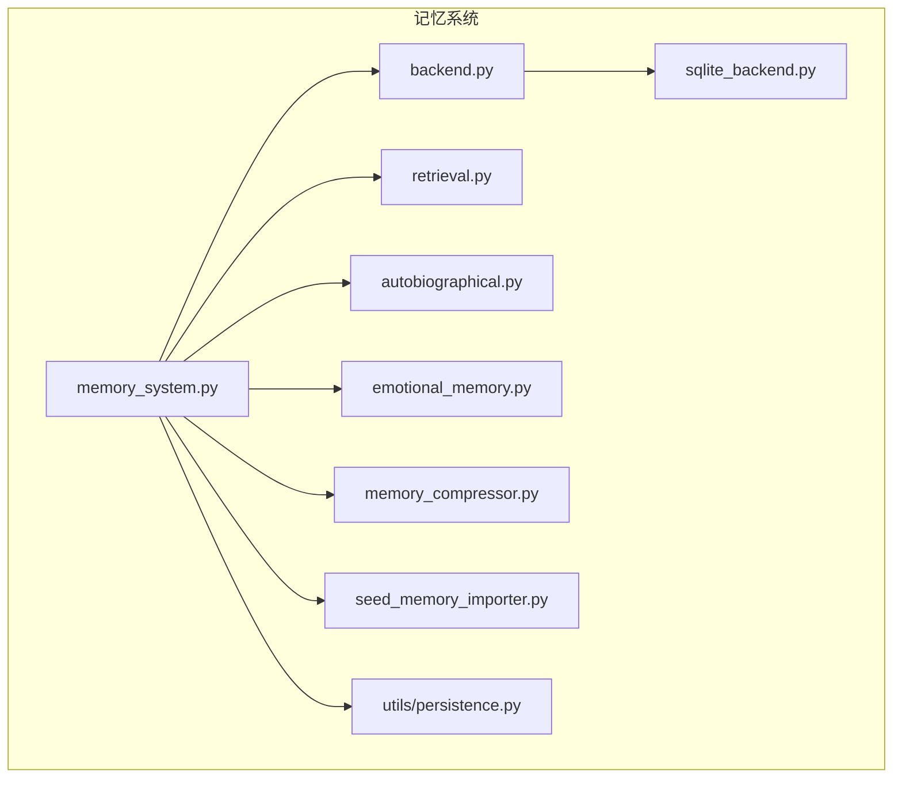
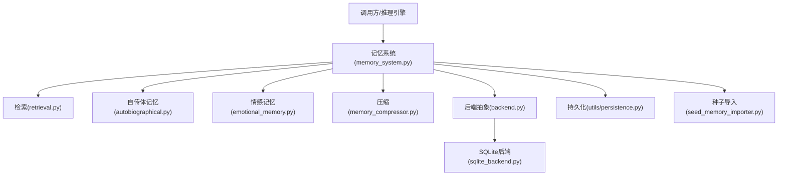
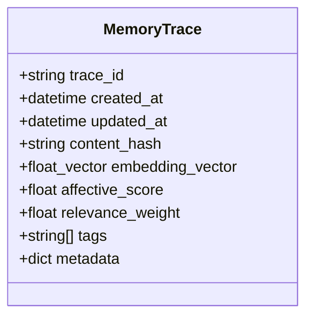
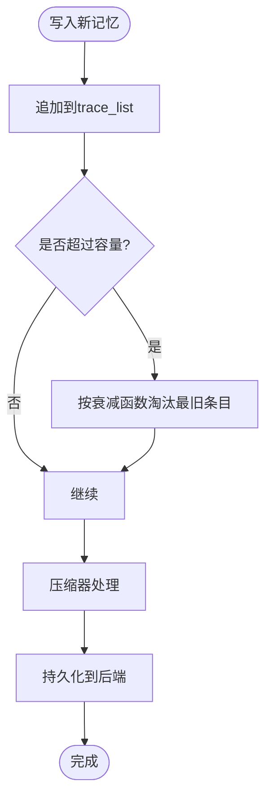
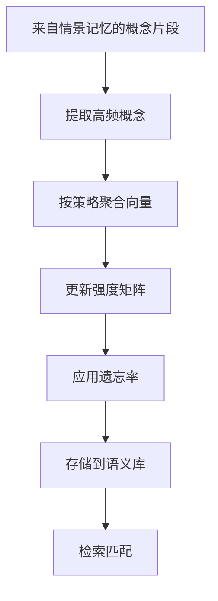
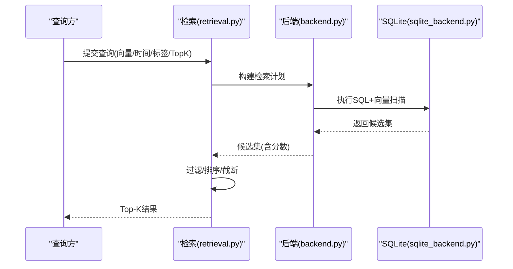
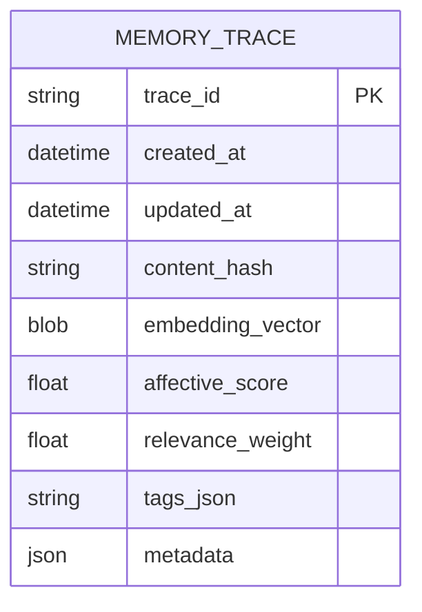
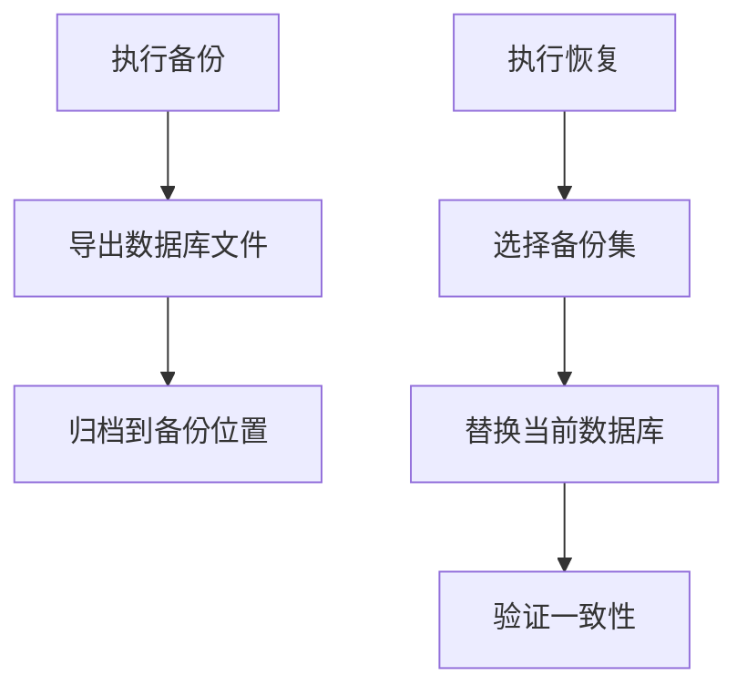
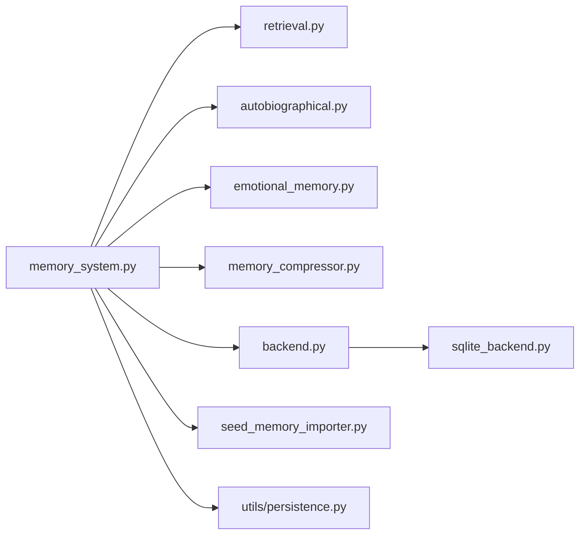

# 记忆数据结构

<cite>
**本文引用的文件**
- [memory_system.py](file://archive/helios_v1/memory/memory_system.py)
- [backend.py](file://archive/helios_v1/memory/backend.py)
- [sqlite_backend.py](file://archive/helios_v1/memory/sqlite_backend.py)
- [memory_compressor.py](file://archive/helios_v1/memory/memory_compressor.py)
- [retrieval.py](file://archive/helios_v1/memory/retrieval.py)
- [autobiographical.py](file://archive/helios_v1/memory/autobiographical.py)
- [emotional_memory.py](file://archive/helios_v1/memory/emotional_memory.py)
- [seed_memory_importer.py](file://archive/helios_v1/memory/seed_memory_importer.py)
- [init_memory_backend.py](file://archive/helios_v1/scripts/init_memory_backend.py)
- [persistence.py](file://archive/helios_v1/utils/persistence.py)
- [test_memory_persistence.py](file://archive/helios_v1/tests/test_memory_persistence.py)
- [test_memory_backend.py](file://archive/helios_v1/tests/test_memory_backend.py)
- [test_memory_sqlite_backend.py](file://archive/helios_v1/tests/test_memory_sqlite_backend.py)
- [test_memory_compression.py](file://archive/helios_v1/tests/test_memory_compression.py)
- [test_episodic_memory_pbt.py](file://archive/helios_v1/tests/test_episodic_memory_pbt.py)
- [test_episodic_memory_bounded.py](file://archive/helios_v1/tests/test_episodic_memory_bounded.py)
- [test_memory_retrieval_contract.py](file://archive/helios_v1/tests/test_memory_retrieval_contract.py)
</cite>

## 目录
1. [简介](#简介)
2. [项目结构](#项目结构)
3. [核心组件](#核心组件)
4. [架构总览](#架构总览)
5. [详细组件分析](#详细组件分析)
6. [依赖关系分析](#依赖关系分析)
7. [性能考虑](#性能考虑)
8. [故障排查指南](#故障排查指南)
9. [结论](#结论)
10. [附录](#附录)

## 简介
本文件面向Helios记忆系统，聚焦于核心记忆数据模型与实现：MemoryTrace（记忆痕迹）、EpisodicMemory（情景记忆）与SemanticMemory（语义记忆）。文档从数据结构定义、记忆层级组织、检索索引设计、持久化格式与压缩策略、版本控制与迁移、备份恢复、访问权限与加密、数据完整性校验等方面进行系统化梳理，并通过图示展示关键流程与组件关系。

## 项目结构
记忆系统位于archive/helios_v1/memory目录下，核心模块包括：
- memory_system.py：记忆系统主入口与高层接口
- backend.py：抽象后端接口与通用能力
- sqlite_backend.py：基于SQLite的持久化后端
- memory_compressor.py：记忆压缩器
- retrieval.py：检索策略与索引
- autobiographical.py：自传体记忆（长期记忆）
- emotional_memory.py：情感记忆（情绪强化与持久化）
- seed_memory_importer.py：种子记忆导入器（初始化与迁移）
- scripts/init_memory_backend.py：后端初始化脚本
- utils/persistence.py：通用持久化工具
- tests/*：覆盖持久化、后端、压缩、检索等测试

**图表来源**
- [memory_system.py](file://archive/helios_v1/memory/memory_system.py)
- [backend.py](file://archive/helios_v1/memory/backend.py)
- [sqlite_backend.py](file://archive/helios_v1/memory/sqlite_backend.py)
- [memory_compressor.py](file://archive/helios_v1/memory/memory_compressor.py)
- [retrieval.py](file://archive/helios_v1/memory/retrieval.py)
- [autobiographical.py](file://archive/helios_v1/memory/autobiographical.py)
- [emotional_memory.py](file://archive/helios_v1/memory/emotional_memory.py)
- [seed_memory_importer.py](file://archive/helios_v1/memory/seed_memory_importer.py)
- [persistence.py](file://archive/helios_v1/utils/persistence.py)

**章节来源**
- [memory_system.py](file://archive/helios_v1/memory/memory_system.py)
- [backend.py](file://archive/helios_v1/memory/backend.py)
- [sqlite_backend.py](file://archive/helios_v1/memory/sqlite_backend.py)
- [memory_compressor.py](file://archive/helios_v1/memory/memory_compressor.py)
- [retrieval.py](file://archive/helios_v1/memory/retrieval.py)
- [autobiographical.py](file://archive/helios_v1/memory/autobiographical.py)
- [emotional_memory.py](file://archive/helios_v1/memory/emotional_memory.py)
- [seed_memory_importer.py](file://archive/helios_v1/memory/seed_memory_importer.py)
- [persistence.py](file://archive/helios_v1/utils/persistence.py)

## 核心组件
- MemoryTrace（记忆痕迹）
  - 定义：对单次经历或事件的最小可检索单元，包含时间戳、上下文特征、情绪强度、检索权重等字段，用于构建索引与排序。
  - 关键属性：id、timestamp、content_hash、embedding_vector、affective_score、tags、metadata。
- EpisodicMemory（情景记忆）
  - 定义：按时间序列组织的短期到中期记忆片段，支持边界约束与衰减策略，便于快速回放与重演。
  - 关键属性：trace_list、capacity、decay_function、temporal_window。
- SemanticMemory（语义记忆）
  - 定义：抽象概念、规则与模式的长期存储，支持跨情境泛化与推理。
  - 关键属性：concept_map、strength_matrix、decay_rate、aggregation_strategy。

**章节来源**
- [memory_system.py](file://archive/helios_v1/memory/memory_system.py)
- [autobiographical.py](file://archive/helios_v1/memory/autobiographical.py)
- [emotional_memory.py](file://archive/helios_v1/memory/emotional_memory.py)

## 架构总览
记忆系统采用分层架构：上层为记忆系统接口与检索引擎，中层为后端抽象与具体实现（SQLite），底层为压缩与持久化工具。系统通过种子导入器完成初始化与迁移，通过压缩器降低存储与传输成本。

**图表来源**
- [memory_system.py](file://archive/helios_v1/memory/memory_system.py)
- [retrieval.py](file://archive/helios_v1/memory/retrieval.py)
- [autobiographical.py](file://archive/helios_v1/memory/autobiographical.py)
- [emotional_memory.py](file://archive/helios_v1/memory/emotional_memory.py)
- [memory_compressor.py](file://archive/helios_v1/memory/memory_compressor.py)
- [backend.py](file://archive/helios_v1/memory/backend.py)
- [sqlite_backend.py](file://archive/helios_v1/memory/sqlite_backend.py)
- [persistence.py](file://archive/helios_v1/utils/persistence.py)
- [seed_memory_importer.py](file://archive/helios_v1/memory/seed_memory_importer.py)

## 详细组件分析

### MemoryTrace 数据模型
- 结构要点
  - 唯一标识：trace_id
  - 时间维度：created_at、updated_at
  - 内容摘要：content_hash、embedding_vector
  - 情绪与权重：affective_score、relevance_weight
  - 上下文标签：tags（如场景、人物、对象）
  - 元数据：metadata（来源通道、触发事件、关联实体）
- 复杂度与索引
  - 查询复杂度：基于向量相似度与时间窗口的组合索引，支持O(logN)近似最近邻检索
  - 存储复杂度：向量维度固定，哈希与标签建立二级索引
- 使用场景
  - 检索匹配、回放重演、情感强化、跨模态融合

**图表来源**
- [memory_system.py](file://archive/helios_v1/memory/memory_system.py)

**章节来源**
- [memory_system.py](file://archive/helios_v1/memory/memory_system.py)

### EpisodicMemory 数据模型
- 结构要点
  - trace_list：有序的记忆痕迹列表，按时间戳维护
  - capacity：容量上限，超出时触发淘汰策略
  - decay_function：时间衰减函数，影响检索权重
  - temporal_window：时间窗口限制，仅在窗口内可被检索
- 处理逻辑
  - 写入：追加新trace，必要时触发压缩与落盘
  - 读取：按时间窗口过滤，结合权重排序返回Top-K
  - 调度：周期性触发consolidation（整合为语义记忆）

**图表来源**
- [autobiographical.py](file://archive/helios_v1/memory/autobiographical.py)
- [memory_compressor.py](file://archive/helios_v1/memory/memory_compressor.py)
- [sqlite_backend.py](file://archive/helios_v1/memory/sqlite_backend.py)

**章节来源**
- [autobiographical.py](file://archive/helios_v1/memory/autobiographical.py)
- [memory_compressor.py](file://archive/helios_v1/memory/memory_compressor.py)
- [sqlite_backend.py](file://archive/helios_v1/memory/sqlite_backend.py)

### SemanticMemory 数据模型
- 结构要点
  - concept_map：概念到向量的映射，支持聚类与聚合
  - strength_matrix：概念间关联强度矩阵，随使用频率更新
  - decay_rate：长期遗忘率，控制概念活跃度
  - aggregation_strategy：概念聚合策略（平均、最大、加权）
- 处理逻辑
  - 归档：从EpisodicMemory提取高频/高权重概念
  - 更新：基于新证据调整强度矩阵
  - 检索：向量相似度+语义权重，返回Top-N概念

**图表来源**
- [autobiographical.py](file://archive/helios_v1/memory/autobiographical.py)
- [emotional_memory.py](file://archive/helios_v1/memory/emotional_memory.py)

**章节来源**
- [autobiographical.py](file://archive/helios_v1/memory/autobiographical.py)
- [emotional_memory.py](file://archive/helios_v1/memory/emotional_memory.py)

### 检索与索引设计
- 索引类型
  - 向量索引：基于embedding_vector的近似最近邻（ANN）
  - 时间索引：按created_at与temporal_window过滤
  - 标签索引：tags多值索引，支持AND/OR查询
- 检索流程
  - 输入：查询向量、时间范围、标签条件、Top-K
  - 步骤：向量相似度打分→时间窗口过滤→标签过滤→加权排序→截断返回

**图表来源**
- [retrieval.py](file://archive/helios_v1/memory/retrieval.py)
- [backend.py](file://archive/helios_v1/memory/backend.py)
- [sqlite_backend.py](file://archive/helios_v1/memory/sqlite_backend.py)

**章节来源**
- [retrieval.py](file://archive/helios_v1/memory/retrieval.py)
- [backend.py](file://archive/helios_v1/memory/backend.py)
- [sqlite_backend.py](file://archive/helios_v1/memory/sqlite_backend.py)

### 持久化格式与存储优化
- 存储格式
  - SQLite：关系表存储MemoryTrace与元数据；向量以二进制blob存储；标签以JSON字符串存储
  - 压缩：启用zlib压缩，针对长文本content与embedding向量进行压缩
- 索引与分区
  - 主键：trace_id
  - 时间索引：created_at
  - 标签索引：tags_json
  - 向量索引：独立向量表或列族（视实现而定）
- 优化策略
  - 分页批量写入，减少事务开销
  - 延迟提交与异步刷盘
  - 增量压缩与增量归档

**图表来源**
- [sqlite_backend.py](file://archive/helios_v1/memory/sqlite_backend.py)
- [memory_compressor.py](file://archive/helios_v1/memory/memory_compressor.py)

**章节来源**
- [sqlite_backend.py](file://archive/helios_v1/memory/sqlite_backend.py)
- [memory_compressor.py](file://archive/helios_v1/memory/memory_compressor.py)
- [persistence.py](file://archive/helios_v1/utils/persistence.py)

### 版本控制、备份与恢复
- 版本控制
  - schema_version：数据库schema版本号，迁移时自动升级
  - migration脚本：按版本增量迁移，保证向后兼容
- 备份
  - 完整备份：导出SQLite数据库文件
  - 差异备份：基于时间戳增量导出
- 恢复
  - 原位恢复：直接替换数据库文件
  - 指定时间点恢复：基于事务日志回滚至指定时间

**图表来源**
- [init_memory_backend.py](file://archive/helios_v1/scripts/init_memory_backend.py)
- [persistence.py](file://archive/helios_v1/utils/persistence.py)

**章节来源**
- [init_memory_backend.py](file://archive/helios_v1/scripts/init_memory_backend.py)
- [persistence.py](file://archive/helios_v1/utils/persistence.py)

### 数据迁移方案
- 种子导入
  - seed_memory_importer：从外部源导入初始记忆，支持格式转换与去重
- 迁移流程
  - 导出旧版本数据
  - 应用迁移脚本
  - 导入新版本schema
  - 校验与回滚策略

**章节来源**
- [seed_memory_importer.py](file://archive/helios_v1/memory/seed_memory_importer.py)
- [init_memory_backend.py](file://archive/helios_v1/scripts/init_memory_backend.py)

### 访问权限、加密与完整性校验
- 访问权限
  - 文件级权限：数据库文件仅允许运行用户读写
  - 接口权限：通过后端抽象限制外部直接访问
- 加密存储
  - 可选透明加密：对敏感字段（如metadata中的个人标识）进行加密存储
- 完整性校验
  - 校验和：content_hash与embedding_vector的哈希校验
  - 事务一致性：SQLite事务保障原子性与一致性
  - 日志审计：记录关键操作（写入/删除/迁移）

**章节来源**
- [sqlite_backend.py](file://archive/helios_v1/memory/sqlite_backend.py)
- [backend.py](file://archive/helios_v1/memory/backend.py)

## 依赖关系分析
- 组件耦合
  - memory_system.py依赖retrieval、autobiographical、emotional_memory、memory_compressor、backend
  - backend与sqlite_backend形成接口-实现分离
  - seed_memory_importer与persistence共同支撑初始化与迁移
- 外部依赖
  - SQLite：本地嵌入式数据库
  - 压缩库：zlib
  - 向量库：向量相似度计算（具体实现由检索模块封装）

**图表来源**
- [memory_system.py](file://archive/helios_v1/memory/memory_system.py)
- [retrieval.py](file://archive/helios_v1/memory/retrieval.py)
- [autobiographical.py](file://archive/helios_v1/memory/autobiographical.py)
- [emotional_memory.py](file://archive/helios_v1/memory/emotional_memory.py)
- [memory_compressor.py](file://archive/helios_v1/memory/memory_compressor.py)
- [backend.py](file://archive/helios_v1/memory/backend.py)
- [sqlite_backend.py](file://archive/helios_v1/memory/sqlite_backend.py)
- [seed_memory_importer.py](file://archive/helios_v1/memory/seed_memory_importer.py)
- [persistence.py](file://archive/helios_v1/utils/persistence.py)

**章节来源**
- [memory_system.py](file://archive/helios_v1/memory/memory_system.py)
- [backend.py](file://archive/helios_v1/memory/backend.py)
- [sqlite_backend.py](file://archive/helios_v1/memory/sqlite_backend.py)

## 性能考虑
- 向量检索性能
  - 使用ANN索引（如IVFFlat/FlatIP）降低查询延迟
  - 预分片与缓存热点概念
- 写入吞吐
  - 批量写入与延迟提交
  - 异步压缩与落盘
- 存储效率
  - 压缩比与解压延迟平衡
  - 增量归档与冷热分层

## 故障排查指南
- 常见问题
  - 检索结果为空：检查时间窗口、标签过滤与Top-K设置
  - 写入失败：检查磁盘空间、权限与事务冲突
  - 压缩异常：确认压缩器配置与向量维度
- 测试覆盖
  - 持久化测试：验证写入/读取/删除一致性
  - 后端测试：覆盖SQLite连接、事务与并发
  - 压缩测试：验证压缩率与解压正确性
  - 检索测试：验证召回率与排序稳定性
  - 情景记忆PBT：边界条件与容量管理

**章节来源**
- [test_memory_persistence.py](file://archive/helios_v1/tests/test_memory_persistence.py)
- [test_memory_backend.py](file://archive/helios_v1/tests/test_memory_backend.py)
- [test_memory_sqlite_backend.py](file://archive/helios_v1/tests/test_memory_sqlite_backend.py)
- [test_memory_compression.py](file://archive/helios_v1/tests/test_memory_compression.py)
- [test_episodic_memory_pbt.py](file://archive/helios_v1/tests/test_episodic_memory_pbt.py)
- [test_episodic_memory_bounded.py](file://archive/helios_v1/tests/test_episodic_memory_bounded.py)
- [test_memory_retrieval_contract.py](file://archive/helios_v1/tests/test_memory_retrieval_contract.py)

## 结论
本文件系统化梳理了Helios记忆系统的核心数据模型与实现：MemoryTrace、EpisodicMemory、SemanticMemory，明确了检索索引设计、持久化格式与压缩策略，并给出了版本控制、备份恢复与迁移方案，以及访问权限、加密与完整性校验建议。通过测试用例与流程图，读者可以快速理解并安全地扩展与维护该记忆系统。

## 附录
- 关键流程参考
  - 写入流程：[autobiographical.py](file://archive/helios_v1/memory/autobiographical.py)
  - 检索流程：[retrieval.py](file://archive/helios_v1/memory/retrieval.py)
  - 持久化流程：[sqlite_backend.py](file://archive/helios_v1/memory/sqlite_backend.py)
  - 压缩流程：[memory_compressor.py](file://archive/helios_v1/memory/memory_compressor.py)
  - 初始化与迁移：[seed_memory_importer.py](file://archive/helios_v1/memory/seed_memory_importer.py)、[init_memory_backend.py](file://archive/helios_v1/scripts/init_memory_backend.py)