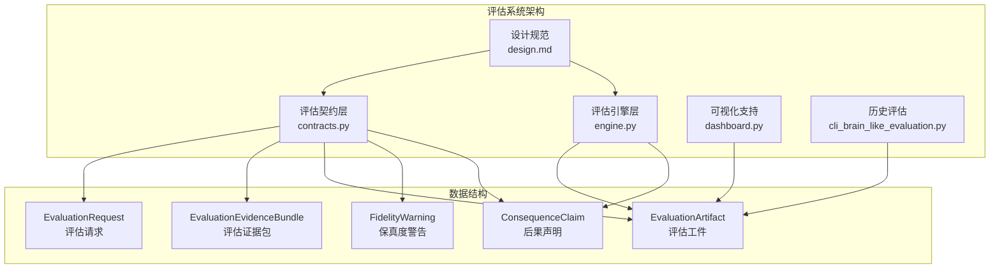
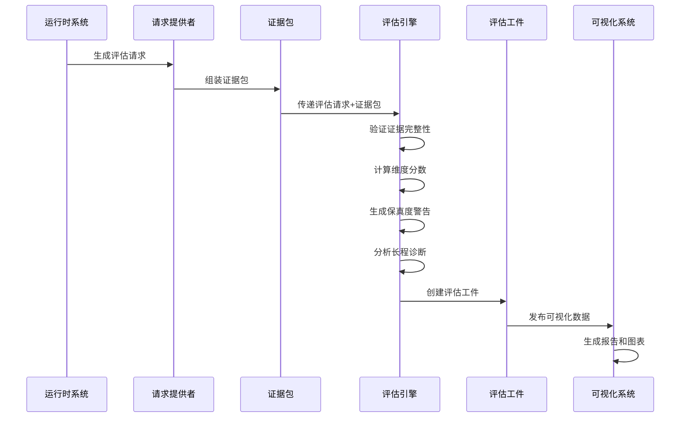
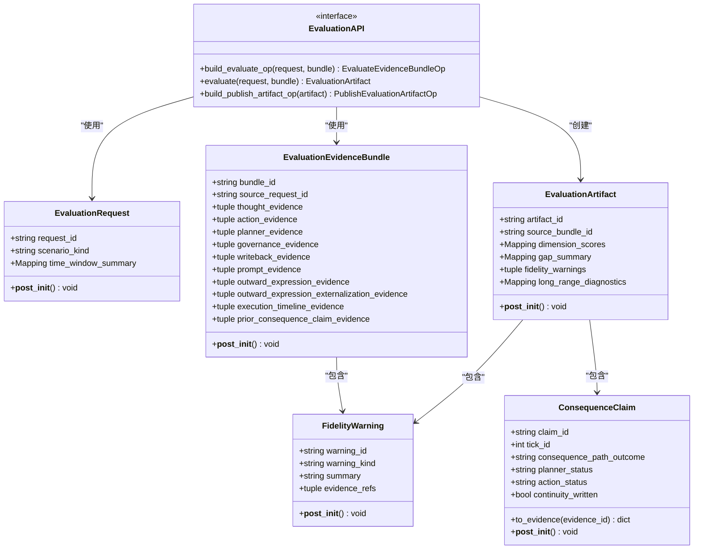
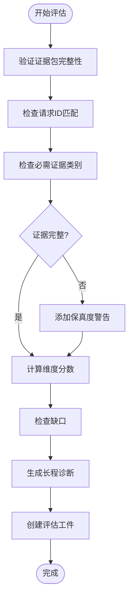
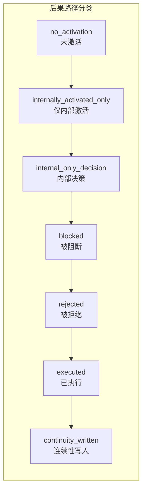
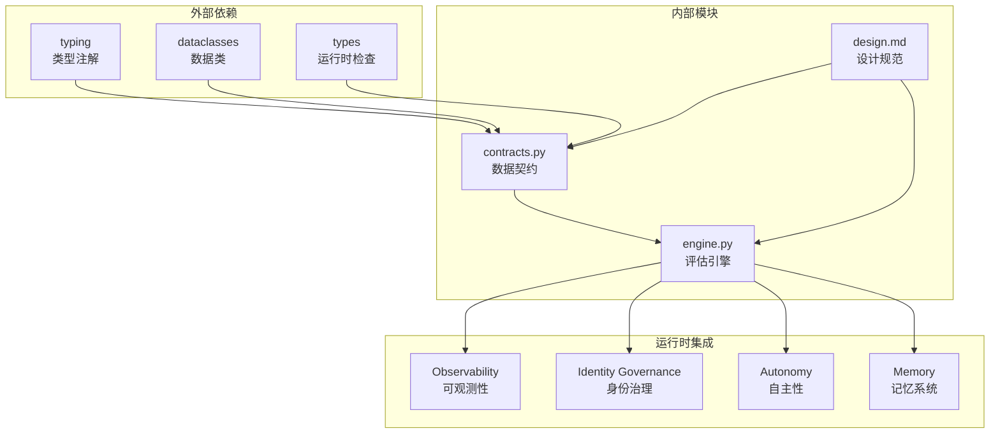
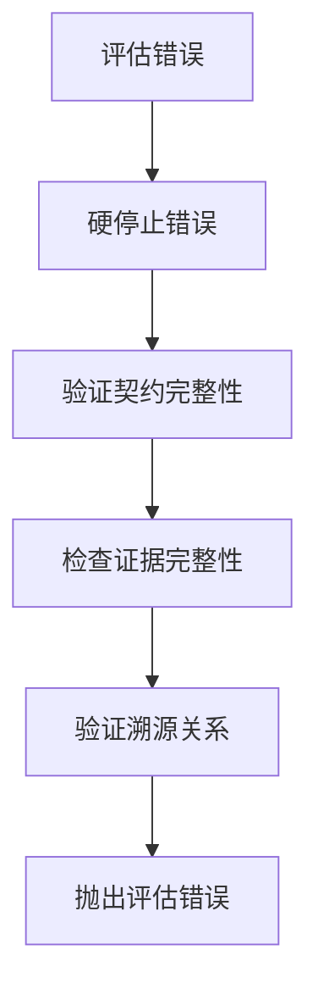

# 评估产物数据结构

<cite>
**本文档引用的文件**
- [contracts.py](file://helios_v2/src/helios_v2/evaluation/contracts.py)
- [engine.py](file://helios_v2/src/helios_v2/evaluation/engine.py)
- [design.md](file://helios_v2/docs/requirements/17-evaluation-fidelity-and-diagnostic-provenance/design.md)
- [cli_brain_like_evaluation.py](file://archive/helios_v1/helios_evaluation/cli_brain_like_evaluation.py)
- [dashboard.py](file://archive/helios_v1/dashboard.py)
</cite>

## 目录
1. [简介](#简介)
2. [项目结构](#项目结构)
3. [核心组件](#核心组件)
4. [架构概览](#架构概览)
5. [详细组件分析](#详细组件分析)
6. [依赖分析](#依赖分析)
7. [性能考虑](#性能考虑)
8. [故障排除指南](#故障排除指南)
9. [结论](#结论)
10. [附录](#附录)

## 简介

Helios评估系统是一个专门设计用于评估人工智能系统表现的数据结构和处理框架。本文档专注于v2版本的评估产物数据模型，详细记录了EvaluationArtifact、DiagnosticProvenance、PerformanceMetrics等核心评估数据结构。

该系统采用完全只读的设计理念，从明确的运行时证据中组装诊断性工件，发布结构化的分数、警告、长程连续性诊断和跨运行比较就绪的证据，而不影响运行时行为。系统确保每个报告的警告或分数都能追溯到明确的运行时证据类别。

## 项目结构

Helios评估系统主要由以下核心模块组成：

**图表来源**
- [contracts.py:1-331](file://helios_v2/src/helios_v2/evaluation/contracts.py#L1-L331)
- [engine.py:1-619](file://helios_v2/src/helios_v2/evaluation/engine.py#L1-L619)
- [design.md:1-107](file://helios_v2/docs/requirements/17-evaluation-fidelity-and-diagnostic-provenance/design.md#L1-L107)

**章节来源**
- [contracts.py:1-331](file://helios_v2/src/helios_v2/evaluation/contracts.py#L1-L331)
- [engine.py:1-619](file://helios_v2/src/helios_v2/evaluation/engine.py#L1-L619)
- [design.md:1-107](file://helios_v2/docs/requirements/17-evaluation-fidelity-and-diagnostic-provenance/design.md#L1-L107)

## 核心组件

### 评估请求（EvaluationRequest）

评估请求是不可变的请求契约，定义了一次只读评估周期的输入参数：

- **request_id**: 唯一的请求标识符
- **scenario_kind**: 场景类型（运行时tick或会话窗口）
- **time_window_summary**: 时间窗口摘要映射

### 证据包（EvaluationEvidenceBundle）

证据包从明确的运行时所有者输出中组装，包含以下证据类别：

- **thought_evidence**: 思维过程证据
- **action_evidence**: 行动外部化证据  
- **planner_evidence**: 规划器结果证据
- **governance_evidence**: 治理证据
- **writeback_evidence**: 连续性写回证据
- **prompt_evidence**: 提示合同证据
- **outward_expression_evidence**: 外向表达证据
- **outward_expression_externalization_evidence**: 外向表达外部化证据

### 评估工件（EvaluationArtifact）

评估工件是从证据包组装的只读诊断工件，包含：

- **dimension_scores**: 维度分数映射
- **gap_summary**: 缺口摘要
- **fidelity_warnings**: 保真度警告列表
- **long_range_diagnostics**: 长程诊断

**章节来源**
- [contracts.py:95-279](file://helios_v2/src/helios_v2/evaluation/contracts.py#L95-L279)

## 架构概览

评估系统采用分层架构，确保完全的只读性和可追溯性：

**图表来源**
- [engine.py:572-619](file://helios_v2/src/helios_v2/evaluation/engine.py#L572-L619)
- [contracts.py:303-331](file://helios_v2/src/helios_v2/evaluation/contracts.py#L303-L331)

## 详细组件分析

### 数据结构类图

**图表来源**
- [contracts.py:95-279](file://helios_v2/src/helios_v2/evaluation/contracts.py#L95-L279)
- [contracts.py:303-331](file://helios_v2/src/helios_v2/evaluation/contracts.py#L303-L331)

### 证据完整性检查流程

**图表来源**
- [engine.py:266-569](file://helios_v2/src/helios_v2/evaluation/engine.py#L266-L569)

### 维度分数计算机制

系统实现了八种核心维度的保真度评分：

| 维度名称 | 计算逻辑 | 评分范围 |
|---------|---------|---------|
| thought_fidelity | 思维证据存在性 | 0.0-1.0 |
| action_fidelity | 行动规范化状态 | 0.0-1.0 |
| continuity_fidelity | 连续性写回状态 | 0.0-1.0 |
| governance_fidelity | 治理证据存在性 | 0.0-1.0 |
| autonomy_fidelity | 自主性证据存在性 | 0.0-1.0 |
| outward_expression_artifact_fidelity | 外向表达链完整性 | 0.0-1.0 |
| internal_to_visible_consequence | 内部到可见后果绑定 | 0.0-1.0 |

**章节来源**
- [engine.py:470-478](file://helios_v2/src/helios_v2/evaluation/engine.py#L470-L478)

### 后果绑定分类体系

系统定义了七种内部到可见后果路径的正式标签：

**图表来源**
- [engine.py:49-80](file://helios_v2/src/helios_v2/evaluation/engine.py#L49-L80)

**章节来源**
- [engine.py:215-245](file://helios_v2/src/helios_v2/evaluation/engine.py#L215-L245)

### 长程连续性诊断

系统提供了四个层面的长程连续性诊断：

1. **late_session_degradation_status**: 会话后期退化状态
2. **continuity_carry_persistence_status**: 连续性承载持久性状态
3. **specific_recall_persistence_status**: 特定回忆持久性状态
4. **user_visible_anchoring_drift_status**: 用户可见锚点漂移状态

**章节来源**
- [engine.py:530-559](file://helios_v2/src/helios_v2/evaluation/engine.py#L530-L559)

## 依赖分析

### 组件耦合关系

**图表来源**
- [contracts.py:16-20](file://helios_v2/src/helios_v2/evaluation/contracts.py#L16-L20)
- [engine.py:3-19](file://helios_v2/src/helios_v2/evaluation/engine.py#L3-L19)

### 错误处理机制

系统采用严格的错误处理策略：

**图表来源**
- [contracts.py:23-25](file://helios_v2/src/helios_v2/evaluation/contracts.py#L23-L25)
- [engine.py:584-607](file://helios_v2/src/helios_v2/evaluation/engine.py#L584-L607)

**章节来源**
- [contracts.py:23-25](file://helios_v2/src/helios_v2/evaluation/contracts.py#L23-L25)
- [engine.py:584-607](file://helios_v2/src/helios_v2/evaluation/engine.py#L584-L607)

## 性能考虑

### 内存优化策略

1. **冻结映射**: 使用`MappingProxyType`确保数据不可变性
2. **元组存储**: 证据项目使用元组存储以减少内存开销
3. **延迟计算**: 仅在需要时计算复杂的诊断指标

### 计算复杂度

- **证据完整性检查**: O(n)时间复杂度，n为证据类别数量
- **维度分数计算**: O(1)时间复杂度，固定数量的维度
- **警告生成**: O(m)时间复杂度，m为缺失证据的数量

### 并发安全性

系统通过以下机制确保并发安全：
- 所有数据结构均为不可变的`@dataclass(frozen=True)`
- 使用类型注解确保运行时类型安全
- 严格的契约验证防止数据污染

## 故障排除指南

### 常见错误类型

1. **证据缺失错误**: 当必需的证据类别不存在时触发
2. **溯源不匹配错误**: 当证据包的源请求ID与评估请求不匹配时触发
3. **配置无效错误**: 当评估配置不符合要求时触发

### 调试建议

1. **检查证据完整性**: 确保所有必需的证据类别都已正确收集
2. **验证请求ID匹配**: 确认证据包的`source_request_id`与评估请求的`request_id`一致
3. **审查保真度警告**: 仔细分析生成的警告以定位问题根源

**章节来源**
- [engine.py:584-607](file://helios_v2/src/helios_v2/evaluation/engine.py#L584-L607)

## 结论

Helios评估系统通过精心设计的数据结构和严格的契约约束，实现了对AI系统表现的全面、可追溯和可比较的评估。系统的核心优势包括：

1. **完全只读设计**: 确保评估不影响运行时行为
2. **强类型安全**: 通过数据类和类型注解保证数据完整性
3. **可追溯性**: 每个分数和警告都有明确的证据来源
4. **可比较性**: 标准化的格式确保跨运行比较的可行性

该系统为AI系统的质量控制、准确性验证和可靠性评估提供了坚实的数据支撑，支持长期存储、趋势分析和改进反馈机制。

## 附录

### 历史评估系统对比

Helios v1提供了基于CLI的脑似评估系统，包含：

- **EvaluationReport**: 完整的评估报告结构
- **EvaluationComparisonReport**: 报告比较功能
- **可视化支持**: 基于dashboard的可视化界面
- **导出格式**: 支持JSON和Markdown格式

这些特性为v2系统的评估产物提供了丰富的历史参考和对比基准。

**章节来源**
- [cli_brain_like_evaluation.py:75-2224](file://archive/helios_v1/helios_evaluation/cli_brain_like_evaluation.py#L75-L2224)
- [dashboard.py](file://archive/helios_v1/dashboard.py)