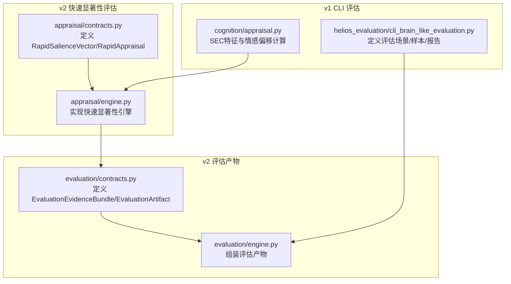
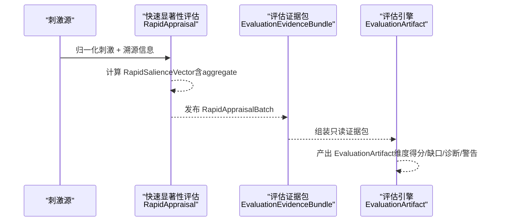
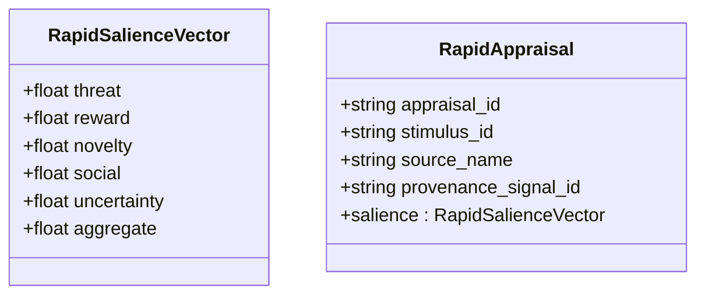
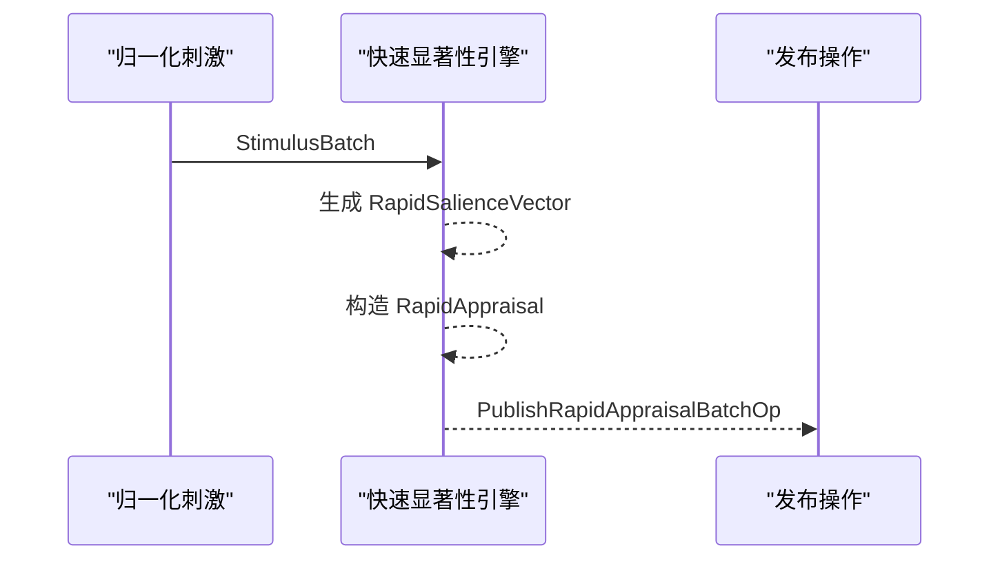
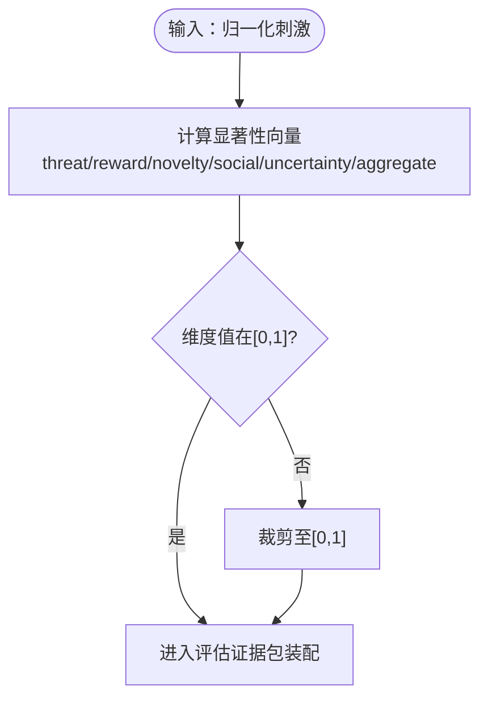
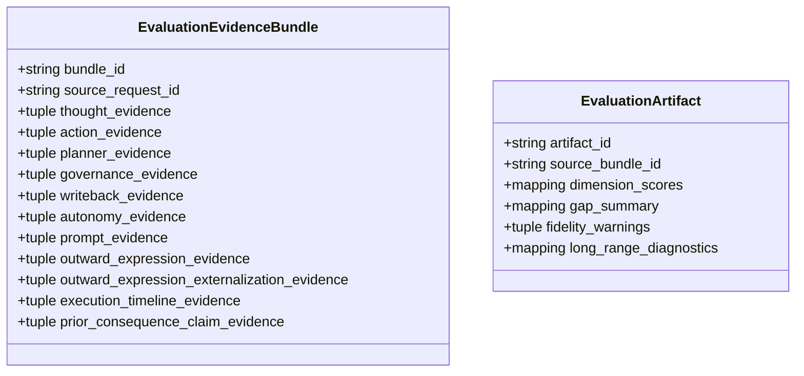
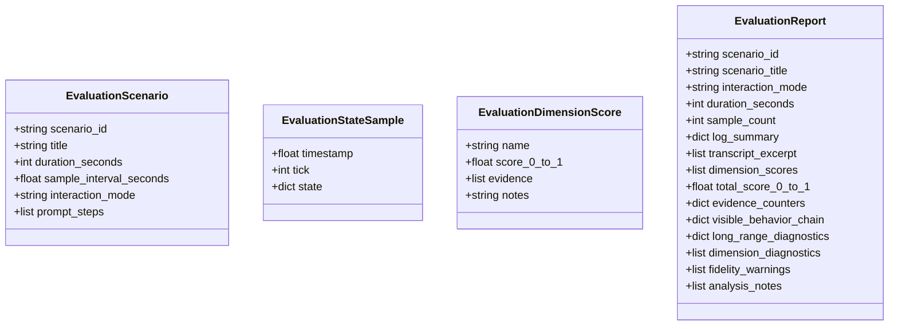
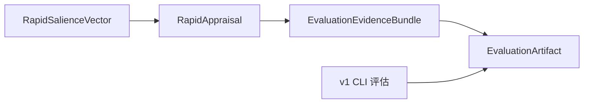

# 评估数据结构

<cite>
**本文档引用的文件**
- [appraisal/contracts.py](file://helios_v2/src/helios_v2/appraisal/contracts.py)
- [evaluation/contracts.py](file://helios_v2/src/helios_v2/evaluation/contracts.py)
- [cli_brain_like_evaluation.py](file://archive/helios_v1/helios_evaluation/cli_brain_like_evaluation.py)
- [appraisal.py](file://archive/helios_v1/cognition/appraisal.py)
- [design.md（聚合显著性判断）](file://helios_v2/docs/requirements/41-aggregate-salience-judgment/design.md)
- [requirement.md（威胁与奖励评估）](file://helios_v2/docs/requirements/40-threat-and-reward-appraisal/requirement.md)
- [requirement.md（不确定性与社交评估）](file://helios_v2/docs/requirements/39-uncertainty-and-social-appraisal/requirement.md)
</cite>

## 目录
1. [引言](#引言)
2. [项目结构](#项目结构)
3. [核心组件](#核心组件)
4. [架构总览](#架构总览)
5. [详细组件分析](#详细组件分析)
6. [依赖分析](#依赖分析)
7. [性能考虑](#性能考虑)
8. [故障排查指南](#故障排查指南)
9. [结论](#结论)
10. [附录](#附录)

## 引言
本文件面向Helios评估系统，聚焦“显著性评分”“评估结果”“情感影响”的数据结构与处理流程，系统化说明以下主题：
- 显著性评分的维度构成与范围约束
- 情感影响的量化表示与组合方式
- 评估结果的结构化存储与发布
- 评估数据的时间戳管理、历史记录与趋势分析支持
- 可解释性数据格式、置信度与不确定性量化
- 评估数据的隐私保护、安全存储与合规性要求

## 项目结构
评估相关代码主要分布在v2模块的“快速显著性评估”和“评估产物”两个子系统，以及v1中用于CLI脑波式评估的报告与评分体系。下图展示与评估数据结构直接相关的模块与职责。

**图表来源**
- [appraisal/contracts.py:27-106](file://helios_v2/src/helios_v2/appraisal/contracts.py#L27-L106)
- [evaluation/contracts.py:179-279](file://helios_v2/src/helios_v2/evaluation/contracts.py#L179-L279)
- [cli_brain_like_evaluation.py:25-138](file://archive/helios_v1/helios_evaluation/cli_brain_like_evaluation.py#L25-L138)
- [appraisal.py:12-99](file://archive/helios_v1/cognition/appraisal.py#L12-L99)

**章节来源**
- [appraisal/contracts.py:1-239](file://helios_v2/src/helios_v2/appraisal/contracts.py#L1-L239)
- [evaluation/contracts.py:1-331](file://helios_v2/src/helios_v2/evaluation/contracts.py#L1-L331)
- [cli_brain_like_evaluation.py:1-800](file://archive/helios_v1/helios_evaluation/cli_brain_like_evaluation.py#L1-L800)
- [appraisal.py:1-302](file://archive/helios_v1/cognition/appraisal.py#L1-L302)

## 核心组件
- 显著性向量（RapidSalienceVector）
  - 维度：threat、reward、novelty、social、uncertainty、aggregate
  - 约束：每个维度值域为[0,1]，构造时进行范围校验
- 快速评估（RapidAppraisal）
  - 结构：appraisal_id、stimulus_id、source_name、salience（向量）、provenance_signal_id
  - 用途：承载一次归一化刺激的粗粒度显著性评估结果，并保留上游信号溯源
- 评估证据包（EvaluationEvidenceBundle）
  - 结构：包含来自各Owner的只读证据集合（如思考、动作、规划、治理、写回、自主性、提示词、外显表达、外部化外显等），以及先验“后果声明证据”
  - 用途：作为评估装配的输入，确保评估过程可追溯、可审计
- 评估产物（EvaluationArtifact）
  - 结构：artifact_id、source_bundle_id、dimension_scores（维度得分映射）、gap_summary（缺口摘要）、fidelity_warnings（保真度警告）、long_range_diagnostics（长程诊断）
  - 用途：输出不可变的评估诊断产物，供后续分析与可视化

**章节来源**
- [appraisal/contracts.py:27-106](file://helios_v2/src/helios_v2/appraisal/contracts.py#L27-L106)
- [evaluation/contracts.py:179-279](file://helios_v2/src/helios_v2/evaluation/contracts.py#L179-L279)

## 架构总览
下图展示从“快速显著性评估”到“评估产物”的端到端数据流，强调数据在各层之间的不变性与可追溯性。

**图表来源**
- [appraisal/contracts.py:57-106](file://helios_v2/src/helios_v2/appraisal/contracts.py#L57-L106)
- [evaluation/contracts.py:179-279](file://helios_v2/src/helios_v2/evaluation/contracts.py#L179-L279)

## 详细组件分析

### 显著性评分数据模型（SalienceScore）
- 数据结构
  - RapidSalienceVector：包含threat、reward、novelty、social、uncertainty、aggregate六个标量，均限定在[0,1]区间
  - RapidAppraisal：封装一次评估的标识、关联刺激、来源与溯源信号ID，以及其显著性向量
- 计算方法与来源
  - 威胁与奖励：通过原型嵌入与cos相似度计算，原型在装配期一次性嵌入缓存，评估期仅做一次嵌入与少量余弦运算，满足“快速、无网络依赖”
  - 新颖性与不确定性：基于记忆检索的Top-N命中与阈值判定，不确定性复用“提升查询”以获取Top-2候选
  - 社交维度：常量时间传输查找，不引入LLM
  - 聚合评分：加权聚合估计器对各维度加权求和并四舍五入至固定精度，权重可配置
- 范围与稳定性
  - 所有维度在构造阶段强制约束在[0,1]，保证评估结果稳定且与合约一致
  - 对相同输入，维度值必须确定且与墙钟时间无关

**图表来源**
- [appraisal/contracts.py:27-106](file://helios_v2/src/helios_v2/appraisal/contracts.py#L27-L106)

**章节来源**
- [appraisal/contracts.py:27-106](file://helios_v2/src/helios_v2/appraisal/contracts.py#L27-L106)
- [requirement.md（威胁与奖励评估）:46-51](file://helios_v2/docs/requirements/40-threat-and-reward-appraisal/requirement.md#L46-L51)
- [requirement.md（不确定性与社交评估）:45-50](file://helios_v2/docs/requirements/39-uncertainty-and-social-appraisal/requirement.md#L45-L50)
- [design.md（聚合显著性判断）:71-96](file://helios_v2/docs/requirements/41-aggregate-salience-judgment/design.md#L71-L96)

### 评估结果数据模型（AppraisalResult）
- 数据结构
  - RapidAppraisal：携带appraisal_id、stimulus_id、source_name、provenance_signal_id与salience向量
  - RapidAppraisalBatch：不可变批次容器，包含多个RapidAppraisal
  - 评估请求与发布操作：AssessStimulusBatchOp、PublishRapidAppraisalBatchOp，用于编排与审计
- 处理逻辑
  - 从归一化刺激构建评估结果，保留上游信号溯源；若缺失必要溯源字段则抛出错误
  - 批次发布用于下游门控层消费，确保可观测性与审计

**图表来源**
- [appraisal/contracts.py:57-170](file://helios_v2/src/helios_v2/appraisal/contracts.py#L57-L170)

**章节来源**
- [appraisal/contracts.py:57-170](file://helios_v2/src/helios_v2/appraisal/contracts.py#L57-L170)

### 情感影响量化（EmotionalImpact）
- v2中的情感影响由“显著性向量”承载，其中：
  - threat/reward：反映威胁/奖励驱动
  - novelty：新颖性驱动
  - social：社交相关性
  - uncertainty：不确定性驱动
  - aggregate：整体聚合显著性
- v1中的情感影响通过SEC特征与Panksepp激活模型计算，得到各情感维度与情感偏移（valence/arousal），可用于对照或迁移映射

**图表来源**
- [appraisal/contracts.py:27-55](file://helios_v2/src/helios_v2/appraisal/contracts.py#L27-L55)
- [appraisal.py:27-99](file://archive/helios_v1/cognition/appraisal.py#L27-L99)

**章节来源**
- [appraisal/contracts.py:27-55](file://helios_v2/src/helios_v2/appraisal/contracts.py#L27-L55)
- [appraisal.py:27-99](file://archive/helios_v1/cognition/appraisal.py#L27-L99)

### 评估产物与可解释性（EvaluationArtifact）
- 数据结构
  - EvaluationEvidenceBundle：按类别冻结证据集合（思考、动作、规划、治理、写回、自主性、提示词、外显表达、外部化外显、执行时间线、先验后果声明证据）
  - EvaluationArtifact：包含维度得分映射、缺口摘要、保真度警告、长程诊断
- 可解释性与置信度
  - 证据冻结与证据ID约束，确保评估结论可追溯
  - 保真度警告用于标注潜在偏差或缺口，辅助置信度判断
  - 长程诊断提供跨时间窗口的趋势与一致性分析线索

**图表来源**
- [evaluation/contracts.py:179-279](file://helios_v2/src/helios_v2/evaluation/contracts.py#L179-L279)

**章节来源**
- [evaluation/contracts.py:179-279](file://helios_v2/src/helios_v2/evaluation/contracts.py#L179-L279)

### v1 CLI 评估报告（可选迁移参考）
- 数据结构
  - EvaluationScenario：包含场景ID、标题、持续时间、采样间隔、交互模式与提示步骤列表
  - EvaluationStateSample：包含时间戳、tick编号与状态快照
  - EvaluationDimensionScore：包含维度名称、0~1得分、证据列表与备注
  - EvaluationReport：包含场景元信息、转录摘录、维度得分、总分、证据计数器、可见行为链、长程诊断、保真度警告与分析注释
- 时间戳与历史
  - EvaluationStateSample提供时间戳与tick编号，便于趋势分析
  - EvaluationReport汇总多维证据与长程诊断，支撑对比分析
- 可解释性
  - 维度得分与证据列表、备注、警告与分析注释共同构成可解释性数据

**图表来源**
- [cli_brain_like_evaluation.py:25-138](file://archive/helios_v1/helios_evaluation/cli_brain_like_evaluation.py#L25-L138)

**章节来源**
- [cli_brain_like_evaluation.py:25-138](file://archive/helios_v1/helios_evaluation/cli_brain_like_evaluation.py#L25-L138)

## 依赖分析
- 组件耦合
  - RapidSalienceVector与RapidAppraisal强绑定，前者负责评分，后者负责溯源与发布
  - EvaluationEvidenceBundle对各Owner输出进行只读冻结，降低耦合与副作用
  - EvaluationArtifact依赖证据包的完整性与一致性，确保评估结论可复现
- 外部依赖
  - v2要求快速路径“无网络、无重型依赖”，原型嵌入与相似度计算在装配期完成
  - v1 CLI评估依赖日志与转录文本，通过规则匹配与计数器提取诊断线索

**图表来源**
- [appraisal/contracts.py:27-106](file://helios_v2/src/helios_v2/appraisal/contracts.py#L27-L106)
- [evaluation/contracts.py:179-279](file://helios_v2/src/helios_v2/evaluation/contracts.py#L179-L279)
- [cli_brain_like_evaluation.py:25-138](file://archive/helios_v1/helios_evaluation/cli_brain_like_evaluation.py#L25-L138)

**章节来源**
- [appraisal/contracts.py:27-106](file://helios_v2/src/helios_v2/appraisal/contracts.py#L27-L106)
- [evaluation/contracts.py:179-279](file://helios_v2/src/helios_v2/evaluation/contracts.py#L179-L279)
- [cli_brain_like_evaluation.py:25-138](file://archive/helios_v1/helios_evaluation/cli_brain_like_evaluation.py#L25-L138)

## 性能考虑
- 快速显著性路径
  - 原型嵌入装配期缓存，评估期仅做一次嵌入与少量余弦计算
  - 不引入LLM与新重型依赖，保持“快速、无网络”
- 不确定性与社交
  - 不确定性复用“提升查询”获取Top-2候选，社交采用常量时间传输查找
- v1 CLI评估
  - 使用规则匹配与计数器统计，避免复杂推理开销

**章节来源**
- [requirement.md（威胁与奖励评估）:46-51](file://helios_v2/docs/requirements/40-threat-and-reward-appraisal/requirement.md#L46-L51)
- [requirement.md（不确定性与社交评估）:45-50](file://helios_v2/docs/requirements/39-uncertainty-and-social-appraisal/requirement.md#L45-L50)

## 故障排查指南
- 显著性评分异常
  - 现象：维度越界或构造失败
  - 排查：检查输入归一化与范围裁剪逻辑；确认构造阶段的范围校验是否触发
- 评估批次发布失败
  - 现象：发布操作因批次畸形而拒绝
  - 排查：核对RapidAppraisal的溯源字段完整性；确保批次中无缺失溯源记录
- 证据包装配失败
  - 现象：证据项缺少evidence_id或映射键为空
  - 排查：检查证据收集阶段是否遗漏证据ID；确认冻结逻辑是否生效
- v1 CLI报告异常
  - 现象：转录为空导致语言自然度可信度受限；存在动作提案但无可见回复
  - 排查：检查日志与转录提取逻辑；核对可见行为链构建与证据计数器

**章节来源**
- [appraisal/contracts.py:22-25](file://helios_v2/src/helios_v2/appraisal/contracts.py#L22-L25)
- [appraisal/contracts.py:98-106](file://helios_v2/src/helios_v2/appraisal/contracts.py#L98-L106)
- [evaluation/contracts.py:58-76](file://helios_v2/src/helios_v2/evaluation/contracts.py#L58-L76)
- [cli_brain_like_evaluation.py:794-800](file://archive/helios_v1/helios_evaluation/cli_brain_like_evaluation.py#L794-L800)

## 结论
本文件梳理了Helios评估系统的核心数据结构与处理流程，明确了显著性评分的维度构成与计算路径、评估结果的结构化存储与发布机制、以及可解释性与保真度保障措施。v2模块通过合约约束与冻结证据包确保评估过程的确定性与可观测性；v1 CLI评估提供了可迁移的历史报告与诊断思路。未来可在以下方面持续演进：
- 将聚合显著性估计器的权重与阈值纳入可学习参数
- 扩展长程诊断指标以支持更细粒度的趋势分析
- 完善隐私与安全策略，确保评估数据在采集、存储与传输环节符合合规要求

## 附录

### 时间戳管理与历史记录
- v2：通过评估证据包与先验“后果声明证据”对上一时刻状态进行对齐，支持跨tick一致性校验
- v1：通过EvaluationStateSample的timestamp与tick编号，支持趋势分析与对比报告

**章节来源**
- [evaluation/contracts.py:113-148](file://helios_v2/src/helios_v2/evaluation/contracts.py#L113-L148)
- [cli_brain_like_evaluation.py:45-50](file://archive/helios_v1/helios_evaluation/cli_brain_like_evaluation.py#L45-L50)

### 置信度与不确定性量化
- v2：通过uncertainty维度与保真度警告共同表征不确定性；聚合评分采用加权求和并限制精度
- v1：通过日志与转录统计提取保真度线索，辅助置信度判断

**章节来源**
- [appraisal/contracts.py:27-55](file://helios_v2/src/helios_v2/appraisal/contracts.py#L27-L55)
- [cli_brain_like_evaluation.py:793-800](file://archive/helios_v1/helios_evaluation/cli_brain_like_evaluation.py#L793-L800)

### 隐私保护、安全存储与合规性
- 证据冻结与最小化暴露：证据包对各Owner输出进行冻结与校验，避免运行时突变与敏感信息泄露
- 合规性要求：评估过程不得引入第二套日志机制，所有维度与结果需通过现有合约传递，确保可审计与可追溯
- 建议实践：对包含个人身份或敏感语料的证据进行脱敏处理；在存储与传输中采用加密与访问控制；定期进行数据完整性校验

**章节来源**
- [requirement.md（不确定性与社交评估）:45-50](file://helios_v2/docs/requirements/39-uncertainty-and-social-appraisal/requirement.md#L45-L50)
- [evaluation/contracts.py:58-76](file://helios_v2/src/helios_v2/evaluation/contracts.py#L58-L76)