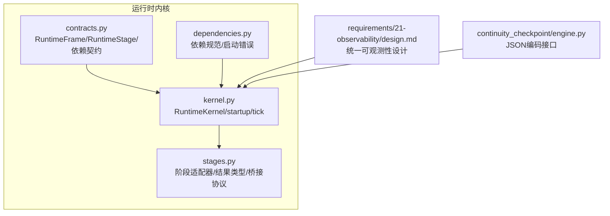
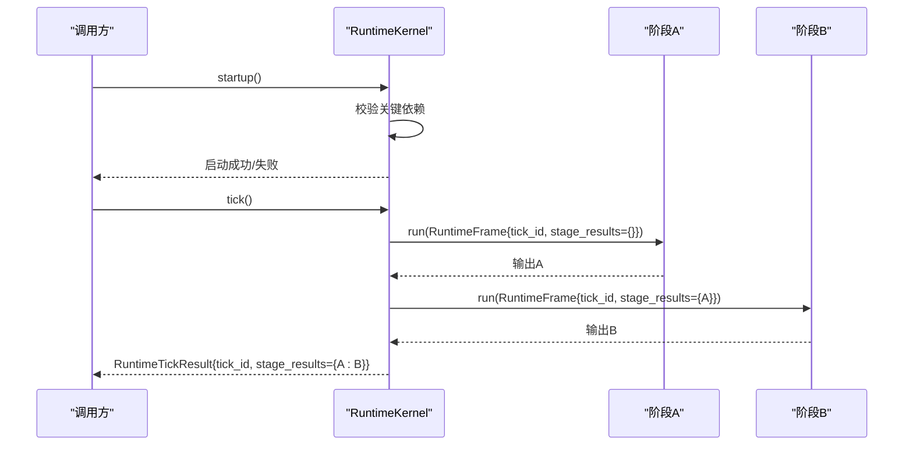
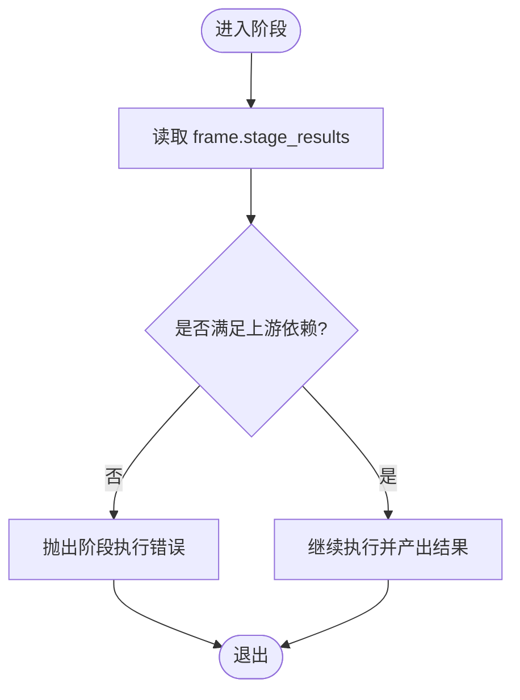
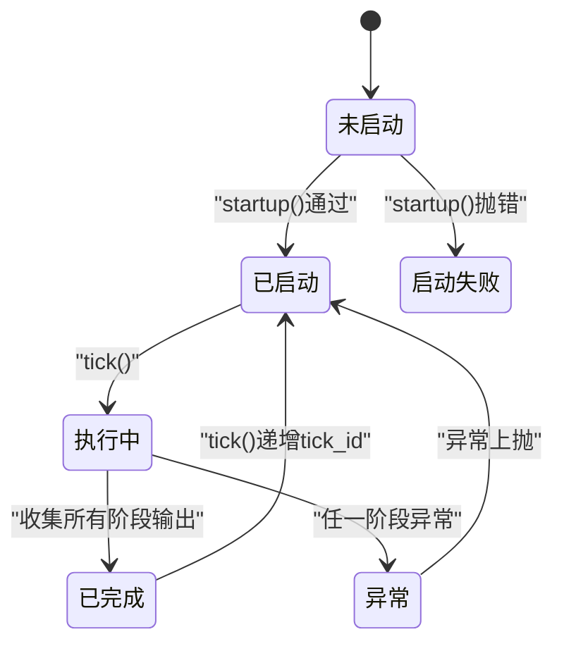
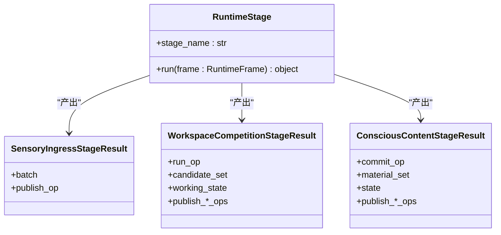
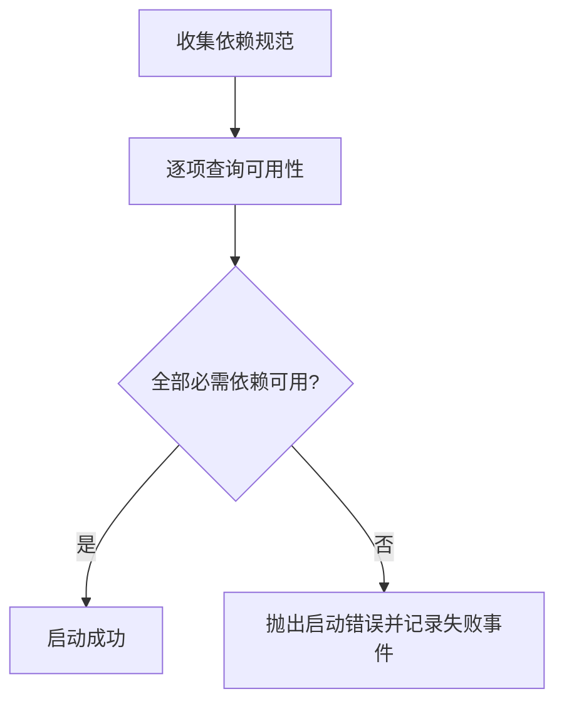
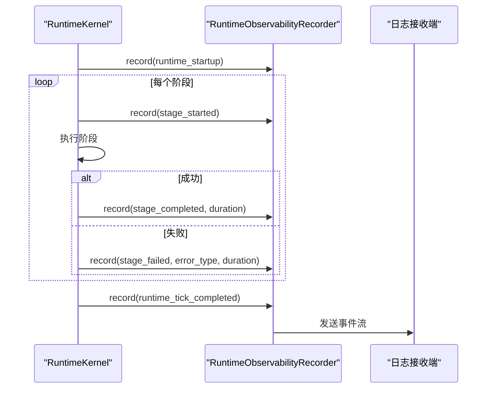
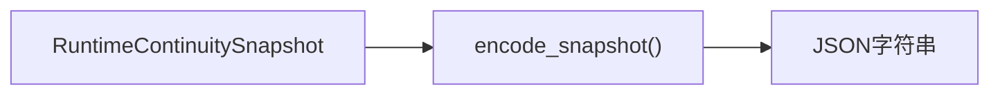
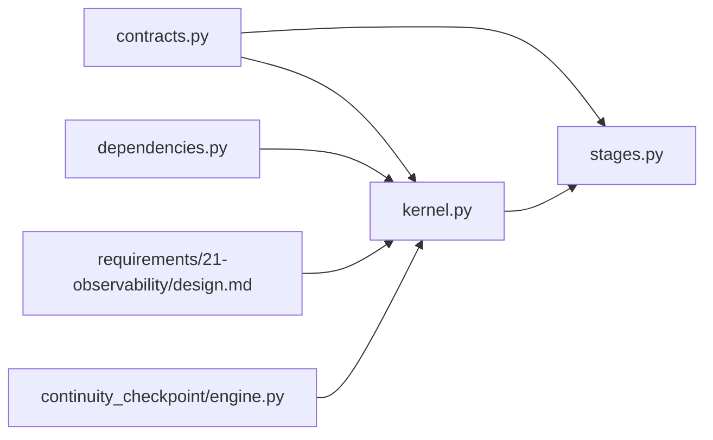

# 运行时数据结构

<cite>
**本文引用的文件**
- [runtime/contracts.py](file://helios_v2/src/helios_v2/runtime/contracts.py)
- [runtime/kernel.py](file://helios_v2/src/helios_v2/runtime/kernel.py)
- [runtime/dependencies.py](file://helios_v2/src/helios_v2/runtime/dependencies.py)
- [runtime/stages.py](file://helios_v2/src/helios_v2/runtime/stages.py)
- [runtime/__init__.py](file://helios_v2/src/helios_v2/runtime/__init__.py)
- [requirements/01-runtime-kernel/design.md](file://helios_v2/docs/requirements/01-runtime-kernel/design.md)
- [requirements/01-runtime-kernel/task.md](file://helios_v2/docs/requirements/01-runtime-kernel/task.md)
- [requirements/21-unified-runtime-observability-and-logging/design.md](file://helios_v2/docs/requirements/21-unified-runtime-observability-and-logging/design.md)
- [requirements/22-runtime-composition-root-and-runnable-runtime/task.md](file://helios_v2/docs/requirements/22-runtime-composition-root-and-runnable-runtime/task.md)
- [continuity_checkpoint/engine.py](file://helios_v2/src/helios_v2/continuity_checkpoint/engine.py)
- [tests/test_runtime_dependencies.py](file://helios_v2/tests/test_runtime_dependencies.py)
- [tests/test_runtime_kernel_observability.py](file://helios_v2/tests/test_runtime_kernel_observability.py)
- [tests/test_observability_timeline.py](file://helios_v2/tests/test_observability_timeline.py)
</cite>

## 目录
1. [简介](#简介)
2. [项目结构](#项目结构)
3. [核心组件](#核心组件)
4. [架构总览](#架构总览)
5. [详细组件分析](#详细组件分析)
6. [依赖分析](#依赖分析)
7. [性能考虑](#性能考虑)
8. [故障排查指南](#故障排查指南)
9. [结论](#结论)
10. [附录](#附录)

## 简介
本文件面向Helios v2运行时内核，系统化梳理并文档化以下核心运行时数据模型与流程：
- RuntimeFrame：不可变的运行时输入契约，承载当前tick的tick_id与前序阶段结果映射
- RuntimeTickResult：一次tick的结构化输出快照
- RuntimeStage协议：阶段生命周期契约
- RuntimeKernel：启动门禁与有序阶段调度器
- 各阶段适配器（StageAdapter）：将领域所有者API桥接到有序执行链
- 运行时状态转换、阶段间数据传递、错误处理与可观测性事件流
- 数据结构的序列化格式、JSON Schema定义建议、数据完整性校验方法
- 生命周期管理、内存优化策略与性能考量

## 项目结构
Helios v2运行时内核位于runtime包中，围绕“契约-内核-适配器”的分层组织：
- 契约层：定义RuntimeFrame、RuntimeStage、依赖规范与状态
- 内核层：实现启动门禁、阶段注册与tick调度
- 适配器层：将各领域所有者的操作封装为可组合的阶段
- 可观测性：统一事件发射与时间线重建
- 持久化：连续性检查点编码（JSON）

图表来源
- [runtime/contracts.py:1-50](file://helios_v2/src/helios_v2/runtime/contracts.py#L1-L50)
- [runtime/kernel.py:1-145](file://helios_v2/src/helios_v2/runtime/kernel.py#L1-L145)
- [runtime/dependencies.py:1-40](file://helios_v2/src/helios_v2/runtime/dependencies.py#L1-L40)
- [runtime/stages.py:1-800](file://helios_v2/src/helios_v2/runtime/stages.py#L1-L800)
- [requirements/21-unified-runtime-observability-and-logging/design.md:1-97](file://helios_v2/docs/requirements/21-unified-runtime-observability-and-logging/design.md#L1-L97)
- [continuity_checkpoint/engine.py:172-209](file://helios_v2/src/helios_v2/continuity_checkpoint/engine.py#L172-L209)

章节来源
- [runtime/contracts.py:1-50](file://helios_v2/src/helios_v2/runtime/contracts.py#L1-L50)
- [runtime/kernel.py:1-145](file://helios_v2/src/helios_v2/runtime/kernel.py#L1-L145)
- [runtime/dependencies.py:1-40](file://helios_v2/src/helios_v2/runtime/dependencies.py#L1-L40)
- [runtime/stages.py:1-800](file://helios_v2/src/helios_v2/runtime/stages.py#L1-L800)
- [requirements/01-runtime-kernel/design.md:1-29](file://helios_v2/docs/requirements/01-runtime-kernel/design.md#L1-L29)
- [requirements/21-unified-runtime-observability-and-logging/design.md:1-97](file://helios_v2/docs/requirements/21-unified-runtime-observability-and-logging/design.md#L1-L97)
- [requirements/22-runtime-composition-root-and-runnable-runtime/task.md:97-102](file://helios_v2/docs/requirements/22-runtime-composition-root-and-runnable-runtime/task.md#L97-L102)

## 核心组件
本节聚焦三个核心数据模型及其相关契约与内核行为。

- RuntimeFrame
  - 不可变输入契约，用于向单个阶段传递当前tick信息与前序阶段结果
  - 字段
    - tick_id: 整数，当前tick编号
    - stage_results: 映射或空，键为阶段名，值为该阶段输出；构造后冻结为只读视图
  - 验证规则
    - 构造后通过后处理函数将传入字典冻结为只读映射，防止阶段内部修改
  - 使用场景
    - 每个阶段在run(frame)中读取上游阶段结果，确保严格顺序与确定性
  - 错误处理
    - 若阶段需要上游结果但缺失，抛出阶段执行错误（由适配器辅助函数触发）
  - 序列化
    - 作为内核tick调度的一部分，不直接对外暴露；可通过RuntimeTickResult间接序列化

- RuntimeTickResult
  - 结构化快照，记录一次tick中所有已执行阶段的输出
  - 字段
    - tick_id: 整数，当前tick编号
    - stage_results: 映射，键为阶段名，值为对应阶段输出
  - 验证规则
    - 构造后冻结映射，保证外部不可变性
  - 使用场景
    - tick结束时返回给调用方，作为后续装配与评估的输入

- RuntimeStage协议
  - 阶段生命周期契约
  - 成员
    - stage_name: 属性，稳定且唯一的阶段名称
    - run(frame): 方法，接收RuntimeFrame并返回任意对象（阶段输出）
  - 注册约束
    - 内核禁止重复注册相同stage_name的阶段

- RuntimeKernel
  - 启动门禁与有序调度器
  - 关键职责
    - startup：验证关键依赖可用性，失败则抛出启动错误
    - register_stage：注册阶段并去重
    - tick：按注册顺序执行阶段，构建RuntimeFrame并收集输出，注入可观测性事件
  - 错误处理
    - 单阶段异常会记录失败事件并向上抛出
  - 可观测性
    - 在启动成功/失败、阶段开始/完成/失败、tick完成等节点发出结构化事件

章节来源
- [runtime/contracts.py:30-50](file://helios_v2/src/helios_v2/runtime/contracts.py#L30-L50)
- [runtime/kernel.py:17-145](file://helios_v2/src/helios_v2/runtime/kernel.py#L17-L145)
- [runtime/dependencies.py:8-40](file://helios_v2/src/helios_v2/runtime/dependencies.py#L8-L40)
- [tests/test_runtime_dependencies.py:77-122](file://helios_v2/tests/test_runtime_dependencies.py#L77-L122)

## 架构总览
运行时内核采用“窄而精”的编排角色：负责启动门禁、阶段注册与有序调度，不承担领域策略与传输细节。阶段适配器将各领域所有者API封装为标准阶段，形成可组合的执行链。

图表来源
- [runtime/kernel.py:46-145](file://helios_v2/src/helios_v2/runtime/kernel.py#L46-L145)
- [runtime/contracts.py:30-50](file://helios_v2/src/helios_v2/runtime/contracts.py#L30-L50)
- [requirements/01-runtime-kernel/design.md:23-29](file://helios_v2/docs/requirements/01-runtime-kernel/design.md#L23-L29)

## 详细组件分析

### RuntimeFrame与阶段间数据传递
- 不可变性
  - 构造后冻结stage_results，避免阶段间竞态与意外篡改
- 传递路径
  - 内核在每次tick中为每个阶段构建RuntimeFrame，其中stage_results为到当前阶段为止的累积输出映射
- 上游依赖校验
  - 适配器可使用工具函数要求特定上游阶段结果存在且类型匹配，否则立即失败

图表来源
- [runtime/stages.py:828-839](file://helios_v2/src/helios_v2/runtime/stages.py#L828-L839)
- [runtime/contracts.py:25-39](file://helios_v2/src/helios_v2/runtime/contracts.py#L25-L39)

章节来源
- [runtime/contracts.py:25-39](file://helios_v2/src/helios_v2/runtime/contracts.py#L25-L39)
- [runtime/stages.py:828-839](file://helios_v2/src/helios_v2/runtime/stages.py#L828-L839)
- [tests/test_runtime_dependencies.py:87-112](file://helios_v2/tests/test_runtime_dependencies.py#L87-L112)

### RuntimeKernel生命周期与状态转换
- 启动阶段
  - 校验required=true的关键依赖；全部可用则记录成功事件，否则抛出启动错误并记录失败事件
- 执行阶段
  - 为每个阶段构建RuntimeFrame并执行，记录阶段开始/完成/失败事件
  - 收集阶段输出，生成RuntimeTickResult
- 状态字段
  - _tick_id：自增的当前tick编号
  - _stages：已注册阶段列表（按注册顺序执行）

图表来源
- [runtime/kernel.py:46-145](file://helios_v2/src/helios_v2/runtime/kernel.py#L46-L145)
- [requirements/21-unified-runtime-observability-and-logging/design.md:54-62](file://helios_v2/docs/requirements/21-unified-runtime-observability-and-logging/design.md#L54-L62)

章节来源
- [runtime/kernel.py:28-145](file://helios_v2/src/helios_v2/runtime/kernel.py#L28-L145)
- [requirements/21-unified-runtime-observability-and-logging/design.md:54-62](file://helios_v2/docs/requirements/21-unified-runtime-observability-and-logging/design.md#L54-L62)

### 阶段适配器与结果类型
- 作用
  - 将领域所有者API（如感知、情感、记忆、工作空间等）封装为标准阶段
  - 提供阶段专用的结果类型（如SensoryIngressStageResult、NeuromodulatorStageResult等）
- 典型模式
  - 以@dataclass(frozen=True)定义结果类型，确保不可变性
  - 提供inactive工厂方法，用于“非激活”tick（如未触发的检索/表达阶段）
- 上下游桥接
  - 通过协议（如ConsciousContentMaterialProvider、ThoughtGateSignalProvider等）从上游阶段抽取必要信号，驱动当前阶段决策

图表来源
- [runtime/stages.py:172-274](file://helios_v2/src/helios_v2/runtime/stages.py#L172-L274)
- [runtime/stages.py:254-263](file://helios_v2/src/helios_v2/runtime/stages.py#L254-L263)
- [runtime/stages.py:265-274](file://helios_v2/src/helios_v2/runtime/stages.py#L265-L274)

章节来源
- [runtime/stages.py:172-274](file://helios_v2/src/helios_v2/runtime/stages.py#L172-L274)
- [runtime/stages.py:254-274](file://helios_v2/src/helios_v2/runtime/stages.py#L254-L274)

### 依赖规范与启动错误模型
- RuntimeDependencySpec
  - name：依赖名称
  - required：是否必需
  - description：描述
- RuntimeDependencyProvider
  - get_dependency_status(name)：返回可用性报告
- RuntimeStartupError
  - 当存在缺失必需依赖时抛出，携带缺失清单

图表来源
- [runtime/dependencies.py:8-40](file://helios_v2/src/helios_v2/runtime/dependencies.py#L8-L40)
- [runtime/kernel.py:46-74](file://helios_v2/src/helios_v2/runtime/kernel.py#L46-L74)

章节来源
- [runtime/dependencies.py:8-40](file://helios_v2/src/helios_v2/runtime/dependencies.py#L8-L40)
- [runtime/kernel.py:46-74](file://helios_v2/src/helios_v2/runtime/kernel.py#L46-L74)

### 可观测性与事件流
- 事件种类
  - runtime_startup、runtime_startup_failed、stage_started、stage_completed、stage_failed、runtime_tick_completed
- 触发时机
  - startup成功/失败、每个阶段开始/完成/失败、tick完成
- 记录内容
  - 包含tick_id、stage_name、阶段索引、耗时、错误类型等

图表来源
- [runtime/kernel.py:75-145](file://helios_v2/src/helios_v2/runtime/kernel.py#L75-L145)
- [requirements/21-unified-runtime-observability-and-logging/design.md:54-75](file://helios_v2/docs/requirements/21-unified-runtime-observability-and-logging/design.md#L54-L75)

章节来源
- [runtime/kernel.py:75-145](file://helios_v2/src/helios_v2/runtime/kernel.py#L75-L145)
- [tests/test_runtime_kernel_observability.py](file://helios_v2/tests/test_runtime_kernel_observability.py)
- [tests/test_observability_timeline.py:121-162](file://helios_v2/tests/test_observability_timeline.py#L121-L162)

### 连续性检查点与序列化
- JSON编码
  - 将运行时连续性快照编码为确定性的JSON文本，包含版本号、tick_id以及相关状态投影
- 使用场景
  - 冷启动恢复、重启续跑、调试与审计

图表来源
- [continuity_checkpoint/engine.py:177-209](file://helios_v2/src/helios_v2/continuity_checkpoint/engine.py#L177-L209)

章节来源
- [continuity_checkpoint/engine.py:177-209](file://helios_v2/src/helios_v2/continuity_checkpoint/engine.py#L177-L209)

## 依赖分析
- 组件耦合
  - kernel依赖contracts（RuntimeFrame/RuntimeStage）、dependencies（依赖规范/启动错误）
  - stages依赖各领域API与contracts
  - 可观测性独立于内核，仅通过事件接口交互
- 直接依赖
  - kernel -> contracts, dependencies
  - stages -> contracts
  - 运行时装配与组合在其他模块中进行（见任务文档）

图表来源
- [runtime/kernel.py:10-11](file://helios_v2/src/helios_v2/runtime/kernel.py#L10-L11)
- [runtime/contracts.py:1-6](file://helios_v2/src/helios_v2/runtime/contracts.py#L1-L6)
- [runtime/dependencies.py:5-6](file://helios_v2/src/helios_v2/runtime/dependencies.py#L5-L6)
- [requirements/21-unified-runtime-observability-and-logging/design.md:1-14](file://helios_v2/docs/requirements/21-unified-runtime-observability-and-logging/design.md#L1-L14)
- [continuity_checkpoint/engine.py:177-209](file://helios_v2/src/helios_v2/continuity_checkpoint/engine.py#L177-L209)

章节来源
- [runtime/kernel.py:10-11](file://helios_v2/src/helios_v2/runtime/kernel.py#L10-L11)
- [runtime/contracts.py:1-6](file://helios_v2/src/helios_v2/runtime/contracts.py#L1-L6)
- [runtime/dependencies.py:5-6](file://helios_v2/src/helios_v2/runtime/dependencies.py#L5-L6)
- [requirements/21-unified-runtime-observability-and-logging/design.md:1-14](file://helios_v2/docs/requirements/21-unified-runtime-observability-and-logging/design.md#L1-L14)
- [requirements/22-runtime-composition-root-and-runnable-runtime/task.md:97-102](file://helios_v2/docs/requirements/22-runtime-composition-root-and-runnable-runtime/task.md#L97-L102)

## 性能考虑
- 冻结映射与不可变性
  - RuntimeFrame与RuntimeTickResult中的映射均在构造后冻结，避免拷贝与并发写入开销
- 有序调度与最小化分配
  - 内核按注册顺序执行，阶段输出以字典累积，避免中间对象频繁复制
- 可观测性成本
  - 仅在注入记录器时产生事件发射；无记录器时行为与之前一致，零额外成本
- 时间度量
  - 使用高精度计时器记录阶段耗时，便于热点定位与性能回归监控

章节来源
- [runtime/contracts.py:25-39](file://helios_v2/src/helios_v2/runtime/contracts.py#L25-L39)
- [runtime/kernel.py:98-133](file://helios_v2/src/helios_v2/runtime/kernel.py#L98-L133)
- [requirements/21-unified-runtime-observability-and-logging/design.md:54-75](file://helios_v2/docs/requirements/21-unified-runtime-observability-and-logging/design.md#L54-L75)

## 故障排查指南
- 启动失败
  - 现象：startup抛出RuntimeStartupError
  - 排查：检查缺失依赖清单，确认依赖提供者返回可用状态
- 阶段重复注册
  - 现象：注册同名阶段抛出ValueError
  - 排查：确保每个阶段的stage_name唯一
- 上游依赖缺失
  - 现象：阶段执行时抛出RuntimeStageExecutionError
  - 排查：确认上游阶段已注册并在同次tick中先于当前阶段执行
- 可观测性验证
  - 使用测试用例验证事件流完整性与时间线重建正确性

章节来源
- [runtime/kernel.py:46-74](file://helios_v2/src/helios_v2/runtime/kernel.py#L46-L74)
- [runtime/kernel.py:38-44](file://helios_v2/src/helios_v2/runtime/kernel.py#L38-L44)
- [runtime/stages.py:828-839](file://helios_v2/src/helios_v2/runtime/stages.py#L828-L839)
- [tests/test_runtime_dependencies.py:114-122](file://helios_v2/tests/test_runtime_dependencies.py#L114-L122)
- [tests/test_observability_timeline.py:121-162](file://helios_v2/tests/test_observability_timeline.py#L121-L162)

## 结论
本文系统化梳理了Helios v2运行时内核的核心数据结构与执行模型：通过不可变的RuntimeFrame、严格的启动门禁与有序调度、清晰的阶段契约与适配器体系，实现了确定性、可观测、可扩展的运行时内核。配合连续性检查点的JSON编码能力，为重启续跑与调试审计提供了坚实基础。

## 附录

### 数据结构与序列化规范

- RuntimeFrame
  - 字段
    - tick_id: 整数
    - stage_results: 映射或空；构造后冻结为只读视图
  - 验证规则
    - 构造后冻结映射，防止修改
  - 使用场景
    - 作为阶段run(frame)的输入，承载前序阶段输出
  - JSON序列化
    - 作为内核调度的一部分，不直接对外暴露；可通过RuntimeTickResult间接序列化

- RuntimeTickResult
  - 字段
    - tick_id: 整数
    - stage_results: 映射，键为阶段名，值为阶段输出
  - 验证规则
    - 构造后冻结映射
  - 使用场景
    - tick结束时返回给调用方
  - JSON序列化
    - 可直接序列化为JSON对象，键包括tick_id与stage_results

- 连续性检查点快照（JSON）
  - 字段
    - snapshot_version: 版本号
    - tick_id: 当前tick
    - continuation_state: 连续性状态投影
    - deferred_records: 延迟记录数组
    - continuity_threads: 连续性线程数组
  - 验证规则
    - 字段逐项投影，确保类型与范围符合契约
  - 使用场景
    - 持久化存储与重启续跑

章节来源
- [runtime/contracts.py:30-39](file://helios_v2/src/helios_v2/runtime/contracts.py#L30-L39)
- [runtime/kernel.py:17-26](file://helios_v2/src/helios_v2/runtime/kernel.py#L17-L26)
- [continuity_checkpoint/engine.py:177-209](file://helios_v2/src/helios_v2/continuity_checkpoint/engine.py#L177-L209)

### JSON Schema定义建议
以下Schema基于上述字段定义，用于校验序列化输出的一致性与完整性（示例结构，不含具体代码内容）：

- RuntimeTickResult Schema
  - 类型：对象
  - 必填字段：tick_id（整数）、stage_results（对象）
  - stage_results键：阶段名字符串；值：任意JSON对象
  - 示例用途：作为调用方输入或持久化载体的契约校验

- 连续性检查点快照 Schema
  - 类型：对象
  - 必填字段：snapshot_version（字符串）、tick_id（整数）、continuation_state（对象）、deferred_records（数组）、continuity_threads（数组）
  - 字段类型与范围：遵循各子对象契约定义

章节来源
- [runtime/kernel.py:17-26](file://helios_v2/src/helios_v2/runtime/kernel.py#L17-L26)
- [continuity_checkpoint/engine.py:177-209](file://helios_v2/src/helios_v2/continuity_checkpoint/engine.py#L177-L209)

### 数据完整性校验方法
- 运行时契约
  - 使用MappingProxyType冻结映射，防止外部修改
  - 通过阶段注册去重，避免重复执行同一阶段
- 上游依赖校验
  - 适配器使用工具函数强制要求上游阶段结果存在且类型匹配
- 可观测性回放
  - 基于事件流重建每tick的阶段时间线，验证顺序与耗时一致性

章节来源
- [runtime/contracts.py:25-39](file://helios_v2/src/helios_v2/runtime/contracts.py#L25-L39)
- [runtime/kernel.py:38-44](file://helios_v2/src/helios_v2/runtime/kernel.py#L38-L44)
- [runtime/stages.py:828-839](file://helios_v2/src/helios_v2/runtime/stages.py#L828-L839)
- [tests/test_observability_timeline.py:121-162](file://helios_v2/tests/test_observability_timeline.py#L121-L162)

### 生命周期管理与内存优化
- 生命周期
  - 内核持有_current_tick_id，每次tick完成后自增
  - 阶段输出以字典累积，避免中间对象复制
- 内存优化
  - 冻结映射减少拷贝与GC压力
  - 无记录器时零开销；有记录器时仅在事件发射处产生少量分配
- 性能建议
  - 控制阶段数量与顺序，避免不必要的跨阶段数据传递
  - 使用活跃/非活跃模式（如EmbodiedPromptStageResult.inactive）减少无效计算

章节来源
- [runtime/kernel.py:134-145](file://helios_v2/src/helios_v2/runtime/kernel.py#L134-L145)
- [runtime/stages.py:315-345](file://helios_v2/src/helios_v2/runtime/stages.py#L315-L345)
- [requirements/21-unified-runtime-observability-and-logging/design.md:54-75](file://helios_v2/docs/requirements/21-unified-runtime-observability-and-logging/design.md#L54-L75)