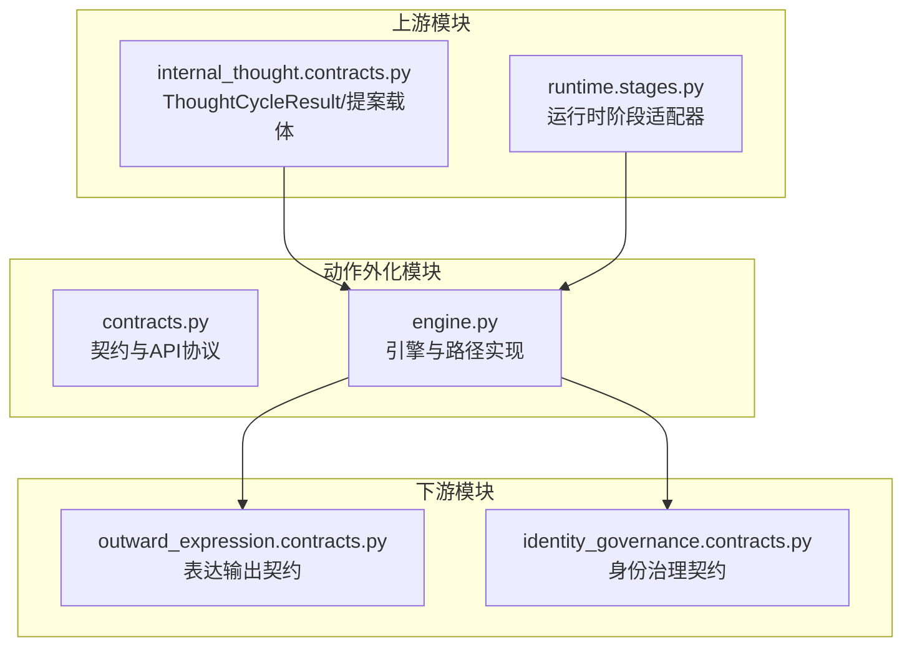
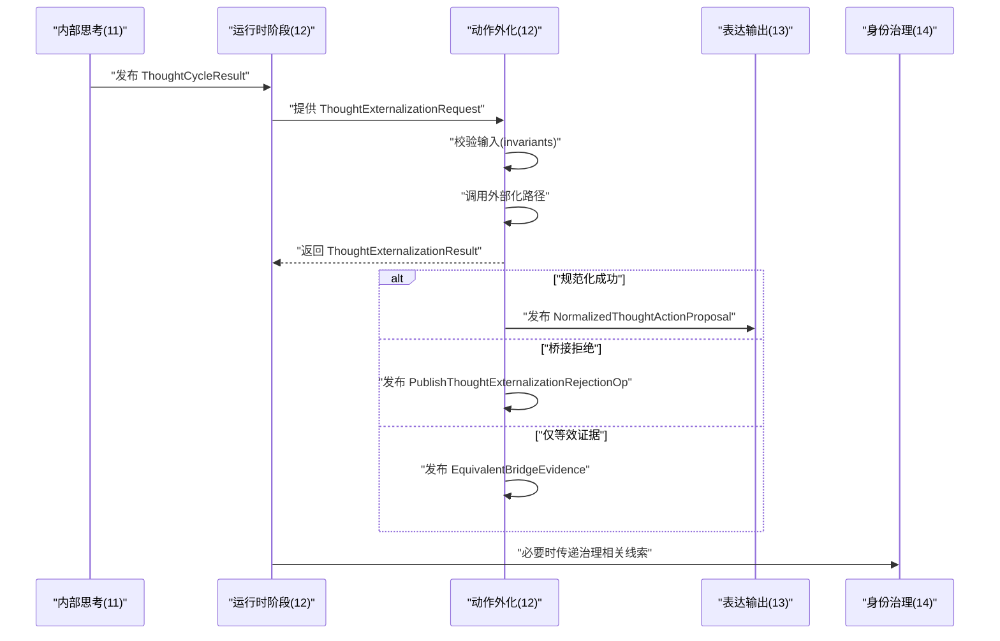
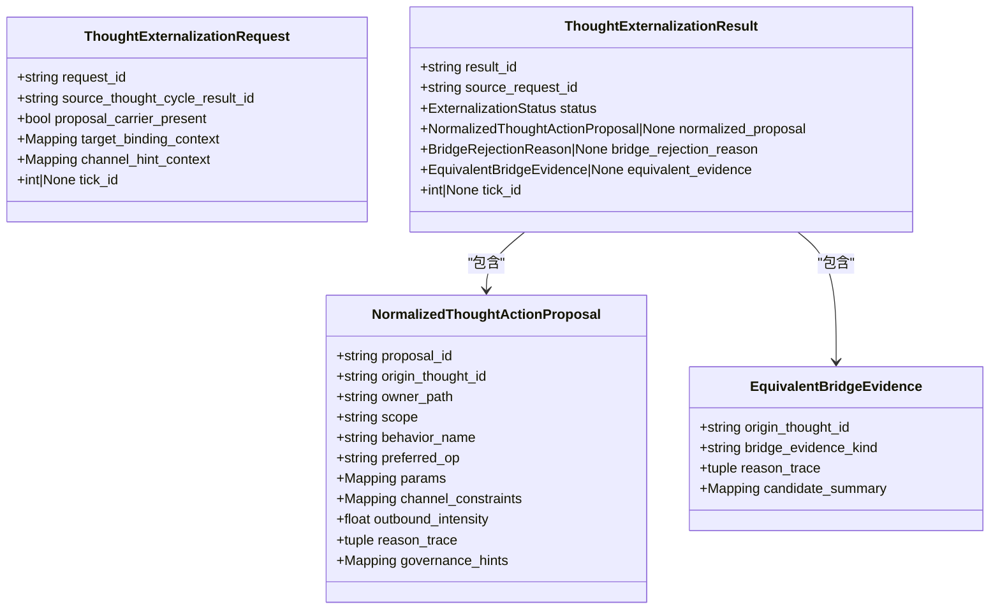
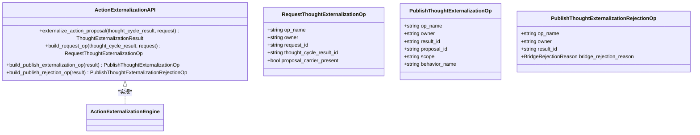
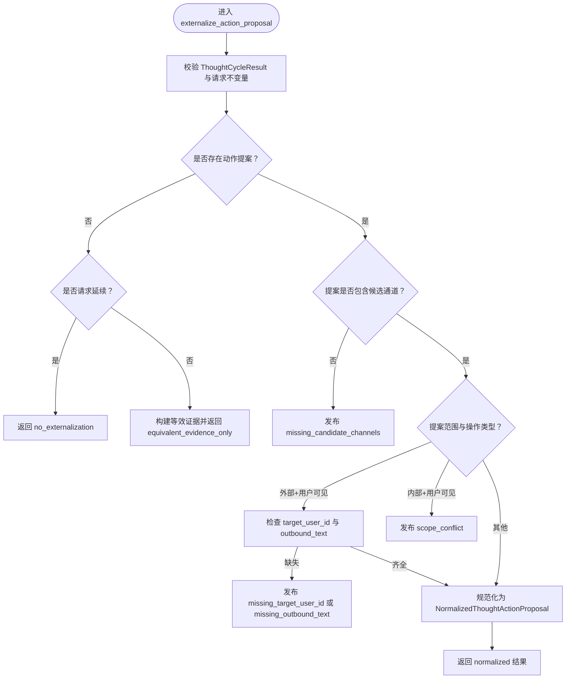
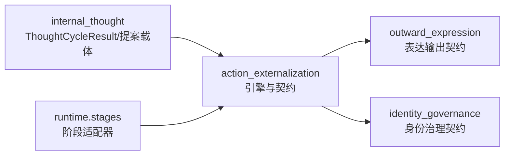

# 动作外化模块接口

<cite>
**本文档引用的文件**
- [contracts.py](file://helios_v2/src/helios_v2/action_externalization/contracts.py)
- [engine.py](file://helios_v2/src/helios_v2/action_externalization/engine.py)
- [design.md](file://helios_v2/docs/requirements/12-action-proposal-externalization-contract/design.md)
- [task.md](file://helios_v2/docs/requirements/12-action-proposal-externalization-contract/task.md)
- [test_action_externalization_contracts.py](file://helios_v2/tests/test_action_externalization_contracts.py)
- [test_action_externalization_engine.py](file://helios_v2/tests/test_action_externalization_engine.py)
- [contracts.py（内部思考）](file://helios_v2/src/helios_v2/internal_thought/contracts.py)
- [contracts.py（身份治理）](file://helios_v2/src/helios_v2/identity_governance/contracts.py)
- [stages.py（运行时阶段）](file://helios_v2/src/helios_v2/runtime/stages.py)
</cite>

## 目录
1. [简介](#简介)
2. [项目结构](#项目结构)
3. [核心组件](#核心组件)
4. [架构总览](#架构总览)
5. [详细组件分析](#详细组件分析)
6. [依赖关系分析](#依赖关系分析)
7. [性能考量](#性能考量)
8. [故障排查指南](#故障排查指南)
9. [结论](#结论)
10. [附录](#附录)

## 简介
本文件为“动作外化模块”提供完整的接口API文档，覆盖动作提案生成、决策制定与执行准备的接口定义，解释动作空间搜索、优先级排序与约束满足的协议，并给出动作生成示例与执行流程。同时，文档化动作外化与表达输出、身份治理的接口协作与反馈机制。

动作外化模块的目标是：
- 将内部思考循环产生的可选动作提案载体规范化为正式的外部化契约；
- 在规范化失败时明确发布桥接拒绝或等效证据；
- 保持与规划器接受与执行器分发的边界分离；
- 保证对外可见行为必须携带最终出站文本在规范化契约中。

## 项目结构
动作外化模块位于 helios_v2 的 action_externalization 子系统，包含契约定义与引擎实现，并通过运行时阶段与内部思考、表达输出、身份治理等模块协作。

图表来源
- [contracts.py:1-352](file://helios_v2/src/helios_v2/action_externalization/contracts.py#L1-L352)
- [engine.py:1-243](file://helios_v2/src/helios_v2/action_externalization/engine.py#L1-L243)
- [contracts.py（内部思考）:263-346](file://helios_v2/src/helios_v2/internal_thought/contracts.py#L263-L346)
- [stages.py（运行时阶段）:348-395](file://helios_v2/src/helios_v2/runtime/stages.py#L348-L395)

章节来源
- [design.md:24-90](file://helios_v2/docs/requirements/12-action-proposal-externalization-contract/design.md#L24-L90)
- [task.md:1-14](file://helios_v2/docs/requirements/12-action-proposal-externalization-contract/task.md#L1-L14)

## 核心组件
- 外部化请求与结果契约：用于桥接输入与输出的不可变契约，确保跨域稳定性与可观测性。
- 规范化动作提案：承载动作来源、行为名、首选操作、通道约束、出站强度与治理提示。
- 桥接拒绝原因：明确失败分类，便于诊断与测试。
- 等效证据：当无显式提案但存在外部化信号时，保留证据以支持保真度诊断。
- 公共API协议：暴露外部化、请求与发布操作构建能力。
- 引擎与路径：验证输入、调用私有路径并产出标准化结果。

章节来源
- [contracts.py:33-351](file://helios_v2/src/helios_v2/action_externalization/contracts.py#L33-L351)
- [engine.py:168-243](file://helios_v2/src/helios_v2/action_externalization/engine.py#L168-L243)

## 架构总览
动作外化模块作为第12层(owner)，在第11层内部思考循环与后续规划-执行桥之间建立稳定契约边界。其生命周期包括：
- 第11层发布 ThoughtCycleResult；
- 运行时提供 ThoughtExternalizationRequest；
- 外化模块校验不变量；
- 构建 RequestThoughtExternalizationOp；
- 私有路径计算 ThoughtExternalizationResult；
- 成功则发布 NormalizedThoughtActionProposal，失败则发布桥接拒绝或等效证据。

图表来源
- [design.md:69-89](file://helios_v2/docs/requirements/12-action-proposal-externalization-contract/design.md#L69-L89)
- [engine.py:175-195](file://helios_v2/src/helios_v2/action_externalization/engine.py#L175-L195)

## 详细组件分析

### 1) 外部化请求与结果契约
- ThoughtExternalizationRequest：显式桥接输入契约，包含请求ID、来源思考结果ID、是否携带提案、目标绑定上下文、通道提示上下文与tick ID。
- ThoughtExternalizationResult：不可变桥接结果，包含结果ID、来源请求ID、状态、规范化提案、桥接拒绝原因、等效证据与tick ID。
- 状态与拒绝原因枚举：规范化(normalized)、桥接拒绝(bridge_rejected)、仅等效证据(equivalent_evidence_only)、无外部化(no_externalization)；拒绝原因(schema_invalid、missing_candidate_channels、missing_target_user_id、missing_outbound_text、scope_conflict)。

图表来源
- [contracts.py:103-288](file://helios_v2/src/helios_v2/action_externalization/contracts.py#L103-L288)

章节来源
- [contracts.py:33-351](file://helios_v2/src/helios_v2/action_externalization/contracts.py#L33-L351)

### 2) 公共API协议与操作契约
- ActionExternalizationAPI：公开方法包括 externalize_action_proposal、build_request_op、build_publish_externalization_op、build_publish_rejection_op。
- 请求与发布操作：RequestThoughtExternalizationOp、PublishThoughtExternalizationOp、PublishThoughtExternalizationRejectionOp。

图表来源
- [contracts.py:323-351](file://helios_v2/src/helios_v2/action_externalization/contracts.py#L323-L351)
- [engine.py:168-243](file://helios_v2/src/helios_v2/action_externalization/engine.py#L168-L243)

章节来源
- [contracts.py:323-351](file://helios_v2/src/helios_v2/action_externalization/contracts.py#L323-L351)
- [engine.py:197-243](file://helios_v2/src/helios_v2/action_externalization/engine.py#L197-L243)

### 3) 引擎与外部化路径
- ActionExternalizationEngine：实现公共API，负责输入校验、调用私有路径、构建发布操作。
- ThoughtExternalizationPath：私有路径协议，FirstVersionThoughtExternalizationPath为首次版本确定性路径。
- 核心规则：
  - 若无提案且不请求延续，则返回 no_externalization；
  - 若无提案但有完成思考，则返回 equivalent_evidence_only；
  - 若提案缺少候选通道，发布 missing_candidate_channels；
  - 外部范围且用户可见操作需具备 target_user_id 与 outbound_text；
  - 内部范围却使用用户可见操作，发布 scope_conflict；
  - 否则规范化为 NormalizedThoughtActionProposal。

图表来源
- [engine.py:66-165](file://helios_v2/src/helios_v2/action_externalization/engine.py#L66-L165)

章节来源
- [engine.py:27-165](file://helios_v2/src/helios_v2/action_externalization/engine.py#L27-L165)

### 4) 与表达输出的协作与反馈
- 当规范化成功时，动作外化模块发布 NormalizedThoughtActionProposal，表达输出模块可据此生成外向表达草稿；
- 运行时阶段提供 outward_expression_externalization 的适配器结果，驱动从草稿到真实传输的连接；
- 若无规范化提案，动作外化模块仍可发布等效证据，供表达输出进行保真度诊断。

章节来源
- [design.md:69-89](file://helios_v2/docs/requirements/12-action-proposal-externalization-contract/design.md#L69-L89)
- [stages.py（运行时阶段）:348-395](file://helios_v2/src/helios_v2/runtime/stages.py#L348-L395)

### 5) 与身份治理的接口协作
- 身份治理模块消费来自思考循环的结果，评估自修订提案；
- 动作外化模块在规范化过程中可利用治理提示(governance_hints)影响参数与约束；
- 若需要，运行时阶段可将治理相关线索传递至身份治理模块，形成闭环反馈。

章节来源
- [contracts.py（身份治理）:110-159](file://helios_v2/src/helios_v2/identity_governance/contracts.py#L110-L159)
- [engine.py:119-134](file://helios_v2/src/helios_v2/action_externalization/engine.py#L119-L134)

## 依赖关系分析
- 上游依赖：internal_thought 的 ThoughtCycleResult 与 ThoughtActionProposalCarrier；
- 下游依赖：outward_expression 的表达输出契约与运行时阶段适配器；
- 内部依赖：私有 ThoughtExternalizationPath 接口与 FirstVersionThoughtExternalizationPath 实现；
- 边界约束：不拥有思想生成、规划接受、执行分发与通道传输。

图表来源
- [contracts.py（内部思考）:263-346](file://helios_v2/src/helios_v2/internal_thought/contracts.py#L263-L346)
- [engine.py:168-243](file://helios_v2/src/helios_v2/action_externalization/engine.py#L168-L243)
- [stages.py（运行时阶段）:348-395](file://helios_v2/src/helios_v2/runtime/stages.py#L348-L395)

章节来源
- [design.md:43-48](file://helios_v2/docs/requirements/12-action-proposal-externalization-contract/design.md#L43-L48)

## 性能考量
- 输入校验与不变量检查在引擎入口处集中执行，避免无效路径开销；
- 规范化路径为确定性逻辑，复杂度主要取决于提案载体字段数量；
- 发布操作仅封装元数据，避免深拷贝与昂贵计算；
- 建议在运行时阶段对桥接结果进行轻量化缓存，减少重复序列化成本。

## 故障排查指南
常见错误与定位要点：
- ActionExternalizationError：当输入违反契约或状态不一致时抛出，需检查 ThoughtCycleResult 执行状态、请求来源ID一致性与提案载体完整性。
- 缺失出站文本：外部范围的用户可见操作必须包含 outbound_text，否则发布 missing_outbound_text。
- 缺失目标用户ID：外部范围且用户可见操作需具备 target_user_id。
- 缺失候选通道：提案必须包含候选通道，否则发布 missing_candidate_channels。
- 作用域冲突：内部范围不应使用用户可见操作，否则发布 scope_conflict。
- 无桥接能力：若未设置外部化路径，将抛出错误指示需要显式桥接能力。

章节来源
- [engine.py:27-52](file://helios_v2/src/helios_v2/action_externalization/engine.py#L27-L52)
- [engine.py:152-165](file://helios_v2/src/helios_v2/action_externalization/engine.py#L152-L165)
- [test_action_externalization_engine.py:178-218](file://helios_v2/tests/test_action_externalization_engine.py#L178-L218)
- [test_action_externalization_engine.py:251-259](file://helios_v2/tests/test_action_externalization_engine.py#L251-L259)

## 结论
动作外化模块通过契约化设计与确定性路径，将内部思考的可选提案转化为稳定、可观测的外部化契约，明确桥接拒绝与等效证据的发布策略，确保与表达输出、身份治理的边界清晰、职责分离。该模块为后续规划-执行桥提供了可靠的输入基础，并支持保真度诊断与调试。

## 附录

### A. 接口定义速查
- ActionExternalizationAPI.externalize_action_proposal
  - 输入：ThoughtCycleResult、ThoughtExternalizationRequest
  - 输出：ThoughtExternalizationResult
- ActionExternalizationAPI.build_request_op
  - 输入：ThoughtCycleResult、ThoughtExternalizationRequest
  - 输出：RequestThoughtExternalizationOp
- ActionExternalizationAPI.build_publish_externalization_op
  - 输入：ThoughtExternalizationResult（状态=normalized）
  - 输出：PublishThoughtExternalizationOp
- ActionExternalizationAPI.build_publish_rejection_op
  - 输入：ThoughtExternalizationResult（状态=bridge_rejected）
  - 输出：PublishThoughtExternalizationRejectionOp

章节来源
- [contracts.py:327-351](file://helios_v2/src/helios_v2/action_externalization/contracts.py#L327-L351)

### B. 动作空间搜索、优先级排序与约束满足协议
- 搜索与排序：提案载体中的 preferred_channels 与 channel_hints 提供通道偏好与提示，外部化路径据此构建 channel_constraints；
- 约束满足：强制要求外部范围的用户可见操作具备 target_user_id 与 outbound_text；内部范围禁止使用用户可见操作；若无候选通道则拒绝；
- 规范化：将提案映射为 NormalizedThoughtActionProposal，保留 owner_path、行为名、首选操作、参数与治理提示。

章节来源
- [engine.py:109-143](file://helios_v2/src/helios_v2/action_externalization/engine.py#L109-L143)
- [contracts.py（内部思考）:160-202](file://helios_v2/src/helios_v2/internal_thought/contracts.py#L160-L202)

### C. 动作生成示例与执行流程
- 示例场景：内部思考产生外部范围的动作提案，包含首选操作、候选通道与出站文本；
- 流程：
  1) 内部思考发布 ThoughtCycleResult；
  2) 运行时提供 ThoughtExternalizationRequest；
  3) 动作外化引擎校验并调用路径；
  4) 规范化成功后发布 NormalizedThoughtActionProposal；
  5) 表达输出基于提案生成外向表达草稿并发布。

章节来源
- [test_action_externalization_engine.py:159-176](file://helios_v2/tests/test_action_externalization_engine.py#L159-L176)
- [design.md:69-89](file://helios_v2/docs/requirements/12-action-proposal-externalization-contract/design.md#L69-L89)