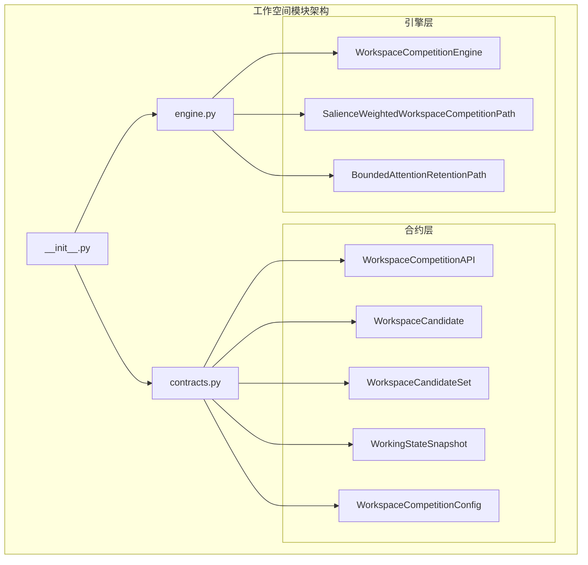
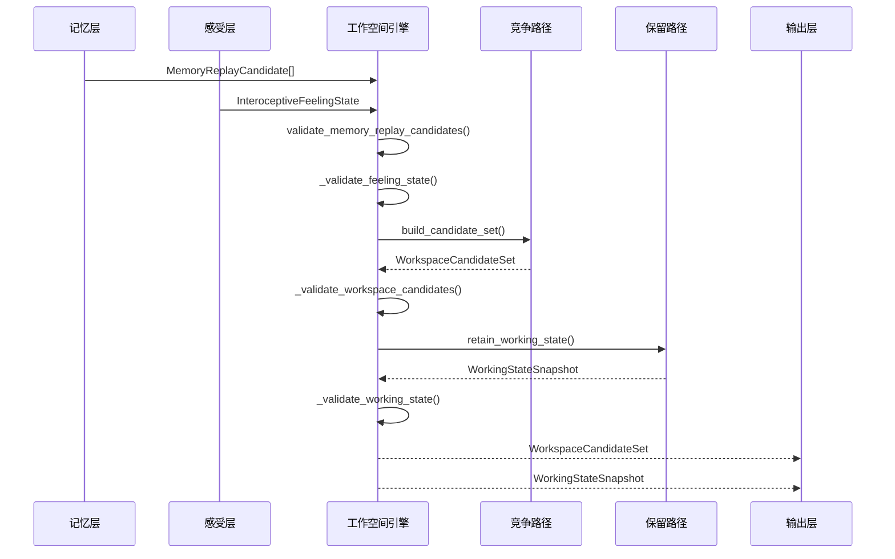
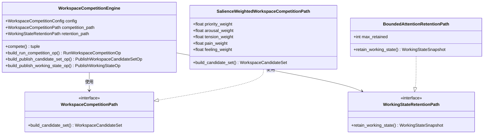
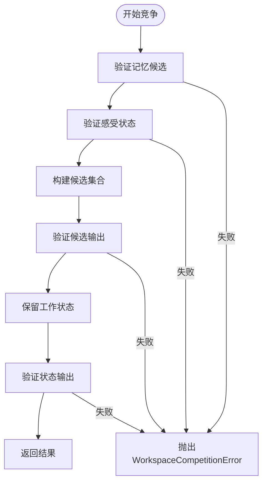
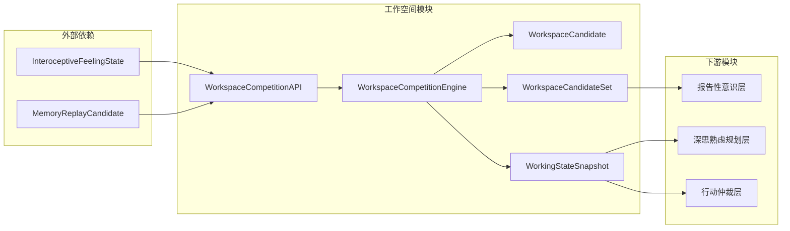

# 工作空间模块接口

<cite>
**本文档引用的文件**
- [workspace/__init__.py](file://helios_v2/src/helios_v2/workspace/__init__.py)
- [workspace/contracts.py](file://helios_v2/src/helios_v2/workspace/contracts.py)
- [workspace/engine.py](file://helios_v2/src/helios_v2/workspace/engine.py)
- [workspace设计文档](file://helios_v2/docs/requirements/07-workspace-competition-and-working-state/design.md)
</cite>

## 目录
1. [简介](#简介)
2. [项目结构](#项目结构)
3. [核心组件](#核心组件)
4. [架构概览](#架构概览)
5. [详细组件分析](#详细组件分析)
6. [依赖关系分析](#依赖关系分析)
7. [性能考虑](#性能考虑)
8. [故障排除指南](#故障排除指南)
9. [结论](#结论)

## 简介

工作空间模块是Helios认知系统中的关键层，负责处理工作空间竞争、思维进程管理和注意力控制。该模块位于记忆影响和回忆层之后，以及后续的报告性意识、深思熟虑规划或行动仲裁之前。

工作空间模块的核心职责包括：
- 将记忆重放缓冲区候选转换为短时的竞争性工作空间状态
- 管理工作状态快照的发布和传播
- 实现注意力瓶颈机制，选择最相关的思维进程
- 维护强制巩固候选的完整性
- 提供类型安全的接口契约和错误处理机制

## 项目结构

工作空间模块采用清晰的分层架构，包含合约定义、引擎实现和公共接口导出：

**图表来源**
- [workspace/__init__.py:1-52](file://helios_v2/src/helios_v2/workspace/__init__.py#L1-L52)
- [workspace/contracts.py:1-344](file://helios_v2/src/helios_v2/workspace/contracts.py#L1-L344)
- [workspace/engine.py:1-449](file://helios_v2/src/helios_v2/workspace/engine.py#L1-L449)

**章节来源**
- [workspace/__init__.py:1-52](file://helios_v2/src/helios_v2/workspace/__init__.py#L1-L52)

## 核心组件

### 数据结构定义

工作空间模块定义了以下核心数据结构：

#### WorkspaceCandidate（工作空间候选）
- `candidate_id`: 候选标识符
- `source_memory_candidate_id`: 源记忆候选标识符
- `source_feeling_state_id`: 源感受状态标识符
- `priority_hint`: 优先级提示（0-1范围）
- `forced_consolidation`: 是否强制巩固
- `workspace_score_hint`: 工作空间分数提示（0-1范围）

#### WorkspaceCandidateSet（工作空间候选集合）
- `set_id`: 集合标识符
- `source_feeling_state_id`: 源感受状态标识符
- `candidates`: 候选列表
- `tick_id`: 运行时刻标识符

#### WorkingStateSnapshot（工作状态快照）
- `state_id`: 状态标识符
- `source_candidate_set_id`: 源候选集合标识符
- `retained_candidate_ids`: 保留的候选标识符列表
- `tick_id`: 运行时刻标识符

#### WorkspaceCompetitionConfig（工作空间竞争配置）
- `legal_min_score`: 合法最小分数
- `legal_max_score`: 合法最大分数
- `working_state_bootstrap_id`: 工作状态引导标识符
- `mandatory_learned_parameters`: 强制学习参数类别元组

**章节来源**
- [workspace/contracts.py:71-163](file://helios_v2/src/helios_v2/workspace/contracts.py#L71-L163)
- [workspace/contracts.py:35-69](file://helios_v2/src/helios_v2/workspace/contracts.py#L35-L69)

### 接口定义

#### WorkspaceCompetitionAPI（工作空间竞争API）
这是工作空间模块的公共接口协议，定义了以下核心方法：

1. **compete方法**
   - 输入：记忆重放缓冲区候选元组、感受状态、可选运行时刻ID
   - 输出：工作空间候选集合和工作状态快照
   - 错误：WorkspaceCompetitionError

2. **build_run_competition_op方法**
   - 输入：记忆重放缓冲区候选元组、感受状态
   - 输出：运行工作空间竞争操作
   - 用途：构建运行时可见的请求操作

3. **build_publish_candidate_set_op方法**
   - 输入：工作空间候选集合
   - 输出：发布候选集合操作
   - 用途：构建候选集合发布的运行时操作

4. **build_publish_working_state_op方法**
   - 输入：工作状态快照
   - 输出：发布工作状态操作
   - 用途：构建工作状态发布的运行时操作

**章节来源**
- [workspace/contracts.py:240-344](file://helios_v2/src/helios_v2/workspace/contracts.py#L240-L344)

## 架构概览

工作空间模块采用合约驱动的设计模式，确保接口的稳定性和可扩展性：

**图表来源**
- [workspace/engine.py:186-221](file://helios_v2/src/helios_v2/workspace/engine.py#L186-L221)
- [workspace/contracts.py:247-271](file://helios_v2/src/helios_v2/workspace/contracts.py#L247-L271)

### 竞争路径实现

工作空间模块提供了两种主要的竞争路径实现：

#### SalienceWeightedWorkspaceCompetitionPath（显著性加权竞争路径）
基于记忆候选的优先级提示和感受状态的显著性计算工作空间分数：
- 优先级权重：0.6
- 感受权重：0.4
- 显著性计算：arousal_weight × 唤醒 + tension_weight × 紧张 + pain_weight × 疼痛样

#### BoundedAttentionRetentionPath（有界注意力保留路径）
实现注意力瓶颈机制，选择最高分的候选子集：
- 最大保留数：3个候选
- 选择规则：按workspace_score_hint降序排列
- 平局规则：按候选标识符排序

**章节来源**
- [workspace/engine.py:327-394](file://helios_v2/src/helios_v2/workspace/engine.py#L327-L394)
- [workspace/engine.py:396-449](file://helios_v2/src/helios_v2/workspace/engine.py#L396-L449)

## 详细组件分析

### WorkspaceCompetitionEngine（工作空间竞争引擎）

工作空间竞争引擎是模块的核心执行组件，实现了WorkspaceCompetitionAPI协议：

**图表来源**
- [workspace/engine.py:171-319](file://helios_v2/src/helios_v2/workspace/engine.py#L171-L319)
- [workspace/engine.py:104-169](file://helios_v2/src/helios_v2/workspace/engine.py#L104-L169)

#### 执行流程验证

引擎在执行过程中进行严格的输入验证和输出验证：

**图表来源**
- [workspace/engine.py:210-221](file://helios_v2/src/helios_v2/workspace/engine.py#L210-L221)

**章节来源**
- [workspace/engine.py:171-319](file://helios_v2/src/helios_v2/workspace/engine.py#L171-L319)

### 错误处理机制

工作空间模块实现了完善的错误处理机制：

#### WorkspaceCompetitionError（工作空间竞争错误）
- 用于表示工作空间竞争所有者不变量违反的硬停止错误
- 在输入验证失败或竞争能力不可用时抛出

#### 验证函数
- `_validate_unit_interval`: 验证0-1范围内的值
- `_validate_feeling_state`: 验证感受状态的完整性
- `_validate_workspace_candidates`: 验证候选集合的来源一致性
- `_validate_working_state`: 验证工作状态的引用完整性

**章节来源**
- [workspace/contracts.py:218-221](file://helios_v2/src/helios_v2/workspace/contracts.py#L218-L221)
- [workspace/engine.py:36-102](file://helios_v2/src/helios_v2/workspace/engine.py#L36-L102)

## 依赖关系分析

工作空间模块与其他Helios组件的依赖关系：

**图表来源**
- [workspace/contracts.py:19-20](file://helios_v2/src/helios_v2/workspace/contracts.py#L19-L20)
- [workspace/engine.py:19-20](file://helios_v2/src/helios_v2/workspace/engine.py#L19-L20)

### 跨模块协调

工作空间模块与系统其他部分的协调点：

1. **记忆层集成**：消费MemoryReplayCandidate作为主要输入源
2. **感受层集成**：使用InteroceptiveFeelingState提供情感上下文
3. **报告层协调**：向后续的报告性意识层提供候选集合
4. **规划层协调**：为深思熟虑规划层提供工作状态快照
5. **行动层协调**：为行动仲裁层提供注意力焦点

**章节来源**
- [workspace设计文档:145-152](file://helios_v2/docs/requirements/07-workspace-competition-and-working-state/design.md#L145-L152)

## 性能考虑

### 时间复杂度分析

1. **竞争路径时间复杂度**：O(n log n)，其中n是记忆候选数量
   - 主要由排序操作决定
   - 显著性计算为O(n)

2. **保留路径时间复杂度**：O(n log n)
   - 排序后选择前k个元素
   - k为max_retained（默认3）

3. **验证操作时间复杂度**：O(n)
   - 遍历候选列表进行完整性检查

### 空间复杂度分析

1. **内存使用**：O(n)
   - 存储所有候选对象
   - 工作状态快照存储保留的候选标识符

2. **对象生命周期**：所有数据结构都是不可变的
   - 使用dataclass(frozen=True)
   - 支持安全的并发访问

### 优化策略

1. **批量处理**：支持一次性处理多个记忆候选
2. **延迟计算**：只在需要时计算工作空间分数
3. **缓存机制**：可扩展的缓存策略以避免重复计算
4. **内存池**：对于大量候选的场景，考虑使用内存池减少GC压力

## 故障排除指南

### 常见错误类型

1. **输入验证错误**
   - 缺少记忆候选来源证明
   - 缺少感受状态证明
   - 分数超出允许范围[0,1]

2. **竞争能力错误**
   - 缺少必需的竞争能力
   - 竞争路径实现不完整
   - 学习参数配置错误

3. **输出验证错误**
   - 发布的工作状态包含无效的候选标识符
   - 强制巩固候选未包含在候选集合中

### 调试建议

1. **启用详细日志**：利用运行时操作摘要进行调试
2. **单元测试**：使用提供的测试套件验证功能正确性
3. **边界条件测试**：测试空候选列表、单个候选、大量候选等场景
4. **性能监控**：监控竞争路径的执行时间和内存使用

**章节来源**
- [workspace/contracts.py:218-236](file://helios_v2/src/helios_v2/workspace/contracts.py#L218-L236)
- [workspace/engine.py:36-102](file://helios_v2/src/helios_v2/workspace/engine.py#L36-L102)

## 结论

工作空间模块为Helios认知系统提供了稳定、类型安全的工作空间竞争和注意力控制框架。通过合约驱动的设计，模块确保了：

1. **接口稳定性**：明确的API契约保证了系统的可预测性
2. **类型安全性**：全面的数据验证确保了运行时的可靠性
3. **可扩展性**：插拔式的设计允许未来添加新的竞争和保留策略
4. **性能效率**：优化的时间和空间复杂度满足实时处理需求

该模块成功地将记忆重放缓冲区候选转换为短时的竞争性工作空间状态，为后续的认知处理奠定了坚实的基础。其设计遵循了Helios项目的整体架构原则，既保持了模块间的清晰边界，又确保了系统功能的完整性。