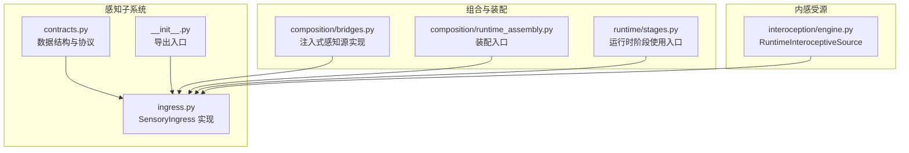
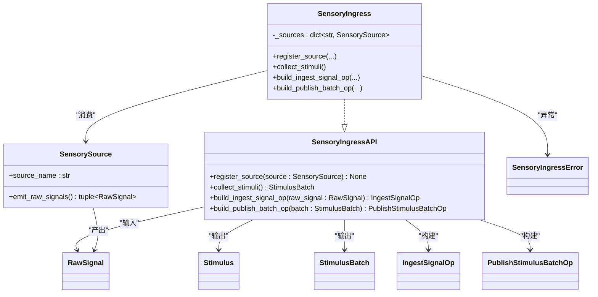
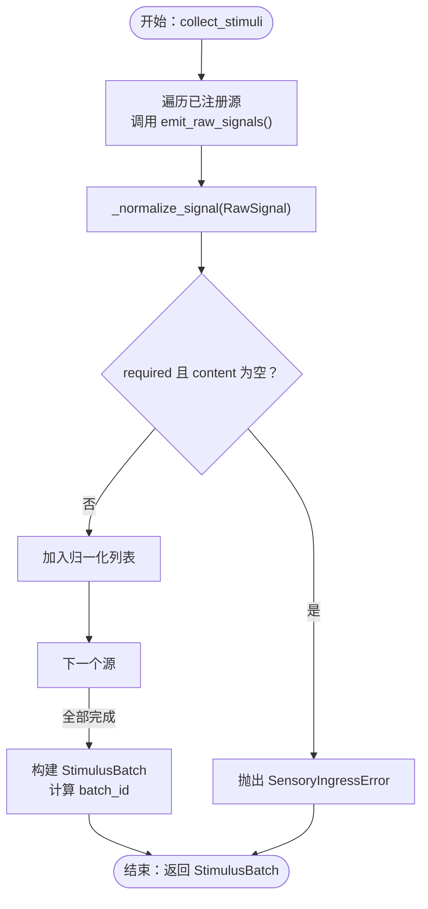
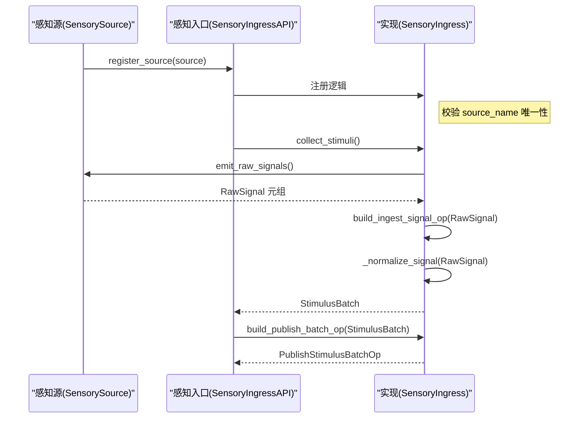
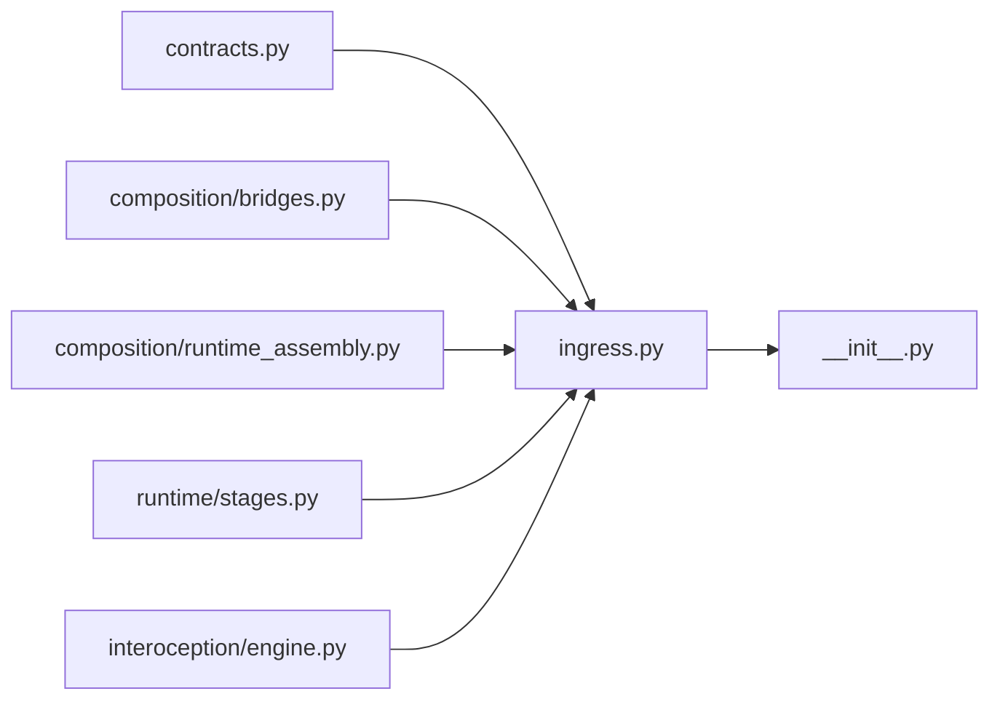

# 感知模块接口

<cite>
**本文引用的文件**
- [contracts.py](file://helios_v2/src/helios_v2/sensory/contracts.py)
- [ingress.py](file://helios_v2/src/helios_v2/sensory/ingress.py)
- [__init__.py](file://helios_v2/src/helios_v2/sensory/__init__.py)
- [bridges.py](file://helios_v2/src/helios_v2/composition/bridges.py)
- [engine.py](file://helios_v2/src/helios_v2/interoception/engine.py)
- [runtime_assembly.py](file://helios_v2/src/helios_v2/composition/runtime_assembly.py)
- [stages.py](file://helios_v2/src/helios_v2/runtime/stages.py)
</cite>

## 目录
1. [简介](#简介)
2. [项目结构](#项目结构)
3. [核心组件](#核心组件)
4. [架构总览](#架构总览)
5. [详细组件分析](#详细组件分析)
6. [依赖分析](#依赖分析)
7. [性能考虑](#性能考虑)
8. [故障排查指南](#故障排查指南)
9. [结论](#结论)
10. [附录：使用示例与最佳实践](#附录使用示例与最佳实践)

## 简介
本文件面向“感知模块”的接口API文档，聚焦以下目标：
- 定义并解释 RawSignal、Stimulus、StimulusBatch 等数据结构的用途与约束
- 解释感知源注册、信号收集与刺激发布的核心接口
- 文档化 SensorySource 协议与 SensoryIngressAPI 协议的方法签名、参数与返回值
- 提供实现感知源与使用感知接口的具体示例路径
- 覆盖错误处理机制、并发安全与性能考量

## 项目结构
感知模块位于 helios_v2 的 sensory 子系统中，核心由三部分组成：
- 合同层（contracts）：定义数据结构与协议
- 入口实现（ingress）：实现 SensoryIngressAPI，负责注册、收集、归一化与发布
- 组合桥接（composition/bridges）：提供注入式感知源实现与装配集成点

图表来源
- [contracts.py:1-279](file://helios_v2/src/helios_v2/sensory/contracts.py#L1-L279)
- [ingress.py:1-207](file://helios_v2/src/helios_v2/sensory/ingress.py#L1-L207)
- [__init__.py:1-36](file://helios_v2/src/helios_v2/sensory/__init__.py#L1-L36)
- [bridges.py:104-224](file://helios_v2/src/helios_v2/composition/bridges.py#L104-L224)
- [runtime_assembly.py:1161-1197](file://helios_v2/src/helios_v2/composition/runtime_assembly.py#L1161-L1197)
- [stages.py:135-878](file://helios_v2/src/helios_v2/runtime/stages.py#L135-L878)
- [engine.py:97-163](file://helios_v2/src/helios_v2/interoception/engine.py#L97-L163)

章节来源
- [contracts.py:1-279](file://helios_v2/src/helios_v2/sensory/contracts.py#L1-L279)
- [ingress.py:1-207](file://helios_v2/src/helios_v2/sensory/ingress.py#L1-L207)
- [__init__.py:1-36](file://helios_v2/src/helios_v2/sensory/__init__.py#L1-L36)

## 核心组件
本节对感知模块的关键数据结构与协议进行深入说明。

- RawSignal（原始信号）
  - 用途：表示一个尚未归一化的“原始信号”，由“感知源”产生，交由“感知入口”完成验证与归一化
  - 关键字段与语义：
    - signal_id：信号唯一标识
    - source_name：稳定唯一的“感知源”名称
    - signal_type：信号类型（如 text、interoceptive），用于后续归一化
    - content：信号内容字符串
    - channel：可选通道名
    - metadata：冻结映射，用于携带额外元数据
    - required：是否为必需信号；必需信号的内容不能为空
  - 失败语义：必需字段缺失或内容为空将导致归一化失败并抛出硬停错误

- Stimulus（归一化刺激）
  - 用途：由 RawSignal 归一化后得到的标准化记录，供下游阶段使用
  - 关键字段与语义：
    - stimulus_id：标准化后的唯一标识
    - source_name：来源感知源名称
    - modality：模态（由 signal_type 归一化而来）
    - content：标准化内容
    - channel：可选通道
    - metadata：冻结映射
    - provenance_signal_id：记录原始信号的 signal_id，保留溯源
  - 失败语义：仅能由有效 RawSignal 构建，且必须保留溯源

- StimulusBatch（刺激批次）
  - 用途：在一次运行周期内发布的“不可变”刺激批次
  - 关键字段与语义：
    - batch_id：基于批次内容计算的稳定哈希标识
    - stimuli：Stimulus 序列
  - 失败语义：不得隐藏无效的必需信号

- SensorySource 协议
  - 作用：定义“感知源”对外提供的契约，用于向“感知入口”提供原始信号
  - 方法：
    - source_name 属性：返回稳定唯一的源名
    - emit_raw_signals()：返回当前批次的 RawSignal 元组
  - 注册约束：重复的 source_name 将在注册时被拒绝

- SensoryIngressAPI 协议
  - 作用：定义“感知入口”的公共接口
  - 方法：
    - register_source(source: SensorySource)：注册一个感知源
    - collect_stimuli()：从所有已注册源收集并归一化为 StimulusBatch
    - build_ingest_signal_op(raw_signal: RawSignal)：构建“原始信号摄入”操作记录
    - build_publish_batch_op(batch: StimulusBatch)：构建“批次发布”操作记录

- SensoryIngressError
  - 用途：当必需信号校验失败或归一化失败时抛出的硬停错误

章节来源
- [contracts.py:26-137](file://helios_v2/src/helios_v2/sensory/contracts.py#L26-L137)
- [ingress.py:55-74](file://helios_v2/src/helios_v2/sensory/ingress.py#L55-L74)
- [ingress.py:191-279](file://helios_v2/src/helios_v2/sensory/ingress.py#L191-L279)

## 架构总览
感知模块采用“协议 + 实现”的分层设计：
- 合同层（contracts）：定义数据结构与协议，确保跨模块契约稳定
- 实现层（ingress）：提供 SensoryIngress，负责注册、验证、归一化与发布
- 组合层（bridges/runtime_assembly）：提供注入式感知源实现，并在运行时装配到入口
- 内感受源（interoception）：提供真实内感受信号的感知源实现

图表来源
- [contracts.py:139-279](file://helios_v2/src/helios_v2/sensory/contracts.py#L139-L279)
- [ingress.py:77-207](file://helios_v2/src/helios_v2/sensory/ingress.py#L77-L207)

## 详细组件分析

### 数据结构与归一化流程
- 归一化规则：
  - 必需信号 content 非空校验失败将触发硬停错误
  - 所有元数据在构造后被冻结，保证不可变性
  - batch_id 基于内容规范化后的 JSON 排序哈希生成，确保幂等
- 流程图：

图表来源
- [ingress.py:114-144](file://helios_v2/src/helios_v2/sensory/ingress.py#L114-L144)
- [ingress.py:55-74](file://helios_v2/src/helios_v2/sensory/ingress.py#L55-L74)

章节来源
- [ingress.py:55-74](file://helios_v2/src/helios_v2/sensory/ingress.py#L55-L74)
- [ingress.py:114-144](file://helios_v2/src/helios_v2/sensory/ingress.py#L114-L144)

### 协议方法签名与行为契约
- SensorySource
  - source_name: 返回稳定唯一的源名；重复注册将被拒绝
  - emit_raw_signals(): 返回当前批次 RawSignal 元组；源本地错误可直接传播
- SensoryIngressAPI
  - register_source(): 注册成功不保证下游解读权；重复名将引发 ValueError
  - collect_stimuli(): 返回不可变批次；必需信号校验失败将引发 SensoryIngressError
  - build_ingest_signal_op(): 记录摄入请求的溯源与语义；缺少必要字段将引发 SensoryIngressError
  - build_publish_batch_op(): 生成发布记录用于审计与编排；缺少溯源字段将引发 SensoryIngressError

章节来源
- [contracts.py:139-279](file://helios_v2/src/helios_v2/sensory/contracts.py#L139-L279)

### 注册与收集序列
- 注册阶段：通过 SensoryIngress.register_source 完成
- 收集阶段：SensoryIngress.collect_stimuli 会依次调用各源的 emit_raw_signals 并执行归一化
- 发布阶段：通过 build_publish_batch_op 生成发布记录，供后续阶段使用

图表来源
- [ingress.py:90-144](file://helios_v2/src/helios_v2/sensory/ingress.py#L90-L144)
- [ingress.py:177-207](file://helios_v2/src/helios_v2/sensory/ingress.py#L177-L207)
- [contracts.py:191-279](file://helios_v2/src/helios_v2/sensory/contracts.py#L191-L279)

章节来源
- [ingress.py:90-144](file://helios_v2/src/helios_v2/sensory/ingress.py#L90-L144)
- [ingress.py:177-207](file://helios_v2/src/helios_v2/sensory/ingress.py#L177-L207)

### 注入式感知源实现
- FirstVersionSensorySource：测试/演示用的注入式源，按配置或默认产生有限数量的 RawSignal
- SequenceExternalSignalSource：外部真实信号序列回放源，逐 tick 提供 caller 提供的真实批次
- SubsystemBackedSensorySource：通道子系统驱动的适配器，从通道子系统抽取 drained 信号并注入入口
- RuntimeInteroceptiveSource：真实内感受信号源，从运行时条件采样并投影为 RawSignal

章节来源
- [bridges.py:104-224](file://helios_v2/src/helios_v2/composition/bridges.py#L104-L224)
- [engine.py:97-163](file://helios_v2/src/helios_v2/interoception/engine.py#L97-L163)

## 依赖分析
- 模块内依赖
  - contracts.py 定义了所有数据结构与协议
  - ingress.py 依赖 contracts 中的协议与数据结构，实现 SensoryIngress
  - __init__.py 导出 contracts 与 ingress 的公共接口
- 运行时依赖
  - runtime_assembly.py 在装配阶段注册注入式感知源
  - runtime/stages.py 在运行时阶段持有 SensoryIngressAPI 引用以收集与发布

图表来源
- [__init__.py:14-36](file://helios_v2/src/helios_v2/sensory/__init__.py#L14-L36)
- [ingress.py:20-29](file://helios_v2/src/helios_v2/sensory/ingress.py#L20-L29)
- [runtime_assembly.py:1161-1197](file://helios_v2/src/helios_v2/composition/runtime_assembly.py#L1161-L1197)
- [stages.py:135-878](file://helios_v2/src/helios_v2/runtime/stages.py#L135-L878)
- [engine.py:97-163](file://helios_v2/src/helios_v2/interoception/engine.py#L97-L163)

章节来源
- [__init__.py:14-36](file://helios_v2/src/helios_v2/sensory/__init__.py#L14-L36)
- [ingress.py:20-29](file://helios_v2/src/helios_v2/sensory/ingress.py#L20-L29)
- [runtime_assembly.py:1161-1197](file://helios_v2/src/helios_v2/composition/runtime_assembly.py#L1161-L1197)
- [stages.py:135-878](file://helios_v2/src/helios_v2/runtime/stages.py#L135-L878)
- [engine.py:97-163](file://helios_v2/src/helios_v2/interoception/engine.py#L97-L163)

## 性能考虑
- 不可变数据结构：RawSignal、Stimulus、StimulusBatch 采用冻结映射与不可变元组，降低拷贝与并发修改成本
- 归一化幂等：batch_id 基于内容排序哈希，避免重复计算与重复发布
- 可选信号短路：对于非必需且内容为空的信号，直接跳过，减少下游处理开销
- 元数据冻结：在构造阶段冻结 metadata，避免后续误改与重复序列化
- 建议
  - 控制单批次 Stimulus 数量，避免超大批次影响下游阶段吞吐
  - 对高频源采用批量化 emit_raw_signals，减少调用次数

## 故障排查指南
- 常见错误与定位
  - SensoryIngressError：当必需信号校验失败或归一化失败时抛出，检查 RawSignal 的必需字段与内容
  - ValueError（注册阶段）：当 source_name 重复时触发，确保每个源的名称唯一
  - 溯源完整性：发布前会校验 Stimulus 的 source_name 与 provenance_signal_id，缺失将导致硬停
- 排查步骤
  1. 确认 emit_raw_signals 是否返回了必需信号且 content 非空
  2. 检查 source_name 是否唯一
  3. 使用 build_ingest_signal_op 与 build_publish_batch_op 生成的操作记录进行审计
  4. 若为外部信号源，确认 SequenceExternalSignalSource 的批次序列是否正确推进

章节来源
- [ingress.py:114-144](file://helios_v2/src/helios_v2/sensory/ingress.py#L114-L144)
- [ingress.py:177-207](file://helios_v2/src/helios_v2/sensory/ingress.py#L177-L207)
- [contracts.py:135-137](file://helios_v2/src/helios_v2/sensory/contracts.py#L135-L137)

## 结论
感知模块通过清晰的数据契约与严格的归一化流程，为上层认知与情绪模块提供了稳定、可审计、可扩展的刺激输入。其协议化设计与注入式实现使得真实外部输入与内感受信号能够无缝接入统一的入口，同时通过不可变数据结构与幂等计算保障了性能与一致性。

## 附录：使用示例与最佳实践
- 实现自定义感知源
  - 参考路径：[实现注入式感知源:104-224](file://helios_v2/src/helios_v2/composition/bridges.py#L104-L224)
  - 关键点：提供稳定的 source_name，emit_raw_signals 返回 RawSignal 元组，遵循 required 语义
- 注册与使用入口
  - 参考路径：[注册注入式源:1161-1197](file://helios_v2/src/helios_v2/composition/runtime_assembly.py#L1161-L1197)
  - 参考路径：[运行时阶段使用入口:878-890](file://helios_v2/src/helios_v2/runtime/stages.py#L878-L890)
  - 关键点：先注册，再 collect_stimuli，最后 build_publish_batch_op
- 使用内感受信号源
  - 参考路径：[内感受源实现:97-163](file://helios_v2/src/helios_v2/interoception/engine.py#L97-L163)
  - 关键点：从运行时条件采样，投影为 RawSignal，交由入口归一化

章节来源
- [bridges.py:104-224](file://helios_v2/src/helios_v2/composition/bridges.py#L104-L224)
- [runtime_assembly.py:1161-1197](file://helios_v2/src/helios_v2/composition/runtime_assembly.py#L1161-L1197)
- [stages.py:878-890](file://helios_v2/src/helios_v2/runtime/stages.py#L878-L890)
- [engine.py:97-163](file://helios_v2/src/helios_v2/interoception/engine.py#L97-L163)