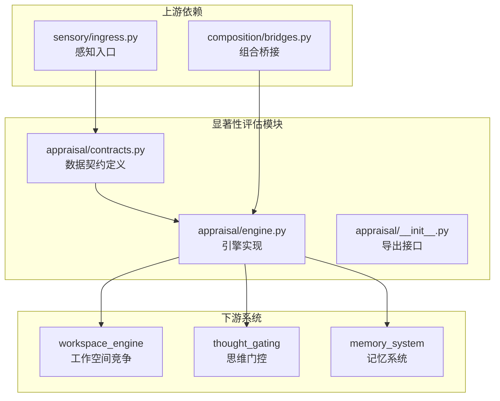
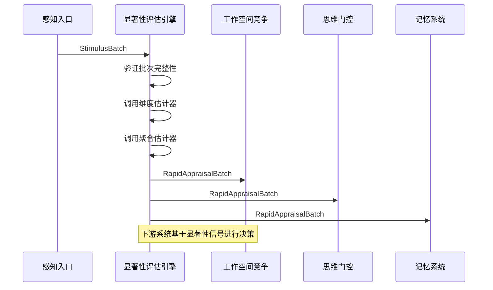
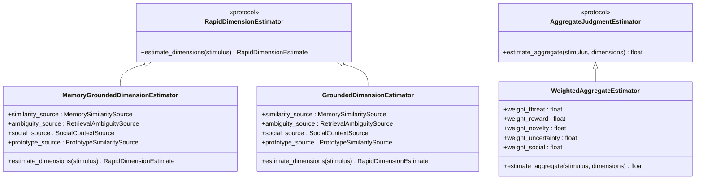
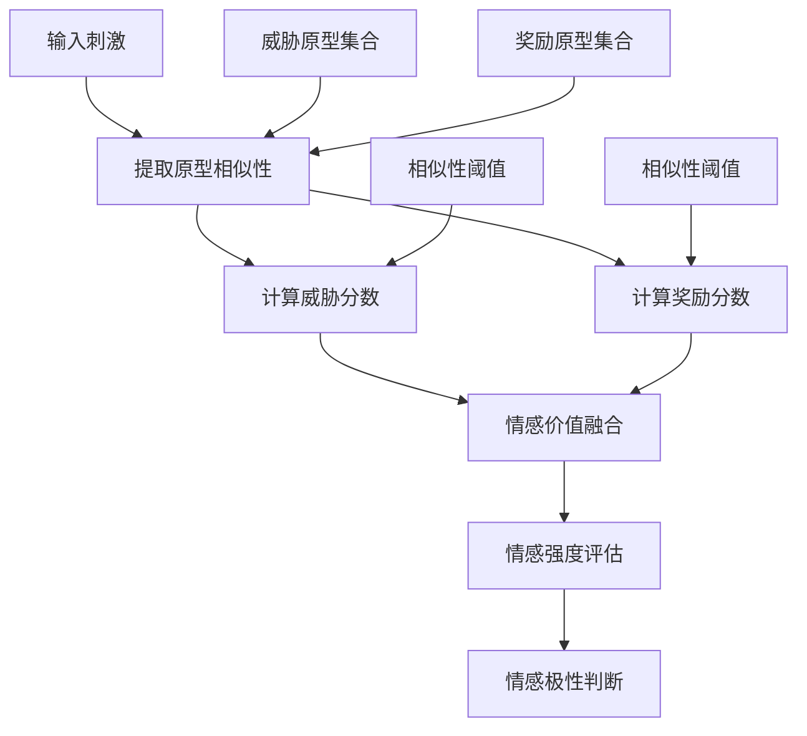
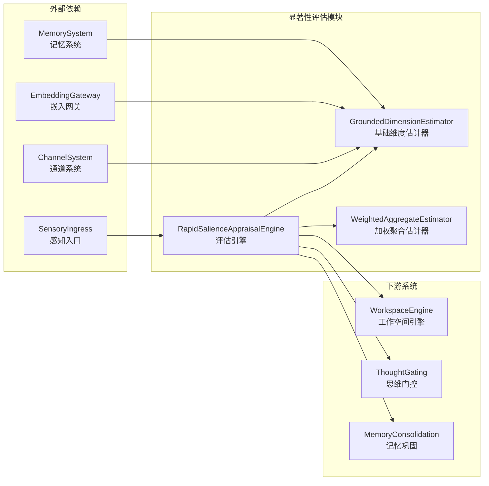

# 显著性评估模块接口

<cite>
**本文档引用的文件**
- [appraisal/contracts.py](file://helios_v2/src/helios_v2/appraisal/contracts.py)
- [appraisal/engine.py](file://helios_v2/src/helios_v2/appraisal/engine.py)
- [appraisal/__init__.py](file://helios_v2/src/helios_v2/appraisal/__init__.py)
- [sensory/ingress.py](file://helios_v2/src/helios_v2/sensory/ingress.py)
- [composition/bridges.py](file://helios_v2/src/helios_v2/composition/bridges.py)
- [03-快速显著性评估设计.md](file://helios_v2/docs/requirements/03-rapid-salience-appraisal/design.md)
- [41-聚合显著性判断设计.md](file://helios_v2/docs/requirements/41-aggregate-salience-judgment/design.md)
- [test_rapid_salience_contracts.py](file://helios_v2/tests/test_rapid_salience_contracts.py)
- [test_rapid_salience_engine.py](file://helios_v2/tests/test_rapid_salience_engine.py)
</cite>

## 目录
1. [简介](#简介)
2. [项目结构](#项目结构)
3. [核心组件](#核心组件)
4. [架构概览](#架构概览)
5. [详细组件分析](#详细组件分析)
6. [依赖关系分析](#依赖关系分析)
7. [性能考虑](#性能考虑)
8. [故障排除指南](#故障排除指南)
9. [结论](#结论)

## 简介

显著性评估模块是Helios意识架构中的关键组件，负责在感知层之后提供快速、粗粒度的显著性评估。该模块实现了快速显著性评估、情感价值判断和注意导向的核心功能，为后续的认知处理和行为选择提供基础。

该模块采用清晰的分层架构，将快速显著性评估与精细语义解释、记忆检索和动作路由等高级功能分离，确保了系统的模块化和可维护性。

## 项目结构

显著性评估模块位于Helios v2项目的`src/helios_v2/appraisal`目录下，包含以下核心文件：

**图表来源**
- [appraisal/contracts.py:1-239](file://helios_v2/src/helios_v2/appraisal/contracts.py#L1-L239)
- [appraisal/engine.py:1-629](file://helios_v2/src/helios_v2/appraisal/engine.py#L1-L629)
- [sensory/ingress.py:77-196](file://helios_v2/src/helios_v2/sensory/ingress.py#L77-L196)

**章节来源**
- [appraisal/contracts.py:1-239](file://helios_v2/src/helios_v2/appraisal/contracts.py#L1-L239)
- [appraisal/engine.py:1-629](file://helios_v2/src/helios_v2/appraisal/engine.py#L1-L629)

## 核心组件

### 数据结构定义

显著性评估模块定义了完整的数据契约，包括五个主要数据结构：

#### RapidSalienceVector（快速显著性向量）
表示单个刺激的粗粒度显著性维度，包含威胁、奖励、新颖性、社交性和不确定性五个维度，以及整体聚合值。

#### RapidAppraisal（快速评估结果）
封装单个刺激的完整评估结果，包含评估ID、刺激ID、来源名称、显著性向量和溯源信号ID。

#### RapidAppraisalBatch（快速评估批次）
不可变的评估结果批次，用于批量处理多个刺激的显著性评估。

#### 操作契约
- AssessStimulusBatchOp：描述评估请求的操作
- PublishRapidAppraisalBatchOp：描述发布操作的操作

**章节来源**
- [appraisal/contracts.py:27-170](file://helios_v2/src/helios_v2/appraisal/contracts.py#L27-L170)

### 评估引擎接口

评估引擎实现了`RapidSalienceAppraisalAPI`协议，提供以下核心方法：

- `assess_batch(batch: StimulusBatch) -> RapidAppraisalBatch`：批量评估刺激
- `build_assess_batch_op(batch: StimulusBatch) -> AssessStimulusBatchOp`：构建评估请求操作
- `build_publish_batch_op(batch: RapidAppraisalBatch) -> PublishRapidAppraisalBatchOp`：构建发布操作

**章节来源**
- [appraisal/contracts.py:176-239](file://helios_v2/src/helios_v2/appraisal/contracts.py#L176-L239)
- [appraisal/engine.py:515-629](file://helios_v2/src/helios_v2/appraisal/engine.py#L515-L629)

## 架构概览

显著性评估模块在整个Helios架构中扮演着关键的桥梁角色，连接感知输入和认知处理：

**图表来源**
- [sensory/ingress.py:177-196](file://helios_v2/src/helios_v2/sensory/ingress.py#L177-L196)
- [appraisal/engine.py:529-567](file://helios_v2/src/helios_v2/appraisal/engine.py#L529-L567)

### 评估流程

1. **输入验证**：验证刺激批次的完整性，包括批次ID和每个刺激的溯源信息
2. **维度估计**：调用注入的维度估计器计算五个显著性维度
3. **聚合判断**：调用聚合估计器生成整体显著性评分
4. **结果封装**：将评估结果封装到不可变的数据结构中
5. **输出发布**：构建发布操作供下游系统消费

**章节来源**
- [appraisal/engine.py:507-567](file://helios_v2/src/helios_v2/appraisal/engine.py#L507-L567)

## 详细组件分析

### 维度估计器架构

显著性评估模块支持多种维度估计策略，通过协议注入的方式实现：

**图表来源**
- [appraisal/engine.py:51-156](file://helios_v2/src/helios_v2/appraisal/engine.py#L51-L156)
- [appraisal/engine.py:195-504](file://helios_v2/src/helios_v2/appraisal/engine.py#L195-L504)

### 快速显著性评估算法

快速显著性评估采用多源事实融合的方法：

#### 威胁和奖励维度
基于原型相似性计算，使用预定义的威胁和奖励原型短语集合：
- 威胁原型：如"危险威胁"、"正在受到攻击"等
- 奖励原型：如"有价值奖励"、"有益结果"等

#### 新颖性维度
基于记忆相似性计算，使用最大余弦相似度：
- novel = clamp(1 - max_similarity, 0, 1)

#### 不确定性维度
基于检索歧义性计算，使用前两个最高相似度的差值：
- uncertainty = clamp(1 - (n1 - n2), 0, 1)

#### 社交维度
基于社交上下文源计算：
- social = clamp(social_floor + social_gain * social_presence, 0, 1)

#### 整体聚合
使用加权组合公式：
- aggregate = clamp(sum(weight_k * dimension_k), 0, 1)

**章节来源**
- [appraisal/engine.py:390-504](file://helios_v2/src/helios_v2/appraisal/engine.py#L390-L504)
- [appraisal/engine.py:107-156](file://helios_v2/src/helios_v2/appraisal/engine.py#L107-L156)

### 情感价值判断机制

情感价值判断通过威胁和奖励维度的融合实现：

**图表来源**
- [appraisal/engine.py:340-361](file://helios_v2/src/helios_v2/appraisal/engine.py#L340-L361)
- [appraisal/engine.py:485-496](file://helios_v2/src/helios_v2/appraisal/engine.py#L485-L496)

### 注意导向机制

注意导向通过显著性向量的综合评估实现：

#### 注意权重分配
- 威胁：0.25
- 奖励：0.25  
- 新颖性：0.20
- 不确定性：0.15
- 社交性：0.15

#### 注意选择策略
1. **高显著性优先**：整体显著性评分高的刺激优先
2. **多样性保持**：避免过度偏向单一维度
3. **上下文适应**：根据社交和环境上下文调整注意焦点

**章节来源**
- [appraisal/engine.py:133-156](file://helios_v2/src/helios_v2/appraisal/engine.py#L133-L156)

## 依赖关系分析

显著性评估模块的依赖关系体现了清晰的分层架构：

**图表来源**
- [appraisal/engine.py:195-504](file://helios_v2/src/helios_v2/appraisal/engine.py#L195-L504)
- [composition/bridges.py:288-317](file://helios_v2/src/helios_v2/composition/bridges.py#L288-L317)

### 接口契约

显著性评估模块遵循严格的接口契约：

#### 输入契约
- `StimulusBatch`必须包含有效的批次ID
- 每个`Stimulus`必须包含完整的溯源信息
- 批次内容必须经过感知入口的标准化处理

#### 输出契约  
- `RapidSalienceVector`的所有维度值必须在[0,1]范围内
- `RapidAppraisal`必须保留原始溯源信息
- 批次结果必须是不可变的

#### 错误处理契约
- 所有契约违规必须抛出`RapidAppraisalError`
- 估计器错误必须作为显式评估失败传播
- 不允许降级回退路径

**章节来源**
- [appraisal/contracts.py:22-25](file://helios_v2/src/helios_v2/appraisal/contracts.py#L22-L25)
- [appraisal/contracts.py:172-175](file://helios_v2/src/helios_v2/appraisal/contracts.py#L172-L175)

## 性能考虑

显著性评估模块在设计时充分考虑了性能要求：

### 计算效率
- **无网络依赖**：所有计算在本地完成，不依赖外部服务
- **确定性计算**：所有估计器都是确定性的，避免随机性开销
- **状态无关**：估计器不保存状态，减少内存占用

### 内存优化
- **不可变数据结构**：使用`dataclass(frozen=True)`确保线程安全
- **批量处理**：支持批次处理以提高吞吐量
- **轻量级操作**：操作对象只包含必要的元数据

### 可扩展性
- **插件化架构**：通过协议注入实现估计器替换
- **配置驱动**：权重参数可通过配置调整
- **渐进式增强**：支持从简单常量估计器逐步升级到复杂模型

## 故障排除指南

### 常见问题及解决方案

#### 输入验证失败
**症状**：抛出`RapidAppraisalError`异常
**原因**：批次或刺激缺少必需的溯源信息
**解决**：检查感知入口是否正确设置`stimulus_id`、`source_name`和`provenance_signal_id`

#### 显著性值越界
**症状**：`RapidSalienceVector`初始化失败
**原因**：估计器返回值不在[0,1]范围内
**解决**：检查估计器实现，确保所有输出都被正确限制在有效范围内

#### 估计器兼容性问题
**症状**：运行时类型错误
**原因**：自定义估计器未正确实现协议
**解决**：确保实现所有必需的方法并遵循参数和返回值约定

### 调试建议

1. **启用详细日志**：检查评估请求和响应的完整生命周期
2. **单元测试**：使用提供的测试套件验证核心功能
3. **性能监控**：监控批次处理时间和内存使用情况
4. **集成测试**：验证与其他系统的接口兼容性

**章节来源**
- [test_rapid_salience_contracts.py:15-50](file://helios_v2/tests/test_rapid_salience_contracts.py#L15-L50)
- [test_rapid_salience_engine.py](file://helios_v2/tests/test_rapid_salience_engine.py)

## 结论

显著性评估模块为Helios意识架构提供了坚实的基础层，通过清晰的接口设计和灵活的插件化架构，实现了高效的快速显著性评估。该模块成功地将感知输入转换为有意义的显著性信号，为后续的认知处理和行为选择提供了重要的决策依据。

模块的设计充分体现了以下特点：
- **模块化**：清晰的职责分离和接口边界
- **可扩展性**：支持多种估计策略和权重配置
- **可靠性**：严格的契约约束和错误处理机制
- **性能**：确定性计算和批量处理优化

通过与其他系统的紧密集成，显著性评估模块为整个Helios架构的智能行为提供了关键的支撑。