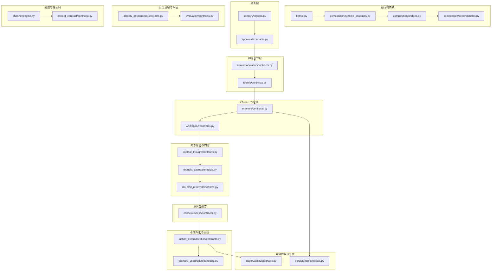
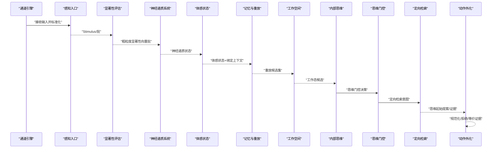
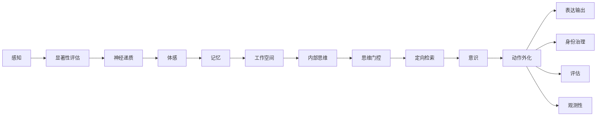

# 模块接口

<cite>
**本文引用的文件**
- [helios_v2/src/helios_v2/action_externalization/contracts.py](file://helios_v2/src/helios_v2/action_externalization/contracts.py)
- [helios_v2/src/helios_v2/workspace/contracts.py](file://helios_v2/src/helios_v2/workspace/contracts.py)
- [helios_v2/src/helios_v2/appraisal/contracts.py](file://helios_v2/src/helios_v2/appraisal/contracts.py)
- [helios_v2/src/helios_v2/neuromodulation/contracts.py](file://helios_v2/src/helios_v2/neuromodulation/contracts.py)
- [helios_v2/src/helios_v2/memory/contracts.py](file://helios_v2/src/helios_v2/memory/contracts.py)
- [helios_v2/src/helios_v2/evaluation/contracts.py](file://helios_v2/src/helios_v2/evaluation/contracts.py)
- [helios_v2/src/helios_v2/observability/contracts.py](file://helios_v2/src/helios_v2/observability/contracts.py)
- [helios_v2/src/helios_v2/outward_expression/contracts.py](file://helios_v2/src/helios_v2/outward_expression/contracts.py)
- [helios_v2/src/helios_v2/identity_governance/contracts.py](file://helios_v2/src/helios_v2/identity_governance/contracts.py)
- [helios_v2/src/helios_v2/sensory/ingress.py](file://helios_v2/src/helios_v2/sensory/ingress.py)
- [helios_v2/src/helios_v2/channel/engine.py](file://helios_v2/src/helios_v2/channel/engine.py)
- [helios_v2/src/helios_v2/internal_thought/contracts.py](file://helios_v2/src/helios_v2/internal_thought/contracts.py)
- [helios_v2/src/helios_v2/thought_gating/contracts.py](file://helios_v2/src/helios_v2/thought_gating/contracts.py)
- [helios_v2/src/helios_v2/directed_retrieval/contracts.py](file://helios_v2/src/helios_v2/directed_retrieval/contracts.py)
- [helios_v2/src/helios_v2/consciousness/contracts.py](file://helios_v2/src/helios_v2/consciousness/contracts.py)
- [helios_v2/src/helios_v2/feeling/contracts.py](file://helios_v2/src/helios_v2/feeling/contracts.py)
- [helios_v2/src/helios_v2/persistence/contracts.py](file://helios_v2/src/helios_v2/persistence/contracts.py)
- [helios_v2/src/helios_v2/planner_bridge/contracts.py](file://helios_v2/src/helios_v2/planner_bridge/contracts.py)
- [helios_v2/src/helios_v2/continuity_checkpoint/contracts.py](file://helios_v2/src/helios_v2/continuity_checkpoint/contracts.py)
- [helios_v2/src/helios_v2/autonomy/contracts.py](file://helios_v2/src/helios_v2/autonomy/contracts.py)
- [helios_v2/src/helios_v2/embedding/contracts.py](file://helios_v2/src/helios_v2/embedding/contracts.py)
- [helios_v2/src/helios_v2/experience_writeback/contracts.py](file://helios_v2/src/helios_v2/experience_writeback/contracts.py)
- [helios_v2/src/helios_v2/temporal/contracts.py](file://helios_v2/src/helios_v2/temporal/contracts.py)
- [helios_v2/src/helios_v2/interoception/contracts.py](file://helios_v2/src/helios_v2/interoception/contracts.py)
- [helios_v2/src/helios_v2/prompt_contract/contracts.py](file://helios_v2/src/helios_v2/prompt_contract/contracts.py)
- [helios_v2/src/helios_v2/runtime/kernel.py](file://helios_v2/src/helios_v2/runtime/kernel.py)
- [helios_v2/src/helios_v2/composition/runtime_assembly.py](file://helios_v2/src/helios_v2/composition/runtime_assembly.py)
- [helios_v2/src/helios_v2/composition/bridges.py](file://helios_v2/src/helios_v2/composition/bridges.py)
- [helios_v2/src/helios_v2/composition/dependencies.py](file://helios_v2/src/helios_v2/composition/dependencies.py)
- [helios_v2/src/helios_v2/llm/contracts.py](file://helios_v2/src/helios_v2/llm/contracts.py)
</cite>

## 目录
1. [简介](#简介)
2. [项目结构](#项目结构)
3. [核心组件](#核心组件)
4. [架构总览](#架构总览)
5. [详细组件分析](#详细组件分析)
6. [依赖关系分析](#依赖关系分析)
7. [性能考量](#性能考量)
8. [故障排查指南](#故障排查指南)
9. [结论](#结论)
10. [附录](#附录)

## 简介
本文件面向Helios v2的“所有者（Owner）”使用者，系统化梳理感知、工作空间、显著性评估、神经递质、记忆、动作外化、表达输出、身份治理、评估与观测性等模块的公共接口契约与数据结构。文档覆盖：
- 接口职责边界与所有权声明
- 数据结构定义、参数与返回值约束
- 异常与失败语义
- 使用示例与模块间交互序列
- 版本兼容性、稳定性与废弃策略建议
- 性能、并发与错误恢复要点

## 项目结构
Helios v2采用按“能力域”划分的模块化组织方式，每个模块在src/helios_v2/<模块名>/下提供contracts.py（契约）、engine.py（实现入口）与tests（测试）。运行时由runtime/kernel.py与composition/*负责装配与桥接。

图表来源
- [helios_v2/src/helios_v2/runtime/kernel.py:1-200](file://helios_v2/src/helios_v2/runtime/kernel.py#L1-L200)
- [helios_v2/src/helios_v2/composition/runtime_assembly.py:1-200](file://helios_v2/src/helios_v2/composition/runtime_assembly.py#L1-L200)
- [helios_v2/src/helios_v2/composition/bridges.py:1-200](file://helios_v2/src/helios_v2/composition/bridges.py#L1-L200)
- [helios_v2/src/helios_v2/composition/dependencies.py:1-200](file://helios_v2/src/helios_v2/composition/dependencies.py#L1-L200)
- [helios_v2/src/helios_v2/sensory/ingress.py:1-200](file://helios_v2/src/helios_v2/sensory/ingress.py#L1-L200)
- [helios_v2/src/helios_v2/appraisal/contracts.py:1-239](file://helios_v2/src/helios_v2/appraisal/contracts.py#L1-L239)
- [helios_v2/src/helios_v2/neuromodulation/contracts.py:1-258](file://helios_v2/src/helios_v2/neuromodulation/contracts.py#L1-L258)
- [helios_v2/src/helios_v2/feeling/contracts.py:1-200](file://helios_v2/src/helios_v2/feeling/contracts.py#L1-L200)
- [helios_v2/src/helios_v2/memory/contracts.py:1-510](file://helios_v2/src/helios_v2/memory/contracts.py#L1-L510)
- [helios_v2/src/helios_v2/workspace/contracts.py:1-344](file://helios_v2/src/helios_v2/workspace/contracts.py#L1-L344)
- [helios_v2/src/helios_v2/internal_thought/contracts.py:1-200](file://helios_v2/src/helios_v2/internal_thought/contracts.py#L1-L200)
- [helios_v2/src/helios_v2/thought_gating/contracts.py:1-200](file://helios_v2/src/helios_v2/thought_gating/contracts.py#L1-L200)
- [helios_v2/src/helios_v2/directed_retrieval/contracts.py:1-200](file://helios_v2/src/helios_v2/directed_retrieval/contracts.py#L1-L200)
- [helios_v2/src/helios_v2/consciousness/contracts.py:1-200](file://helios_v2/src/helios_v2/consciousness/contracts.py#L1-L200)
- [helios_v2/src/helios_v2/action_externalization/contracts.py:1-352](file://helios_v2/src/helios_v2/action_externalization/contracts.py#L1-L352)
- [helios_v2/src/helios_v2/outward_expression/contracts.py:1-200](file://helios_v2/src/helios_v2/outward_expression/contracts.py#L1-L200)
- [helios_v2/src/helios_v2/identity_governance/contracts.py:1-200](file://helios_v2/src/helios_v2/identity_governance/contracts.py#L1-L200)
- [helios_v2/src/helios_v2/evaluation/contracts.py:1-200](file://helios_v2/src/helios_v2/evaluation/contracts.py#L1-L200)
- [helios_v2/src/helios_v2/observability/contracts.py:1-200](file://helios_v2/src/helios_v2/observability/contracts.py#L1-L200)
- [helios_v2/src/helios_v2/persistence/contracts.py:1-200](file://helios_v2/src/helios_v2/persistence/contracts.py#L1-L200)
- [helios_v2/src/helios_v2/channel/engine.py:1-200](file://helios_v2/src/helios_v2/channel/engine.py#L1-L200)
- [helios_v2/src/helios_v2/prompt_contract/contracts.py:1-200](file://helios_v2/src/helios_v2/prompt_contract/contracts.py#L1-L200)

章节来源
- [helios_v2/src/helios_v2/runtime/kernel.py:1-200](file://helios_v2/src/helios_v2/runtime/kernel.py#L1-L200)
- [helios_v2/src/helios_v2/composition/runtime_assembly.py:1-200](file://helios_v2/src/helios_v2/composition/runtime_assembly.py#L1-L200)

## 核心组件
- 感知模块：从通道接收输入，标准化为Stimulus/批，产出粗粒度显著性评估结果。
- 工作空间模块：消费记忆重放候选与体感状态，竞争生成工作态快照与候选集。
- 显著性评估模块：对归一化刺激进行快速显著性向量评分。
- 神经递质模块：基于显著性评估更新独立建模的神经递质水平。
- 记忆模块：以体感为标签形成情感记忆，生成重放候选与存储状态。
- 动作外化模块：将“思维起始”的提案规范化或等价证据，发布外化结果。
- 表达输出模块：承载对外输出的表达层契约与操作元数据。
- 身份治理模块：面向身份修订与治理的Owner契约。
- 评估模块：面向运行时评估与诊断的契约。
- 观测性模块：统一可观测性与日志的契约。

章节来源
- [helios_v2/src/helios_v2/appraisal/contracts.py:1-239](file://helios_v2/src/helios_v2/appraisal/contracts.py#L1-L239)
- [helios_v2/src/helios_v2/workspace/contracts.py:1-344](file://helios_v2/src/helios_v2/workspace/contracts.py#L1-L344)
- [helios_v2/src/helios_v2/neuromodulation/contracts.py:1-258](file://helios_v2/src/helios_v2/neuromodulation/contracts.py#L1-L258)
- [helios_v2/src/helios_v2/memory/contracts.py:1-510](file://helios_v2/src/helios_v2/memory/contracts.py#L1-L510)
- [helios_v2/src/helios_v2/action_externalization/contracts.py:1-352](file://helios_v2/src/helios_v2/action_externalization/contracts.py#L1-L352)
- [helios_v2/src/helios_v2/outward_expression/contracts.py:1-200](file://helios_v2/src/helios_v2/outward_expression/contracts.py#L1-L200)
- [helios_v2/src/helios_v2/identity_governance/contracts.py:1-200](file://helios_v2/src/helios_v2/identity_governance/contracts.py#L1-L200)
- [helios_v2/src/helios_v2/evaluation/contracts.py:1-200](file://helios_v2/src/helios_v2/evaluation/contracts.py#L1-L200)
- [helios_v2/src/helios_v2/observability/contracts.py:1-200](file://helios_v2/src/helios_v2/observability/contracts.py#L1-L200)

## 架构总览
以下序列图展示从感知到动作外化的典型调用链路与数据流：

图表来源
- [helios_v2/src/helios_v2/channel/engine.py:1-200](file://helios_v2/src/helios_v2/channel/engine.py#L1-L200)
- [helios_v2/src/helios_v2/sensory/ingress.py:1-200](file://helios_v2/src/helios_v2/sensory/ingress.py#L1-L200)
- [helios_v2/src/helios_v2/appraisal/contracts.py:1-239](file://helios_v2/src/helios_v2/appraisal/contracts.py#L1-L239)
- [helios_v2/src/helios_v2/neuromodulation/contracts.py:1-258](file://helios_v2/src/helios_v2/neuromodulation/contracts.py#L1-L258)
- [helios_v2/src/helios_v2/feeling/contracts.py:1-200](file://helios_v2/src/helios_v2/feeling/contracts.py#L1-L200)
- [helios_v2/src/helios_v2/memory/contracts.py:1-510](file://helios_v2/src/helios_v2/memory/contracts.py#L1-L510)
- [helios_v2/src/helios_v2/workspace/contracts.py:1-344](file://helios_v2/src/helios_v2/workspace/contracts.py#L1-L344)
- [helios_v2/src/helios_v2/internal_thought/contracts.py:1-200](file://helios_v2/src/helios_v2/internal_thought/contracts.py#L1-L200)
- [helios_v2/src/helios_v2/thought_gating/contracts.py:1-200](file://helios_v2/src/helios_v2/thought_gating/contracts.py#L1-L200)
- [helios_v2/src/helios_v2/directed_retrieval/contracts.py:1-200](file://helios_v2/src/helios_v2/directed_retrieval/contracts.py#L1-L200)
- [helios_v2/src/helios_v2/action_externalization/contracts.py:1-352](file://helios_v2/src/helios_v2/action_externalization/contracts.py#L1-L352)

## 详细组件分析

### 感知模块（sensory/ingress）
- 职责边界
  - 接收多源输入，标准化为Stimulus/批，保留上游来源与信号溯源。
- 公共接口
  - 输入：原始通道数据
  - 输出：Stimulus/批
  - 失败语义：缺少必要溯源字段时抛出硬停止错误
- 数据结构
  - Stimulus/批：包含id、source_name、provenance_signal_id等
- 使用示例
  - 通道驱动将外部输入转为Stimulus后交由显著性评估模块

章节来源
- [helios_v2/src/helios_v2/sensory/ingress.py:1-200](file://helios_v2/src/helios_v2/sensory/ingress.py#L1-L200)

### 显著性评估模块（appraisal）
- 职责边界
  - 对归一化刺激进行快速显著性评分，输出粗粒度向量
- 公共接口
  - assess_batch(batch: StimulusBatch) -> RapidAppraisalBatch
  - build_assess_batch_op(batch) -> AssessStimulusBatchOp
  - build_publish_batch_op(batch) -> PublishRapidAppraisalBatchOp
- 数据结构
  - RapidSalienceVector：threat/reward/novelty/social/uncertainty/aggregate ∈ [0,1]
  - RapidAppraisal/RapidAppraisalBatch：携带来源与信号溯源
- 异常
  - RapidAppraisalError：输入不完整或评分越界
- 使用示例
  - 从感知入口接收StimulusBatch，产出RapidAppraisalBatch供神经递质系统使用

章节来源
- [helios_v2/src/helios_v2/appraisal/contracts.py:1-239](file://helios_v2/src/helios_v2/appraisal/contracts.py#L1-L239)

### 神经递质模块（neuromodulation）
- 职责边界
  - 基于显著性评估结果更新独立建模的神经递质水平向量
- 公共接口
  - update_state(batch, tick_id=None, prior_state=None) -> NeuromodulatorState
  - build_update_op(batch) -> UpdateNeuromodulatorsOp
  - build_publish_state_op(state) -> PublishNeuromodulatorStateOp
- 数据结构
  - NeuromodulatorLevels：多通道（如多巴胺、去甲肾上腺素等）∈ [0,1]
  - NeuromodulatorState：含来源与tick_id
- 异常
  - NeuromodulatorError：配置非法、范围越界、前置状态不匹配
- 使用示例
  - 接收RapidAppraisalBatch，产出NeuromodulatorState供体感层使用

章节来源
- [helios_v2/src/helios_v2/neuromodulation/contracts.py:1-258](file://helios_v2/src/helios_v2/neuromodulation/contracts.py#L1-L258)

### 记忆模块（memory）
- 职责边界
  - 以体感为标签形成情感记忆，生成重放候选与存储状态
- 公共接口
  - record_state(feeling_state, binding_context=None, mismatch_evidence=None, tick_id=None) -> MemoryFormationState
  - build_record_op(...) -> RecordMemoryOp
  - build_publish_replay_candidates_op(state) -> PublishReplayCandidatesOp
  - build_publish_state_op(state) -> PublishMemoryFormationStateOp
- 数据结构
  - MemoryBindingContext/MemoryContentPacket/AffectTaggedMemoryItem/MemoryReplayCandidate
  - MemoryFormationState：包含items与candidates，并校验引用一致性
- 异常
  - MemoryAffectReplayError：输入缺失、优先级越界、引用不一致
- 使用示例
  - 以体感状态与可选绑定上下文触发记忆形成，发布候选供工作空间使用

章节来源
- [helios_v2/src/helios_v2/memory/contracts.py:1-510](file://helios_v2/src/helios_v2/memory/contracts.py#L1-L510)

### 工作空间模块（workspace）
- 职责边界
  - 将记忆重放候选与体感状态竞争，生成工作态快照与候选集
- 公共接口
  - compete(replay_candidates, feeling_state, tick_id=None) -> (WorkspaceCandidateSet, WorkingStateSnapshot)
  - build_run_competition_op(...) -> RunWorkspaceCompetitionOp
  - build_publish_candidate_set_op(set) -> PublishWorkspaceCandidateSetOp
  - build_publish_working_state_op(state) -> PublishWorkingStateOp
- 数据结构
  - WorkspaceCandidate/WorkspaceCandidateSet/WorkingStateSnapshot
- 异常
  - WorkspaceCompetitionError：输入为空、范围越界、引用不一致
- 使用示例
  - 接收MemoryReplayCandidate与体感状态，产出候选集与工作态快照

章节来源
- [helios_v2/src/helios_v2/workspace/contracts.py:1-344](file://helios_v2/src/helios_v2/workspace/contracts.py#L1-L344)

### 动作外化模块（action_externalization）
- 职责边界
  - 将“思维起始”规范化为动作提案，或发布等价证据/拒绝
- 公共接口
  - externalize_action_proposal(thought_cycle_result, request) -> ThoughtExternalizationResult
  - build_request_op(...) -> RequestThoughtExternalizationOp
  - build_publish_externalization_op(result) -> PublishThoughtExternalizationOp
  - build_publish_rejection_op(result) -> PublishThoughtExternalizationRejectionOp
- 数据结构
  - ThoughtExternalizationRequest/NormalizedThoughtActionProposal/EquivalentBridgeEvidence/ThoughtExternalizationResult
  - 状态枚举：normalized/bridge_rejected/equivalent_evidence_only/no_externalization
- 异常
  - ActionExternalizationError：必填字段缺失、范围越界、状态与载荷不一致
- 使用示例
  - 依据思维循环结果与请求上下文，生成规范化提案或等价证据

章节来源
- [helios_v2/src/helios_v2/action_externalization/contracts.py:1-352](file://helios_v2/src/helios_v2/action_externalization/contracts.py#L1-L352)

### 表达输出模块（outward_expression）
- 职责边界
  - 定义对外表达层的契约与发布操作
- 公共接口
  - 发布表达相关操作（Publish*Op）用于可观测性与审计
- 数据结构
  - 各类Publish*Op描述表达层发布元信息
- 异常
  - 由具体实现抛出，遵循通用运行时错误约定
- 使用示例
  - 在动作外化完成后，发布表达层操作记录

章节来源
- [helios_v2/src/helios_v2/outward_expression/contracts.py:1-200](file://helios_v2/src/helios_v2/outward_expression/contracts.py#L1-L200)

### 身份治理模块（identity_governance）
- 职责边界
  - 面向身份修订与治理的Owner契约
- 公共接口
  - 提供身份治理相关的请求与发布操作
- 数据结构
  - 身份治理相关契约类型
- 异常
  - 由具体实现抛出，遵循通用运行时错误约定
- 使用示例
  - 在动作外化或评估阶段触发身份治理流程

章节来源
- [helios_v2/src/helios_v2/identity_governance/contracts.py:1-200](file://helios_v2/src/helios_v2/identity_governance/contracts.py#L1-L200)

### 评估模块（evaluation）
- 职责边界
  - 面向运行时评估与诊断的契约
- 公共接口
  - 提供评估相关的请求与发布操作
- 数据结构
  - 评估相关契约类型
- 异常
  - 由具体实现抛出，遵循通用运行时错误约定
- 使用示例
  - 在关键节点发布评估操作，供观测性模块采集

章节来源
- [helios_v2/src/helios_v2/evaluation/contracts.py:1-200](file://helios_v2/src/helios_v2/evaluation/contracts.py#L1-L200)

### 观测性模块（observability）
- 职责边界
  - 统一可观测性与日志的契约
- 公共接口
  - 提供可观测性相关的请求与发布操作
- 数据结构
  - 观测性相关契约类型
- 异常
  - 由具体实现抛出，遵循通用运行时错误约定
- 使用示例
  - 在各Owner关键路径发布可观测性操作

章节来源
- [helios_v2/src/helios_v2/observability/contracts.py:1-200](file://helios_v2/src/helios_v2/observability/contracts.py#L1-L200)

### 内部思维、思维门控、定向检索、意识与报告
- 内部思维（internal_thought）
  - 产生思维循环结果，作为动作外化的输入
- 思维门控（thought_gating）
  - 控制思维延续压力与门控
- 定向检索（directed_retrieval）
  - 将思维意图转化为检索意图
- 意识与报告（consciousness）
  - 将工作空间候选提升为可报告意识内容
- 公共接口
  - 各模块均提供build_*_op方法用于可观测性与审计
- 数据结构
  - 各模块契约类型详见对应contracts.py

章节来源
- [helios_v2/src/helios_v2/internal_thought/contracts.py:1-200](file://helios_v2/src/helios_v2/internal_thought/contracts.py#L1-L200)
- [helios_v2/src/helios_v2/thought_gating/contracts.py:1-200](file://helios_v2/src/helios_v2/thought_gating/contracts.py#L1-L200)
- [helios_v2/src/helios_v2/directed_retrieval/contracts.py:1-200](file://helios_v2/src/helios_v2/directed_retrieval/contracts.py#L1-L200)
- [helios_v2/src/helios_v2/consciousness/contracts.py:1-200](file://helios_v2/src/helios_v2/consciousness/contracts.py#L1-L200)

### 体感、通道、提示词契约、LLM、嵌入、规划桥接、连续性检查点、自主性、时间、内感受
- 体感（feeling）
  - 提供InteroceptiveFeelingState/向量等契约
- 通道（channel）
  - 提供通道引擎与驱动契约
- 提示词契约（prompt_contract）
  - 定义提示词上下文与合约
- LLM（llm）
  - 提供LLM依赖与引擎契约
- 嵌入（embedding）
  - 提供嵌入相关契约
- 规划桥接（planner_bridge）
  - 连接规划与执行反馈
- 连续性检查点（continuity_checkpoint）
  - 提供运行时持续性与重启契约
- 自主性（autonomy）
  - 提供自主性驱动契约
- 时间（temporal）
  - 提供时间与节律相关契约
- 内感受（interoception）
  - 提供内感受源契约

章节来源
- [helios_v2/src/helios_v2/feeling/contracts.py:1-200](file://helios_v2/src/helios_v2/feeling/contracts.py#L1-L200)
- [helios_v2/src/helios_v2/channel/engine.py:1-200](file://helios_v2/src/helios_v2/channel/engine.py#L1-L200)
- [helios_v2/src/helios_v2/prompt_contract/contracts.py:1-200](file://helios_v2/src/helios_v2/prompt_contract/contracts.py#L1-L200)
- [helios_v2/src/helios_v2/llm/contracts.py:1-200](file://helios_v2/src/helios_v2/llm/contracts.py#L1-L200)
- [helios_v2/src/helios_v2/embedding/contracts.py:1-200](file://helios_v2/src/helios_v2/embedding/contracts.py#L1-L200)
- [helios_v2/src/helios_v2/planner_bridge/contracts.py:1-200](file://helios_v2/src/helios_v2/planner_bridge/contracts.py#L1-L200)
- [helios_v2/src/helios_v2/continuity_checkpoint/contracts.py:1-200](file://helios_v2/src/helios_v2/continuity_checkpoint/contracts.py#L1-L200)
- [helios_v2/src/helios_v2/autonomy/contracts.py:1-200](file://helios_v2/src/helios_v2/autonomy/contracts.py#L1-L200)
- [helios_v2/src/helios_v2/temporal/contracts.py:1-200](file://helios_v2/src/helios_v2/temporal/contracts.py#L1-L200)
- [helios_v2/src/helios_v2/interoception/contracts.py:1-200](file://helios_v2/src/helios_v2/interoception/contracts.py#L1-L200)

## 依赖关系分析
- 模块耦合
  - 上游感知→显著性评估→神经递质→体感→记忆→工作空间→内部思维→门控/检索→意识→动作外化→表达输出
  - 身份治理与评估贯穿关键节点
- 运行时装配
  - runtime/kernel.py与composition/*负责模块装配、依赖解析与桥接
- 可观测性
  - 各Owner通过build_*_op输出操作元数据，便于统一观测

图表来源
- [helios_v2/src/helios_v2/runtime/kernel.py:1-200](file://helios_v2/src/helios_v2/runtime/kernel.py#L1-L200)
- [helios_v2/src/helios_v2/composition/runtime_assembly.py:1-200](file://helios_v2/src/helios_v2/composition/runtime_assembly.py#L1-L200)
- [helios_v2/src/helios_v2/composition/bridges.py:1-200](file://helios_v2/src/helios_v2/composition/bridges.py#L1-L200)
- [helios_v2/src/helios_v2/composition/dependencies.py:1-200](file://helios_v2/src/helios_v2/composition/dependencies.py#L1-L200)

章节来源
- [helios_v2/src/helios_v2/runtime/kernel.py:1-200](file://helios_v2/src/helios_v2/runtime/kernel.py#L1-L200)
- [helios_v2/src/helios_v2/composition/runtime_assembly.py:1-200](file://helios_v2/src/helios_v2/composition/runtime_assembly.py#L1-L200)
- [helios_v2/src/helios_v2/composition/bridges.py:1-200](file://helios_v2/src/helios_v2/composition/bridges.py#L1-L200)
- [helios_v2/src/helios_v2/composition/dependencies.py:1-200](file://helios_v2/src/helios_v2/composition/dependencies.py#L1-L200)

## 性能考量
- 数据结构冻结与不可变性
  - 多数契约使用frozen dataclass，降低拷贝与并发写风险
- 范围校验与早失败
  - 所有[0,1]区间参数在构造期即校验，避免传播非法值
- 批处理与元数据发布
  - RapidAppraisalBatch、MemoryFormationState等批量结构减少传输次数；配套build_*_op便于可观测性与审计
- 并发安全
  - 建议在Owner内部保持无共享可变状态，通过不可变契约传递数据
- 错误恢复
  - 硬停止错误（如ActionExternalizationError/WorkspaceCompetitionError等）用于快速暴露契约违规，便于上层重试或降级

## 故障排查指南
- 常见错误类型
  - ActionExternalizationError：请求/提案/证据/状态不合法
  - WorkspaceCompetitionError：候选/分数/引用不合法
  - RapidAppraisalError：评分越界或溯源缺失
  - NeuromodulatorError：通道值越界或配置非法
  - MemoryAffectReplayError：优先级/引用/家族不合法
- 排查步骤
  - 检查输入契约字段完整性与范围
  - 核对跨Owner引用一致性（如source_*_id）
  - 关注build_*_op输出，定位失败环节
  - 结合观测性模块日志与操作元数据复盘

章节来源
- [helios_v2/src/helios_v2/action_externalization/contracts.py:24-352](file://helios_v2/src/helios_v2/action_externalization/contracts.py#L24-L352)
- [helios_v2/src/helios_v2/workspace/contracts.py:218-344](file://helios_v2/src/helios_v2/workspace/contracts.py#L218-L344)
- [helios_v2/src/helios_v2/appraisal/contracts.py:172-239](file://helios_v2/src/helios_v2/appraisal/contracts.py#L172-L239)
- [helios_v2/src/helios_v2/neuromodulation/contracts.py:176-258](file://helios_v2/src/helios_v2/neuromodulation/contracts.py#L176-L258)
- [helios_v2/src/helios_v2/memory/contracts.py:344-510](file://helios_v2/src/helios_v2/memory/contracts.py#L344-L510)

## 结论
本文档系统化梳理了Helios v2各Owner模块的公共接口与数据契约，明确了职责边界、失败语义与可观测性元数据。建议在集成时严格遵循契约约束，利用build_*_op进行可观测性与审计，并在出现硬停止错误时结合日志与元数据快速定位问题。

## 附录
- 版本兼容性与稳定性
  - 建议通过契约中的枚举与字面量维持向后兼容；新增字段应保持可选
  - 对于破坏性变更，建议引入新版本契约并保留旧版以支持迁移
- 废弃策略
  - 旧契约应在可观测性中保留一段时间的日志与元数据，配合迁移指引逐步淘汰
- 并发与错误恢复
  - 建议在Owner内部使用不可变契约与只读视图，避免共享可变状态
  - 对于可重试场景，结合build_*_op与观测性日志进行指数退避与熔断