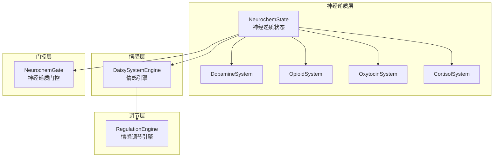
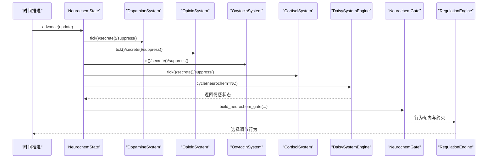
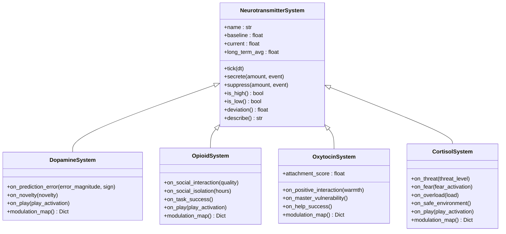
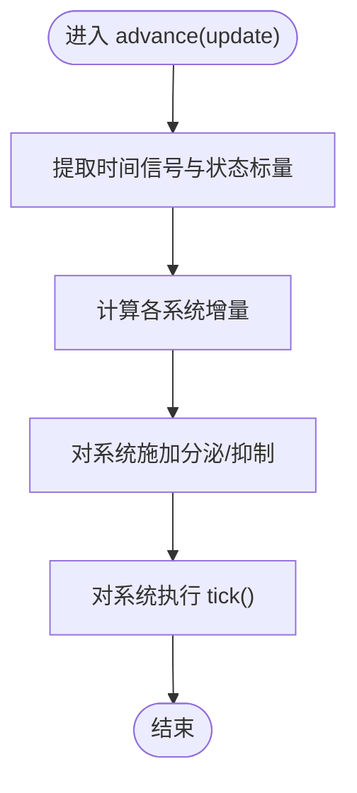
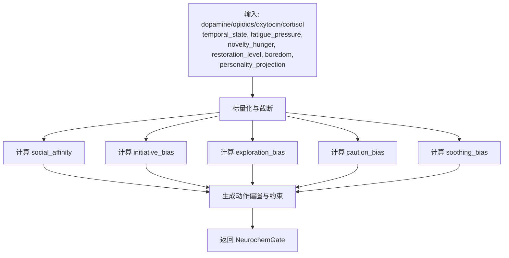
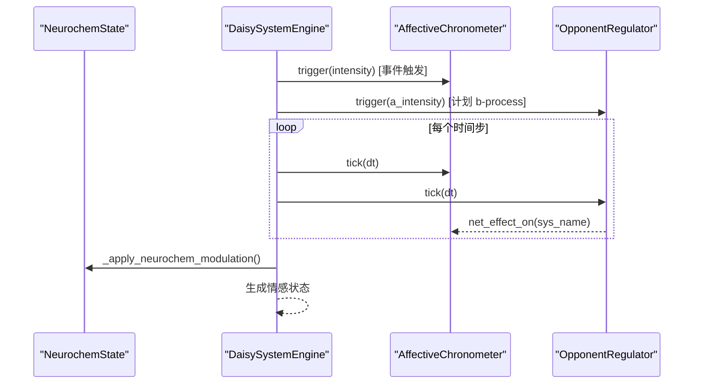
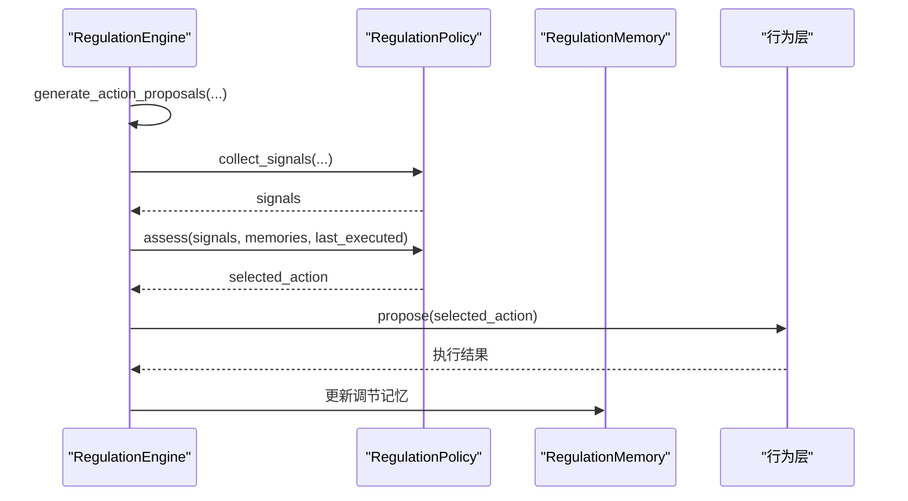
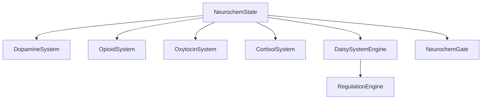

# 神经递质模块接口

<cite>
**本文档引用的文件**
- [neurochem.py](file://archive/helios_v1/neurochem.py)
- [neurochem_gate.py](file://archive/helios_v1/neurochem_gate.py)
- [daisy_emotion.py](file://archive/helios_v1/daisy_emotion.py)
- [regulation.py](file://archive/helios_v1/regulation/regulation.py)
</cite>

## 目录
1. [简介](#简介)
2. [项目结构](#项目结构)
3. [核心组件](#核心组件)
4. [架构概览](#架构概览)
5. [详细组件分析](#详细组件分析)
6. [依赖关系分析](#依赖关系分析)
7. [性能考虑](#性能考虑)
8. [故障排除指南](#故障排除指南)
9. [结论](#结论)
10. [附录](#附录)

## 简介
本文件为 Helios 神经递质模块的完整接口 API 文档，聚焦多巴胺、血清素（内源性阿片类）、催产素与皮质醇等关键神经调质的动态调节接口。文档解释了神经递质浓度计算、反馈回路与稳态维持的协议定义，并提供神经递质建模示例与调节策略。同时，文档化了神经递质系统与其他模块（情感调节、生理信号耦合）的交互接口。

## 项目结构
神经递质模块位于 archive/helios_v1 目录下，主要包含以下文件：
- neurochem.py：四大神经调质系统（多巴胺、阿片类、催产素、皮质醇）的动态建模与总体状态管理
- neurochem_gate.py：基于神经递质状态的行为倾向与动作偏置门控
- daisy_emotion.py：情感引擎（DAISY），将神经递质动态与情感状态耦合
- regulation/regulation.py：情感调节系统，基于记忆的经验学习与行为选择

**图表来源**
- [neurochem.py:281-420](file://archive/helios_v1/neurochem.py#L281-L420)
- [daisy_emotion.py:299-464](file://archive/helios_v1/daisy_emotion.py#L299-L464)
- [neurochem_gate.py:25-50](file://archive/helios_v1/neurochem_gate.py#L25-L50)
- [regulation.py:122-176](file://archive/helios_v1/regulation/regulation.py#L122-L176)

**章节来源**
- [neurochem.py:1-620](file://archive/helios_v1/neurochem.py#L1-L620)
- [neurochem_gate.py:1-200](file://archive/helios_v1/neurochem_gate.py#L1-L200)
- [daisy_emotion.py:1-565](file://archive/helios_v1/daisy_emotion.py#L1-L565)
- [regulation.py:1-603](file://archive/helios_v1/regulation/regulation.py#L1-L603)

## 核心组件
- 神经递质系统（NeurotransmitterSystem）：抽象基类，定义单个调质系统的动态衰减、分泌、抑制与状态描述
- 四大系统：DopamineSystem、OpioidSystem、OxytocinSystem、CortisolSystem，分别实现各自特异性的触发与调制映射
- 神经递质状态（NeurochemState）：聚合四大系统，提供 tick、advance、modulate_parameter、describe、to_dict 等接口
- 神经递质门控（NeurochemGate）：将神经递质水平与时间状态映射为行为倾向与动作偏置
- 情感引擎（DaisySystemEngine）：将神经递质动态与情感状态（效价、唤醒）耦合
- 情感调节引擎（RegulationEngine）：基于记忆的经验学习，选择缓解情感偏离的行为

**章节来源**
- [neurochem.py:25-420](file://archive/helios_v1/neurochem.py#L25-L420)
- [neurochem_gate.py:25-200](file://archive/helios_v1/neurochem_gate.py#L25-L200)
- [daisy_emotion.py:299-464](file://archive/helios_v1/daisy_emotion.py#L299-L464)
- [regulation.py:122-176](file://archive/helios_v1/regulation/regulation.py#L122-L176)

## 架构概览
神经递质模块采用“系统-状态-门控-情感-调节”的分层架构：
- 系统层：各神经递质系统独立建模，遵循基线回归与时间常数衰减
- 状态层：NeurochemState 统一管理四大系统，协调时间推进与事件触发
- 门控层：NeurochemGate 将神经递质与时间状态转化为行为倾向与动作约束
- 情感层：DaisySystemEngine 将神经递质动态映射为情感状态（效价、唤醒）
- 调节层：RegulationEngine 基于情感状态与历史经验选择调节行为

**图表来源**
- [neurochem.py:303-360](file://archive/helios_v1/neurochem.py#L303-L360)
- [daisy_emotion.py:337-464](file://archive/helios_v1/daisy_emotion.py#L337-L464)
- [neurochem_gate.py:52-178](file://archive/helios_v1/neurochem_gate.py#L52-L178)
- [regulation.py:202-229](file://archive/helios_v1/regulation/regulation.py#L202-L229)

## 详细组件分析

### 神经递质系统（NeurotransmitterSystem）
- 功能：单个神经调质系统的动态建模，包括基线、上升/下降时间常数、长期平均、事件记录
- 关键方法：
  - tick(dt)：自然衰减与向基线回归
  - secrete(amount, event)：事件触发的分泌
  - suppress(amount, event)：事件触发的抑制
  - is_high/is_low/deviation/describe：状态判断与描述

**图表来源**
- [neurochem.py:25-275](file://archive/helios_v1/neurochem.py#L25-L275)

**章节来源**
- [neurochem.py:25-84](file://archive/helios_v1/neurochem.py#L25-L84)

### 神经递质状态（NeurochemState）
- 功能：聚合四大系统，提供统一的时间推进、事件应用与参数调制接口
- 关键方法：
  - tick(dt)：对所有系统执行自然衰减
  - advance(update)：根据时间信号与状态计算各系统增量并施加
  - modulate_parameter(param_name, base_value)：综合四种调质对单一参数的调制
  - describe/to_dict：状态描述与序列化

**图表来源**
- [neurochem.py:303-360](file://archive/helios_v1/neurochem.py#L303-L360)

**章节来源**
- [neurochem.py:281-420](file://archive/helios_v1/neurochem.py#L281-L420)

### 神经递质门控（NeurochemGate）
- 功能：将神经递质水平与时间状态映射为行为倾向（社交亲和、主动性、探索性、谨慎性、安抚性）与动作偏置
- 关键方法：
  - build_neurochem_gate(...)：构建门控对象
  - resolve_neurochem_gate(...)：解析现有门控或从状态重建
  - to_dict()：序列化门控参数

**图表来源**
- [neurochem_gate.py:52-178](file://archive/helios_v1/neurochem_gate.py#L52-L178)

**章节来源**
- [neurochem_gate.py:25-200](file://archive/helios_v1/neurochem_gate.py#L25-L200)

### 情感引擎（DaisySystemEngine）
- 功能：将神经递质动态与情感状态耦合，生成效价与唤醒
- 关键流程：
  - 事件触发 → 各系统时序控制器上升
  - b-process 对向过程延迟释放，抑制源系统并激活对手系统
  - 神经递质专项调制：多巴胺影响 SEEKING 衰减，皮质醇影响 FEAR 激活
  - 人格与心境调制
  - 汇总为情感状态（效价、唤醒、主导系统）

**图表来源**
- [daisy_emotion.py:337-464](file://archive/helios_v1/daisy_emotion.py#L337-L464)

**章节来源**
- [daisy_emotion.py:299-565](file://archive/helios_v1/daisy_emotion.py#L299-L565)

### 情感调节引擎（RegulationEngine）
- 功能：基于记忆的经验学习，选择缓解情感偏离的行为
- 关键流程：
  - 偏离检测（基于 Panksepp 激活与效价）
  - 候选行为检索与评分（结合驱动与神经递质门控）
  - 行为提案与执行反馈
  - 效果观察与记忆更新

**图表来源**
- [regulation.py:202-318](file://archive/helios_v1/regulation/regulation.py#L202-L318)

**章节来源**
- [regulation.py:122-603](file://archive/helios_v1/regulation/regulation.py#L122-L603)

## 依赖关系分析
- NeurochemState 依赖四个神经递质系统与时间推进接口
- DaisySystemEngine 依赖 NeurochemState 以进行专项调制
- NeurochemGate 依赖 NeurochemState 的当前水平与时间状态
- RegulationEngine 依赖情感状态（Panksepp 激活与效价）与行为提案接口

**图表来源**
- [neurochem.py:281-420](file://archive/helios_v1/neurochem.py#L281-L420)
- [daisy_emotion.py:299-464](file://archive/helios_v1/daisy_emotion.py#L299-L464)
- [neurochem_gate.py:181-200](file://archive/helios_v1/neurochem_gate.py#L181-L200)
- [regulation.py:202-229](file://archive/helios_v1/regulation/regulation.py#L202-L229)

**章节来源**
- [neurochem.py:281-420](file://archive/helios_v1/neurochem.py#L281-L420)
- [daisy_emotion.py:299-464](file://archive/helios_v1/daisy_emotion.py#L299-L464)
- [neurochem_gate.py:181-200](file://archive/helios_v1/neurochem_gate.py#L181-L200)
- [regulation.py:202-229](file://archive/helios_v1/regulation/regulation.py#L202-L229)

## 性能考虑
- 时间复杂度：NeurochemState.advance 对每个系统执行一次标量运算，整体 O(S)，S 为系统数量（固定为 4）
- 内存占用：NeurochemState 仅维护当前水平与少量统计；DaisySystemEngine 维护各系统的历史列表，受 max_history 限制
- 截断与稳定性：所有状态在 [0,1] 区间内截断，避免数值漂移
- 事件映射：EVENT_TRIGGERS 为常量字典，查找 O(1)

[本节为一般性指导，无需特定文件来源]

## 故障排除指南
- 状态异常（过高/过低）：检查 advance 中的增量计算与 tick 的衰减参数
- 调节无效：确认 RegulationEngine 的记忆是否更新，以及行为提案是否被正确执行
- 门控偏差：核对 build_neurochem_gate 的输入标量与权重系数
- 情感不稳定：检查 DaisySystemEngine 的 b-process 延迟与衰减参数

**章节来源**
- [neurochem.py:303-360](file://archive/helios_v1/neurochem.py#L303-L360)
- [regulation.py:461-508](file://archive/helios_v1/regulation/regulation.py#L461-L508)
- [neurochem_gate.py:52-178](file://archive/helios_v1/neurochem_gate.py#L52-L178)
- [daisy_emotion.py:208-293](file://archive/helios_v1/daisy_emotion.py#L208-L293)

## 结论
神经递质模块通过系统化的动态建模与门控机制，实现了多巴胺、阿片类、催产素与皮质醇的稳态维持与反馈调节。结合情感引擎与调节引擎，系统能够将神经递质动态转化为情感状态，并基于经验学习选择有效的调节行为。该接口设计具备良好的扩展性与可维护性，适合进一步集成到更广泛的认知与行为控制系统中。

[本节为总结性内容，无需特定文件来源]

## 附录

### API 定义与使用示例

- 神经递质状态推进
  - 方法：NeurochemState.advance(update)
  - 输入：包含时间信号与状态的结构化对象
  - 输出：系统状态更新与情感状态
  - 示例路径：[neurochem.py:303-360](file://archive/helios_v1/neurochem.py#L303-L360)

- 事件触发与调节
  - 方法：apply_event(nc, event_name)
  - 输入：神经递质状态与事件名
  - 输出：系统状态变化
  - 示例路径：[neurochem.py:502-535](file://archive/helios_v1/neurochem.py#L502-L535)

- 情感参数调制
  - 方法：modulate_affect_params(flare_inertia, recovery_inertia, recovery_tau, nc)
  - 输入：基础情感参数与神经递质状态
  - 输出：调制后的参数
  - 示例路径：[neurochem.py:541-574](file://archive/helios_v1/neurochem.py#L541-L574)

- 神经递质门控
  - 方法：build_neurochem_gate(...)
  - 输入：神经递质水平与时间状态
  - 输出：行为倾向与动作偏置
  - 示例路径：[neurochem_gate.py:52-178](file://archive/helios_v1/neurochem_gate.py#L52-L178)

- 情感引擎循环
  - 方法：DaisySystemEngine.cycle(triggers, neurochem, dt)
  - 输入：事件触发器与神经递质状态
  - 输出：情感状态（效价、唤醒）
  - 示例路径：[daisy_emotion.py:337-464](file://archive/helios_v1/daisy_emotion.py#L337-L464)

- 情感调节
  - 方法：RegulationEngine.generate_action_proposals(...)
  - 输入：情感状态、驱动信息与门控
  - 输出：行为提案
  - 示例路径：[regulation.py:259-318](file://archive/helios_v1/regulation/regulation.py#L259-L318)

**章节来源**
- [neurochem.py:303-574](file://archive/helios_v1/neurochem.py#L303-L574)
- [neurochem_gate.py:52-178](file://archive/helios_v1/neurochem_gate.py#L52-L178)
- [daisy_emotion.py:337-464](file://archive/helios_v1/daisy_emotion.py#L337-L464)
- [regulation.py:259-318](file://archive/helios_v1/regulation/regulation.py#L259-L318)