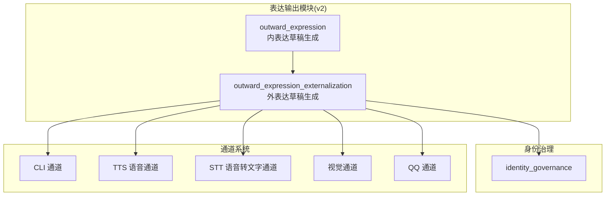
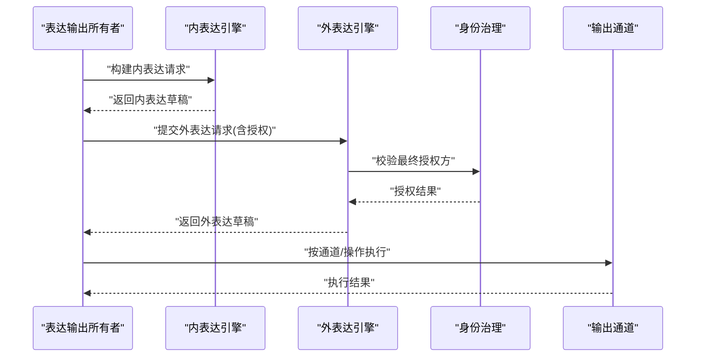
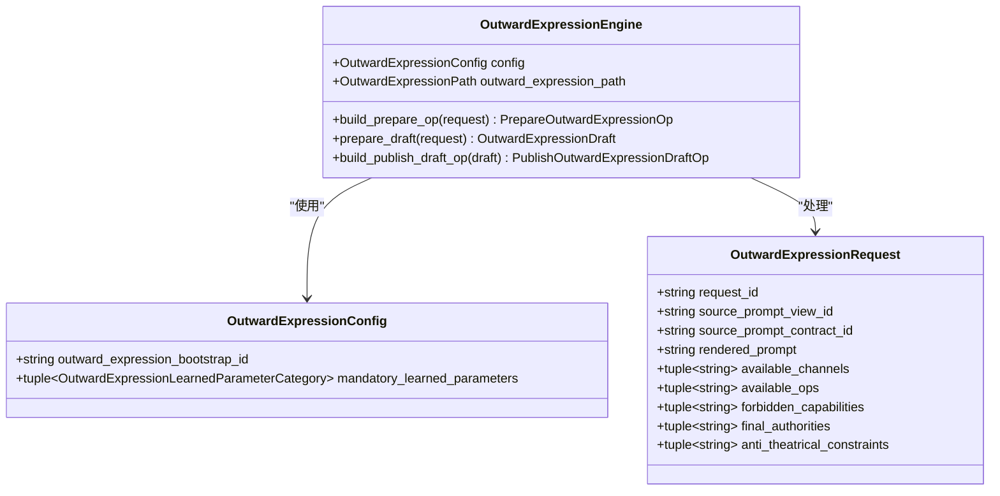
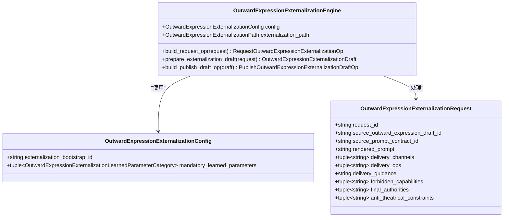
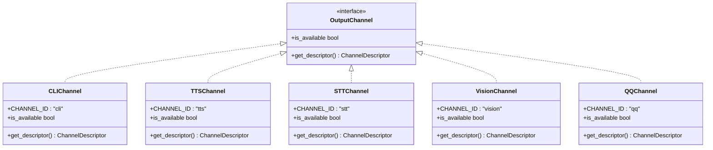
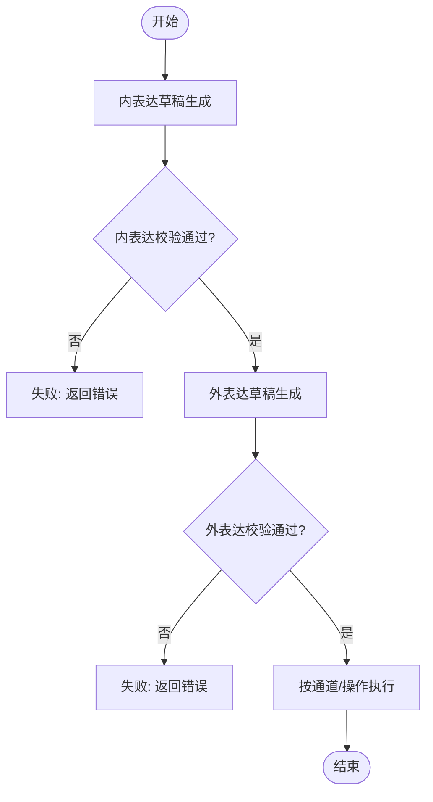
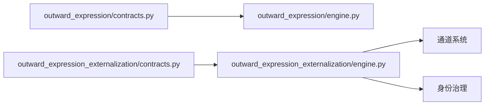

# 表达输出模块接口

<cite>
**本文档引用的文件**
- [helios_v2/outward_expression/contracts.py](file://helios_v2/src/helios_v2/outward_expression/contracts.py)
- [helios_v2/outward_expression/engine.py](file://helios_v2/src/helios_v2/outward_expression/engine.py)
- [helios_v2/outward_expression/__init__.py](file://helios_v2/src/helios_v2/outward_expression/__init__.py)
- [helios_v2/outward_expression_externalization/contracts.py](file://helios_v2/src/helios_v2/outward_expression_externalization/contracts.py)
- [helios_v2/outward_expression_externalization/engine.py](file://helios_v2/src/helios_v2/outward_expression_externalization/engine.py)
- [helios_v2/outward_expression_externalization/__init__.py](file://helios_v2/src/helios_v2/outward_expression_externalization/__init__.py)
- [helios_v2/tests/test_outward_expression_contracts.py](file://helios_v2/tests/test_outward_expression_contracts.py)
- [helios_v2/tests/test_outward_expression_engine.py](file://helios_v2/tests/test_outward_expression_engine.py)
- [helios_v2/tests/test_outward_expression_externalization_contracts.py](file://helios_v2/tests/test_outward_expression_externalization_contracts.py)
- [helios_v2/tests/test_outward_expression_externalization_engine.py](file://helios_v2/tests/test_outward_expression_externalization_engine.py)
- [archive/helios_v1/helios_io/expression_modulation.py](file://archive/helios_v1/helios_io/expression_modulation.py)
- [archive/helios_v1/helios_io/channels/tts_channel.py](file://archive/helios_v1/helios_io/channels/tts_channel.py)
- [archive/helios_v1/helios_io/channels/vision_channel.py](file://archive/helios_v1/helios_io/channels/vision_channel.py)
- [archive/helios_v1/helios_io/channels/stt_channel.py](file://archive/helios_v1/helios_io/channels/stt_channel.py)
- [archive/helios_v1/helios_io/channels/cli_channel.py](file://archive/helios_v1/helios_io/channels/cli_channel.py)
- [archive/helios_v1/helios_io/channels/qq_channel.py](file://archive/helios_v1/helios_io/channels/qq_channel.py)
- [archive/helios_v1/docs/requirements/12-prompt-metric-and-channel-context-contract/task.md](file://archive/helios_v1/docs/requirements/12-prompt-metric-and-channel-context-contract/task.md)
- [archive/helios_v1/docs/requirements/13-terminal-cli-channel/design.md](file://archive/helios_v1/docs/requirements/13-terminal-cli-channel/design.md)
</cite>

## 目录
1. [简介](#简介)
2. [项目结构](#项目结构)
3. [核心组件](#核心组件)
4. [架构总览](#架构总览)
5. [详细组件分析](#详细组件分析)
6. [依赖关系分析](#依赖关系分析)
7. [性能考虑](#性能考虑)
8. [故障排除指南](#故障排除指南)
9. [结论](#结论)
10. [附录](#附录)

## 简介
本文件面向表达输出模块的接口API文档，聚焦于语言生成、非语言表达与多模态输出的接口定义与协议规范。文档从两个维度展开：表达内容组织（如何将内部状态转化为可执行的表达草稿）、风格控制与质量评估（通过策略参数与边界约束保障输出一致性与安全性）。同时，文档阐述表达输出与动作外化、身份治理的接口协调机制，并给出用户体验优化建议与具体输出格式规范。

## 项目结构
表达输出模块在v2版本中分为两层：
- 内表达阶段（outward_expression）：负责将prompt合同与内部状态转化为表达草稿，包含学习参数类别与发布策略。
- 外表达阶段（outward_expression_externalization）：在获得最终授权后，将内表达草稿转换为可交付的外部化草稿，明确交付通道、操作与执行边界。

图表来源
- [helios_v2/src/helios_v2/outward_expression/contracts.py:1-46](file://helios_v2/src/helios_v2/outward_expression/contracts.py#L1-L46)
- [helios_v2/src/helios_v2/outward_expression_externalization/contracts.py:1-77](file://helios_v2/src/helios_v2/outward_expression_externalization/contracts.py#L1-L77)
- [archive/helios_v1/helios_io/channels/cli_channel.py:1-97](file://archive/helios_v1/helios_io/channels/cli_channel.py#L1-L97)
- [archive/helios_v1/helios_io/channels/tts_channel.py:1-97](file://archive/helios_v1/helios_io/channels/tts_channel.py#L1-L97)
- [archive/helios_v1/helios_io/channels/stt_channel.py:1-97](file://archive/helios_v1/helios_io/channels/stt_channel.py#L1-L97)
- [archive/helios_v1/helios_io/channels/vision_channel.py:1-97](file://archive/helios_v1/helios_io/channels/vision_channel.py#L1-L97)
- [archive/helios_v1/helios_io/channels/qq_channel.py:1-97](file://archive/helios_v1/helios_io/channels/qq_channel.py#L1-L97)

章节来源
- [helios_v2/src/helios_v2/outward_expression/contracts.py:1-46](file://helios_v2/src/helios_v2/outward_expression/contracts.py#L1-L46)
- [helios_v2/src/helios_v2/outward_expression_externalization/contracts.py:1-77](file://helios_v2/src/helios_v2/outward_expression_externalization/contracts.py#L1-L77)

## 核心组件
- 内表达配置与请求契约：定义表达生成所需的初始化标识与学习参数类别集合，以及不可变的请求输入。
- 外表达配置与请求契约：定义外表达草稿生成所需的策略参数类别集合、不可变请求输入及最终授权方。
- 引擎与路径：提供草稿准备、发布操作构建与外部化草稿生成的实现。
- 通道系统：提供文本、语音、视觉等多模态输出通道的描述与能力声明。

章节来源
- [helios_v2/src/helios_v2/outward_expression/contracts.py:37-46](file://helios_v2/src/helios_v2/outward_expression/contracts.py#L37-L46)
- [helios_v2/src/helios_v2/outward_expression/contracts.py:58-72](file://helios_v2/src/helios_v2/outward_expression/contracts.py#L58-L72)
- [helios_v2/src/helios_v2/outward_expression_externalization/contracts.py:38-56](file://helios_v2/src/helios_v2/outward_expression_externalization/contracts.py#L38-L56)
- [helios_v2/src/helios_v2/outward_expression_externalization/contracts.py:58-72](file://helios_v2/src/helios_v2/outward_expression_externalization/contracts.py#L58-L72)
- [helios_v2/src/helios_v2/outward_expression/engine.py:75-105](file://helios_v2/src/helios_v2/outward_expression/engine.py#L75-L105)
- [helios_v2/src/helios_v2/outward_expression_externalization/engine.py:83-120](file://helios_v2/src/helios_v2/outward_expression_externalization/engine.py#L83-L120)

## 架构总览
表达输出的端到端流程包括：内表达草稿生成、外表达草稿生成、通道选择与执行、身份治理与边界控制。下图展示了关键交互：

图表来源
- [helios_v2/src/helios_v2/outward_expression/engine.py:75-105](file://helios_v2/src/helios_v2/outward_expression/engine.py#L75-L105)
- [helios_v2/src/helios_v2/outward_expression_externalization/engine.py:83-120](file://helios_v2/src/helios_v2/outward_expression_externalization/engine.py#L83-L120)
- [helios_v2/src/helios_v2/outward_expression_externalization/contracts.py:58-72](file://helios_v2/src/helios_v2/outward_expression_externalization/contracts.py#L58-L72)

## 详细组件分析

### 内表达接口（outward_expression）
内表达负责将prompt合同与内部状态转化为表达草稿，包含以下关键要素：
- 配置契约：声明外表达的引导标识与必须的学习参数类别集合。
- 请求契约：不可变输入，包含请求ID、来源草稿ID、来源合同ID、渲染后的提示词、可用通道、可用操作、禁止能力、最终授权方、反剧场约束等。
- 引擎：提供草稿准备操作构建与草稿生成方法；支持发布草稿操作构建。

图表来源
- [helios_v2/src/helios_v2/outward_expression/contracts.py:37-46](file://helios_v2/src/helios_v2/outward_expression/contracts.py#L37-L46)
- [helios_v2/src/helios_v2/outward_expression/contracts.py:58-72](file://helios_v2/src/helios_v2/outward_expression/contracts.py#L58-L72)
- [helios_v2/src/helios_v2/outward_expression/engine.py:75-105](file://helios_v2/src/helios_v2/outward_expression/engine.py#L75-L105)

章节来源
- [helios_v2/src/helios_v2/outward_expression/contracts.py:1-46](file://helios_v2/src/helios_v2/outward_expression/contracts.py#L1-L46)
- [helios_v2/src/helios_v2/outward_expression/engine.py:75-105](file://helios_v2/src/helios_v2/outward_expression/engine.py#L75-L105)
- [helios_v2/tests/test_outward_expression_contracts.py:15-21](file://helios_v2/tests/test_outward_expression_contracts.py#L15-L21)
- [helios_v2/tests/test_outward_expression_engine.py:1-34](file://helios_v2/tests/test_outward_expression_engine.py#L1-L34)

### 外表达接口（outward_expression_externalization）
外表达在获得最终授权后，将内表达草稿转换为可交付的外部化草稿，包含以下关键要素：
- 配置契约：声明外表达引导标识与必须的学习参数类别集合（包含包膜渲染策略、交付选择策略、执行边界策略）。
- 请求契约：不可变输入，包含请求ID、来源草稿ID、来源合同ID、渲染提示词、候选通道、候选操作、交付指导、禁止能力、最终授权方、反剧场约束等。
- 引擎：提供请求操作构建、外部化草稿生成与发布操作构建；路径负责将请求转换为外部化草稿。

图表来源
- [helios_v2/src/helios_v2/outward_expression_externalization/contracts.py:38-56](file://helios_v2/src/helios_v2/outward_expression_externalization/contracts.py#L38-L56)
- [helios_v2/src/helios_v2/outward_expression_externalization/contracts.py:58-72](file://helios_v2/src/helios_v2/outward_expression_externalization/contracts.py#L58-L72)
- [helios_v2/src/helios_v2/outward_expression_externalization/engine.py:83-120](file://helios_v2/src/helios_v2/outward_expression_externalization/engine.py#L83-L120)

章节来源
- [helios_v2/src/helios_v2/outward_expression_externalization/contracts.py:1-77](file://helios_v2/src/helios_v2/outward_expression_externalization/contracts.py#L1-L77)
- [helios_v2/src/helios_v2/outward_expression_externalization/engine.py:1-120](file://helios_v2/src/helios_v2/outward_expression_externalization/engine.py#L1-L120)
- [helios_v2/tests/test_outward_expression_externalization_contracts.py:15-33](file://helios_v2/tests/test_outward_expression_externalization_contracts.py#L15-L33)
- [helios_v2/tests/test_outward_expression_externalization_engine.py:1-34](file://helios_v2/tests/test_outward_expression_externalization_engine.py#L1-L34)

### 多模态输出通道接口
通道系统提供统一的描述、生命周期管理与操作规范，支持文本、语音、视觉等多模态输出：
- CLI通道：文本交互入口，支持消息发送与管理操作。
- TTS通道：文本转语音合成与播放，支持语音参数与播放控制。
- STT通道：语音转文本识别，支持音频输入与文本输出。
- 视觉通道：图像/视频输入与处理，支持多媒体输出。
- QQ通道：即时通讯通道，支持消息发送与接收。

图表来源
- [archive/helios_v1/helios_io/channels/cli_channel.py:1-97](file://archive/helios_v1/helios_io/channels/cli_channel.py#L1-L97)
- [archive/helios_v1/helios_io/channels/tts_channel.py:1-97](file://archive/helios_v1/helios_io/channels/tts_channel.py#L1-L97)
- [archive/helios_v1/helios_io/channels/stt_channel.py:1-97](file://archive/helios_v1/helios_io/channels/stt_channel.py#L1-L97)
- [archive/helios_v1/helios_io/channels/vision_channel.py:1-97](file://archive/helios_v1/helios_io/channels/vision_channel.py#L1-L97)
- [archive/helios_v1/helios_io/channels/qq_channel.py:1-97](file://archive/helios_v1/helios_io/channels/qq_channel.py#L1-L97)

章节来源
- [archive/helios_v1/helios_io/channels/cli_channel.py:75-97](file://archive/helios_v1/helios_io/channels/cli_channel.py#L75-L97)
- [archive/helios_v1/helios_io/channels/tts_channel.py:75-97](file://archive/helios_v1/helios_io/channels/tts_channel.py#L75-L97)
- [archive/helios_v1/helios_io/channels/stt_channel.py:1-97](file://archive/helios_v1/helios_io/channels/stt_channel.py#L1-L97)
- [archive/helios_v1/helios_io/channels/vision_channel.py:1-97](file://archive/helios_v1/helios_io/channels/vision_channel.py#L1-L97)
- [archive/helios_v1/helios_io/channels/qq_channel.py:1-97](file://archive/helios_v1/helios_io/channels/qq_channel.py#L1-L97)

### 表达内容组织与风格控制协议
- 内表达草稿：由内表达引擎根据请求与配置生成，包含交付指导、禁止能力、最终授权方与反剧场约束等元信息，确保表达在边界内可控。
- 外表达草稿：在外表达引擎中，基于内表达草稿与外表达策略生成，明确交付通道与操作集合，并附加执行边界摘要。
- 学习参数类别：内表达与外表达分别定义了各自的学习参数类别集合，用于指导策略决策与边界控制。

图表来源
- [helios_v2/src/helios_v2/outward_expression/engine.py:75-105](file://helios_v2/src/helios_v2/outward_expression/engine.py#L75-L105)
- [helios_v2/src/helios_v2/outward_expression_externalization/engine.py:103-120](file://helios_v2/src/helios_v2/outward_expression_externalization/engine.py#L103-L120)

章节来源
- [helios_v2/src/helios_v2/outward_expression/contracts.py:24-28](file://helios_v2/src/helios_v2/outward_expression/contracts.py#L24-L28)
- [helios_v2/src/helios_v2/outward_expression_externalization/contracts.py:25-29](file://helios_v2/src/helios_v2/outward_expression_externalization/contracts.py#L25-L29)

### 质量评估与边界控制
- 最终授权方：外表达请求包含final_authorities字段，确保只有被授权的主体才能触发最终执行。
- 禁止能力：通过forbidden_capabilities字段限制可能越界的能力，如直接执行或发明通道。
- 反剧场约束：anti_theatrical_constraints用于避免表演式或不真实的表达行为。
- 执行边界摘要：外表达草稿包含execution_boundary_summary，帮助通道侧进行安全执行。

章节来源
- [helios_v2/src/helios_v2/outward_expression/contracts.py:68-72](file://helios_v2/src/helios_v2/outward_expression/contracts.py#L68-L72)
- [helios_v2/src/helios_v2/outward_expression_externalization/contracts.py:68-72](file://helios_v2/src/helios_v2/outward_expression_externalization/contracts.py#L68-L72)
- [helios_v2/src/helios_v2/outward_expression_externalization/engine.py:62-80](file://helios_v2/src/helios_v2/outward_expression_externalization/engine.py#L62-L80)

### 输出格式规范
- 文本通道（CLI）：以纯文本形式输出，遵循通道描述中的输入/输出格式与操作模式。
- 语音通道（TTS）：输出音频播放或语音文本，支持语音参数与强度调节。
- 语音转文字（STT）：接收音频输入并输出文本，支持多种音频格式。
- 视觉通道：支持图像/视频输入与处理，输出多媒体内容。
- 即时通讯（QQ）：支持消息发送与接收，遵循通道描述中的schema。

章节来源
- [archive/helios_v1/helios_io/channels/cli_channel.py:75-97](file://archive/helios_v1/helios_io/channels/cli_channel.py#L75-L97)
- [archive/helios_v1/helios_io/channels/tts_channel.py:75-97](file://archive/helios_v1/helios_io/channels/tts_channel.py#L75-L97)
- [archive/helios_v1/helios_io/channels/stt_channel.py:1-97](file://archive/helios_v1/helios_io/channels/stt_channel.py#L1-L97)
- [archive/helios_v1/helios_io/channels/vision_channel.py:1-97](file://archive/helios_v1/helios_io/channels/vision_channel.py#L1-L97)
- [archive/helios_v1/helios_io/channels/qq_channel.py:1-97](file://archive/helios_v1/helios_io/channels/qq_channel.py#L1-L97)

### 表达输出与动作外化、身份治理的接口协调
- 动作外化契约：外表达阶段引入final_authorities与forbidden_capabilities，确保动作提案在身份治理框架下得到最终确认与安全执行。
- 身份治理集成：外表达引擎在生成外部化草稿前，需经过身份治理的授权校验，防止越权执行。
- 用户体验优化：通过交付指导（delivery_guidance）与通道/操作集合（candidate_channels/candidate_ops）提升交互透明度与可控性。

章节来源
- [archive/helios_v1/docs/requirements/12-prompt-metric-and-channel-context-contract/task.md:77-93](file://archive/helios_v1/docs/requirements/12-prompt-metric-and-channel-context-contract/task.md#L77-L93)
- [archive/helios_v1/docs/requirements/13-terminal-cli-channel/design.md:1-97](file://archive/helios_v1/docs/requirements/13-terminal-cli-channel/design.md#L1-L97)
- [helios_v2/src/helios_v2/outward_expression_externalization/contracts.py:68-72](file://helios_v2/src/helios_v2/outward_expression_externalization/contracts.py#L68-L72)

## 依赖关系分析
表达输出模块的依赖关系如下：
- 内表达依赖外表达策略参数类别与请求契约。
- 外表达依赖身份治理授权与通道能力描述。
- 通道系统提供统一的描述与生命周期管理，便于动态注册与调度。

图表来源
- [helios_v2/src/helios_v2/outward_expression/contracts.py:1-46](file://helios_v2/src/helios_v2/outward_expression/contracts.py#L1-L46)
- [helios_v2/src/helios_v2/outward_expression/engine.py:75-105](file://helios_v2/src/helios_v2/outward_expression/engine.py#L75-L105)
- [helios_v2/src/helios_v2/outward_expression_externalization/contracts.py:1-77](file://helios_v2/src/helios_v2/outward_expression_externalization/contracts.py#L1-L77)
- [helios_v2/src/helios_v2/outward_expression_externalization/engine.py:83-120](file://helios_v2/src/helios_v2/outward_expression_externalization/engine.py#L83-L120)

章节来源
- [helios_v2/src/helios_v2/outward_expression/__init__.py:1-29](file://helios_v2/src/helios_v2/outward_expression/__init__.py#L1-L29)
- [helios_v2/src/helios_v2/outward_expression_externalization/__init__.py:1-29](file://helios_v2/src/helios_v2/outward_expression_externalization/__init__.py#L1-L29)

## 性能考虑
- 草稿生成的确定性：外表达路径要求从验证后的请求生成确定性的外部化草稿，减少重复计算与不确定性。
- 通道选择与调度：通过候选通道与操作集合，结合交付指导，降低无效尝试与资源浪费。
- 授权前置：在生成外部化草稿前进行授权校验，避免后续执行阶段的回滚成本。

## 故障排除指南
- 配置校验失败：当学习参数类别不完整或引导标识为空时，抛出外表达错误，需检查配置契约。
- 请求不可变性：请求对象为冻结数据类，任何修改都会导致异常，需通过操作构建器生成新请求。
- 通道不可用：通道的可用性受启用状态与可用性标志影响，需检查通道状态与配置。
- 授权失败：若final_authorities未满足，外表达草稿生成将被拒绝，需确认身份治理授权链路。

章节来源
- [helios_v2/src/helios_v2/outward_expression_externalization/contracts.py:47-55](file://helios_v2/src/helios_v2/outward_expression_externalization/contracts.py#L47-L55)
- [helios_v2/src/helios_v2/outward_expression_externalization/contracts.py:73-72](file://helios_v2/src/helios_v2/outward_expression_externalization/contracts.py#L73-L72)
- [archive/helios_v1/helios_io/channels/tts_channel.py:71-74](file://archive/helios_v1/helios_io/channels/tts_channel.py#L71-L74)

## 结论
表达输出模块通过内表达与外表达的分层设计，实现了从内部状态到多模态输出的安全、可控与可评估的转化。借助学习参数类别、最终授权方与禁止能力等机制，模块在保证表达质量的同时，强化了身份治理与边界控制。配合通道系统的统一描述与生命周期管理，模块能够灵活适配不同输出场景并优化用户体验。

## 附录
- 表达生成示例（路径参考）：
  - 内表达草稿生成：[helios_v2/tests/test_outward_expression_engine.py:1-34](file://helios_v2/tests/test_outward_expression_engine.py#L1-L34)
  - 外表达草稿生成：[helios_v2/tests/test_outward_expression_externalization_engine.py:25-34](file://helios_v2/tests/test_outward_expression_externalization_engine.py#L25-L34)
- 输出格式示例（路径参考）：
  - CLI通道描述与能力：[archive/helios_v1/helios_io/channels/cli_channel.py:75-97](file://archive/helios_v1/helios_io/channels/cli_channel.py#L75-L97)
  - TTS通道描述与能力：[archive/helios_v1/helios_io/channels/tts_channel.py:75-97](file://archive/helios_v1/helios_io/channels/tts_channel.py#L75-L97)