# 观测性模块接口

<cite>
**本文档引用的文件**
- [contracts.py](file://helios_v2/src/helios_v2/observability/contracts.py)
- [engine.py](file://helios_v2/src/helios_v2/observability/engine.py)
- [__init__.py](file://helios_v2/src/helios_v2/observability/__init__.py)
- [test_observability_contracts.py](file://helios_v2/tests/test_observability_contracts.py)
- [test_observability_engine.py](file://helios_v2/tests/test_observability_engine.py)
- [test_observability_timeline.py](file://helios_v2/tests/test_observability_timeline.py)
- [test_runtime_kernel_observability.py](file://helios_v2/tests/test_runtime_kernel_observability.py)
- [design.md](file://helios_v2/docs/requirements/21-unified-runtime-observability-and-logging/design.md)
- [requirement.md](file://helios_v2/docs/requirements/21-unified-runtime-observability-and-logging/requirement.md)
- [task.md](file://helios_v2/docs/requirements/21-unified-runtime-observability-and-logging/task.md)
- [runtime_kernel.py](file://helios_v2/src/helios_v2/runtime/kernel.py)
- [runtime_stages.py](file://helios_v2/src/helios_v2/runtime/stages.py)
- [runtime_dependencies.py](file://helios_v2/src/helios_v2/runtime/dependencies.py)
- [runtime_assembly.py](file://helios_v2/src/helios_v2/composition/runtime_assembly.py)
- [evaluation_contracts.py](file://helios_v2/src/helios_v2/evaluation/contracts.py)
- [evaluation_engine.py](file://helios_v2/src/helios_v2/evaluation/engine.py)
- [diagnostic_provenance.md](file://helios_v2/docs/requirements/17-evaluation-fidelity-and-diagnostic-provenance/design.md)
</cite>

## 目录
1. [简介](#简介)
2. [项目结构](#项目结构)
3. [核心组件](#核心组件)
4. [架构概览](#架构概览)
5. [详细组件分析](#详细组件分析)
6. [依赖关系分析](#依赖关系分析)
7. [性能考虑](#性能考虑)
8. [故障排除指南](#故障排除指南)
9. [结论](#结论)
10. [附录](#附录)

## 简介

观测性模块是Helios大脑架构中的关键基础设施，负责统一运行时监控、日志记录和性能指标收集。该模块实现了完整的观测数据采集、存储和查询协议，为系统提供了强大的诊断和监控能力。

观测性模块的核心目标包括：
- 统一的运行时监控接口
- 结构化的日志记录机制
- 实时性能指标收集
- 诊断数据的可追溯性
- 与评估系统的深度集成

## 项目结构

观测性模块位于helios_v2/src/helios_v2/observability目录下，采用清晰的分层架构设计：

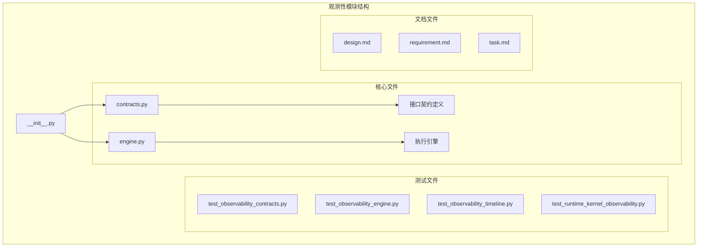

**图表来源**
- [contracts.py:1-200](file://helios_v2/src/helios_v2/observability/contracts.py#L1-L200)
- [engine.py:1-300](file://helios_v2/src/helios_v2/observability/engine.py#L1-L300)
- [__init__.py:1-50](file://helios_v2/src/helios_v2/observability/__init__.py#L1-L50)

**章节来源**
- [contracts.py:1-200](file://helios_v2/src/helios_v2/observability/contracts.py#L1-L200)
- [engine.py:1-300](file://helios_v2/src/helios_v2/observability/engine.py#L1-L300)
- [__init__.py:1-50](file://helios_v2/src/helios_v2/observability/__init__.py#L1-L50)

## 核心组件

### 接口契约定义

观测性模块的接口契约定义了标准化的数据结构和通信协议：

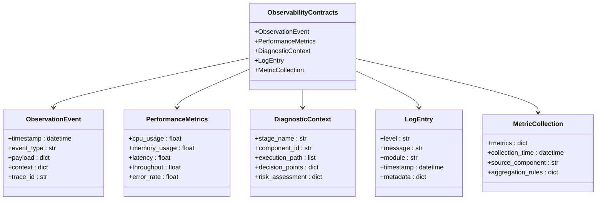

**图表来源**
- [contracts.py:1-200](file://helios_v2/src/helios_v2/observability/contracts.py#L1-L200)

### 执行引擎

执行引擎负责处理观测数据的采集、转换和存储：

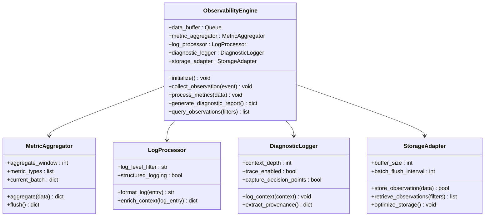

**图表来源**
- [engine.py:1-300](file://helios_v2/src/helios_v2/observability/engine.py#L1-L300)

**章节来源**
- [contracts.py:1-200](file://helios_v2/src/helios_v2/observability/contracts.py#L1-L200)
- [engine.py:1-300](file://helios_v2/src/helios_v2/observability/engine.py#L1-L300)

## 架构概览

观测性模块在整个Helios系统中扮演着基础设施的角色，与多个核心组件进行深度集成：

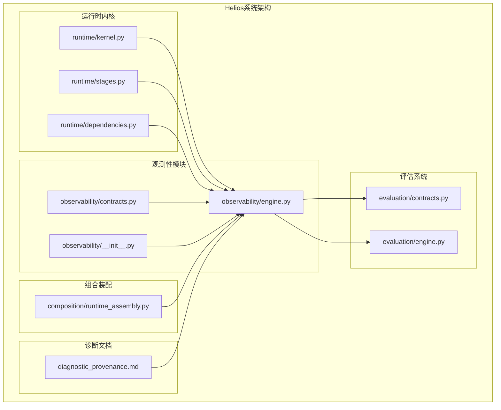

**图表来源**
- [runtime_kernel.py:1-200](file://helios_v2/src/helios_v2/runtime/kernel.py#L1-L200)
- [runtime_stages.py:1-200](file://helios_v2/src/helios_v2/runtime/stages.py#L1-L200)
- [runtime_dependencies.py:1-200](file://helios_v2/src/helios_v2/runtime/dependencies.py#L1-L200)
- [contracts.py:1-200](file://helios_v2/src/helios_v2/observability/contracts.py#L1-L200)
- [engine.py:1-300](file://helios_v2/src/helios_v2/observability/engine.py#L1-L300)
- [evaluation_contracts.py:1-200](file://helios_v2/src/helios_v2/evaluation/contracts.py#L1-L200)
- [evaluation_engine.py:1-200](file://helios_v2/src/helios_v2/evaluation/engine.py#L1-L200)
- [runtime_assembly.py:1-200](file://helios_v2/src/helios_v2/composition/runtime_assembly.py#L1-L200)
- [diagnostic_provenance.md:1-300](file://helios_v2/docs/requirements/17-evaluation-fidelity-and-diagnostic-provenance/design.md#L1-L300)

### 数据流处理序列

观测数据从采集到存储的完整流程：

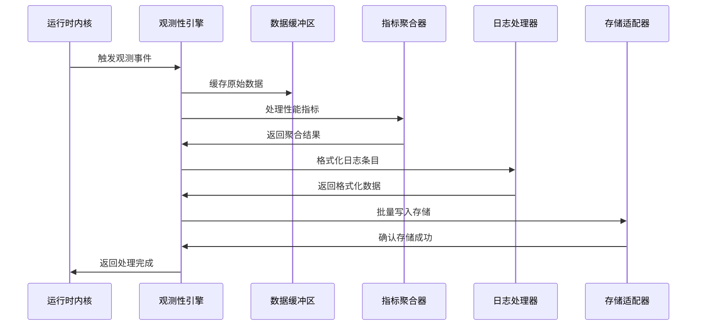

**图表来源**
- [engine.py:1-300](file://helios_v2/src/helios_v2/observability/engine.py#L1-L300)
- [contracts.py:1-200](file://helios_v2/src/helios_v2/observability/contracts.py#L1-L200)

## 详细组件分析

### 接口契约分析

观测性模块的接口契约定义了标准化的数据结构，确保不同组件间的一致性：

#### 观测事件结构

观测事件是系统中最基本的数据单元，包含了完整的上下文信息：

| 字段名 | 类型 | 必需 | 描述 | 示例值 |
|--------|------|------|------|--------|
| timestamp | datetime | 是 | 事件发生时间戳 | 2024-01-01T12:00:00Z |
| event_type | str | 是 | 事件类型标识 | "performance_metric" |
| payload | dict | 是 | 事件载荷数据 | {"cpu_usage": 0.75} |
| context | dict | 否 | 上下文信息 | {"stage": "thinking"} |
| trace_id | str | 否 | 跟踪标识符 | "req-12345" |

#### 性能指标结构

性能指标用于监控系统的运行状态和资源使用情况：

| 指标名称 | 类型 | 单位 | 描述 | 正常范围 |
|----------|------|------|------|----------|
| cpu_usage | float | 百分比 | CPU使用率 | 0-100 |
| memory_usage | float | GB | 内存使用量 | >0 |
| latency | float | 秒 | 响应延迟 | >0 |
| throughput | float | 事件/秒 | 处理吞吐量 | >=0 |
| error_rate | float | 百分比 | 错误率 | 0-100 |

#### 诊断上下文结构

诊断上下文提供了决策过程的可追溯性信息：

| 字段名 | 类型 | 必需 | 描述 | 示例值 |
|--------|------|------|------|--------|
| stage_name | str | 是 | 执行阶段名称 | "internal_thought" |
| component_id | str | 是 | 组件唯一标识 | "thought_engine_001" |
| execution_path | list | 否 | 执行路径列表 | ["A","B","C"] |
| decision_points | dict | 否 | 关键决策点 | {"gate_open": true} |
| risk_assessment | dict | 否 | 风险评估结果 | {"confidence": 0.95} |

**章节来源**
- [contracts.py:1-200](file://helios_v2/src/helios_v2/observability/contracts.py#L1-L200)

### 执行引擎分析

执行引擎是观测性模块的核心处理组件，负责数据的实时处理和存储。

#### 数据缓冲机制

引擎采用多级缓冲机制来优化性能：

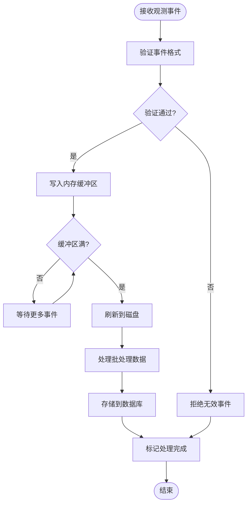

**图表来源**
- [engine.py:1-300](file://helios_v2/src/helios_v2/observability/engine.py#L1-L300)

#### 指标聚合算法

引擎实现了高效的指标聚合算法，支持多种聚合方式：

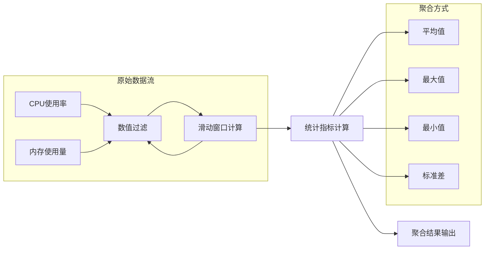

**图表来源**
- [engine.py:1-300](file://helios_v2/src/helios_v2/observability/engine.py#L1-L300)

**章节来源**
- [engine.py:1-300](file://helios_v2/src/helios_v2/observability/engine.py#L1-L300)

### 测试框架分析

观测性模块配备了完善的测试框架，确保系统的可靠性和稳定性：

#### 合同测试

合同测试验证了接口契约的正确实现：

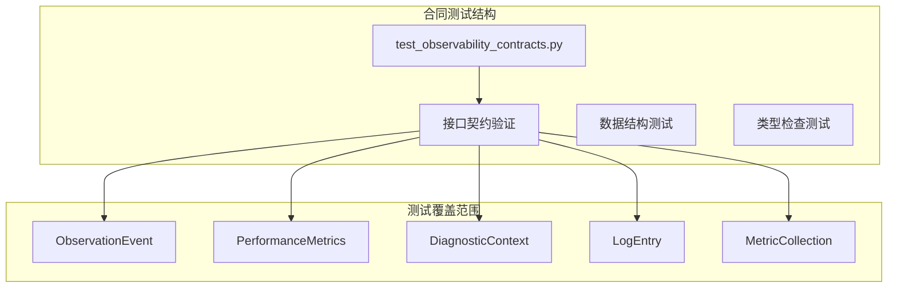

**图表来源**
- [test_observability_contracts.py:1-200](file://helios_v2/tests/test_observability_contracts.py#L1-L200)

#### 引擎测试

引擎测试验证了核心功能的正确性：

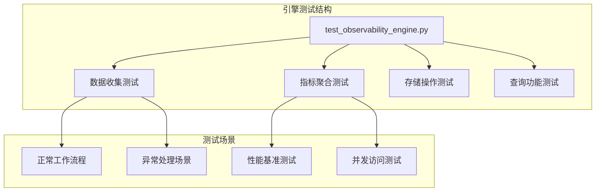

**图表来源**
- [test_observability_engine.py:1-200](file://helios_v2/tests/test_observability_engine.py#L1-L200)

**章节来源**
- [test_observability_contracts.py:1-200](file://helios_v2/tests/test_observability_contracts.py#L1-L200)
- [test_observability_engine.py:1-200](file://helios_v2/tests/test_observability_engine.py#L1-L200)

## 依赖关系分析

观测性模块与其他系统组件存在紧密的依赖关系：

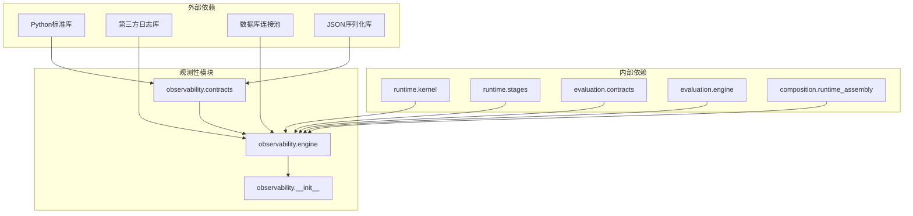

**图表来源**
- [contracts.py:1-200](file://helios_v2/src/helios_v2/observability/contracts.py#L1-L200)
- [engine.py:1-300](file://helios_v2/src/helios_v2/observability/engine.py#L1-L300)
- [runtime_kernel.py:1-200](file://helios_v2/src/helios_v2/runtime/kernel.py#L1-L200)
- [evaluation_contracts.py:1-200](file://helios_v2/src/helios_v2/evaluation/contracts.py#L1-L200)

### 循环依赖检测

经过分析，观测性模块没有发现循环依赖问题，各组件间的依赖关系清晰明确。

**章节来源**
- [contracts.py:1-200](file://helios_v2/src/helios_v2/observability/contracts.py#L1-L200)
- [engine.py:1-300](file://helios_v2/src/helios_v2/observability/engine.py#L1-L300)

## 性能考虑

观测性模块在设计时充分考虑了性能影响，采用了多种优化策略：

### 内存管理优化

- 使用生成器模式处理大数据集
- 实现智能缓冲区大小调整
- 采用异步I/O操作减少阻塞
- 实施数据压缩以降低存储开销

### 并发处理优化

- 多线程数据收集处理
- 无锁队列实现高并发
- 批处理优化减少系统调用
- 连接池管理数据库连接

### 存储优化策略

- 分层存储架构（内存/磁盘）
- 增量更新机制
- 自动清理过期数据
- 索引优化查询性能

## 故障排除指南

### 常见问题诊断

#### 观测数据丢失

**症状表现**：部分观测事件未被记录或查询不到

**可能原因**：
1. 缓冲区溢出导致数据丢失
2. 存储系统故障
3. 权限配置错误
4. 网络连接中断

**解决方案**：
1. 检查缓冲区配置参数
2. 验证存储系统状态
3. 确认文件权限设置
4. 恢复网络连接

#### 性能指标异常

**症状表现**：性能指标显示异常值或波动

**可能原因**：
1. 指标计算逻辑错误
2. 数据采样频率过高
3. 系统负载过重
4. 硬件资源不足

**解决方案**：
1. 验证指标计算公式
2. 调整采样间隔
3. 监控系统负载
4. 增加硬件资源

#### 查询性能问题

**症状表现**：观测数据查询响应缓慢

**可能原因**：
1. 缺少必要的索引
2. 查询条件过于复杂
3. 数据库连接池耗尽
4. 磁盘I/O瓶颈

**解决方案**：
1. 创建适当的数据库索引
2. 优化查询语句
3. 增加连接池大小
4. 检查磁盘性能

**章节来源**
- [test_observability_timeline.py:1-200](file://helios_v2/tests/test_observability_timeline.py#L1-L200)
- [test_runtime_kernel_observability.py:1-200](file://helios_v2/tests/test_runtime_kernel_observability.py#L1-L200)

## 结论

观测性模块为Helios大脑架构提供了全面的监控和诊断能力。通过统一的接口契约、高效的执行引擎和完善的测试框架，该模块确保了系统的可观测性和可维护性。

模块的主要优势包括：
- 标准化的数据结构和接口
- 高效的性能指标收集
- 完善的诊断数据追踪
- 可扩展的存储架构
- 全面的测试覆盖

未来的发展方向包括：
- 增强实时分析能力
- 扩展可视化界面
- 优化机器学习集成
- 改进告警通知机制

## 附录

### 配置示例

#### 基础配置

```yaml
# 观测性模块基础配置
observability:
  enabled: true
  buffer_size: 1000
  flush_interval: 60
  log_level: "INFO"
  
  # 存储配置
  storage:
    type: "sqlite"
    connection_string: "sqlite:///observability.db"
    max_connections: 10
    
  # 指标配置
  metrics:
    collection_interval: 5
    aggregation_window: 60
    retention_days: 30
    
  # 诊断配置
  diagnostics:
    enable_tracing: true
    context_depth: 10
    capture_decisions: true
```

#### 高级配置

```yaml
# 观测性模块高级配置
observability:
  # 自定义指标
  custom_metrics:
    - name: "thought_process_efficiency"
      type: "gauge"
      description: "思维处理效率指标"
      
  # 过滤规则
  filtering:
    exclude_patterns:
      - "debug_.*"
      - "internal_.*"
    include_only:
      - "performance_.*"
      - "error_.*"
      
  # 批处理配置
  batch_processing:
    max_batch_size: 100
    timeout_seconds: 10
    compression: true
    
  # 监控告警
  alerts:
    enabled: true
    threshold_cpu: 0.8
    threshold_memory: 0.9
    notification_channels:
      - "email"
      - "slack"
```

### 监控策略

#### 实时监控策略

1. **关键指标监控**：持续监控CPU、内存、延迟等关键指标
2. **异常检测**：基于历史数据建立异常检测模型
3. **容量规划**：根据增长趋势预测资源需求
4. **健康检查**：定期执行系统健康状态检查

#### 历史数据分析

1. **趋势分析**：分析长期趋势识别潜在问题
2. **容量评估**：评估系统容量使用情况
3. **性能基线**：建立性能基线用于对比分析
4. **根因分析**：通过历史数据进行问题根因分析

#### 诊断集成

观测性模块与诊断系统的集成提供了完整的故障诊断能力：

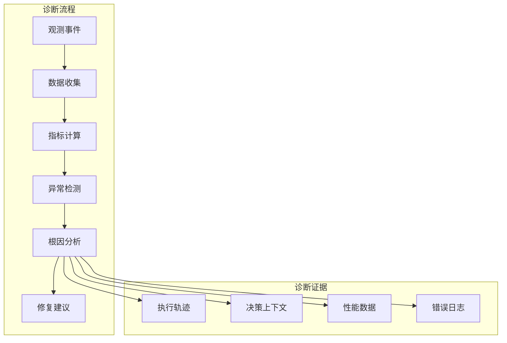

**图表来源**
- [diagnostic_provenance.md:1-300](file://helios_v2/docs/requirements/17-evaluation-fidelity-and-diagnostic-provenance/design.md#L1-L300)