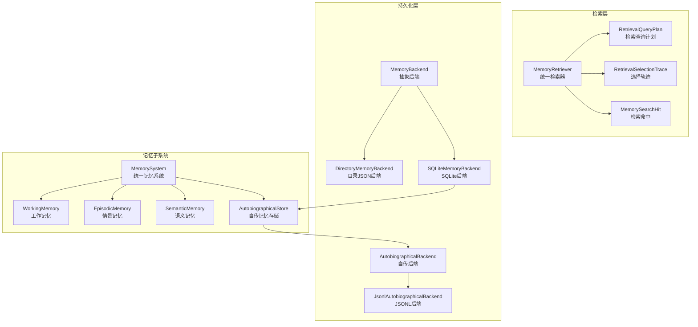
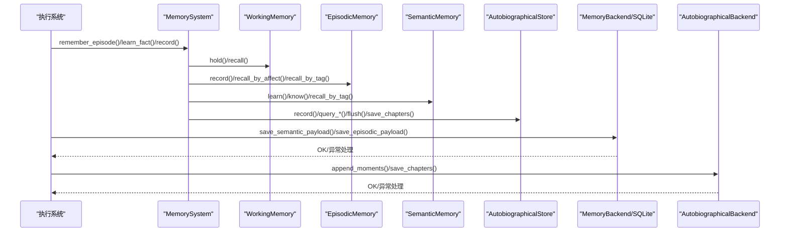
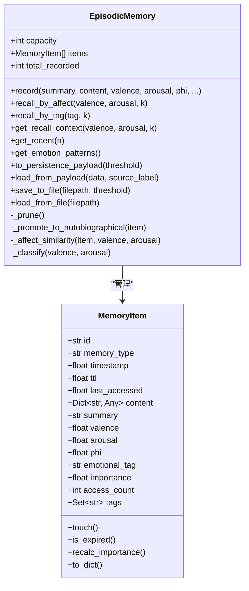
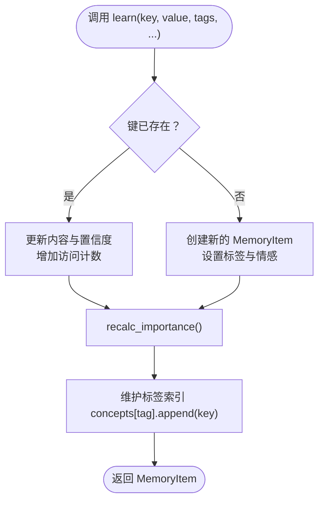
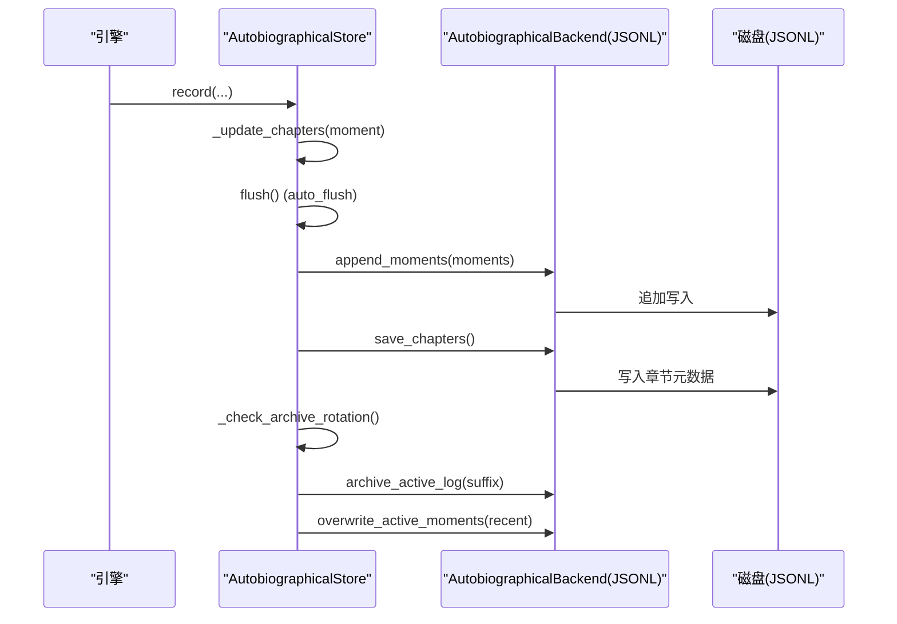
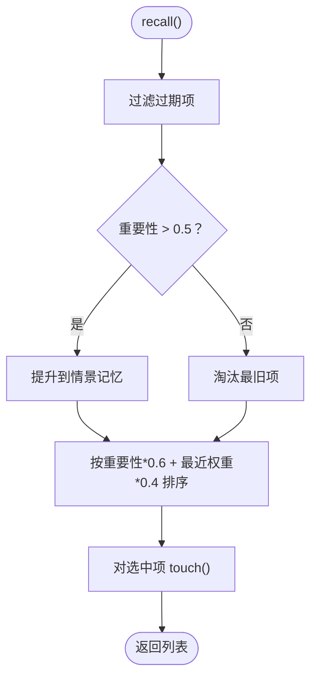
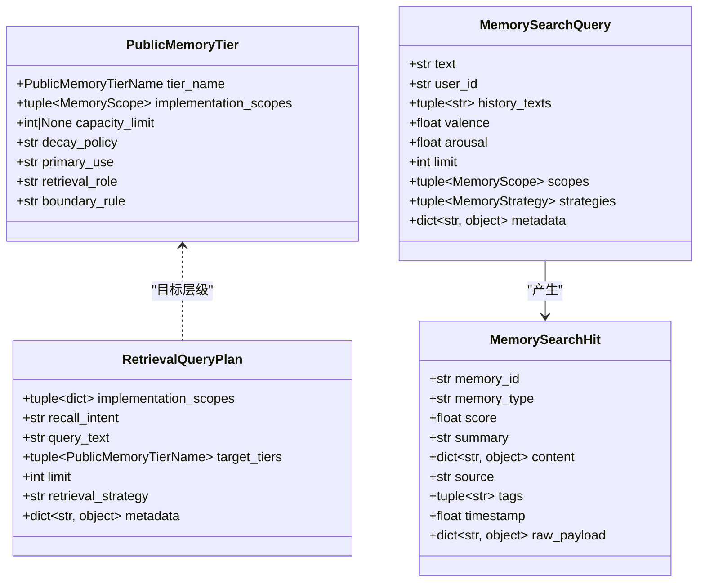
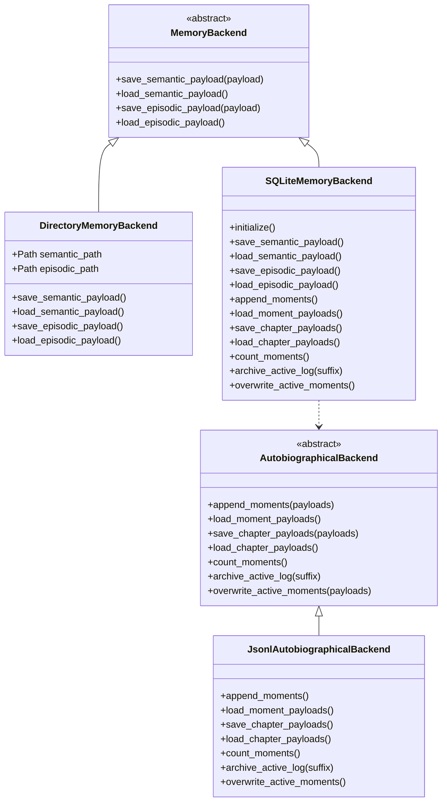
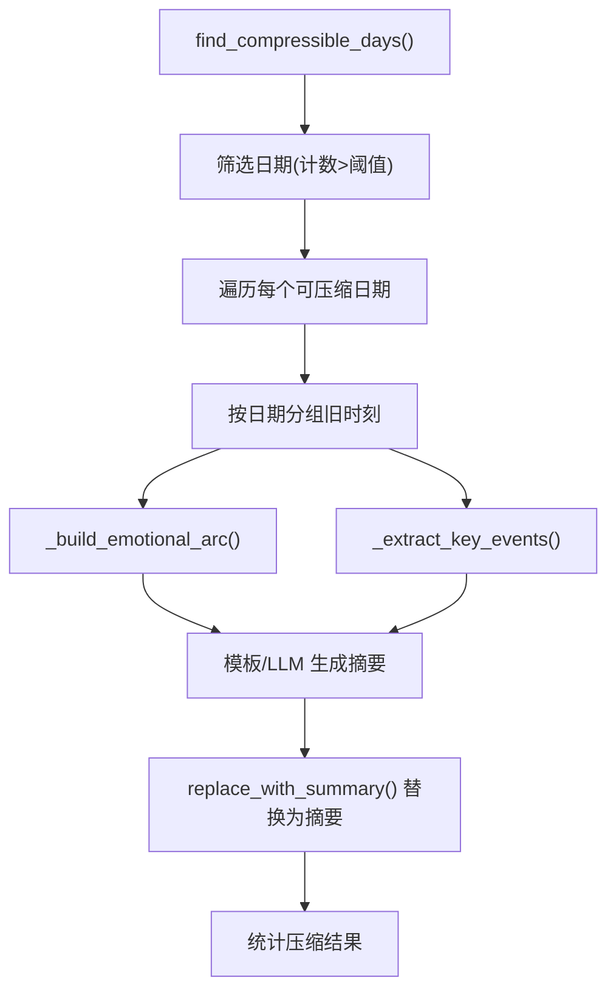
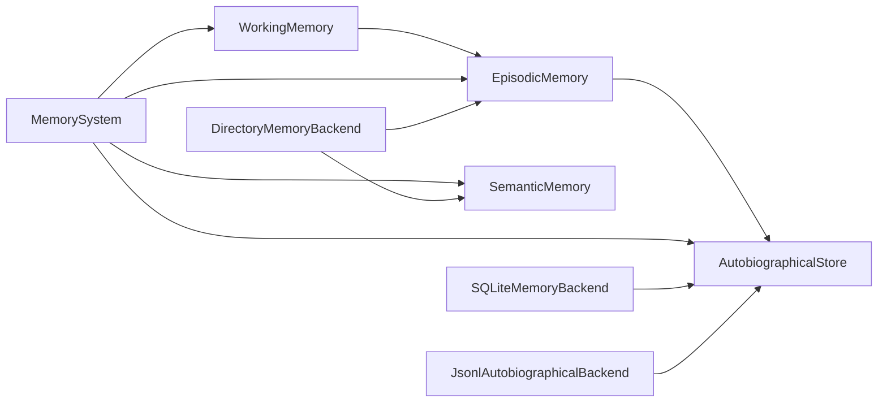

# 记忆模块接口

<cite>
**本文档引用的文件**
- [memory_system.py](file://archive/helios_v1/memory/memory_system.py)
- [backend.py](file://archive/helios_v1/memory/backend.py)
- [sqlite_backend.py](file://archive/helios_v1/memory/sqlite_backend.py)
- [retrieval.py](file://archive/helios_v1/memory/retrieval.py)
- [autobiographical.py](file://archive/helios_v1/memory/autobiographical.py)
- [memory_compressor.py](file://archive/helios_v1/memory/memory_compressor.py)
- [seed_memory_importer.py](file://archive/helios_v1/memory/seed_memory_importer.py)
- [emotional_memory.py](file://archive/helios_v1/memory/emotional_memory.py)
- [__init__.py](file://archive/helios_v1/memory/__init__.py)
</cite>

## 目录
1. [简介](#简介)
2. [项目结构](#项目结构)
3. [核心组件](#核心组件)
4. [架构总览](#架构总览)
5. [详细组件分析](#详细组件分析)
6. [依赖关系分析](#依赖关系分析)
7. [性能考量](#性能考量)
8. [故障排查指南](#故障排查指南)
9. [结论](#结论)
10. [附录](#附录)

## 简介
本文件为记忆模块的详细接口API文档，覆盖情景记忆（EpisodicMemory）、语义记忆（SemanticMemory）与自传记忆（AutobiographicalStore）的存储与检索接口，以及情感记忆（EmotionalEpisode）兼容类型。文档重点说明：
- 记忆编码与数据结构（MemoryItem、AutobiographicalMoment等）
- 持久化策略（目录JSON后端、SQLite后端、JSONL追加写入）
- 提取与检索策略（基于情感相似度、标签、时间范围、相关性）
- 记忆模块与评估、执行系统的接口契约与数据一致性保障

## 项目结构
记忆模块位于 archive/helios_v1/memory，主要文件职责如下：
- memory_system.py：统一记忆系统，包含工作记忆、情景记忆、语义记忆、自传记忆、检索器与巩固器
- backend.py：抽象持久化后端接口与目录JSON后端实现
- sqlite_backend.py：SQLite持久化后端，支持语义、情景与自传记忆
- retrieval.py：检索契约与数据结构（查询计划、命中结果、选择轨迹）
- autobiographical.py：自传记忆持久化存储（JSONL），章节管理与压缩
- memory_compressor.py：活动视图压缩工具
- seed_memory_importer.py：种子自传记忆导入器
- emotional_memory.py：情感记忆兼容类型
- __init__.py：对外导出兼容面

**图表来源**
- [memory_system.py:1-2343](file://archive/helios_v1/memory/memory_system.py#L1-L2343)
- [backend.py:1-180](file://archive/helios_v1/memory/backend.py#L1-L180)
- [sqlite_backend.py:1-351](file://archive/helios_v1/memory/sqlite_backend.py#L1-L351)
- [retrieval.py:1-165](file://archive/helios_v1/memory/retrieval.py#L1-L165)
- [autobiographical.py:1-709](file://archive/helios_v1/memory/autobiographical.py#L1-L709)

**章节来源**
- [__init__.py:1-70](file://archive/helios_v1/memory/__init__.py#L1-L70)

## 核心组件
- MemoryItem：记忆原子单元，包含身份、时间、内容、情感标签与元数据，提供重要性重算、过期判断与字典序列化
- WorkingMemory：工作记忆，环形缓冲+TTL，容量上限与重要性阈值触发情景记忆提升
- EpisodicMemory：情景记忆，情感相似度检索、标签过滤、容量修剪与自传记忆提升
- SemanticMemory：语义记忆，键值存储+标签索引，强度递增与全局衰减
- AutobiographicalStore：自传记忆持久化存储，JSONL追加写入、章节管理、压缩与归档
- MemoryBackend/DirectoryMemoryBackend/SQLiteMemoryBackend：语义与情景记忆的抽象与目录JSON/SQLite实现
- AutobiographicalBackend/JsonlAutobiographicalBackend：自传记忆抽象与JSONL实现
- RetrievalQueryPlan/MemorySearchHit/RetrievalSelectionTrace：检索契约与数据结构
- MemoryCompressor：活动视图压缩工具
- SeedMemoryImporter：种子自传记忆导入器
- EmotionalEpisode：情感记忆兼容类型

**章节来源**
- [memory_system.py:58-118](file://archive/helios_v1/memory/memory_system.py#L58-L118)
- [memory_system.py:183-320](file://archive/helios_v1/memory/memory_system.py#L183-L320)
- [memory_system.py:326-650](file://archive/helios_v1/memory/memory_system.py#L326-L650)
- [memory_system.py:656-804](file://archive/helios_v1/memory/memory_system.py#L656-L804)
- [autobiographical.py:44-121](file://archive/helios_v1/memory/autobiographical.py#L44-L121)
- [backend.py:13-31](file://archive/helios_v1/memory/backend.py#L13-L31)
- [sqlite_backend.py:18-41](file://archive/helios_v1/memory/sqlite_backend.py#L18-L41)
- [retrieval.py:14-124](file://archive/helios_v1/memory/retrieval.py#L14-L124)
- [memory_compressor.py:15-103](file://archive/helios_v1/memory/memory_compressor.py#L15-L103)
- [seed_memory_importer.py:14-142](file://archive/helios_v1/memory/seed_memory_importer.py#L14-L142)
- [emotional_memory.py:8-28](file://archive/helios_v1/memory/emotional_memory.py#L8-L28)

## 架构总览
记忆模块采用“运行时内存对象 + 持久化后端”的双层架构：
- 运行时：WorkingMemory、EpisodicMemory、SemanticMemory、AutobiographicalStore（内存镜像）
- 持久化：DirectoryMemoryBackend（目录JSON）、SQLiteMemoryBackend（SQLite）、JsonlAutobiographicalBackend（JSONL）

检索层通过统一的检索契约（RetrievalQueryPlan、MemorySearchHit、RetrievalSelectionTrace）协调跨层级检索。

**图表来源**
- [memory_system.py:183-650](file://archive/helios_v1/memory/memory_system.py#L183-L650)
- [backend.py:13-31](file://archive/helios_v1/memory/backend.py#L13-L31)
- [sqlite_backend.py:42-137](file://archive/helios_v1/memory/sqlite_backend.py#L42-L137)
- [autobiographical.py:127-493](file://archive/helios_v1/memory/autobiographical.py#L127-L493)

## 详细组件分析

### 情景记忆（EpisodicMemory）
- 存储与检索
  - record：记录情景记忆，设置情感标签与内容字段，计算重要性，容量超限时修剪
  - recall_by_affect：按情感相似度与重要性排序检索
  - recall_by_tag：按情感标签检索
  - get_recall_context：生成检索上下文字符串（供LLM提示）
  - get_recent：返回最近N条记忆
  - get_emotion_patterns：返回情感转换模式
- 修剪与提升
  - _prune：按重要性修剪，高重要性项目在修剪前提升至自传记忆
  - recalc_all_importance：在巩固周期内重算重要性
- 持久化
  - to_persistence_payload/load_from_payload/save_to_file/load_from_file：序列化/反序列化与文件读写（原子写）
- 数据结构
  - MemoryItem：记忆原子单元
  - 情感分类：_classify（基于效价与唤醒度）

**图表来源**
- [memory_system.py:326-650](file://archive/helios_v1/memory/memory_system.py#L326-L650)

**章节来源**
- [memory_system.py:326-650](file://archive/helios_v1/memory/memory_system.py#L326-L650)

### 语义记忆（SemanticMemory）
- 存储与检索
  - learn：学习/更新事实，重复学习增强强度（confidence），建立标签索引
  - know/know_with_confidence：查询事实与置信度
  - recall_by_tag：按标签回忆
  - learn_pattern：从模式抽象学习
- 衰减机制
  - decay：全局衰减，7天宽限期内不衰减，超过期限按天数线性衰减，置信度低于阈值移除
- 持久化
  - to_persistence_payload/load_from_payload：序列化/反序列化

**图表来源**
- [memory_system.py:656-804](file://archive/helios_v1/memory/memory_system.py#L656-L804)

**章节来源**
- [memory_system.py:656-804](file://archive/helios_v1/memory/memory_system.py#L656-L804)

### 自传记忆（AutobiographicalStore）
- 记录与查询
  - record：记录自传时刻，生成显著性评分与标签，自动章节管理
  - query_recent/query_by_phi/query_by_emotion/query_time_range/query_by_valence：多种查询策略
  - query_related：基于用户/话题相关性的检索
  - get_moments_for_date/replace_with_summary：按日期聚合与替换为摘要
- 章节管理
  - _update_chapters：基于时刻数量或Φ尖峰自动切分章节
- 持久化与归档
  - flush：追加写入JSONL，保存章节元数据，检查并执行归档旋转
  - _check_archive_rotation：超过阈值时归档并保留最近N条
  - save_chapters/close：保存章节与关闭存储
- 数据结构
  - AutobiographicalMoment/Chapter：自传时刻与章节

**图表来源**
- [autobiographical.py:127-493](file://archive/helios_v1/memory/autobiographical.py#L127-L493)

**章节来源**
- [autobiographical.py:127-493](file://archive/helios_v1/memory/autobiographical.py#L127-L493)

### 工作记忆（WorkingMemory）
- 功能特性
  - 环形缓冲，容量上限与TTL过期
  - 最近访问优先保留，高重要性条目在淘汰或过期前提升为情景记忆
  - 分类情感标签（intense/positive/negative/aroused/neutral）
- 接口
  - hold：暂存想法/信息
  - recall：回忆并清理过期项，必要时提升
  - promote_to_episodic：手动提升
  - set_episodic_memory：设置情景记忆引用以进行提升

**图表来源**
- [memory_system.py:227-262](file://archive/helios_v1/memory/memory_system.py#L227-L262)

**章节来源**
- [memory_system.py:183-320](file://archive/helios_v1/memory/memory_system.py#L183-L320)

### 检索契约与数据结构（retrieval.py）
- 公共记忆层级
  - PublicMemoryTier/PublicMemoryTierSnapshot：定义层级边界、容量、用途与实现范围
- 查询计划
  - RetrievalQueryPlan：目标层级、限制、策略与元数据
  - MemorySearchQuery：文本、用户ID、历史文本、情感状态、作用域与策略
- 命中与轨迹
  - MemorySearchHit：命中项（ID、类型、分数、摘要、内容、标签、时间戳）
  - RetrievalSelectionTrace/RetrievalSECResult：选择轨迹与候选选择结果
- 向量化检索
  - VectorMemoryProvider/NullVectorMemoryProvider：向量检索协议与空实现

**图表来源**
- [retrieval.py:14-124](file://archive/helios_v1/memory/retrieval.py#L14-L124)

**章节来源**
- [retrieval.py:1-165](file://archive/helios_v1/memory/retrieval.py#L1-L165)

### 持久化后端（backend.py 与 sqlite_backend.py）
- 抽象后端
  - MemoryBackend：语义与情景记忆抽象接口
  - AutobiographicalBackend：自传记忆抽象接口
- 目录JSON后端
  - DirectoryMemoryBackend：分别维护 semantic_memory.json 与 episodic_memory.json，提供原子写入
- SQLite后端
  - SQLiteMemoryBackend：初始化表结构与索引，支持语义、情景与自传记忆的增删改查与归档
- JSONL后端
  - JsonlAutobiographicalBackend：追加写入自传时刻，章节元数据独立JSON文件

**图表来源**
- [backend.py:13-180](file://archive/helios_v1/memory/backend.py#L13-L180)
- [sqlite_backend.py:18-351](file://archive/helios_v1/memory/sqlite_backend.py#L18-L351)

**章节来源**
- [backend.py:1-180](file://archive/helios_v1/memory/backend.py#L1-L180)
- [sqlite_backend.py:1-351](file://archive/helios_v1/memory/sqlite_backend.py#L1-L351)

### 记忆压缩与种子导入
- MemoryCompressor
  - find_compressible_days：按日期聚合并筛选可压缩日
  - compress_day：构建情感弧与关键事件，生成压缩摘要
  - execute_compression：批量执行压缩并替换活动视图
- SeedMemoryImporter
  - import_document/import_inline_memories：从文档或内联数据导入种子自传记忆
  - verify_seed_integrity：校验种子完整性（时间早于系统启动）

**图表来源**
- [memory_compressor.py:37-103](file://archive/helios_v1/memory/memory_compressor.py#L37-L103)

**章节来源**
- [memory_compressor.py:1-157](file://archive/helios_v1/memory/memory_compressor.py#L1-L157)
- [seed_memory_importer.py:27-152](file://archive/helios_v1/memory/seed_memory_importer.py#L27-L152)

### 情感记忆兼容类型（emotional_memory.py）
- EmotionalEpisode：保持旧版情感事件形状，便于API兼容

**章节来源**
- [emotional_memory.py:1-28](file://archive/helios_v1/memory/emotional_memory.py#L1-L28)

## 依赖关系分析
- 组件耦合
  - WorkingMemory 与 EpisodicMemory：通过引用进行提升协作
  - EpisodicMemory 与 AutobiographicalStore：修剪时将高重要性项目提升至自传存储
  - MemorySystem 作为统一入口，协调各子系统
- 外部依赖
  - SQLiteMemoryBackend 依赖 sqlite3
  - JsonlAutobiographicalBackend 依赖 JSONL 文件读写
  - 目录JSON后端依赖文件系统与原子写入

**图表来源**
- [memory_system.py:183-650](file://archive/helios_v1/memory/memory_system.py#L183-L650)
- [sqlite_backend.py:18-41](file://archive/helios_v1/memory/sqlite_backend.py#L18-L41)
- [backend.py:33-84](file://archive/helios_v1/memory/backend.py#L33-L84)
- [autobiographical.py:127-167](file://archive/helios_v1/memory/autobiographical.py#L127-L167)

**章节来源**
- [memory_system.py:1-2343](file://archive/helios_v1/memory/memory_system.py#L1-L2343)

## 性能考量
- 工作记忆
  - 环形缓冲与TTL过期避免无限增长；重要性阈值触发提升减少丢失
- 情景记忆
  - 情感相似度与重要性综合评分，修剪策略保留高价值记忆并提升至自传
- 语义记忆
  - 标签索引加速召回；全局衰减降低无效知识占用
- 自传记忆
  - JSONL追加写入与归档旋转保障大体量数据的稳定性；章节元数据独立存储便于快速加载
- 检索
  - 多策略组合（关键词、情感、相关性、向量）与层级裁剪，平衡召回质量与延迟

## 故障排查指南
- 持久化失败
  - 目录JSON后端与SQLite后端均提供异常捕获与降级处理；检查权限、磁盘空间与文件锁
- JSONL损坏
  - AutobiographicalStore 在加载时跳过损坏行并记录警告；可通过归档与重写恢复
- 重要性计算异常
  - MemoryItem.recalc_importance 使用 clamp 与最小阈值，确保非零重要性
- 回收与提升
  - WorkingMemory 淘汰与过期时的日志包含提升与淘汰原因，便于定位问题

**章节来源**
- [memory_system.py:246-254](file://archive/helios_v1/memory/memory_system.py#L246-L254)
- [memory_system.py:598-603](file://archive/helios_v1/memory/memory_system.py#L598-L603)
- [autobiographical.py:518-522](file://archive/helios_v1/memory/autobiographical.py#L518-L522)

## 结论
记忆模块通过清晰的数据结构与分层架构，实现了从短期工作记忆到长期自传记忆的全栈能力，并提供了稳健的持久化与检索契约。其情感驱动的重要性计算与修剪策略，确保了记忆系统在长期运行中的有效性与一致性。与评估、执行系统的接口契约通过检索查询计划与命中结果标准化，保障了跨模块协作的稳定性与可观测性。

## 附录

### 记忆操作示例（步骤化）
- 记录情景记忆
  - 调用 EpisodicMemory.record(...)，设置 summary/content/情感参数
  - 若容量超限，触发修剪；高重要性项目可能被提升至自传
- 查询相关情景
  - 调用 recall_by_affect(...) 或 recall_by_tag(...) 获取相似记忆
  - 使用 get_recall_context(...) 生成提示上下文
- 学习语义知识
  - 调用 SemanticMemory.learn(...) 添加/更新事实
  - 定期调用 decay() 执行全局衰减
- 记录自传时刻
  - 调用 AutobiographicalStore.record(...)，自动章节管理
  - 定期 flush() 与 save_chapters() 保存
- 压缩旧记忆
  - 使用 MemoryCompressor.find_compressible_days() 与 execute_compression()
- 导入种子记忆
  - 使用 SeedMemoryImporter.import_document()/import_inline_memories() 并验证完整性

**章节来源**
- [memory_system.py:356-393](file://archive/helios_v1/memory/memory_system.py#L356-L393)
- [memory_system.py:673-703](file://archive/helios_v1/memory/memory_system.py#L673-L703)
- [autobiographical.py:170-235](file://archive/helios_v1/memory/autobiographical.py#L170-L235)
- [memory_compressor.py:73-103](file://archive/helios_v1/memory/memory_compressor.py#L73-L103)
- [seed_memory_importer.py:36-74](file://archive/helios_v1/memory/seed_memory_importer.py#L36-L74)