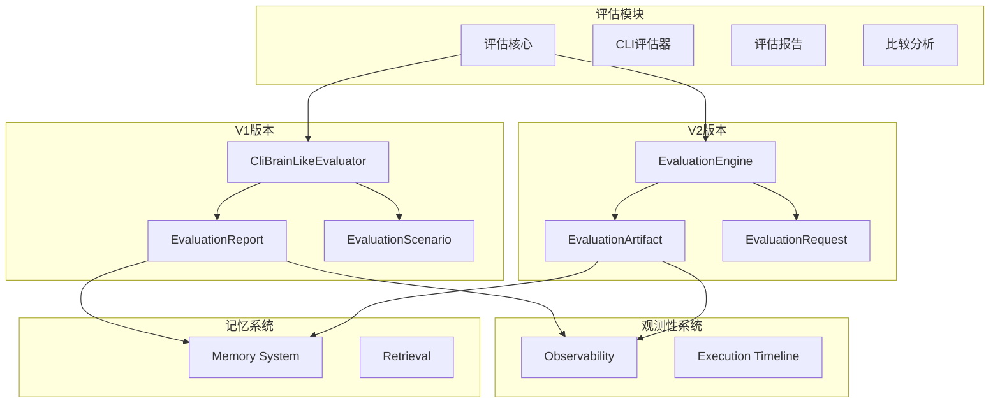
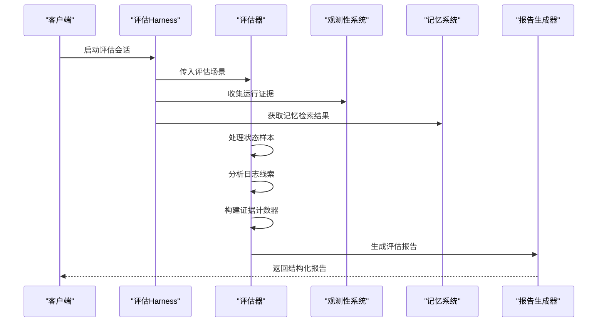
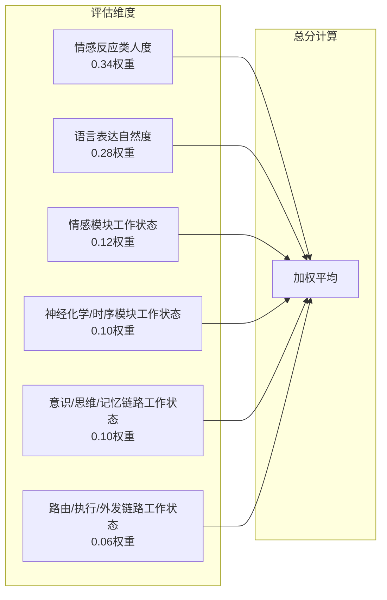
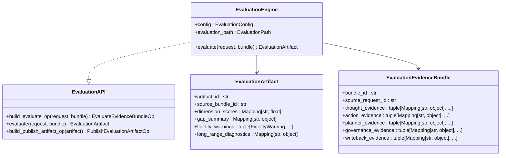
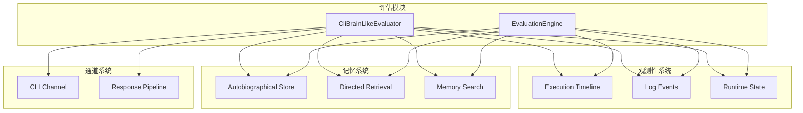

# 评估模块接口

<cite>
**本文档引用的文件**
- [cli_brain_like_evaluation.py](file://archive/helios_v1/helios_evaluation/cli_brain_like_evaluation.py)
- [__init__.py](file://archive/helios_v1/helios_evaluation/__init__.py)
- [test_cli_brain_like_evaluation.py](file://archive/helios_v1/tests/test_cli_brain_like_evaluation.py)
- [contracts.py](file://helios_v2/src/helios_v2/evaluation/contracts.py)
- [engine.py](file://helios_v2/src/helios_v2/evaluation/engine.py)
- [contracts.py](file://helios_v2/src/helios_v2/observability/contracts.py)
- [engine.py](file://helios_v2/src/helios_v2/observability/engine.py)
- [memory_system.py](file://archive/helios_v1/memory/memory_system.py)
- [MODULE_REVIEW_MATRIX.zh-CN.md](file://archive/helios_v1/docs/MODULE_REVIEW_MATRIX.zh-CN.md)
- [requirement.md](file://archive/helios_v1/docs/requirements/17-evaluation-fidelity-and-diagnostic-provenance/requirement.md)
</cite>

## 目录
1. [简介](#简介)
2. [项目结构](#项目结构)
3. [核心组件](#核心组件)
4. [架构概览](#架构概览)
5. [详细组件分析](#详细组件分析)
6. [依赖关系分析](#依赖关系分析)
7. [性能考虑](#性能考虑)
8. [故障排除指南](#故障排除指南)
9. [结论](#结论)
10. [附录](#附录)

## 简介

评估模块是Helios项目中负责系统性能评估、诊断证明和质量度量的核心组件。该模块实现了以行为证据和链路溯源为中心的诊断系统，确保每个评估维度分数都能映射到明确的运行证据、失败类型和责任模块。

评估模块主要包含两个版本：

- **V1版本（CLI类脑评估）**：专注于命令行交互场景的评估，提供详细的评分维度和诊断报告
- **V2版本（通用评估引擎）**：提供可扩展的评估框架，支持多种评估场景和证据类型

## 项目结构

评估模块在项目中的组织结构如下：



**图表来源**
- [cli_brain_like_evaluation.py:1-800](file://archive/helios_v1/helios_evaluation/cli_brain_like_evaluation.py#L1-L800)
- [contracts.py:1-331](file://helios_v2/src/helios_v2/evaluation/contracts.py#L1-L331)

**章节来源**
- [__init__.py:1-31](file://archive/helios_v1/helios_evaluation/__init__.py#L1-L31)
- [cli_brain_like_evaluation.py:1-800](file://archive/helios_v1/helios_evaluation/cli_brain_like_evaluation.py#L1-L800)

## 核心组件

评估模块的核心组件包括：

### V1版本核心组件

1. **CliBrainLikeEvaluator**：主评估器，负责构建结构化评估报告
2. **EvaluationReport**：评估报告数据结构，包含所有评估维度和诊断信息
3. **EvaluationScenario**：评估场景定义，包含提示步骤和评估参数
4. **EvaluationStateSample**：状态样本数据结构
5. **EvaluationDimensionScore**：评估维度分数结构

### V2版本核心组件

1. **EvaluationEngine**：通用评估引擎，提供只读评估工件组装
2. **EvaluationArtifact**：评估工件，包含维度分数和诊断信息
3. **EvaluationRequest**：评估请求契约，描述评估场景
4. **EvaluationEvidenceBundle**：证据包，包含来自各子系统的证据
5. **ConsequenceClaim**：后果声明，描述自报告的后果结果

**章节来源**
- [cli_brain_like_evaluation.py:25-225](file://archive/helios_v1/helios_evaluation/cli_brain_like_evaluation.py#L25-L225)
- [contracts.py:78-331](file://helios_v2/src/helios_v2/evaluation/contracts.py#L78-L331)

## 架构概览

评估模块采用分层架构设计，实现了评估证据收集、处理和报告生成的完整流程：



**图表来源**
- [cli_brain_like_evaluation.py:749-800](file://archive/helios_v1/helios_evaluation/cli_brain_like_evaluation.py#L749-L800)
- [engine.py:596-619](file://helios_v2/src/helios_v2/evaluation/engine.py#L596-L619)

## 详细组件分析

### V1版本：CLI类脑评估器

#### 主要功能

CliBrainLikeEvaluator实现了完整的评估流程，包括：

1. **证据收集**：从状态样本、对话转录和日志中提取评估证据
2. **维度评分**：计算情感反应类人度、语言表达自然度等六个维度分数
3. **诊断分析**：生成长期诊断和根因分析
4. **报告生成**：输出JSON和Markdown格式的评估报告

#### 评分维度

评估模块定义了以下六个核心维度：



**图表来源**
- [cli_brain_like_evaluation.py:768-787](file://archive/helios_v1/helios_evaluation/cli_brain_like_evaluation.py#L768-L787)

#### 证据收集机制

评估器通过多种渠道收集证据：

1. **状态样本分析**：分析内部状态变化趋势
2. **对话转录分析**：提取情感线索和语言模式
3. **日志事件统计**：统计SEC回退、执行失败等关键事件
4. **行为链追踪**：监控从思考到外显行为的完整链路

**章节来源**
- [cli_brain_like_evaluation.py:749-800](file://archive/helios_v1/helios_evaluation/cli_brain_like_evaluation.py#L749-L800)
- [cli_brain_like_evaluation.py:344-364](file://archive/helios_v1/helios_evaluation/cli_brain_like_evaluation.py#L344-L364)

### V2版本：通用评估引擎

#### 设计理念

V2版本提供了更加通用和可扩展的评估框架：

1. **只读评估**：不修改任何运行时状态
2. **证据驱动**：完全基于明确的运行证据进行评估
3. **链路溯源**：能够追踪从内部激活到外部行为的完整链路
4. **可扩展性**：支持多种评估场景和证据类型

#### 核心契约

评估引擎定义了完整的契约体系：



**图表来源**
- [contracts.py:303-331](file://helios_v2/src/helios_v2/evaluation/contracts.py#L303-L331)
- [engine.py:572-619](file://helios_v2/src/helios_v2/evaluation/engine.py#L572-L619)

#### 评估路径

V2版本提供了专门的评估路径来处理证据包：

1. **证据完整性检查**：验证各子系统证据的存在性
2. **链路缺口分析**：识别从思考到外显行为的缺口
3. **后果绑定评估**：评估内部激活到外部行为的绑定质量
4. **长期诊断生成**：基于自治线程和连续性状态生成长期诊断

**章节来源**
- [engine.py:262-570](file://helios_v2/src/helios_v2/evaluation/engine.py#L262-L570)

### 评估场景构建

评估模块提供了多种预定义的评估场景：

#### 默认20分钟混合场景

该场景包含13个精心设计的提示步骤，覆盖：

1. **基线接触**：建立初始联系
2. **积极情感刺激**：测试积极情绪反应
3. **混合情感探测**：评估复杂情感处理能力
4. **模糊输入处理**：测试不确定性情境下的表现
5. **关系建立探测**：评估社交互动质量
6. **挑战应对**：测试面对质疑时的自修正能力
7. **记忆检索**：评估对话连续性和记忆痕迹
8. **边界管理**：测试用户边界尊重能力
9. **修复能力**：评估对话修复和自我校正
10. **持久性探测**：评估长期对话维持能力
11. **收束总结**：测试对话结束时的总结能力

#### 6分钟R09聚焦场景

专为快速评估设计的场景，重点测试：

1. **混合情感解析**：提高思考到行动提议的出现概率
2. **自修正能力**：观察显式桥接证据的出现
3. **边界调整**：测试表达强度调整的稳定性
4. **修复路径**：评估修复行为中的桥接证据保留
5. **收束元认知**：在更短窗口内观察总结和错误识别

**章节来源**
- [cli_brain_like_evaluation.py:532-742](file://archive/helios_v1/helios_evaluation/cli_brain_like_evaluation.py#L532-L742)

## 依赖关系分析

评估模块与系统其他组件的依赖关系如下：



**图表来源**
- [cli_brain_like_evaluation.py:14-14](file://archive/helios_v1/helios_evaluation/cli_brain_like_evaluation.py#L14-L14)
- [engine.py:8-19](file://helios_v2/src/helios_v2/evaluation/engine.py#L8-L19)

### 接口协作机制

评估模块通过以下机制与观测性和记忆系统协作：

1. **证据收集**：从观测性系统获取执行时间线和日志事件
2. **状态查询**：访问运行时状态以分析内部健康状况
3. **记忆检索**：利用记忆系统提供的检索结果进行上下文分析
4. **通道集成**：监控用户可见行为的外发结果

**章节来源**
- [MODULE_REVIEW_MATRIX.zh-CN.md:184-200](file://archive/helios_v1/docs/MODULE_REVIEW_MATRIX.zh-CN.md#L184-L200)

## 性能考虑

评估模块在设计时充分考虑了性能优化：

### 内存使用优化

1. **流式日志处理**：使用`_tail_lines`和`_read_lines_from_offset`函数实现高效的日志文件处理
2. **状态样本压缩**：通过数据类结构减少状态样本的内存占用
3. **证据计数器优化**：使用`Counter`对象高效统计证据类型

### 计算效率优化

1. **正则表达式缓存**：预编译常用的正则表达式模式
2. **字符串匹配优化**：使用`_contains_any`和`_match_any_pattern`函数优化字符串匹配
3. **评分算法简化**：采用加权平均算法，避免复杂的机器学习模型

### 并发处理

评估模块支持并发处理多个评估场景：

1. **多线程支持**：通过`threading`模块支持并发评估
2. **异步日志处理**：使用异步方式处理日志文件读取
3. **批量证据处理**：支持批量处理证据包以提高吞吐量

## 故障排除指南

### 常见问题及解决方案

#### SEC回退过多

**问题描述**：SEC（安全控制评估）回退事件过多导致评估分数下降

**诊断方法**：
1. 检查`sec_fallback_events`计数器
2. 分析回退原因分类
3. 评估回退对整体评估的影响

**解决方案**：
1. 优化SEC评估逻辑
2. 减少不必要的回退
3. 提高LLM响应的成功率

#### 思考到可见行为缺口

**问题描述**：系统产生思考但未能形成用户可见的外显行为

**诊断方法**：
1. 检查`thought_triggered_samples`和`action_proposal_samples`
2. 分析`visible_reply_events`计数
3. 识别阻塞原因

**解决方案**：
1. 优化思考到行动的桥接机制
2. 改进行动提议的执行
3. 加强路由系统的稳定性

#### 证据缺失

**问题描述**：评估证据不足导致无法准确评估系统性能

**诊断方法**：
1. 检查各证据类别是否存在
2. 分析证据收集管道的完整性
3. 识别证据丢失的位置

**解决方案**：
1. 完善证据收集机制
2. 增强观测性系统的覆盖范围
3. 优化证据传输管道

**章节来源**
- [test_cli_brain_like_evaluation.py:643-799](file://archive/helios_v1/tests/test_cli_brain_like_evaluation.py#L643-L799)

## 结论

评估模块为Helios项目提供了全面的系统性能评估、诊断证明和质量度量能力。通过V1和V2两个版本的演进，评估模块实现了从特定场景评估到通用评估框架的转变。

### 主要成就

1. **证据驱动的评估**：每个维度分数都有明确的证据支撑
2. **完整的诊断链路**：能够追踪从内部激活到外部行为的完整过程
3. **可扩展的架构**：支持多种评估场景和证据类型
4. **严格的门控机制**：通过SEC回退和行为真实性门控确保评估质量

### 未来发展方向

1. **增强机器学习集成**：在保持证据驱动原则的同时引入更高级的分析算法
2. **实时评估能力**：支持在线评估和实时反馈
3. **多模态评估**：扩展到视觉、音频等多种输入模态
4. **自动化改进**：基于评估结果自动调整系统参数

## 附录

### 评估调用示例

#### 基本评估调用

```python
# 创建评估场景
scenario = build_default_20min_mixed_cli_scenario()

# 准备状态样本
state_samples = [
    EvaluationStateSample(
        timestamp=1.0,
        tick=10,
        state={
            "consciousness": {"available": True, "phi": 0.31},
            "neurochem": {"available": True, "raw": {"dopamine": 0.5}},
            "memory": {"working_items": 3}
        }
    )
]

# 执行评估
report = evaluator.evaluate(
    scenario=scenario,
    state_samples=state_samples,
    transcript_entries=transcript,
    log_lines=log_lines
)
```

#### 报告结果解读

评估报告包含以下关键信息：

1. **维度分数**：六个评估维度的具体得分
2. **证据计数器**：各类证据的统计信息
3. **诊断信息**：长期诊断和根因分析
4. **警告信息**：评估过程中发现的问题
5. **分析笔记**：专家对评估结果的解读

### 持续改进机制

评估模块内置了完善的持续改进机制：

1. **根因分析**：通过比较分析识别问题的根本原因
2. **阈值调优**：基于R18标准进行阈值优化
3. **长期跟踪**：通过R09标准跟踪系统改进效果
4. **自动化反馈**：基于评估结果自动调整系统配置

**章节来源**
- [cli_brain_like_evaluation.py:209-292](file://archive/helios_v1/helios_evaluation/cli_brain_like_evaluation.py#L209-L292)
- [engine.py:562-569](file://helios_v2/src/helios_v2/evaluation/engine.py#L562-L569)