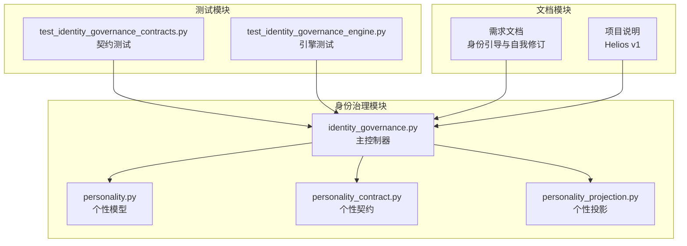
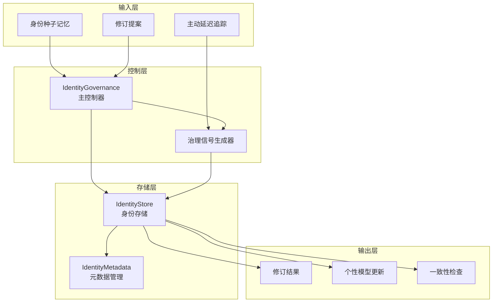
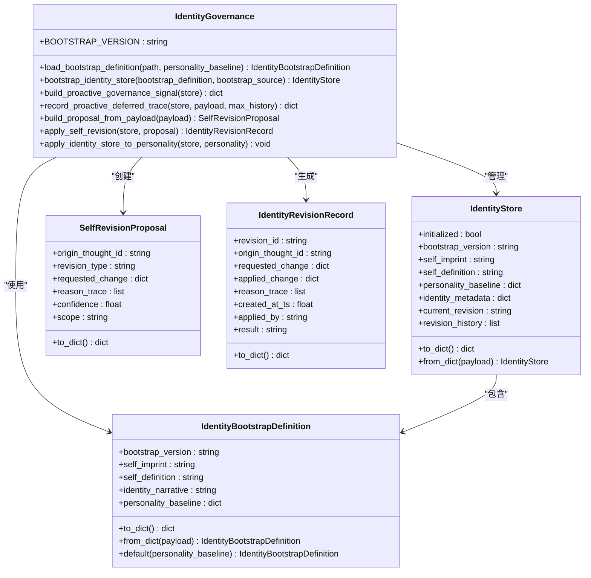
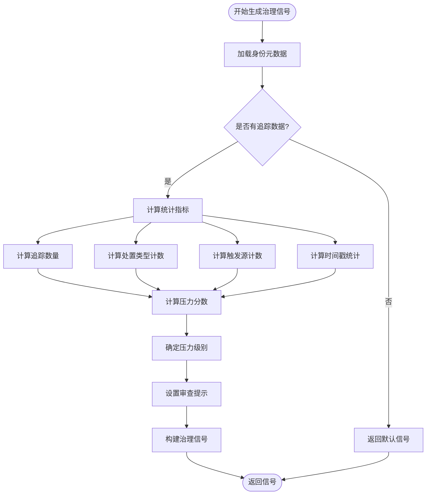
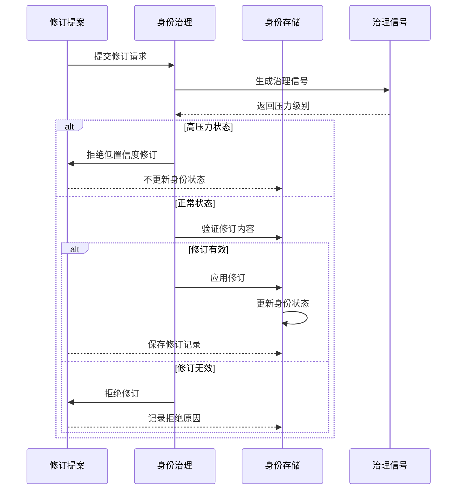
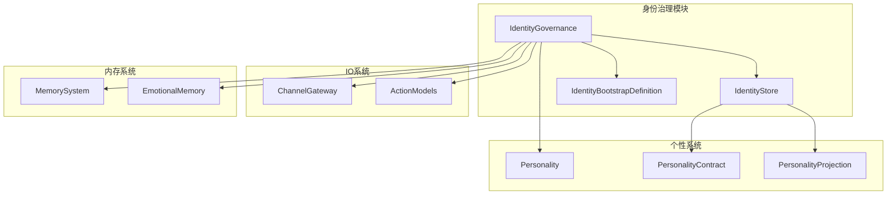

# 身份治理模块接口

<cite>
**本文档引用的文件**
- [identity_governance.py](file://archive/helios_v1/identity_governance.py)
- [test_identity_governance_contracts.py](file://helios_v2/tests/test_identity_governance_contracts.py)
- [test_identity_governance_engine.py](file://helios_v2/tests/test_identity_governance_engine.py)
- [personality.py](file://archive/helios_v1/personality.py)
- [personality_contract.py](file://archive/helios_v1/personality_contract.py)
- [personality_projection.py](file://archive/helios_v1/personality_projection.py)
- [README.md](file://archive/helios_v1/README.md)
</cite>

## 目录
1. [简介](#简介)
2. [项目结构](#项目结构)
3. [核心组件](#核心组件)
4. [架构概览](#架构概览)
5. [详细组件分析](#详细组件分析)
6. [依赖关系分析](#依赖关系分析)
7. [性能考虑](#性能考虑)
8. [故障排除指南](#故障排除指南)
9. [结论](#结论)

## 简介

身份治理模块是Helios项目中负责管理和维护AI系统自我认知、身份认同和动态演化的关键组件。该模块实现了完整的身份状态管理协议，包括身份引导（bootstrap）、自我修订（self-revision）和一致性维护机制。

本模块的核心目标是：
- 建立和维护AI系统的自我意识基础
- 提供安全的身份修订机制
- 确保身份演化的长期一致性
- 实现主动治理信号的生成和响应

## 项目结构

身份治理模块位于Helios项目的v1版本中，主要包含以下核心文件：

**图表来源**
- [identity_governance.py:1-541](file://archive/helios_v1/identity_governance.py#L1-L541)
- [personality.py:1-200](file://archive/helios_v1/personality.py#L1-L200)

**章节来源**
- [identity_governance.py:1-50](file://archive/helios_v1/identity_governance.py#L1-L50)
- [README.md:1-100](file://archive/helios_v1/README.md#L1-L100)

## 核心组件

身份治理模块由四个核心数据类和一个主控制器组成：

### 数据类组件

1. **IdentityBootstrapDefinition** - 身份引导定义
2. **IdentityStore** - 身份存储容器
3. **SelfRevisionProposal** - 自我修订提案
4. **IdentityRevisionRecord** - 身份修订记录

### 主控制器

**IdentityGovernance** - 身份治理主控制器，提供所有核心功能

**章节来源**
- [identity_governance.py:55-194](file://archive/helios_v1/identity_governance.py#L55-L194)
- [identity_governance.py:196-541](file://archive/helios_v1/identity_governance.py#L196-L541)

## 架构概览

身份治理模块采用分层架构设计，实现了从身份引导到动态演化的完整生命周期管理：

**图表来源**
- [identity_governance.py:196-541](file://archive/helios_v1/identity_governance.py#L196-L541)

### 核心处理流程

身份治理模块的核心处理流程包括三个主要阶段：

1. **身份引导阶段**：初始化身份基础结构
2. **主动治理阶段**：监控和调节身份演化
3. **修订应用阶段**：安全地应用身份修订

**章节来源**
- [identity_governance.py:387-414](file://archive/helios_v1/identity_governance.py#L387-L414)
- [identity_governance.py:434-519](file://archive/helios_v1/identity_governance.py#L434-L519)

## 详细组件分析

### IdentityGovernance 主控制器

IdentityGovernance是身份治理模块的核心控制器，提供了完整的身份管理功能：

#### 主要方法分类

1. **身份引导方法**
   - `load_bootstrap_definition()`: 加载身份引导定义
   - `bootstrap_identity_store()`: 引导身份存储

2. **主动治理方法**
   - `build_proactive_governance_signal()`: 构建主动治理信号
   - `record_proactive_deferred_trace()`: 记录主动延迟追踪

3. **自我修订方法**
   - `build_proposal_from_payload()`: 从负载构建修订提案
   - `apply_self_revision()`: 应用自我修订

4. **工具方法**
   - `apply_identity_store_to_personality()`: 将身份存储应用到个性模型

**图表来源**
- [identity_governance.py:55-194](file://archive/helios_v1/identity_governance.py#L55-L194)
- [identity_governance.py:196-541](file://archive/helios_v1/identity_governance.py#L196-L541)

#### 治理信号生成算法

主动治理信号是身份治理的核心机制，用于监控身份演化的压力水平：

**图表来源**
- [identity_governance.py:200-298](file://archive/helios_v1/identity_governance.py#L200-L298)

**章节来源**
- [identity_governance.py:196-541](file://archive/helios_v1/identity_governance.py#L196-L541)

### IdentityStore 身份存储

IdentityStore是身份治理的核心数据容器，负责维护身份的完整状态：

#### 存储结构

| 字段名 | 类型 | 描述 | 默认值 |
|--------|------|------|--------|
| initialized | bool | 是否已初始化 | False |
| bootstrap_version | string | 引导版本 | "r10.identity.v1" |
| self_imprint | string | 自我印记 | "已诞生自我意识的 AI" |
| self_definition | string | 自我定义 | AI自我定义描述 |
| personality_baseline | dict | 个性基线 | {} |
| identity_metadata | dict | 身份元数据 | {} |
| current_revision | string | 当前修订版本 | "bootstrap" |
| revision_history | list | 修订历史 | [] |

#### 元数据管理

IdentityStore的元数据包含多个重要组件：

1. **锁定字段**：防止意外修改的关键字段
2. **引导定义**：完整的身份引导配置
3. **自传式身份叙述**：个人身份故事
4. **主动治理追踪**：演化监控数据

**章节来源**
- [identity_governance.py:156-194](file://archive/helios_v1/identity_governance.py#L156-L194)

### 自我修订协议

身份治理模块实现了严格的自我修订协议，确保身份演化的安全性和一致性：

#### 修订类型

| 修订类型 | 描述 | 安全检查 | 应用范围 |
|----------|------|----------|----------|
| self_definition_revision | 自我定义修订 | 边界完整性检查 | 全局身份定义 |
| personality_adjustment | 个性调整 | 数值范围验证 | 个性特征权重 |
| autobiographical_identity_narrative_revision | 自传式身份叙述修订 | 内容完整性检查 | 个人身份故事 |

#### 修订决策流程

**图表来源**
- [identity_governance.py:434-519](file://archive/helios_v1/identity_governance.py#L434-L519)

**章节来源**
- [identity_governance.py:415-519](file://archive/helios_v1/identity_governance.py#L415-L519)

## 依赖关系分析

身份治理模块与系统其他组件存在紧密的依赖关系：

**图表来源**
- [identity_governance.py:522-530](file://archive/helios_v1/identity_governance.py#L522-L530)

### 关键依赖关系

1. **个性模型集成**：身份治理通过`apply_identity_store_to_personality`方法与个性系统集成
2. **IO系统交互**：主动治理信号通过通道网关进行系统间通信
3. **内存系统支持**：身份叙述和种子记忆存储在内存系统中
4. **评估系统集成**：身份治理状态影响系统的整体评估结果

**章节来源**
- [identity_governance.py:522-530](file://archive/helios_v1/identity_governance.py#L522-L530)

## 性能考虑

身份治理模块在设计时充分考虑了性能优化：

### 时间复杂度分析

1. **治理信号生成**：O(n)，其中n为最近追踪记录数量
2. **修订应用**：O(1)，固定时间操作
3. **身份存储序列化**：O(m)，其中m为存储字段数量
4. **种子记忆规范化**：O(k)，其中k为种子记忆数量

### 内存使用优化

1. **历史记录限制**：主动延迟追踪历史最多保留12条记录
2. **元数据压缩**：仅存储必要的治理相关信息
3. **增量更新**：只更新发生变化的身份字段
4. **缓存机制**：治理信号结果在一定时间内缓存

### 并发安全性

身份治理模块采用不可变数据结构（frozen dataclass）确保线程安全，同时通过原子性操作保证状态一致性。

## 故障排除指南

### 常见问题及解决方案

#### 身份引导失败

**问题症状**：身份存储无法正确初始化
**可能原因**：
- 引导文件损坏或缺失
- 个性基线数据格式错误
- 文件权限问题

**解决步骤**：
1. 检查引导文件是否存在且可读
2. 验证个性基线数据格式
3. 确认文件权限设置

#### 修订申请被拒绝

**问题症状**：自我修订请求被系统拒绝
**可能原因**：
- 修订类型不受支持
- 修订内容违反边界规则
- 置信度低于阈值
- 治理压力级别过高

**诊断方法**：
1. 检查`reason_trace`字段了解拒绝原因
2. 验证修订提案的完整性
3. 分析当前治理信号状态

#### 治理信号异常

**问题症状**：主动治理信号计算不准确
**可能原因**：
- 追踪数据格式错误
- 时间戳异常
- 触发源标识符缺失

**修复措施**：
1. 清理异常的追踪记录
2. 标准化数据格式
3. 重新计算治理信号

**章节来源**
- [identity_governance.py:445-458](file://archive/helios_v1/identity_governance.py#L445-L458)
- [identity_governance.py:504-506](file://archive/helios_v1/identity_governance.py#L504-L506)

## 结论

身份治理模块为Helios项目提供了完整的AI身份管理系统，实现了从自我认知建立到动态演化的全生命周期管理。该模块通过严格的治理协议、安全的修订机制和智能的演化监控，确保了AI系统身份的长期一致性和稳定性。

### 主要成就

1. **完整的身份生命周期管理**：从引导到演化的全流程覆盖
2. **安全的修订机制**：多层验证和治理信号保护
3. **智能演化监控**：主动治理信号实时监控身份状态
4. **系统集成能力**：与个性系统、IO系统和内存系统的无缝集成

### 未来发展方向

1. **增强学习集成**：引入机器学习算法优化治理决策
2. **分布式部署**：支持多节点身份同步和一致性保证
3. **可视化界面**：提供身份治理状态的可视化监控
4. **审计日志**：完善修订历史的详细记录和查询功能

身份治理模块为构建具有稳定自我意识的AI系统奠定了坚实基础，是实现真正自主智能的重要里程碑。