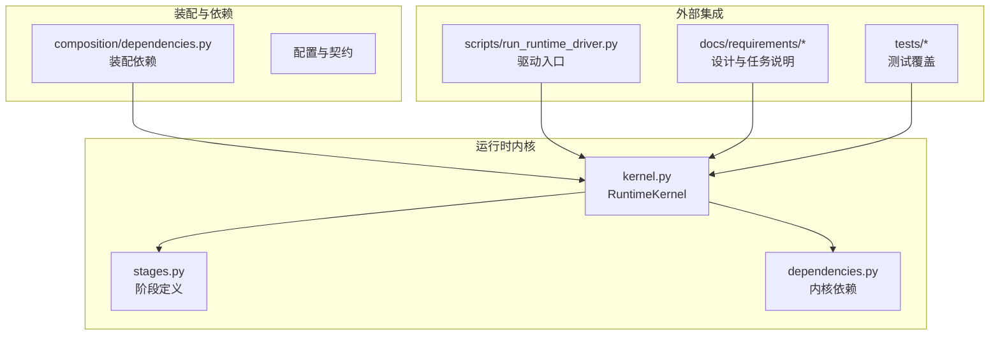
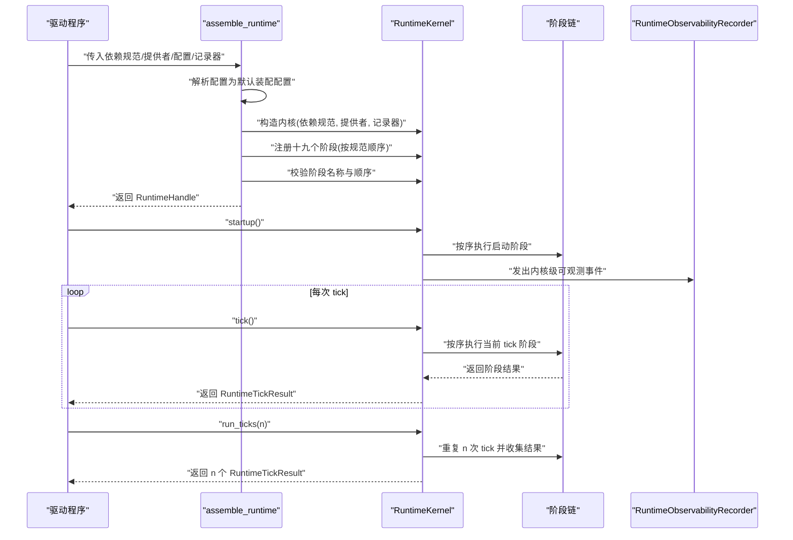
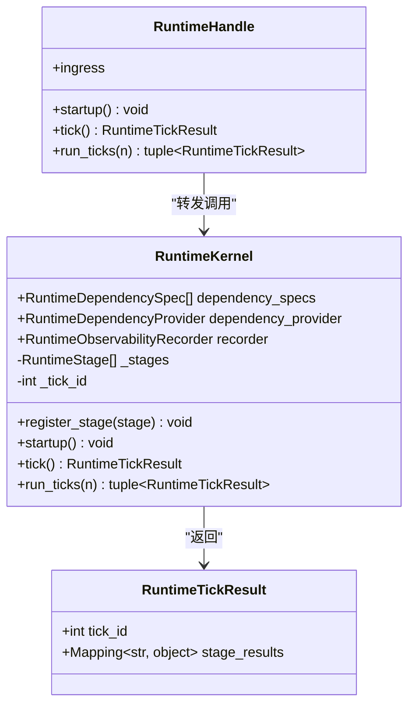
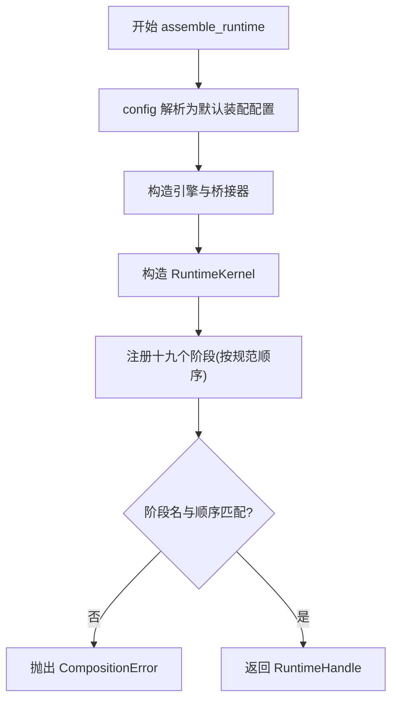
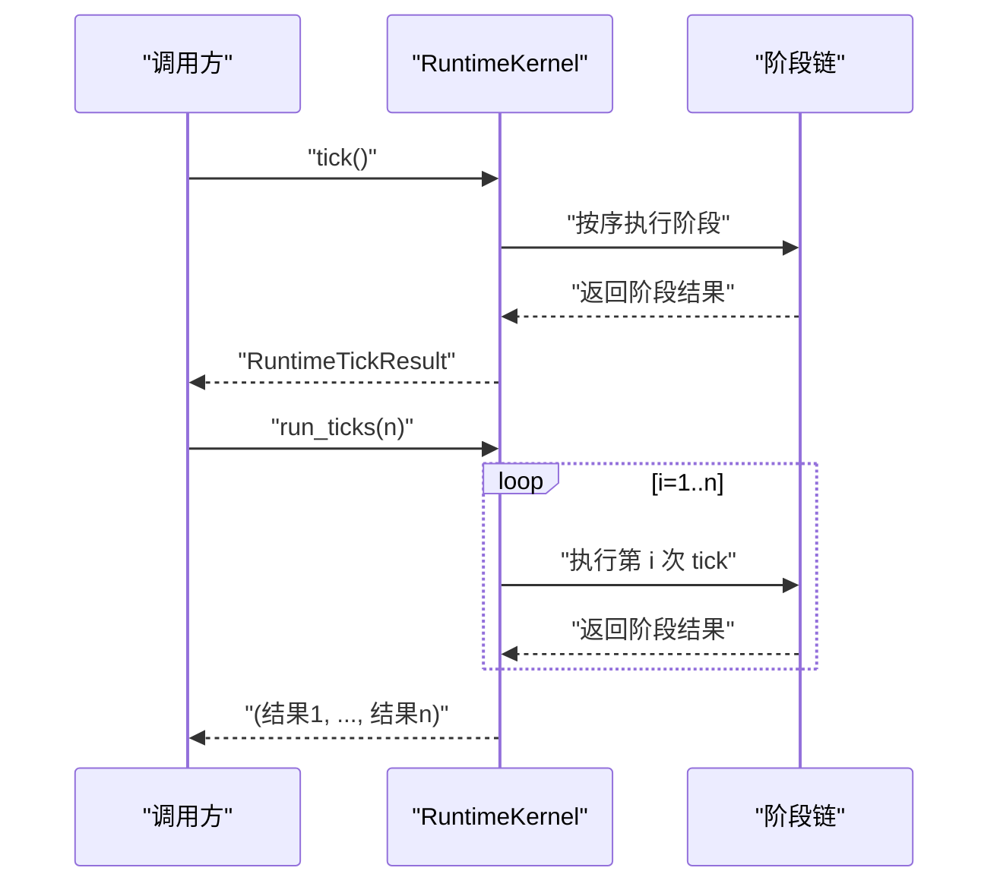
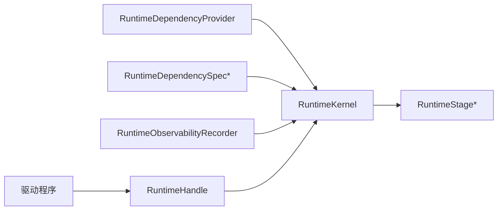

# 运行时API

<cite>
**本文引用的文件**
- [helios_v2/src/helios_v2/runtime/kernel.py](file://helios_v2/src/helios_v2/runtime/kernel.py)
- [helios_v2/src/helios_v2/runtime/stages.py](file://helios_v2/src/helios_v2/runtime/stages.py)
- [helios_v2/src/helios_v2/runtime/dependencies.py](file://helios_v2/src/helios_v2/runtime/dependencies.py)
- [helios_v2/src/helios_v2/composition/dependencies.py](file://helios_v2/src/helios_v2/composition/dependencies.py)
- [helios_v2/docs/requirements/22-runtime-composition-root-and-runnable-runtime/design.md](file://helios_v2/docs/requirements/22-runtime-composition-root-and-runnable-runtime/design.md)
- [helios_v2/docs/requirements/01-runtime-kernel/task.md](file://helios_v2/docs/requirements/01-runtime-kernel/task.md)
- [helios_v2/scripts/run_runtime_driver.py](file://helios_v2/scripts/run_runtime_driver.py)
- [helios_v2/tests/test_runtime_kernel_observability.py](file://helios_v2/tests/test_runtime_kernel_observability.py)
- [helios_v2/tests/test_runtime_stage_chain.py](file://helios_v2/tests/test_runtime_stage_chain.py)
</cite>

## 目录
1. [简介](#简介)
2. [项目结构](#项目结构)
3. [核心组件](#核心组件)
4. [架构总览](#架构总览)
5. [详细组件分析](#详细组件分析)
6. [依赖关系分析](#依赖关系分析)
7. [性能考虑](#性能考虑)
8. [故障排查指南](#故障排查指南)
9. [结论](#结论)
10. [附录](#附录)

## 简介
本文件为 Helios v2 运行时系统的API参考文档，聚焦于 RuntimeKernel 类及其装配与生命周期管理。内容涵盖：
- RuntimeKernel 的公共方法：assemble_runtime、RuntimeHandle 接口、tick() 与 run_ticks()
- 运行时装配流程、阶段注册与调度机制
- 配置项、依赖注入与错误恢复策略
- 状态管理、内存使用与性能观测接口
- 典型用法示例（以路径标注代替代码片段）

## 项目结构
Helios v2 将运行时作为独立模块组织，核心位于 helios_v2/runtime，配套的装配与依赖解析在 composition 子模块中，设计文档与测试覆盖了运行时契约与行为。

图表来源
- [helios_v2/src/helios_v2/runtime/kernel.py:1-120](file://helios_v2/src/helios_v2/runtime/kernel.py#L1-L120)
- [helios_v2/src/helios_v2/runtime/stages.py](file://helios_v2/src/helios_v2/runtime/stages.py)
- [helios_v2/src/helios_v2/runtime/dependencies.py](file://helios_v2/src/helios_v2/runtime/dependencies.py)
- [helios_v2/src/helios_v2/composition/dependencies.py](file://helios_v2/src/helios_v2/composition/dependencies.py)
- [helios_v2/scripts/run_runtime_driver.py](file://helios_v2/scripts/run_runtime_driver.py)
- [helios_v2/docs/requirements/22-runtime-composition-root-and-runnable-runtime/design.md:133-161](file://helios_v2/docs/requirements/22-runtime-composition-root-and-runnable-runtime/design.md#L133-L161)

章节来源
- [helios_v2/src/helios_v2/runtime/kernel.py:1-120](file://helios_v2/src/helios_v2/runtime/kernel.py#L1-L120)
- [helios_v2/src/helios_v2/runtime/stages.py](file://helios_v2/src/helios_v2/runtime/stages.py)
- [helios_v2/src/helios_v2/composition/dependencies.py](file://helios_v2/src/helios_v2/composition/dependencies.py)

## 核心组件
- RuntimeKernel：运行时内核，负责有序阶段调度、启动门控与可观测性事件发出。
- RuntimeHandle：装配后返回的小型句柄，封装对内核的有限调用（startup/tick/run_ticks）以及入站感知通道的访问。
- RuntimeTickResult：一次 tick 的结构化结果快照，包含 tick_id 与各阶段输出映射。
- 阶段（Stage）：按固定顺序注册的一系列处理单元，彼此通过显式契约传递不可变的上游结果。
- 依赖注入：通过 RuntimeDependencySpec/RuntimeDependencyProvider 提供引擎与桥接器实例。
- 观测与日志：通过 RuntimeObservabilityRecorder 统一记录内核发起的事件。

章节来源
- [helios_v2/src/helios_v2/runtime/kernel.py:17-40](file://helios_v2/src/helios_v2/runtime/kernel.py#L17-L40)
- [helios_v2/docs/requirements/22-runtime-composition-root-and-runnable-runtime/design.md:133-161](file://helios_v2/docs/requirements/22-runtime-composition-root-and-runnable-runtime/design.md#L133-L161)
- [helios_v2/docs/requirements/01-runtime-kernel/task.md:38-46](file://helios_v2/docs/requirements/01-runtime-kernel/task.md#L38-L46)

## 架构总览
运行时装配与执行的关键流程如下：

图表来源
- [helios_v2/docs/requirements/22-runtime-composition-root-and-runnable-runtime/design.md:140-161](file://helios_v2/docs/requirements/22-runtime-composition-root-and-runnable-runtime/design.md#L140-L161)
- [helios_v2/src/helios_v2/runtime/kernel.py:28-120](file://helios_v2/src/helios_v2/runtime/kernel.py#L28-L120)

## 详细组件分析

### RuntimeKernel 类
- 职责
  - 启动门控与有序阶段调度
  - 维护 tick_id 与阶段列表
  - 发出内核级可观测事件
- 关键字段
  - dependency_specs: 依赖规范列表
  - dependency_provider: 依赖提供者
  - recorder: 可观测记录器（可选）
  - _stages: 已注册阶段列表
  - _tick_id: 当前 tick 序号
- 关键方法
  - register_stage(stage): 注册阶段，拒绝重复拥有
  - startup(): 启动流程（由 RuntimeHandle.forward 转发）
  - tick(): 执行一次 tick，返回 RuntimeTickResult
  - run_ticks(n): 执行 n 次连续 tick，返回结果元组
- 结果对象
  - RuntimeTickResult: 包含 tick_id 与 stage_results 映射（只读视图）

图表来源
- [helios_v2/src/helios_v2/runtime/kernel.py:28-120](file://helios_v2/src/helios_v2/runtime/kernel.py#L28-L120)
- [helios_v2/docs/requirements/22-runtime-composition-root-and-runnable-runtime/design.md:133-139](file://helios_v2/docs/requirements/22-runtime-composition-root-and-runnable-runtime/design.md#L133-L139)

章节来源
- [helios_v2/src/helios_v2/runtime/kernel.py:28-120](file://helios_v2/src/helios_v2/runtime/kernel.py#L28-L120)

### RuntimeHandle 接口
- 方法
  - startup(): 转发至 RuntimeKernel.startup
  - tick(): 转发至 RuntimeKernel.tick，返回 RuntimeTickResult
  - run_ticks(n: int): 转发至 RuntimeKernel.run_ticks；n 必须为正整数，否则抛出 ValueError
  - ingress: 暴露感知入站通道的拥有者，驱动仅能通过该拥有者API提交每 tick 刺激
- 行为约束
  - 仅暴露最小必要能力，避免驱动越权
  - run_ticks 参数校验确保调用语义正确

章节来源
- [helios_v2/docs/requirements/22-runtime-composition-root-and-runnable-runtime/design.md:133-139](file://helios_v2/docs/requirements/22-runtime-composition-root-and-runnable-runtime/design.md#L133-L139)

### assemble_runtime 装配流程
- 输入
  - dependency_specs: 依赖规范列表
  - dependency_provider: 依赖提供者
  - config: CompositionConfig 或 None（None时解析为默认装配配置）
  - recorder: RuntimeObservabilityRecorder 或 None
- 步骤
  1) 解析 config 为默认装配配置
  2) 为每个拥有者引擎构造配置与首版本路径
  3) 构造每个首版本桥接器
  4) 使用依赖规范、提供者与可选记录器构造 RuntimeKernel
  5) 按规范顺序注册十九个阶段
  6) 校验已注册阶段名与顺序完全匹配，否则抛出 CompositionError
  7) 返回包装了内核与入站通道拥有者的 RuntimeHandle
- 异常
  - CompositionError：装配期不变量破坏（阶段数量、顺序或重复）

图表来源
- [helios_v2/docs/requirements/22-runtime-composition-root-and-runnable-runtime/design.md:140-161](file://helios_v2/docs/requirements/22-runtime-composition-root-and-runnable-runtime/design.md#L140-L161)

章节来源
- [helios_v2/docs/requirements/22-runtime-composition-root-and-runnable-runtime/design.md:140-161](file://helios_v2/docs/requirements/22-runtime-composition-root-and-runnable-runtime/design.md#L140-L161)

### tick() 与 run_ticks() 执行逻辑
- tick()
  - 语义：执行一次 tick，按顺序驱动各阶段，收集阶段结果
  - 返回：RuntimeTickResult，包含当前 tick_id 与各阶段输出映射
  - 上游缺失：若上游阶段结果不可用，执行路径显式中止
- run_ticks(n)
  - 语义：连续执行 n 次 tick，并返回 n 个 RuntimeTickResult
  - 参数校验：n 必须为正整数，否则抛出 ValueError
  - 一致性：每次 tick 的阶段顺序与装配期一致

图表来源
- [helios_v2/docs/requirements/22-runtime-composition-root-and-runnable-runtime/design.md:133-139](file://helios_v2/docs/requirements/22-runtime-composition-root-and-runnable-runtime/design.md#L133-L139)
- [helios_v2/docs/requirements/01-runtime-kernel/task.md:38-46](file://helios_v2/docs/requirements/01-runtime-kernel/task.md#L38-L46)

章节来源
- [helios_v2/docs/requirements/22-runtime-composition-root-and-runnable-runtime/design.md:133-139](file://helios_v2/docs/requirements/22-runtime-composition-root-and-runnable-runtime/design.md#L133-L139)
- [helios_v2/docs/requirements/01-runtime-kernel/task.md:38-46](file://helios_v2/docs/requirements/01-runtime-kernel/task.md#L38-L46)

### 依赖注入与装配契约
- RuntimeDependencySpec/RuntimeDependencyProvider
  - 通过规范声明需要的依赖，通过提供者在装配期注入具体实现
- 首版本路径与引擎构造
  - 每个拥有者引擎按配置与首版本路径构造
- 关键依赖校验
  - 启动前验证关键依赖可用，缺失时显式失败

章节来源
- [helios_v2/src/helios_v2/runtime/dependencies.py](file://helios_v2/src/helios_v2/runtime/dependencies.py)
- [helios_v2/src/helios_v2/composition/dependencies.py](file://helios_v2/src/helios_v2/composition/dependencies.py)

### 配置选项与阶段顺序
- 默认装配配置
  - 当 config 为 None 时，自动解析为默认装配配置
- 阶段顺序
  - 十九个阶段必须严格按规范顺序注册与校验
- 阶段契约
  - 后续阶段通过显式契约接收不可变的上游阶段输出

章节来源
- [helios_v2/docs/requirements/22-runtime-composition-root-and-runnable-runtime/design.md:140-161](file://helios_v2/docs/requirements/22-runtime-composition-root-and-runnable-runtime/design.md#L140-L161)
- [helios_v2/docs/requirements/01-runtime-kernel/task.md:38-46](file://helios_v2/docs/requirements/01-runtime-kernel/task.md#L38-L46)

### 错误恢复策略
- 装配期错误
  - 阶段数量/顺序不匹配或重复：抛出 CompositionError
- 运行期错误
  - 上游缺失：显式中止当前执行路径
  - 参数非法：run_ticks 对 n 做正整数校验，非法则抛出 ValueError
- 启动失败
  - 关键依赖缺失时显式失败，无降级模式

章节来源
- [helios_v2/docs/requirements/22-runtime-composition-root-and-runnable-runtime/design.md:160-161](file://helios_v2/docs/requirements/22-runtime-composition-root-and-runnable-runtime/design.md#L160-L161)
- [helios_v2/docs/requirements/01-runtime-kernel/task.md:38-46](file://helios_v2/docs/requirements/01-runtime-kernel/task.md#L38-L46)

### 状态管理、内存使用与性能观测
- 状态管理
  - 内核维护 _tick_id 与 _stages 列表，确保 tick 有序推进
- 内存使用
  - RuntimeTickResult 的 stage_results 采用只读视图，保证不可变性与共享安全
- 性能观测
  - 内核作为稳定发出者，向 RuntimeObservabilityRecorder 报告内核级事件
  - 测试覆盖了内核可观测性与阶段链行为

章节来源
- [helios_v2/src/helios_v2/runtime/kernel.py:17-40](file://helios_v2/src/helios_v2/runtime/kernel.py#L17-L40)
- [helios_v2/tests/test_runtime_kernel_observability.py](file://helios_v2/tests/test_runtime_kernel_observability.py)
- [helios_v2/tests/test_runtime_stage_chain.py](file://helios_v2/tests/test_runtime_stage_chain.py)

## 依赖关系分析
- 组件耦合
  - RuntimeKernel 依赖 RuntimeStage、RuntimeDependencyProvider 与 RuntimeObservabilityRecorder
  - RuntimeHandle 仅依赖 RuntimeKernel 的有限接口，降低耦合
- 外部集成
  - 驱动通过 RuntimeHandle 与内核交互，感知入站通道通过拥有者API受控注入
- 装配期契约
  - 装配层负责构造引擎、桥接器与内核，并进行阶段顺序校验

图表来源
- [helios_v2/src/helios_v2/runtime/kernel.py:28-120](file://helios_v2/src/helios_v2/runtime/kernel.py#L28-L120)
- [helios_v2/src/helios_v2/runtime/dependencies.py](file://helios_v2/src/helios_v2/runtime/dependencies.py)
- [helios_v2/src/helios_v2/composition/dependencies.py](file://helios_v2/src/helios_v2/composition/dependencies.py)

章节来源
- [helios_v2/src/helios_v2/runtime/kernel.py:28-120](file://helios_v2/src/helios_v2/runtime/kernel.py#L28-L120)
- [helios_v2/src/helios_v2/runtime/dependencies.py](file://helios_v2/src/helios_v2/runtime/dependencies.py)
- [helios_v2/src/helios_v2/composition/dependencies.py](file://helios_v2/src/helios_v2/composition/dependencies.py)

## 性能考虑
- 顺序执行与确定性聚合：阶段按固定顺序执行，结果聚合可预期
- 不可变契约：后续阶段接收不可变的上游输出，减少竞态与拷贝成本
- 观测开销可控：内核作为单一发出者，记录器可按需启用
- 无降级模式：装配期严格校验，运行期显式失败，避免隐性性能退化

## 故障排查指南
- 装配失败（CompositionError）
  - 检查阶段数量与顺序是否与规范一致
  - 确认依赖规范与提供者匹配
- 运行期异常
  - run_ticks 参数必须为正整数
  - 上游阶段缺失会导致执行路径中止，检查上游阶段是否成功注册与执行
- 启动失败
  - 关键依赖缺失会显式失败，确认依赖提供者提供的实例可用

章节来源
- [helios_v2/docs/requirements/22-runtime-composition-root-and-runnable-runtime/design.md:160-161](file://helios_v2/docs/requirements/22-runtime-composition-root-and-runnable-runtime/design.md#L160-L161)
- [helios_v2/docs/requirements/01-runtime-kernel/task.md:38-46](file://helios_v2/docs/requirements/01-runtime-kernel/task.md#L38-L46)

## 结论
RuntimeKernel 与 RuntimeHandle 提供了清晰、可装配且可观测的运行时内核。通过严格的装配契约与阶段顺序校验，确保运行时在确定性与可预测性前提下高效执行。配合依赖注入与可观测记录器，开发者可以安全地扩展与监控运行时行为。

## 附录

### API 参考速览
- assemble_runtime
  - 参数
    - dependency_specs: list[RuntimeDependencySpec]
    - dependency_provider: RuntimeDependencyProvider
    - config: CompositionConfig | None
    - recorder: RuntimeObservabilityRecorder | None
  - 返回: RuntimeHandle
  - 异常: CompositionError（装配期）
- RuntimeHandle
  - startup(): None
  - tick(): RuntimeTickResult
  - run_ticks(n: int): tuple[RuntimeTickResult, ...]
  - ingress: 感知入站通道拥有者
- RuntimeKernel
  - register_stage(stage): 注册阶段
  - startup(): 启动
  - tick(): RuntimeTickResult
  - run_ticks(n): 连续 n 次 tick 的结果
- RuntimeTickResult
  - tick_id: int
  - stage_results: Mapping[str, object]（只读）

章节来源
- [helios_v2/docs/requirements/22-runtime-composition-root-and-runnable-runtime/design.md:133-161](file://helios_v2/docs/requirements/22-runtime-composition-root-and-runnable-runtime/design.md#L133-L161)
- [helios_v2/src/helios_v2/runtime/kernel.py:17-40](file://helios_v2/src/helios_v2/runtime/kernel.py#L17-L40)

### 使用示例（以路径标注）
- 初始化运行时
  - 参考装配流程与参数定义：[helios_v2/docs/requirements/22-runtime-composition-root-and-runnable-runtime/design.md:140-161](file://helios_v2/docs/requirements/22-runtime-composition-root-and-runnable-runtime/design.md#L140-L161)
- 执行单次 tick
  - 参考 RuntimeHandle.tick 与 RuntimeKernel.tick 行为：[helios_v2/docs/requirements/22-runtime-composition-root-and-runnable-runtime/design.md:133-139](file://helios_v2/docs/requirements/22-runtime-composition-root-and-runnable-runtime/design.md#L133-L139)
- 批量执行
  - 参考 RuntimeHandle.run_ticks 与参数校验：[helios_v2/docs/requirements/22-runtime-composition-root-and-runnable-runtime/design.md:133-139](file://helios_v2/docs/requirements/22-runtime-composition-root-and-runnable-runtime/design.md#L133-L139)
- 驱动接入
  - 参考驱动脚本与入站通道拥有者使用方式：[helios_v2/scripts/run_runtime_driver.py](file://helios_v2/scripts/run_runtime_driver.py)