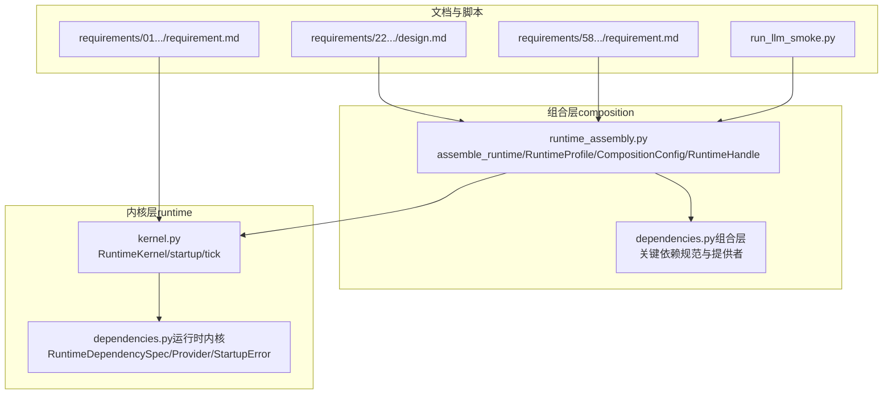
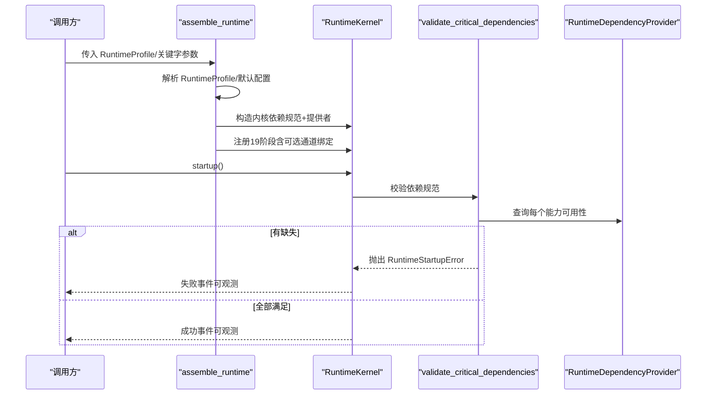
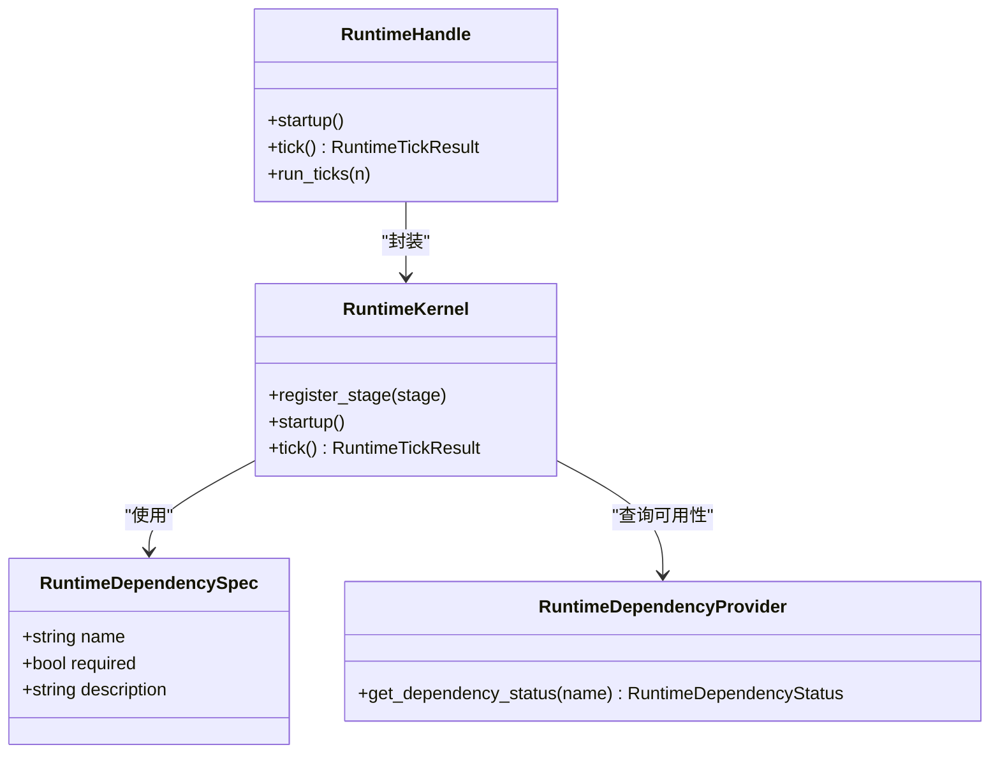

# 配置API

<cite>
**本文引用的文件**
- [runtime_assembly.py](file://helios_v2/src/helios_v2/composition/runtime_assembly.py)
- [dependencies.py（组合层）](file://helios_v2/src/helios_v2/composition/dependencies.py)
- [dependencies.py（运行时内核）](file://helios_v2/src/helios_v2/runtime/dependencies.py)
- [kernel.py](file://helios_v2/src/helios_v2/runtime/kernel.py)
- [design.md（运行时组成与可运行运行时）](file://helios_v2/docs/requirements/22-runtime-composition-root-and-runnable-runtime/design.md)
- [requirement.md（运行时内核）](file://helios_v2/docs/requirements/01-runtime-kernel/requirement.md)
- [requirement.md（运行时配置概要）](file://helios_v2/docs/requirements/58-runtime-profile-capability-bundle/requirement.md)
- [design.md（运行时配置概要）](file://helios_v2/docs/requirements/58-runtime-profile-capability-bundle/design.md)
- [run_llm_smoke.py](file://helios_v2/scripts/run_llm_smoke.py)
- [engine.py（意识引擎）](file://helios_v2/src/helios_v2/consciousness/engine.py)
- [helios_main.py（v1）](file://archive/helios_v1/helios_main.py)
- [heliosd.sh（v1）](file://archive/helios_v1/heliosd.sh)
</cite>

## 目录
1. [简介](#简介)
2. [项目结构](#项目结构)
3. [核心组件](#核心组件)
4. [架构总览](#架构总览)
5. [详细组件分析](#详细组件分析)
6. [依赖关系分析](#依赖关系分析)
7. [性能考量](#性能考量)
8. [故障排查指南](#故障排查指南)
9. [结论](#结论)
10. [附录](#附录)

## 简介
本文件为 Helios v2 的配置系统提供权威的 API 参考，覆盖运行时装配配置、依赖注入配置、模块边界配置与运行时参数配置。内容包括：
- 运行时装配 API：assemble_runtime、RuntimeProfile、CompositionConfig、RuntimeHandle
- 依赖注入 API：RuntimeDependencySpec、RuntimeDependencyProvider、关键依赖能力名称
- 模块边界配置：各 owner 引擎的 per-owner 配置对象与默认值
- 运行时参数：环境变量、配置加载与优先级
- 验证机制：启动门禁、跨能力校验、失败即停
- 热重载与迁移：持续性快照、断点续跑、跨版本兼容策略
- 安全性：凭据注入与最小暴露面

## 项目结构
Helios v2 将“装配”与“内核”解耦：
- 组合层（composition）负责装配 19 个阶段、桥接与运行时句柄
- 内核层（runtime）负责生命周期与依赖门禁
- 各 owner 引擎通过 per-owner 配置对象进行参数化

图表来源
- [runtime_assembly.py:997-1054](file://helios_v2/src/helios_v2/composition/runtime_assembly.py#L997-L1054)
- [dependencies.py（组合层）:71-224](file://helios_v2/src/helios_v2/composition/dependencies.py#L71-L224)
- [dependencies.py（运行时内核）:8-40](file://helios_v2/src/helios_v2/runtime/dependencies.py#L8-L40)
- [kernel.py:46-74](file://helios_v2/src/helios_v2/runtime/kernel.py#L46-L74)
- [design.md（运行时组成与可运行运行时）:120-161](file://helios_v2/docs/requirements/22-runtime-composition-root-and-runnable-runtime/design.md#L120-L161)
- [requirement.md（运行时内核）:1-27](file://helios_v2/docs/requirements/01-runtime-kernel/requirement.md#L1-L27)
- [requirement.md（运行时配置概要）:32-108](file://helios_v2/docs/requirements/58-runtime-profile-capability-bundle/requirement.md#L32-L108)
- [run_llm_smoke.py:184-191](file://helios_v2/scripts/run_llm_smoke.py#L184-L191)

章节来源
- [runtime_assembly.py:1-120](file://helios_v2/src/helios_v2/composition/runtime_assembly.py#L1-L120)
- [dependencies.py（组合层）:1-50](file://helios_v2/src/helios_v2/composition/dependencies.py#L1-L50)
- [kernel.py:1-30](file://helios_v2/src/helios_v2/runtime/kernel.py#L1-L30)

## 核心组件
- 运行时装配入口
  - assemble_runtime：装配 19 阶段内核、注册阶段顺序、执行启动门禁、返回 RuntimeHandle
  - RuntimeProfile：能力束与跨能力校验，派生语义记忆开关等标志位
  - CompositionConfig：每 owner 的首版本配置集合，默认值来自 proven stage-chain 测试
- 依赖注入
  - RuntimeDependencySpec：声明关键依赖能力名称、是否必需、描述
  - RuntimeDependencyProvider：按能力名查询可用性状态
  - 关键依赖能力名称：运行时认知基线、LLM 静态就绪、通道驱动静态就绪、经验存储就绪、嵌入档案就绪、连续性检查点就绪
- 运行时句柄
  - RuntimeHandle：startup/tick/run_ticks；携带感知输入入口、可观测性时间线承载、跨 tick 状态承载与持久化/检查点写入

章节来源
- [runtime_assembly.py:306-364](file://helios_v2/src/helios_v2/composition/runtime_assembly.py#L306-L364)
- [runtime_assembly.py:889-956](file://helios_v2/src/helios_v2/composition/runtime_assembly.py#L889-L956)
- [runtime_assembly.py:556-593](file://helios_v2/src/helios_v2/composition/runtime_assembly.py#L556-L593)
- [dependencies.py（运行时内核）:8-40](file://helios_v2/src/helios_v2/runtime/dependencies.py#L8-L40)
- [dependencies.py（组合层）:31-68](file://helios_v2/src/helios_v2/composition/dependencies.py#L31-L68)

## 架构总览
运行时装配流程（assemble_runtime）与内核启动门禁（RuntimeKernel.startup）协同工作，确保在首次 tick 执行前完成所有关键依赖校验。

图表来源
- [runtime_assembly.py:997-1054](file://helios_v2/src/helios_v2/composition/runtime_assembly.py#L997-L1054)
- [kernel.py:46-74](file://helios_v2/src/helios_v2/runtime/kernel.py#L46-L74)
- [dependencies.py（运行时内核）:26-40](file://helios_v2/src/helios_v2/runtime/dependencies.py#L26-L40)

章节来源
- [design.md（运行时组成与可运行运行时）:140-161](file://helios_v2/docs/requirements/22-runtime-composition-root-and-runnable-runtime/design.md#L140-L161)
- [requirement.md（运行时内核）:13-27](file://helios_v2/docs/requirements/01-runtime-kernel/requirement.md#L13-L27)

## 详细组件分析

### 运行时装配 API
- assemble_runtime
  - 输入：RuntimeProfile 或多关键字参数（与 RuntimeProfile 字段一一对应）
  - 行为：解析 RuntimeProfile；构建 SensoryIngress、各 owner 引擎与桥接；注册 19 阶段；执行启动门禁；返回 RuntimeHandle
  - 关键分支：确定性思维路径（deterministic_thought）、通道绑定（channel_cli）、外部感觉源（external_signal_source）、间脑采样器（interoceptive_sampler）、经验存储（experience_store）、语义记忆（embedding_gateway/profile）、连续性检查点（continuity_checkpoint）
- RuntimeProfile
  - 能力束：依赖规范、提供者、per-owner 配置、网关、各类可选组件
  - 跨能力校验：语义记忆需持久化经验存储；外部信号源与 CLI 通道互斥
  - 派生标志：semantic_memory_enabled
- CompositionConfig
  - 包含每 owner 的配置对象（如神经调质、体感、记忆、工作空间、意识、思维门控、定向检索、具身提示、外显表达、内部思考、行动外化、规划桥接、身份治理、经验回写、自主性、评估、LLM 组合配置）
  - 默认值：镜像 proven stage-chain 测试的首版本默认值
- RuntimeHandle
  - 生命周期：startup（门禁+恢复连续性）、tick（执行内核、承载时间线/后果声明/回忆指令/时间源/驱动紧迫度/经验/记忆/检查点）、run_ticks
  - 跨 tick 承载：时间线视图、上一 tick 的后果声明、上一 tick 的回忆指令、时间源状态、驱动紧迫度、经验/记忆持久化、连续性检查点保存

章节来源
- [runtime_assembly.py:997-1054](file://helios_v2/src/helios_v2/composition/runtime_assembly.py#L997-L1054)
- [runtime_assembly.py:889-956](file://helios_v2/src/helios_v2/composition/runtime_assembly.py#L889-L956)
- [runtime_assembly.py:333-364](file://helios_v2/src/helios_v2/composition/runtime_assembly.py#L333-L364)
- [runtime_assembly.py:556-593](file://helios_v2/src/helios_v2/composition/runtime_assembly.py#L556-L593)

### 依赖注入 API
- RuntimeDependencySpec
  - 字段：name（能力名）、required（是否必需）、description（描述）
- RuntimeDependencyProvider
  - 方法：get_dependency_status(name) → 返回可用性与详情
- 关键依赖能力名称（组合层声明）
  - 运行时认知基线（baseline）
  - LLM 档案静态就绪（llm_profiles_ready）
  - 通道驱动静态就绪（channel_drivers_ready）
  - 经验存储就绪（experience_store_ready）
  - 嵌入档案静态就绪（embedding_profile_ready）
  - 连续性检查点就绪（continuity_checkpoint_ready）
- 提供者实现（组合层）
  - FirstVersionDependencyProvider：仅报告“运行时认知基线”
  - LlmReadinessDependencyProvider：基于 LLM 网关静态就绪报告
  - ChannelReadinessDependencyProvider：基于通道子系统静态就绪报告
  - ExperienceStoreReadinessDependencyProvider：基于经验存储初始化结果
  - EmbeddingReadinessDependencyProvider：基于嵌入网关静态就绪报告
  - ContinuityCheckpointReadinessDependencyProvider：基于检查点存储初始化结果
- 内核启动门禁
  - RuntimeKernel.startup：调用 validate_critical_dependencies，失败则记录失败事件并抛出 RuntimeStartupError

章节来源
- [dependencies.py（运行时内核）:8-40](file://helios_v2/src/helios_v2/runtime/dependencies.py#L8-L40)
- [dependencies.py（组合层）:71-224](file://helios_v2/src/helios_v2/composition/dependencies.py#L71-L224)
- [dependencies.py（组合层）:227-570](file://helios_v2/src/helios_v2/composition/dependencies.py#L227-L570)
- [kernel.py:46-74](file://helios_v2/src/helios_v2/runtime/kernel.py#L46-L74)

### 模块边界配置（每 owner 的配置对象）
以下配置对象均在 CompositionConfig 中作为字段出现，并带有默认值或学习参数集合。默认值来源于 proven stage-chain 测试，确保装配一致性。

- 神经调质系统（NeuromodulatorConfig）
  - 基线/合法范围：统一的多通道基线与上下界
  - 学习参数：通道增益敏感性、跨通道耦合强度、衰减持久性、门影响强度
- 体感层（InteroceptiveFeelingConfig）
  - 基线/合法范围：统一的体感向量基线与上下界
  - 学习参数：体感映射强度、体感耦合强度、体感持久性
- 情绪记忆与重放（MemoryAffectReplayConfig）
  - 合法优先级范围、存储引导状态 ID、学习参数：家族写策略、重放优先级策略、巩固策略
- 工作空间竞争（WorkspaceCompetitionConfig）
  - 合法分数范围、工作态引导 ID、学习参数：竞争策略、候选保留策略、工作态更新策略
- 意识（ConsciousnessConfig）
  - 合法分数范围、意识态引导 ID、最大支撑上下文项数、学习参数：承诺策略、静默态策略、语义塑形策略
- 思维门控（ThoughtGatingConfig）
  - 合法分数范围、延续态引导 ID、学习参数：门策略、延续策略、信号归一化策略
- 定向检索（DirectedRetrievalConfig）
  - 每层级最大命中数、短期上下文长度、引导 ID、学习参数：检索规划策略、层级选择策略、思维窗口塑形策略
- 具身提示（EmbodiedPromptConfig）
  - 最大层数、引导 ID、学习参数：分层策略、反戏剧策略、动作边界策略
- 外显表达（OutwardExpressionConfig）
  - 引导 ID、学习参数：投递指导策略、边界渲染策略、草稿发布策略
- 外显表达外化（OutwardExpressionExternalizationConfig）
  - 引导 ID、学习参数：信封渲染策略、投递选择策略、执行边界策略
- 内部思考（InternalThoughtConfig）
  - 合法充分性范围、引导 ID、学习参数：思考生成策略、充分性策略、提案发射策略
- 行动外化（ActionExternalizationConfig）
  - 合法出站强度范围、引导 ID、学习参数：归一化策略、桥证据策略、桥拒绝策略
- 规划桥接（PlannerBridgeConfig）
  - 合法强度范围、引导 ID、学习参数：策略评估策略、通道选择策略、反馈归一化策略
- 身份治理（IdentityGovernanceConfig）
  - 合法信心范围、引导 ID、学习参数：治理评估策略、压力解释策略、受支持修订策略、边界检查策略
- 经验回写（ExperienceWritebackConfig）
  - 合法优先级范围、引导 ID、学习参数：连续性分类策略、巩固优先级策略、自传体显著性策略
- 自主性（AutonomyConfig）
  - 引导 ID、学习参数：驱力整合策略、连续性携带策略、主动外化策略
- 评估（EvaluationConfig）
  - 引导 ID、学习参数：可信度评分策略、缺口分析策略、长程诊断策略
- LLM 组合配置（LlmCompositionConfig）
  - profiles：LLM 档案列表；thought_profile_name：绑定到内部思考消费者的档案名
  - 默认：从环境变量 HELIOS_LLM_MODEL、OPENAI_BASE_URL 读取，API Key 来自 OPENAI_API_KEY

章节来源
- [runtime_assembly.py:333-553](file://helios_v2/src/helios_v2/composition/runtime_assembly.py#L333-L553)
- [engine.py（意识引擎）:1087-1117](file://helios_v2/src/helios_v2/consciousness/engine.py#L1087-L1117)

### 运行时参数与环境变量
- 环境变量支持
  - HELIOS_LLM_MODEL、OPENAI_BASE_URL、OPENAI_API_KEY：用于 LLM 组合配置默认值与客户端提供者
  - HELIOS_LLM_API_KEY、HELIOS_LLM_BASE_URL：优先于 OPENAI_* 环境变量
  - HELIOS_TICK_INTERVAL、HELIOS_SUMMARY_INTERVAL、HELIOS_LOG_LEVEL、HELIOS_LOG_DIR、HELIOS_DATA_DIR、HELIOS_LLM_BACKEND、HELIOS_LLM_SEC_TIMEOUT、HELIOS_IDENTITY_BOOTSTRAP_PATH、ALIBABA_CLOUD_*、HELIOS_COMFORT_DEVIATION：v1 配置中的运行时参数（历史参考）
- 配置加载与优先级
  - 组合层：优先使用 RuntimeProfile/关键字参数；若未显式提供，则使用 default_composition_config() 的默认值
  - LLM 组合配置：若未显式提供 gateway，则自动构建生产网关，其模型与端点来自环境变量
  - 环境变量：优先使用 HELIOS_* 前缀，其次回退到 OPENAI_* 前缀

章节来源
- [runtime_assembly.py:542-553](file://helios_v2/src/helios_v2/composition/runtime_assembly.py#L542-L553)
- [engine.py（意识引擎）:1105-1117](file://helios_v2/src/helios_v2/consciousness/engine.py#L1105-L1117)
- [helios_main.py（v1）:123-149](file://archive/helios_v1/helios_main.py#L123-L149)

### 配置验证机制
- 启动门禁（fail-fast）
  - 内核在 startup 之前执行 validate_critical_dependencies，对缺失的关键依赖直接抛出 RuntimeStartupError
  - 若提供可观测记录器，会记录启动事件与失败事件
- 跨能力校验（fail-fast）
  - RuntimeProfile 在构造时进行交叉能力校验：语义记忆需要持久化经验存储；外部信号源与 CLI 通道不能同时启用
- 组装期不变量
  - 必须严格注册 19 个阶段且顺序必须与规范一致，否则抛出 CompositionError

章节来源
- [kernel.py:46-74](file://helios_v2/src/helios_v2/runtime/kernel.py#L46-L74)
- [dependencies.py（运行时内核）:26-40](file://helios_v2/src/helios_v2/runtime/dependencies.py#L26-L40)
- [runtime_assembly.py:276-278](file://helios_v2/src/helios_v2/composition/runtime_assembly.py#L276-L278)
- [runtime_assembly.py:1571-1577](file://helios_v2/src/helios_v2/composition/runtime_assembly.py#L1571-L1577)
- [runtime_assembly.py:929-944](file://helios_v2/src/helios_v2/composition/runtime_assembly.py#L929-L944)

### 热重载与迁移策略
- 断点续跑
  - RuntimeHandle.startup：先执行启动门禁，再从连续性检查点恢复最新快照，将延续状态种子到相关阶段
  - RuntimeHandle.tick：在每次 tick 结束后，将必要的跨 tick 状态（时间线视图、后果声明、回忆指令、时间源、驱动紧迫度）写入或保持
- 经验与记忆持久化
  - 经验回写与记忆巩固在 tick 结束后写入经验存储；嵌入写入（语义记忆）与持久化同步进行
- 迁移与兼容
  - 通过 RuntimeProfile 将能力束集中管理，避免同一配置来源被重复或冲突地指定
  - 保持 assemble_runtime 关键字签名不变，新增 profile 参数为向后兼容

章节来源
- [runtime_assembly.py:594-651](file://helios_v2/src/helios_v2/composition/runtime_assembly.py#L594-L651)
- [runtime_assembly.py:750-841](file://helios_v2/src/helios_v2/composition/runtime_assembly.py#L750-L841)
- [runtime_assembly.py:958-995](file://helios_v2/src/helios_v2/composition/runtime_assembly.py#L958-L995)

### 安全性考虑
- 凭据注入最小化
  - LLM API Key 通过环境变量注入；优先使用 HELIOS_LLM_API_KEY，其次 OPENAI_API_KEY
  - 通道驱动与嵌入档案的静态就绪检查在网络自由下完成，避免在启动门禁中发起网络请求
- 失败即停
  - 任何关键依赖或持久化/检查点初始化失败都会导致启动失败，不走降级路径
- 单一日志机制
  - 统一通过可观测记录器输出，避免直接 print/logging 滥用

章节来源
- [dependencies.py（组合层）:269-328](file://helios_v2/src/helios_v2/composition/dependencies.py#L269-L328)
- [dependencies.py（组合层）:331-387](file://helios_v2/src/helios_v2/composition/dependencies.py#L331-L387)
- [dependencies.py（组合层）:451-510](file://helios_v2/src/helios_v2/composition/dependencies.py#L451-L510)
- [design.md（运行时组成与可运行运行时）:120-123](file://helios_v2/docs/requirements/22-runtime-composition-root-and-runnable-runtime/design.md#L120-L123)

## 依赖关系分析

图表来源
- [dependencies.py（运行时内核）:8-40](file://helios_v2/src/helios_v2/runtime/dependencies.py#L8-L40)
- [kernel.py:28-145](file://helios_v2/src/helios_v2/runtime/kernel.py#L28-L145)
- [runtime_assembly.py:556-593](file://helios_v2/src/helios_v2/composition/runtime_assembly.py#L556-L593)

章节来源
- [dependencies.py（运行时内核）:1-40](file://helios_v2/src/helios_v2/runtime/dependencies.py#L1-L40)
- [kernel.py:1-145](file://helios_v2/src/helios_v2/runtime/kernel.py#L1-L145)
- [runtime_assembly.py:1-120](file://helios_v2/src/helios_v2/composition/runtime_assembly.py#L1-L120)

## 性能考量
- 启动门禁为确定性、网络自由检查，避免冷启动抖动
- 组合层装配只做一次性对象构建与阶段注册，不引入运行时性能开销
- 语义记忆启用时的嵌入写入与检索均为硬失败路径，避免降级回退带来的不确定性

## 故障排查指南
- 启动失败（RuntimeStartupError）
  - 检查缺失的关键依赖能力名称列表，确认对应提供者是否正确装配
  - 若为 LLM/嵌入/通道/经验存储/检查点相关，确认环境变量与后端初始化状态
- 组装错误（CompositionError）
  - 检查阶段数量与顺序是否符合规范
  - 检查 RuntimeProfile 是否同时传入了互斥的能力（如外部信号源与 CLI 通道）
- 持久化/检查点失败
  - 确认存储路径可写、权限正确
  - 检查存储初始化异常日志
- 观测性
  - 使用 RuntimeObservabilityRecorder 记录事件，定位失败阶段与耗时

章节来源
- [kernel.py:46-74](file://helios_v2/src/helios_v2/runtime/kernel.py#L46-L74)
- [runtime_assembly.py:276-278](file://helios_v2/src/helios_v2/composition/runtime_assembly.py#L276-L278)
- [runtime_assembly.py:929-944](file://helios_v2/src/helios_v2/composition/runtime_assembly.py#L929-L944)

## 结论
Helios v2 的配置系统以“运行时装配 + 依赖门禁 + 模块边界配置”为核心，通过 RuntimeProfile 将能力束集中管理，配合 fail-fast 的启动门禁与跨能力校验，确保装配期即发现配置问题。结合经验存储、语义记忆与连续性检查点，系统具备断点续跑与迁移能力。环境变量与默认值设计兼顾易用性与安全性，推荐在生产环境中通过明确的 RuntimeProfile 与环境变量进行配置注入。

## 附录

### API 一览（方法/类/字段）
- assemble_runtime
  - 输入：RuntimeProfile 或多关键字参数（依赖规范、提供者、per-owner 配置、网关、确定性思维、通道 CLI、CLI 输出、经验存储、嵌入网关、嵌入档案名、连续性检查点、间脑采样器、时间源、外部信号源）
  - 输出：RuntimeHandle
- RuntimeProfile
  - 字段：依赖规范、提供者、per-owner 配置、网关、确定性思维、通道 CLI、CLI 输出、经验存储、嵌入网关、嵌入档案名、连续性检查点、间脑采样器、时间源、外部信号源
  - 校验：语义记忆需持久化经验存储；外部信号源与 CLI 通道互斥
  - 派生：semantic_memory_enabled
- CompositionConfig
  - 字段：神经调质、体感、记忆、工作空间、意识、思维门控、定向检索、具身提示、外显表达、外显表达外化、内部思考、行动外化、规划桥接、身份治理、经验回写、自主性、评估、LLM 组合配置
- RuntimeHandle
  - 方法：startup、tick、run_ticks
  - 跨 tick 承载：时间线视图、后果声明、回忆指令、时间源、驱动紧迫度
  - 持久化：经验/记忆写入、连续性检查点保存

章节来源
- [runtime_assembly.py:997-1054](file://helios_v2/src/helios_v2/composition/runtime_assembly.py#L997-L1054)
- [runtime_assembly.py:889-956](file://helios_v2/src/helios_v2/composition/runtime_assembly.py#L889-L956)
- [runtime_assembly.py:333-553](file://helios_v2/src/helios_v2/composition/runtime_assembly.py#L333-L553)
- [runtime_assembly.py:556-593](file://helios_v2/src/helios_v2/composition/runtime_assembly.py#L556-L593)

### 配置示例（步骤说明）
- 启用语义记忆
  - 提供经验存储 ExperienceStore 与嵌入网关 EmbeddingGateway，并在 RuntimeProfile 中启用
  - 启动门禁将检查嵌入档案静态就绪
- 启用通道绑定
  - 设置 channel_cli=True，注入 CLI 输出 sink；启动门禁将检查通道驱动静态就绪
- 禁用 LLM 思维路径（离线）
  - 设置 deterministic_thought=True，不绑定 LLM 网关，启动门禁不检查 LLM 档案就绪
- 注入外部感觉源
  - 提供 SensorySource 并设置 external_signal_source，与 CLI 通道二选一
- 环境变量优先
  - 通过 HELIOS_LLM_MODEL、HELIOS_LLM_BASE_URL、HELIOS_LLM_API_KEY 注入 LLM 默认配置与凭据

章节来源
- [runtime_assembly.py:1120-1157](file://helios_v2/src/helios_v2/composition/runtime_assembly.py#L1120-L1157)
- [runtime_assembly.py:1163-1191](file://helios_v2/src/helios_v2/composition/runtime_assembly.py#L1163-L1191)
- [runtime_assembly.py:1215-1223](file://helios_v2/src/helios_v2/composition/runtime_assembly.py#L1215-L1223)
- [engine.py（意识引擎）:1105-1117](file://helios_v2/src/helios_v2/consciousness/engine.py#L1105-L1117)