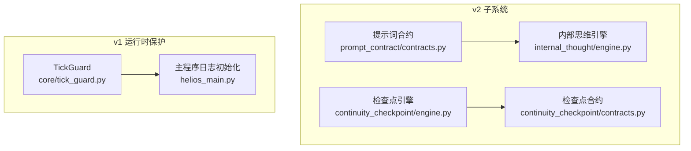
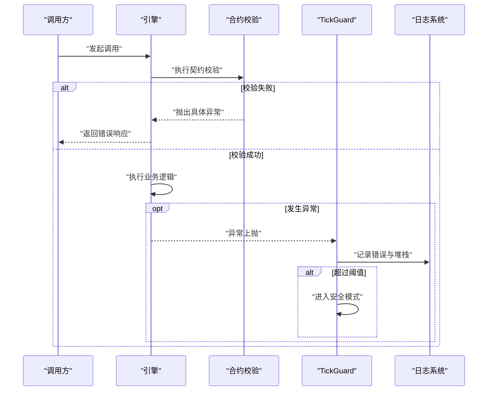
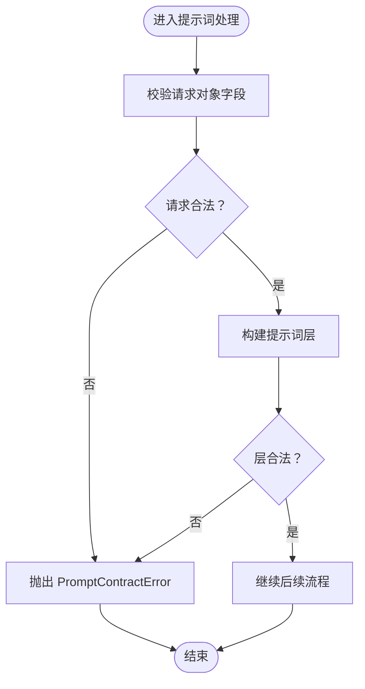
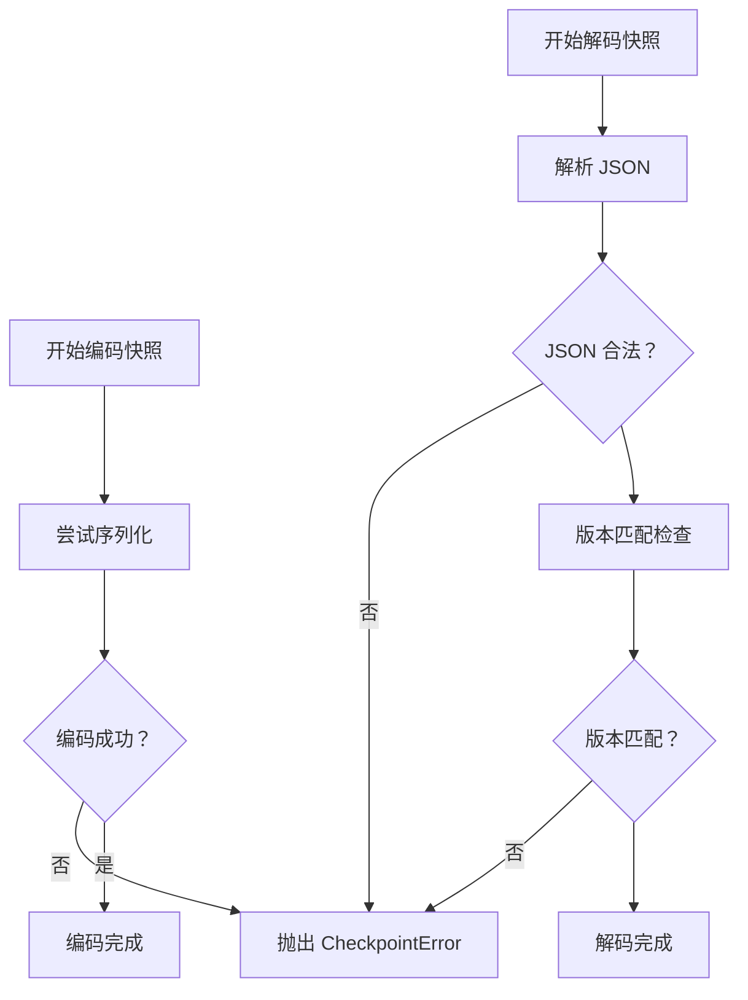
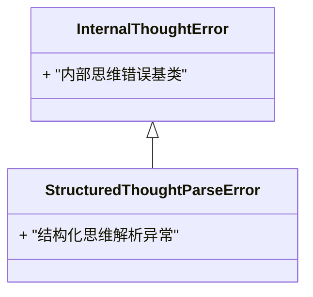
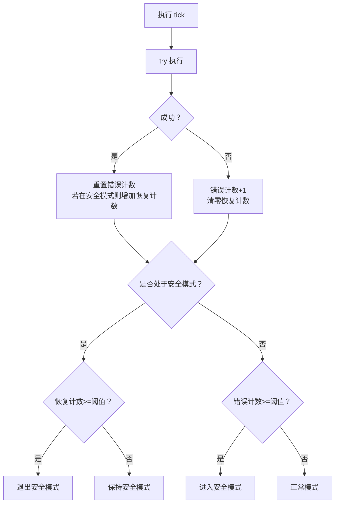
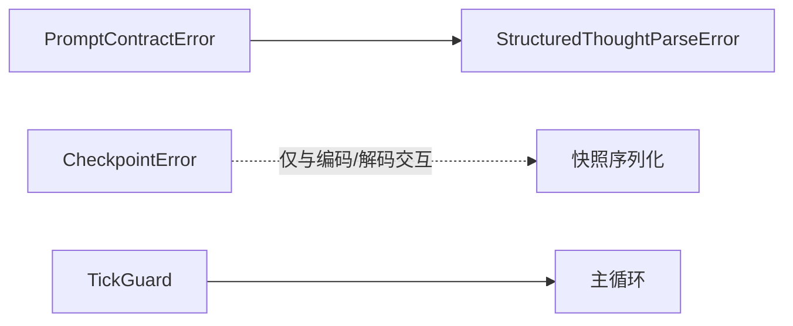

# 错误处理

<cite>
**本文引用的文件**
- [helios_v2/src/helios_v2/prompt_contract/contracts.py](file://helios_v2/src/helios_v2/prompt_contract/contracts.py)
- [helios_v2/src/helios_v2/continuity_checkpoint/engine.py](file://helios_v2/src/helios_v2/continuity_checkpoint/engine.py)
- [helios_v2/src/helios_v2/continuity_checkpoint/contracts.py](file://helios_v2/src/helios_v2/continuity_checkpoint/contracts.py)
- [helios_v2/src/helios_v2/internal_thought/engine.py](file://helios_v2/src/helios_v2/internal_thought/engine.py)
- [archive/helios_v1/core/tick_guard.py](file://archive/helios_v1/core/tick_guard.py)
- [archive/helios_v1/helios_main.py](file://archive/helios_v1/helios_main.py)
- [archive/helios_v1/tests/test_tick_guard.py](file://archive/helios_v1/tests/test_tick_guard.py)
</cite>

## 目录
1. [简介](#简介)
2. [项目结构](#项目结构)
3. [核心组件](#核心组件)
4. [架构总览](#架构总览)
5. [详细组件分析](#详细组件分析)
6. [依赖关系分析](#依赖关系分析)
7. [性能考量](#性能考量)
8. [故障排查指南](#故障排查指南)
9. [结论](#结论)
10. [附录](#附录)

## 简介
本文件为 Helios 错误处理系统的 API 参考与实践指南，聚焦于 v2 模块中的异常类型、错误码与异常处理策略，同时结合 v1 的运行时保护机制（TickGuard）与日志体系，给出可操作的错误预防、降级与优雅关闭建议。重点覆盖以下方面：
- 自定义异常类：如 PromptContractError、CheckpointError、StructuredThoughtParseError 等
- 触发条件与错误消息格式
- 异常传播与恢复策略
- 日志格式与故障诊断工具
- 最佳实践与调试技巧

## 项目结构
Helios 的错误处理分布在两个层面：
- v2 子系统：以“合约”和“引擎”为核心，围绕各子系统（提示词、检查点、内部思维等）定义明确的异常类型与契约校验
- v1 运行时保护：通过 TickGuard 对主循环进行异常保护，实现安全模式与自动恢复

**图表来源**
- [helios_v2/src/helios_v2/prompt_contract/contracts.py](file://helios_v2/src/helios_v2/prompt_contract/contracts.py)
- [helios_v2/src/helios_v2/continuity_checkpoint/engine.py](file://helios_v2/src/helios_v2/continuity_checkpoint/engine.py)
- [helios_v2/src/helios_v2/continuity_checkpoint/contracts.py](file://helios_v2/src/helios_v2/continuity_checkpoint/contracts.py)
- [helios_v2/src/helios_v2/internal_thought/engine.py](file://helios_v2/src/helios_v2/internal_thought/engine.py)
- [archive/helios_v1/core/tick_guard.py](file://archive/helios_v1/core/tick_guard.py)
- [archive/helios_v1/helios_main.py](file://archive/helios_v1/helios_main.py)

**章节来源**
- [helios_v2/src/helios_v2/prompt_contract/contracts.py](file://helios_v2/src/helios_v2/prompt_contract/contracts.py)
- [helios_v2/src/helios_v2/continuity_checkpoint/engine.py](file://helios_v2/src/helios_v2/continuity_checkpoint/engine.py)
- [helios_v2/src/helios_v2/continuity_checkpoint/contracts.py](file://helios_v2/src/helios_v2/continuity_checkpoint/contracts.py)
- [helios_v2/src/helios_v2/internal_thought/engine.py](file://helios_v2/src/helios_v2/internal_thought/engine.py)
- [archive/helios_v1/core/tick_guard.py](file://archive/helios_v1/core/tick_guard.py)
- [archive/helios_v1/helios_main.py](file://archive/helios_v1/helios_main.py)

## 核心组件
- 提示词合约异常 PromptContractError：用于提示词请求与配置的契约校验失败，涵盖请求 ID、消费者类型、层名称与内容等字段的合法性检查
- 检查点异常 CheckpointError：用于运行时连续性快照编码/解码失败或版本不匹配等场景
- 内部思维解析异常 StructuredThoughtParseError：继承自内部思维错误，用于结构化思维输出解析失败
- TickGuard：对主循环 tick 执行进行异常保护，统计连续错误并进入安全模式，达到阈值后自动恢复

**章节来源**
- [helios_v2/src/helios_v2/prompt_contract/contracts.py](file://helios_v2/src/helios_v2/prompt_contract/contracts.py)
- [helios_v2/src/helios_v2/continuity_checkpoint/engine.py](file://helios_v2/src/helios_v2/continuity_checkpoint/engine.py)
- [helios_v2/src/helios_v2/internal_thought/engine.py](file://helios_v2/src/helios_v2/internal_thought/engine.py)
- [archive/helios_v1/core/tick_guard.py](file://archive/helios_v1/core/tick_guard.py)

## 架构总览
Helios 的错误处理采用“分层防护 + 明确异常”的设计：
- 契约层：在输入进入引擎前进行严格校验，抛出语义清晰的异常
- 引擎层：执行业务逻辑，遇到不可恢复错误时向上抛出
- 运行时层：TickGuard 包裹主循环，防止单模块异常导致进程崩溃，并提供安全模式与恢复机制
- 观察层：统一日志格式，便于诊断与审计

**图表来源**
- [archive/helios_v1/core/tick_guard.py](file://archive/helios_v1/core/tick_guard.py)
- [archive/helios_v1/helios_main.py](file://archive/helios_v1/helios_main.py)

## 详细组件分析

### 提示词合约异常 PromptContractError
- 定义位置：helios_v2/src/helios_v2/prompt_contract/contracts.py
- 触发条件
  - 请求 ID 为空或非法
  - 消费者类型不在固定分类中
  - 层名称为空或内容为空
  - 合同 ID、能力快照等关键字段缺失或非法
- 错误消息格式
  - 统一以 PromptContractError 包装，消息描述具体字段与期望值
- 恢复建议
  - 在调用前严格校验请求对象字段
  - 使用契约定义的枚举与约束，避免非法值
  - 记录并上报异常以便定位上游数据源问题

**图表来源**
- [helios_v2/src/helios_v2/prompt_contract/contracts.py](file://helios_v2/src/helios_v2/prompt_contract/contracts.py)

**章节来源**
- [helios_v2/src/helios_v2/prompt_contract/contracts.py](file://helios_v2/src/helios_v2/prompt_contract/contracts.py)

### 检查点异常 CheckpointError
- 定义位置：helios_v2/src/helios_v2/continuity_checkpoint/engine.py
- 触发条件
  - 快照编码阶段发生类型或值错误
  - 解码阶段遇到非 JSON、非对象负载或版本不匹配
- 错误消息格式
  - 包含“无法编码/解码运行时连续性快照”的上下文信息
- 恢复建议
  - 检查快照数据结构与序列化器兼容性
  - 在升级或迁移时确保版本字段一致
  - 失败时回退到最近一次成功的快照

**图表来源**
- [helios_v2/src/helios_v2/continuity_checkpoint/engine.py](file://helios_v2/src/helios_v2/continuity_checkpoint/engine.py)

**章节来源**
- [helios_v2/src/helios_v2/continuity_checkpoint/engine.py](file://helios_v2/src/helios_v2/continuity_checkpoint/engine.py)

### 内部思维解析异常 StructuredThoughtParseError
- 定义位置：helios_v2/src/helios_v2/internal_thought/engine.py
- 触发条件
  - 结构化思维输出解析失败（例如格式不符合预期）
- 错误消息格式
  - 继承自内部思维错误，消息描述解析失败的具体位置或原因
- 恢复建议
  - 校验上游生成器的输出格式
  - 在解析前进行预过滤与容错处理
  - 记录原始输出以便人工复核

**图表来源**
- [helios_v2/src/helios_v2/internal_thought/engine.py](file://helios_v2/src/helios_v2/internal_thought/engine.py)

**章节来源**
- [helios_v2/src/helios_v2/internal_thought/engine.py](file://helios_v2/src/helios_v2/internal_thought/engine.py)

### TickGuard 运行时保护
- 定义位置：archive/helios_v1/core/tick_guard.py
- 功能要点
  - 对每个 tick 执行进行异常捕获
  - 统计连续错误次数，超过阈值进入安全模式
  - 在安全模式下减少非必要模块执行；连续成功达到阈值后自动退出安全模式
- 日志与可观测性
  - 主程序日志初始化包含文件与控制台处理器，统一格式
  - 安全模式入口会记录严重级别日志，便于监控告警

**图表来源**
- [archive/helios_v1/core/tick_guard.py](file://archive/helios_v1/core/tick_guard.py)
- [archive/helios_v1/helios_main.py](file://archive/helios_v1/helios_main.py)

**章节来源**
- [archive/helios_v1/core/tick_guard.py](file://archive/helios_v1/core/tick_guard.py)
- [archive/helios_v1/helios_main.py](file://archive/helios_v1/helios_main.py)
- [archive/helios_v1/tests/test_tick_guard.py](file://archive/helios_v1/tests/test_tick_guard.py)

## 依赖关系分析
- 提示词合约异常与内部思维解析异常均位于 v2 子系统，彼此无直接耦合，但都遵循“先契约后引擎”的模式
- 检查点异常独立于其他子系统，仅与快照编码/解码流程交互
- TickGuard 作为运行时保护横切组件，被主循环调用，不依赖具体业务模块

**图表来源**
- [helios_v2/src/helios_v2/prompt_contract/contracts.py](file://helios_v2/src/helios_v2/prompt_contract/contracts.py)
- [helios_v2/src/helios_v2/internal_thought/engine.py](file://helios_v2/src/helios_v2/internal_thought/engine.py)
- [helios_v2/src/helios_v2/continuity_checkpoint/engine.py](file://helios_v2/src/helios_v2/continuity_checkpoint/engine.py)
- [archive/helios_v1/core/tick_guard.py](file://archive/helios_v1/core/tick_guard.py)

**章节来源**
- [helios_v2/src/helios_v2/prompt_contract/contracts.py](file://helios_v2/src/helios_v2/prompt_contract/contracts.py)
- [helios_v2/src/helios_v2/internal_thought/engine.py](file://helios_v2/src/helios_v2/internal_thought/engine.py)
- [helios_v2/src/helios_v2/continuity_checkpoint/engine.py](file://helios_v2/src/helios_v2/continuity_checkpoint/engine.py)
- [archive/helios_v1/core/tick_guard.py](file://archive/helios_v1/core/tick_guard.py)

## 性能考量
- 异常捕获与日志写入存在开销，应避免在热路径频繁抛错
- TickGuard 的阈值需结合系统稳定性与恢复时间权衡，过高会导致恢复缓慢，过低可能频繁进入/退出安全模式
- 快照编码/解码失败应尽量在开发期通过契约校验拦截，减少运行期异常

## 故障排查指南
- 快照相关问题
  - 现象：编码/解码失败或版本不匹配
  - 排查：确认快照数据结构与序列化器版本一致；查看 CheckpointError 上下文
- 提示词相关问题
  - 现象：请求 ID、消费者类型、层名称或内容为空/非法
  - 排查：对照契约定义逐项校验；记录并上报异常以便定位上游
- 内部思维解析问题
  - 现象：结构化输出解析失败
  - 排查：检查上游生成器输出格式；记录原始输出进行人工复核
- 运行时保护问题
  - 现象：系统频繁进入/退出安全模式
  - 排查：查看日志中安全模式入口记录；评估阈值设置与模块健康度

**章节来源**
- [helios_v2/src/helios_v2/continuity_checkpoint/engine.py](file://helios_v2/src/helios_v2/continuity_checkpoint/engine.py)
- [helios_v2/src/helios_v2/prompt_contract/contracts.py](file://helios_v2/src/helios_v2/prompt_contract/contracts.py)
- [helios_v2/src/helios_v2/internal_thought/engine.py](file://helios_v2/src/helios_v2/internal_thought/engine.py)
- [archive/helios_v1/core/tick_guard.py](file://archive/helios_v1/core/tick_guard.py)
- [archive/helios_v1/helios_main.py](file://archive/helios_v1/helios_main.py)

## 结论
Helios 的错误处理体系以“契约先行、异常明确、运行时保护、可观测可诊断”为核心原则。v2 子系统通过严格的契约校验与清晰的异常类型，将常见错误前置化；TickGuard 则保障了主循环的鲁棒性。配合统一的日志格式与测试验证，能够有效提升系统的稳定性与可维护性。

## 附录
- 最佳实践
  - 在输入端强制执行契约校验，尽早暴露问题
  - 为关键异常定义稳定的错误消息格式，便于日志检索与告警
  - 使用 TickGuard 防止单点异常引发级联故障
  - 对快照与序列化进行版本管理，避免解码失败
- 调试技巧
  - 利用测试用例覆盖异常分支，确保异常路径可验证
  - 在安全模式入口处增加日志级别，便于快速定位
  - 对内部思维解析失败保留原始输出，支持离线复盘