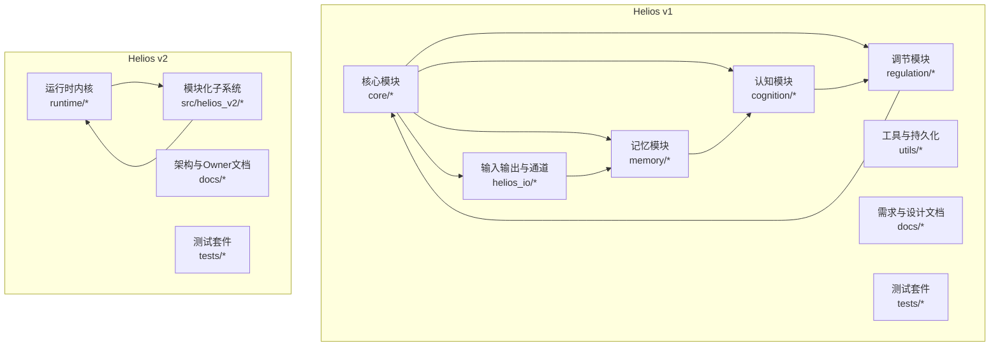
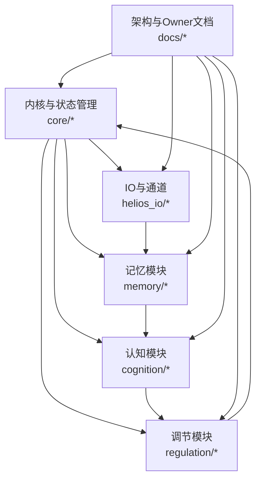
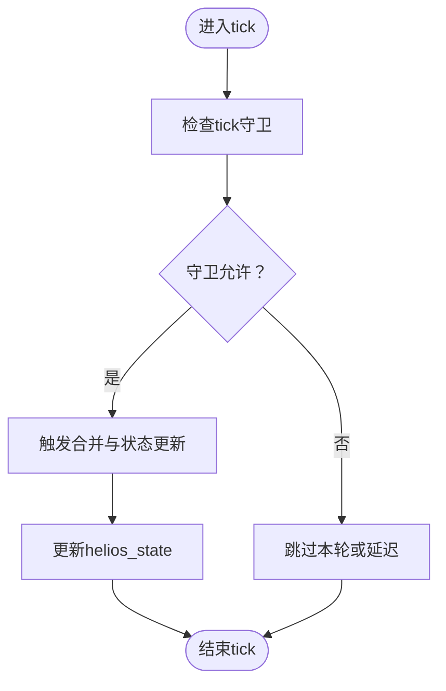
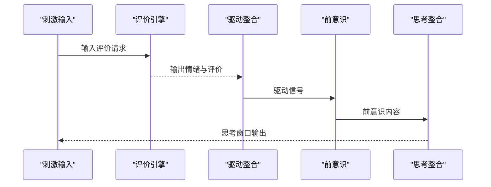
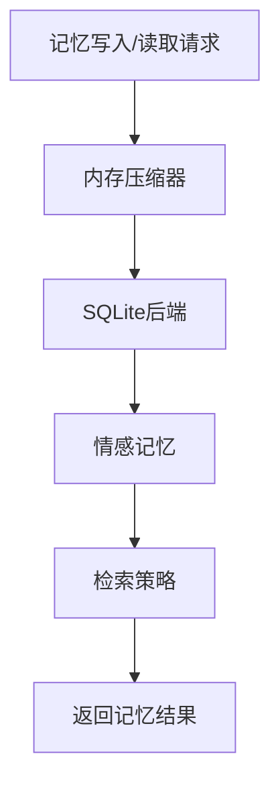
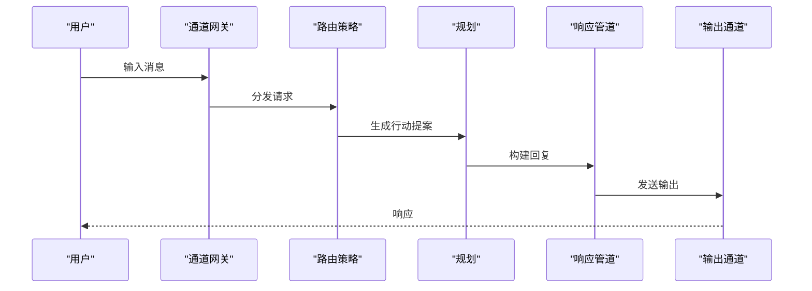
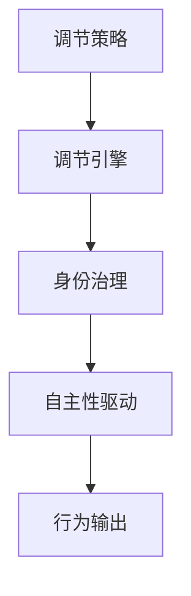
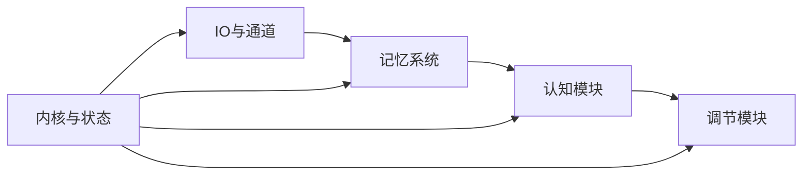

# 代码贡献

<cite>
**本文引用的文件**
- [README.md](file://README.md)
- [archive/helios_v1/README.md](file://archive/helios_v1/README.md)
- [archive/helios_v1/docs/index.md](file://archive/helios_v1/docs/index.md)
- [archive/helios_v1/docs/IMPLEMENTATION_ROADMAP.zh-CN.md](file://archive/helios_v1/docs/IMPLEMENTATION_ROADMAP.zh-CN.md)
- [archive/helios_v1/docs/MODULE_REVIEW_MATRIX.zh-CN.md](file://archive/helios_v1/docs/MODULE_REVIEW_MATRIX.zh-CN.md)
- [archive/helios_v1/docs/ARCHITECTURE_PHILOSOPHY.zh-CN.md](file://archive/helios_v1/docs/ARCHITECTURE_PHILOSOPHY.zh-CN.md)
- [archive/helios_v1/docs/BRAIN_ARCHITECTURE_COMPARISON.zh-CN.md](file://archive/helios_v1/docs/BRAIN_ARCHITECTURE_COMPARISON.zh-CN.md)
- [archive/helios_v1/docs/requirements/07-consciousness-first-llm-loop/design.md](file://archive/helios_v1/docs/requirements/07-consciousness-first-llm-loop/design.md)
- [archive/helios_v1/docs/requirements/07-consciousness-first-llm-loop/requirement.md](file://archive/helios_v1/docs/requirements/07-consciousness-first-llm-loop/requirement.md)
- [archive/helios_v1/docs/requirements/07-consciousness-first-llm-loop/task.md](file://archive/helios_v1/docs/requirements/07-consciousness-first-llm-loop/task.md)
- [archive/helios_v1/docs/requirements/08-stimulus-weighting-and-thought-gating/design.md](file://archive/helios_v1/docs/requirements/08-stimulus-weighting-and-thought-gating/design.md)
- [archive/helios_v1/docs/requirements/08-stimulus-weighting-and-thought-gating/requirement.md](file://archive/helios_v1/docs/requirements/08-stimulus-weighting-and-thought-gating/requirement.md)
- [archive/helios_v1/docs/requirements/08-stimulus-weighting-and-thought-gating/task.md](file://archive/helios_v1/docs/requirements/08-stimulus-weighting-and-thought-gating/task.md)
- [archive/helios_v1/helios_main.py](file://archive/helios_v1/helios_main.py)
- [archive/helios_v1/helios_io/channels/cli_channel.py](file://archive/helios_v1/helios_io/channels/cli_channel.py)
- [archive/helios_v1/memory/memory_system.py](file://archive/helios_v1/memory/memory_system.py)
- [archive/helios_v1/cognition/appraisal.py](file://archive/helios_v1/cognition/appraisal.py)
- [archive/helios_v1/regulation/policy.py](file://archive/helios_v1/regulation/policy.py)
- [archive/helios_v1/utils/helios_utils.py](file://archive/helios_v1/utils/helios_utils.py)
- [archive/helios_v1/tests/test_cli_channel.py](file://archive/helios_v1/tests/test_cli_channel.py)
- [archive/helios_v1/tests/test_memory_system.py](file://archive/helios_v1/tests/test_memory_system.py)
- [archive/helios_v1/tests/test_appraisal.py](file://archive/helios_v1/tests/test_appraisal.py)
- [archive/helios_v1/scripts/run_tests_isolated.ps1](file://archive/helios_v1/scripts/run_tests_isolated.ps1)
- [archive/helios_v1/scripts/run_live_smoke.ps1](file://archive/helios_v1/scripts/run_live_smoke.ps1)
- [archive/helios_v1/helios_evaluation/cli_brain_like_evaluation.py](file://archive/helios_v1/helios_evaluation/cli_brain_like_evaluation.py)
- [archive/helios_v1/helios_io/channel_gateway.py](file://archive/helios_v1/helios_io/channel_gateway.py)
- [archive/helios_v1/helios_io/planning.py](file://archive/helios_v1/helios_io/planning.py)
- [archive/helios_v1/helios_io/routing_policy.py](file://archive/helios_v1/helios_io/routing_policy.py)
- [archive/helios_v1/helios_io/interaction_policy.py](file://archive/helios_v1/helios_io/interaction_policy.py)
- [archive/helios_v1/helios_io/response_pipeline.py](file://archive/helios_v1/helios_io/response_pipeline.py)
- [archive/helios_v1/helios_io/action_models.py](file://archive/helios_v1/helios_io/action_models.py)
- [archive/helios_v1/helios_io/optional_channel_bootstrap.py](file://archive/helios_v1/helios_io/optional_channel_bootstrap.py)
- [archive/helios_v1/helios_io/optional_channel_contract.py](file://archive/helios_v1/helios_io/optional_channel_contract.py)
- [archive/helios_v1/helios_io/prompt_contract.py](file://archive/helios_v1/helios_io/prompt_contract.py)
- [archive/helios_v1/helios_io/limb.py](file://archive/helios_v1/helios_io/limb.py)
- [archive/helios_v1/helios_io/limb_decision_bridge.py](file://archive/helios_v1/helios_io/limb_decision_bridge.py)
- [archive/helios_v1/helios_io/expression_modulation.py](file://archive/helios_v1/helios_io/expression_modulation.py)
- [archive/helios_v1/helios_io/feedback_recorder.py](file://archive/helios_v1/helios_io/feedback_recorder.py)
- [archive/helios_v1/helios_io/icri_temperature.py](file://archive/helios_v1/helios_io/icri_temperature.py)
- [archive/helios_v1/helios_io/bootstrap_behavior_specs.py](file://archive/helios_v1/helios_io/bootstrap_behavior_specs.py)
- [archive/helios_v1/helios_io/llm_debug.py](file://archive/helios_v1/helios_io/llm_debug.py)
- [archive/helios_v1/helios_io/llm/speech.py](file://archive/helios_v1/helios_io/llm/speech.py)
- [archive/helios_v1/helios_io/protocols/qq.py](file://archive/helios_v1/helios_io/protocols/qq.py)
- [archive/helios_v1/helios_io/channels/inbound_text_annotation.py](file://archive/helios_v1/helios_io/channels/inbound_text_annotation.py)
- [archive/helios_v1/helios_io/channels/qq_channel.py](file://archive/helios_v1/helios_io/channels/qq_channel.py)
- [archive/helios_v1/helios_io/channels/stt_channel.py](file://archive/helios_v1/helios_io/channels/stt_channel.py)
- [archive/helios_v1/helios_io/channels/tts_channel.py](file://archive/helios_v1/helios_io/channels/tts_channel.py)
- [archive/helios_v1/helios_io/channels/vision_channel.py](file://archive/helios_v1/helios_io/channels/vision_channel.py)
- [archive/helios_v1/memory/memory_compressor.py](file://archive/helios_v1/memory/memory_compressor.py)
- [archive/helios_v1/memory/sqlite_backend.py](file://archive/helios_v1/memory/sqlite_backend.py)
- [archive/helios_v1/memory/emotional_memory.py](file://archive/helios_v1/memory/emotional_memory.py)
- [archive/helios_v1/memory/retrieval.py](file://archive/helios_v1/memory/retrieval.py)
- [archive/helios_v1/memory/seed_memory_importer.py](file://archive/helios_v1/memory/seed_memory_importer.py)
- [archive/helios_v1/memory/backend.py](file://archive/helios_v1/memory/backend.py)
- [archive/helios_v1/cognition/drives.py](file://archive/helios_v1/cognition/drives.py)
- [archive/helios_v1/cognition/preconscious.py](file://archive/helios_v1/cognition/preconscious.py)
- [archive/helios_v1/cognition/thinking_integration.py](file://archive/helios_v1/cognition/thinking_integration.py)
- [archive/helios_v1/cognition/phi.py](file://archive/helios_v1/cognition/phi.py)
- [archive/helios_v1/core/helios_state.py](file://archive/helios_v1/core/helios_state.py)
- [archive/helios_v1/core/temporal_dynamics.py](file://archive/helios_v1/core/temporal_dynamics.py)
- [archive/helios_v1/core/tick_guard.py](file://archive/helios_v1/core/tick_guard.py)
- [archive/helios_v1/core/trigger_merge.py](file://archive/helios_v1/core/trigger_merge.py)
- [archive/helios_v1/core/event_source.py](file://archive/helios_v1/core/event_source.py)
- [archive/helios_v1/core/separation_source.py](file://archive/helios_v1/core/separation_source.py)
- [archive/helios_v1/core/drive_source.py](file://archive/helios_v1/core/drive_source.py)
- [archive/helios_v1/personality.py](file://archive/helios_v1/personality.py)
- [archive/helios_v1/personality_contract.py](file://archive/helios_v1/personality_contract.py)
- [archive/helios_v1/personality_projection.py](file://archive/helios_v1/personality_projection.py)
- [archive/helios_v1/identity_governance.py](file://archive/helios_v1/identity_governance.py)
- [archive/helios_v1/neurochem.py](file://archive/helios_v1/neurochem.py)
- [archive/helios_v1/neurochem_gate.py](file://archive/helios_v1/neurochem_gate.py)
- [archive/helios_v1/daisy_emotion.py](file://archive/helios_v1/daisy_emotion.py)
- [archive/helios_v1/mood_tracker.py](file://archive/helios_v1/mood_tracker.py)
- [archive/helios_v1/habituation.py](file://archive/helios_v1/habituation.py)
- [archive/helios_v1/temporal_gate.py](file://archive/helios_v1/temporal_gate.py)
- [archive/helios_v1/utils/persistence.py](file://archive/helios_v1/utils/persistence.py)
- [archive/helios_v1/utils/stability_monitor.py](file://archive/helios_v1/utils/stability_monitor.py)
- [archive/helios_v1/heliosd.sh](file://archive/helios_v1/heliosd.sh)
- [archive/helios_v1/helios.service](file://archive/helios_v1/helios.service)
- [archive/helios_v1/helios.logrotate](file://archive/helios_v1/helios.logrotate)
- [archive/helios_v1/dashboard.py](file://archive/helios_v1/dashboard.py)
- [archive/helios_v1/dashboard.html](file://archive/helios_v1/dashboard.html)
- [archive/helios_v1/scripts/init_behavior_registry.py](file://archive/helios_v1/scripts/init_behavior_registry.py)
- [archive/helios_v1/scripts/init_memory_backend.py](file://archive/helios_v1/scripts/init_memory_backend.py)
- [archive/helios_v1/behavior_registry/runtime_catalog.py](file://archive/helios_v1/behavior_registry/runtime_catalog.py)
- [archive/helios_v1/behavior_registry/sqlite_registry.py](file://archive/helios_v1/behavior_registry/sqlite_registry.py)
- [archive/helios_v1/behavior_registry/records.py](file://archive/helios_v1/behavior_registry/records.py)
- [archive/helios_v1/regulation/regulation.py](file://archive/helios_v1/regulation/regulation.py)
- [archive/helios_v1/regulation/constants.py](file://archive/helios_v1/regulation/constants.py)
- [archive/helios_v1/core/trigger_merge.py](file://archive/helios_v1/core/trigger_merge.py)
- [archive/helios_v1/core/tick_guard.py](file://archive/helios_v1/core/tick_guard.py)
- [archive/helios_v1/core/temporal_dynamics.py](file://archive/helios_v1/core/temporal_dynamics.py)
- [archive/helios_v1/core/helios_state.py](file://archive/helios_v1/core/helios_state.py)
- [archive/helios_v1/core/event_source.py](file://archive/helios_v1/core/event_source.py)
- [archive/helios_v1/core/separation_source.py](file://archive/helios_v1/core/separation_source.py)
- [archive/helios_v1/core/drive_source.py](file://archive/helios_v1/core/drive_source.py)
- [archive/helios_v1/cognition/appraisal.py](file://archive/helios_v1/cognition/appraisal.py)
- [archive/helios_v1/cognition/drives.py](file://archive/helios_v1/cognition/drives.py)
- [archive/helios_v1/cognition/preconscious.py](file://archive/helios_v1/cognition/preconscious.py)
- [archive/helios_v1/cognition/thinking_integration.py](file://archive/helios_v1/cognition/thinking_integration.py)
- [archive/helios_v1/cognition/phi.py](file://archive/helios_v1/cognition/phi.py)
- [archive/helios_v1/memory/memory_system.py](file://archive/helios_v1/memory/memory_system.py)
- [archive/helios_v1/memory/memory_compressor.py](file://archive/helios_v1/memory/memory_compressor.py)
- [archive/helios_v1/memory/sqlite_backend.py](file://archive/helios_v1/memory/sqlite_backend.py)
- [archive/helios_v1/memory/emotional_memory.py](file://archive/helios_v1/memory/emotional_memory.py)
- [archive/helios_v1/memory/retrieval.py](file://archive/helios_v1/memory/retrieval.py)
- [archive/helios_v1/memory/seed_memory_importer.py](file://archive/helios_v1/memory/seed_memory_importer.py)
- [archive/helios_v1/memory/backend.py](file://archive/helios_v1/memory/backend.py)
- [archive/helios_v1/helios_io/channel_gateway.py](file://archive/helios_v1/helios_io/channel_gateway.py)
- [archive/helios_v1/helios_io/planning.py](file://archive/helios_v1/helios_io/planning.py)
- [archive/helios_v1/helios_io/routing_policy.py](file://archive/helios_v1/helios_io/routing_policy.py)
- [archive/helios_v1/helios_io/interaction_policy.py](file://archive/helios_v1/helios_io/interaction_policy.py)
- [archive/helios_v1/helios_io/response_pipeline.py](file://archive/helios_v1/helios_io/response_pipeline.py)
- [archive/helios_v1/helios_io/action_models.py](file://archive/helios_v1/helios_io/action_models.py)
- [archive/helios_v1/helios_io/optional_channel_bootstrap.py](file://archive/helios_v1/helios_io/optional_channel_bootstrap.py)
- [archive/helios_v1/helios_io/optional_channel_contract.py](file://archive/helios_v1/helios_io/optional_channel_contract.py)
- [archive/helios_v1/helios_io/prompt_contract.py](file://archive/helios_v1/helios_io/prompt_contract.py)
- [archive/helios_v1/helios_io/limb.py](file://archive/helios_v1/helios_io/limb.py)
- [archive/helios_v1/helios_io/limb_decision_bridge.py](file://archive/helios_v1/helios_io/limb_decision_bridge.py)
- [archive/helios_v1/helios_io/expression_modulation.py](file://archive/helios_v1/helios_io/expression_modulation.py)
- [archive/helios_v1/helios_io/feedback_recorder.py](file://archive/helios_v1/helios_io/feedback_recorder.py)
- [archive/helios_v1/helios_io/icri_temperature.py](file://archive/helios_v1/helios_io/icri_temperature.py)
- [archive/helios_v1/helios_io/bootstrap_behavior_specs.py](file://archive/helios_v1/helios_io/bootstrap_behavior_specs.py)
- [archive/helios_v1/helios_io/llm_debug.py](file://archive/helios_v1/helios_io/llm_debug.py)
- [archive/helios_v1/helios_io/llm/speech.py](file://archive/helios_v1/helios_io/llm/speech.py)
- [archive/helios_v1/helios_io/protocols/qq.py](file://archive/helios_v1/helios_io/protocols/qq.py)
- [archive/helios_v1/helios_io/channels/inbound_text_annotation.py](file://archive/helios_v1/helios_io/channels/inbound_text_annotation.py)
- [archive/helios_v1/helios_io/channels/qq_channel.py](file://archive/helios_v1/helios_io/channels/qq_channel.py)
- [archive/helios_v1/helios_io/channels/stt_channel.py](file://archive/helios_v1/helios_io/channels/stt_channel.py)
- [archive/helios_v1/helios_io/channels/tts_channel.py](file://archive/helios_v1/helios_io/channels/tts_channel.py)
- [archive/helios_v1/helios_io/channels/vision_channel.py](file://archive/helios_v1/helios_io/channels/vision_channel.py)
- [archive/helios_v1/helios_evaluation/cli_brain_like_evaluation.py](file://archive/helios_v1/helios_evaluation/cli_brain_like_evaluation.py)
- [archive/helios_v1/utils/helios_utils.py](file://archive/helios_v1/utils/helios_utils.py)
- [archive/helios_v1/utils/persistence.py](file://archive/helios_v1/utils/persistence.py)
- [archive/helios_v1/utils/stability_monitor.py](file://archive/helios_v1/utils/stability_monitor.py)
- [archive/helios_v1/regulation/policy.py](file://archive/helios_v1/regulation/policy.py)
- [archive/helios_v1/regulation/regulation.py](file://archive/helios_v1/regulation/regulation.py)
- [archive/helios_v1/regulation/constants.py](file://archive/helios_v1/regulation/constants.py)
- [archive/helios_v1/personality.py](file://archive/helios_v1/personality.py)
- [archive/helios_v1/personality_contract.py](file://archive/helios_v1/personality_contract.py)
- [archive/helios_v1/personality_projection.py](file://archive/helios_v1/personality_projection.py)
- [archive/helios_v1/identity_governance.py](file://archive/helios_v1/identity_governance.py)
- [archive/helios_v1/neurochem.py](file://archive/helios_v1/neurochem.py)
- [archive/helios_v1/neurochem_gate.py](file://archive/helios_v1/neurochem_gate.py)
- [archive/helios_v1/daisy_emotion.py](file://archive/helios_v1/daisy_emotion.py)
- [archive/helios_v1/mood_tracker.py](file://archive/helios_v1/mood_tracker.py)
- [archive/helios_v1/habituation.py](file://archive/helios_v1/habituation.py)
- [archive/helios_v1/temporal_gate.py](file://archive/helios_v1/temporal_gate.py)
- [archive/helios_v1/heliosd.sh](file://archive/helios_v1/heliosd.sh)
- [archive/helios_v1/helios.service](file://archive/helios_v1/helios.service)
- [archive/helios_v1/helios.logrotate](file://archive/helios_v1/helios.logrotate)
- [archive/helios_v1/dashboard.py](file://archive/helios_v1/dashboard.py)
- [archive/helios_v1/dashboard.html](file://archive/helios_v1/dashboard.html)
- [archive/helios_v1/scripts/init_behavior_registry.py](file://archive/helios_v1/scripts/init_behavior_registry.py)
- [archive/helios_v1/scripts/init_memory_backend.py](file://archive/helios_v1/scripts/init_memory_backend.py)
- [archive/helios_v1/behavior_registry/runtime_catalog.py](file://archive/helios_v1/behavior_registry/runtime_catalog.py)
- [archive/helios_v1/behavior_registry/sqlite_registry.py](file://archive/helios_v1/behavior_registry/sqlite_registry.py)
- [archive/helios_v1/behavior_registry/records.py](file://archive/helios_v1/behavior_registry/records.py)
- [archive/helios_v1/tests/test_cli_channel.py](file://archive/helios_v1/tests/test_cli_channel.py)
- [archive/helios_v1/tests/test_memory_system.py](file://archive/helios_v1/tests/test_memory_system.py)
- [archive/helios_v1/tests/test_appraisal.py](file://archive/helios_v1/tests/test_appraisal.py)
- [archive/helios_v1/scripts/run_tests_isolated.ps1](file://archive/helios_v1/scripts/run_tests_isolated.ps1)
- [archive/helios_v1/scripts/run_live_smoke.ps1](file://archive/helios_v1/scripts/run_live_smoke.ps1)
</cite>

## 目录
1. 引言
2. 项目结构
3. 核心组件
4. 架构总览
5. 详细组件分析
6. 依赖关系分析
7. 性能考虑
8. 故障排查指南
9. 结论
10. 附录

## 引言
本贡献指南面向Helios项目的开发者与维护者，旨在建立统一的代码风格、提交规范、分支与合并流程、代码评审标准、文档更新与版本发布流程。Helios由v1与v2两个主要版本构成：v1以模块化子系统为核心（感知、记忆、认知、调节等），v2则采用更清晰的运行时内核与模块化子系统组合方式。本指南既覆盖v1的历史实现与文档，也结合v2的架构边界与Owner文档，帮助贡献者在不同阶段高效协作。

## 项目结构
Helios仓库包含两套主要实现与配套文档：
- v1：以“子系统+通道+内存+评估”为主线，模块化程度高，便于按功能域扩展与测试。
- v2：以“运行时内核+模块化子系统组合”为主，强调可组合性、可观测性与边界清晰。

下图给出概念性结构示意（非特定源码映射）：

章节来源
- [README.md](file://README.md)
- [archive/helios_v1/README.md](file://archive/helios_v1/README.md)
- [archive/helios_v1/docs/index.md](file://archive/helios_v1/docs/index.md)

## 核心组件
- 运行时内核与状态管理：负责tick推进、状态流转与边界保护，确保系统稳定与可恢复。
- 认知与情绪：包括快速评价、驱动整合、前意识处理与思考整合，形成主观体验与决策基础。
- 记忆系统：涵盖工作记忆、情节记忆、语义记忆与情感记忆，支持压缩、检索与持久化。
- 输入输出与通道：CLI、QQ、语音识别/合成、视觉等多模态通道，以及响应管道与表达调制。
- 调节与身份治理：基于规则的调节策略、身份治理与自主性驱动，保障行为一致性与自我演进。
- 工具与评估：日志轮转、服务脚本、仪表盘、脑式评估与稳定性监控等。

章节来源
- [archive/helios_v1/core/helios_state.py](file://archive/helios_v1/core/helios_state.py)
- [archive/helios_v1/core/temporal_dynamics.py](file://archive/helios_v1/core/temporal_dynamics.py)
- [archive/helios_v1/cognition/appraisal.py](file://archive/helios_v1/cognition/appraisal.py)
- [archive/helios_v1/cognition/drives.py](file://archive/helios_v1/cognition/drives.py)
- [archive/helios_v1/cognition/preconscious.py](file://archive/helios_v1/cognition/preconscious.py)
- [archive/helios_v1/cognition/thinking_integration.py](file://archive/helios_v1/cognition/thinking_integration.py)
- [archive/helios_v1/memory/memory_system.py](file://archive/helios_v1/memory/memory_system.py)
- [archive/helios_v1/memory/memory_compressor.py](file://archive/helios_v1/memory/memory_compressor.py)
- [archive/helios_v1/memory/sqlite_backend.py](file://archive/helios_v1/memory/sqlite_backend.py)
- [archive/helios_v1/helios_io/channel_gateway.py](file://archive/helios_v1/helios_io/channel_gateway.py)
- [archive/helios_v1/helios_io/response_pipeline.py](file://archive/helios_v1/helios_io/response_pipeline.py)
- [archive/helios_v1/helios_io/interaction_policy.py](file://archive/helios_v1/helios_io/interaction_policy.py)
- [archive/helios_v1/regulation/policy.py](file://archive/helios_v1/regulation/policy.py)
- [archive/helios_v1/identity_governance.py](file://archive/helios_v1/identity_governance.py)
- [archive/helios_v1/utils/stability_monitor.py](file://archive/helios_v1/utils/stability_monitor.py)

## 架构总览
Helios采用“内核驱动+模块化子系统”的分层架构：
- 内核层：负责时间推进、状态管理与边界守卫，保证系统一致性与可恢复性。
- 子系统层：认知、记忆、IO、调节等模块通过契约与桥接协同工作。
- 文档与Owner：明确模块边界、所有者与职责，确保演化可控。

图表来源
- [archive/helios_v1/core/helios_state.py](file://archive/helios_v1/core/helios_state.py)
- [archive/helios_v1/core/temporal_dynamics.py](file://archive/helios_v1/core/temporal_dynamics.py)
- [archive/helios_v1/cognition/appraisal.py](file://archive/helios_v1/cognition/appraisal.py)
- [archive/helios_v1/memory/memory_system.py](file://archive/helios_v1/memory/memory_system.py)
- [archive/helios_v1/helios_io/channel_gateway.py](file://archive/helios_v1/helios_io/channel_gateway.py)
- [archive/helios_v1/regulation/policy.py](file://archive/helios_v1/regulation/policy.py)

章节来源
- [archive/helios_v1/docs/ARCHITECTURE_PHILOSOPHY.zh-CN.md](file://archive/helios_v1/docs/ARCHITECTURE_PHILOSOPHY.zh-CN.md)
- [archive/helios_v1/docs/BRAIN_ARCHITECTURE_COMPARISON.zh-CN.md](file://archive/helios_v1/docs/BRAIN_ARCHITECTURE_COMPARISON.zh-CN.md)
- [archive/helios_v1/docs/index.md](file://archive/helios_v1/docs/index.md)

## 详细组件分析

### 组件A：运行时内核与状态管理
- 职责：推进tick、管理helios_state、执行边界守卫与触发合并，确保系统在时间维度上的连续与稳定。
- 关键点：时间动态、tick守卫、触发合并、事件源与分离源的集成。
- 评审要点：状态一致性、边界守卫逻辑、异常恢复路径。

图表来源
- [archive/helios_v1/core/tick_guard.py](file://archive/helios_v1/core/tick_guard.py)
- [archive/helios_v1/core/trigger_merge.py](file://archive/helios_v1/core/trigger_merge.py)
- [archive/helios_v1/core/helios_state.py](file://archive/helios_v1/core/helios_state.py)

章节来源
- [archive/helios_v1/core/helios_state.py](file://archive/helios_v1/core/helios_state.py)
- [archive/helios_v1/core/temporal_dynamics.py](file://archive/helios_v1/core/temporal_dynamics.py)
- [archive/helios_v1/core/tick_guard.py](file://archive/helios_v1/core/tick_guard.py)
- [archive/helios_v1/core/trigger_merge.py](file://archive/helios_v1/core/trigger_merge.py)

### 组件B：认知与情绪（快速评价、驱动整合）
- 职责：对内外刺激进行快速评价，生成情绪与驱动信号；整合驱动与前意识信息，形成思考窗口。
- 关键点：评价引擎、驱动模型、前意识处理、思考整合。
- 评审要点：评价一致性、驱动与情绪耦合、跨模块契约。

图表来源
- [archive/helios_v1/cognition/appraisal.py](file://archive/helios_v1/cognition/appraisal.py)
- [archive/helios_v1/cognition/drives.py](file://archive/helios_v1/cognition/drives.py)
- [archive/helios_v1/cognition/preconscious.py](file://archive/helios_v1/cognition/preconscious.py)
- [archive/helios_v1/cognition/thinking_integration.py](file://archive/helios_v1/cognition/thinking_integration.py)

章节来源
- [archive/helios_v1/cognition/appraisal.py](file://archive/helios_v1/cognition/appraisal.py)
- [archive/helios_v1/cognition/drives.py](file://archive/helios_v1/cognition/drives.py)
- [archive/helios_v1/cognition/preconscious.py](file://archive/helios_v1/cognition/preconscious.py)
- [archive/helios_v1/cognition/thinking_integration.py](file://archive/helios_v1/cognition/thinking_integration.py)

### 组件C：记忆系统（工作记忆、情节记忆、情感记忆）
- 职责：管理工作记忆、情节记忆与语义记忆，支持压缩、检索与持久化。
- 关键点：内存压缩器、SQLite后端、情感记忆、检索策略、种子导入器。
- 评审要点：压缩算法正确性、检索性能、持久化一致性。

图表来源
- [archive/helios_v1/memory/memory_compressor.py](file://archive/helios_v1/memory/memory_compressor.py)
- [archive/helios_v1/memory/sqlite_backend.py](file://archive/helios_v1/memory/sqlite_backend.py)
- [archive/helios_v1/memory/emotional_memory.py](file://archive/helios_v1/memory/emotional_memory.py)
- [archive/helios_v1/memory/retrieval.py](file://archive/helios_v1/memory/retrieval.py)
- [archive/helios_v1/memory/seed_memory_importer.py](file://archive/helios_v1/memory/seed_memory_importer.py)

章节来源
- [archive/helios_v1/memory/memory_system.py](file://archive/helios_v1/memory/memory_system.py)
- [archive/helios_v1/memory/memory_compressor.py](file://archive/helios_v1/memory/memory_compressor.py)
- [archive/helios_v1/memory/sqlite_backend.py](file://archive/helios_v1/memory/sqlite_backend.py)
- [archive/helios_v1/memory/emotional_memory.py](file://archive/helios_v1/memory/emotional_memory.py)
- [archive/helios_v1/memory/retrieval.py](file://archive/helios_v1/memory/retrieval.py)
- [archive/helios_v1/memory/seed_memory_importer.py](file://archive/helios_v1/memory/seed_memory_importer.py)

### 组件D：输入输出与通道（CLI、QQ、语音、视觉）
- 职责：接收外部输入，路由到相应子系统，构建回复并输出。
- 关键点：通道网关、路由策略、交互策略、响应管道、表达调制。
- 评审要点：协议兼容性、路由正确性、输出一致性。

图表来源
- [archive/helios_v1/helios_io/channel_gateway.py](file://archive/helios_v1/helios_io/channel_gateway.py)
- [archive/helios_v1/helios_io/routing_policy.py](file://archive/helios_v1/helios_io/routing_policy.py)
- [archive/helios_v1/helios_io/interaction_policy.py](file://archive/helios_v1/helios_io/interaction_policy.py)
- [archive/helios_v1/helios_io/planning.py](file://archive/helios_v1/helios_io/planning.py)
- [archive/helios_v1/helios_io/response_pipeline.py](file://archive/helios_v1/helios_io/response_pipeline.py)

章节来源
- [archive/helios_v1/helios_io/channel_gateway.py](file://archive/helios_v1/helios_io/channel_gateway.py)
- [archive/helios_v1/helios_io/routing_policy.py](file://archive/helios_v1/helios_io/routing_policy.py)
- [archive/helios_v1/helios_io/interaction_policy.py](file://archive/helios_v1/helios_io/interaction_policy.py)
- [archive/helios_v1/helios_io/planning.py](file://archive/helios_v1/helios_io/planning.py)
- [archive/helios_v1/helios_io/response_pipeline.py](file://archive/helios_v1/helios_io/response_pipeline.py)

### 组件E：调节与身份治理
- 职责：基于策略进行行为调节，维护身份与自主性，确保系统一致性。
- 关键点：调节策略、身份治理、自主性驱动。
- 评审要点：策略正确性、身份一致性、自主性边界。

图表来源
- [archive/helios_v1/regulation/policy.py](file://archive/helios_v1/regulation/policy.py)
- [archive/helios_v1/identity_governance.py](file://archive/helios_v1/identity_governance.py)

章节来源
- [archive/helios_v1/regulation/policy.py](file://archive/helios_v1/regulation/policy.py)
- [archive/helios_v1/identity_governance.py](file://archive/helios_v1/identity_governance.py)

## 依赖关系分析
- 模块内聚：各子系统内部职责清晰，通过契约与桥接协同。
- 模块耦合：IO与Memory耦合度较高，用于数据流与状态共享；认知与调节相互影响，形成闭环。
- 外部依赖：日志轮转、服务脚本、评估工具等辅助设施支撑运行与观测。

图表来源
- [archive/helios_v1/helios_io/channel_gateway.py](file://archive/helios_v1/helios_io/channel_gateway.py)
- [archive/helios_v1/memory/memory_system.py](file://archive/helios_v1/memory/memory_system.py)
- [archive/helios_v1/cognition/appraisal.py](file://archive/helios_v1/cognition/appraisal.py)
- [archive/helios_v1/regulation/policy.py](file://archive/helios_v1/regulation/policy.py)
- [archive/helios_v1/core/helios_state.py](file://archive/helios_v1/core/helios_state.py)

章节来源
- [archive/helios_v1/helios_io/channel_gateway.py](file://archive/helios_v1/helios_io/channel_gateway.py)
- [archive/helios_v1/memory/memory_system.py](file://archive/helios_v1/memory/memory_system.py)
- [archive/helios_v1/cognition/appraisal.py](file://archive/helios_v1/cognition/appraisal.py)
- [archive/helios_v1/regulation/policy.py](file://archive/helios_v1/regulation/policy.py)
- [archive/helios_v1/core/helios_state.py](file://archive/helios_v1/core/helios_state.py)

## 性能考虑
- 记忆压缩与检索：优先优化检索索引与缓存命中率，避免大查询阻塞。
- IO吞吐：通道网关与响应管道应尽量异步化，减少阻塞。
- 时间推进：tick守卫与触发合并需避免长尾延迟，确保系统实时性。
- 观测与日志：合理设置日志级别与轮转策略，避免I/O成为瓶颈。

## 故障排查指南
- 单元测试：使用隔离脚本运行测试，定位问题模块。
- 端到端评估：通过CLI脑式评估工具观察系统行为与稳定性。
- 日志与服务：检查服务脚本与日志轮转配置，确认运行环境。

章节来源
- [archive/helios_v1/scripts/run_tests_isolated.ps1](file://archive/helios_v1/scripts/run_tests_isolated.ps1)
- [archive/helios_v1/scripts/run_live_smoke.ps1](file://archive/helios_v1/scripts/run_live_smoke.ps1)
- [archive/helios_v1/helios_evaluation/cli_brain_like_evaluation.py](file://archive/helios_v1/helios_evaluation/cli_brain_like_evaluation.py)
- [archive/helios_v1/helios.service](file://archive/helios_v1/helios.service)
- [archive/helios_v1/helios.logrotate](file://archive/helios_v1/helios.logrotate)

## 结论
本指南提供了Helios项目的贡献流程与最佳实践，建议贡献者在提交前完成自测与文档更新，并遵循评审与发布流程，确保系统质量与可演进性。

## 附录

### A. 代码风格规范
- 命名规范：模块与类使用清晰语义命名，函数与变量遵循Python风格。
- 注释与文档：模块与关键函数需提供中文注释与必要文档。
- 导入顺序：标准库、第三方库、项目内模块分组导入。
- 行宽与缩进：遵循项目既有风格，保持一致的缩进与换行。

### B. 提交消息格式
- 类型：feat、fix、docs、style、refactor、test、chore等。
- 范围：模块或子系统名称（如core、memory、io）。
- 描述：简明扼要说明变更内容，必要时补充动机与影响范围。

### C. 分支管理策略
- 主分支：仅接受通过评审的PR合并。
- 开发分支：feature/*用于新功能，hotfix/*用于紧急修复。
- 合并策略：使用squash合并，保持主分支整洁。

### D. Pull Request流程
- 新建PR：选择目标分支，填写描述与关联Issue。
- 代码评审：至少一名维护者评审，关注设计一致性与测试覆盖。
- 测试验证：确保单元测试与相关集成测试通过。
- 合并与发布：评审通过后由维护者合并并触发发布流程。

### E. 代码审查标准
- 正确性：逻辑正确、边界条件处理完善。
- 可读性：命名清晰、注释充分、结构合理。
- 性能：避免不必要开销，关注复杂度与资源占用。
- 兼容性：变更不影响现有接口与行为。
- 文档：新增或修改功能需同步更新文档。

### F. 文档更新要求
- 设计文档：涉及架构变更需更新设计文档与Owner说明。
- 需求文档：新增或变更需求需更新对应需求与任务文档。
- 使用说明：对外API或行为变更需更新使用说明与示例。

### G. 版本发布流程
- 版本号：遵循语义化版本，主版本对应重大架构变更。
- 发布清单：包含测试报告、评估结果与变更日志。
- 回归验证：通过端到端评估与稳定性监控确认发布质量。

### H. 开发示例

#### 示例1：添加新功能模块（v1）
- 步骤
  - 在对应子系统目录下创建模块文件与测试文件。
  - 实现核心逻辑与契约接口，确保与现有模块解耦。
  - 编写单元测试与集成测试，覆盖关键路径。
  - 更新文档与Owner说明，提交PR等待评审。

章节来源
- [archive/helios_v1/memory/memory_system.py](file://archive/helios_v1/memory/memory_system.py)
- [archive/helios_v1/tests/test_memory_system.py](file://archive/helios_v1/tests/test_memory_system.py)

#### 示例2：修改现有功能（v1）
- 步骤
  - 明确修改范围与影响面，编写回归测试。
  - 修改实现并保持接口不变，确保向后兼容。
  - 运行测试与评估，提交PR并附带变更说明。

章节来源
- [archive/helios_v1/cognition/appraisal.py](file://archive/helios_v1/cognition/appraisal.py)
- [archive/helios_v1/tests/test_appraisal.py](file://archive/helios_v1/tests/test_appraisal.py)

#### 示例3：修复Bug（v1）
- 步骤
  - 定位问题根因，编写最小复现用例。
  - 修复问题并补充测试，避免类似问题再次发生。
  - 提交PR并关联问题单，附上测试报告与评估结果。

章节来源
- [archive/helios_v1/helios_io/channel_gateway.py](file://archive/helios_v1/helios_io/channel_gateway.py)
- [archive/helios_v1/tests/test_cli_channel.py](file://archive/helios_v1/tests/test_cli_channel.py)

### I. 架构约束与设计原则
- 边界清晰：每个模块有明确边界与Owner，变更需经Owner同意。
- 解耦优先：模块间通过契约通信，避免直接耦合。
- 可观测性：关键路径具备可观测性与诊断能力。
- 可恢复性：内核层提供边界守卫与状态恢复机制。
- 自顶向下：从需求与设计出发，逐步实现与验证。

章节来源
- [archive/helios_v1/docs/ARCHITECTURE_PHILOSOPHY.zh-CN.md](file://archive/helios_v1/docs/ARCHITECTURE_PHILOSOPHY.zh-CN.md)
- [archive/helios_v1/docs/BRAIN_ARCHITECTURE_COMPARISON.zh-CN.md](file://archive/helios_v1/docs/BRAIN_ARCHITECTURE_COMPARISON.zh-CN.md)
- [archive/helios_v1/docs/index.md](file://archive/helios_v1/docs/index.md)