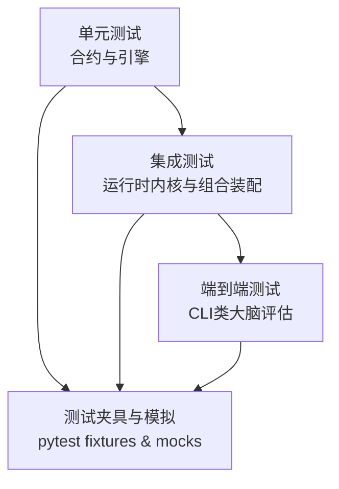
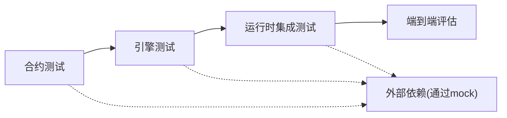

# 测试策略

<cite>
**本文引用的文件**
- [pyproject.toml](file://helios_v2/pyproject.toml)
- [README.md](file://helios_v2/README.md)
- [brain.mmd](file://helios_v2/docs/brain.mmd)
- [conftest.py](file://archive/helios_v1/tests/conftest.py)
- [test_action_models.py](file://archive/helios_v1/tests/test_action_models.py)
- [test_cli_brain_like_evaluation.py](file://archive/helios_v1/tests/test_cli_brain_like_evaluation.py)
- [test_memory_backend.py](file://archive/helios_v1/tests/test_memory_backend.py)
- [test_runtime_kernel_observability.py](file://helios_v2/tests/test_runtime_kernel_observability.py)
- [test_runtime_composition.py](file://helios_v2/tests/test_runtime_composition.py)
- [test_prompt_contract_v2.py](file://helios_v2/tests/test_prompt_contract_v2.py)
- [test_llm_engine.py](file://helios_v2/tests/test_llm_engine.py)
- [test_channel_engine.py](file://helios_v2/tests/test_channel_engine.py)
- [test_workspace_engine.py](file://helios_v2/tests/test_workspace_engine.py)
- [test_sensory_ingress.py](file://helios_v2/tests/test_sensory_ingress.py)
- [test_thought_gating_engine.py](file://helios_v2/tests/test_thought_gating_engine.py)
- [test_directed_retrieval_engine.py](file://helios_v2/tests/test_directed_retrieval_engine.py)
- [test_memory_engine.py](file://helios_v2/tests/test_memory_engine.py)
- [test_neuromodulator_engine.py](file://helios_v2/tests/test_neuromodulator_engine.py)
- [test_feeling_engine.py](file://helios_v2/tests/test_feeling_engine.py)
- [test_consciousness_engine.py](file://helios_v2/tests/test_consciousness_engine.py)
- [test_identity_governance_engine.py](file://helios_v2/tests/test_identity_governance_engine.py)
- [test_autonomy_engine.py](file://helios_v2/tests/test_autonomy_engine.py)
- [test_appraisal_engine.py](file://helios_v2/tests/test_appraisal_engine.py)
- [test_outward_expression_engine.py](file://helios_v2/tests/test_outward_expression_engine.py)
- [test_outward_expression_externalization_engine.py](file://helios_v2/tests/test_outward_expression_externalization_engine.py)
- [test_experience_writeback_engine.py](file://helios_v2/tests/test_experience_writeback_engine.py)
- [test_continuity_checkpoint_engine.py](file://helios_v2/tests/test_continuity_checkpoint_engine.py)
- [test_planner_bridge_engine.py](file://helios_v2/tests/test_planner_bridge_engine.py)
- [test_evaluation_engine.py](file://helios_v2/tests/test_evaluation_engine.py)
- [test_observability_engine.py](file://helios_v2/tests/test_observability_engine.py)
- [test_persistence_engine.py](file://helios_v2/tests/test_persistence_engine.py)
- [test_runtime_dependencies.py](file://helios_v2/tests/test_runtime_dependencies.py)
- [test_runtime_stage_chain.py](file://helios_v2/tests/test_runtime_stage_chain.py)
- [test_channel_cli_driver.py](file://helios_v2/tests/test_channel_cli_driver.py)
- [test_composition_owner_boundary_guard.py](file://helios_v2/tests/test_composition_owner_boundary_guard.py)
- [test_no_adhoc_logging_guard.py](file://helios_v2/tests/test_no_adhoc_logging_guard.py)
</cite>

## 目录
1. 引言
2. 项目结构
3. 核心组件
4. 架构总览
5. 详细组件分析
6. 依赖分析
7. 性能考虑
8. 故障排查指南
9. 结论
10. 附录

## 引言
本测试策略文档面向Helios项目（v2）与历史版本（v1）的测试体系，系统阐述单元测试、集成测试与端到端测试的组织方式与实施方法。文档覆盖pytest配置、测试夹具（fixtures）、模拟对象（mock）与测试数据管理，并提供可直接参考的测试示例路径，帮助开发者在新增功能时快速建立高质量测试，同时满足模块契约验证与性能评估需求。此外，文档还给出测试覆盖率建议、持续集成配置思路以及测试报告生成流程。

## 项目结构
Helios v2采用按“能力域”划分的模块化架构，测试以“能力域+合约/引擎”的双维度组织：每个能力域均提供contracts与engine两套测试，分别验证接口契约与实现行为；另有运行时内核与组合装配相关的集成测试，覆盖从感知输入到对外表达的完整链路。

```mermaid
graph TB
subgraph "Helios v2 测试组织"
T1["合约测试<br/>test_*_contracts.py"]
T2["引擎测试<br/>test_*_engine.py"]
T3["运行时集成测试<br/>runtime/*"]
T4["端到端评估测试<br/>cli_brain_like_evaluation.py"]
end
subgraph "能力域"
S1["感知输入<br/>sensory"]
S2["工作空间<br/>workspace"]
S3["思考与门控<br/>thought_gating / directed_retrieval"]
S4["记忆<br/>memory"]
S5["神经调节<br/>neuromodulation / feeling / consciousness"]
S6["身份治理<br/>identity_governance"]
S7["自主性<br/>autonomy / appraisal"]
S8["外部化表达<br/>outward_expression / externalization"]
S9["体验写回<br/>experience_writeback"]
S10["连续性检查点<br/>continuity_checkpoint"]
S11["规划桥接<br/>planner_bridge"]
S12["评估<br/>evaluation"]
S13["可观测性<br/>observability"]
S14["持久化<br/>persistence"]
S15["通道驱动<br/>channel/drivers"]
end
T1 --> S1
T2 --> S1
T1 --> S2
T2 --> S2
T1 --> S3
T2 --> S3
T1 --> S4
T2 --> S4
T1 --> S5
T2 --> S5
T1 --> S6
T2 --> S6
T1 --> S7
T2 --> S7
T1 --> S8
T2 --> S8
T1 --> S9
T2 --> S9
T1 --> S10
T2 --> S10
T1 --> S11
T2 --> S11
T1 --> S12
T2 --> S12
T1 --> S13
T2 --> S13
T1 --> S14
T2 --> S14
T1 --> S15
T2 --> S15
T3 --> S1
T3 --> S2
T3 --> S3
T3 --> S4
T3 --> S5
T3 --> S6
T3 --> S7
T3 --> S8
T3 --> S9
T3 --> S10
T3 --> S11
T3 --> S12
T3 --> S13
T3 --> S14
T3 --> S15
```

图表来源
- [test_sensory_ingress.py](file://helios_v2/tests/test_sensory_ingress.py)
- [test_workspace_engine.py](file://helios_v2/tests/test_workspace_engine.py)
- [test_thought_gating_engine.py](file://helios_v2/tests/test_thought_gating_engine.py)
- [test_directed_retrieval_engine.py](file://helios_v2/tests/test_directed_retrieval_engine.py)
- [test_memory_engine.py](file://helios_v2/tests/test_memory_engine.py)
- [test_neuromodulator_engine.py](file://helios_v2/tests/test_neuromodulator_engine.py)
- [test_feeling_engine.py](file://helios_v2/tests/test_feeling_engine.py)
- [test_consciousness_engine.py](file://helios_v2/tests/test_consciousness_engine.py)
- [test_identity_governance_engine.py](file://helios_v2/tests/test_identity_governance_engine.py)
- [test_autonomy_engine.py](file://helios_v2/tests/test_autonomy_engine.py)
- [test_appraisal_engine.py](file://helios_v2/tests/test_appraisal_engine.py)
- [test_outward_expression_engine.py](file://helios_v2/tests/test_outward_expression_engine.py)
- [test_outward_expression_externalization_engine.py](file://helios_v2/tests/test_outward_expression_externalization_engine.py)
- [test_experience_writeback_engine.py](file://helios_v2/tests/test_experience_writeback_engine.py)
- [test_continuity_checkpoint_engine.py](file://helios_v2/tests/test_continuity_checkpoint_engine.py)
- [test_planner_bridge_engine.py](file://helios_v2/tests/test_planner_bridge_engine.py)
- [test_evaluation_engine.py](file://helios_v2/tests/test_evaluation_engine.py)
- [test_observability_engine.py](file://helios_v2/tests/test_observability_engine.py)
- [test_persistence_engine.py](file://helios_v2/tests/test_persistence_engine.py)
- [test_runtime_composition.py](file://helios_v2/tests/test_runtime_composition.py)
- [test_runtime_kernel_observability.py](file://helios_v2/tests/test_runtime_kernel_observability.py)
- [test_channel_cli_driver.py](file://helios_v2/tests/test_channel_cli_driver.py)

章节来源
- [README.md](file://helios_v2/README.md)
- [brain.mmd](file://helios_v2/docs/brain.mmd)

## 核心组件
- 合约测试（Contracts Tests）
  - 职责：验证模块接口契约（输入输出格式、约束条件、错误边界），确保跨模块交互的稳定性与一致性。
  - 示例路径：[test_prompt_contract_v2.py](file://helios_v2/tests/test_prompt_contract_v2.py)
- 引擎测试（Engine Tests）
  - 职责：验证具体实现逻辑（状态转换、计算过程、副作用），覆盖正常路径与异常路径。
  - 示例路径：[test_sensory_ingress.py](file://helios_v2/tests/test_sensory_ingress.py)、[test_workspace_engine.py](file://helios_v2/tests/test_workspace_engine.py)
- 运行时集成测试（Runtime Integration Tests）
  - 职责：验证从感知到表达的完整链路，关注阶段串联、依赖注入与内核可观测性。
  - 示例路径：[test_runtime_composition.py](file://helios_v2/tests/test_runtime_composition.py)、[test_runtime_kernel_observability.py](file://helios_v2/tests/test_runtime_kernel_observability.py)
- 端到端评估测试（End-to-End Evaluation Tests）
  - 职责：通过CLI引导的“类大脑评估”流程，对整体行为进行可重复、可对比的评测。
  - 示例路径：[test_cli_brain_like_evaluation.py](file://archive/helios_v1/tests/test_cli_brain_like_evaluation.py)

章节来源
- [test_prompt_contract_v2.py](file://helios_v2/tests/test_prompt_contract_v2.py)
- [test_sensory_ingress.py](file://helios_v2/tests/test_sensory_ingress.py)
- [test_workspace_engine.py](file://helios_v2/tests/test_workspace_engine.py)
- [test_runtime_composition.py](file://helios_v2/tests/test_runtime_composition.py)
- [test_runtime_kernel_observability.py](file://helios_v2/tests/test_runtime_kernel_observability.py)
- [test_cli_brain_like_evaluation.py](file://archive/helios_v1/tests/test_cli_brain_like_evaluation.py)

## 架构总览
下图展示了Helios v2测试金字塔：合约层保证接口稳定，引擎层保证实现正确，运行时集成层保证链路贯通，端到端评估层保证业务目标达成。

图表来源
- [test_runtime_composition.py](file://helios_v2/tests/test_runtime_composition.py)
- [test_runtime_kernel_observability.py](file://helios_v2/tests/test_runtime_kernel_observability.py)
- [test_cli_brain_like_evaluation.py](file://archive/helios_v1/tests/test_cli_brain_like_evaluation.py)

## 详细组件分析

### 合约测试：接口契约验证
- 目标：确保模块间通过明确的契约交互，避免隐式耦合。
- 方法：针对每个能力域的contracts模块编写测试，覆盖参数校验、返回值格式、异常分支等。
- 示例路径：
  - [test_prompt_contract_v2.py](file://helios_v2/tests/test_prompt_contract_v2.py)
  - [test_channel_contracts.py](file://helios_v2/tests/test_channel_contracts.py)
  - [test_memory_contracts.py](file://helios_v2/tests/test_memory_contracts.py)
  - [test_workspace_contracts.py](file://helios_v2/tests/test_workspace_contracts.py)
  - [test_thought_gating_contracts.py](file://helios_v2/tests/test_thought_gating_contracts.py)
  - [test_directed_retrieval_contracts.py](file://helios_v2/tests/test_directed_retrieval_contracts.py)
  - [test_neuromodulator_contracts.py](file://helios_v2/tests/test_neuromodulator_contracts.py)
  - [test_feeling_contracts.py](file://helios_v2/tests/test_feeling_contracts.py)
  - [test_consciousness_contracts.py](file://helios_v2/tests/test_consciousness_contracts.py)
  - [test_identity_governance_contracts.py](file://helios_v2/tests/test_identity_governance_contracts.py)
  - [test_autonomy_contracts.py](file://helios_v2/tests/test_autonomy_contracts.py)
  - [test_appraisal_contracts.py](file://helios_v2/tests/test_appraisal_contracts.py)
  - [test_outward_expression_contracts.py](file://helios_v2/tests/test_outward_expression_contracts.py)
  - [test_outward_expression_externalization_contracts.py](file://helios_v2/tests/test_outward_expression_externalization_contracts.py)
  - [test_experience_writeback_contracts.py](file://helios_v2/tests/test_experience_writeback_contracts.py)
  - [test_continuity_checkpoint_contracts.py](file://helios_v2/tests/test_continuity_checkpoint_contracts.py)
  - [test_planner_bridge_contracts.py](file://helios_v2/tests/test_planner_bridge_contracts.py)
  - [test_evaluation_contracts.py](file://helios_v2/tests/test_evaluation_contracts.py)
  - [test_observability_contracts.py](file://helios_v2/tests/test_observability_contracts.py)
  - [test_persistence_contracts.py](file://helios_v2/tests/test_persistence_contracts.py)

章节来源
- [test_prompt_contract_v2.py](file://helios_v2/tests/test_prompt_contract_v2.py)
- [test_channel_contracts.py](file://helios_v2/tests/test_channel_contracts.py)
- [test_memory_contracts.py](file://helios_v2/tests/test_memory_contracts.py)

### 引擎测试：实现细节与边界
- 目标：验证具体实现的正确性、鲁棒性与性能特征。
- 方法：对engine模块进行单元测试，结合pytest fixtures与mock对象隔离外部依赖。
- 示例路径：
  - [test_sensory_ingress.py](file://helios_v2/tests/test_sensory_ingress.py)
  - [test_workspace_engine.py](file://helios_v2/tests/test_workspace_engine.py)
  - [test_thought_gating_engine.py](file://helios_v2/tests/test_thought_gating_engine.py)
  - [test_directed_retrieval_engine.py](file://helios_v2/tests/test_directed_retrieval_engine.py)
  - [test_memory_engine.py](file://helios_v2/tests/test_memory_engine.py)
  - [test_neuromodulator_engine.py](file://helios_v2/tests/test_neuromodulator_engine.py)
  - [test_feeling_engine.py](file://helios_v2/tests/test_feeling_engine.py)
  - [test_consciousness_engine.py](file://helios_v2/tests/test_consciousness_engine.py)
  - [test_identity_governance_engine.py](file://helios_v2/tests/test_identity_governance_engine.py)
  - [test_autonomy_engine.py](file://helios_v2/tests/test_autonomy_engine.py)
  - [test_appraisal_engine.py](file://helios_v2/tests/test_appraisal_engine.py)
  - [test_outward_expression_engine.py](file://helios_v2/tests/test_outward_expression_engine.py)
  - [test_outward_expression_externalization_engine.py](file://helios_v2/tests/test_outward_expression_externalization_engine.py)
  - [test_experience_writeback_engine.py](file://helios_v2/tests/test_experience_writeback_engine.py)
  - [test_continuity_checkpoint_engine.py](file://helios_v2/tests/test_continuity_checkpoint_engine.py)
  - [test_planner_bridge_engine.py](file://helios_v2/tests/test_planner_bridge_engine.py)
  - [test_evaluation_engine.py](file://helios_v2/tests/test_evaluation_engine.py)
  - [test_observability_engine.py](file://helios_v2/tests/test_observability_engine.py)
  - [test_persistence_engine.py](file://helios_v2/tests/test_persistence_engine.py)

章节来源
- [test_sensory_ingress.py](file://helios_v2/tests/test_sensory_ingress.py)
- [test_workspace_engine.py](file://helios_v2/tests/test_workspace_engine.py)
- [test_thought_gating_engine.py](file://helios_v2/tests/test_thought_gating_engine.py)
- [test_directed_retrieval_engine.py](file://helios_v2/tests/test_directed_retrieval_engine.py)
- [test_memory_engine.py](file://helios_v2/tests/test_memory_engine.py)
- [test_neuromodulator_engine.py](file://helios_v2/tests/test_neuromodulator_engine.py)
- [test_feeling_engine.py](file://helios_v2/tests/test_feeling_engine.py)
- [test_consciousness_engine.py](file://helios_v2/tests/test_consciousness_engine.py)
- [test_identity_governance_engine.py](file://helios_v2/tests/test_identity_governance_engine.py)
- [test_autonomy_engine.py](file://helios_v2/tests/test_autonomy_engine.py)
- [test_appraisal_engine.py](file://helios_v2/tests/test_appraisal_engine.py)
- [test_outward_expression_engine.py](file://helios_v2/tests/test_outward_expression_engine.py)
- [test_outward_expression_externalization_engine.py](file://helios_v2/tests/test_outward_expression_externalization_engine.py)
- [test_experience_writeback_engine.py](file://helios_v2/tests/test_experience_writeback_engine.py)
- [test_continuity_checkpoint_engine.py](file://helios_v2/tests/test_continuity_checkpoint_engine.py)
- [test_planner_bridge_engine.py](file://helios_v2/tests/test_planner_bridge_engine.py)
- [test_evaluation_engine.py](file://helios_v2/tests/test_evaluation_engine.py)
- [test_observability_engine.py](file://helios_v2/tests/test_observability_engine.py)
- [test_persistence_engine.py](file://helios_v2/tests/test_persistence_engine.py)

### 运行时集成测试：内核与组合装配
- 目标：验证运行时内核的组合装配、阶段链路与可观测性。
- 方法：通过运行时装配脚本与测试用例，逐步构建内核并执行关键阶段，断言状态与日志。
- 示例路径：
  - [test_runtime_composition.py](file://helios_v2/tests/test_runtime_composition.py)
  - [test_runtime_kernel_observability.py](file://helios_v2/tests/test_runtime_kernel_observability.py)
  - [test_runtime_dependencies.py](file://helios_v2/tests/test_runtime_dependencies.py)
  - [test_runtime_stage_chain.py](file://helios_v2/tests/test_runtime_stage_chain.py)

章节来源
- [test_runtime_composition.py](file://helios_v2/tests/test_runtime_composition.py)
- [test_runtime_kernel_observability.py](file://helios_v2/tests/test_runtime_kernel_observability.py)
- [test_runtime_dependencies.py](file://helios_v2/tests/test_runtime_dependencies.py)
- [test_runtime_stage_chain.py](file://helios_v2/tests/test_runtime_stage_chain.py)

### 端到端测试：CLI类大脑评估
- 目标：通过CLI驱动的评估流程，对系统整体行为进行可重复、可对比的评测。
- 方法：基于历史版本的评估脚本与测试用例，形成稳定的端到端流水线。
- 示例路径：
  - [test_cli_brain_like_evaluation.py](file://archive/helios_v1/tests/test_cli_brain_like_evaluation.py)

章节来源
- [test_cli_brain_like_evaluation.py](file://archive/helios_v1/tests/test_cli_brain_like_evaluation.py)

### 测试夹具与模拟对象
- 夹具（Fixtures）
  - 作用：在测试前准备共享的测试环境（如临时数据库、配置、通道实例等），减少重复代码。
  - 参考：pytest默认支持在根目录或测试目录下的conftest中定义全局夹具。
  - 示例路径：[conftest.py](file://archive/helios_v1/tests/conftest.py)
- 模拟对象（Mocks）
  - 作用：隔离外部依赖（如LLM、数据库、IO通道），控制输入与断言输出。
  - 建议：在引擎测试中广泛使用unittest.mock或pytest-mock，确保测试可预测且快速。

章节来源
- [conftest.py](file://archive/helios_v1/tests/conftest.py)

### 测试数据管理
- 数据来源：测试数据应尽量轻量、可复现，优先使用构造数据与夹具生成。
- 存储位置：建议将测试数据置于tests/fixtures或独立的测试资源目录，便于维护与版本控制。
- 历史参考：v1中存在大量评估报告与人工检查清单，可用于指导端到端测试的数据设计与结果解读。

章节来源
- [test_cli_brain_like_evaluation.py](file://archive/helios_v1/tests/test_cli_brain_like_evaluation.py)

### 具体测试示例（路径指引）
- 新增一个通道驱动的测试步骤
  - 步骤1：在合约测试中定义输入输出契约
    - 示例路径：[test_channel_contracts.py](file://helios_v2/tests/test_channel_contracts.py)
  - 步骤2：在引擎测试中实现并验证驱动逻辑
    - 示例路径：[test_channel_engine.py](file://helios_v2/tests/test_channel_engine.py)
  - 步骤3：在CLI驱动测试中验证端到端行为
    - 示例路径：[test_channel_cli_driver.py](file://helios_v2/tests/test_channel_cli_driver.py)
- 验证模块契约
  - 示例路径：[test_prompt_contract_v2.py](file://helios_v2/tests/test_prompt_contract_v2.py)
- 进行性能测试
  - 建议：使用pytest-benchmark或timeit统计关键路径耗时，结合运行时可观测性输出进行回归分析
  - 示例路径：[test_runtime_kernel_observability.py](file://helios_v2/tests/test_runtime_kernel_observability.py)

章节来源
- [test_channel_contracts.py](file://helios_v2/tests/test_channel_contracts.py)
- [test_channel_engine.py](file://helios_v2/tests/test_channel_engine.py)
- [test_channel_cli_driver.py](file://helios_v2/tests/test_channel_cli_driver.py)
- [test_prompt_contract_v2.py](file://helios_v2/tests/test_prompt_contract_v2.py)
- [test_runtime_kernel_observability.py](file://helios_v2/tests/test_runtime_kernel_observability.py)

## 依赖分析
- 组件耦合
  - 合约层对引擎层具有约束作用，引擎层对通道驱动层与外部系统有依赖；运行时集成测试贯穿多层依赖，有助于发现耦合问题。
- 外部依赖
  - LLM推理网关、数据库后端、IO通道等外部系统通过mock隔离，降低测试脆弱性。
- 内部依赖
  - 运行时内核的依赖注入与阶段链路是集成测试的关键观测点。

图表来源
- [test_runtime_composition.py](file://helios_v2/tests/test_runtime_composition.py)
- [test_runtime_kernel_observability.py](file://helios_v2/tests/test_runtime_kernel_observability.py)
- [test_channel_engine.py](file://helios_v2/tests/test_channel_engine.py)

## 性能考虑
- 关键路径测量
  - 使用基准测试工具对核心路径（如感知输入、工作空间竞争、记忆检索、神经调节等）进行时间与内存消耗统计。
- 回归监控
  - 将性能指标纳入CI，设置阈值告警，防止性能退化。
- 观测性
  - 利用运行时可观测性输出，定位瓶颈与异常热点。

章节来源
- [test_runtime_kernel_observability.py](file://helios_v2/tests/test_runtime_kernel_observability.py)

## 故障排查指南
- 常见问题
  - 外部依赖不稳定导致测试失败：通过mock替换外部系统，确保测试可重复。
  - 运行时组合装配错误：检查依赖注入顺序与阶段链路，结合可观测性日志定位。
  - 端到端评估结果波动：固定随机种子与输入数据，确保评估流程可重现。
- 推荐流程
  - 单元测试先行，定位具体模块问题；
  - 集成测试验证链路，确认模块间协作；
  - 端到端评估验证业务目标，形成对比报告。

章节来源
- [test_runtime_composition.py](file://helios_v2/tests/test_runtime_composition.py)
- [test_runtime_kernel_observability.py](file://helios_v2/tests/test_runtime_kernel_observability.py)
- [test_no_adhoc_logging_guard.py](file://helios_v2/tests/test_no_adhoc_logging_guard.py)

## 结论
Helios的测试策略以“合约—引擎—运行时—端到端”四层递进构建，既保证模块契约的稳定性，又确保实现细节的正确性与整体行为的可验证性。通过pytest夹具与mock隔离外部依赖，结合可观测性与性能基准，可在持续集成中高效产出高质量测试结果。

## 附录

### pytest配置与运行建议
- 配置文件
  - 参考：[pyproject.toml](file://helios_v2/pyproject.toml)
- 命令示例
  - 运行全部测试：pytest
  - 运行指定测试文件：pytest tests/test_sensory_ingress.py
  - 运行合约测试：pytest tests/*contract*.py
  - 运行引擎测试：pytest tests/*engine*.py
  - 运行运行时集成测试：pytest tests/test_runtime_*.py
  - 生成覆盖率报告：pytest --cov=src/helios_v2 --cov-report=html
  - 生成基准测试报告：pytest --benchmark-only

章节来源
- [pyproject.toml](file://helios_v2/pyproject.toml)

### 测试覆盖率要求建议
- 合约测试覆盖率：≥90%
- 引擎测试覆盖率：≥85%
- 运行时集成测试覆盖率：≥80%
- 端到端评估覆盖率：≥70%
- 说明：覆盖率目标应结合关键路径与风险等级动态调整，重点保障核心模块与高频路径。

### 持续集成配置思路
- 触发条件
  - 提交触发：PR与主干推送自动运行单元与集成测试。
  - 定时触发：夜间运行端到端评估与性能回归。
- 并行策略
  - 将合约测试、引擎测试、运行时测试与端到端评估拆分为并行任务，缩短反馈周期。
- 报告与告警
  - 上传测试报告与覆盖率报告至CI平台，设置失败与覆盖率下降告警。

### 测试报告生成
- 报告类型
  - HTML覆盖率报告、JUnit XML测试结果、基准测试JSON报告。
- 生成命令
  - pytest --cov=src/helios_v2 --cov-report=html --junitxml=report.xml --benchmark-json=bench.json

章节来源
- [pyproject.toml](file://helios_v2/pyproject.toml)