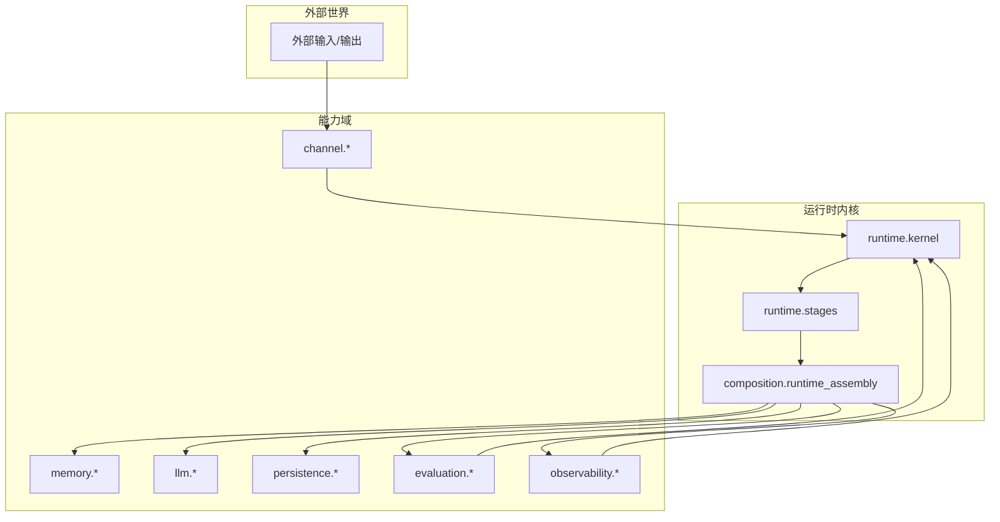
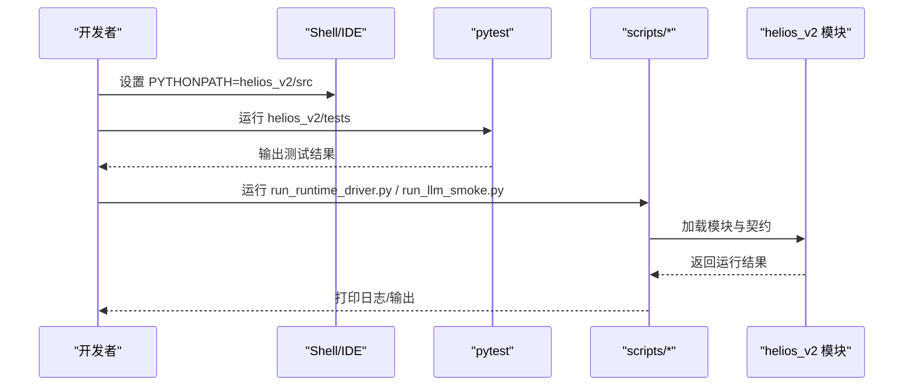
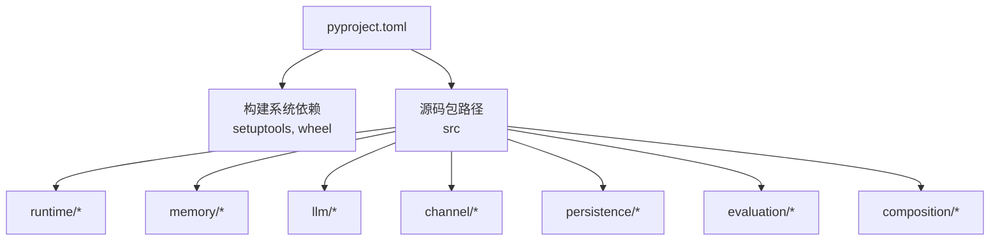

# 环境搭建

<cite>
**本文引用的文件**
- [README.md](file://README.md)
- [helios_v2/README.md](file://helios_v2/README.md)
- [helios_v2/pyproject.toml](file://helios_v2/pyproject.toml)
- [archive/helios_v1/README.md](file://archive/helios_v1/README.md)
- [archive/helios_v1/helios_main.py](file://archive/helios_v1/helios_main.py)
- [helios_v2/scripts/run_runtime_driver.py](file://helios_v2/scripts/run_runtime_driver.py)
- [helios_v2/scripts/run_llm_smoke.py](file://helios_v2/scripts/run_llm_smoke.py)
- [helios_v2/scripts/run_llm_prompt_probe.py](file://helios_v2/scripts/run_llm_prompt_probe.py)
- [helios_v2/tests/](file://helios_v2/tests/)
- [archive/helios_v1/tests/](file://archive/helios_v1/tests/)
</cite>

## 目录
1. [简介](#简介)
2. [项目结构](#项目结构)
3. [核心组件](#核心组件)
4. [架构总览](#架构总览)
5. [详细组件分析](#详细组件分析)
6. [依赖分析](#依赖分析)
7. [性能考虑](#性能考虑)
8. [故障排除指南](#故障排除指南)
9. [结论](#结论)
10. [附录](#附录)

## 简介
本指南面向首次接触 Helios 项目的开发者，提供从零开始的环境搭建与运行说明。Helios 是一个“类大脑”式的人工智能运行时系统，强调持续运行、情感与认知闭环、记忆与调节机制。当前活跃分支为 helios_v2，采用 Python 3.11+ 的现代运行时，并通过明确的模块边界与契约驱动开发。

- 仓库状态与分支定位：当前开发集中在 helios_v2；v1 已归档用于历史参考。
- 运行时特性：持续主循环、多模态 I/O 边界、情感/神经化学/记忆/认知/调节等子系统协同工作。
- 开发原则：无降级执行模式、关键依赖启动前校验、模块职责单一、接口契约化。

章节来源
- [README.md:1-19](file://README.md#L1-L19)
- [helios_v2/README.md:1-70](file://helios_v2/README.md#L1-L70)
- [archive/helios_v1/README.md:131-140](file://archive/helios_v1/README.md#L131-L140)

## 项目结构
Helios 仓库采用“文档/脚本/源码/测试”的分层组织，helios_v2 作为当前实现分支，源码位于 src/helios_v2 下，模块按功能域划分（如 runtime、memory、llm、channel 等），并通过 contracts/engine 分层组织。

```mermaid
graph TB
A["仓库根目录"] --> B["helios_v2/"]
A --> C["archive/helios_v1/"]
B --> B1["docs/"]
B --> B2["scripts/"]
B --> B3["src/helios_v2/"]
B --> B4["tests/"]
B3 --> B3a["runtime/"]
B3 --> B3b["memory/"]
B3 --> B3c["llm/"]
B3 --> B3d["channel/"]
B3 --> B3e["persistence/"]
B3 --> B3f["evaluation/"]
B3 --> B3g["composition/"]
B3 --> B3h["sensory/"]
B3 --> B3i["workspace/"]
B3 --> B3j["thought_gating/"]
B3 --> B3k["internal_thought/"]
B3 --> B3l["appreciation/"]
B3 --> B3m["feeling/"]
B3 --> B3n["neuromodulation/"]
B3 --> B3o["identity_governance/"]
B3 --> B3p["outward_expression/"]
B3 --> B3q["experience_writeback/"]
B3 --> B3r["continuity_checkpoint/"]
B3 --> B3s["prompt_contract/"]
B3 --> B3t["planner_bridge/"]
B3 --> B3u["directed_retrieval/"]
B3 --> B3v["consciousness/"]
B3 --> B3w["interoception/"]
B3 --> B3x["autonomy/"]
B3 --> B3y["action_externalization/"]
B3 --> B3z["observability/"]
```

图表来源
- [helios_v2/README.md:46-54](file://helios_v2/README.md#L46-L54)
- [helios_v2/pyproject.toml:11-15](file://helios_v2/pyproject.toml#L11-L15)

章节来源
- [helios_v2/README.md:46-54](file://helios_v2/README.md#L46-L54)
- [helios_v2/pyproject.toml:11-15](file://helios_v2/pyproject.toml#L11-L15)

## 核心组件
- Python 版本与构建系统：要求 Python >= 3.11，使用 setuptools 作为构建后端。
- 源码包路径：通过 setuptools 配置将包根指向 src 目录，便于导入。
- 运行入口与验证：helios_v2 提供基于 PYTHONPATH 的 pytest 验证流程；v1 提供主循环入口与环境变量说明。

章节来源
- [helios_v2/pyproject.toml:9](file://helios_v2/pyproject.toml#L9)
- [helios_v2/pyproject.toml:11-12](file://helios_v2/pyproject.toml#L11-L12)
- [helios_v2/README.md:58-70](file://helios_v2/README.md#L58-L70)
- [archive/helios_v1/README.md:131-140](file://archive/helios_v1/README.md#L131-L140)

## 架构总览
Helios 的运行时由多个子系统组成，围绕“感知—感受—记忆—思考—调节—表达”的循环展开。v2 通过模块化契约与组合装配形成可运行内核，支持可观测性、持久化、嵌入、通道驱动等能力。

图表来源
- [helios_v2/README.md:29-44](file://helios_v2/README.md#L29-L44)
- [helios_v2/README.md:46-54](file://helios_v2/README.md#L46-L54)

## 详细组件分析

### Python 环境与依赖安装
- Python 版本要求：Python >= 3.11。
- 包管理与安装：helios_v2 使用 setuptools 构建，源码位于 src/helios_v2，需在运行前设置 PYTHONPATH 指向该目录，以便 pytest 和运行脚本正确导入模块。
- 测试与验证：提供全量网络无关测试套件，可通过 pytest 在 helios_v2/tests 下执行；也可针对特定 owner 能力进行切片验证。

章节来源
- [helios_v2/pyproject.toml:9](file://helios_v2/pyproject.toml#L9)
- [helios_v2/README.md:58-70](file://helios_v2/README.md#L58-L70)

### 虚拟环境创建与激活
- 推荐使用 venv 或 conda 创建隔离环境，确保 Python 版本满足 >= 3.11。
- 激活后安装构建依赖（setuptools、wheel）并进入 helios_v2 目录进行后续操作。

章节来源
- [helios_v2/pyproject.toml:1-3](file://helios_v2/pyproject.toml#L1-L3)

### 依赖安装与配置
- 安装方式：在 helios_v2 目录下，先设置 PYTHONPATH=src，再运行 pytest 进行验证或执行脚本。
- 依赖来源：helios_v2 仅声明构建系统依赖（setuptools、wheel），具体运行时依赖通过各模块契约与测试用例体现；如需 LLM 推理、通道驱动等功能，请根据对应模块的 contracts/engine 与测试用例准备相应依赖。

章节来源
- [helios_v2/README.md:60-70](file://helios_v2/README.md#L60-L70)
- [helios_v2/pyproject.toml:1-3](file://helios_v2/pyproject.toml#L1-L3)

### 开发工具与 IDE 配置建议
- 编辑器：推荐 VS Code 或 PyCharm，启用 Python 3.11 解释器与 src 作为项目根。
- 导入路径：在 IDE 中将 src/helios_v2 设为源码根或 PYTHONPATH，避免模块导入错误。
- 断点调试：针对 scripts 下的运行脚本（如 run_runtime_driver.py、run_llm_smoke.py、run_llm_prompt_probe.py）设置断点进行单步调试。
- 测试运行：在 IDE 内直接运行 pytest 或通过终端执行 helios_v2/README.md 中提供的命令。

章节来源
- [helios_v2/README.md:58-70](file://helios_v2/README.md#L58-L70)
- [helios_v2/scripts/run_runtime_driver.py](file://helios_v2/scripts/run_runtime_driver.py)
- [helios_v2/scripts/run_llm_smoke.py](file://helios_v2/scripts/run_llm_smoke.py)
- [helios_v2/scripts/run_llm_prompt_probe.py](file://helios_v2/scripts/run_llm_prompt_probe.py)

### 环境变量与配置要点
- v1 的 HeliosConfig 文档了时间、日志、LLM 访问、QQ 集成、多模态通道等关键环境变量。
- 建议在本地开发时，优先在 shell/IDE 启动配置中设置必要变量，避免硬编码到源码中。
- 如需运行 v1 主循环，可参考 v1 README 的运行入口与变量说明。

章节来源
- [archive/helios_v1/README.md:139-140](file://archive/helios_v1/README.md#L139-L140)
- [archive/helios_v1/helios_main.py](file://archive/helios_v1/helios_main.py)

### 平台安装步骤（Windows、macOS、Linux）
- Windows
  - 安装 Python 3.11+，创建虚拟环境并激活。
  - 设置 PYTHONPATH=helios_v2/src，使用 PowerShell 执行 pytest 或运行 scripts 下的脚本。
- macOS/Linux
  - 使用 pyenv/conda 确保 Python 3.11+，创建并激活虚拟环境。
  - 设置 PYTHONPATH=helios_v2/src，使用 bash/zsh 执行 pytest 或运行 scripts 下的脚本。

章节来源
- [helios_v2/README.md:60-70](file://helios_v2/README.md#L60-L70)

### LLM 密钥配置
- LLM 推理能力通过 llm/* 模块提供，具体密钥与凭据应遵循对应 contracts/engine 的配置约定。
- 建议在本地开发环境中通过环境变量注入密钥，避免提交到版本库。
- 参考 run_llm_smoke.py 与 run_llm_prompt_probe.py 的调用方式，确认推理链路可用后再进行更复杂的测试。

章节来源
- [helios_v2/scripts/run_llm_smoke.py](file://helios_v2/scripts/run_llm_smoke.py)
- [helios_v2/scripts/run_llm_prompt_probe.py](file://helios_v2/scripts/run_llm_prompt_probe.py)

### 数据库与第三方服务集成
- 持久化与经验存储：persistence/* 与 experience_writeback/* 模块提供可插拔的持久化与经验写回能力，建议结合测试用例理解其契约与行为。
- 多模态通道：channel/* 模块负责 I/O 边界与协议适配，如需集成语音/视觉/消息通道，应依据 contracts/engine 的接口进行扩展。
- 第三方服务：如需接入 LLM、消息通道或外部存储，应在对应模块的 contracts 层定义接口并在 engine 层实现，保持模块边界清晰。

章节来源
- [helios_v2/README.md:29-44](file://helios_v2/README.md#L29-L44)

### 运行与验证流程

图表来源
- [helios_v2/README.md:60-70](file://helios_v2/README.md#L60-L70)
- [helios_v2/scripts/run_runtime_driver.py](file://helios_v2/scripts/run_runtime_driver.py)
- [helios_v2/scripts/run_llm_smoke.py](file://helios_v2/scripts/run_llm_smoke.py)

## 依赖分析
- 构建系统依赖：setuptools、wheel（用于构建与打包）。
- 运行时依赖：通过各模块 contracts/engine 与测试用例体现，建议按需安装 LLM SDK、通道驱动、嵌入服务等。
- 模块间耦合：通过显式契约与组合装配降低耦合，提升可替换性与可测试性。

图表来源
- [helios_v2/pyproject.toml:1-3](file://helios_v2/pyproject.toml#L1-L3)
- [helios_v2/pyproject.toml:11-15](file://helios_v2/pyproject.toml#L11-L15)

章节来源
- [helios_v2/pyproject.toml:1-3](file://helios_v2/pyproject.toml#L1-L3)
- [helios_v2/pyproject.toml:11-15](file://helios_v2/pyproject.toml#L11-L15)

## 性能考虑
- 启动即校验关键依赖，避免运行期失败重试带来的开销。
- 将网络相关能力（如 LLM 推理）置于独立模块并通过契约抽象，便于替换与缓存。
- 利用 observability/* 模块记录内核级指标，结合测试用例评估模块性能瓶颈。

## 故障排除指南
- 模块导入失败
  - 症状：ImportError 或 ModuleNotFoundError。
  - 排查：确认已设置 PYTHONPATH=helios_v2/src；检查 IDE 的源码根配置是否指向 src/helios_v2。
- 测试无法运行
  - 症状：pytest 找不到模块或报错。
  - 排查：在 helios_v2 目录下执行 pytest，并确保 PYTHONPATH 正确；参考 README 的验证命令。
- LLM 推理异常
  - 症状：推理链路中断或返回空结果。
  - 排查：检查 LLM 密钥与凭据是否通过环境变量注入；参考 run_llm_smoke.py 与 run_llm_prompt_probe.py 的最小可用路径。
- 通道驱动问题
  - 症状：CLI 或其他通道无法接收/发送数据。
  - 排查：确认 channel/* 模块的 contracts/engine 是否正确实现；参考 CLI 驱动测试用例。

章节来源
- [helios_v2/README.md:58-70](file://helios_v2/README.md#L58-L70)
- [helios_v2/scripts/run_llm_smoke.py](file://helios_v2/scripts/run_llm_smoke.py)
- [helios_v2/scripts/run_llm_prompt_probe.py](file://helios_v2/scripts/run_llm_prompt_probe.py)

## 结论
通过本指南，您可以在 Windows/macOS/Linux 上完成 Helios v2 的环境搭建与运行验证。建议以 PYTHONPATH 指向 src/helios_v2 为前提，配合 pytest 与 scripts 下的运行脚本逐步验证各模块能力。对于 LLM、通道与持久化等外部能力，建议遵循模块契约进行扩展与集成。

## 附录
- 快速验证命令（Windows PowerShell）
  - 全量测试：设置 PYTHONPATH 后执行 pytest helios_v2/tests -q
  - 切片测试：针对特定 owner 能力执行对应的测试文件
- 运行入口参考
  - v1 主循环入口：archive/helios_v1/helios_main.py
  - v2 运行脚本：helios_v2/scripts/run_runtime_driver.py、run_llm_smoke.py、run_llm_prompt_probe.py

章节来源
- [helios_v2/README.md:58-70](file://helios_v2/README.md#L58-L70)
- [archive/helios_v1/helios_main.py](file://archive/helios_v1/helios_main.py)
- [helios_v2/scripts/run_runtime_driver.py](file://helios_v2/scripts/run_runtime_driver.py)
- [helios_v2/scripts/run_llm_smoke.py](file://helios_v2/scripts/run_llm_smoke.py)
- [helios_v2/scripts/run_llm_prompt_probe.py](file://helios_v2/scripts/run_llm_prompt_probe.py)