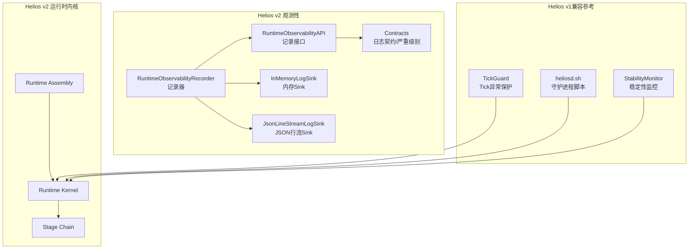
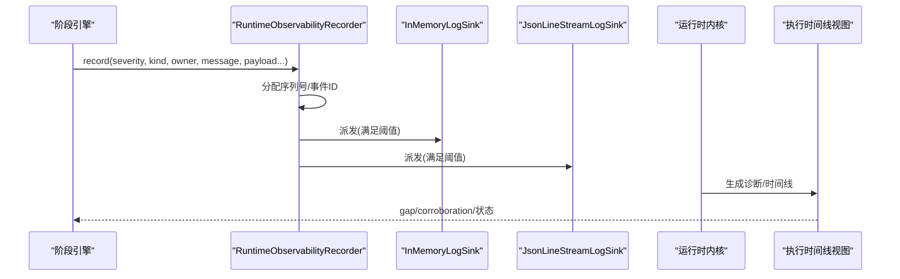
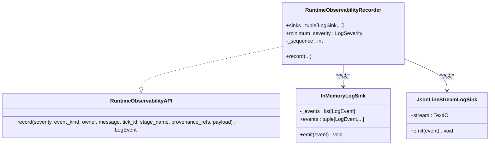
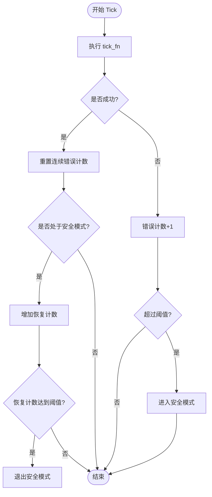
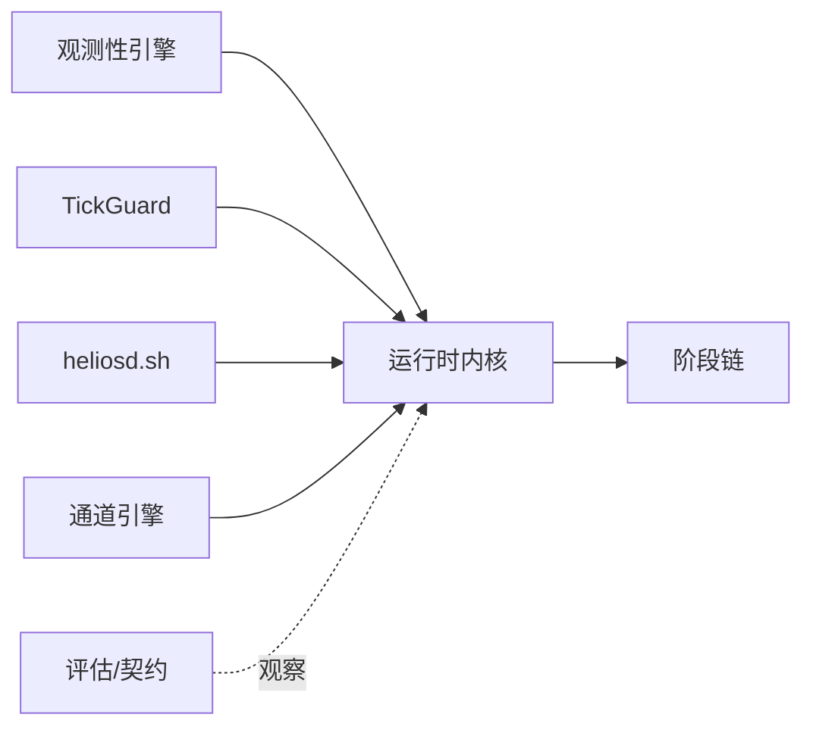

# 调试技巧

<cite>
**本文引用的文件**
- [helios_v2/observability/__init__.py](file://helios_v2/src/helios_v2/observability/__init__.py)
- [helios_v2/observability/engine.py](file://helios_v2/src/helios_v2/observability/engine.py)
- [helios_v2/observability/contracts.py](file://helios_v2/src/helios_v2/observability/contracts.py)
- [helios_v2/runtime/kernel.py](file://helios_v2/src/helios_v2/runtime/kernel.py)
- [helios_v2/runtime/stages.py](file://helios_v2/src/helios_v2/runtime/stages.py)
- [helios_v2/composition/runtime_assembly.py](file://helios_v2/src/helios_v2/composition/runtime_assembly.py)
- [helios_v2/channel/engine.py](file://helios_v2/src/helios_v2/channel/engine.py)
- [helios_v2/channel/contracts.py](file://helios_v2/src/helios_v2/channel/contracts.py)
- [helios_v2/tests/test_observability_contracts.py](file://helios_v2/tests/test_observability_contracts.py)
- [helios_v2/tests/test_runtime_composition.py](file://helios_v2/tests/test_runtime_composition.py)
- [helios_v2/tests/test_no_adhoc_logging_guard.py](file://helios_v2/tests/test_no_adhoc_logging_guard.py)
- [archive/helios_v1/core/tick_guard.py](file://archive/helios_v1/core/tick_guard.py)
- [archive/helios_v1/tests/test_tick_guard.py](file://archive/helios_v1/tests/test_tick_guard.py)
- [archive/helios_v1/tests/test_tick_guard_pbt.py](file://archive/helios_v1/tests/test_tick_guard_pbt.py)
- [archive/helios_v1/heliosd.sh](file://archive/helios_v1/heliosd.sh)
- [archive/helios_v1/helios_main.py](file://archive/helios_v1/helios_main.py)
- [archive/helios_v1/utils/stability_monitor.py](file://archive/helios_v1/utils/stability_monitor.py)
- [archive/helios_v1/tests/test_stability_monitor.py](file://archive/helios_v1/tests/test_stability_monitor.py)
- [archive/helios_v1/helios_io/llm_debug.py](file://archive/helios_v1/helios_io/llm_debug.py)
- [archive/helios_v1/docs/MODULE_REVIEW_MATRIX.zh-CN.md](file://archive/helios_v1/docs/MODULE_REVIEW_MATRIX.zh-CN.md)
- [archive/helios_v1/docs/requirements/16-dynamic-io-channel-framework/task.md](file://archive/helios_v1/docs/requirements/16-dynamic-io-channel-framework/task.md)
</cite>

## 目录
1. [引言](#引言)
2. [项目结构](#项目结构)
3. [核心组件](#核心组件)
4. [架构总览](#架构总览)
5. [详细组件分析](#详细组件分析)
6. [依赖关系分析](#依赖关系分析)
7. [性能考量](#性能考量)
8. [故障排查指南](#故障排查指南)
9. [结论](#结论)
10. [附录](#附录)

## 引言
本指南面向Helios项目的开发者与运维人员，聚焦“运行时观测性系统、日志记录策略与性能分析方法”。内容涵盖断点调试、内存分析、并发问题排查、分布式调试技术，并提供模块间通信调试、死锁定位与性能瓶颈优化的具体示例路径与流程。读者可据此快速建立从日志到指标、从单机到多节点的全链路调试能力。

## 项目结构
Helios v2将“统一运行时观测性与日志”作为独立子系统，围绕“记录器+多种Sink”的设计，提供结构化事件与时间线重建能力；v1保留了守护进程脚本、Tick保护机制与稳定性监控等成熟实践。整体上，v2更强调可观测性的契约化与可插拔输出，v1则提供了可直接复用的运行时保障与日志采集手段。

图示来源
- [helios_v2/observability/engine.py:111-186](file://helios_v2/src/helios_v2/observability/engine.py#L111-L186)
- [helios_v2/observability/contracts.py](file://helios_v2/src/helios_v2/observability/contracts.py)
- [helios_v2/runtime/kernel.py](file://helios_v2/src/helios_v2/runtime/kernel.py)
- [helios_v2/runtime/stages.py](file://helios_v2/src/helios_v2/runtime/stages.py)
- [helios_v2/composition/runtime_assembly.py](file://helios_v2/src/helios_v2/composition/runtime_assembly.py)
- [archive/helios_v1/core/tick_guard.py:14-64](file://archive/helios_v1/core/tick_guard.py#L14-L64)
- [archive/helios_v1/heliosd.sh:1-121](file://archive/helios_v1/heliosd.sh#L1-L121)
- [archive/helios_v1/utils/stability_monitor.py](file://archive/helios_v1/utils/stability_monitor.py)

章节来源
- [helios_v2/observability/__init__.py:1-37](file://helios_v2/src/helios_v2/observability/__init__.py#L1-L37)
- [helios_v2/observability/engine.py:1-186](file://helios_v2/src/helios_v2/observability/engine.py#L1-L186)
- [archive/helios_v1/core/tick_guard.py:1-64](file://archive/helios_v1/core/tick_guard.py#L1-L64)
- [archive/helios_v1/heliosd.sh:1-121](file://archive/helios_v1/heliosd.sh#L1-L121)

## 核心组件
- 统一运行时观测性与日志（v2）
  - 记录接口：提供结构化事件记录能力，支持严重级别、事件类型、所有者、消息、tick_id、阶段名、溯源引用与载荷。
  - 记录器：负责事件序列号与稳定ID分配、阈值过滤与派发至各Sink。
  - 内存Sink与JSON行流Sink：用于本地调试与外部采集。
  - 日志契约：定义事件结构、严重级别排序与错误类型。
- 运行时内核与阶段链：提供阶段级时间线与诊断信息，便于跨Tick对齐与因果关联。
- Tick保护（v1）：异常保护与安全模式切换，避免单模块失败导致进程崩溃。
- 守护进程脚本（v1）：提供启动/停止/状态/日志跟踪/前台附加等运维能力。
- 稳定性监控（v1）：采样RSS与运行时长等指标，辅助性能回归与容量预警。

章节来源
- [helios_v2/observability/engine.py:111-186](file://helios_v2/src/helios_v2/observability/engine.py#L111-L186)
- [helios_v2/observability/contracts.py](file://helios_v2/src/helios_v2/observability/contracts.py)
- [helios_v2/runtime/kernel.py](file://helios_v2/src/helios_v2/runtime/kernel.py)
- [helios_v2/runtime/stages.py](file://helios_v2/src/helios_v2/runtime/stages.py)
- [archive/helios_v1/core/tick_guard.py:14-64](file://archive/helios_v1/core/tick_guard.py#L14-L64)
- [archive/helios_v1/heliosd.sh:1-121](file://archive/helios_v1/heliosd.sh#L1-L121)
- [archive/helios_v1/utils/stability_monitor.py](file://archive/helios_v1/utils/stability_monitor.py)

## 架构总览
下图展示了v2观测性在运行时中的位置与交互：记录器作为唯一分配序列号与事件ID的组件，按严重级别阈值向多个Sink派发；运行时内核与阶段链提供时间线视图与诊断元数据，便于跨Tick重建执行轨迹。

图示来源
- [helios_v2/observability/engine.py:135-186](file://helios_v2/src/helios_v2/observability/engine.py#L135-L186)
- [helios_v2/runtime/kernel.py](file://helios_v2/src/helios_v2/runtime/kernel.py)
- [helios_v2/runtime/stages.py](file://helios_v2/src/helios_v2/runtime/stages.py)
- [helios_v2/tests/test_runtime_composition.py:249-283](file://helios_v2/tests/test_runtime_composition.py#L249-L283)

章节来源
- [helios_v2/observability/engine.py:1-186](file://helios_v2/src/helios_v2/observability/engine.py#L1-L186)
- [helios_v2/tests/test_runtime_composition.py:249-283](file://helios_v2/tests/test_runtime_composition.py#L249-L283)

## 详细组件分析

### 统一运行时观测性与日志（v2）
- 设计要点
  - 记录器负责严格单调的序列号与稳定ID，确保事件可追溯与可对齐。
  - Sink派发失败不吞没异常，保证可观测性系统的韧性。
  - 严重级别阈值在构造期校验，避免运行期误配置。
- 调试用法
  - 在需要定位的阶段调用记录接口，填充owner与message，必要时携带payload与provenance_refs。
  - 使用InMemoryLogSink捕获事件，结合运行时内核的时间线视图进行跨Tick对齐。
- 测试与契约
  - 严重级别排序单调性与未知标签处理由测试覆盖。
  - 禁止源码树中随意打印/日志，统一通过R21观测性子系统。

图示来源
- [helios_v2/observability/engine.py:111-186](file://helios_v2/src/helios_v2/observability/engine.py#L111-L186)
- [helios_v2/observability/contracts.py](file://helios_v2/src/helios_v2/observability/contracts.py)

章节来源
- [helios_v2/observability/engine.py:1-186](file://helios_v2/src/helios_v2/observability/engine.py#L1-L186)
- [helios_v2/observability/__init__.py:1-37](file://helios_v2/src/helios_v2/observability/__init__.py#L1-L37)
- [helios_v2/tests/test_observability_contracts.py:91-102](file://helios_v2/tests/test_observability_contracts.py#L91-L102)
- [helios_v2/tests/test_no_adhoc_logging_guard.py:32-49](file://helios_v2/tests/test_no_adhoc_logging_guard.py#L32-L49)

### Tick异常保护（v1）
- 设计要点
  - 每个Tick执行包裹异常处理，连续错误计数与安全模式切换逻辑清晰。
  - 安全模式进入与恢复均有明确阈值与日志提示。
- 调试用法
  - 将可疑模块封装为Tick函数，使用TickGuard.execute执行，观察错误计数与安全模式状态。
  - 结合守护进程脚本的日志跟踪能力，定位异常发生的时间窗口。

图示来源
- [archive/helios_v1/core/tick_guard.py:14-64](file://archive/helios_v1/core/tick_guard.py#L14-L64)

章节来源
- [archive/helios_v1/core/tick_guard.py:1-64](file://archive/helios_v1/core/tick_guard.py#L1-L64)
- [archive/helios_v1/tests/test_tick_guard.py:86-156](file://archive/helios_v1/tests/test_tick_guard.py#L86-L156)
- [archive/helios_v1/tests/test_tick_guard_pbt.py:1-47](file://archive/helios_v1/tests/test_tick_guard_pbt.py#L1-L47)

### 守护进程与日志采集（v1）
- 设计要点
  - 提供start/stop/status/log/attach等命令，支持后台运行与前台调试。
  - 日志文件按日期滚动，便于定位特定时间段的问题。
- 调试用法
  - 使用log命令实时跟踪日志；使用attach在前台模式下配合IDE断点。
  - 结合运行时内核的诊断输出，定位异常前后的时间线状态。

章节来源
- [archive/helios_v1/heliosd.sh:1-121](file://archive/helios_v1/heliosd.sh#L1-L121)
- [archive/helios_v1/helios_main.py:3285-3312](file://archive/helios_v1/helios_main.py#L3285-L3312)

### 稳定性监控与内存分析（v1）
- 设计要点
  - 稳定性监控输出RSS与运行时长等指标，便于性能回归与容量预警。
  - 单元测试覆盖指标注入与状态包含项。
- 调试用法
  - 在长时间运行评估中采集RSS与tick进度，绘制趋势图定位内存泄漏或增长异常。

章节来源
- [archive/helios_v1/utils/stability_monitor.py](file://archive/helios_v1/utils/stability_monitor.py)
- [archive/helios_v1/tests/test_stability_monitor.py:36-60](file://archive/helios_v1/tests/test_stability_monitor.py#L36-L60)

### LLM调试开关（v1）
- 设计要点
  - 通过环境变量控制LLM提示调试开关与长度限制，便于在测试环境中快速复现与截断。
- 调试用法
  - 设置相关环境变量后，仅在必要时输出提示内容，避免污染生产日志。

章节来源
- [archive/helios_v1/helios_io/llm_debug.py:14-19](file://archive/helios_v1/helios_io/llm_debug.py#L14-L19)

### 模块边界与I/O通道调试（v1）
- 设计要点
  - I/O子系统仅负责描述符、生命周期、配置与I/O适配，不参与主动决策或身份治理。
  - 评估只能通过正式owner暴露的状态与日志观察I/O链路。
- 调试用法
  - 通过通道驱动与网关的契约与实现，定位I/O链路中的阻塞、超时与协议错误。

章节来源
- [archive/helios_v1/docs/MODULE_REVIEW_MATRIX.zh-CN.md:214-242](file://archive/helios_v1/docs/MODULE_REVIEW_MATRIX.zh-CN.md#L214-L242)
- [archive/helios_v1/docs/requirements/16-dynamic-io-channel-framework/task.md:51-86](file://archive/helios_v1/docs/requirements/16-dynamic-io-channel-framework/task.md#L51-L86)
- [helios_v2/channel/engine.py:386-420](file://helios_v2/src/helios_v2/channel/engine.py#L386-L420)
- [helios_v2/channel/contracts.py](file://helios_v2/src/helios_v2/channel/contracts.py)

## 依赖关系分析
- v2观测性与运行时内核耦合度低，通过契约与记录接口解耦，便于替换Sink或扩展输出。
- v1 TickGuard与守护进程脚本为运行时提供基础韧性与可观测性入口。
- I/O通道子系统与评估子系统边界清晰，避免将临时内部状态当作评分真相。

图示来源
- [helios_v2/observability/engine.py:111-186](file://helios_v2/src/helios_v2/observability/engine.py#L111-L186)
- [helios_v2/runtime/kernel.py](file://helios_v2/src/helios_v2/runtime/kernel.py)
- [archive/helios_v1/core/tick_guard.py:14-64](file://archive/helios_v1/core/tick_guard.py#L14-L64)
- [archive/helios_v1/heliosd.sh:1-121](file://archive/helios_v1/heliosd.sh#L1-L121)
- [helios_v2/channel/engine.py:386-420](file://helios_v2/src/helios_v2/channel/engine.py#L386-L420)

章节来源
- [helios_v2/observability/engine.py:1-186](file://helios_v2/src/helios_v2/observability/engine.py#L1-L186)
- [archive/helios_v1/core/tick_guard.py:1-64](file://archive/helios_v1/core/tick_guard.py#L1-L64)
- [archive/helios_v1/heliosd.sh:1-121](file://archive/helios_v1/heliosd.sh#L1-L121)
- [helios_v2/channel/engine.py:386-420](file://helios_v2/src/helios_v2/channel/engine.py#L386-L420)

## 性能考量
- 事件派发与阈值过滤在记录器中完成，避免不必要的Sink写入。
- InMemoryLogSink保证顺序与不丢弃，适合短时调试；生产环境建议使用JSON行流Sink对接外部采集。
- 稳定性监控提供RSS与运行时长指标，建议在长时间运行评估中持续采集并绘制趋势。
- LLM调试开关可降低提示输出带来的I/O开销，便于在受控环境下复现问题。

## 故障排查指南

### 断点调试
- 前台调试
  - 使用守护进程脚本的attach命令以前台模式启动，结合IDE设置断点。
- 条件断点
  - 在记录接口处设置条件断点，仅在特定owner/message/payload条件下命中。
- 步进与回溯
  - 在阶段链执行前后分别设置断点，观察时间线状态变化与gap/corroboration结果。

章节来源
- [archive/helios_v1/heliosd.sh:100-111](file://archive/helios_v1/heliosd.sh#L100-L111)
- [helios_v2/observability/engine.py:160-186](file://helios_v2/src/helios_v2/observability/engine.py#L160-L186)

### 内存分析
- 长时间运行评估
  - 采集RSS与tick进度，绘制趋势图定位内存泄漏或增长异常。
- 稳定性监控集成
  - 在内核tick中注入稳定性指标，便于与业务状态联动分析。

章节来源
- [archive/helios_v1/tests/test_stability_monitor.py:36-60](file://archive/helios_v1/tests/test_stability_monitor.py#L36-L60)
- [archive/helios_v1/utils/stability_monitor.py](file://archive/helios_v1/utils/stability_monitor.py)

### 并发问题排查
- TickGuard保护
  - 将并发模块封装为Tick函数，利用TickGuard的异常捕获与安全模式，避免全局崩溃。
- 安全模式日志
  - 关注进入/退出安全模式的日志，结合时间线状态判断是否为瞬时异常或持续性问题。

章节来源
- [archive/helios_v1/core/tick_guard.py:14-64](file://archive/helios_v1/core/tick_guard.py#L14-L64)
- [archive/helios_v1/tests/test_tick_guard.py:195-202](file://archive/helios_v1/tests/test_tick_guard.py#L195-L202)

### 分布式调试技术
- 执行时间线重建
  - 使用InMemoryLogSink与运行时内核的时间线视图，跨节点/进程对齐执行轨迹。
- 诊断状态与gap校验
  - 通过阶段结果中的long_range_diagnostics与gap_summary，定位跨Tick一致性问题。

章节来源
- [helios_v2/tests/test_runtime_composition.py:249-283](file://helios_v2/tests/test_runtime_composition.py#L249-L283)
- [helios_v2/observability/engine.py:135-186](file://helios_v2/src/helios_v2/observability/engine.py#L135-L186)

### 模块间通信调试
- 通道子系统
  - 通过通道引擎的驱动注册与校验逻辑，定位驱动缺失、返回类型不符与预算超限等问题。
- I/O边界
  - 依据模块边界文档，避免将通道临时内部状态当作评估真相，仅基于正式状态与日志。

章节来源
- [helios_v2/channel/engine.py:386-420](file://helios_v2/src/helios_v2/channel/engine.py#L386-L420)
- [archive/helios_v1/docs/MODULE_REVIEW_MATRIX.zh-CN.md:214-242](file://archive/helios_v1/docs/MODULE_REVIEW_MATRIX.zh-CN.md#L214-L242)

### 死锁问题定位
- TickGuard安全模式
  - 若出现长时间无进展，关注安全模式日志与恢复计数，判断是否因异常导致循环卡住。
- 时间线gap
  - 利用gap_summary与corroboration，定位某阶段长期未产出或重复阻塞。

章节来源
- [archive/helios_v1/core/tick_guard.py:14-64](file://archive/helios_v1/core/tick_guard.py#L14-L64)
- [helios_v2/tests/test_runtime_composition.py:269-283](file://helios_v2/tests/test_runtime_composition.py#L269-L283)

### 性能瓶颈优化
- 事件阈值与Sink选择
  - 在开发/测试环境提高最小严重级别，减少Sink写入；生产环境使用JSON行流Sink对接集中采集。
- LLM调试开关
  - 在测试环境开启提示调试并限制长度，降低I/O与解析成本。
- 稳定性指标
  - 持续采集RSS与运行时长，结合阶段耗时定位CPU/内存热点。

章节来源
- [helios_v2/observability/engine.py:152-159](file://helios_v2/src/helios_v2/observability/engine.py#L152-L159)
- [archive/helios_v1/helios_io/llm_debug.py:14-19](file://archive/helios_v1/helios_io/llm_debug.py#L14-L19)
- [archive/helios_v1/tests/test_stability_monitor.py:36-60](file://archive/helios_v1/tests/test_stability_monitor.py#L36-L60)

## 结论
Helios的调试体系以v2统一观测性为核心，辅以v1的Tick保护与守护进程脚本，形成从事件记录、时间线重建到稳定性监控的完整闭环。通过严格的契约与测试，结合条件断点、内存趋势与gap校验，可高效定位模块间通信异常、并发问题与性能瓶颈，并在分布式场景下实现跨节点的可观测性对齐。

## 附录
- 快速检查清单
  - 是否使用统一记录接口并填写owner/message/payload？
  - 是否配置了至少一个Sink且最小严重级别合理？
  - 是否在长时间运行中采集RSS与tick进度？
  - 是否通过通道契约与校验定位I/O问题？
  - 是否利用安全模式日志与时间线gap进行异常归因？