# 情感记忆

<cite>
**本文引用的文件**
- [memory_system.py](file://archive/helios_v1/memory/memory_system.py)
- [emotional_memory.py](file://archive/helios_v1/memory/emotional_memory.py)
- [autobiographical.py](file://archive/helios_v1/memory/autobiographical.py)
- [memory_compressor.py](file://archive/helios_v1/memory/memory_compressor.py)
- [backend.py](file://archive/helios_v1/memory/backend.py)
- [sqlite_backend.py](file://archive/helios_v1/memory/sqlite_backend.py)
- [retrieval.py](file://archive/helios_v1/memory/retrieval.py)
- [daisy_emotion.py](file://archive/helios_v1/daisy_emotion.py)
- [mood_tracker.py](file://archive/helios_v1/mood_tracker.py)
- [test_consolidation_pbt.py](file://archive/helios_v1/tests/test_consolidation_pbt.py)
- [test_consolidation_scheduling.py](file://archive/helios_v1/tests/test_consolidation_scheduling.py)
- [identity_governance.py](file://archive/helios_v1/identity_governance.py)
</cite>

## 目录
1. [简介](#简介)
2. [项目结构](#项目结构)
3. [核心组件](#核心组件)
4. [架构总览](#架构总览)
5. [详细组件分析](#详细组件分析)
6. [依赖分析](#依赖分析)
7. [性能考虑](#性能考虑)
8. [故障排查指南](#故障排查指南)
9. [结论](#结论)
10. [附录](#附录)

## 简介
本文件面向Helios情感记忆系统，围绕情感记忆的编码、存储与检索机制进行系统化技术说明。重点涵盖：
- 情感强度、情感对象与情感上下文的结构化表示
- 情感记忆与情景记忆、语义记忆的融合路径
- 长期记忆中的持久化策略（JSON/JSONL与SQLite）
- 提取算法：情感一致性检索、情感强度排序、情感相关性计算
- 创建/更新/删除与压缩去重实践
- 性能优化、存储策略与查询效率提升
- 身份治理与自我修订中的作用

## 项目结构
情感记忆相关代码主要位于archive/helios_v1/memory目录，配合daisy_emotion与mood_tracker提供情感状态建模，autobiographical与memory_compressor负责长期记忆与压缩，backend与sqlite_backend提供持久化能力；retrieval定义跨层检索契约。

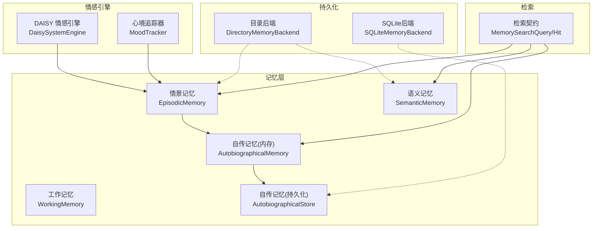

图示来源
- [memory_system.py](file://archive/helios_v1/memory/memory_system.py)
- [autobiographical.py](file://archive/helios_v1/memory/autobiographical.py)
- [backend.py](file://archive/helios_v1/memory/backend.py)
- [sqlite_backend.py](file://archive/helios_v1/memory/sqlite_backend.py)
- [retrieval.py](file://archive/helios_v1/memory/retrieval.py)
- [daisy_emotion.py](file://archive/helios_v1/daisy_emotion.py)
- [mood_tracker.py](file://archive/helios_v1/mood_tracker.py)

章节来源
- [memory_system.py](file://archive/helios_v1/memory/memory_system.py)
- [backend.py](file://archive/helios_v1/memory/backend.py)
- [sqlite_backend.py](file://archive/helios_v1/memory/sqlite_backend.py)
- [retrieval.py](file://archive/helios_v1/memory/retrieval.py)
- [daisy_emotion.py](file://archive/helios_v1/daisy_emotion.py)
- [mood_tracker.py](file://archive/helios_v1/mood_tracker.py)

## 核心组件
- 情感事件数据模型：MemoryItem承载情感三要素（效价、唤醒、Φ）与标签，并提供重要性重算、访问计数、TTL等通用能力。
- 情景记忆EpisodicMemory：按情感相似度检索、按标签过滤、情感模式统计、修剪与晋升至自传记忆。
- 语义记忆SemanticMemory：事实/概念/模式存储，支持置信度衰减与标签索引。
- 自传记忆AutobiographicalStore：追加式JSONL持久化，章节管理、归档轮转、相关性检索。
- 情感引擎DaisySystemEngine：基于Panksepp七系统的情感状态建模与调制。
- 心境MoodTracker：对事件感知进行心境调制，影响后续情感体验。
- 持久化后端：DirectoryMemoryBackend与SQLiteMemoryBackend分别提供JSON/JSONL与关系数据库两种持久化方案。
- 检索契约：MemorySearchQuery/MemorySearchHit等定义跨层检索的输入输出与策略。

章节来源
- [memory_system.py](file://archive/helios_v1/memory/memory_system.py)
- [autobiographical.py](file://archive/helios_v1/memory/autobiographical.py)
- [backend.py](file://archive/helios_v1/memory/backend.py)
- [sqlite_backend.py](file://archive/helios_v1/memory/sqlite_backend.py)
- [retrieval.py](file://archive/helios_v1/memory/retrieval.py)
- [daisy_emotion.py](file://archive/helios_v1/daisy_emotion.py)
- [mood_tracker.py](file://archive/helios_v1/mood_tracker.py)

## 架构总览
情感记忆在Helios中的流转路径如下：
- 情感引擎与心境追踪器产生情感状态快照（效价、唤醒、主导系统、Φ等），进入工作记忆。
- 工作记忆根据重要性阈值与TTL策略，将高重要性条目提升为情景记忆。
- 情景记忆按情感相似度与重要性进行修剪，高重要性者晋升至自传记忆（内存）。
- 自传记忆（内存）与持久化后端（JSONL/SQLite）协同，支持章节化与归档轮转。
- 检索层以关键词、情感、相关性等策略跨层聚合结果，支撑对话与思考。

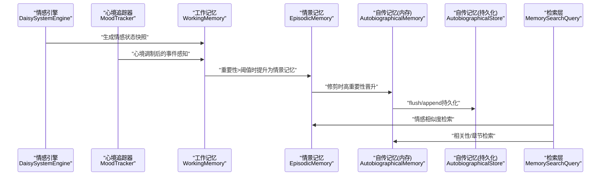

图示来源
- [memory_system.py](file://archive/helios_v1/memory/memory_system.py)
- [autobiographical.py](file://archive/helios_v1/memory/autobiographical.py)
- [daisy_emotion.py](file://archive/helios_v1/daisy_emotion.py)
- [mood_tracker.py](file://archive/helios_v1/mood_tracker.py)
- [retrieval.py](file://archive/helios_v1/memory/retrieval.py)

## 详细组件分析

### 情感事件与重要性计算
- MemoryItem提供情感三要素（valence、arousal、phi）与情感标签（emotional_tag），并内置重要性计算公式，综合情感强度、Φ与访问次数，确保高意义事件在修剪与检索中获得更高权重。
- 重要性重算逻辑在记录与周期性巩固阶段执行，保证动态调整。

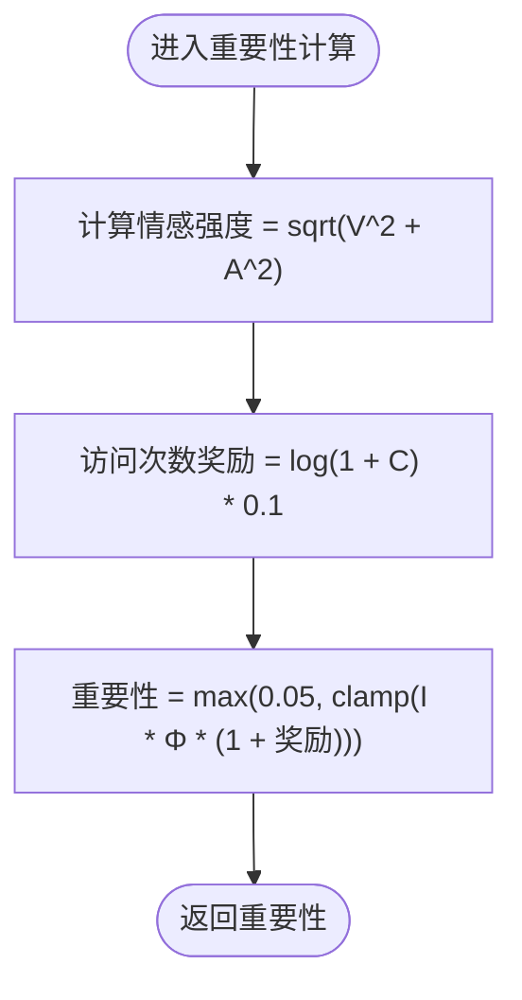

图示来源
- [memory_system.py](file://archive/helios_v1/memory/memory_system.py)

章节来源
- [memory_system.py](file://archive/helios_v1/memory/memory_system.py)

### 情景记忆：情感相似度检索与修剪
- 情感相似度：以效价与唤醒的距离加权计算，结合时间衰减与重要性，形成综合得分。
- 标签检索：按情感标签快速筛选高相关记忆。
- 修剪策略：按重要性降序保留，超过阈值的条目在丢弃前晋升至自传记忆，避免高意义事件丢失。

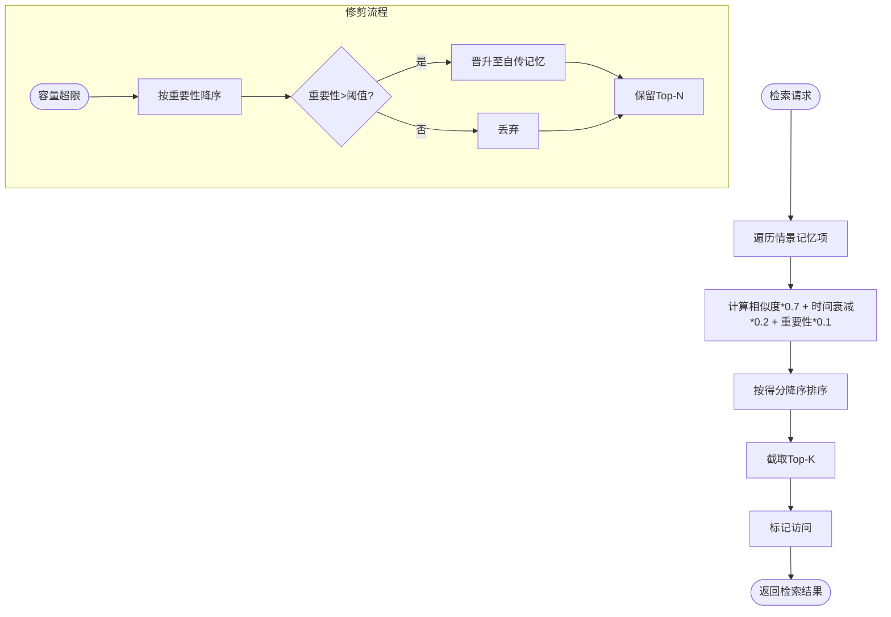

图示来源
- [memory_system.py](file://archive/helios_v1/memory/memory_system.py)

章节来源
- [memory_system.py](file://archive/helios_v1/memory/memory_system.py)

### 语义记忆：事实与模式学习
- 事实学习：重复学习增强置信度，支持标签索引；长期不访问触发衰减，低于阈值的事实被清理。
- 模式学习：从情景记忆聚类中抽取情感模式（如“恐惧→平静”），以pattern键存储，供后续检索与推理使用。

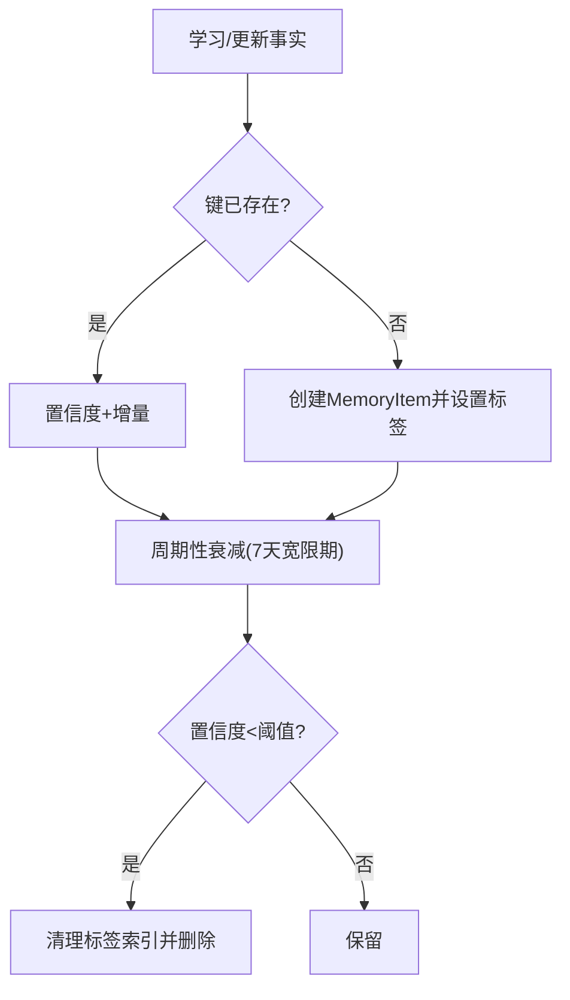

图示来源
- [memory_system.py](file://archive/helios_v1/memory/memory_system.py)

章节来源
- [memory_system.py](file://archive/helios_v1/memory/memory_system.py)

### 自传记忆：章节化与相关性检索
- 追加式JSONL持久化，支持章节自动切分（按时刻数量或Φ尖峰），并定期归档轮转，保留最新时刻集合。
- 相关性检索：基于叙事、触发事件、章节、标签与情感标签的多维匹配，叠加Φ与显著性权重，形成最终相关性分数。

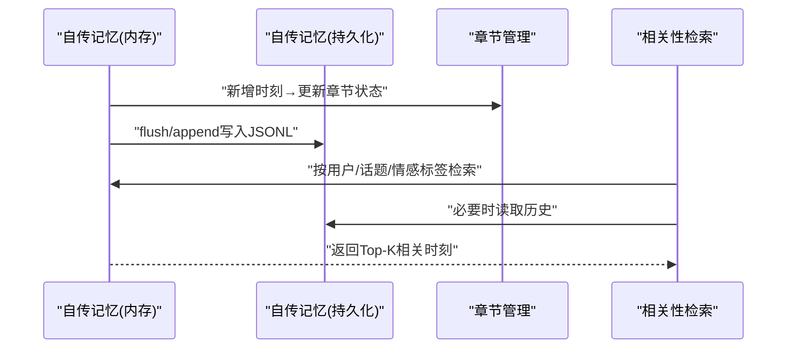

图示来源
- [autobiographical.py](file://archive/helios_v1/memory/autobiographical.py)

章节来源
- [autobiographical.py](file://archive/helios_v1/memory/autobiographical.py)

### 情感引擎与心境调制
- 情感引擎：基于Panksepp七系统，计算各系统激活向量与主导系统，输出情感状态序列。
- 心境调制：对事件感知进行效价与唤醒的偏置，使后续记忆在情感上更具一致性。

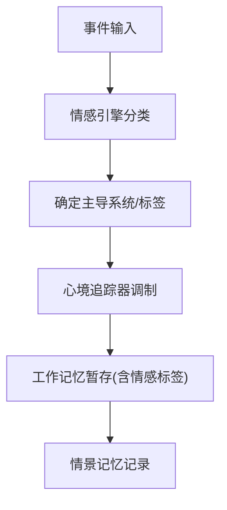

图示来源
- [daisy_emotion.py](file://archive/helios_v1/daisy_emotion.py)
- [mood_tracker.py](file://archive/helios_v1/mood_tracker.py)
- [memory_system.py](file://archive/helios_v1/memory/memory_system.py)

章节来源
- [daisy_emotion.py](file://archive/helios_v1/daisy_emotion.py)
- [mood_tracker.py](file://archive/helios_v1/mood_tracker.py)
- [memory_system.py](file://archive/helios_v1/memory/memory_system.py)

### 持久化策略与后端
- 目录后端：提供semantic/episodic JSON与autobiographical JSONL的读写，支持原子写入与错误容忍。
- SQLite后端：统一存储语义、情景与自传记忆，提供索引与归档表，适合大规模运行与跨进程共享。

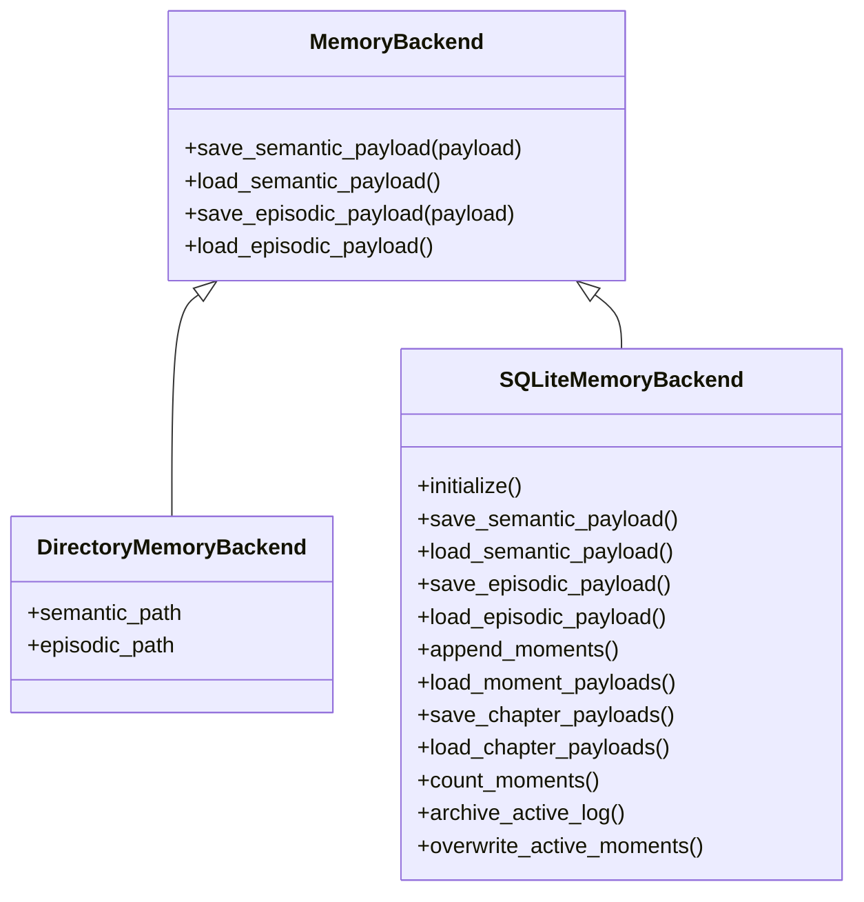

图示来源
- [backend.py](file://archive/helios_v1/memory/backend.py)
- [sqlite_backend.py](file://archive/helios_v1/memory/sqlite_backend.py)

章节来源
- [backend.py](file://archive/helios_v1/memory/backend.py)
- [sqlite_backend.py](file://archive/helios_v1/memory/sqlite_backend.py)

### 检索契约与跨层检索
- 检索契约定义了查询文本、用户ID、历史文本、情感参数、限制数量与检索策略（关键词、情感、相关性、向量）。
- 跨层聚合：工作记忆、情景记忆、语义记忆与自传记忆共同参与，形成定向检索包，支持可观测性追踪。

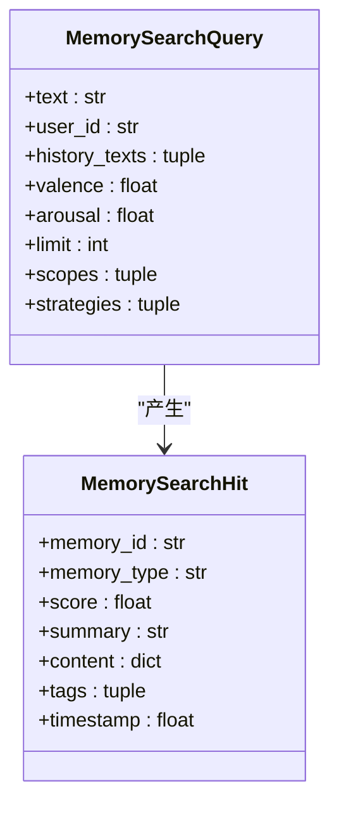

图示来源
- [retrieval.py](file://archive/helios_v1/memory/retrieval.py)

章节来源
- [retrieval.py](file://archive/helios_v1/memory/retrieval.py)

### 情感记忆的提取算法
- 情感一致性检索：以目标效价/唤醒为中心，计算与历史记忆的相似度，结合时间衰减与重要性，排序返回。
- 情感强度排序：综合情感强度、重要性与时间因素，确保近期且高意义的记忆优先。
- 情感相关性计算：在自传记忆层面，结合叙事、标签、章节与显著性，叠加Φ权重，形成最终相关性分数。

章节来源
- [memory_system.py](file://archive/helios_v1/memory/memory_system.py)
- [autobiographical.py](file://archive/helios_v1/memory/autobiographical.py)

### 创建/更新/删除与压缩去重
- 创建：通过情感引擎与心境追踪器生成状态，进入工作记忆；重要性阈值触发情景记忆记录。
- 更新：MemoryItem提供访问计数与重要性重算；SemanticMemory重复学习增强置信度。
- 删除：情景记忆修剪丢弃低重要性项；语义记忆置信度衰减清理；自传记忆归档轮转保留最新。
- 压缩去重：MemoryCompressor按日期聚合旧时刻，生成摘要替换，减少活跃视图体量。

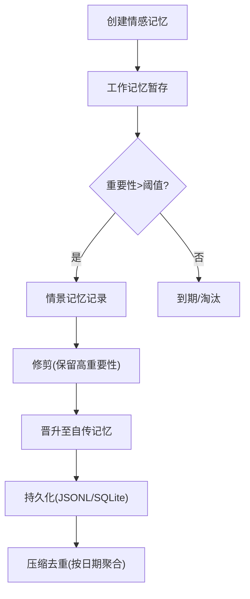

图示来源
- [memory_system.py](file://archive/helios_v1/memory/memory_system.py)
- [memory_compressor.py](file://archive/helios_v1/memory/memory_compressor.py)
- [autobiographical.py](file://archive/helios_v1/memory/autobiographical.py)

章节来源
- [memory_system.py](file://archive/helios_v1/memory/memory_system.py)
- [memory_compressor.py](file://archive/helios_v1/memory/memory_compressor.py)
- [autobiographical.py](file://archive/helios_v1/memory/autobiographical.py)

### 身份治理与自我修订中的情感记忆
- 身份治理：通过IdentityGovernance对身份修订提案进行评估与记录，确保变更可审计、可追溯。
- 情感记忆的作用：自传记忆中的情感高峰与章节主题为身份叙事提供素材，自我修订过程可参考历史情感轨迹与显著时刻。

章节来源
- [identity_governance.py](file://archive/helios_v1/identity_governance.py)
- [autobiographical.py](file://archive/helios_v1/memory/autobiographical.py)

## 依赖分析
- 模块耦合：记忆系统内部以MemoryItem为核心，EpisodicMemory与SemanticMemory共享情感三要素；AutobiographicalStore依赖持久化后端；检索层通过契约解耦具体实现。
- 外部依赖：情感引擎与心境追踪器为记忆系统提供输入；测试用例验证巩固阈值与模式提取行为。

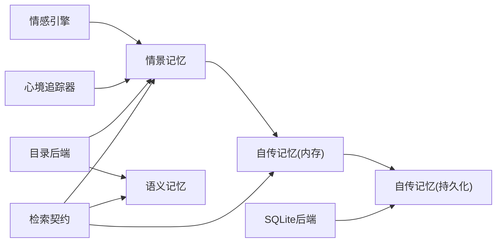

图示来源
- [memory_system.py](file://archive/helios_v1/memory/memory_system.py)
- [autobiographical.py](file://archive/helios_v1/memory/autobiographical.py)
- [backend.py](file://archive/helios_v1/memory/backend.py)
- [sqlite_backend.py](file://archive/helios_v1/memory/sqlite_backend.py)
- [retrieval.py](file://archive/helios_v1/memory/retrieval.py)
- [daisy_emotion.py](file://archive/helios_v1/daisy_emotion.py)
- [mood_tracker.py](file://archive/helios_v1/mood_tracker.py)

章节来源
- [memory_system.py](file://archive/helios_v1/memory/memory_system.py)
- [autobiographical.py](file://archive/helios_v1/memory/autobiographical.py)
- [backend.py](file://archive/helios_v1/memory/backend.py)
- [sqlite_backend.py](file://archive/helios_v1/memory/sqlite_backend.py)
- [retrieval.py](file://archive/helios_v1/memory/retrieval.py)
- [daisy_emotion.py](file://archive/helios_v1/daisy_emotion.py)
- [mood_tracker.py](file://archive/helios_v1/mood_tracker.py)

## 性能考虑
- 重要性重算：在记录与周期性巩固阶段批量重算，降低每次检索的开销。
- 检索权重：情感相似度占0.7、时间衰减占0.2、重要性占0.1，兼顾新鲜度与意义。
- 索引与归档：SQLite后端建立时间与键索引；自传记忆JSONL定期归档轮转，保持活跃文件大小可控。
- 压缩去重：按日期聚合旧时刻，减少活跃视图体量，提升检索速度。

## 故障排查指南
- 持久化失败：检查目录权限与磁盘空间；目录后端采用原子写入，异常时保留原文件；SQLite后端提供事务与索引。
- 数据损坏：JSON/JSONL加载时跳过损坏行并记录警告；语义记忆置信度衰减清理无效事实。
- 测试验证：通过一致性测试验证巩固阈值与模式提取行为，确保情感模式正确抽象与存储。

章节来源
- [backend.py](file://archive/helios_v1/memory/backend.py)
- [sqlite_backend.py](file://archive/helios_v1/memory/sqlite_backend.py)
- [memory_system.py](file://archive/helios_v1/memory/memory_system.py)
- [test_consolidation_pbt.py](file://archive/helios_v1/tests/test_consolidation_pbt.py)
- [test_consolidation_scheduling.py](file://archive/helios_v1/tests/test_consolidation_scheduling.py)

## 结论
Helios情感记忆系统以MemoryItem为核心，构建了从情感引擎输入到工作记忆、情景记忆、语义记忆与自传记忆的完整链路。通过情感相似度检索、重要性重算与修剪、模式抽象与持久化，实现了情感一致性、强度排序与相关性计算的统一。结合身份治理与自我修订，情感记忆成为塑造与反思“自我”的关键基石。

## 附录
- 情感标签体系：基于效价与唤醒划分（如ecstatic、fearful、serene等），用于检索与模式识别。
- 巩固阈值：低Φ时采用0.25阈值，高Φ时采用0.4阈值，确保高意义事件被保留与抽象。
- 相关性检索：自传记忆层面综合叙事、标签、章节与显著性，叠加情感权重，提升检索质量。