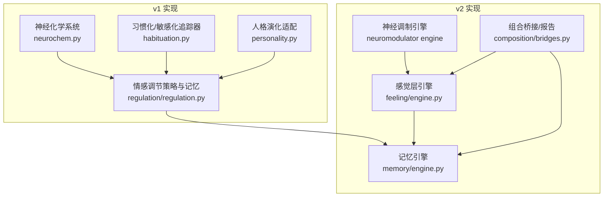
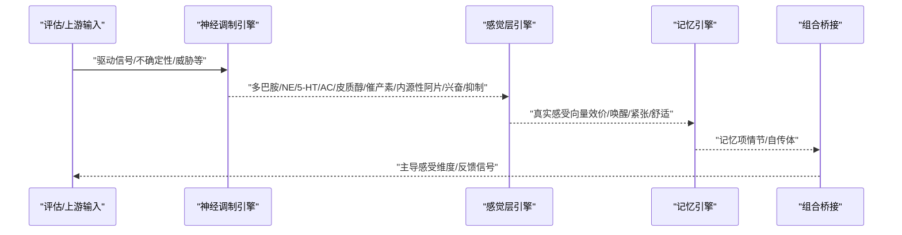
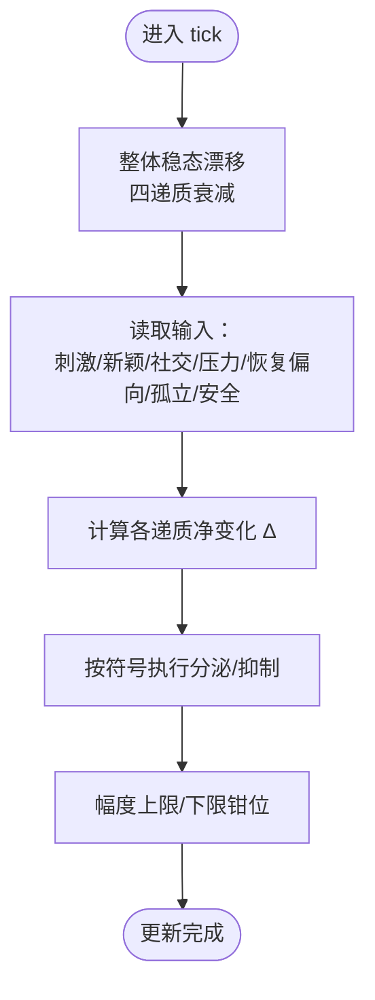
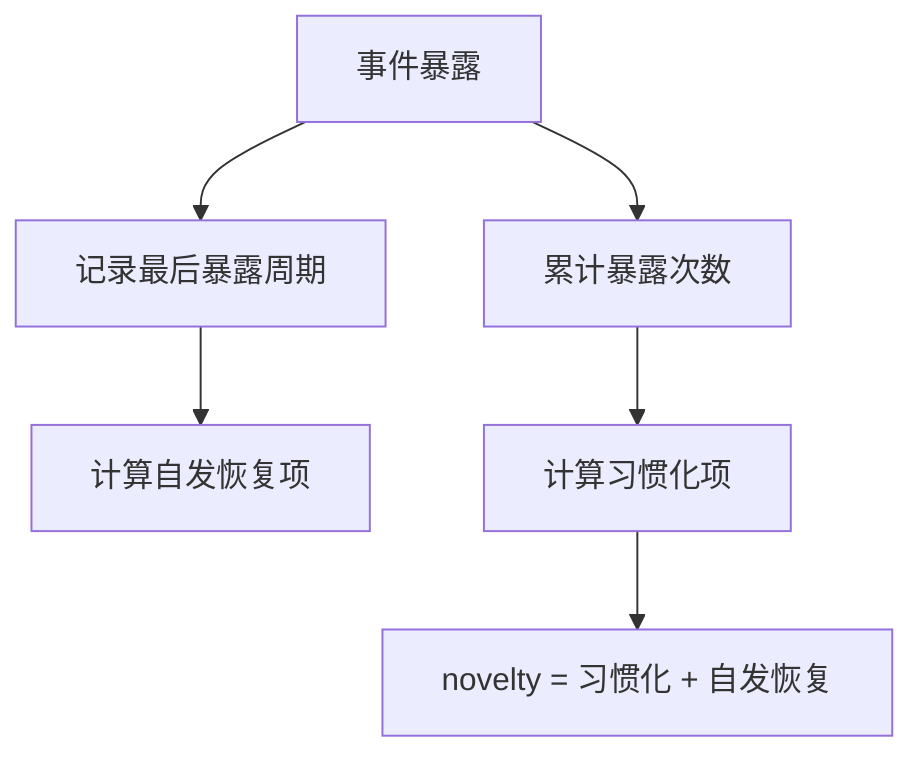
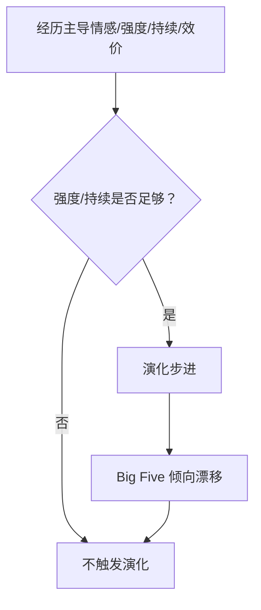
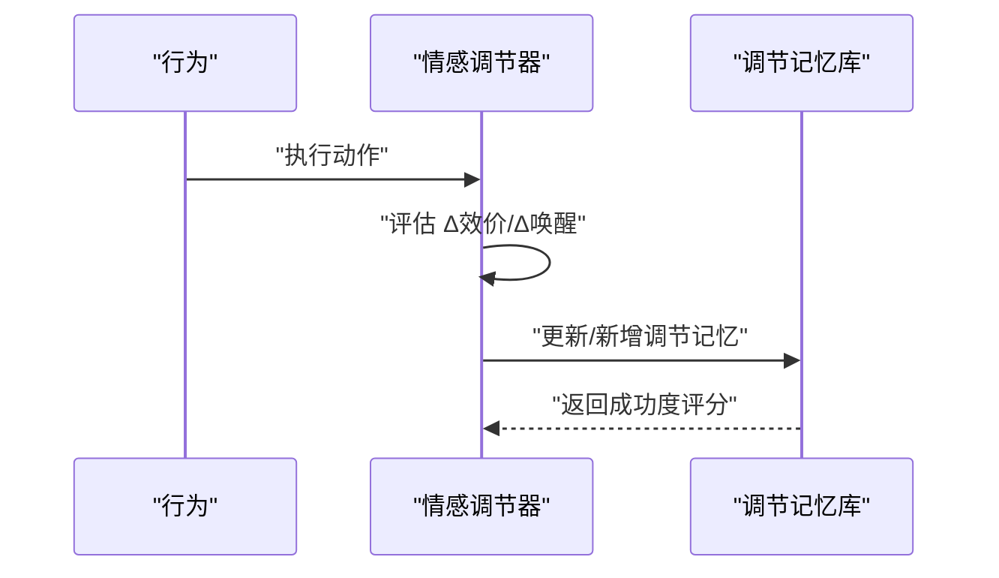
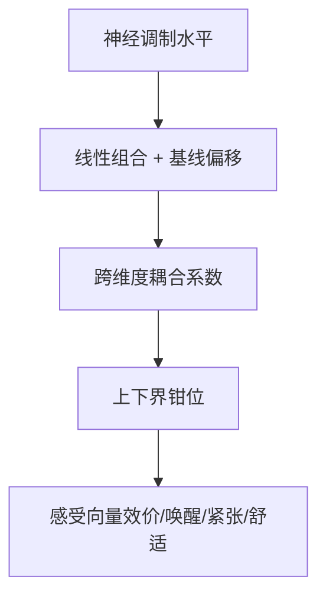
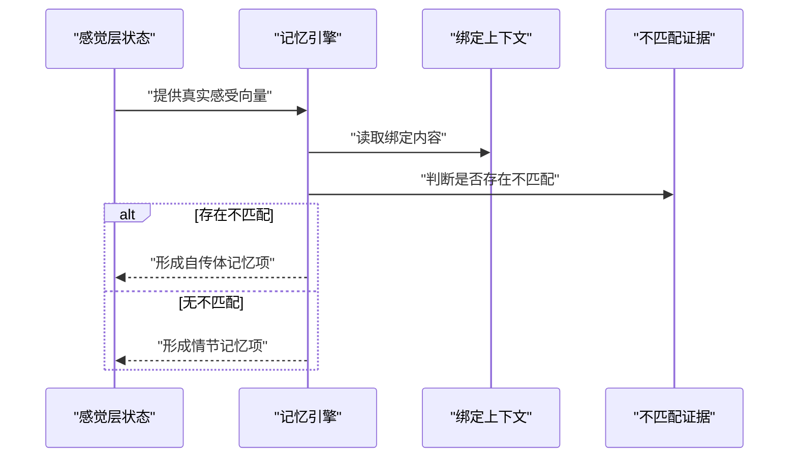
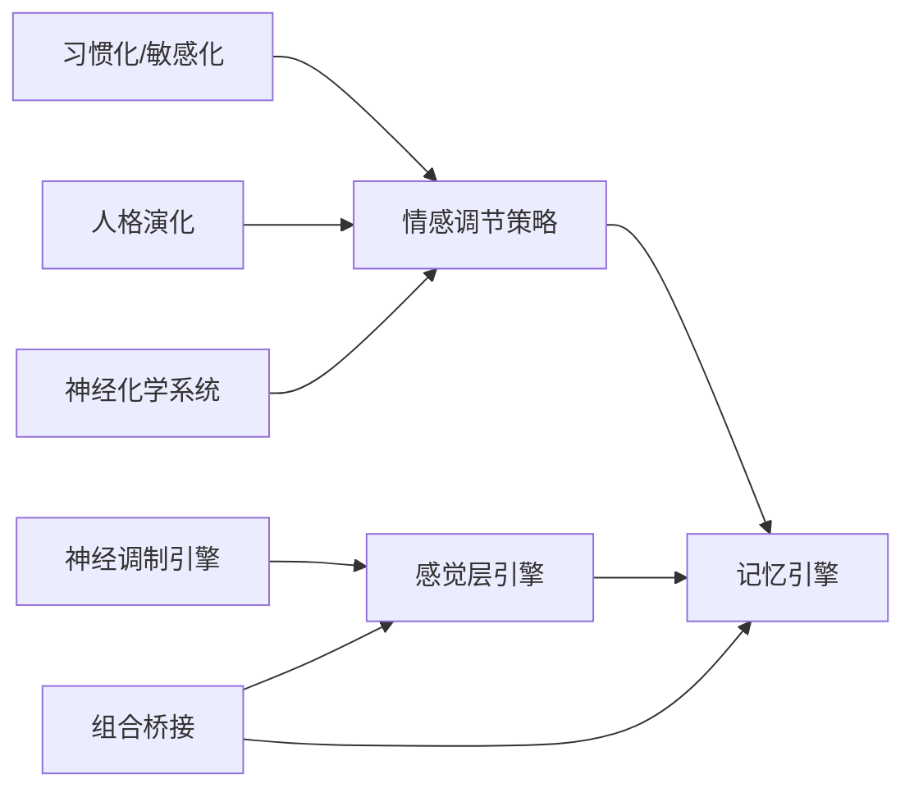

# 情感调节

<cite>
**本文引用的文件**
- [neurochem.py](file://archive/helios_v1/neurochem.py)
- [habituation.py](file://archive/helios_v1/habituation.py)
- [personality.py](file://archive/helios_v1/personality.py)
- [regulation.py](file://archive/helios_v1/regulation/regulation.py)
- [engine.py](file://helios_v2/src/helios_v2/feeling/engine.py)
- [design.md（神经调制系统）](file://helios_v2/docs/requirements/04-neuromodulator-system/design.md)
- [design.md（情感记忆形成）](file://helios_v2/docs/requirements/45-affect-memory-formation-and-durable-store/design.md)
- [bridges.py](file://helios_v2/src/helios_v2/composition/bridges.py)
- [engine.py（内存引擎）](file://helios_v2/src/helios_v2/memory/engine.py)
- [test_neuromodulator_engine.py](file://helios_v2/tests/test_neuromodulator_engine.py)
- [test_memory_engine.py](file://helios_v2/tests/test_memory_engine.py)
</cite>

## 目录
1. [引言](#引言)
2. [项目结构](#项目结构)
3. [核心组件](#核心组件)
4. [架构总览](#架构总览)
5. [详细组件分析](#详细组件分析)
6. [依赖关系分析](#依赖关系分析)
7. [性能考量](#性能考量)
8. [故障排查指南](#故障排查指南)
9. [结论](#结论)
10. [附录](#附录)

## 引言
本技术文档围绕Helios情感调节系统，系统性阐述其情感适应机制（习惯化、敏感化与情感调节）、反馈控制回路（正/负反馈在情感稳态中的作用）、神经递质系统的动态平衡与参数调节策略，并结合v1与v2两代实现给出参数配置、波动抑制与恢复加速的实践建议。文档同时覆盖个性化设置、适应性学习与长期情感健康维护方案，以及在认知负荷管理、压力应对与情绪稳定性中的关键应用。

## 项目结构
Helios情感调节体系由两代实现构成：
- v1：以神经化学系统为核心，包含多递质动态（多巴胺、内源性阿片、催产素、皮质醇），并引入习惯化/敏感化追踪器与人格演化适配。
- v2：以“感觉层”（Interoceptive Feeling）为中心，将神经调制（多巴胺、去甲肾上腺素、血清素、乙酰胆碱、皮质醇、催产素、内源性阿片、兴奋/抑制）映射到主观感受向量（效价、唤醒、紧张、舒适等），并通过确定性路径形成情感记忆，支持长期情感健康维护。

**图表来源**
- [neurochem.py:290-390](file://archive/helios_v1/neurochem.py#L290-L390)
- [habituation.py:17-43](file://archive/helios_v1/habituation.py#L17-L43)
- [personality.py:214-246](file://archive/helios_v1/personality.py#L214-L246)
- [regulation.py:493-524](file://archive/helios_v1/regulation/regulation.py#L493-L524)
- [engine.py:266-348](file://helios_v2/src/helios_v2/feeling/engine.py#L266-L348)
- [engine.py（内存引擎）:453-487](file://helios_v2/src/helios_v2/memory/engine.py#L453-L487)
- [bridges.py:550-585](file://helios_v2/src/helios_v2/composition/bridges.py#L550-L585)

**章节来源**
- [neurochem.py:290-390](file://archive/helios_v1/neurochem.py#L290-L390)
- [habituation.py:17-43](file://archive/helios_v1/habituation.py#L17-L43)
- [personality.py:214-246](file://archive/helios_v1/personality.py#L214-L246)
- [regulation.py:493-524](file://archive/helios_v1/regulation/regulation.py#L493-L524)
- [engine.py:266-348](file://helios_v2/src/helios_v2/feeling/engine.py#L266-L348)
- [engine.py（内存引擎）:453-487](file://helios_v2/src/helios_v2/memory/engine.py#L453-L487)
- [bridges.py:550-585](file://helios_v2/src/helios_v2/composition/bridges.py#L550-L585)

## 核心组件
- 神经化学系统（v1）：以多递质（多巴胺、内源性阿片、催产素、皮质醇）的分泌/抑制与衰减为基础，构建情感稳态的生物化学回路；通过参数调节实现对情感状态的动态平衡。
- 习惯化/敏感化追踪器（v1）：基于Groves-Thompson双重过程，量化新颖度因子，刻画反应递减与系统唤醒状态对适应速度的影响。
- 人格演化适配（v1）：将经历映射到Big Five倾向漂移，体现长期情感塑造与适应性学习。
- 感觉层引擎（v2）：将神经调制水平线性映射为效价、唤醒、紧张、舒适等维度，提供确定性的双时间尺度感觉持久化与边界约束。
- 记忆引擎（v2）：以情感向量为“情感标签”，在有预测不匹配时形成自传体记忆，否则形成情节记忆，支撑长期情感健康维护。
- 组合桥接（v2）：报告主导感受维度（如唤醒、紧张），并提供第一版记忆形成路径，确保跨模块协同。

**章节来源**
- [neurochem.py:118-141](file://archive/helios_v1/neurochem.py#L118-L141)
- [neurochem.py:303-360](file://archive/helios_v1/neurochem.py#L303-L360)
- [habituation.py:37-43](file://archive/helios_v1/habituation.py#L37-L43)
- [personality.py:214-246](file://archive/helios_v1/personality.py#L214-L246)
- [engine.py:266-348](file://helios_v2/src/helios_v2/feeling/engine.py#L266-L348)
- [engine.py（内存引擎）:453-487](file://helios_v2/src/helios_v2/memory/engine.py#L453-L487)
- [bridges.py:550-585](file://helios_v2/src/helios_v2/composition/bridges.py#L550-L585)

## 架构总览
情感调节在v2中采用“神经调制→感觉层→记忆”的确定性流水线，v1则通过神经化学动态与行为反馈共同维持稳态。两者均强调反馈控制（负反馈维持稳态、正反馈在适度范围内放大积极信号）与参数化调节（学习率、衰减、耦合强度等）。

**图表来源**
- [design.md（神经调制系统）:48-83](file://helios_v2/docs/requirements/04-neuromodulator-system/design.md#L48-L83)
- [engine.py:266-348](file://helios_v2/src/helios_v2/feeling/engine.py#L266-L348)
- [engine.py（内存引擎）:453-487](file://helios_v2/src/helios_v2/memory/engine.py#L453-L487)
- [bridges.py:550-585](file://helios_v2/src/helios_v2/composition/bridges.py#L550-L585)

## 详细组件分析

### v1 神经化学系统与情感稳态
- 多递质动态：系统在每次tick中对四种主要递质进行整体衰减，并根据刺激驱动、新颖性、社交驱动、压力负荷、恢复偏向、孤立压力、安全信号等输入计算净变化，决定分泌或抑制幅度。
- 参数调节：通过modulation_map对多个行为参数进行加权调制，例如降低点火阈值、提升探索权重、缓解恐惧-嬉戏抑制等，体现多巴胺在情感-行为调节中的中心地位。
- 生物学基础：内源性阿片与催产素促进社交满足与平静，皮质醇反映持续威胁与不可控负荷，多巴胺驱动奖励与新奇响应。

**图表来源**
- [neurochem.py:290-390](file://archive/helios_v1/neurochem.py#L290-L390)

**章节来源**
- [neurochem.py:290-390](file://archive/helios_v1/neurochem.py#L290-L390)

### v1 习惯化与敏感化追踪器
- 新颖度因子：综合事件暴露次数、上次暴露周期与当前唤醒水平，计算novelty因子，刻画反应递减与系统唤醒状态对适应速度的影响。
- 自发恢复：长时间无暴露后反应部分恢复，避免完全麻木。

**图表来源**
- [habituation.py:32-43](file://archive/helios_v1/habituation.py#L32-L43)

**章节来源**
- [habituation.py:17-43](file://archive/helios_v1/habituation.py#L17-L43)

### v1 人格演化适配
- 将主导情感系统（如寻求、嬉戏、照顾、分离焦虑、恐惧、愤怒、性驱力）的强度与持续时间映射到Big Five倾向的漂移，体现长期情感塑造与适应性学习。

**图表来源**
- [personality.py:214-246](file://archive/helios_v1/personality.py#L214-L246)

**章节来源**
- [personality.py:214-246](file://archive/helios_v1/personality.py#L214-L246)

### v1 情感调节策略与记忆
- 行为-情感映射：记录动作对情感状态（Δ效价、Δ唤醒）的影响，形成调节记忆并用于后续策略选择。
- 持久化：将调节记忆保存到数据目录，支持重启后继续学习。

**图表来源**
- [regulation.py:493-524](file://archive/helios_v1/regulation/regulation.py#L493-L524)

**章节来源**
- [regulation.py:493-524](file://archive/helios_v1/regulation/regulation.py#L493-L524)

### v2 感觉层引擎与双时间尺度动态
- 线性映射：将多巴胺、内源性阿片、血清素、皮质醇等水平映射为效价、唤醒、紧张、舒适等维度，辅以兴奋/抑制通道，形成确定性且可边界化的主观感受向量。
- 双时间尺度：phasic（瞬时）与tonic（稳态）动态，确保在低驱动下仍保持一定水平，避免快速回弹导致的不稳定。

**图表来源**
- [engine.py:266-348](file://helios_v2/src/helios_v2/feeling/engine.py#L266-L348)

**章节来源**
- [engine.py:266-348](file://helios_v2/src/helios_v2/feeling/engine.py#L266-L348)
- [test_neuromodulator_engine.py:360-430](file://helios_v2/tests/test_neuromodulator_engine.py#L360-L430)

### v2 记忆形成与情感标签
- 形成路径：以真实感受向量作为情感标签，结合绑定上下文形成记忆项；当存在预测不匹配证据时，优先形成自传体记忆以强化学习。
- 确定性与可复现：路径确定、边界清晰，便于测试与验证。

**图表来源**
- [engine.py（内存引擎）:453-487](file://helios_v2/src/helios_v2/memory/engine.py#L453-L487)
- [design.md（情感记忆形成）:28-53](file://helios_v2/docs/requirements/45-affect-memory-formation-and-durable-store/design.md#L28-L53)

**章节来源**
- [engine.py（内存引擎）:453-487](file://helios_v2/src/helios_v2/memory/engine.py#L453-L487)
- [design.md（情感记忆形成）:28-53](file://helios_v2/docs/requirements/45-affect-memory-formation-and-durable-store/design.md#L28-L53)
- [test_memory_engine.py:494-541](file://helios_v2/tests/test_memory_engine.py#L494-L541)

### v2 组合桥接与主导维度报告
- 报告主导感受维度（如唤醒、紧张），为后续策略与反馈提供明确信号。
- 提供第一版记忆形成路径，确保跨模块协作的一致性与可追踪性。

**章节来源**
- [bridges.py:550-585](file://helios_v2/src/helios_v2/composition/bridges.py#L550-L585)

## 依赖关系分析
- v1：神经化学系统与人格演化适配共同影响行为参数与情感状态；习惯化/敏感化追踪器通过novelty因子间接调节输入权重；情感调节策略基于行为-情感映射的记忆进行学习与优化。
- v2：神经调制引擎输出多维水平，感觉层引擎将其映射为感受向量；记忆引擎依据情感标签与绑定上下文形成记忆；组合桥接负责维度报告与路径选择。

**图表来源**
- [habituation.py:32-43](file://archive/helios_v1/habituation.py#L32-L43)
- [personality.py:214-246](file://archive/helios_v1/personality.py#L214-L246)
- [neurochem.py:290-390](file://archive/helios_v1/neurochem.py#L290-L390)
- [regulation.py:493-524](file://archive/helios_v1/regulation/regulation.py#L493-L524)
- [engine.py:266-348](file://helios_v2/src/helios_v2/feeling/engine.py#L266-L348)
- [engine.py（内存引擎）:453-487](file://helios_v2/src/helios_v2/memory/engine.py#L453-L487)
- [bridges.py:550-585](file://helios_v2/src/helios_v2/composition/bridges.py#L550-L585)

**章节来源**
- 同上

## 性能考量
- v1：递质衰减与参数调制计算开销较低，适合在线运行；novelty因子与人格演化步进需注意阈值设定，避免过度学习导致漂移。
- v2：感觉层线性映射与记忆形成均为确定性路径，计算简单；双时间尺度动态需合理设置phasic/tonic衰减参数，保证在低驱动下仍具备足够的“携带”能力，避免抖动。

[本节为通用指导，无需特定文件来源]

## 故障排查指南
- 神经调制不稳定：检查驱动路径与衰减参数，参考测试用例中对phasic/tonic回归与边界保持的验证方法。
- 感官映射异常：确认线性组合系数与边界钳位设置，确保各维度在合理范围。
- 记忆形成失败：检查绑定上下文是否为空，以及是否存在预测不匹配证据以触发自传体记忆。

**章节来源**
- [test_neuromodulator_engine.py:360-430](file://helios_v2/tests/test_neuromodulator_engine.py#L360-L430)
- [engine.py:266-348](file://helios_v2/src/helios_v2/feeling/engine.py#L266-L348)
- [test_memory_engine.py:494-541](file://helios_v2/tests/test_memory_engine.py#L494-L541)

## 结论
Helios情感调节系统通过v1的神经化学稳态与v2的感觉层映射，实现了从生物学基础到主观体验再到长期记忆的完整闭环。v1强调递质动态与适应学习，v2强调确定性映射与可追踪记忆。两者共同提供了情感稳态维持、波动抑制与恢复加速的工程化路径，并为个性化设置、适应性学习与长期情感健康维护奠定了坚实基础。

[本节为总结，无需特定文件来源]

## 附录

### 参数配置与调节建议（v1）
- 递质衰减与净变化：根据刺激驱动、新颖性、社交驱动、压力负荷、恢复偏向、孤立压力、安全信号等输入，调整各递质的增减权重与幅度上限/下限。
- 参数调制：利用modulation_map对点火阈值、探索权重、寻求提升、恐惧-嬉戏抑制等进行加权，以实现情感-行为的动态平衡。
- 习惯化/敏感化：通过novelty因子控制反应递减速度，结合系统唤醒水平避免完全麻木。
- 人格演化：设定最小经历强度与持续时间阈值，确保演化步进的稳健性。

**章节来源**
- [neurochem.py:118-141](file://archive/helios_v1/neurochem.py#L118-L141)
- [neurochem.py:303-360](file://archive/helios_v1/neurochem.py#L303-L360)
- [habituation.py:37-43](file://archive/helios_v1/habituation.py#L37-L43)
- [personality.py:214-246](file://archive/helios_v1/personality.py#L214-L246)

### 参数配置与调节建议（v2）
- 感觉层映射：为各维度设置线性映射系数与边界钳位，确保在高/低递质水平下仍能产生稳定的效价、唤醒、紧张与舒适感。
- 双时间尺度：设置phasic与tonic的衰减参数，使系统在低驱动下仍保持一定水平，避免快速回弹。
- 记忆形成：根据是否存在预测不匹配证据，自动选择情节或自传体记忆，强化学习效果。

**章节来源**
- [engine.py:266-348](file://helios_v2/src/helios_v2/feeling/engine.py#L266-L348)
- [engine.py（内存引擎）:453-487](file://helios_v2/src/helios_v2/memory/engine.py#L453-L487)
- [test_neuromodulator_engine.py:360-430](file://helios_v2/tests/test_neuromodulator_engine.py#L360-L430)

### 个性化设置与长期维护
- 个性化：通过组合桥接报告主导感受维度，结合记忆引擎的自传体记忆，形成针对个体的调节策略。
- 适应性学习：v1的人格演化与v2的记忆形成均支持持续学习，建议定期评估情感标签与绑定上下文的匹配度，动态调整映射与边界。
- 长期情感健康：通过自传体记忆强化积极体验，抑制负面回路，结合认知负荷管理与压力应对策略，维持情绪稳定性。

**章节来源**
- [bridges.py:550-585](file://helios_v2/src/helios_v2/composition/bridges.py#L550-L585)
- [engine.py（内存引擎）:453-487](file://helios_v2/src/helios_v2/memory/engine.py#L453-L487)
- [design.md（情感记忆形成）:28-53](file://helios_v2/docs/requirements/45-affect-memory-formation-and-durable-store/design.md#L28-L53)