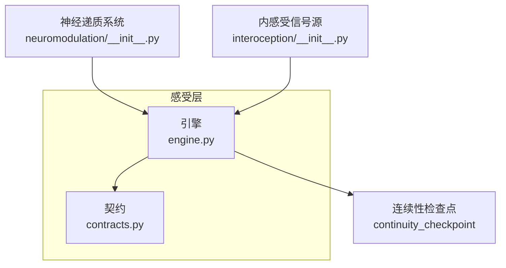
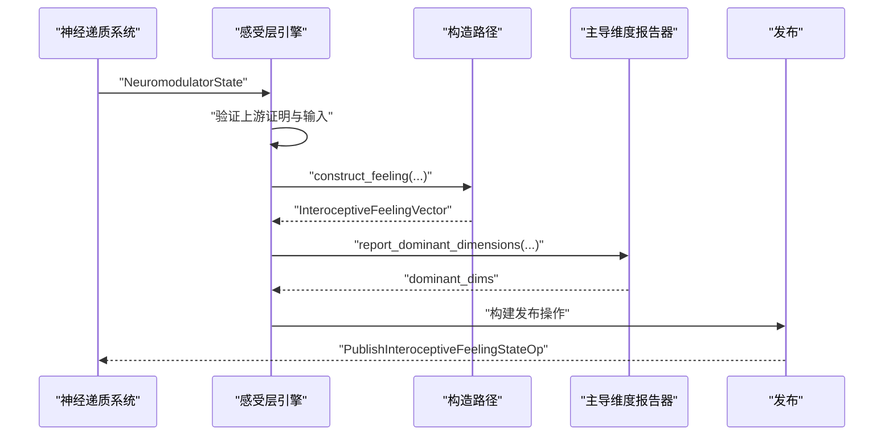
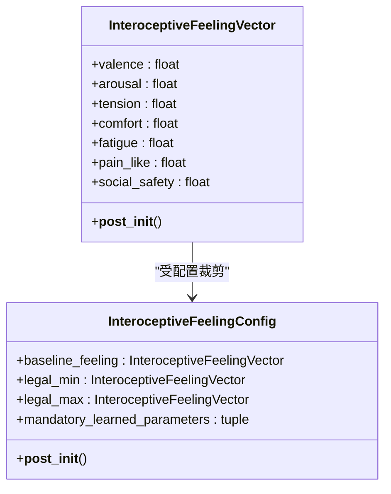
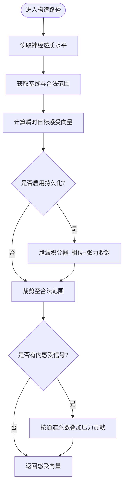
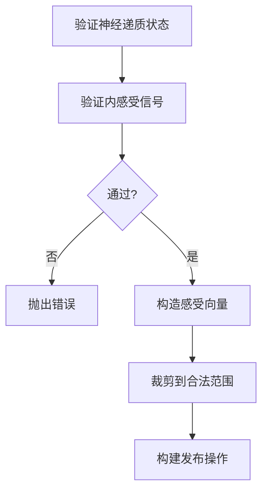
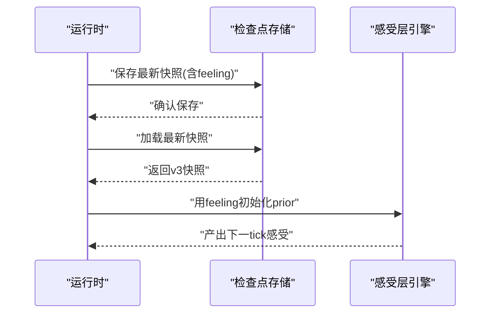
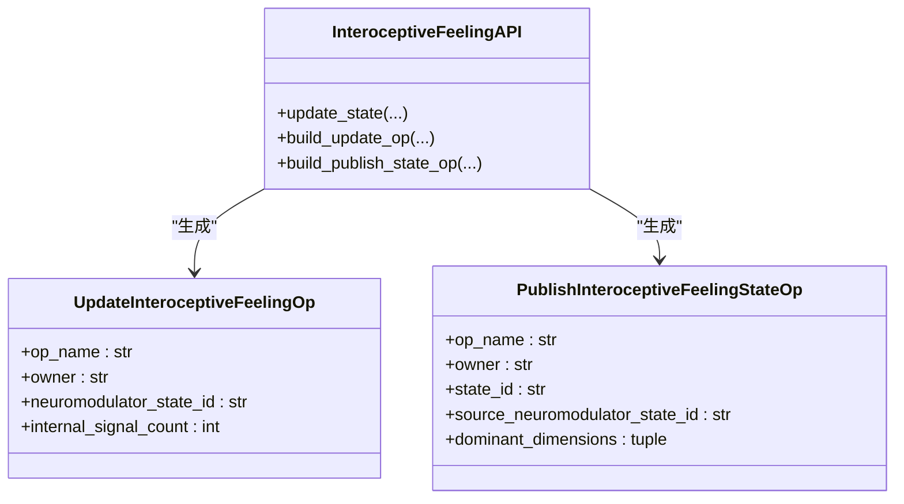
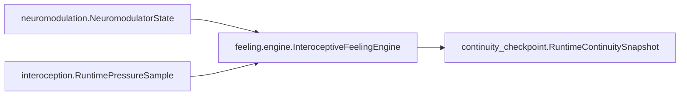

# 感受层

<cite>
**本文引用的文件**
- [feeling/contracts.py](file://helios_v2/src/helios_v2/feeling/contracts.py)
- [feeling/engine.py](file://helios_v2/src/helios_v2/feeling/engine.py)
- [neuromodulation/__init__.py](file://helios_v2/src/helios_v2/neuromodulation/__init__.py)
- [interoception/__init__.py](file://helios_v2/src/helios_v2/interoception/__init__.py)
- [test_interoceptive_feeling_engine.py](file://helios_v2/tests/test_interoceptive_feeling_engine.py)
- [test_interoceptive_feeling_contracts.py](file://helios_v2/tests/test_interoceptive_feeling_contracts.py)
- [test_continuity_checkpoint_engine.py](file://helios_v2/tests/test_continuity_checkpoint_engine.py)
- [44-双时间尺度感受持久化/description.md](file://helios_v2/docs/requirements/44-dual-timescale-feeling-persistence/design.md)
- [05-内感受感受层/设计说明.md](file://helios_v2/docs/requirements/05-interoceptive-feeling-layer/design.md)
- [38-神经递质驱动感受/description.md](file://helios_v2/docs/requirements/38-neuromodulator-derived-feeling/requirement.md)
</cite>

## 目录
1. [引言](#引言)
2. [项目结构](#项目结构)
3. [核心组件](#核心组件)
4. [架构总览](#架构总览)
5. [详细组件分析](#详细组件分析)
6. [依赖分析](#依赖分析)
7. [性能考虑](#性能考虑)
8. [故障排查指南](#故障排查指南)
9. [结论](#结论)
10. [附录](#附录)

## 引言
本文件面向Helios“感受层”（Interoceptive Feeling Layer）系统，系统性阐述如何将神经递质水平映射并累积为可观察的主观感受状态，包括感受向量的构建与表示、多维情感空间的建模与约束、与神经递质系统的耦合机制、实时更新与稳定维持策略，并给出实现路径与验证依据。文档同时覆盖观测性设计、调试工具与性能优化建议，以及感受层在意识形成中的角色与跨系统交互。

## 项目结构
感受层位于运行时模块“feeling”中，围绕以下契约与引擎展开：
- 契约层：定义不可变的感受向量、配置、状态与操作契约，确保输入合法性与输出范围约束。
- 引擎层：负责更新编排、构造路径选择、发布操作生成与主导维度报告。
- 依赖关系：从“neuromodulation”获取神经递质状态；通过“interoception”接入内感受信号；与“continuity_checkpoint”协作实现跨tick持久化。

图表来源
- [feeling/engine.py:118-241](file://helios_v2/src/helios_v2/feeling/engine.py#L118-L241)
- [feeling/contracts.py:35-127](file://helios_v2/src/helios_v2/feeling/contracts.py#L35-L127)
- [neuromodulation/__init__.py:14-31](file://helios_v2/src/helios_v2/neuromodulation/__init__.py#L14-L31)
- [interoception/__init__.py:9-22](file://helios_v2/src/helios_v2/interoception/__init__.py#L9-L22)

章节来源
- [feeling/contracts.py:1-258](file://helios_v2/src/helios_v2/feeling/contracts.py#L1-L258)
- [feeling/engine.py:1-611](file://helios_v2/src/helios_v2/feeling/engine.py#L1-L611)
- [neuromodulation/__init__.py:1-48](file://helios_v2/src/helios_v2/neuromodulation/__init__.py#L1-L48)
- [interoception/__init__.py:1-23](file://helios_v2/src/helios_v2/interoception/__init__.py#L1-L23)

## 核心组件
- 不可变感受向量：以固定维度表示主观身体感受，包含愉悦度（valence）、激活度（arousal）、紧张度（tension）、舒适度（comfort）、疲劳度（fatigue）、疼痛倾向（pain_like）、社交安全（social_safety）。每个维度值域被严格限定在[0,1]，并在构造阶段进行范围校验。
- 配置与基线：包含基线感受向量、合法范围上下界，以及学习参数类别声明（映射强度、耦合强度、持久化），用于指导构造路径与稳定性。
- 构造路径：提供多种感受生成策略的协议与实现，包括仅基于神经递质的瞬时路径、带持久化的双时间尺度路径、以及加入内感受压力信号的调制路径。
- 引擎与API：封装输入验证、路径调度、状态产出与发布操作生成，支持主导维度报告注入式扩展。

章节来源
- [feeling/contracts.py:35-127](file://helios_v2/src/helios_v2/feeling/contracts.py#L35-L127)
- [feeling/engine.py:45-115](file://helios_v2/src/helios_v2/feeling/engine.py#L45-L115)
- [feeling/engine.py:118-241](file://helios_v2/src/helios_v2/feeling/engine.py#L118-L241)

## 架构总览
感受层的生命周期从神经递质状态发布开始，经由引擎验证与构造路径计算，最终产出不可变感受状态快照并发布。内感受信号作为可选输入参与调制，主导维度报告用于诊断与可观测性。

图表来源
- [feeling/engine.py:132-241](file://helios_v2/src/helios_v2/feeling/engine.py#L132-L241)
- [feeling/engine.py:45-115](file://helios_v2/src/helios_v2/feeling/engine.py#L45-L115)

章节来源
- [05-内感受感受层/设计说明.md:24-47](file://helios_v2/docs/requirements/05-interoceptive-feeling-layer/design.md#L24-L47)

## 详细组件分析

### 感受向量与多维情感空间建模
- 维度定义：七维情感空间覆盖正性效价、激活/警觉、紧张/应激负荷、舒适/镇静、疲劳、疼痛倾向与社交安全，满足从神经递质到主观体验的语义映射需求。
- 范围约束：每个维度在构造后统一校验，超出[0,1]即触发错误，保证状态的可解释性与稳定性。
- 线性组合映射：神经递质对各维度的影响通过显式的耦合系数线性叠加，结合基线值与裁剪操作，避免非线性复杂性带来的不稳定。

图表来源
- [feeling/contracts.py:35-102](file://helios_v2/src/helios_v2/feeling/contracts.py#L35-L102)

章节来源
- [feeling/contracts.py:35-127](file://helios_v2/src/helios_v2/feeling/contracts.py#L35-L127)

### 神经递质到感受的耦合机制
- 瞬时路径（仅神经递质）：基于当前神经递质水平与基线，按通道到维度的线性映射计算目标感受向量，随后裁剪至合法范围。
- 双时间尺度持久化：在瞬时目标基础上引入泄漏积分器，以相位系数与张力系数分别朝目标与基线收敛，实现跨tick平滑演化。
- 内感受信号调制：在瞬时目标上叠加来自内感受压力事实的贡献，仅对特定维度施加单调影响，保持其他维度不变。

图表来源
- [feeling/engine.py:249-373](file://helios_v2/src/helios_v2/feeling/engine.py#L249-L373)
- [feeling/engine.py:396-468](file://helios_v2/src/helios_v2/feeling/engine.py#L396-L468)
- [feeling/engine.py:472-611](file://helios_v2/src/helios_v2/feeling/engine.py#L472-L611)

章节来源
- [feeling/engine.py:249-373](file://helios_v2/src/helios_v2/feeling/engine.py#L249-L373)
- [feeling/engine.py:396-468](file://helios_v2/src/helios_v2/feeling/engine.py#L396-L468)
- [feeling/engine.py:472-611](file://helios_v2/src/helios_v2/feeling/engine.py#L472-L611)
- [38-神经递质驱动感受/description.md:13-17](file://helios_v2/docs/requirements/38-neuromodulator-derived-feeling/requirement.md#L13-L17)

### 实时更新与稳定维持
- 输入验证：对神经递质状态ID、来源批次ID与内感受信号的模态与溯源进行严格校验，失败即刻终止。
- 确定性与有界性：构造路径为确定性函数，每一步均裁剪，避免发散；泄漏积分器参数需满足稳定性条件。
- 主导维度报告：通过可注入的报告器输出主导维度名称，便于诊断与可视化。

图表来源
- [feeling/engine.py:132-241](file://helios_v2/src/helios_v2/feeling/engine.py#L132-L241)

章节来源
- [feeling/engine.py:34-43](file://helios_v2/src/helios_v2/feeling/engine.py#L34-L43)
- [feeling/engine.py:132-241](file://helios_v2/src/helios_v2/feeling/engine.py#L132-L241)

### 感受强度计算与迁移算法
- 强度计算：基于通道到维度的显式耦合系数与当前神经递质水平，线性叠加得到目标值，再与基线与裁剪边界共同决定最终强度。
- 迁移算法：泄漏积分器将前一时刻感受向量朝目标与基线迁移，形成双时间尺度动态：相位系数控制快速趋近，张力系数控制缓慢回归基线。
- 内感受迁移：内感受压力事实按通道映射叠加到瞬时目标，不替换原有成分，仅在合法范围内累加。

章节来源
- [feeling/engine.py:249-373](file://helios_v2/src/helios_v2/feeling/engine.py#L249-L373)
- [feeling/engine.py:396-468](file://helios_v2/src/helios_v2/feeling/engine.py#L396-L468)
- [feeling/engine.py:472-611](file://helios_v2/src/helios_v2/feeling/engine.py#L472-L611)

### 感受状态的持久化与恢复
- 快照携带：在R44要求下，连续性检查点版本v3新增“feeling”字段，保存InteroceptiveFeelingVector；加载时若版本不符或数值越界则硬停止。
- 恢复机制：重启时从检查点读取feeling向量，重建InteroceptiveFeelingState并注入到05阶段，作为初始prior_feeling参与下一次构造。

图表来源
- [44-双时间尺度感受持久化/description.md:84-118](file://helios_v2/docs/requirements/44-dual-timescale-feeling-persistence/design.md#L84-L118)
- [test_continuity_checkpoint_engine.py:242-287](file://helios_v2/tests/test_continuity_checkpoint_engine.py#L242-L287)

章节来源
- [44-双时间尺度感受持久化/description.md:84-118](file://helios_v2/docs/requirements/44-dual-timescale-feeling-persistence/design.md#L84-L118)
- [test_continuity_checkpoint_engine.py:242-287](file://helios_v2/tests/test_continuity_checkpoint_engine.py#L242-L287)

### 观测性设计与调试工具
- 发布操作：提供Update/Publish两类操作的摘要信息，便于编排可见性与回溯。
- 主导维度报告：通过注入式报告器输出主导维度名称，辅助诊断与可视化。
- 单元测试：针对不同神经递质水平变化对感受维度的影响进行断言，验证映射方向与幅度。

图表来源
- [feeling/contracts.py:129-162](file://helios_v2/src/helios_v2/feeling/contracts.py#L129-L162)
- [feeling/contracts.py:180-258](file://helios_v2/src/helios_v2/feeling/contracts.py#L180-L258)

章节来源
- [feeling/contracts.py:129-162](file://helios_v2/src/helios_v2/feeling/contracts.py#L129-L162)
- [feeling/contracts.py:180-258](file://helios_v2/src/helios_v2/feeling/contracts.py#L180-L258)
- [test_interoceptive_feeling_engine.py:274-302](file://helios_v2/tests/test_interoceptive_feeling_engine.py#L274-L302)

## 依赖分析
- 对神经递质系统的依赖：感受层通过NeuromodulatorState获取当前神经递质水平，作为感受向量的首要输入。
- 对内感受信号的依赖：当存在内感受压力事实时，将其按通道映射叠加到瞬时目标，形成内生-外生双重驱动。
- 对检查点系统的依赖：通过feeling字段实现跨tick状态延续，确保运行连续性与一致性。

图表来源
- [neuromodulation/__init__.py:14-31](file://helios_v2/src/helios_v2/neuromodulation/__init__.py#L14-L31)
- [interoception/__init__.py:9-22](file://helios_v2/src/helios_v2/interoception/__init__.py#L9-L22)
- [feeling/engine.py:118-241](file://helios_v2/src/helios_v2/feeling/engine.py#L118-L241)

章节来源
- [neuromodulation/__init__.py:14-31](file://helios_v2/src/helios_v2/neuromodulation/__init__.py#L14-L31)
- [interoception/__init__.py:9-22](file://helios_v2/src/helios_v2/interoception/__init__.py#L9-L22)
- [feeling/engine.py:118-241](file://helios_v2/src/helios_v2/feeling/engine.py#L118-L241)

## 性能考虑
- 确定性与无分支：构造路径为纯函数式线性组合+裁剪，避免随机性与分支导致的不可预测开销。
- 参数显式且可学习：耦合系数与积分器参数在配置中显式声明，便于后续通过P5切片进行学习调整而不改变方程形态。
- 最小化外部依赖：内感受调制路径仅读取已归一化的元数据键值，不引入额外解析成本。
- 裁剪与舍入：在积分器步进后进行四舍五入与裁剪，减少浮点误差累积与越界风险。

## 故障排查指南
- 输入非法：若神经递质状态ID或来源批次ID为空，或内感受信号模态不在允许集合，将直接抛出错误。
- 越界与配置错误：若配置的基线超出合法范围，或积分器参数不满足稳定性条件，将触发错误。
- 检查点损坏：加载v2或越界feeling会硬停止，防止错误状态继续传播。

章节来源
- [feeling/contracts.py:80-102](file://helios_v2/src/helios_v2/feeling/contracts.py#L80-L102)
- [feeling/engine.py:427-431](file://helios_v2/src/helios_v2/feeling/engine.py#L427-L431)
- [test_continuity_checkpoint_engine.py:253-287](file://helios_v2/tests/test_continuity_checkpoint_engine.py#L253-L287)

## 结论
感受层通过明确的契约、确定性的构造路径与严格的范围约束，实现了从神经递质到主观感受的可追踪映射。借助双时间尺度持久化与内感受信号调制，系统在保持稳定性的同时增强了对内源性压力的响应能力。观测性与测试覆盖确保了工程上的可维护性与可验证性，为后续在意识形成与跨系统交互中的深入集成奠定了基础。

## 附录
- 与神经递质系统的耦合：通过NeuromodulatorState提供的levels，将多通道活性映射到七维感受向量。
- 与内感受系统的耦合：通过标准化元数据键读取压力事实，按通道系数叠加到瞬时目标。
- 与工作空间的竞争：内感受-神经递质驱动的感受状态为后续工作空间竞争与意识内容选择提供基础输入。