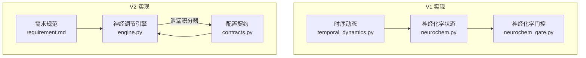
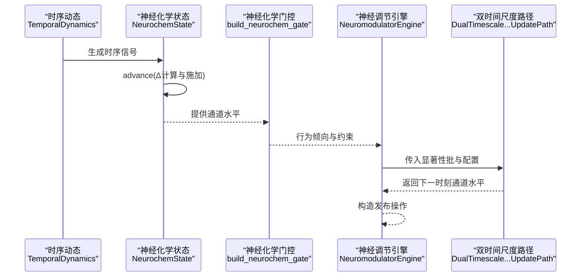
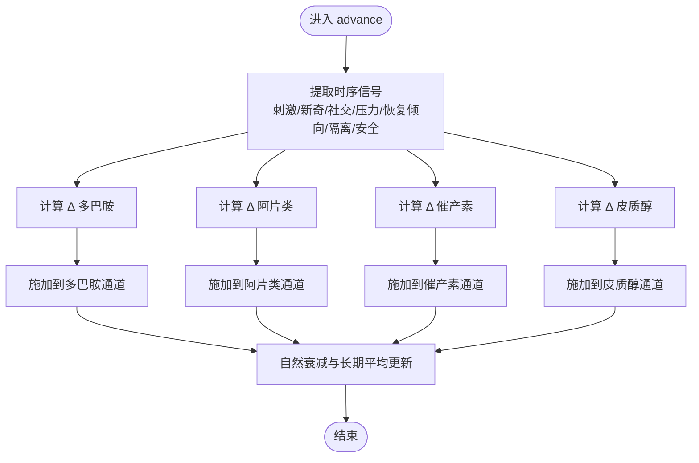
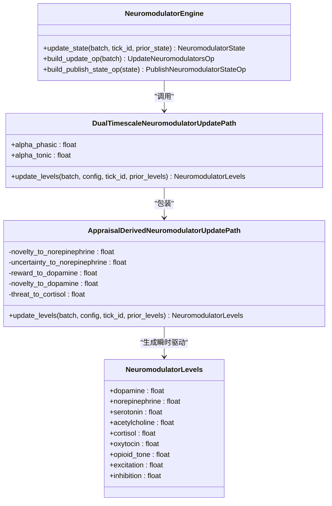
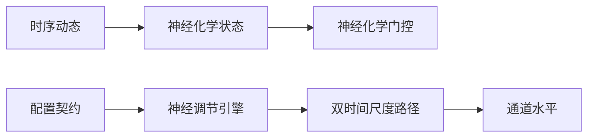

# 神经递质系统

<cite>
**本文引用的文件**
- [neurochem.py](file://archive/helios_v1/neurochem.py)
- [neurochem_gate.py](file://archive/helios_v1/neurochem_gate.py)
- [temporal_dynamics.py](file://archive/helios_v1/core/temporal_dynamics.py)
- [engine.py](file://helios_v2/src/helios_v2/neuromodulation/engine.py)
- [contracts.py](file://helios_v2/src/helios_v2/neuromodulation/contracts.py)
- [requirement.md](file://helios_v2/docs/requirements/43-dual-timescale-neuromodulator-dynamics/requirement.md)
- [test_neurochem_daisy_integration.py](file://archive/helios_v1/tests/test_neurochem_daisy_integration.py)
- [test_temporal_neurochem_integration.py](file://archive/helios_v1/tests/test_temporal_neurochem_integration.py)
</cite>

## 目录
1. [简介](#简介)
2. [项目结构](#项目结构)
3. [核心组件](#核心组件)
4. [架构总览](#架构总览)
5. [详细组件分析](#详细组件分析)
6. [依赖分析](#依赖分析)
7. [性能考虑](#性能考虑)
8. [故障排查指南](#故障排查指南)
9. [结论](#结论)
10. [附录](#附录)

## 简介
本文件面向Helios神经递质系统的实现与扩展，系统覆盖多巴胺、去甲肾上腺素、血清素、乙酰胆碱、皮质醇、催产素、阿片类等神经递质的建模与动态调节，并在双时间尺度（快相位/慢基线）下以泄漏积分器形式实现稳定、确定性的更新路径。文档重点阐述：
- 各神经递质的数学模型与调节机制
- 显著性评估到神经递质水平变化的映射
- 学习参数类别与调优方法
- 双时间尺度泄漏积分器的α系数设计与稳定性保障
- 参数范围限制、错误处理与运行时稳定性策略
- 新增神经递质通道与优化响应曲线的方法

## 项目结构
神经递质系统由两代实现构成：
- v1（archive/helios_v1）：基于四通道（多巴胺、阿片类、催产素、皮质醇）的时序动态与门控模块
- v2（helios_v2）：标准化的多通道（含去甲肾上腺素、血清素、乙酰胆碱）神经调节引擎，引入双时间尺度泄漏积分器与严格的配置契约

**图表来源**
- [temporal_dynamics.py:60-174](file://archive/helios_v1/core/temporal_dynamics.py#L60-L174)
- [neurochem.py:281-420](file://archive/helios_v1/neurochem.py#L281-L420)
- [neurochem_gate.py:52-200](file://archive/helios_v1/neurochem_gate.py#L52-L200)
- [engine.py:244-312](file://helios_v2/src/helios_v2/neuromodulation/engine.py#L244-L312)
- [contracts.py:70-110](file://helios_v2/src/helios_v2/neuromodulation/contracts.py#L70-L110)
- [requirement.md:36-53](file://helios_v2/docs/requirements/43-dual-timescale-neuromodulator-dynamics/requirement.md#L36-L53)

**章节来源**
- [temporal_dynamics.py:1-247](file://archive/helios_v1/core/temporal_dynamics.py#L1-L247)
- [neurochem.py:1-620](file://archive/helios_v1/neurochem.py#L1-L620)
- [neurochem_gate.py:1-200](file://archive/helios_v1/neurochem_gate.py#L1-L200)
- [engine.py:1-420](file://helios_v2/src/helios_v2/neuromodulation/engine.py#L1-L420)
- [contracts.py:1-120](file://helios_v2/src/helios_v2/neuromodulation/contracts.py#L1-L120)
- [requirement.md:36-53](file://helios_v2/docs/requirements/43-dual-timescale-neuromodulator-dynamics/requirement.md#L36-L53)

## 核心组件
- V1神经递质系统（四通道）
  - 神经递质系统基类：统一的泄漏衰减、基线回归、事件触发分泌/抑制
  - 四通道特化：多巴胺（动机/新奇）、阿片类（满足/恢复）、催产素（依恋/社交）、皮质醇（应激/警觉）
  - 神经化学状态：整合时序信号生成Δ并施加到各通道
  - 神经化学门控：将通道水平映射为行为倾向与约束
- V2神经调节引擎（九通道）
  - 多通道定义：多巴胺、去甲肾上腺素、血清素、乙酰胆碱、皮质醇、催产素、阿片类音调、兴奋、抑制
  - 双时间尺度泄漏积分器：phasics（快跟踪）+ tonics（慢回归），确保稳定与确定性
  - 配置契约：严格定义通道范围、基线、学习参数类别与硬门限通道

**章节来源**
- [neurochem.py:25-275](file://archive/helios_v1/neurochem.py#L25-L275)
- [neurochem.py:281-420](file://archive/helios_v1/neurochem.py#L281-L420)
- [neurochem_gate.py:25-50](file://archive/helios_v1/neurochem_gate.py#L25-L50)
- [engine.py:32-42](file://helios_v2/src/helios_v2/neuromodulation/engine.py#L32-L42)
- [engine.py:244-312](file://helios_v2/src/helios_v2/neuromodulation/engine.py#L244-L312)
- [contracts.py:48-110](file://helios_v2/src/helios_v2/neuromodulation/contracts.py#L48-L110)

## 架构总览
神经递质系统在V1中通过“时序动态→神经化学状态”的流水线驱动，在V2中进一步抽象为“快速显著性驱动→泄漏积分器→跨通道配置”的确定性更新。

**图表来源**
- [temporal_dynamics.py:84-174](file://archive/helios_v1/core/temporal_dynamics.py#L84-L174)
- [neurochem.py:303-359](file://archive/helios_v1/neurochem.py#L303-L359)
- [neurochem_gate.py:52-200](file://archive/helios_v1/neurochem_gate.py#L52-L200)
- [engine.py:139-176](file://helios_v2/src/helios_v2/neuromodulation/engine.py#L139-L176)
- [engine.py:244-312](file://helios_v2/src/helios_v2/neuromodulation/engine.py#L244-L312)

## 详细组件分析

### V1：四通道神经递质系统
- 基础模型
  - 泄漏衰减：按当前与基线的差异，采用不同时间常数（上升/下降）进行指数衰减
  - 事件触发：正向事件促进分泌，负向事件促进抑制，均受幅度上限约束
  - 偏差度量：围绕基线的归一化偏差，用于参数调制与状态描述
- 四通道特性
  - 多巴胺：上升快、下降快；对动机、新奇敏感，影响点火阈值与探索权重
  - 阿片类：上升慢、衰减慢；对满足感、恢复速度、社交驱力有显著影响
  - 催产素：建立信任需时、消退缓慢；增强关怀敏感性与信任基线
  - 皮质醇：上升快、下降慢；放大恐惧、抑制探索，注意窄化
- 显著性到Δ的映射
  - 依据时序信号（刺激、新奇、社交、压力、恢复倾向、隔离压力、安全信号）线性组合形成Δ，再施加到对应通道
- 参数调制
  - 通过各通道的调制映射（deviation相关项）对情感惯性、恢复速率、阈值等进行乘性调制

**图表来源**
- [neurochem.py:303-359](file://archive/helios_v1/neurochem.py#L303-L359)
- [neurochem.py:321-353](file://archive/helios_v1/neurochem.py#L321-L353)

**章节来源**
- [neurochem.py:25-275](file://archive/helios_v1/neurochem.py#L25-L275)
- [neurochem.py:281-420](file://archive/helios_v1/neurochem.py#L281-L420)
- [temporal_dynamics.py:176-233](file://archive/helios_v1/core/temporal_dynamics.py#L176-L233)

### V2：九通道神经调节引擎与双时间尺度泄漏积分器
- 通道集合与职责
  - 多巴胺：奖励/动机
  - 去甲肾上腺素：新奇/不确定性
  - 血清素：基线稳定（本切片保持基线）
  - 乙酰胆碱：基线稳定（本切片保持基线）
  - 皮质醇：威胁
  - 催产素：社交/依恋
  - 阿片类音调：满足/恢复
  - 兴奋/抑制：门控与硬门限资格通道
- 显著性到通道映射
  - 奖励→多巴胺；新奇→去甲肾上腺素；威胁→皮质醇；其余通道回归基线
- 双时间尺度泄漏积分器
  - 方程：next = clamp(prior + α_phasic × (drive − prior) + α_tonic × (baseline − prior))
  - 稳定性：要求0 < α_tonic < α_phasic ≤ 1，且每通道结果在合法范围内
  - 冷启动：prior为空时默认为基线，避免历史伪造
- 配置契约与学习参数
  - 必须声明学习参数类别：通道增益敏感性、跨通道耦合强度、衰减速率持久性、门影响强度
  - 硬门限资格通道限定为皮质醇与抑制

**图表来源**
- [engine.py:32-42](file://helios_v2/src/helios_v2/neuromodulation/engine.py#L32-L42)
- [engine.py:244-312](file://helios_v2/src/helios_v2/neuromodulation/engine.py#L244-L312)
- [engine.py:347-420](file://helios_v2/src/helios_v2/neuromodulation/engine.py#L347-L420)
- [engine.py:124-234](file://helios_v2/src/helios_v2/neuromodulation/engine.py#L124-L234)
- [contracts.py:48-110](file://helios_v2/src/helios_v2/neuromodulation/contracts.py#L48-L110)

**章节来源**
- [engine.py:244-420](file://helios_v2/src/helios_v2/neuromodulation/engine.py#L244-L420)
- [contracts.py:70-110](file://helios_v2/src/helios_v2/neuromodulation/contracts.py#L70-L110)
- [requirement.md:36-53](file://helios_v2/docs/requirements/43-dual-timescale-neuromodulator-dynamics/requirement.md#L36-L53)

### 显著性评估到神经递质水平变化
- V1：显著性→Δ→通道
  - 通过时序信号（刺激、新奇、社交、压力、恢复倾向、隔离压力、安全信号）线性组合得到Δ，再施加到相应通道
- V2：显著性→瞬时驱动→泄漏积分器
  - 以显著性聚合（威胁/奖励/新奇/社交/不确定性）为输入，生成瞬时目标水平
  - 双时间尺度路径以泄漏积分器从prior向drive与baseline移动，确保稳定收敛

**章节来源**
- [temporal_dynamics.py:176-233](file://archive/helios_v1/core/temporal_dynamics.py#L176-L233)
- [neurochem.py:321-353](file://archive/helios_v1/neurochem.py#L321-L353)
- [engine.py:325-343](file://helios_v2/src/helios_v2/neuromodulation/engine.py#L325-L343)
- [engine.py:379-420](file://helios_v2/src/helios_v2/neuromodulation/engine.py#L379-L420)

### 学习参数类别与调优
- V2配置契约要求的学习参数类别
  - 通道增益敏感性：控制显著性对各通道的增益
  - 跨通道耦合强度：通道间相互影响的强度
  - 衰减速率持久性：泄漏积分器α系数的持久化设置
  - 门影响强度：硬门限通道（皮质醇、抑制）对行为门控的影响
- 调优建议
  - 通过实验设定α_phasic与α_tonic，确保0 < α_tonic < α_phasic ≤ 1
  - 使用显著性到通道映射系数（如奖励→多巴胺、新奇→去甲肾上腺素、威胁→皮质醇）进行初值设定
  - 在冷启动或重启场景，优先以基线作为prior，避免历史漂移

**章节来源**
- [contracts.py:88-110](file://helios_v2/src/helios_v2/neuromodulation/contracts.py#L88-L110)
- [engine.py:275-279](file://helios_v2/src/helios_v2/neuromodulation/engine.py#L275-L279)
- [engine.py:373-377](file://helios_v2/src/helios_v2/neuromodulation/engine.py#L373-L377)

### 实现新的神经递质通道
- 步骤
  - 在通道集合中新增字段（如“甘氨酸”、“组胺”等），并在配置契约中声明其合法范围与基线
  - 在显著性到通道映射中添加从显著性维度到新通道的线性映射系数
  - 若需要双时间尺度行为，注入DualTimescaleNeuromodulatorUpdatePath并校验α系数
  - 在门控或调节策略中使用新通道的水平进行行为倾向或约束计算
- 注意事项
  - 保持每通道输出在合法范围内
  - 为新通道提供合理的基线与时间常数（若采用V1风格）

**章节来源**
- [engine.py:32-42](file://helios_v2/src/helios_v2/neuromodulation/engine.py#L32-L42)
- [engine.py:391-419](file://helios_v2/src/helios_v2/neuromodulation/engine.py#L391-L419)
- [contracts.py:48-67](file://helios_v2/src/helios_v2/neuromodulation/contracts.py#L48-L67)

### 优化神经递质响应曲线
- 方法
  - 调整显著性到通道映射系数，使特定显著性维度对目标通道的增益更符合预期
  - 通过泄漏积分器的α_phasic与α_tonic控制响应速度与稳态保持能力
  - 在门控模块中引入新通道水平，调整行为倾向与硬门限
- 验证
  - 使用集成测试验证响应曲线是否满足预期（如高多巴胺应降低动机衰减、高皮质醇应提升恐惧放大等）

**章节来源**
- [test_neurochem_daisy_integration.py:34-68](file://archive/helios_v1/tests/test_neurochem_daisy_integration.py#L34-L68)
- [engine.py:275-279](file://helios_v2/src/helios_v2/neuromodulation/engine.py#L275-L279)

## 依赖分析
- V1内部依赖
  - 时序动态模块为神经化学状态提供驱动信号
  - 神经化学状态负责Δ计算与事件触发
  - 神经化学门控将通道水平映射为行为倾向与约束
- V2内部依赖
  - 配置契约约束通道范围与学习参数类别
  - 引擎负责组织更新路径与发布操作
  - 双时间尺度路径封装泄漏积分器，确保稳定性

**图表来源**
- [temporal_dynamics.py:84-174](file://archive/helios_v1/core/temporal_dynamics.py#L84-L174)
- [neurochem.py:303-359](file://archive/helios_v1/neurochem.py#L303-L359)
- [neurochem_gate.py:52-200](file://archive/helios_v1/neurochem_gate.py#L52-L200)
- [contracts.py:70-110](file://helios_v2/src/helios_v2/neuromodulation/contracts.py#L70-L110)
- [engine.py:139-176](file://helios_v2/src/helios_v2/neuromodulation/engine.py#L139-L176)
- [engine.py:244-312](file://helios_v2/src/helios_v2/neuromodulation/engine.py#L244-L312)

**章节来源**
- [temporal_dynamics.py:60-174](file://archive/helios_v1/core/temporal_dynamics.py#L60-L174)
- [neurochem.py:281-420](file://archive/helios_v1/neurochem.py#L281-L420)
- [neurochem_gate.py:52-200](file://archive/helios_v1/neurochem_gate.py#L52-L200)
- [engine.py:124-234](file://helios_v2/src/helios_v2/neuromodulation/engine.py#L124-L234)
- [contracts.py:70-110](file://helios_v2/src/helios_v2/neuromodulation/contracts.py#L70-L110)

## 性能考虑
- 计算复杂度
  - V1：每tick对四个通道执行泄漏衰减与Δ施加，整体O(1)
  - V2：每tick对九通道执行泄漏积分器一步，整体O(1)，但涉及多次clamp与线性映射
- 稳定性与数值
  - V1：通过时间常数区分上升/下降，避免过度振荡
  - V2：严格约束α_phasic与α_tonic，确保泄漏积分器稳定
- 内存与I/O
  - 通道水平与配置数据均为轻量级数据类，内存占用低
  - 发布操作仅包含状态标识与活动通道列表，便于可观测性

## 故障排查指南
- 常见问题
  - 通道水平越界：检查配置契约中的合法范围与clamp逻辑
  - α系数不稳定：确认0 < α_tonic < α_phasic ≤ 1
  - 冷启动异常：确保prior为空时使用基线作为初始状态
  - 门控冲突：核对硬门限通道（皮质醇、抑制）的资格与强度
- 定位手段
  - 查看引擎构建发布操作前的活动通道报告
  - 对照显著性聚合与通道映射系数，确认输入是否合理
  - 运行集成测试验证关键行为（如高多巴胺对动机衰减的影响）

**章节来源**
- [engine.py:206-234](file://helios_v2/src/helios_v2/neuromodulation/engine.py#L206-L234)
- [engine.py:275-279](file://helios_v2/src/helios_v2/neuromodulation/engine.py#L275-L279)
- [test_neurochem_daisy_integration.py:34-68](file://archive/helios_v1/tests/test_neurochem_daisy_integration.py#L34-L68)

## 结论
Helios神经递质系统在V1与V2两个阶段实现了从简单四通道到标准九通道的演进，并在V2中引入了双时间尺度泄漏积分器与严格的配置契约，确保系统在显著性驱动下的稳定、确定性更新。通过学习参数类别与门控机制，系统能够灵活适配不同情境的行为调节需求。未来可在跨通道耦合、主观感受构造与动作路由等方面继续深化。

## 附录
- 代码示例路径（不直接展示代码内容）
  - 配置神经递质参数：[contracts.py:70-110](file://helios_v2/src/helios_v2/neuromodulation/contracts.py#L70-L110)
  - 实现新的神经递质通道：[engine.py:32-42](file://helios_v2/src/helios_v2/neuromodulation/engine.py#L32-L42), [engine.py:391-419](file://helios_v2/src/helios_v2/neuromodulation/engine.py#L391-L419)
  - 优化神经递质响应曲线：[engine.py:373-377](file://helios_v2/src/helios_v2/neuromodulation/engine.py#L373-L377), [engine.py:275-279](file://helios_v2/src/helios_v2/neuromodulation/engine.py#L275-L279)
  - 神经递质水平范围限制与稳定性：[contracts.py:58-67](file://helios_v2/src/helios_v2/neuromodulation/contracts.py#L58-L67), [engine.py:237-240](file://helios_v2/src/helios_v2/neuromodulation/engine.py#L237-L240)
  - 错误处理机制：[engine.py:275-279](file://helios_v2/src/helios_v2/neuromodulation/engine.py#L275-L279), [engine.py:225-227](file://helios_v2/src/helios_v2/neuromodulation/engine.py#L225-L227)