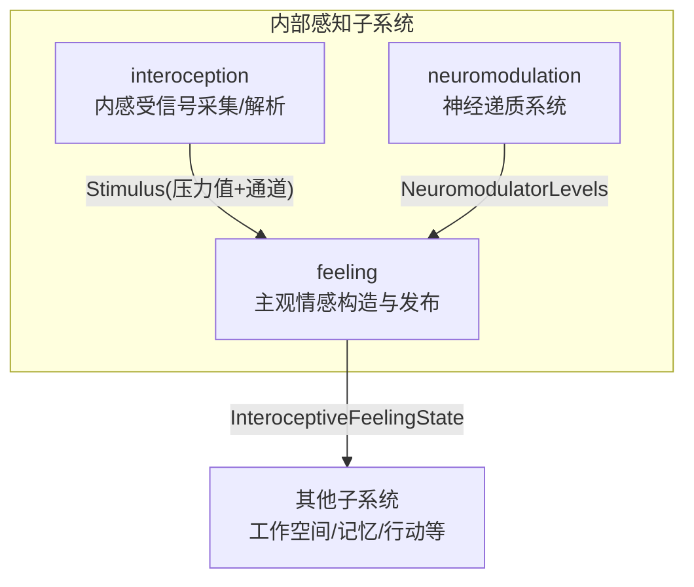
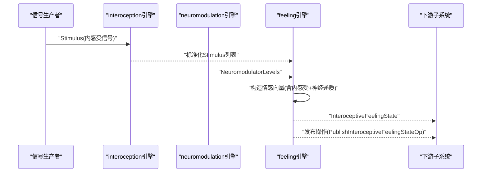
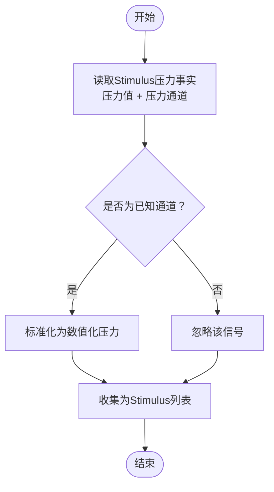
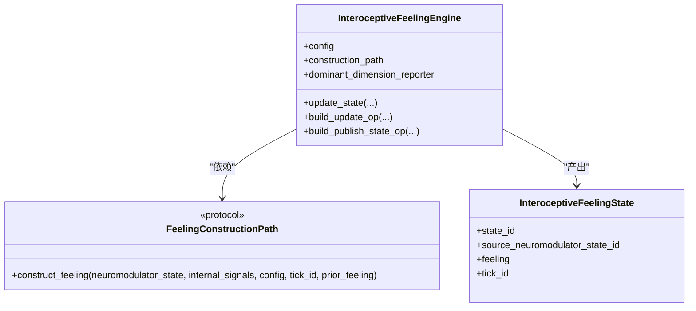
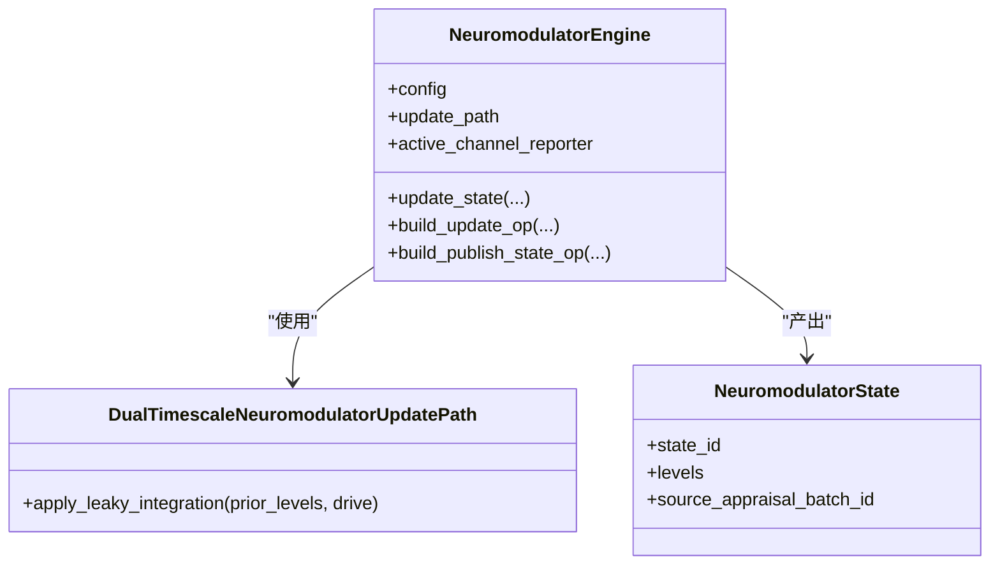
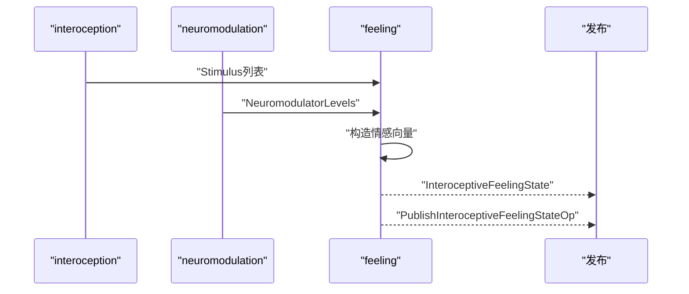
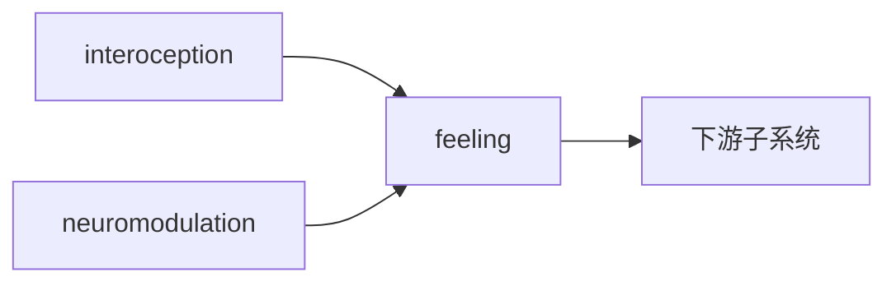

# 内部感知模块

<cite>
**本文引用的文件**
- [helios_v2/feeling/engine.py](file://helios_v2/src/helios_v2/feeling/engine.py)
- [helios_v2/feeling/contracts.py](file://helios_v2/src/helios_v2/feeling/contracts.py)
- [helios_v2/neuromodulation/contracts.py](file://helios_v2/src/helios_v2/neuromodulation/contracts.py)
- [helios_v2/neuromodulation/engine.py](file://helios_v2/src/helios_v2/neuromodulation/engine.py)
- [helios_v2/interoception/contracts.py](file://helios_v2/src/helios_v2/interoception/contracts.py)
- [helios_v2/interoception/engine.py](file://helios_v2/src/helios_v2/interoception/engine.py)
- [helios_v2/docs/requirements/05-interoceptive-feeling-layer/requirement.md](file://helios_v2/docs/requirements/05-interoceptive-feeling-layer/requirement.md)
- [helios_v2/docs/requirements/50-runtime-interoceptive-source/requirement.md](file://helios_v2/docs/requirements/50-runtime-interoceptive-source/requirement.md)
- [helios_v2/docs/requirements/51-interoceptive-signal-shaped-feeling/requirement.md](file://helios_v2/docs/requirements/51-interoceptive-signal-shaped-feeling/requirement.md)
- [helios_v2/docs/requirements/53-workload-pressure-from-interoception/requirement.md](file://helios_v2/docs/requirements/53-workload-pressure-from-interoception/requirement.md)
- [helios_v2/tests/test_interoceptive_feeling_engine.py](file://helios_v2/tests/test_interoceptive_feeling_engine.py)
- [helios_v2/tests/test_interoception_engine.py](file://helios_v2/tests/test_interoception_engine.py)
</cite>

## 目录
1. [引言](#引言)
2. [项目结构](#项目结构)
3. [核心组件](#核心组件)
4. [架构总览](#架构总览)
5. [详细组件分析](#详细组件分析)
6. [依赖分析](#依赖分析)
7. [性能考虑](#性能考虑)
8. [故障排查指南](#故障排查指南)
9. [结论](#结论)
10. [附录](#附录)

## 引言
本技术文档聚焦于Helios v2内部感知模块（Interoception），系统性阐述身体内部状态感知机制：包括内感受信号采集、神经递质系统交互、生理信号处理与情绪状态跟踪等。文档从数据模型、处理流程、接口契约到集成方式给出完整说明，并通过图示展示关键调用序列与数据流，帮助读者快速理解“内部状态如何被建模、如何与神经递质系统耦合、如何转化为可被认知系统理解的主观体验”。

## 项目结构
内部感知模块位于helios_v2/src/helios_v2/interoception与feeling两个子系统中，分别负责：
- interoception：内感受信号的采集、解析与标准化，形成Stimulus对象供后续处理。
- feeling：基于神经递质状态与内感受信号，构建主观维度化情感向量，并提供发布操作。

同时，neuromodulation模块提供神经递质状态（多通道水平）作为feeling层输入；相关需求文档定义了输入边界、输出契约与验收标准。

**图表来源**
- [helios_v2/interoception/engine.py](file://helios_v2/src/helios_v2/interoception/engine.py)
- [helios_v2/feeling/engine.py](file://helios_v2/src/helios_v2/feeling/engine.py)
- [helios_v2/neuromodulation/engine.py](file://helios_v2/src/helios_v2/neuromodulation/engine.py)

**章节来源**
- [helios_v2/interoception/contracts.py](file://helios_v2/src/helios_v2/interoception/contracts.py)
- [helios_v2/interoception/engine.py](file://helios_v2/src/helios_v2/interoception/engine.py)
- [helios_v2/feeling/contracts.py](file://helios_v2/src/helios_v2/feeling/contracts.py)
- [helios_v2/feeling/engine.py](file://helios_v2/src/helios_v2/feeling/engine.py)
- [helios_v2/neuromodulation/contracts.py](file://helios_v2/src/helios_v2/neuromodulation/contracts.py)
- [helios_v2/neuromodulation/engine.py](file://helios_v2/src/helios_v2/neuromodulation/engine.py)

## 核心组件
- 内感受信号采集与解析（interoception）
  - 负责从生产者处获取内感受信号，提取数值化的“压力值”与“压力通道”，并封装为Stimulus对象。
  - 输入必须是限定的“身体/内感受”模态，且对未知通道应静默忽略，确保确定性与可重复性。
- 主观情感构造（feeling）
  - 接收神经递质状态与内感受信号，通过注入的构造路径生成维度化情感向量（如愉悦度、舒适度、社会安全、疲劳等维度）。
  - 支持无内感受信号时的行为一致性，确保与纯神经递质驱动的构造路径等价。
- 神经递质系统（neuromodulation）
  - 提供多通道（如多巴胺、去甲肾上腺素、血清素、乙酰胆碱、皮质醇、催产素）的水平向量，作为feeling层的即时目标输入。
  - 支持双时间尺度持久化更新路径，使状态在tick间平滑演化。

**章节来源**
- [helios_v2/interoception/contracts.py](file://helios_v2/src/helios_v2/interoception/contracts.py)
- [helios_v2/interoception/engine.py](file://helios_v2/src/helios_v2/interoception/engine.py)
- [helios_v2/feeling/contracts.py](file://helios_v2/src/helios_v2/feeling/contracts.py)
- [helios_v2/feeling/engine.py](file://helios_v2/src/helios_v2/feeling/engine.py)
- [helios_v2/neuromodulation/contracts.py](file://helios_v2/src/helios_v2/neuromodulation/contracts.py)
- [helios_v2/neuromodulation/engine.py](file://helios_v2/src/helios_v2/neuromodulation/engine.py)

## 架构总览
内部感知模块遵循“输入边界—处理路径—输出契约”的清晰分层：
- 输入边界：Stimulus（内感受信号）、NeuromodulatorLevels（神经递质状态）。
- 处理路径：interoception将原始信号映射为标准化压力事实；feeling将神经递质与内感受信号组合，生成维度化情感向量。
- 输出契约：InteroceptiveFeelingState（包含状态ID、来源神经递质状态ID、情感向量、tick等）与发布操作。

**图表来源**
- [helios_v2/interoception/engine.py](file://helios_v2/src/helios_v2/interoception/engine.py)
- [helios_v2/feeling/engine.py](file://helios_v2/src/helios_v2/feeling/engine.py)
- [helios_v2/neuromodulation/engine.py](file://helios_v2/src/helios_v2/neuromodulation/engine.py)

## 详细组件分析

### 组件一：内感受信号采集与解析（interoception）
职责与特性
- 读取Stimulus中的“压力值”和“压力通道”，不解析人类可读内容字符串，保证确定性与跨时间一致性。
- 对未知通道信号静默忽略，避免错误传播。
- 输出为Stimulus元组，供feeling层消费。

**图表来源**
- [helios_v2/interoception/engine.py](file://helios_v2/src/helios_v2/interoception/engine.py)
- [helios_v2/docs/requirements/50-runtime-interoceptive-source/requirement.md](file://helios_v2/docs/requirements/50-runtime-interoceptive-source/requirement.md)

**章节来源**
- [helios_v2/interoception/contracts.py](file://helios_v2/src/helios_v2/interoception/contracts.py)
- [helios_v2/interoception/engine.py](file://helios_v2/src/helios_v2/interoception/engine.py)
- [helios_v2/docs/requirements/50-runtime-interoceptive-source/requirement.md](file://helios_v2/docs/requirements/50-runtime-interoceptive-source/requirement.md)

### 组件二：主观情感构造（feeling）
职责与特性
- 接收NeuromodulatorLevels与可选Stimulus列表，生成维度化情感向量。
- 支持“无内感受信号”时的行为一致性，确保与仅神经递质驱动的构造路径等价。
- 提供状态发布操作，包含状态ID、来源神经递质状态ID、主导维度等元信息。

**图表来源**
- [helios_v2/feeling/engine.py](file://helios_v2/src/helios_v2/feeling/engine.py)
- [helios_v2/feeling/contracts.py](file://helios_v2/src/helios_v2/feeling/contracts.py)

**章节来源**
- [helios_v2/feeling/contracts.py](file://helios_v2/src/helios_v2/feeling/contracts.py)
- [helios_v2/feeling/engine.py](file://helios_v2/src/helios_v2/feeling/engine.py)
- [helios_v2/docs/requirements/05-interoceptive-feeling-layer/requirement.md](file://helios_v2/docs/requirements/05-interoceptive-feeling-layer/requirement.md)

### 组件三：神经递质系统（neuromodulation）
职责与特性
- 提供多通道水平向量（多巴胺、去甲肾上腺素、血清素、乙酰胆碱、皮质醇、催产素），范围限定在[0.0, 1.0]。
- 支持双时间尺度持久化更新路径，使状态在tick间平滑演化。
- 发布操作包含活跃通道报告，便于下游感知与调试。

**图表来源**
- [helios_v2/neuromodulation/engine.py](file://helios_v2/src/helios_v2/neuromodulation/engine.py)
- [helios_v2/neuromodulation/contracts.py](file://helios_v2/src/helios_v2/neuromodulation/contracts.py)

**章节来源**
- [helios_v2/neuromodulation/contracts.py](file://helios_v2/src/helios_v2/neuromodulation/contracts.py)
- [helios_v2/neuromodulation/engine.py](file://helios_v2/src/helios_v2/neuromodulation/engine.py)

### 数据模型与格式规范
- Stimulus（内感受信号）
  - 字段：压力值（数值）、压力通道（枚举/标识符）、来源生产者标识。
  - 语义：承载单一内感受信号的压力事实，用于与神经递质水平耦合。
- NeuromodulatorLevels（神经递质水平）
  - 字段：多巴胺、去甲肾上腺素、血清素、乙酰胆碱、皮质醇、催产素（均为[0.0, 1.0]范围内的浮点数）。
- InteroceptiveFeelingVector（主观情感向量）
  - 字段：至少包含“愉悦度/效价”、“舒适度”、“社会安全”、“疲劳”等维度（具体以实现为准）。
- InteroceptiveFeelingState（情感状态快照）
  - 字段：状态ID、来源神经递质状态ID、情感向量、tick ID、主导维度等。
- 发布操作（PublishInteroceptiveFeelingStateOp）
  - 字段：操作名、所有者、状态ID、来源神经递质状态ID、主导维度集合等。

**章节来源**
- [helios_v2/interoception/contracts.py](file://helios_v2/src/helios_v2/interoception/contracts.py)
- [helios_v2/neuromodulation/contracts.py](file://helios_v2/src/helios_v2/neuromodulation/contracts.py)
- [helios_v2/feeling/contracts.py](file://helios_v2/src/helios_v2/feeling/contracts.py)

### 处理流程与集成方式
- 流程概览
  - interoception读取Stimulus，标准化为数值化压力事实。
  - neuromodulation提供当前神经递质水平，必要时进行双时间尺度积分。
  - feeling将两者融合，生成维度化情感向量，并产出状态快照与发布操作。
- 集成要点
  - 输入边界严格限定为“身体/内感受”模态的Stimulus。
  - 无内感受信号时，feeling需与纯神经递质驱动路径等价。
  - 发布操作携带足够的溯源信息，便于可观测性与回溯。

**图表来源**
- [helios_v2/interoception/engine.py](file://helios_v2/src/helios_v2/interoception/engine.py)
- [helios_v2/neuromodulation/engine.py](file://helios_v2/src/helios_v2/neuromodulation/engine.py)
- [helios_v2/feeling/engine.py](file://helios_v2/src/helios_v2/feeling/engine.py)

**章节来源**
- [helios_v2/docs/requirements/51-interoceptive-signal-shaped-feeling/requirement.md](file://helios_v2/docs/requirements/51-interoceptive-signal-shaped-feeling/requirement.md)
- [helios_v2/docs/requirements/53-workload-pressure-from-interoception/requirement.md](file://helios_v2/docs/requirements/53-workload-pressure-from-interoception/requirement.md)

## 依赖分析
- 模块内依赖
  - interoception依赖Stimulus契约，确保输入标准化与确定性。
  - feeling依赖neuromodulation提供的NeuromodulatorLevels，并通过注入的构造路径生成情感向量。
  - neuromodulation提供双时间尺度更新路径，增强状态演化的连续性。
- 跨模块依赖
  - feeling的发布操作可被其他子系统订阅，用于工作空间竞争、记忆巩固或行动外部化等后续阶段。

**图表来源**
- [helios_v2/interoception/engine.py](file://helios_v2/src/helios_v2/interoception/engine.py)
- [helios_v2/feeling/engine.py](file://helios_v2/src/helios_v2/feeling/engine.py)
- [helios_v2/neuromodulation/engine.py](file://helios_v2/src/helios_v2/neuromodulation/engine.py)

**章节来源**
- [helios_v2/interoception/contracts.py](file://helios_v2/src/helios_v2/interoception/contracts.py)
- [helios_v2/feeling/contracts.py](file://helios_v2/src/helios_v2/feeling/contracts.py)
- [helios_v2/neuromodulation/contracts.py](file://helios_v2/src/helios_v2/neuromodulation/contracts.py)

## 性能考虑
- 确定性与可重复性
  - 内感受信号读取必须对固定输入集产生确定结果，避免时间相关性导致的非确定性。
- 计算复杂度
  - 构造情感向量的计算复杂度与Stimulus数量及神经递质通道数线性相关，建议在上游进行必要的裁剪与聚合。
- 状态持久化
  - 双时间尺度更新路径引入积分器，需平衡衰减速度与响应速度，避免过度延迟或振荡。
- 边界检查
  - 神经递质水平与情感向量均需进行合法范围校验，防止溢出或异常传播。

## 故障排查指南
常见问题与定位
- 输入非法
  - 神经递质水平超出[0.0, 1.0]范围、情感状态缺少溯源字段、Stimulus通道未知。
- 构造失败
  - 注入的构造路径不可用或返回越界情感向量。
- 发布异常
  - 发布操作缺少必要元信息，或状态ID/来源ID为空。
- 集成验证
  - 使用测试用例验证无内感受信号时的行为一致性，确保与纯神经递质驱动路径等价。

**章节来源**
- [helios_v2/tests/test_interoceptive_feeling_engine.py](file://helios_v2/tests/test_interoceptive_feeling_engine.py)
- [helios_v2/tests/test_interoception_engine.py](file://helios_v2/tests/test_interoception_engine.py)
- [helios_v2/feeling/engine.py](file://helios_v2/src/helios_v2/feeling/engine.py)
- [helios_v2/neuromodulation/engine.py](file://helios_v2/src/helios_v2/neuromodulation/engine.py)

## 结论
内部感知模块通过“内感受信号—神经递质—主观情感”的链路，实现了从身体内部状态到可被认知系统理解的主观体验的转换。其设计强调输入边界、确定性处理与发布契约，既满足工程上的可维护性，也为后续工作空间、记忆与行动等模块提供了稳定的数据基础。

## 附录
- 需求与验收
  - 内感受信号采集与解析、主观情感构造、神经递质系统更新与发布等均有明确需求文档约束与验收标准。
- 测试参考
  - 单元测试覆盖了构造路径、发布操作与行为一致性等关键场景。

**章节来源**
- [helios_v2/docs/requirements/05-interoceptive-feeling-layer/requirement.md](file://helios_v2/docs/requirements/05-interoceptive-feeling-layer/requirement.md)
- [helios_v2/docs/requirements/50-runtime-interoceptive-source/requirement.md](file://helios_v2/docs/requirements/50-runtime-interoceptive-source/requirement.md)
- [helios_v2/docs/requirements/51-interoceptive-signal-shaped-feeling/requirement.md](file://helios_v2/docs/requirements/51-interoceptive-signal-shaped-feeling/requirement.md)
- [helios_v2/docs/requirements/53-workload-pressure-from-interoception/requirement.md](file://helios_v2/docs/requirements/53-workload-pressure-from-interoception/requirement.md)