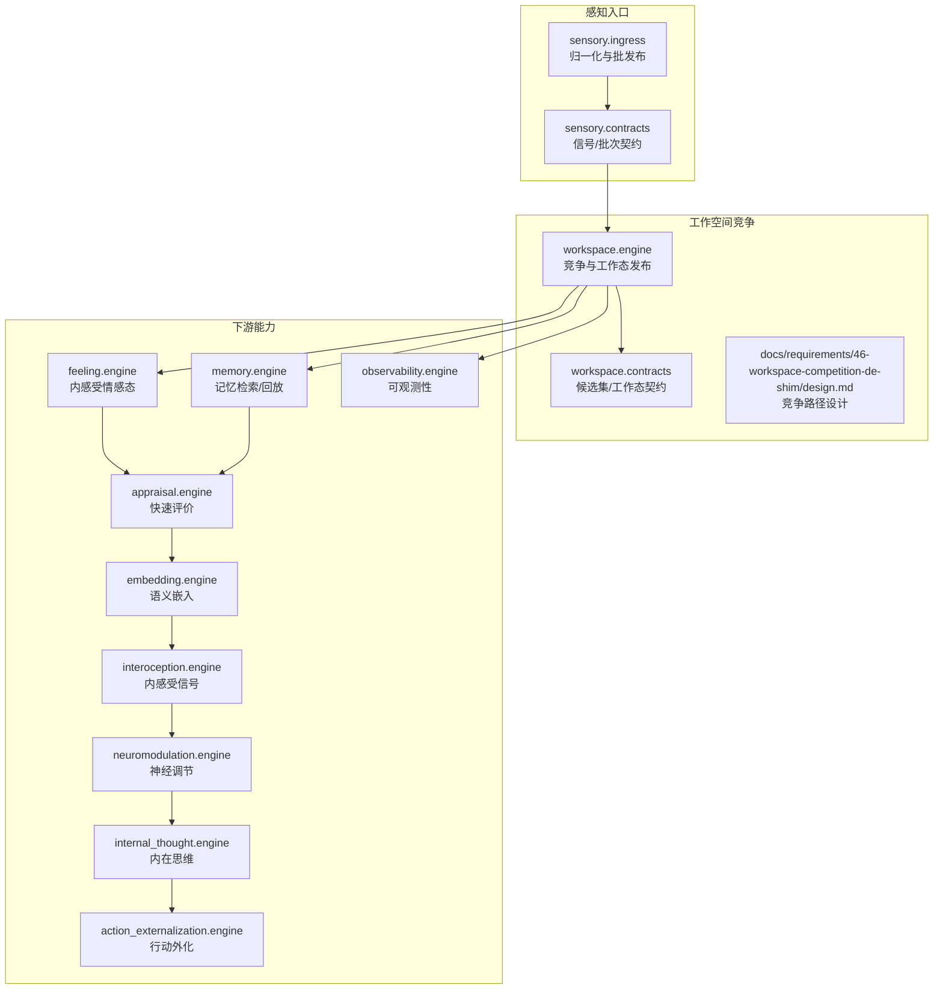
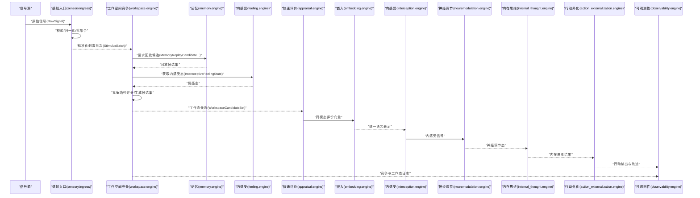
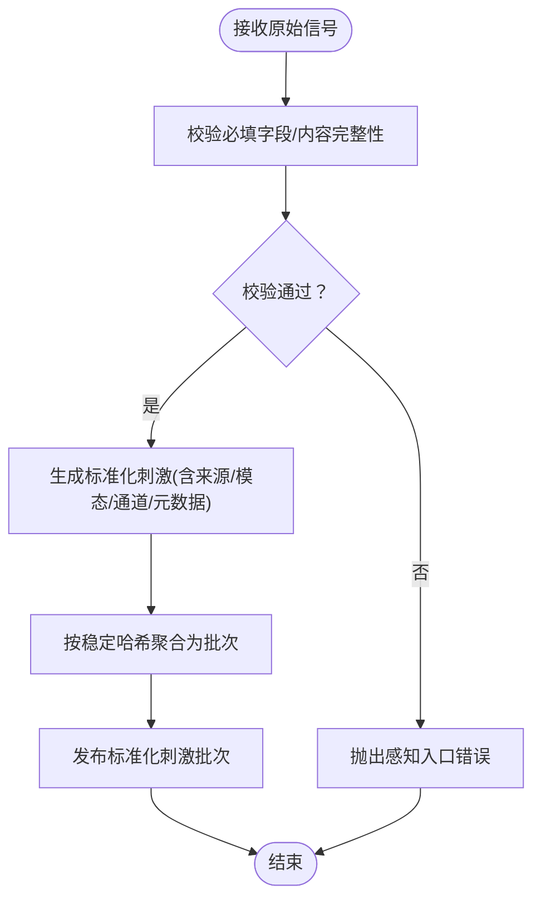
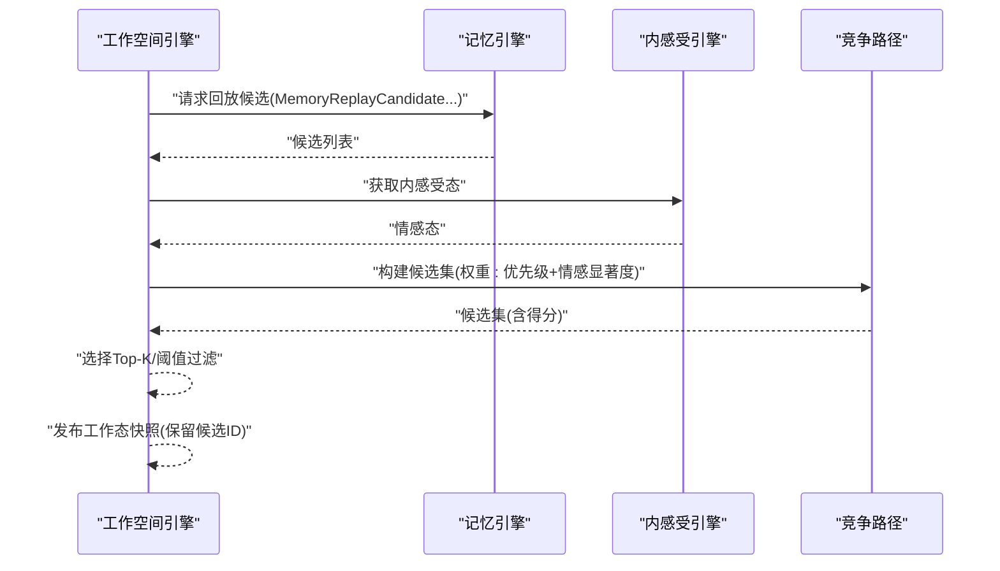
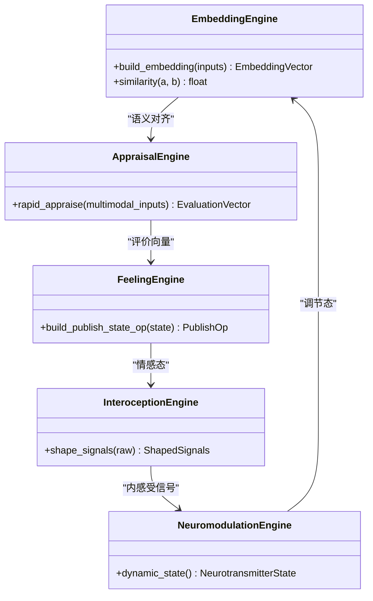
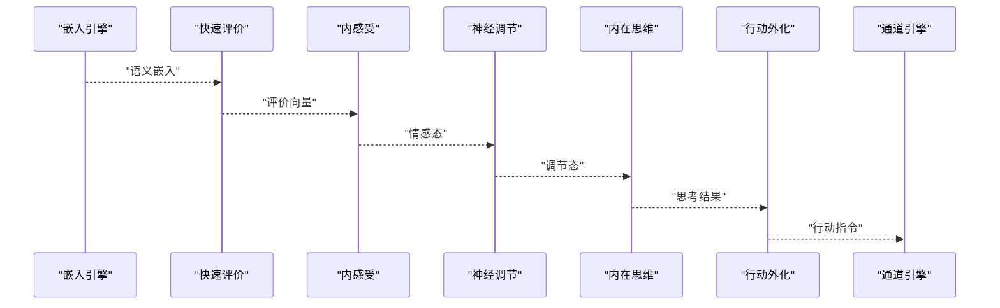
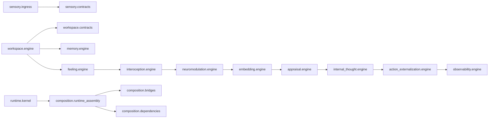

# 感知融合算法

<cite>
**本文引用的文件**
- [helios_v2/sensory/ingress.py](file://helios_v2/src/helios_v2/sensory/ingress.py)
- [helios_v2/sensory/contracts.py](file://helios_v2/src/helios_v2/sensory/contracts.py)
- [helios_v2/workspace/engine.py](file://helios_v2/src/helios_v2/workspace/engine.py)
- [helios_v2/workspace/contracts.py](file://helios_v2/src/helios_v2/workspace/contracts.py)
- [helios_v2/docs/requirements/46-workspace-competition-de-shim/design.md](file://helios_v2/docs/requirements/46-workspace-competition-de-shim/design.md)
- [helios_v2/feeling/engine.py](file://helios_v2/src/helios_v2/feeling/engine.py)
- [helios_v2/memory/engine.py](file://helios_v2/src/helios_v2/memory/engine.py)
- [helios_v2/appraisal/engine.py](file://helios_v2/src/helios_v2/appraisal/engine.py)
- [helios_v2/embedding/engine.py](file://helios_v2/src/helios_v2/embedding/engine.py)
- [helios_v2/interoception/engine.py](file://helios_v2/src/helios_v2/interoception/engine.py)
- [helios_v2/neuromodulation/engine.py](file://helios_v2/src/helios_v2/neuromodulation/engine.py)
- [helios_v2/internal_thought/engine.py](file://helios_v2/src/helios_v2/internal_thought/engine.py)
- [helios_v2/channel/engine.py](file://helios_v2/src/helios_v2/channel/engine.py)
- [helios_v2/action_externalization/engine.py](file://helios_v2/src/helios_v2/action_externalization/engine.py)
- [helios_v2/runtime/kernel.py](file://helios_v2/src/helios_v2/runtime/kernel.py)
- [helios_v2/composition/runtime_assembly.py](file://helios_v2/src/helios_v2/composition/runtime_assembly.py)
- [helios_v2/composition/bridges.py](file://helios_v2/src/helios_v2/composition/bridges.py)
- [helios_v2/composition/dependencies.py](file://helios_v2/src/helios_v2/composition/dependencies.py)
- [helios_v2/observability/engine.py](file://helios_v2/src/helios_v2/observability/engine.py)
- [archive/helios_v1/cognition/phi.py](file://archive/helios_v1/cognition/phi.py)
- [archive/helios_v1/core/temporal_dynamics.py](file://archive/helios_v1/core/temporal_dynamics.py)
</cite>

## 目录
1. [引言](#引言)
2. [项目结构](#项目结构)
3. [核心组件](#核心组件)
4. [架构总览](#架构总览)
5. [详细组件分析](#详细组件分析)
6. [依赖关系分析](#依赖关系分析)
7. [性能考量](#性能考量)
8. [故障排查指南](#故障排查指南)
9. [结论](#结论)
10. [附录](#附录)

## 引言
本技术文档围绕Helios感知融合算法展开，聚焦于多源感知数据的融合策略与实现，覆盖时间同步、空间对齐、特征提取与信息整合等关键环节，并阐述感知数据在工作空间中的竞争与选择机制。文档还给出针对不同时序与不同模态输入的处理方法，以及如何构建统一的感知表示。最后提供参数调优、性能评估与故障诊断的方法与工具。

## 项目结构
Helios v2采用“模块化拥有者(owner)”架构，每个功能域由独立拥有者负责，通过契约化的接口进行协作。感知融合相关的核心位于sensory与workspace两大拥有者之下，辅以记忆、评价、内感受、神经调节、嵌入等子系统共同完成从原始信号到统一感知表示的闭环。

图示来源
- [helios_v2/sensory/ingress.py:1-83](file://helios_v2/src/helios_v2/sensory/ingress.py#L1-L83)
- [helios_v2/sensory/contracts.py:200-248](file://helios_v2/src/helios_v2/sensory/contracts.py#L200-L248)
- [helios_v2/workspace/engine.py:93-199](file://helios_v2/src/helios_v2/workspace/engine.py#L93-L199)
- [helios_v2/workspace/contracts.py](file://helios_v2/src/helios_v2/workspace/contracts.py)
- [helios_v2/docs/requirements/46-workspace-competition-de-shim/design.md:26-52](file://helios_v2/docs/requirements/46-workspace-competition-de-shim/design.md#L26-L52)
- [helios_v2/feeling/engine.py:209-239](file://helios_v2/src/helios_v2/feeling/engine.py#L209-L239)
- [helios_v2/memory/engine.py](file://helios_v2/src/helios_v2/memory/engine.py)
- [helios_v2/appraisal/engine.py](file://helios_v2/src/helios_v2/appraisal/engine.py)
- [helios_v2/embedding/engine.py](file://helios_v2/src/helios_v2/embedding/engine.py)
- [helios_v2/interoception/engine.py](file://helios_v2/src/helios_v2/interoception/engine.py)
- [helios_v2/neuromodulation/engine.py](file://helios_v2/src/helios_v2/neuromodulation/engine.py)
- [helios_v2/internal_thought/engine.py](file://helios_v2/src/helios_v2/internal_thought/engine.py)
- [helios_v2/action_externalization/engine.py](file://helios_v2/src/helios_v2/action_externalization/engine.py)
- [helios_v2/observability/engine.py](file://helios_v2/src/helios_v2/observability/engine.py)

章节来源
- [helios_v2/sensory/ingress.py:1-83](file://helios_v2/src/helios_v2/sensory/ingress.py#L1-L83)
- [helios_v2/workspace/engine.py:93-199](file://helios_v2/src/helios_v2/workspace/engine.py#L93-L199)

## 核心组件
- 感知入口(sensory.ingress): 负责注册信号源、校验原始信号、归一化为标准化刺激并生成批次发布；提供信号收集与批次发布契约。
- 工作空间竞争(workspace.engine): 负责从记忆回放候选与内感受态中生成候选集，执行竞争并发布工作态快照；支持可插拔的竞争路径与保留路径。
- 记忆(memory.engine): 提供记忆检索与回放候选生成，为工作空间竞争提供素材。
- 内感受(feeling.engine): 将神经调节信号转化为内感受情感态，提供主导维度报告与发布操作。
- 快速评价(appraisal.engine): 对感知与记忆内容进行快速评价，形成跨模态的评价向量。
- 嵌入(embedding.engine): 构建统一语义嵌入，支撑跨模态对齐与相似度计算。
- 内感受(interception.engine): 采集与整形内感受信号，作为情感态的输入。
- 神经调节(neuromodulation.engine): 维护神经递质动态，驱动情感与注意力。
- 内在思维(internal_thought.engine): 在工作态基础上进行内部思考与推理。
- 行动外化(action_externalization.engine): 将决策转化为外部行动输出。
- 可观测性(observability.engine): 提供运行时可观测性与日志记录。

章节来源
- [helios_v2/sensory/ingress.py:77-83](file://helios_v2/src/helios_v2/sensory/ingress.py#L77-L83)
- [helios_v2/workspace/engine.py:171-199](file://helios_v2/src/helios_v2/workspace/engine.py#L171-L199)
- [helios_v2/feeling/engine.py:209-239](file://helios_v2/src/helios_v2/feeling/engine.py#L209-L239)
- [helios_v2/memory/engine.py](file://helios_v2/src/helios_v2/memory/engine.py)
- [helios_v2/appraisal/engine.py](file://helios_v2/src/helios_v2/appraisal/engine.py)
- [helios_v2/embedding/engine.py](file://helios_v2/src/helios_v2/embedding/engine.py)
- [helios_v2/interoception/engine.py](file://helios_v2/src/helios_v2/interoception/engine.py)
- [helios_v2/neuromodulation/engine.py](file://helios_v2/src/helios_v2/neuromodulation/engine.py)
- [helios_v2/internal_thought/engine.py](file://helios_v2/src/helios_v2/internal_thought/engine.py)
- [helios_v2/action_externalization/engine.py](file://helios_v2/src/helios_v2/action_externalization/engine.py)
- [helios_v2/observability/engine.py](file://helios_v2/src/helios_v2/observability/engine.py)

## 架构总览
下图展示感知融合在Helios v2中的端到端流程：原始信号经感知入口归一化为标准化刺激，进入工作空间竞争，结合记忆回放候选与内感受态生成候选集并竞争，随后进入评价、嵌入、内感受、神经调节、内在思维与行动外化链路，最终由可观测性模块记录全过程。

图示来源
- [helios_v2/sensory/ingress.py:55-74](file://helios_v2/src/helios_v2/sensory/ingress.py#L55-L74)
- [helios_v2/workspace/engine.py:186-199](file://helios_v2/src/helios_v2/workspace/engine.py#L186-L199)
- [helios_v2/feeling/engine.py:209-239](file://helios_v2/src/helios_v2/feeling/engine.py#L209-L239)
- [helios_v2/memory/engine.py](file://helios_v2/src/helios_v2/memory/engine.py)
- [helios_v2/appraisal/engine.py](file://helios_v2/src/helios_v2/appraisal/engine.py)
- [helios_v2/embedding/engine.py](file://helios_v2/src/helios_v2/embedding/engine.py)
- [helios_v2/interoception/engine.py](file://helios_v2/src/helios_v2/interoception/engine.py)
- [helios_v2/neuromodulation/engine.py](file://helios_v2/src/helios_v2/neuromodulation/engine.py)
- [helios_v2/internal_thought/engine.py](file://helios_v2/src/helios_v2/internal_thought/engine.py)
- [helios_v2/action_externalization/engine.py](file://helios_v2/src/helios_v2/action_externalization/engine.py)
- [helios_v2/observability/engine.py](file://helios_v2/src/helios_v2/observability/engine.py)

## 详细组件分析

### 组件A：感知入口与时间同步
- 归一化流程：对来自各信号源的原始信号进行必填字段校验与内容完整性检查，生成标准化刺激对象；空内容仅对非必需信号生效。
- 批聚合：将多个标准化刺激按稳定哈希生成批次ID，确保同一批次在内容一致时具有相同标识，便于缓存与去重。
- 时间同步：批次发布契约包含时间戳与tick信息，工作空间竞争阶段可基于tick_id进行时序对齐与一致性校验。

图示来源
- [helios_v2/sensory/ingress.py:55-74](file://helios_v2/src/helios_v2/sensory/ingress.py#L55-L74)
- [helios_v2/sensory/ingress.py:32-52](file://helios_v2/src/helios_v2/sensory/ingress.py#L32-L52)
- [helios_v2/sensory/contracts.py:200-248](file://helios_v2/src/helios_v2/sensory/contracts.py#L200-L248)

章节来源
- [helios_v2/sensory/ingress.py:77-83](file://helios_v2/src/helios_v2/sensory/ingress.py#L77-L83)
- [helios_v2/sensory/contracts.py:200-248](file://helios_v2/src/helios_v2/sensory/contracts.py#L200-L248)

### 组件B：工作空间竞争与选择机制
- 候选集生成：从记忆回放候选与内感受态出发，结合优先级提示与情感显著度，计算候选得分并生成不可变候选集。
- 竞争路径：支持可插拔的竞争路径，权重可学习或可配置；当前实现中情感显著度由内感受态的唤醒/张力/疼痛样维度加权合成。
- 工作态发布：竞争完成后发布工作态快照，保留可选候选ID集合，确保后续阶段只能基于本次发布的候选进行保留。

图示来源
- [helios_v2/workspace/engine.py:171-199](file://helios_v2/src/helios_v2/workspace/engine.py#L171-L199)
- [helios_v2/workspace/engine.py:93-199](file://helios_v2/src/helios_v2/workspace/engine.py#L93-L199)
- [helios_v2/docs/requirements/46-workspace-competition-de-shim/design.md:26-52](file://helios_v2/docs/requirements/46-workspace-competition-de-shim/design.md#L26-L52)
- [helios_v2/feeling/engine.py:209-239](file://helios_v2/src/helios_v2/feeling/engine.py#L209-L239)

章节来源
- [helios_v2/workspace/engine.py:171-199](file://helios_v2/src/helios_v2/workspace/engine.py#L171-L199)
- [helios_v2/docs/requirements/46-workspace-competition-de-shim/design.md:26-52](file://helios_v2/docs/requirements/46-workspace-competition-de-shim/design.md#L26-L52)

### 组件C：跨模态特征提取与统一表示
- 嵌入引擎：将感知、记忆与评价结果映射到统一语义空间，支持相似度计算与检索。
- 快速评价：对多模态输入进行快速评价，形成跨模态的评价向量，作为后续融合的中间表示。
- 内感受与神经调节：内感受态作为情感态的输入，神经调节动态影响注意力与情绪，间接参与统一表示的形成。

图示来源
- [helios_v2/embedding/engine.py](file://helios_v2/src/helios_v2/embedding/engine.py)
- [helios_v2/appraisal/engine.py](file://helios_v2/src/helios_v2/appraisal/engine.py)
- [helios_v2/feeling/engine.py:209-239](file://helios_v2/src/helios_v2/feeling/engine.py#L209-L239)
- [helios_v2/interoception/engine.py](file://helios_v2/src/helios_v2/interoception/engine.py)
- [helios_v2/neuromodulation/engine.py](file://helios_v2/src/helios_v2/neuromodulation/engine.py)

章节来源
- [helios_v2/embedding/engine.py](file://helios_v2/src/helios_v2/embedding/engine.py)
- [helios_v2/appraisal/engine.py](file://helios_v2/src/helios_v2/appraisal/engine.py)
- [helios_v2/feeling/engine.py:209-239](file://helios_v2/src/helios_v2/feeling/engine.py#L209-L239)
- [helios_v2/interoception/engine.py](file://helios_v2/src/helios_v2/interoception/engine.py)
- [helios_v2/neuromodulation/engine.py](file://helios_v2/src/helios_v2/neuromodulation/engine.py)

### 组件D：统一感知表示与行动外化
- 统一表示：通过嵌入与评价向量，结合内感受态与神经调节态，形成跨模态统一表示。
- 行动外化：将内在思维与统一表示转化为具体的行动输出，通道引擎负责与外部系统交互。

图示来源
- [helios_v2/embedding/engine.py](file://helios_v2/src/helios_v2/embedding/engine.py)
- [helios_v2/appraisal/engine.py](file://helios_v2/src/helios_v2/appraisal/engine.py)
- [helios_v2/feeling/engine.py:209-239](file://helios_v2/src/helios_v2/feeling/engine.py#L209-L239)
- [helios_v2/neuromodulation/engine.py](file://helios_v2/src/helios_v2/neuromodulation/engine.py)
- [helios_v2/internal_thought/engine.py](file://helios_v2/src/helios_v2/internal_thought/engine.py)
- [helios_v2/action_externalization/engine.py](file://helios_v2/src/helios_v2/action_externalization/engine.py)
- [helios_v2/channel/engine.py](file://helios_v2/src/helios_v2/channel/engine.py)

章节来源
- [helios_v2/action_externalization/engine.py](file://helios_v2/src/helios_v2/action_externalization/engine.py)
- [helios_v2/channel/engine.py](file://helios_v2/src/helios_v2/channel/engine.py)

## 依赖关系分析
- 感知入口依赖契约定义RawSignal/Stimulus/批次发布等类型，确保输入输出格式一致。
- 工作空间竞争依赖记忆回放候选与内感受态，二者通过契约约束输入结构与合法性。
- 嵌入与评价依赖统一语义空间与跨模态对齐，神经调节与内感受提供动态调节信号。
- 运行时内核与组合装配负责模块编排与依赖注入，保证各拥有者协同工作。

图示来源
- [helios_v2/sensory/ingress.py:1-83](file://helios_v2/src/helios_v2/sensory/ingress.py#L1-L83)
- [helios_v2/workspace/engine.py:93-199](file://helios_v2/src/helios_v2/workspace/engine.py#L93-L199)
- [helios_v2/runtime/kernel.py](file://helios_v2/src/helios_v2/runtime/kernel.py)
- [helios_v2/composition/runtime_assembly.py](file://helios_v2/src/helios_v2/composition/runtime_assembly.py)
- [helios_v2/composition/bridges.py](file://helios_v2/src/helios_v2/composition/bridges.py)
- [helios_v2/composition/dependencies.py](file://helios_v2/src/helios_v2/composition/dependencies.py)

章节来源
- [helios_v2/runtime/kernel.py](file://helios_v2/src/helios_v2/runtime/kernel.py)
- [helios_v2/composition/runtime_assembly.py](file://helios_v2/src/helios_v2/composition/runtime_assembly.py)
- [helios_v2/composition/bridges.py](file://helios_v2/src/helios_v2/composition/bridges.py)
- [helios_v2/composition/dependencies.py](file://helios_v2/src/helios_v2/composition/dependencies.py)

## 性能考量
- 批处理与去重：通过稳定哈希聚合批次，减少重复处理与网络传输开销。
- 权重与阈值：竞争路径权重与情感显著度阈值可调，建议在低延迟场景下调高阈值以减少候选规模。
- 内存回放：回放候选数量与质量直接影响竞争成本，建议结合记忆压缩与检索优化。
- 神经调节动态：神经递质状态更新频率与步长需与tick节奏匹配，避免过拟合或欠拟合。
- 观测性：启用细粒度日志与指标埋点，定位瓶颈与异常。

## 故障排查指南
- 感知入口错误
  - 现象：归一化阶段抛出错误，通常由于信号ID/来源名为空或必需内容缺失。
  - 排查：检查信号源注册与原始信号字段完整性；确认必需信号的内容非空。
- 工作空间竞争错误
  - 现象：工作态保留候选不在候选集范围内，或保留来源ID不匹配。
  - 排查：确认工作态保留逻辑仅引用本次发布的候选集；检查tick_id与候选集ID一致性。
- 内感受态不完整
  - 现象：发布内感受态时报错，缺少state_id或来源神经调节态ID。
  - 排查：确保内感受态在发布前已完成完整的信号整形与来源绑定。
- 时序不一致
  - 现象：跨模态对齐失败或评价向量不收敛。
  - 排查：核对批次时间戳与tick_id；检查竞争路径权重与情感显著度计算是否合理。

章节来源
- [helios_v2/sensory/ingress.py:55-74](file://helios_v2/src/helios_v2/sensory/ingress.py#L55-L74)
- [helios_v2/workspace/engine.py:93-101](file://helios_v2/src/helios_v2/workspace/engine.py#L93-L101)
- [helios_v2/feeling/engine.py:232-233](file://helios_v2/src/helios_v2/feeling/engine.py#L232-L233)

## 结论
Helios感知融合算法通过“感知入口—工作空间竞争—跨模态表示—行动外化”的流水线，实现了多源异构感知数据的时间同步、空间对齐与统一表示。工作空间的竞争与选择机制有效整合了记忆回放与情感态，为后续的认知与行动提供高质量输入。建议在实际部署中关注批次去重、权重调优与可观测性建设，以获得稳定且可解释的融合效果。

## 附录
- v1统一Φ模型参考：提供意识丰富度的多子成分聚合与平滑机制，可用于理解统一表示的稳定性与动态演化。
- v1时序动力学：提供慢变量演化的框架，有助于理解神经调节与情感态的长期趋势。

章节来源
- [archive/helios_v1/cognition/phi.py:70-149](file://archive/helios_v1/cognition/phi.py#L70-L149)
- [archive/helios_v1/core/temporal_dynamics.py:60-87](file://archive/helios_v1/core/temporal_dynamics.py#L60-L87)