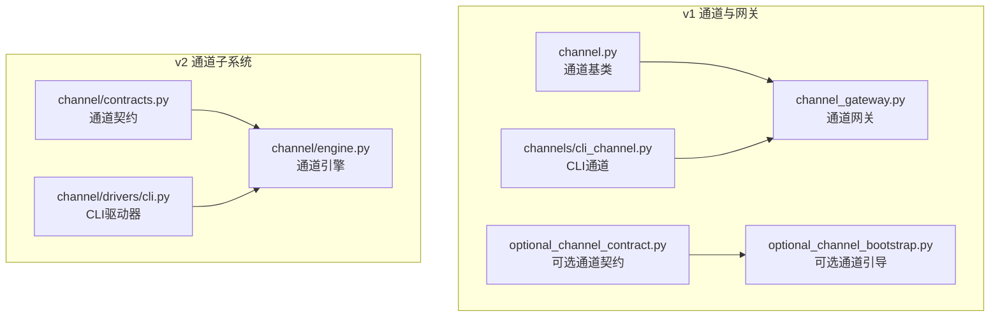
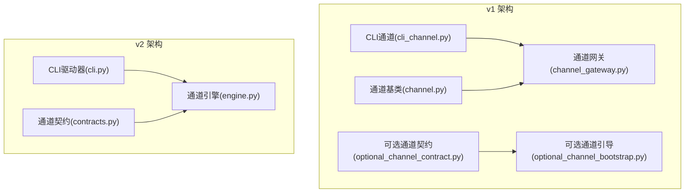
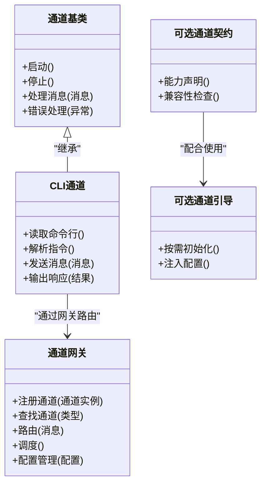
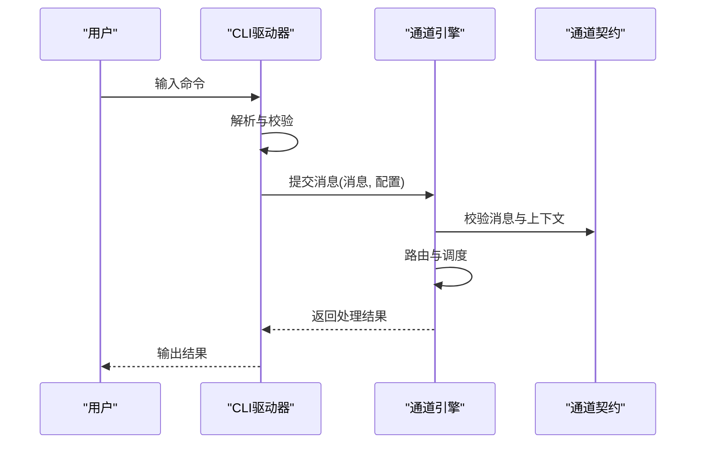
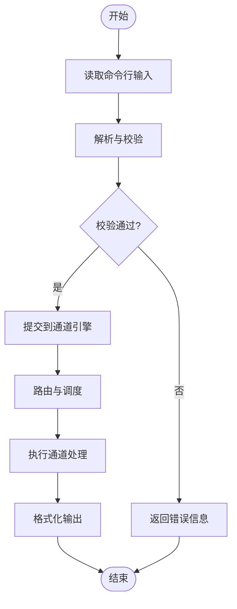
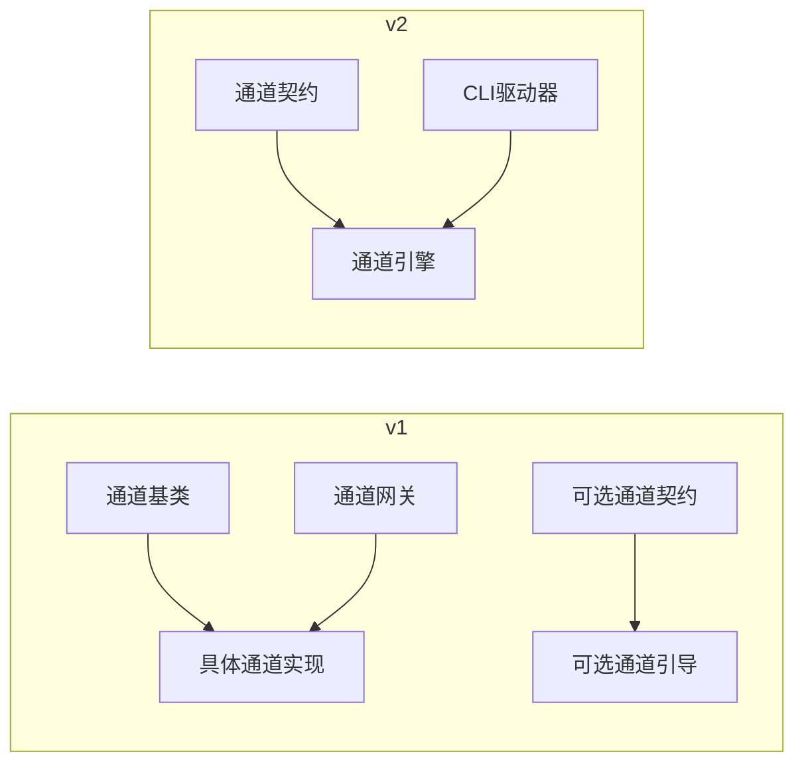

# 通道驱动系统

<cite>
**本文引用的文件**
- [channel.py](file://archive/helios_v1/helios_io/channel.py)
- [channel_gateway.py](file://archive/helios_v1/helios_io/channel_gateway.py)
- [cli_channel.py](file://archive/helios_v1/helios_io/channels/cli_channel.py)
- [optional_channel_contract.py](file://archive/helios_v1/helios_io/optional_channel_contract.py)
- [optional_channel_bootstrap.py](file://archive/helios_v1/helios_io/optional_channel_bootstrap.py)
- [test_cli_channel.py](file://archive/helios_v1/tests/test_cli_channel.py)
- [test_channel_gateway.py](file://archive/helios_v1/tests/test_channel_gateway.py)
- [test_multimodal_channels.py](file://archive/helios_v1/tests/test_multimodal_channels.py)
- [test_qq_channel.py](file://archive/helios_v1/tests/test_qq_channel.py)
- [contracts.py](file://helios_v2/src/helios_v2/channel/contracts.py)
- [engine.py](file://helios_v2/src/helios_v2/channel/engine.py)
- [cli.py](file://helios_v2/src/helios_v2/channel/drivers/cli.py)
- [test_channel_cli_driver.py](file://helios_v2/tests/test_channel_cli_driver.py)
- [README.md](file://README.md)
</cite>

## 目录
1. [引言](#引言)
2. [项目结构](#项目结构)
3. [核心组件](#核心组件)
4. [架构总览](#架构总览)
5. [详细组件分析](#详细组件分析)
6. [依赖关系分析](#依赖关系分析)
7. [性能考虑](#性能考虑)
8. [故障排查指南](#故障排查指南)
9. [结论](#结论)
10. [附录](#附录)

## 引言
本文件面向Helios通道驱动系统，系统性阐述通道驱动的架构设计与实现机制，覆盖CLI驱动器、通道契约定义、路由策略与调度机制，并说明通道的动态加载、配置管理与生命周期控制。同时给出与系统其他模块的接口规范与集成方式，以及自定义通道驱动的开发指南、最佳实践与常见问题解决方案。

## 项目结构
Helios在v1与v2两个版本中均实现了通道驱动体系，v1侧重于具体通道实现与网关模式，v2则抽象出更清晰的契约与引擎层，CLI驱动器作为典型示例贯穿其中。

- v1通道与网关
  - 通道基类与网关：定义通道抽象与统一入口
  - 具体通道：CLI、QQ、语音、视觉等
  - 可选通道契约与引导：支持按需启用与配置
- v2通道子系统
  - 契约层：定义通道输入输出与行为约束
  - 引擎层：通道调度与执行编排
  - CLI驱动器：命令行交互式通道驱动

**图表来源**
- [channel.py](file://archive/helios_v1/helios_io/channel.py)
- [channel_gateway.py](file://archive/helios_v1/helios_io/channel_gateway.py)
- [cli_channel.py](file://archive/helios_v1/helios_io/channels/cli_channel.py)
- [optional_channel_contract.py](file://archive/helios_v1/helios_io/optional_channel_contract.py)
- [optional_channel_bootstrap.py](file://archive/helios_v1/helios_io/optional_channel_bootstrap.py)
- [contracts.py](file://helios_v2/src/helios_v2/channel/contracts.py)
- [engine.py](file://helios_v2/src/helios_v2/channel/engine.py)
- [cli.py](file://helios_v2/src/helios_v2/channel/drivers/cli.py)

**章节来源**
- [README.md](file://README.md)

## 核心组件
- 通道基类（v1）：定义通道的通用接口、生命周期钩子与错误处理约定
- 通道网关（v1）：集中注册、路由与调度通道，提供统一的入出口
- CLI通道（v1）：基于命令行的交互式通道实现
- 可选通道契约与引导（v1）：按需启用通道的能力边界与初始化流程
- 通道契约（v2）：定义输入输出数据模型、事件语义与行为约束
- 通道引擎（v2）：编排通道生命周期、调度与路由策略
- CLI驱动器（v2）：命令行交互式驱动器，对接引擎与外部CLI环境

**章节来源**
- [channel.py](file://archive/helios_v1/helios_io/channel.py)
- [channel_gateway.py](file://archive/helios_v1/helios_io/channel_gateway.py)
- [cli_channel.py](file://archive/helios_v1/helios_io/channels/cli_channel.py)
- [optional_channel_contract.py](file://archive/helios_v1/helios_io/optional_channel_contract.py)
- [optional_channel_bootstrap.py](file://archive/helios_v1/helios_io/optional_channel_bootstrap.py)
- [contracts.py](file://helios_v2/src/helios_v2/channel/contracts.py)
- [engine.py](file://helios_v2/src/helios_v2/channel/engine.py)
- [cli.py](file://helios_v2/src/helios_v2/channel/drivers/cli.py)

## 架构总览
v1采用“通道+网关”模式，v2引入“契约+引擎+驱动器”的分层设计。两者均强调通道的可插拔性与可扩展性，通过统一的契约或基类约束实现动态加载与配置管理。

**图表来源**
- [channel.py](file://archive/helios_v1/helios_io/channel.py)
- [channel_gateway.py](file://archive/helios_v1/helios_io/channel_gateway.py)
- [cli_channel.py](file://archive/helios_v1/helios_io/channels/cli_channel.py)
- [optional_channel_contract.py](file://archive/helios_v1/helios_io/optional_channel_contract.py)
- [optional_channel_bootstrap.py](file://archive/helios_v1/helios_io/optional_channel_bootstrap.py)
- [contracts.py](file://helios_v2/src/helios_v2/channel/contracts.py)
- [engine.py](file://helios_v2/src/helios_v2/channel/engine.py)
- [cli.py](file://helios_v2/src/helios_v2/channel/drivers/cli.py)

## 详细组件分析

### v1 通道与网关
- 通道基类
  - 定义通道的生命周期方法（如启动、停止、处理消息）
  - 统一错误处理与日志接口
  - 约束通道必须实现的方法签名
- 通道网关
  - 注册与发现通道实例
  - 路由策略：根据通道类型、优先级或负载进行选择
  - 调度机制：并发/串行处理、队列与背压控制
  - 配置管理：从配置源读取通道参数并注入实例
- CLI通道
  - 以命令行为输入，解析用户指令并生成通道消息
  - 将通道响应转换为可读输出
- 可选通道契约与引导
  - 契约：声明通道能力边界与兼容性要求
  - 引导：按需初始化通道，避免不必要的资源占用

**图表来源**
- [channel.py](file://archive/helios_v1/helios_io/channel.py)
- [channel_gateway.py](file://archive/helios_v1/helios_io/channel_gateway.py)
- [cli_channel.py](file://archive/helios_v1/helios_io/channels/cli_channel.py)
- [optional_channel_contract.py](file://archive/helios_v1/helios_io/optional_channel_contract.py)
- [optional_channel_bootstrap.py](file://archive/helios_v1/helios_io/optional_channel_bootstrap.py)

**章节来源**
- [channel.py](file://archive/helios_v1/helios_io/channel.py)
- [channel_gateway.py](file://archive/helios_v1/helios_io/channel_gateway.py)
- [cli_channel.py](file://archive/helios_v1/helios_io/channels/cli_channel.py)
- [optional_channel_contract.py](file://archive/helios_v1/helios_io/optional_channel_contract.py)
- [optional_channel_bootstrap.py](file://archive/helios_v1/helios_io/optional_channel_bootstrap.py)

### v2 通道子系统
- 通道契约
  - 定义通道输入输出的数据模型与事件语义
  - 规定通道行为约束（幂等、超时、重试等）
- 通道引擎
  - 生命周期管理：创建、启动、暂停、恢复、销毁
  - 路由策略：基于类型、优先级、负载均衡的调度
  - 调度机制：批处理、流式处理、异步回调
  - 配置管理：运行时参数注入与热更新
- CLI驱动器
  - 与CLI环境交互，读取用户输入并封装为通道消息
  - 解析通道响应并格式化输出
  - 与引擎协作完成消息流转

**图表来源**
- [engine.py](file://helios_v2/src/helios_v2/channel/engine.py)
- [cli.py](file://helios_v2/src/helios_v2/channel/drivers/cli.py)
- [contracts.py](file://helios_v2/src/helios_v2/channel/contracts.py)

**章节来源**
- [contracts.py](file://helios_v2/src/helios_v2/channel/contracts.py)
- [engine.py](file://helios_v2/src/helios_v2/channel/engine.py)
- [cli.py](file://helios_v2/src/helios_v2/channel/drivers/cli.py)

### CLI驱动器（v1 与 v2 对比）
- v1 CLI通道
  - 通过命令行读取输入，封装为通道消息
  - 将通道响应转为文本输出
  - 与通道网关协同完成消息流转
- v2 CLI驱动器
  - 与引擎解耦，专注于CLI交互
  - 通过契约约束消息格式与行为
  - 支持更灵活的配置与路由策略

**图表来源**
- [cli_channel.py](file://archive/helios_v1/helios_io/channels/cli_channel.py)
- [cli.py](file://helios_v2/src/helios_v2/channel/drivers/cli.py)

**章节来源**
- [cli_channel.py](file://archive/helios_v1/helios_io/channels/cli_channel.py)
- [cli.py](file://helios_v2/src/helios_v2/channel/drivers/cli.py)

## 依赖关系分析
- v1
  - 通道基类被具体通道实现继承
  - 通道网关依赖通道基类与具体通道
  - 可选契约与引导用于按需启用通道
- v2
  - 契约约束驱动器与引擎
  - 引擎协调驱动器与通道实例
  - CLI驱动器与引擎之间通过契约解耦

**图表来源**
- [channel.py](file://archive/helios_v1/helios_io/channel.py)
- [channel_gateway.py](file://archive/helios_v1/helios_io/channel_gateway.py)
- [optional_channel_contract.py](file://archive/helios_v1/helios_io/optional_channel_contract.py)
- [optional_channel_bootstrap.py](file://archive/helios_v1/helios_io/optional_channel_bootstrap.py)
- [contracts.py](file://helios_v2/src/helios_v2/channel/contracts.py)
- [engine.py](file://helios_v2/src/helios_v2/channel/engine.py)
- [cli.py](file://helios_v2/src/helios_v2/channel/drivers/cli.py)

**章节来源**
- [channel.py](file://archive/helios_v1/helios_io/channel.py)
- [channel_gateway.py](file://archive/helios_v1/helios_io/channel_gateway.py)
- [optional_channel_contract.py](file://archive/helios_v1/helios_io/optional_channel_contract.py)
- [optional_channel_bootstrap.py](file://archive/helios_v1/helios_io/optional_channel_bootstrap.py)
- [contracts.py](file://helios_v2/src/helios_v2/channel/contracts.py)
- [engine.py](file://helios_v2/src/helios_v2/channel/engine.py)
- [cli.py](file://helios_v2/src/helios_v2/channel/drivers/cli.py)

## 性能考虑
- 路由与调度
  - 优先使用轻量级路由策略（如轮询、最小连接数），避免复杂状态机导致的调度开销
  - 对高吞吐场景采用批处理与异步回调，减少阻塞
- 并发与背压
  - 在网关或引擎层设置队列长度与超时阈值，防止内存膨胀
  - 使用信号量或令牌桶控制并发度
- 配置与热更新
  - 将配置变更与运行时参数分离，尽量支持热更新，降低停机时间
- 日志与可观测性
  - 限制高频日志级别，使用采样与异步写入
  - 关键路径埋点，便于定位性能瓶颈

## 故障排查指南
- CLI通道无法接收输入
  - 检查CLI驱动器是否正确解析输入并提交到引擎
  - 确认引擎已注册对应通道并处于可用状态
- 通道无响应或超时
  - 查看路由策略是否命中目标通道
  - 检查通道内部异常与错误处理逻辑
- 配置不生效
  - 确认配置源与注入流程
  - 对v2确认契约约束是否满足
- 单元测试参考
  - v1：CLI通道、通道网关、多模态通道、QQ通道测试用例
  - v2：CLI驱动器测试用例

**章节来源**
- [test_cli_channel.py](file://archive/helios_v1/tests/test_cli_channel.py)
- [test_channel_gateway.py](file://archive/helios_v1/tests/test_channel_gateway.py)
- [test_multimodal_channels.py](file://archive/helios_v1/tests/test_multimodal_channels.py)
- [test_qq_channel.py](file://archive/helios_v1/tests/test_qq_channel.py)
- [test_channel_cli_driver.py](file://helios_v2/tests/test_channel_cli_driver.py)

## 结论
Helios通道驱动系统在v1与v2版本中逐步演进：从“通道+网关”到“契约+引擎+驱动器”，提升了可扩展性与可维护性。v2通过明确的契约与引擎层，使CLI驱动器等外部适配器能够以一致的方式接入系统，同时保留了v1的动态加载与按需引导能力。建议在新功能开发中优先采用v2的契约与引擎模式，并结合单元测试确保行为一致性。

## 附录
- 开发指南
  - 契约先行：先定义通道契约，再实现驱动器与引擎对接
  - 分层解耦：驱动器只负责交互，引擎负责调度与生命周期
  - 可插拔：通过可选契约与引导实现按需启用
- 最佳实践
  - 明确输入输出数据模型与事件语义
  - 设计幂等与可回滚的处理流程
  - 合理设置超时与重试策略
  - 使用测试用例覆盖关键路径
- 常见问题
  - 路由失败：检查通道类型与路由规则
  - 配置冲突：核对配置源与注入顺序
  - 性能瓶颈：优化队列长度、并发度与日志级别