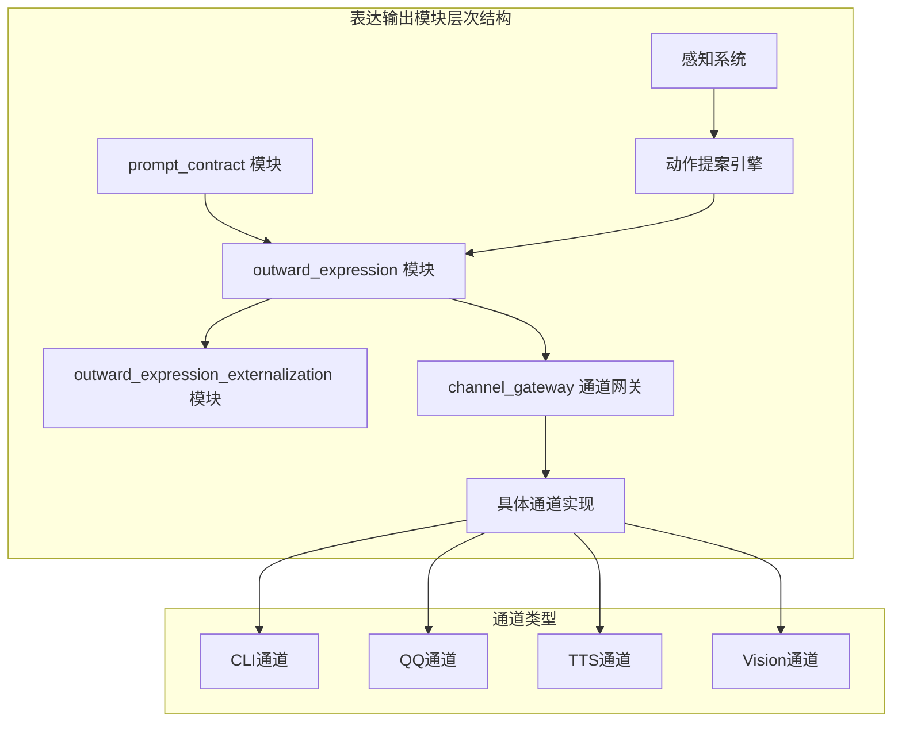
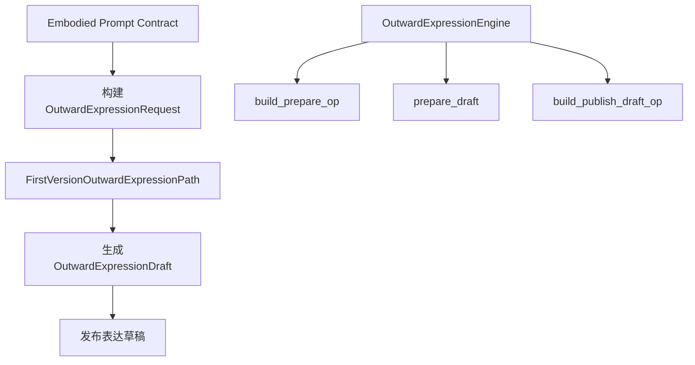
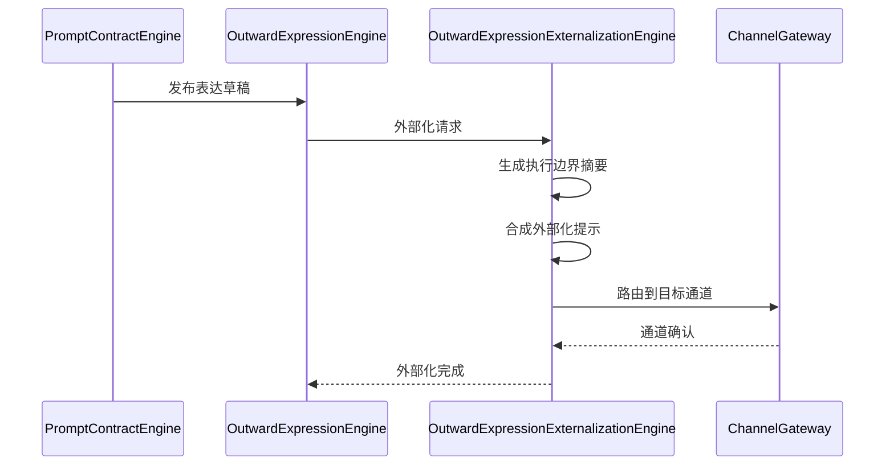
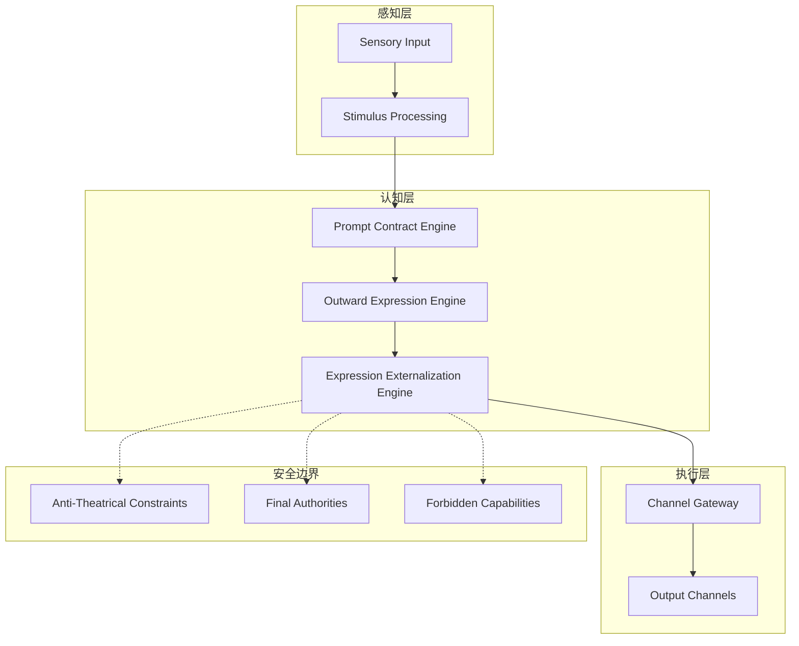
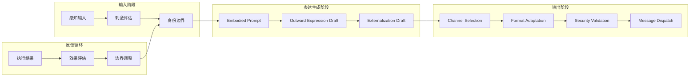
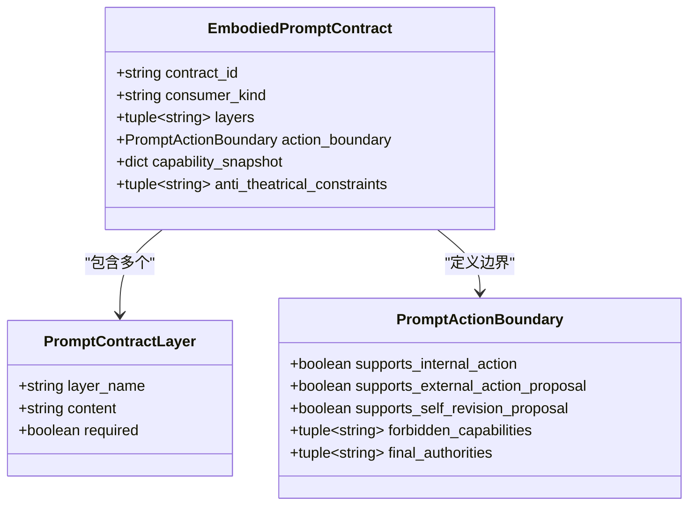
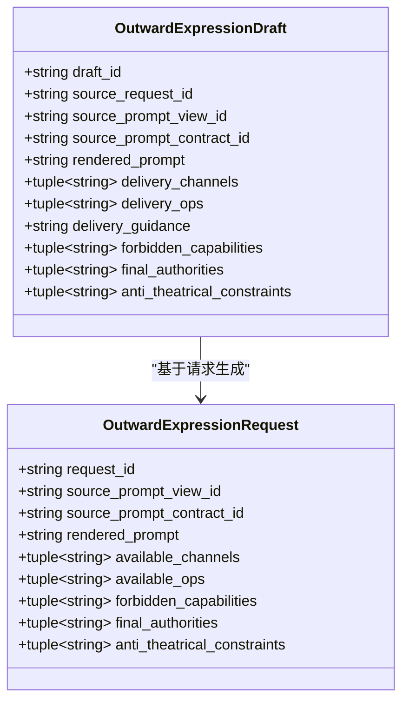
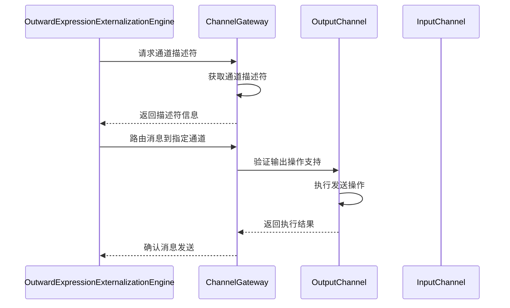
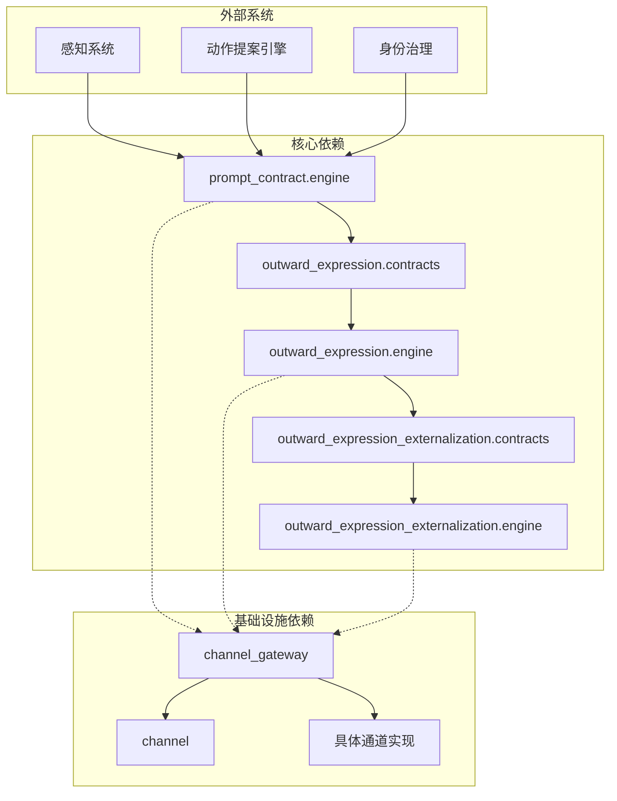

# 表达输出模块

<cite>
**本文档引用的文件**
- [outward_expression/contracts.py](file://helios_v2/src/helios_v2/outward_expression/contracts.py)
- [outward_expression/engine.py](file://helios_v2/src/helios_v2/outward_expression/engine.py)
- [outward_expression_externalization/contracts.py](file://helios_v2/src/helios_v2/outward_expression_externalization/contracts.py)
- [outward_expression_externalization/engine.py](file://helios_v2/src/helios_v2/outward_expression_externalization/engine.py)
- [prompt_contract/engine.py](file://helios_v2/src/helios_v2/prompt_contract/engine.py)
- [channel_gateway.py](file://archive/helios_v1/helios_io/channel_gateway.py)
- [channel.py](file://archive/helios_v1/helios_io/channel.py)
- [cli_channel.py](file://archive/helios_v1/helios_io/channels/cli_channel.py)
- [qq_channel.py](file://archive/helios_v1/helios_io/channels/qq_channel.py)
</cite>

## 目录
1. [简介](#简介)
2. [项目结构](#项目结构)
3. [核心组件](#核心组件)
4. [架构概览](#架构概览)
5. [详细组件分析](#详细组件分析)
6. [依赖关系分析](#依赖关系分析)
7. [性能考虑](#性能考虑)
8. [故障排除指南](#故障排除指南)
9. [结论](#结论)

## 简介

表达输出模块是Helios认知架构中的关键组件，负责将内部思维过程转化为外部可执行的表达输出。该模块实现了多模态输出格式支持、通道适配器和表达内容的结构化组织，确保AI系统能够以安全、可控的方式与外部世界交互。

模块的核心功能包括：
- 多模态输出格式管理（文本、语音、视觉等）
- 通道适配器抽象层
- 表达内容的结构化处理和序列化
- 渠道特定的适配逻辑
- 与动作提案引擎和感知系统的深度集成

## 项目结构

表达输出模块在Helios v2中采用分层架构设计，主要包含以下层次：

**图表来源**
- [prompt_contract/engine.py:160-271](file://helios_v2/src/helios_v2/prompt_contract/engine.py#L160-L271)
- [outward_expression/engine.py:75-112](file://helios_v2/src/helios_v2/outward_expression/engine.py#L75-L112)
- [channel_gateway.py:16-412](file://archive/helios_v1/helios_io/channel_gateway.py#L16-L412)

**章节来源**
- [prompt_contract/engine.py:1-271](file://helios_v2/src/helios_v2/prompt_contract/engine.py#L1-L271)
- [outward_expression/engine.py:1-112](file://helios_v2/src/helios_v2/outward_expression/engine.py#L1-L112)
- [outward_expression_externalization/engine.py:1-120](file://helios_v2/src/helios_v2/outward_expression_externalization/engine.py#L1-L120)

## 核心组件

### 1. 外部表达模块 (Outward Expression)

外部表达模块负责将Embodied Prompt Contract转换为可执行的表达草稿，包含以下关键组件：

#### 数据结构定义
- **OutwardExpressionConfig**: 配置管理，包含引导ID和学习参数类别
- **OutwardExpressionRequest**: 输入请求，包含渲染提示和可用通道信息
- **OutwardExpressionDraft**: 不变的表达草稿，封装所有输出相关信息
- **OutwardExpressionAPI**: 公共API接口，定义核心操作方法

#### 核心流程

**图表来源**
- [outward_expression/contracts.py:37-192](file://helios_v2/src/helios_v2/outward_expression/contracts.py#L37-L192)
- [outward_expression/engine.py:38-112](file://helios_v2/src/helios_v2/outward_expression/engine.py#L38-L112)

### 2. 表达外部化模块 (Expression Externalization)

表达外部化模块进一步处理表达草稿，准备执行级别的外部化内容：

#### 关键特性
- 执行边界摘要生成
- 外部化提示合成
- 候选通道和操作管理
- 安全约束验证

#### 处理流程

**图表来源**
- [outward_expression_externalization/engine.py:38-120](file://helios_v2/src/helios_v2/outward_expression_externalization/engine.py#L38-L120)
- [channel_gateway.py:209-266](file://archive/helios_v1/helios_io/channel_gateway.py#L209-L266)

**章节来源**
- [outward_expression/contracts.py:1-192](file://helios_v2/src/helios_v2/outward_expression/contracts.py#L1-L192)
- [outward_expression/engine.py:1-112](file://helios_v2/src/helios_v2/outward_expression/engine.py#L1-L112)
- [outward_expression_externalization/contracts.py:1-77](file://helios_v2/src/helios_v2/outward_expression_externalization/contracts.py#L1-L77)
- [outward_expression_externalization/engine.py:1-120](file://helios_v2/src/helios_v2/outward_expression_externalization/engine.py#L1-L120)

## 架构概览

表达输出模块采用分层架构，实现了从感知输入到外部表达的完整流水线：

**图表来源**
- [prompt_contract/engine.py:160-271](file://helios_v2/src/helios_v2/prompt_contract/engine.py#L160-L271)
- [outward_expression/engine.py:75-112](file://helios_v2/src/helios_v2/outward_expression/engine.py#L75-L112)
- [channel_gateway.py:16-412](file://archive/helios_v1/helios_io/channel_gateway.py#L16-L412)

### 数据流架构

表达输出的数据流遵循严格的控制路径，确保每个步骤都有明确的安全检查和验证：

**图表来源**
- [prompt_contract/engine.py:42-147](file://helios_v2/src/helios_v2/prompt_contract/engine.py#L42-L147)
- [outward_expression/engine.py:38-73](file://helios_v2/src/helios_v2/outward_expression/engine.py#L38-L73)

## 详细组件分析

### 1. Prompt Contract Engine

Prompt Contract Engine负责将感知输入转换为结构化的提示契约，为后续表达生成提供基础：

#### 核心功能
- **多层提示构建**: 将当前刺激、情感状态、记忆检索和身份边界整合为多层提示
- **消费者导向**: 根据不同消费者类型（思考者vs表达者）调整输出方向
- **边界定义**: 明确禁止能力、最终权威和反剧场约束

#### 提示层结构

**图表来源**
- [prompt_contract/engine.py:42-147](file://helios_v2/src/helios_v2/prompt_contract/engine.py#L42-L147)

**章节来源**
- [prompt_contract/engine.py:1-271](file://helios_v2/src/helios_v2/prompt_contract/engine.py#L1-L271)

### 2. Outward Expression Engine

Outward Expression Engine将Embodied Prompt Contract转换为可执行的表达草稿：

#### 草稿生成策略
- **第一版本路径**: 保持提案优先的执行边界
- **指导信息生成**: 动态生成交付指导和执行边界摘要
- **不变性保证**: 使用冻结数据类确保草稿的不可变性

#### 草稿内容组织

**图表来源**
- [outward_expression/contracts.py:117-158](file://helios_v2/src/helios_v2/outward_expression/contracts.py#L117-L158)

**章节来源**
- [outward_expression/contracts.py:1-192](file://helios_v2/src/helios_v2/outward_expression/contracts.py#L1-L192)
- [outward_expression/engine.py:1-112](file://helios_v2/src/helios_v2/outward_expression/engine.py#L1-L112)

### 3. Channel Gateway

Channel Gateway作为通道适配器的核心，提供了统一的通道管理和路由机制：

#### 通道管理功能
- **注册和注销**: 动态管理输入和输出通道
- **配置快照**: 提供通道配置的实时快照
- **健康检查**: 监控通道状态和性能指标
- **路由决策**: 基于通道描述符选择合适的输出操作

#### 通道路由流程

**图表来源**
- [channel_gateway.py:209-266](file://archive/helios_v1/helios_io/channel_gateway.py#L209-L266)

**章节来源**
- [channel_gateway.py:1-412](file://archive/helios_v1/helios_io/channel_gateway.py#L1-L412)
- [channel.py:1-426](file://archive/helios_v1/helios_io/channel.py#L1-L426)

### 4. 具体通道实现

#### CLI通道
CLI通道提供了本地终端交互能力，支持命令行管理和文本输出：

- **命令系统**: 内置管理命令（help、state、history、quit）
- **状态提供**: 可选的状态摘要和历史记录功能
- **表达调节**: 支持表达内容的调节和格式化

#### QQ通道
QQ通道实现了企业微信机器人的集成：

- **连接管理**: 自动重连机制和断线恢复
- **消息类型**: 支持私聊和群聊消息
- **SEC标注**: 集成安全和情感计算评估

**章节来源**
- [cli_channel.py:1-534](file://archive/helios_v1/helios_io/channels/cli_channel.py#L1-L534)
- [qq_channel.py:1-367](file://archive/helios_v1/helios_io/channels/qq_channel.py#L1-L367)

## 依赖关系分析

表达输出模块的依赖关系体现了清晰的关注点分离和模块化设计：

**图表来源**
- [prompt_contract/engine.py:8-22](file://helios_v2/src/helios_v2/prompt_contract/engine.py#L8-L22)
- [outward_expression/engine.py:8-16](file://helios_v2/src/helios_v2/outward_expression/engine.py#L8-L16)
- [outward_expression_externalization/engine.py:8-16](file://helios_v2/src/helios_v2/outward_expression_externalization/engine.py#L8-L16)

### 组件耦合度分析

表达输出模块展现了良好的内聚性和低耦合性：

- **向上依赖**: 下层模块依赖上层模块的接口定义
- **向下依赖**: 上层模块不直接依赖下层的具体实现
- **横向通信**: 通过公共接口进行松耦合通信

**章节来源**
- [prompt_contract/engine.py:1-271](file://helios_v2/src/helios_v2/prompt_contract/engine.py#L1-L271)
- [outward_expression/engine.py:1-112](file://helios_v2/src/helios_v2/outward_expression/engine.py#L1-L112)
- [outward_expression_externalization/engine.py:1-120](file://helios_v2/src/helios_v2/outward_expression_externalization/engine.py#L1-L120)

## 性能考虑

### 1. 序列化优化

表达输出模块采用了多种序列化优化策略：

- **冻结数据类**: 使用`@dataclass(frozen=True)`确保不可变性，提高并发安全性
- **延迟计算**: 在需要时才生成交付指导和执行边界摘要
- **内存池**: 复用通道描述符和配置快照对象

### 2. 通道路由优化

Channel Gateway实现了高效的通道路由机制：

- **描述符缓存**: 缓存通道描述符以避免重复查询
- **异步处理**: 支持异步通道操作以提高吞吐量
- **批量处理**: 支持广播消息的批量路由

### 3. 安全验证优化

模块内置了多层次的安全验证：

- **输入验证**: 在每个处理阶段进行严格的数据验证
- **权限检查**: 基于最终权威和禁止能力进行访问控制
- **约束检查**: 确保表达内容符合反剧场约束

## 故障排除指南

### 1. 常见错误类型

#### 配置错误
- **OutwardExpressionError**: 外部表达配置验证失败
- **OutwardExpressionExternalizationError**: 外部化配置验证失败
- **PromptContractError**: 提示契约构建失败

#### 运行时错误
- **通道连接失败**: ChannelManagementResult包含错误码
- **操作不支持**: 通道描述符不支持请求的操作
- **配置验证失败**: 通道配置更新验证失败

### 2. 排查步骤

#### 配置验证
1. 检查引导ID是否正确
2. 验证学习参数类别完整性
3. 确认必需字段非空

#### 通道诊断
1. 使用`health_check`获取通道状态
2. 检查`get_config_snapshot`返回的配置
3. 验证通道描述符的兼容性

#### 性能监控
1. 监控通道路由延迟
2. 检查消息队列长度
3. 分析错误日志模式

**章节来源**
- [outward_expression/contracts.py:20-52](file://helios_v2/src/helios_v2/outward_expression/contracts.py#L20-L52)
- [outward_expression_externalization/contracts.py:21-55](file://helios_v2/src/helios_v2/outward_expression_externalization/contracts.py#L21-L55)
- [channel_gateway.py:400-412](file://archive/helios_v1/helios_io/channel_gateway.py#L400-L412)

## 结论

表达输出模块通过其精心设计的架构和实现，成功地解决了多模态输出、通道适配和安全边界等复杂问题。模块的主要优势包括：

### 技术优势
- **模块化设计**: 清晰的层次结构和职责分离
- **安全优先**: 多层安全检查和边界控制
- **可扩展性**: 插件化的通道架构支持新通道添加
- **性能优化**: 高效的序列化和路由机制

### 架构特色
- **渐进式演进**: 第一版本路径确保稳定性的同时预留扩展空间
- **契约驱动**: 强类型的契约确保数据一致性和完整性
- **可观测性**: 完善的运行时操作和状态监控

### 未来发展方向
- **多模态增强**: 支持更多输出格式和通道类型
- **智能路由**: 基于上下文的动态通道选择
- **性能优化**: 更高效的序列化和传输机制
- **安全强化**: 更细粒度的权限控制和审计

表达输出模块为Helios认知架构提供了坚实的基础，确保AI系统能够在保持安全和可控的前提下，有效地与外部世界进行交互。