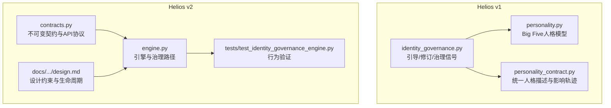
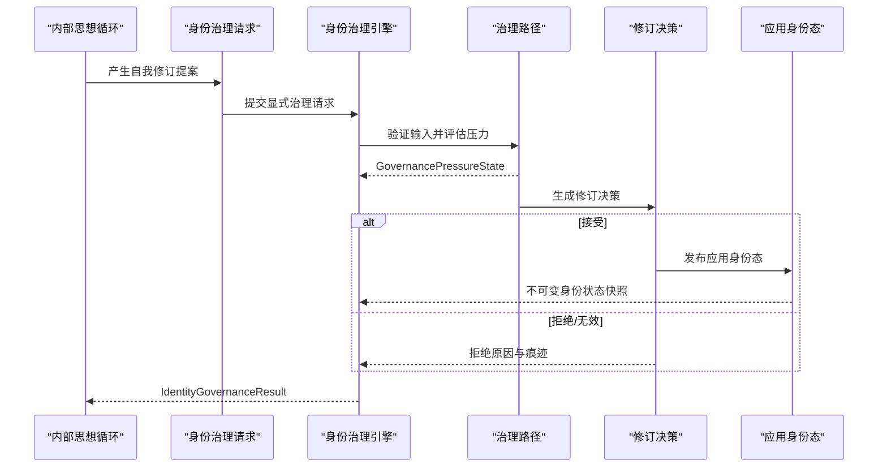
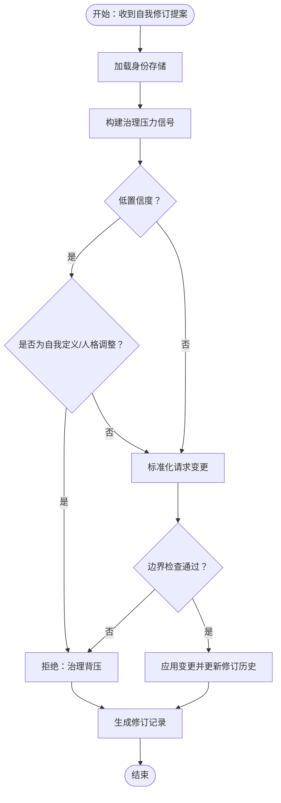
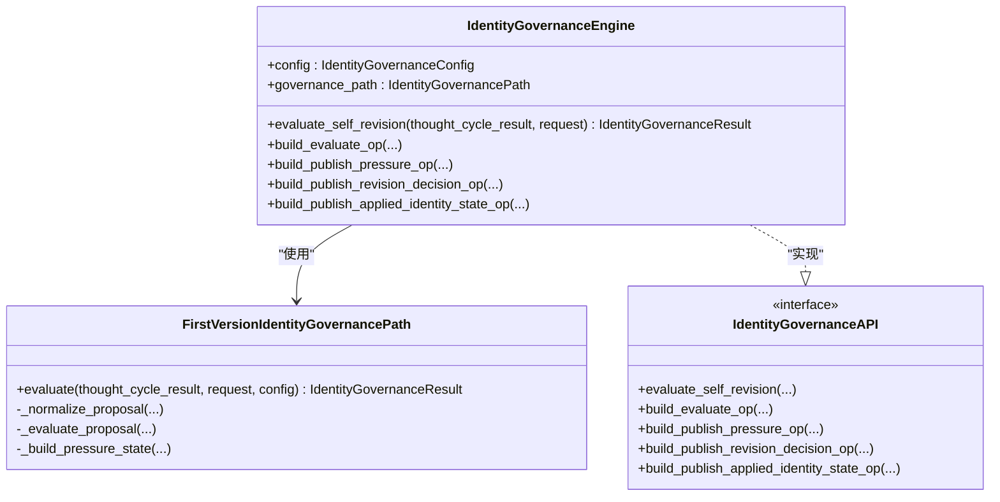
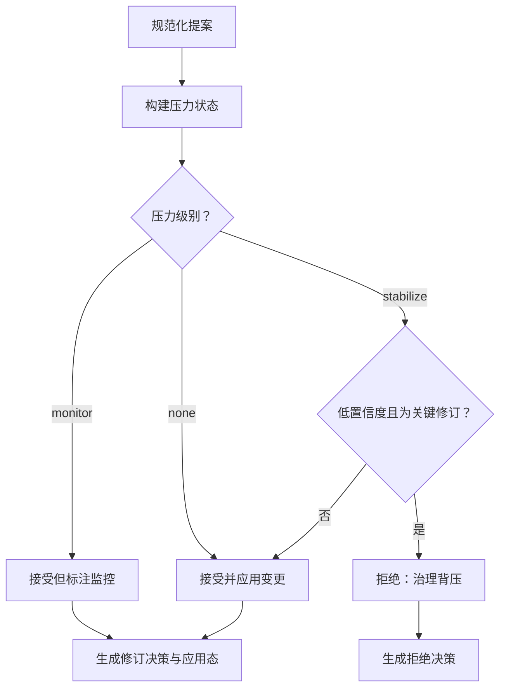
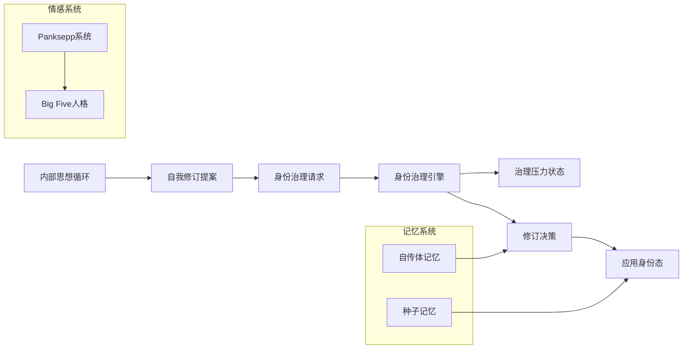
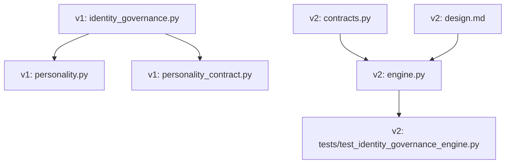

# 身份治理机制

<cite>
**本文档引用的文件**
- [identity_governance.py](file://archive/helios_v1/identity_governance.py)
- [personality.py](file://archive/helios_v1/personality.py)
- [personality_contract.py](file://archive/helios_v1/personality_contract.py)
- [engine.py](file://helios_v2/src/helios_v2/identity_governance/engine.py)
- [contracts.py](file://helios_v2/src/helios_v2/identity_governance/contracts.py)
- [test_identity_governance_engine.py](file://helios_v2/tests/test_identity_governance_engine.py)
- [design.md](file://helios_v2/docs/requirements/14-identity-governance-self-revision-integration/design.md)
- [requirement.md](file://archive/helios_v1/docs/requirements/10-identity-bootstrap-and-self-revision/requirement.md)
- [test_personality_projection.py](file://archive/helios_v1/tests/test_personality_projection.py)
</cite>

## 目录
1. [引言](#引言)
2. [项目结构](#项目结构)
3. [核心组件](#核心组件)
4. [架构总览](#架构总览)
5. [详细组件分析](#详细组件分析)
6. [依赖关系分析](#依赖关系分析)
7. [性能考量](#性能考量)
8. [故障排查指南](#故障排查指南)
9. [结论](#结论)
10. [附录](#附录)

## 引言
本文件面向Helios身份治理机制，系统阐述自我认知与身份认同的动态演化过程，包括身份模型构建、身份验证机制与自我修订算法；解释身份治理的决策流程、一致性检查与演化触发条件；并给出定制策略、冲突处理与长期稳定性维护方法。文档同时说明身份治理与认知系统、情感系统、记忆系统的深层交互关系，以及身份演化对整体行为的影响路径。

## 项目结构
Helios v1与v2在身份治理方面呈现演进关系：
- v1：以模块形式提供身份引导（bootstrap）、修订提案与记录、治理信号构建与应用逻辑。
- v2：以契约优先的设计，将身份治理抽象为Owner边界明确的引擎与路径，强调不可变契约、压力状态、修订决策与应用态发布。

**图表来源**
- [identity_governance.py:196-541](file://archive/helios_v1/identity_governance.py#L196-L541)
- [personality.py:102-390](file://archive/helios_v1/personality.py#L102-L390)
- [personality_contract.py:47-206](file://archive/helios_v1/personality_contract.py#L47-L206)
- [contracts.py:74-447](file://helios_v2/src/helios_v2/identity_governance/contracts.py#L74-L447)
- [engine.py:391-468](file://helios_v2/src/helios_v2/identity_governance/engine.py#L391-L468)

**章节来源**
- [identity_governance.py:1-541](file://archive/helios_v1/identity_governance.py#L1-L541)
- [personality.py:1-390](file://archive/helios_v1/personality.py#L1-L390)
- [personality_contract.py:1-206](file://archive/helios_v1/personality_contract.py#L1-L206)
- [contracts.py:1-447](file://helios_v2/src/helios_v2/identity_governance/contracts.py#L1-L447)
- [engine.py:1-468](file://helios_v2/src/helios_v2/identity_governance/engine.py#L1-L468)

## 核心组件
- v1身份治理核心
  - 引导定义与存储：IdentityBootstrapDefinition、IdentityStore
  - 修订提案与记录：SelfRevisionProposal、IdentityRevisionRecord
  - 治理信号与应用：build_proactive_governance_signal、apply_self_revision
  - 人格同步：apply_identity_store_to_personality
- v2身份治理核心
  - 不可变契约：IdentityGovernanceRequest、GovernancePressureState、RevisionDecision、AppliedIdentityState、IdentityGovernanceResult
  - 引擎与路径：IdentityGovernanceEngine、FirstVersionIdentityGovernancePath
  - 发布操作：EvaluateIdentityGovernanceOp、PublishGovernancePressureOp、PublishRevisionDecisionOp、PublishAppliedIdentityStateOp
  - API协议：IdentityGovernanceAPI

**章节来源**
- [identity_governance.py:55-194](file://archive/helios_v1/identity_governance.py#L55-L194)
- [identity_governance.py:196-541](file://archive/helios_v1/identity_governance.py#L196-L541)
- [contracts.py:110-333](file://helios_v2/src/helios_v2/identity_governance/contracts.py#L110-L333)
- [engine.py:391-468](file://helios_v2/src/helios_v2/identity_governance/engine.py#L391-L468)

## 架构总览
身份治理在Helios中的职责边界清晰：从思想循环输出的自我修订提案出发，经由显式治理请求与压力状态评估，生成正式治理结果，并在通过时发布应用态供下游同步与持久化。

**图表来源**
- [engine.py:398-414](file://helios_v2/src/helios_v2/identity_governance/engine.py#L398-L414)
- [engine.py:76-112](file://helios_v2/src/helios_v2/identity_governance/engine.py#L76-L112)
- [engine.py:175-302](file://helios_v2/src/helios_v2/identity_governance/engine.py#L175-L302)
- [contracts.py:335-364](file://helios_v2/src/helios_v2/identity_governance/contracts.py#L335-L364)

**章节来源**
- [design.md:73-84](file://helios_v2/docs/requirements/14-identity-governance-self-revision-integration/design.md#L73-L84)
- [engine.py:391-468](file://helios_v2/src/helios_v2/identity_governance/engine.py#L391-L468)

## 详细组件分析

### v1身份模型与治理流程
- 身份引导与存储
  - IdentityBootstrapDefinition：包含引导版本、自我烙印、自我定义、身份叙事、人格基线与种子记忆等字段，支持序列化/反序列化与默认构造。
  - IdentityStore：承载已初始化标识、引导版本、核心身份字段、元数据、当前修订ID与修订历史。
- 自我修订提案与记录
  - SelfRevisionProposal：携带来源思想ID、修订类型、请求变更、置信度、范围与原因轨迹。
  - IdentityRevisionRecord：记录修订ID、来源思想ID、请求变更、实际应用变更、原因轨迹、时间戳与结果。
- 治理信号与应用
  - build_proactive_governance_signal：基于近期治理跟踪摘要与历史，计算压力分数、级别与审查提示，区分监控与稳定化背压。
  - apply_self_revision：依据压力级别、置信度与修订类型执行边界检查与应用，生成修订记录并更新store。

**图表来源**
- [identity_governance.py:434-519](file://archive/helios_v1/identity_governance.py#L434-L519)
- [identity_governance.py:196-298](file://archive/helios_v1/identity_governance.py#L196-L298)

**章节来源**
- [identity_governance.py:55-194](file://archive/helios_v1/identity_governance.py#L55-L194)
- [identity_governance.py:196-541](file://archive/helios_v1/identity_governance.py#L196-L541)

### v2契约化治理引擎
- 不可变契约
  - IdentityGovernanceRequest：显式治理输入边界，包含提案快照、身份状态快照、治理摘要与历史、tick元数据。
  - GovernancePressureState：压力状态，含活跃、分数、级别、审查提示、最近触发源等。
  - RevisionDecision：修订决策，区分接受、带监控接受、拒绝与无效提案。
  - AppliedIdentityState：接受后的身份状态发布，包含修订ID、当前修订ID、状态快照与变更字段。
  - IdentityGovernanceResult：一次评估的正式结果，承载压力状态与修订决策，接受时包含应用态。
- 引擎与路径
  - IdentityGovernanceEngine：负责输入验证、路径选择与结果发布，提供操作构建器用于可观测性。
  - FirstVersionIdentityGovernancePath：私有确定性路径，将规范化提案转换为治理结果与可选应用态。
- API与错误
  - IdentityGovernanceAPI：公开评估与发布接口。
  - IdentityGovernanceError：治理契约失败时的硬停止错误。

**图表来源**
- [engine.py:391-468](file://helios_v2/src/helios_v2/identity_governance/engine.py#L391-L468)
- [engine.py:70-388](file://helios_v2/src/helios_v2/identity_governance/engine.py#L70-L388)
- [contracts.py:411-447](file://helios_v2/src/helios_v2/identity_governance/contracts.py#L411-L447)

**章节来源**
- [contracts.py:110-333](file://helios_v2/src/helios_v2/identity_governance/contracts.py#L110-L333)
- [engine.py:391-468](file://helios_v2/src/helios_v2/identity_governance/engine.py#L391-L468)

### 决策流程与一致性检查
- 触发条件
  - 思想循环输出自我修订提案；治理请求携带提案存在性与来源校验。
  - 治理压力状态来源于近期治理跟踪摘要与历史，计算最近触发源一致性、密度与比例。
- 决策规则
  - 监控级压力：接受但标注监控，不进行强背压。
  - 稳定化背压：低置信度且涉及自我定义/人格调整时拒绝。
  - 边界检查：禁止将Helios描述为“被设计的程序”，确保最低层边界不被破坏。
- 一致性检查
  - 请求与提案的来源ID与存在性必须一致。
  - 压力状态与决策必须满足契约约束，状态与字段均不可为空或非法。

**图表来源**
- [engine.py:175-302](file://helios_v2/src/helios_v2/identity_governance/engine.py#L175-L302)
- [engine.py:304-388](file://helios_v2/src/helios_v2/identity_governance/engine.py#L304-L388)

**章节来源**
- [engine.py:27-57](file://helios_v2/src/helios_v2/identity_governance/engine.py#L27-L57)
- [engine.py:304-388](file://helios_v2/src/helios_v2/identity_governance/engine.py#L304-L388)

### 与认知、情感与记忆系统的交互
- 认知系统
  - 自我修订提案源自内部思想循环，治理请求显式绑定来源思想结果ID与提案存在性，确保闭环可追溯。
- 情感系统
  - v1：人格基线与情感系统映射（Big Five → Panksepp），情感体验驱动人格演化，间接影响身份叙事与边界。
  - v2：治理压力状态统计“defer/reflect”倾向与触发源一致性，反映情感与认知交互对身份稳定性的影响。
- 记忆系统
  - v1：种子记忆与自传体连续性记忆参与身份叙事构建与修订。
  - v2：应用态发布包含变更字段与当前修订ID，便于下游记忆与连续性合成。

**图表来源**
- [personality.py:102-390](file://archive/helios_v1/personality.py#L102-L390)
- [personality_contract.py:65-129](file://archive/helios_v1/personality_contract.py#L65-L129)
- [engine.py:304-388](file://helios_v2/src/helios_v2/identity_governance/engine.py#L304-L388)

**章节来源**
- [personality.py:102-390](file://archive/helios_v1/personality.py#L102-L390)
- [personality_contract.py:65-129](file://archive/helios_v1/personality_contract.py#L65-L129)

### 实现示例与最佳实践
- 定制身份治理策略
  - 通过IdentityGovernanceConfig声明必需的学习参数类别，确保治理评估策略、压力解释策略、支持修订策略与边界检查策略得到确认。
  - 使用FirstVersionIdentityGovernancePath作为私有路径，避免将临时阈值固化为架构真相。
- 处理身份冲突
  - 当压力级别为“stabilize”且提案置信度低时，拒绝涉及自我定义与人格调整的修订，防止不稳定演化。
  - 对无效或不受支持的修订类型，生成明确拒绝原因与痕迹，保证可审计性。
- 维护长期身份稳定性
  - 利用AppliedIdentityState发布不可变身份状态快照，下游仅消费而不直接修改。
  - 通过IdentityGovernanceResult与压力状态，建立可观测性与评估基线。

**章节来源**
- [contracts.py:74-108](file://helios_v2/src/helios_v2/identity_governance/contracts.py#L74-L108)
- [engine.py:175-302](file://helios_v2/src/helios_v2/identity_governance/engine.py#L175-L302)
- [test_identity_governance_engine.py:196-272](file://helios_v2/tests/test_identity_governance_engine.py#L196-L272)

## 依赖关系分析
- v1到v2的演进
  - v1：治理逻辑与引导/修订/信号混合在单一模块中，治理调用与持久化在主程序中耦合。
  - v2：契约化边界明确，治理Owner独立于思想生成、人格渲染与审计持久化，仅负责提案验证、压力评估、决策与应用态发布。
- 关键依赖
  - v1：identity_governance依赖personality与personality_contract进行人格同步与统一描述。
  - v2：engine依赖contracts定义的契约与API协议，测试验证引擎行为与边界。

**图表来源**
- [identity_governance.py:521-530](file://archive/helios_v1/identity_governance.py#L521-L530)
- [personality_contract.py:65-129](file://archive/helios_v1/personality_contract.py#L65-L129)
- [engine.py:391-468](file://helios_v2/src/helios_v2/identity_governance/engine.py#L391-L468)
- [test_identity_governance_engine.py:196-272](file://helios_v2/tests/test_identity_governance_engine.py#L196-L272)
- [design.md:26-51](file://helios_v2/docs/requirements/14-identity-governance-self-revision-integration/design.md#L26-L51)

**章节来源**
- [identity_governance.py:521-530](file://archive/helios_v1/identity_governance.py#L521-L530)
- [engine.py:391-468](file://helios_v2/src/helios_v2/identity_governance/engine.py#L391-L468)

## 性能考量
- 契约不可变性与验证开销
  - v2通过不可变契约与严格校验，减少运行期状态漂移带来的调试成本，但需注意请求与决策对象的构造与序列化成本。
- 压力状态计算
  - v1/v2均基于近期治理跟踪统计，复杂度与历史长度线性相关；可通过限制历史窗口与字段裁剪降低计算与内存占用。
- 人格同步
  - v1在应用态后同步人格基线，建议批量或异步执行以避免阻塞治理主路径。

[本节为通用指导，无需具体文件分析]

## 故障排查指南
- 常见错误与定位
  - 输入不合法：提案来源ID缺失、请求字段为空、压力状态字段非法等，将触发IdentityGovernanceError。
  - 治理能力缺失：未提供治理路径时，评估将直接失败。
  - 修订拒绝：边界违规、无效类型、低置信度背压等，拒绝原因与痕迹明确。
- 测试验证要点
  - 单元测试覆盖契约不可变性、压力状态保真、修订状态分类、监控接受与背压拒绝、应用态发布等关键路径。

**章节来源**
- [engine.py:27-57](file://helios_v2/src/helios_v2/identity_governance/engine.py#L27-L57)
- [engine.py:406-414](file://helios_v2/src/helios_v2/identity_governance/engine.py#L406-L414)
- [test_identity_governance_engine.py:249-272](file://helios_v2/tests/test_identity_governance_engine.py#L249-L272)

## 结论
Helios的身份治理机制通过v1的引导/修订/信号与v2的契约化引擎实现了从思想到身份的闭环治理：以不可变契约界定输入与输出，以压力状态与边界检查保障演化稳定性，以应用态发布衔接下游同步与持久化。该设计既保留了情感与记忆对身份演化的深层影响，又确保了治理过程的可审计、可追溯与可扩展。

## 附录
- 设计约束与生命周期
  - v2设计强调治理Owner边界、契约化输入输出、可观测性与测试策略，确保从思想循环到身份连续性的稳定过渡。
- 非功能性要求
  - v1需求明确了身份治理的审计与版本化要求、引导幂等性与边界保护，为v2契约化实现提供了规范基础。

**章节来源**
- [design.md:85-93](file://helios_v2/docs/requirements/14-identity-governance-self-revision-integration/design.md#L85-L93)
- [requirement.md:66-83](file://archive/helios_v1/docs/requirements/10-identity-bootstrap-and-self-revision/requirement.md#L66-L83)