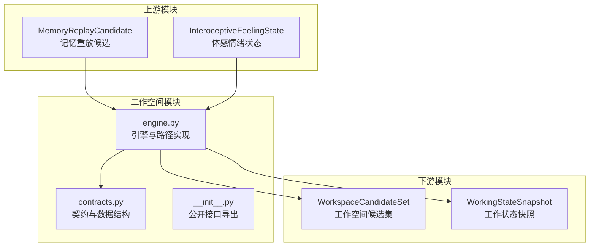
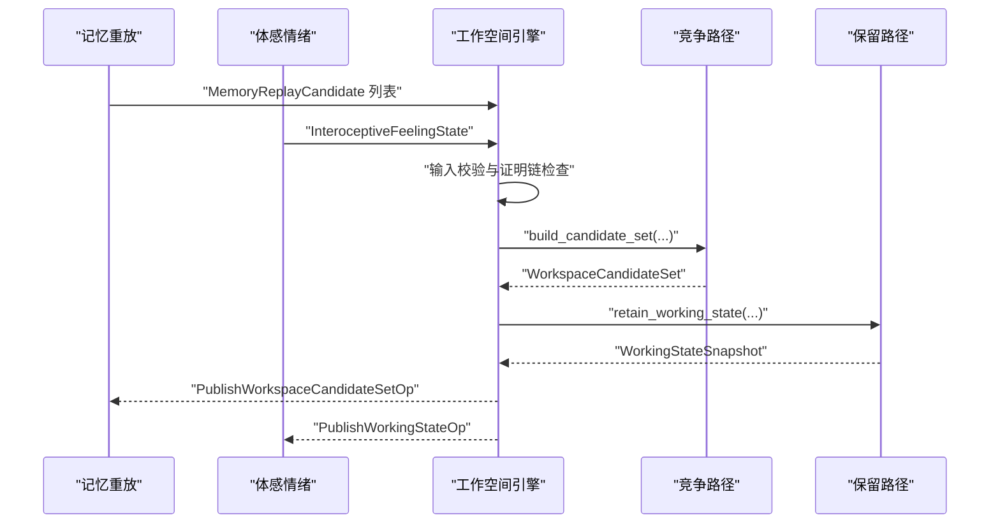
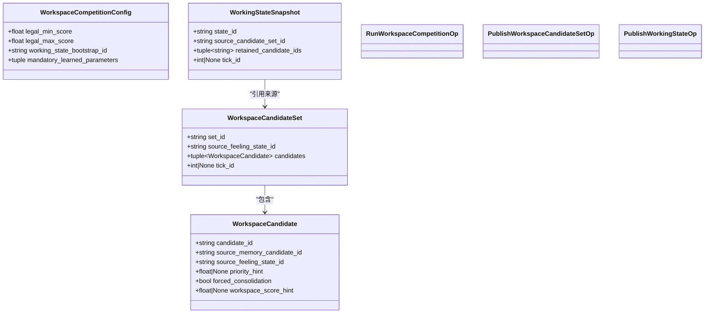
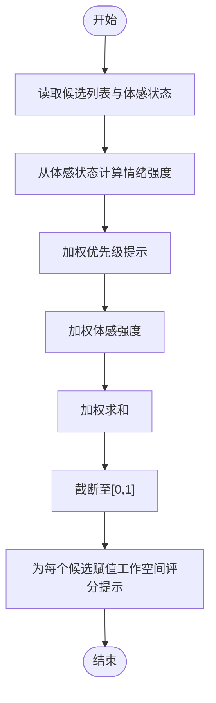
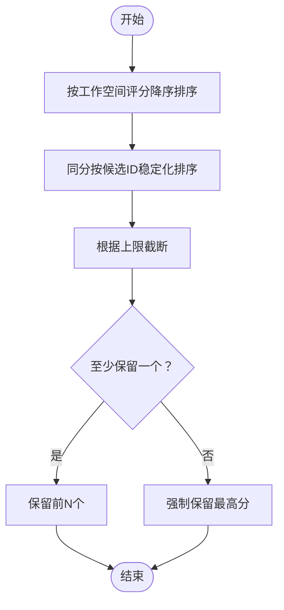
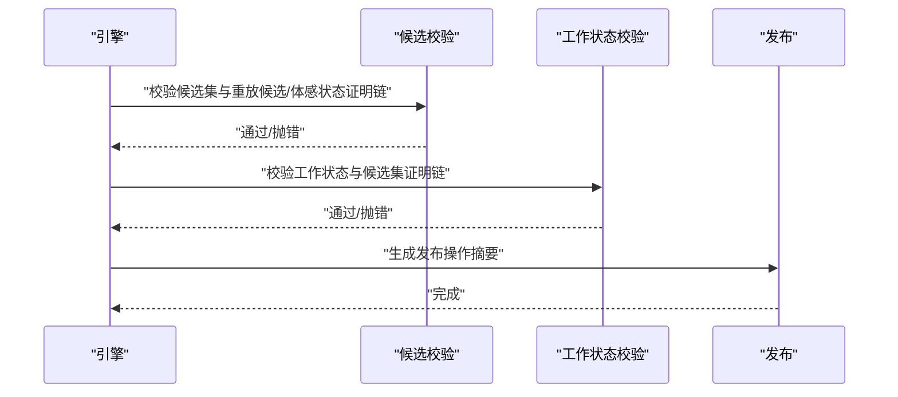
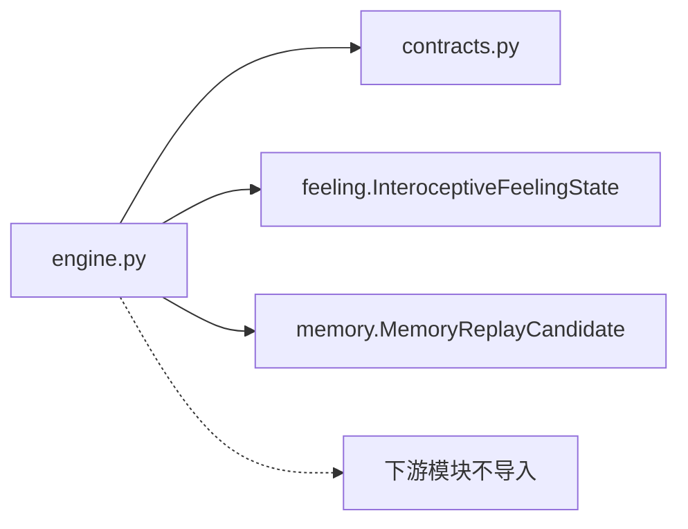

# 工作空间理论

<cite>
**本文引用的文件**
- [engine.py](file://helios_v2/src/helios_v2/workspace/engine.py)
- [contracts.py](file://helios_v2/src/helios_v2/workspace/contracts.py)
- [design.md](file://helios_v2/docs/requirements/07-workspace-competition-and-working-state/design.md)
- [requirement.md](file://helios_v2/docs/requirements/07-workspace-competition-and-working-state/requirement.md)
- [test_workspace_engine.py](file://helios_v2/tests/test_workspace_engine.py)
- [test_workspace_contracts.py](file://helios_v2/tests/test_workspace_contracts.py)
- [__init__.py](file://helios_v2/src/helios_v2/workspace/__init__.py)
</cite>

## 目录
1. [引言](#引言)
2. [项目结构](#项目结构)
3. [核心组件](#核心组件)
4. [架构总览](#架构总览)
5. [详细组件分析](#详细组件分析)
6. [依赖分析](#依赖分析)
7. [性能考量](#性能考量)
8. [故障排查指南](#故障排查指南)
9. [结论](#结论)
10. [附录](#附录)

## 引言
本文件围绕Helios项目中“工作空间理论”的实现与应用展开，系统阐释工作空间的竞争机制、注意力分配算法与思维进程协调方法。工作空间作为连接记忆重放与后续意识报告/行动仲裁的关键层，负责对来自记忆重放的候选内容进行评分与选择，形成短时的“工作状态快照”，并以不可变的候选集形式供后续模块消费。该实现严格遵循“契约优先”的边界设计：不固化永久策略、不直接承担最终意识承诺或动作仲裁，确保可演进性与模块解耦。

## 项目结构
工作空间相关代码位于v2运行时内核的workspace子模块，配套需求文档与测试用例共同定义了边界、数据结构与生命周期。

图表来源
- [engine.py:171-318](file://helios_v2/src/helios_v2/workspace/engine.py#L171-L318)
- [contracts.py:35-163](file://helios_v2/src/helios_v2/workspace/contracts.py#L35-L163)

章节来源
- [design.md:25-63](file://helios_v2/docs/requirements/07-workspace-competition-and-working-state/design.md#L25-L63)
- [requirement.md:13-58](file://helios_v2/docs/requirements/07-workspace-competition-and-working-state/requirement.md#L13-L58)

## 核心组件
- 数据契约与配置
  - WorkspaceCompetitionConfig：声明合法分数范围、工作状态引导ID与强制学习参数类别集合。
  - WorkspaceCandidate/WorkspaceCandidateSet：不可变的候选与候选集，携带来源记忆候选ID、来源体感状态ID、优先级提示、是否强制巩固标志及工作空间评分提示。
  - WorkingStateSnapshot：不可变的短时工作状态快照，记录保留的候选ID集合与来源候选集ID。
  - 运行与发布操作：RunWorkspaceCompetitionOp、PublishWorkspaceCandidateSetOp、PublishWorkingStateOp，用于编排可见性与诊断。
- 引擎与路径
  - WorkspaceCompetitionEngine：对外暴露竞争与发布API；负责输入校验、调用竞争路径与保留路径、输出候选集与工作状态，并进行跨轮次一致性校验。
  - WorkspaceCompetitionPath（协议）：定义构建候选集的可注入路径。
  - WorkingStateRetentionPath（协议）：定义保留工作状态的可注入路径。
- 竞争与保留策略示例
  - SalienceWeightedWorkspaceCompetitionPath：基于“优先级提示”与“体感唤醒/紧张/疼痛加权分量”的加权评分，生成工作空间评分提示。
  - BoundedAttentionRetentionPath：按工作空间评分降序选择上限个候选进入工作状态，保证非空保留且确定性排序。

章节来源
- [contracts.py:35-163](file://helios_v2/src/helios_v2/workspace/contracts.py#L35-L163)
- [engine.py:171-318](file://helios_v2/src/helios_v2/workspace/engine.py#L171-L318)
- [engine.py:327-394](file://helios_v2/src/helios_v2/workspace/engine.py#L327-L394)
- [engine.py:396-449](file://helios_v2/src/helios_v2/workspace/engine.py#L396-L449)

## 架构总览
工作空间在Helios v2中的职责边界清晰：接收记忆重放候选与体感情绪状态，产出不可变候选集与工作状态快照，不参与最终意识承诺或动作仲裁。其生命周期如下：

图表来源
- [engine.py:186-221](file://helios_v2/src/helios_v2/workspace/engine.py#L186-L221)
- [engine.py:327-394](file://helios_v2/src/helios_v2/workspace/engine.py#L327-L394)
- [engine.py:396-449](file://helios_v2/src/helios_v2/workspace/engine.py#L396-L449)

章节来源
- [design.md:45-53](file://helios_v2/docs/requirements/07-workspace-competition-and-working-state/design.md#L45-L53)

## 详细组件分析

### 数据结构与契约
- 不可变性与证明链
  - 候选与候选集必须保留来源记忆候选ID与来源体感状态ID，防止信息丢失。
  - 工作状态仅能保留已发布的候选集中的ID，避免越界引用。
- 分数约束
  - 所有评分提示均被约束在[0,1]区间，确保竞争与保留过程稳定。
- 配置与学习参数
  - 必须声明三类强制学习参数类别：竞争策略、候选保留策略、工作状态更新策略；且合法分数范围需满足单调性。

图表来源
- [contracts.py:35-163](file://helios_v2/src/helios_v2/workspace/contracts.py#L35-L163)

章节来源
- [contracts.py:23-69](file://helios_v2/src/helios_v2/workspace/contracts.py#L23-L69)
- [contracts.py:71-163](file://helios_v2/src/helios_v2/workspace/contracts.py#L71-L163)

### 竞争机制与评分
- 评分输入
  - 来自上游的记忆重放候选包含优先级提示（priority_hint），体感情绪状态包含唤醒、紧张、疼痛等维度。
- 加权评分
  - 使用权重系数对优先级与体感情绪进行线性组合，得到工作空间评分提示；结果经截断到[0,1]。
- 不固化策略
  - 权重与组合方式通过配置类别暴露为“学习参数”，允许后续版本通过学习或运行时初始化调整。

图表来源
- [engine.py:358-393](file://helios_v2/src/helios_v2/workspace/engine.py#L358-L393)

章节来源
- [engine.py:327-394](file://helios_v2/src/helios_v2/workspace/engine.py#L327-L394)
- [design.md:55-63](file://helios_v2/docs/requirements/07-workspace-competition-and-working-state/design.md#L55-L63)

### 注意力分配与容量限制
- 容量上限
  - 通过保留路径设定最大保留数量，当候选数超过上限时，仅保留评分最高的若干候选。
- 排序与确定性
  - 按工作空间评分降序排序；若评分相同，以候选ID作为稳定化断点，确保确定性。
- 非空保留
  - 至少保留一个最高分候选，避免注意力完全丢失。

图表来源
- [engine.py:427-448](file://helios_v2/src/helios_v2/workspace/engine.py#L427-L448)

章节来源
- [engine.py:396-449](file://helios_v2/src/helios_v2/workspace/engine.py#L396-L449)

### 思维进程协调与跨轮次一致性
- 轮次标识
  - 候选集、工作状态与候选ID包含可选的tick_id，便于跨轮次追踪与调试。
- 证明链校验
  - 引擎在输出前后执行严格的证明链校验：候选集来源体感状态一致、来源记忆候选存在、强制巩固标志一致、工作状态仅保留已发布候选等。
- 发布操作
  - 提供请求与发布操作的摘要对象，便于编排可见性与诊断。

图表来源
- [engine.py:45-101](file://helios_v2/src/helios_v2/workspace/engine.py#L45-L101)
- [engine.py:255-318](file://helios_v2/src/helios_v2/workspace/engine.py#L255-L318)

章节来源
- [engine.py:186-221](file://helios_v2/src/helios_v2/workspace/engine.py#L186-L221)
- [engine.py:223-318](file://helios_v2/src/helios_v2/workspace/engine.py#L223-L318)

### 与心理学理论基础的对应
- 工作空间容量与注意选择
  - 通过“保留上限”模拟人类工作记忆的容量瓶颈，结合评分驱动的选择，体现注意的优先性与稳定性。
- 情绪对注意的调制
  - 体感情绪（唤醒/紧张/疼痛）作为竞争因子之一，反映情绪对注意偏向的影响。
- 多源候选的协调
  - 当前版本限定为记忆来源，后续通过“多源工作空间”要求扩展，保持当前边界清晰。

章节来源
- [design.md:145-152](file://helios_v2/docs/requirements/07-workspace-competition-and-working-state/design.md#L145-L152)
- [requirement.md:42-45](file://helios_v2/docs/requirements/07-workspace-competition-and-working-state/requirement.md#L42-L45)

## 依赖分析
- 内部依赖
  - engine依赖contracts中的数据结构与错误类型；依赖feeling与memory模块的输入类型。
- 外部依赖
  - 未导入下游模块（如行动仲裁、身份治理），符合边界约束。
- 可注入路径
  - 竞争与保留路径通过协议注入，降低耦合度，便于后续替换或学习化。

图表来源
- [engine.py:19-33](file://helios_v2/src/helios_v2/workspace/engine.py#L19-L33)

章节来源
- [engine.py:171-318](file://helios_v2/src/helios_v2/workspace/engine.py#L171-L318)
- [requirement.md:72-78](file://helios_v2/docs/requirements/07-workspace-competition-and-working-state/requirement.md#L72-L78)

## 性能考量
- 时间复杂度
  - 评分阶段：O(N)，N为候选数。
  - 排序阶段：O(N log N)。
  - 保留阶段：O(N log N)，受排序主导。
- 空间复杂度
  - 主要为候选集与工作状态快照的存储，规模与N和保留上限成正比。
- 确定性与可重复性
  - 同一输入与配置在相同策略下产生确定性输出，利于调试与回归测试。

## 故障排查指南
- 常见错误类型
  - WorkspaceCompetitionError：输入格式错误、证明链不一致、评分越界、发布对象不完整等。
- 排查步骤
  - 核对上游是否正确生成MemoryReplayCandidate与InteroceptiveFeelingState。
  - 检查配置中的合法分数范围与学习参数类别是否完整。
  - 关注保留路径上限设置是否过小导致候选全部被剔除。
  - 查看发布操作摘要字段，定位具体轮次与来源。
- 测试覆盖
  - 单测应覆盖不可变契约、证明链保留、强制巩固包含、非内存来源排除、请求与发布摘要、错误输入拒绝等场景。

章节来源
- [contracts.py:218-236](file://helios_v2/src/helios_v2/workspace/contracts.py#L218-L236)
- [engine.py:36-101](file://helios_v2/src/helios_v2/workspace/engine.py#L36-L101)
- [test_workspace_engine.py](file://helios_v2/tests/test_workspace_engine.py)
- [test_workspace_contracts.py](file://helios_v2/tests/test_workspace_contracts.py)

## 结论
工作空间在Helios v2中承担了“竞争—保留—发布”的核心职责：以不可变契约与可注入路径实现评分与注意选择，形成短时工作状态快照并向上游下游传递。其设计强调边界清晰、学习化策略与确定性行为，既满足当前需求，又为后续意识报告、多源竞争与身份治理预留扩展空间。

## 附录
- 公开接口导出
  - 通过__init__.py导出工作空间公开表面，供上层模块按需引用。
- 文档与测试
  - 设计文档与需求文档明确了边界、失败模式与可观测性；测试用例验证契约与引擎行为。

章节来源
- [__init__.py](file://helios_v2/src/helios_v2/workspace/__init__.py)
- [design.md:113-119](file://helios_v2/docs/requirements/07-workspace-competition-and-working-state/design.md#L113-L119)
- [requirement.md:80-95](file://helios_v2/docs/requirements/07-workspace-competition-and-working-state/requirement.md#L80-L95)