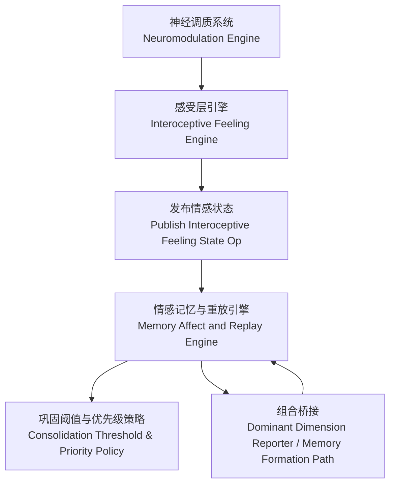
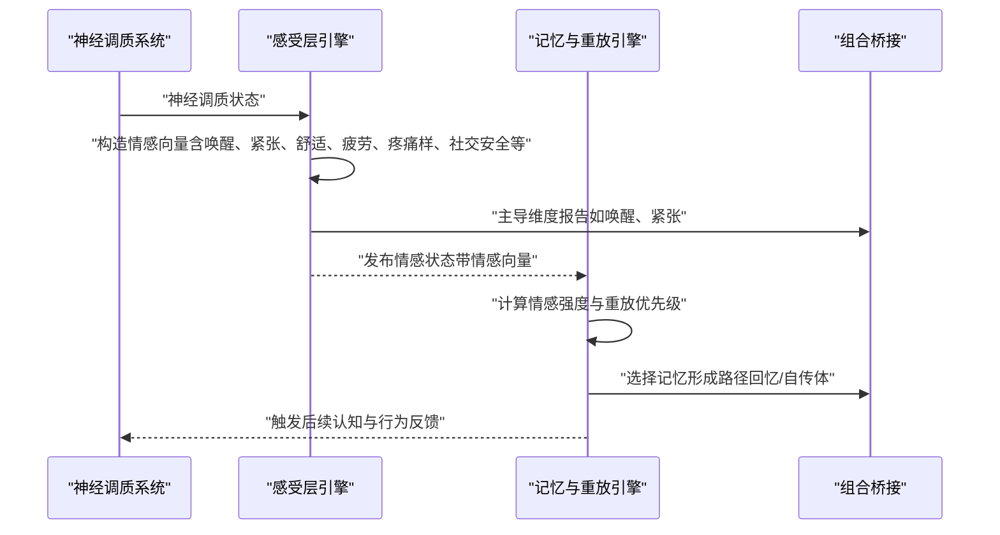
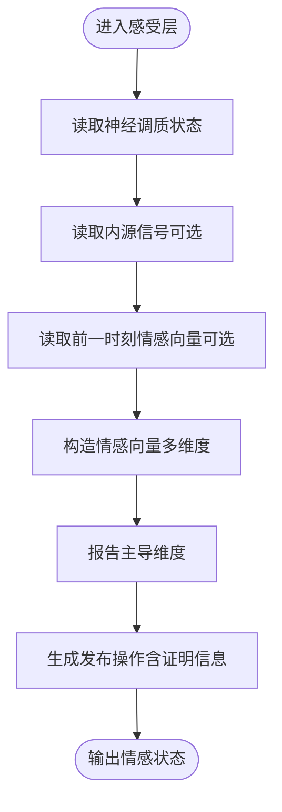
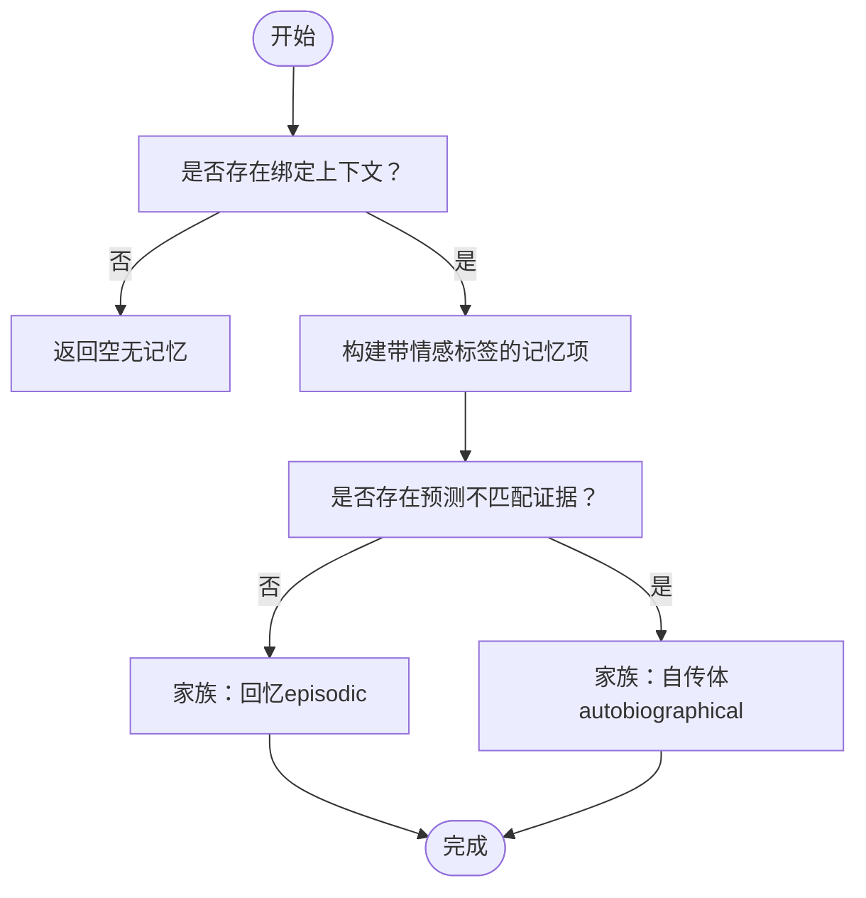
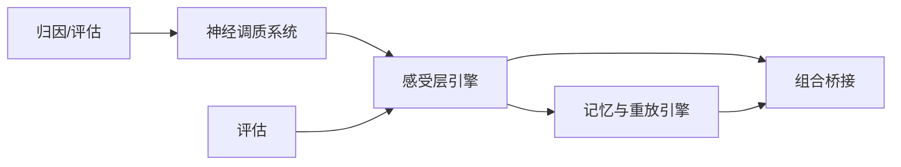

# 情感神经科学

<cite>
**本文引用的文件**
- [helios_v2/src/helios_v2/feeling/engine.py](file://helios_v2/src/helios_v2/feeling/engine.py)
- [helios_v2/src/helios_v2/feeling/contracts.py](file://helios_v2/src/helios_v2/feeling/contracts.py)
- [helios_v2/src/helios_v2/feeling/__init__.py](file://helios_v2/src/helios_v2/feeling/__init__.py)
- [helios_v2/src/helios_v2/memory/engine.py](file://helios_v2/src/helios_v2/memory/engine.py)
- [helios_v2/src/helios_v2/composition/bridges.py](file://helios_v2/src/helios_v2/composition/bridges.py)
- [helios_v2/tests/test_interoceptive_feeling_engine.py](file://helios_v2/tests/test_interoceptive_feeling_engine.py)
- [helios_v2/tests/test_memory_engine.py](file://helios_v2/tests/test_memory_engine.py)
- [helios_v2/tests/test_runtime_stage_chain.py](file://helios_v2/tests/test_runtime_stage_chain.py)
- [archive/helios_v1/regulation/regulation.py](file://archive/helios_v1/regulation/regulation.py)
- [archive/helios_v1/neurochem.py](file://archive/helios_v1/neurochem.py)
</cite>

## 目录
1. [引言](#引言)
2. [项目结构](#项目结构)
3. [核心组件](#核心组件)
4. [架构总览](#架构总览)
5. [详细组件分析](#详细组件分析)
6. [依赖分析](#依赖分析)
7. [性能考虑](#性能考虑)
8. [故障排除指南](#故障排除指南)
9. [结论](#结论)
10. [附录](#附录)

## 引言
本文件面向Helios v2中“情感神经科学”主题的技术文档，聚焦于以下目标：
- 解释情感状态的建模方法与主观感受层（interoceptive feeling）的实现机制
- 阐述情感记忆的形成与巩固过程，以及与预测不匹配的关系
- 建立情感与认知、记忆、行为之间的相互作用关系
- 在计算模型中体现情感调节的神经生物学基础：情感强度、情感极性（valence）、情感持续性（持久性）
- 提供情感状态表示方法与情感变化的计算公式路径
- 结合Helios现有实现，给出可操作的工程化建议与最佳实践

## 项目结构
Helios v2将情感系统划分为多个层次与模块：
- 感受层（Interoceptive Feeling Layer）：负责从神经调质状态到主观情感向量的映射与发布
- 记忆层（Memory Affect and Replay）：负责情感相关的记忆形成、检索与巩固
- 组合桥接（Composition Bridges）：定义主导维度报告与记忆形成路径等契约
- 神经调质系统（Neuromodulation）：驱动多巴胺、去甲肾上腺素、血清素等的双时间尺度动态
- 归因与评估（Appraisal/Evaluation）：对刺激进行快速归因与后续评估
- 行为外部化（Action Externalization）：将内部状态转化为外显行为

图表来源
- [helios_v2/src/helios_v2/feeling/engine.py:209-239](file://helios_v2/src/helios_v2/feeling/engine.py#L209-L239)
- [helios_v2/src/helios_v2/memory/engine.py:505-535](file://helios_v2/src/helios_v2/memory/engine.py#L505-L535)
- [helios_v2/src/helios_v2/composition/bridges.py:550-585](file://helios_v2/src/helios_v2/composition/bridges.py#L550-L585)

章节来源
- [helios_v2/src/helios_v2/feeling/__init__.py:1-50](file://helios_v2/src/helios_v2/feeling/__init__.py#L1-L50)

## 核心组件
- 感受层引擎（InteroceptiveFeelingEngine）
  - 负责将神经调质状态转换为主观情感向量，并生成发布操作
  - 支持多种构建路径：基于神经调质、内源信号与持久化路径
- 情感记忆与重放引擎（Memory Affect and Replay Engine）
  - 将情感状态与绑定上下文结合，形成带情感标签的记忆项
  - 基于情感强度与预测不匹配度计算重放候选与巩固概率
- 组合桥接（Composition Bridges）
  - 主导维度报告器：确定当前占优的情感维度（如唤醒、紧张）
  - 记忆形成路径：根据是否出现预测不匹配决定记忆家族（如回忆/自传体）

章节来源
- [helios_v2/src/helios_v2/feeling/engine.py:209-239](file://helios_v2/src/helios_v2/feeling/engine.py#L209-L239)
- [helios_v2/src/helios_v2/memory/engine.py:335-368](file://helios_v2/src/helios_v2/memory/engine.py#L335-L368)
- [helios_v2/src/helios_v2/composition/bridges.py:550-585](file://helios_v2/src/helios_v2/composition/bridges.py#L550-L585)

## 架构总览
情感系统以“神经调质状态”为输入，通过感受层生成“主观情感向量”，随后由记忆层进行情感记忆的形成与重放，最终影响后续的认知与行为决策。

图表来源
- [helios_v2/src/helios_v2/feeling/engine.py:209-239](file://helios_v2/src/helios_v2/feeling/engine.py#L209-L239)
- [helios_v2/src/helios_v2/memory/engine.py:505-535](file://helios_v2/src/helios_v2/memory/engine.py#L505-L535)
- [helios_v2/src/helios_v2/composition/bridges.py:550-585](file://helios_v2/src/helios_v2/composition/bridges.py#L550-L585)

## 详细组件分析

### 感受层：情感向量的构造与发布
- 输入
  - 神经调质状态（多递质水平）
  - 可选内源信号（如呼吸浅表等）
  - 可选前一时刻情感向量（用于双时间尺度整合）
- 输出
  - 情感状态对象（包含情感向量与来源证明）
  - 发布操作（用于编排与可观测性）
- 关键点
  - 情感向量包含：效价（valence）、唤醒（arousal）、紧张（tension）、舒适（comfort）、疲劳（fatigue）、疼痛样（pain_like）、社交安全（social_safety）
  - 主导维度报告器可注入，用于标识当前占优的情感维度
  - 发布操作包含来源证明与内部信号计数，便于追踪

图表来源
- [helios_v2/src/helios_v2/feeling/contracts.py:189-258](file://helios_v2/src/helios_v2/feeling/contracts.py#L189-L258)
- [helios_v2/src/helios_v2/feeling/engine.py:209-239](file://helios_v2/src/helios_v2/feeling/engine.py#L209-L239)

章节来源
- [helios_v2/src/helios_v2/feeling/contracts.py:189-258](file://helios_v2/src/helios_v2/feeling/contracts.py#L189-L258)
- [helios_v2/src/helios_v2/feeling/engine.py:209-239](file://helios_v2/src/helios_v2/feeling/engine.py#L209-L239)
- [helios_v2/tests/test_interoceptive_feeling_engine.py:46-89](file://helios_v2/tests/test_interoceptive_feeling_engine.py#L46-L89)

### 情感记忆：形成、重放与巩固
- 记忆形成
  - 输入：情感状态、绑定上下文、可选预测不匹配证据
  - 规则：无不匹配→回忆型；有不匹配→自传体型
  - 输出：带情感标签的记忆项（包含来源情感状态ID与绑定上下文ID）
- 重放与巩固
  - 情感强度 = clamp_unit(α·唤醒 + β·紧张 + γ·疼痛样)
  - 不匹配得分 = mismatch_score（若存在）
  - 重放显著度 = max(情感强度, 不匹配得分)
  - 若显著度 ≥ 巩固阈值，则强制巩固并给出原因列表
- 优先级策略
  - 基于情感强度与不匹配项的加权求和，结合配置参数进行排序

图表来源
- [helios_v2/src/helios_v2/composition/bridges.py:561-585](file://helios_v2/src/helios_v2/composition/bridges.py#L561-L585)
- [helios_v2/src/helios_v2/memory/engine.py:335-368](file://helios_v2/src/helios_v2/memory/engine.py#L335-L368)
- [helios_v2/src/helios_v2/memory/engine.py:505-535](file://helios_v2/src/helios_v2/memory/engine.py#L505-L535)

章节来源
- [helios_v2/src/helios_v2/memory/engine.py:335-368](file://helios_v2/src/helios_v2/memory/engine.py#L335-L368)
- [helios_v2/src/helios_v2/memory/engine.py:505-535](file://helios_v2/src/helios_v2/memory/engine.py#L505-L535)
- [helios_v2/tests/test_memory_engine.py:124-541](file://helios_v2/tests/test_memory_engine.py#L124-L541)

### 主导维度报告与记忆形成路径
- 主导维度报告器
  - 注入式接口，用于标识当前占优维度（如唤醒、紧张）
  - 在测试中固定返回占优维度元组，便于验证流程
- 记忆形成路径
  - 第一版路径：在有绑定上下文时，形成回忆型记忆项
  - 归因路径：在存在不匹配证据时，形成自传体记忆项

章节来源
- [helios_v2/src/helios_v2/composition/bridges.py:550-585](file://helios_v2/src/helios_v2/composition/bridges.py#L550-L585)
- [helios_v2/tests/test_runtime_stage_chain.py:341-382](file://helios_v2/tests/test_runtime_stage_chain.py#L341-L382)

### 神经调质与情感调节的神经生物学基础
- 双时间尺度动态
  - 神经调质系统采用双时间尺度更新：瞬态（phasics）与稳态（tonic）
  - 冷启动时，瞬态从基线出发，逐步向驱动值收敛；随后稳态缓慢回归基线
- 参数调制
  - 多递质对同一参数的调制通过叠加调制图谱实现
  - 最终调制结果为基础值乘以(1 + Σ dev_i × sensitivity_i)
- 情感调节记忆（v1）
  - 基于行为-情感-Δvalence/Δactivation的学习记忆结构
  - 学习后记录Δvalence与Δactivation，并持久化存储

章节来源
- [helios_v2/tests/test_neuromodulator_engine.py:328-361](file://helios_v2/tests/test_neuromodulator_engine.py#L328-L361)
- [archive/helios_v1/neurochem.py:355-390](file://archive/helios_v1/neurochem.py#L355-L390)
- [archive/helios_v1/regulation/regulation.py:493-524](file://archive/helios_v1/regulation/regulation.py#L493-L524)

## 依赖分析
- 感受层依赖神经调质系统提供的状态快照，并通过发布操作暴露给上层
- 记忆层依赖情感状态与绑定上下文，同时利用预测不匹配证据决定记忆家族
- 组合桥接作为契约层，解耦主导维度报告与记忆形成策略
- 神经调质系统与归因/评估共同驱动情感状态的生成与调节

图表来源
- [helios_v2/src/helios_v2/feeling/engine.py:209-239](file://helios_v2/src/helios_v2/feeling/engine.py#L209-L239)
- [helios_v2/src/helios_v2/memory/engine.py:505-535](file://helios_v2/src/helios_v2/memory/engine.py#L505-L535)
- [helios_v2/src/helios_v2/composition/bridges.py:550-585](file://helios_v2/src/helios_v2/composition/bridges.py#L550-L585)

## 性能考虑
- 情感强度计算采用分量加权与单位夹紧，避免极端值导致的不稳定
- 重放显著度比较与强制巩固阈值控制了不必要的重放与写回开销
- 可注入的主导维度报告器与记忆形成路径允许在运行时切换策略，降低耦合
- 建议
  - 对情感向量与不匹配证据进行缓存与批处理，减少重复计算
  - 将权重与阈值参数化为可学习或可校准的参数，提升适应性

## 故障排除指南
- 情感状态发布失败
  - 检查情感状态的来源证明字段是否完整
  - 确认主导维度报告器返回合法维度元组
- 记忆形成为空
  - 确认绑定上下文非空；若存在预测不匹配证据，应形成自传体记忆
- 重放优先级异常
  - 校验情感强度与不匹配得分的权重与阈值设置
  - 检查情感向量各分量是否在合法范围内

章节来源
- [helios_v2/src/helios_v2/feeling/engine.py:209-239](file://helios_v2/src/helios_v2/feeling/engine.py#L209-L239)
- [helios_v2/src/helios_v2/memory/engine.py:335-368](file://helios_v2/src/helios_v2/memory/engine.py#L335-L368)
- [helios_v2/tests/test_memory_engine.py:124-541](file://helios_v2/tests/test_memory_engine.py#L124-L541)

## 结论
Helios v2在情感神经科学方面建立了清晰的分层架构：以神经调质为基础，通过感受层生成主观情感向量，再由记忆层实现情感记忆的形成与巩固，并通过组合桥接实现策略的可插拔性。该设计既体现了情感强度、极性与持续性的建模思路，又为情感与认知、记忆、行为的交互提供了工程化的实现路径。未来可在参数学习、跨模态信号融合与长期稳定性方面进一步优化。

## 附录
- 情感状态表示方法
  - 向量维度：效价（valence）、唤醒（arousal）、紧张（tension）、舒适（comfort）、疲劳（fatigue）、疼痛样（pain_like）、社交安全（social_safety）
  - 表示形式：InteroceptiveFeelingVector
- 情感变化与巩固公式路径
  - 情感强度：clamp_unit(α·唤醒 + β·紧张 + γ·疼痛样)
  - 重放显著度：max(情感强度, 不匹配得分)
  - 巩固条件：显著度 ≥ 巩固阈值
- 应用实践建议
  - 使用测试用例中的固定构造路径与断言，确保情感状态与记忆形成的一致性
  - 在评估阶段引入情感状态的可观测性指标，辅助诊断与改进