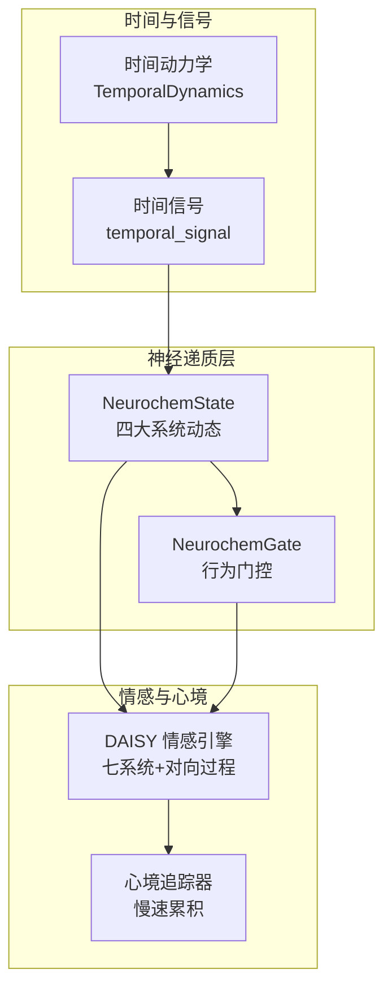
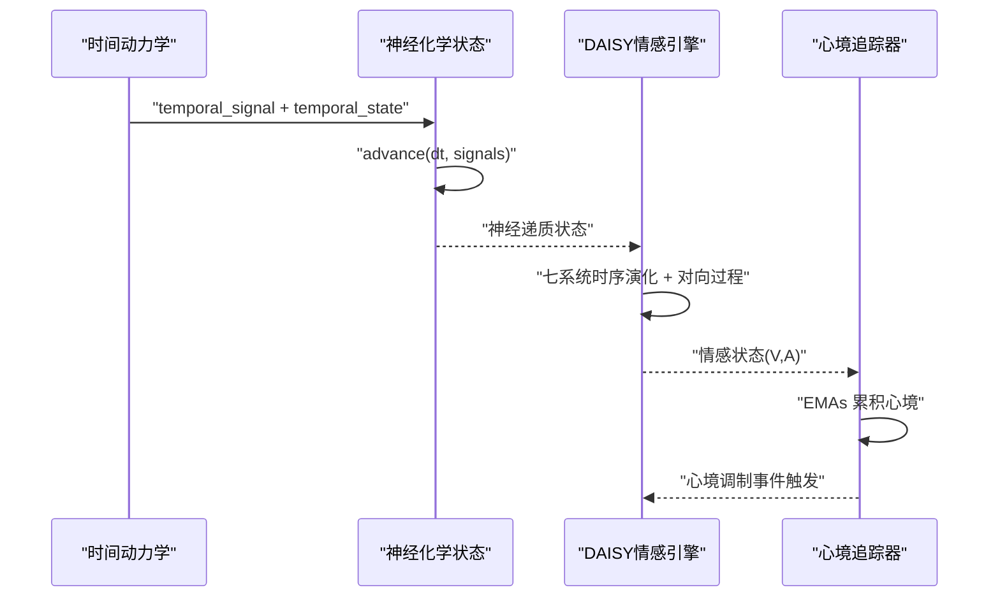
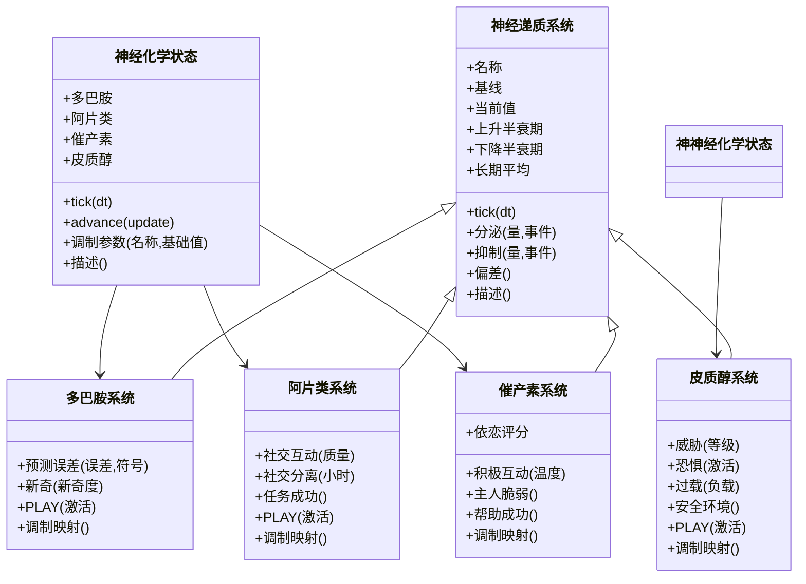
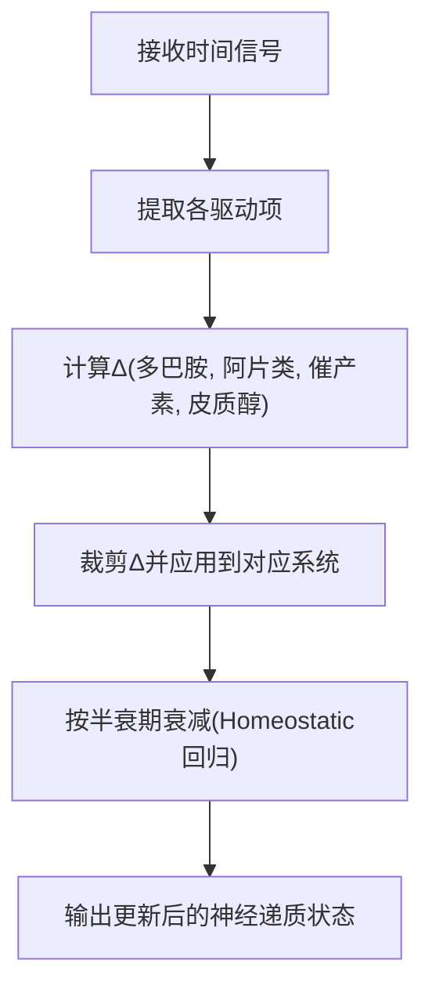
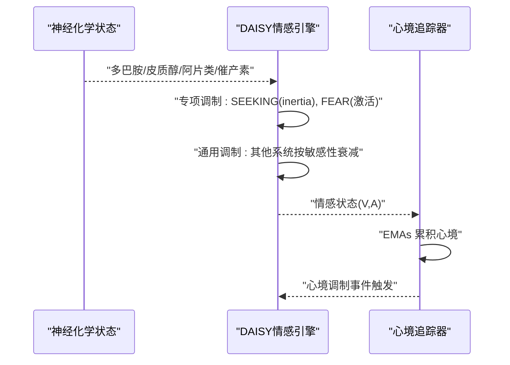
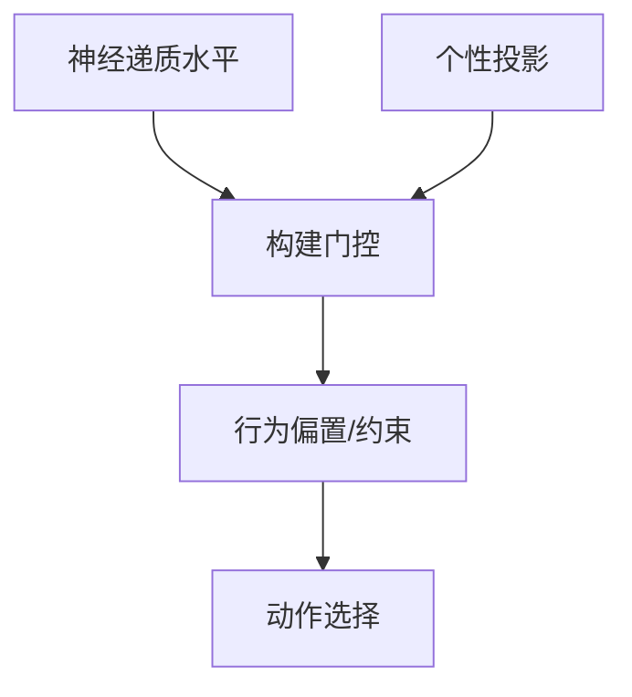
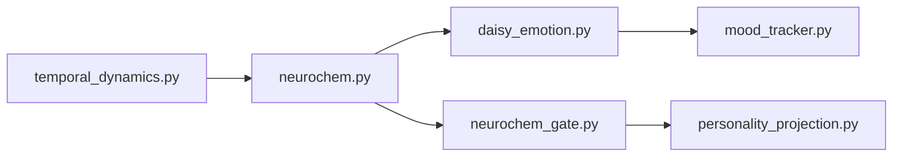

# 神经递质系统

<cite>
**本文引用的文件**
- [neurochem.py](file://archive/helios_v1/neurochem.py)
- [neurochem_gate.py](file://archive/helios_v1/neurochem_gate.py)
- [daisy_emotion.py](file://archive/helios_v1/daisy_emotion.py)
- [mood_tracker.py](file://archive/helios_v1/mood_tracker.py)
- [test_temporal_neurochem_integration.py](file://archive/helios_v1/tests/test_temporal_neurochem_integration.py)
- [test_neurochem_daisy_integration.py](file://archive/helios_v1/tests/test_neurochem_daisy_integration.py)
</cite>

## 目录
1. [引言](#引言)
2. [项目结构](#项目结构)
3. [核心组件](#核心组件)
4. [架构总览](#架构总览)
5. [详细组件分析](#详细组件分析)
6. [依赖关系分析](#依赖关系分析)
7. [性能考量](#性能考量)
8. [故障排查指南](#故障排查指南)
9. [结论](#结论)
10. [附录](#附录)

## 引言
本文件面向Helios项目的神经递质系统，围绕多巴胺、血清素（内源性阿片类）、催产素与皮质醇四大神经调质，系统阐述其建模方式、动态调节机制与跨时间尺度的异稳态（allostasis）动力学。文档重点说明：
- 神经递质如何通过瞬时相（快速变化）与持续相（长期漂移）共同驱动情感状态、注意力分配与行为动机；
- 神经递质与DAISY情感引擎、心境追踪器以及交互门控之间的耦合路径；
- 数学模型与算法实现要点，以及在认知处理、情感体验与记忆形成中的协同作用。

## 项目结构
神经递质系统位于archive/helios_v1目录下，核心文件包括：
- neurochem.py：四大神经调质的动态模型、参数调制与事件触发映射；
- neurochem_gate.py：基于神经递质状态的行为倾向与动作约束门控；
- daisy_emotion.py：DAISY情感引擎，集成Panksepp七系统、对向过程与时序动力学；
- mood_tracker.py：心境追踪器，模拟心境对情感与行为的慢速调制；
- tests目录下的相关集成测试，验证时间动力学与神经递质联动。

图示来源
- [neurochem.py:281-420](file://archive/helios_v1/neurochem.py#L281-L420)
- [neurochem_gate.py:52-200](file://archive/helios_v1/neurochem_gate.py#L52-L200)
- [daisy_emotion.py:299-465](file://archive/helios_v1/daisy_emotion.py#L299-L465)
- [mood_tracker.py:106-239](file://archive/helios_v1/mood_tracker.py#L106-L239)

章节来源
- [neurochem.py:1-620](file://archive/helios_v1/neurochem.py#L1-L620)
- [neurochem_gate.py:1-200](file://archive/helios_v1/neurochem_gate.py#L1-L200)
- [daisy_emotion.py:1-565](file://archive/helios_v1/daisy_emotion.py#L1-L565)
- [mood_tracker.py:1-239](file://archive/helios_v1/mood_tracker.py#L1-L239)

## 核心组件
- 神经递质系统（NeurotransmitterSystem）：抽象基类，定义升/降半衰期、长期平均、事件触发与状态描述。
- 四大系统：
  - 多巴胺系统（DopamineSystem）：奖励预测误差、新奇与动机相关；
  - 阿片类系统（OpioidSystem）：满足感、社交连接与恢复；
  - 催产素系统（OxytocinSystem）：信任、依恋与照顾动机；
  - 皮质醇系统（CortisolSystem）：应激、警觉与注意力窄化。
- 神经化学状态（NeurochemState）：协调四大系统的时间推进与事件/时间信号驱动的增量更新。
- 神经递质门控（NeurochemGate）：将神经递质与行为倾向、动作约束映射，支持个性投影影响。
- DAISY情感引擎（DaisySystemEngine）：七系统共激活、对向过程与异稳态调节的综合情感模型。
- 心境追踪器（MoodTracker）：慢变量的心境累积与对情感事件的调制。

章节来源
- [neurochem.py:25-275](file://archive/helios_v1/neurochem.py#L25-L275)
- [neurochem.py:281-420](file://archive/helios_v1/neurochem.py#L281-L420)
- [neurochem_gate.py:25-200](file://archive/helios_v1/neurochem_gate.py#L25-L200)
- [daisy_emotion.py:299-465](file://archive/helios_v1/daisy_emotion.py#L299-L465)
- [mood_tracker.py:106-239](file://archive/helios_v1/mood_tracker.py#L106-L239)

## 架构总览
神经递质系统采用“时间动力学驱动 + 神经递质状态更新 + 情感引擎与心境追踪”的分层架构。时间信号（如刺激驱动力、新奇驱动力、社会驱动力、压力负荷、恢复偏向等）作为输入，驱动NeurochemState的增量更新；随后，神经递质状态通过DAISY引擎调制各情感系统的激活轨迹，并由心境追踪器进行慢变量累积与反馈。

图示来源
- [neurochem.py:303-359](file://archive/helios_v1/neurochem.py#L303-L359)
- [daisy_emotion.py:337-465](file://archive/helios_v1/daisy_emotion.py#L337-L465)
- [mood_tracker.py:135-222](file://archive/helios_v1/mood_tracker.py#L135-L222)

## 详细组件分析

### 神经递质系统与动态建模
- 基础动态：每个系统以基线为中心，遵循升/降半衰期的Homeostatic回归；并维护长期平均用于基线漂移。
- 瞬时相：事件触发（分泌/抑制）带来快速波动；随后按半衰期衰减。
- 持续相：长期平均缓慢变化，反映异稳态漂移与适应。
- 参数调制：NeurochemState提供统一的调制接口，将四种调质对目标参数的贡献合并。

图示来源
- [neurochem.py:25-275](file://archive/helios_v1/neurochem.py#L25-L275)
- [neurochem.py:281-420](file://archive/helios_v1/neurochem.py#L281-L420)

章节来源
- [neurochem.py:25-275](file://archive/helios_v1/neurochem.py#L25-L275)
- [neurochem.py:281-420](file://archive/helios_v1/neurochem.py#L281-L420)

### 时间信号驱动的神经递质更新
- 输入信号：刺激驱动力、新奇驱动力、社会驱动力、压力负荷、恢复偏向、隔离压力、安全信号、唤醒、效价等。
- 更新规则：对每种调质计算Δ（正向分泌或负向抑制），并施加上限裁剪，随后按系统特性进行分泌/抑制。
- 时间推进：先执行Homeostatic衰减，再叠加Δ，确保瞬时相与持续相的协同。

图示来源
- [neurochem.py:303-359](file://archive/helios_v1/neurochem.py#L303-L359)

章节来源
- [neurochem.py:303-359](file://archive/helios_v1/neurochem.py#L303-L359)

### 神经递质与情感引擎的耦合
- DAISY引擎对七系统分别建模时序动态与对向过程，结合心境追踪器与异稳态调节器，生成Valence-Arousal状态与主导系统标签。
- 神经递质对情感系统进行专项与通用调制：
  - 多巴胺提升SEEKING的持久性（降低衰减速率）；
  - 皮质醇提高FEAR的激活；
  - 其他系统按敏感性对相应情感系统产生衰减调制。

图示来源
- [daisy_emotion.py:466-520](file://archive/helios_v1/daisy_emotion.py#L466-L520)
- [mood_tracker.py:135-222](file://archive/helios_v1/mood_tracker.py#L135-L222)

章节来源
- [daisy_emotion.py:466-520](file://archive/helios_v1/daisy_emotion.py#L466-L520)
- [mood_tracker.py:135-222](file://archive/helios_v1/mood_tracker.py#L135-L222)

### 神经递质门控与行为动机
- 门控将神经递质水平与行为倾向（社交亲和、主动性、探索性、谨慎性、安抚性）映射，形成动作偏置与约束。
- 支持个性投影（如社交启动、新奇偏好、风险容忍、表达性）对门控的调节，体现个体差异。

图示来源
- [neurochem_gate.py:52-200](file://archive/helios_v1/neurochem_gate.py#L52-L200)

章节来源
- [neurochem_gate.py:52-200](file://archive/helios_v1/neurochem_gate.py#L52-L200)

### 心境追踪器与慢变量调制
- 心境以指数滑动平均（EMA）从情感状态累积而来，具有较慢的时间常数，从而对事件感知与情感触发产生慢变量调制。
- 心境对正/负向情感系统产生不同的放大或抑制效果，同时叠加唤醒对紧迫感的调制。

章节来源
- [mood_tracker.py:106-239](file://archive/helios_v1/mood_tracker.py#L106-L239)

### 双时间尺度动力学与异稳态
- 瞬时相：由事件触发与时间衰减主导，体现快速情感波动与短期动机变化；
- 持续相：由Homeostatic漂移与长期平均主导，体现异稳态的长期调节与适应。
- 时间动力学模块（TemporalDynamics）提供时间信号，驱动神经递质的advance流程，测试表明安静恢复偏向能降低奖励与应激基调。

章节来源
- [neurochem.py:292-302](file://archive/helios_v1/neurochem.py#L292-L302)
- [test_temporal_neurochem_integration.py:15-44](file://archive/helios_v1/tests/test_temporal_neurochem_integration.py#L15-L44)

## 依赖关系分析
- 神经递质系统依赖utils.clamp进行数值裁剪；
- 情感引擎依赖心境追踪器与异稳态调节器（通过传入对象）；
- 门控依赖个性投影解析；
- 测试文件验证时间动力学与神经递质联动。

图示来源
- [neurochem.py:577](file://archive/helios_v1/neurochem.py#L577)
- [neurochem_gate.py:8](file://archive/helios_v1/neurochem_gate.py#L8)
- [daisy_emotion.py:327](file://archive/helios_v1/daisy_emotion.py#L327)

章节来源
- [neurochem.py:577](file://archive/helios_v1/neurochem.py#L577)
- [neurochem_gate.py:8](file://archive/helios_v1/neurochem_gate.py#L8)
- [daisy_emotion.py:327](file://archive/helios_v1/daisy_emotion.py#L327)

## 性能考量
- 时间步长与半衰期：系统采用显式欧拉近似与半衰期参数控制衰减速率，建议在高频tick场景下保持稳定的dt与合理的半衰期，避免数值不稳定。
- Δ裁剪：在advance中对Δ进行上限裁剪，防止过度波动；建议根据实际信号范围调整裁剪阈值。
- 事件触发：事件强度与系统敏感性相乘后参与Δ计算，注意避免过大的触发导致系统饱和。
- 心境累积：EMA的β参数决定慢变量响应速度，需与情感时间常数匹配，避免心境滞后或超前。

## 故障排查指南
- 神经递质异常波动
  - 检查时间步长与半衰期是否合理；
  - 确认Δ裁剪是否生效；
  - 核对事件触发映射是否正确。
- 情感系统不收敛
  - 检查DAISY引擎的专项与通用调制是否按预期；
  - 确认心境追踪器的EMA参数与情感状态一致性。
- 行为门控异常
  - 检查神经递质水平与个性投影输入；
  - 确认门控约束条件与动作偏置计算。

章节来源
- [neurochem.py:361-367](file://archive/helios_v1/neurochem.py#L361-L367)
- [daisy_emotion.py:466-520](file://archive/helios_v1/daisy_emotion.py#L466-L520)
- [neurochem_gate.py:151-155](file://archive/helios_v1/neurochem_gate.py#L151-L155)

## 结论
Helios的神经递质系统通过四大调质的双时间尺度动态，实现了对情感状态、注意力与动机的精细建模。时间动力学提供驱动信号，神经递质状态在DAISY引擎中转化为情感体验，并由心境追踪器形成慢变量反馈。该框架既具备神经科学理论基础，又在实现层面提供了可扩展的门控与调制接口，便于与认知处理、记忆形成等模块进一步耦合。

## 附录
- 数学要点
  - Homeostatic回归：以基线为目标的指数衰减；
  - 对向过程：a-process（快速）与b-process（延迟）的双重效应；
  - 心境累积：EMA形式的心境更新；
  - 门控映射：线性组合神经递质与个性因素，生成行为偏置与约束。