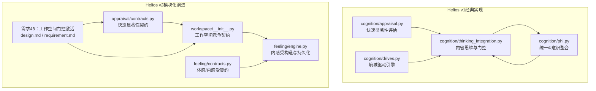
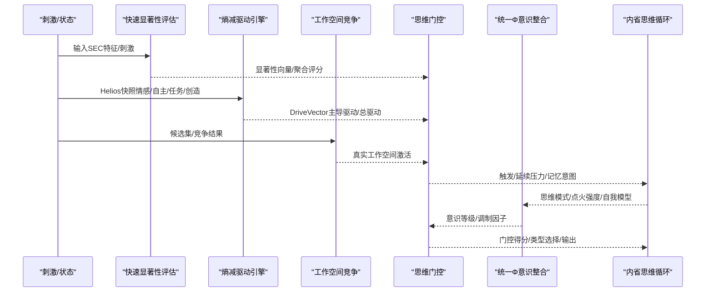
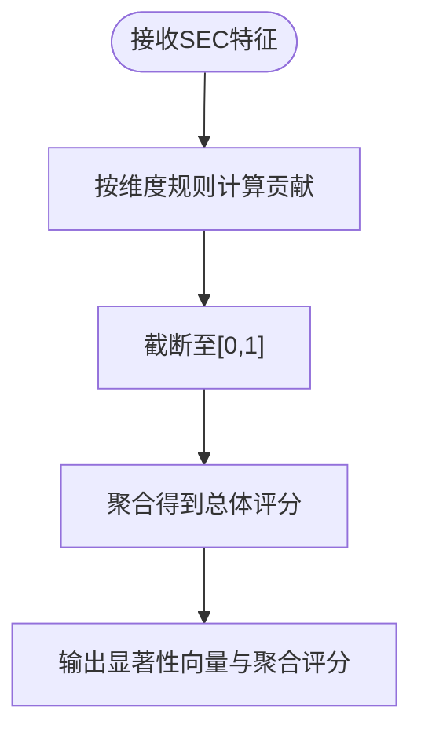
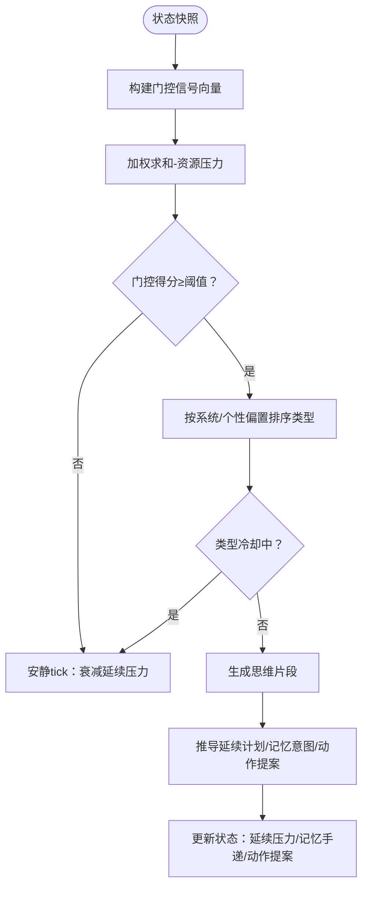
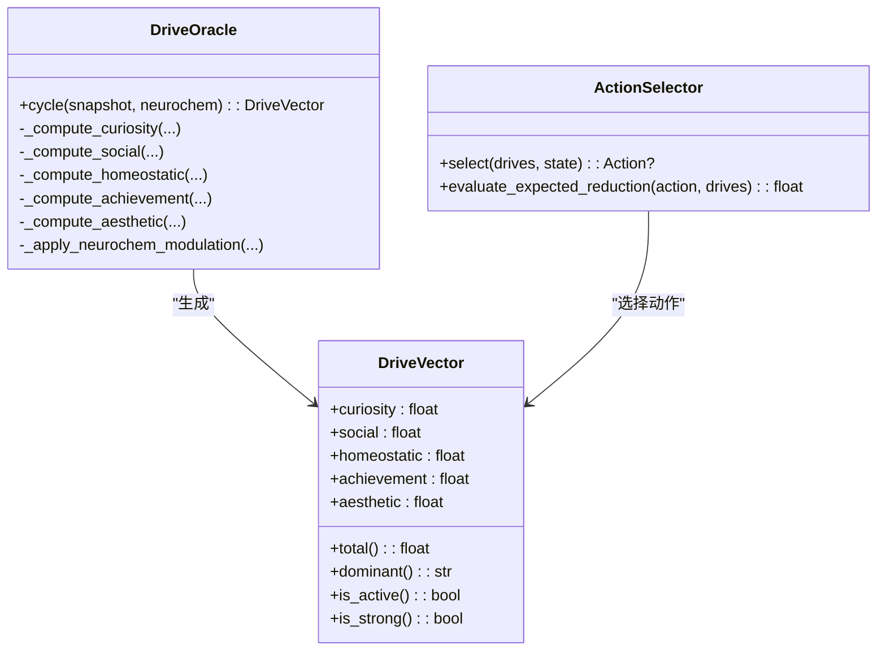
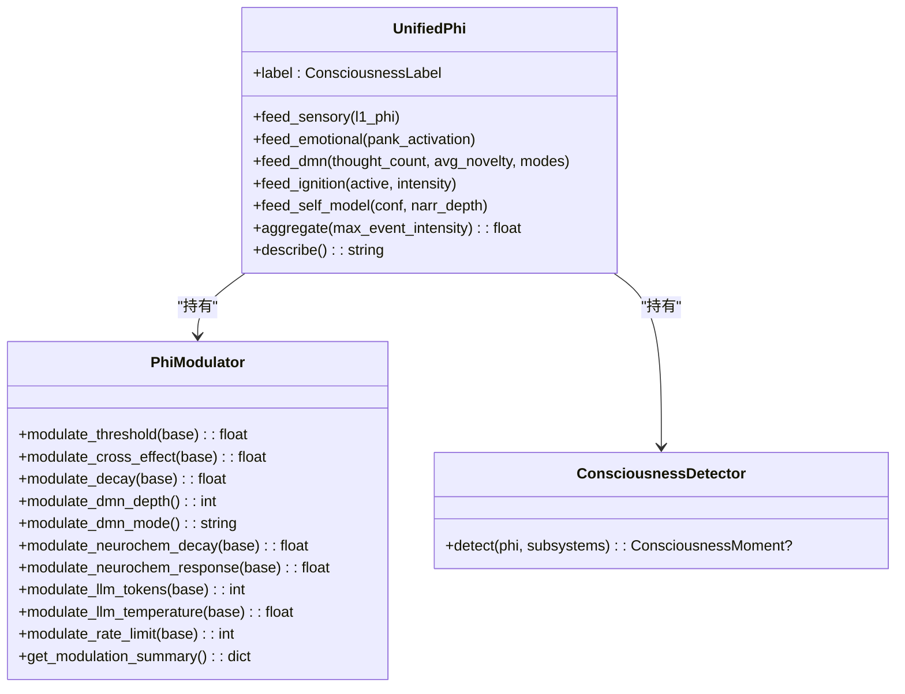
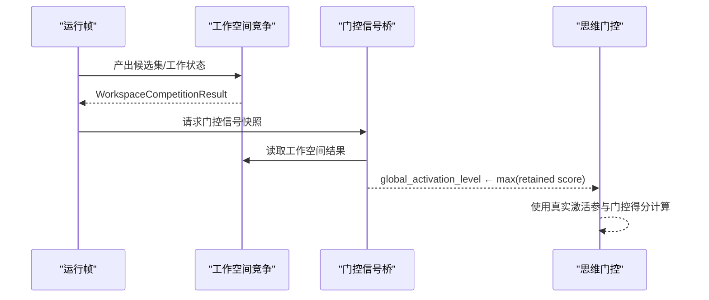
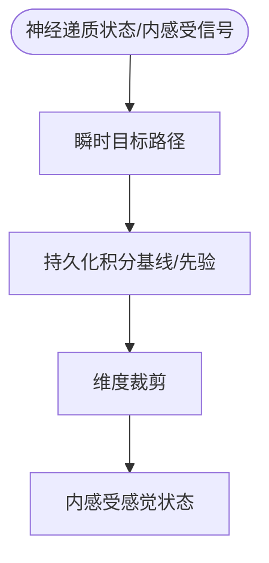
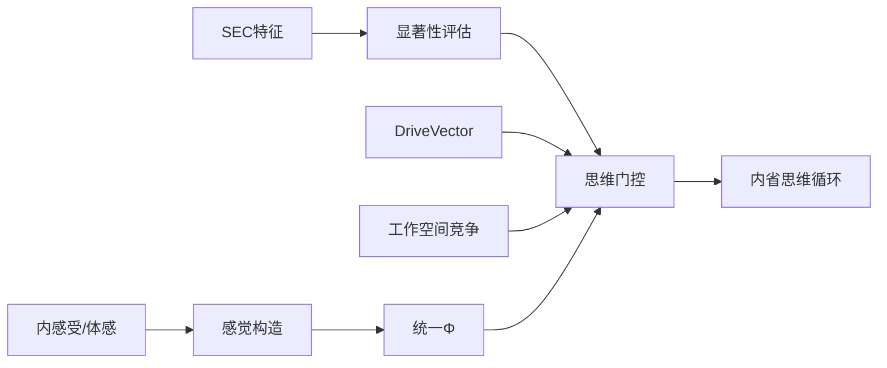

# 认知理论基础

<cite>
**本文引用的文件**   
- [appraisal.py](file://archive/helios_v1/cognition/appraisal.py)
- [thinking_integration.py](file://archive/helios_v1/cognition/thinking_integration.py)
- [drives.py](file://archive/helios_v1/cognition/drives.py)
- [phi.py](file://archive/helios_v1/cognition/phi.py)
- [design.md](file://helios_v2/docs/requirements/48-workspace-grounded-gate-activation/design.md)
- [requirement.md](file://helios_v2/docs/requirements/48-workspace-grounded-gate-activation/requirement.md)
- [workspace/__init__.py](file://helios_v2/src/helios_v2/workspace/__init__.py)
- [feeling/contracts.py](file://helios_v2/src/helios_v2/feeling/contracts.py)
- [feeling/engine.py](file://helios_v2/src/helios_v2/feeling/engine.py)
- [appraisal/contracts.py](file://helios_v2/src/helios_v2/appraisal/contracts.py)
</cite>

## 目录
1. [引言](#引言)
2. [项目结构](#项目结构)
3. [核心组件](#核心组件)
4. [架构总览](#架构总览)
5. [详细组件分析](#详细组件分析)
6. [依赖关系分析](#依赖关系分析)
7. [性能考量](#性能考量)
8. [故障排查指南](#故障排查指南)
9. [结论](#结论)
10. [附录](#附录)

## 引言
本文件面向Helios项目的基础认知理论，系统阐释以下关键主题：
- 快速显著性评估理论：如何在早期阶段对多模态刺激进行粗粒度显著性判断，并形成聚合评分与维度向量。
- 内省思维机制：如何在全局工作空间与去中心化网络（DMN）的协同下，实现思维生成、门控与延续压力的闭环。
- 思维门控原理：如何综合资源压力、驱动紧迫感、ICRI水平、时间动态与DMN状态，形成可解释的门控得分与触发决策。
- 认知处理的多层次架构：自动处理（直觉、情绪、驱动）与控制处理（计划、评估、策略）的分工与耦合。
- 认知负荷理论的应用：如何量化与缓解资源压力，实现注意力管理与思维切换。
- 认知算法与决策机制：以SEC特征为输入的评估引擎、以DriveVector为驱动的动作选择器、以UnifiedPhi为核心的意识整合与调制。
- 结合经典认知心理学理论（如Panksepp情感系统、Tononi IIT、Dehaene全局工作空间）与最新研究进展（如多源融合、自适应平滑、工作空间竞争）。

## 项目结构
Helios v1与v2在认知层面分别提供了经典实现与模块化演进路径。v1聚焦于统一的评估、驱动与意识整合；v2则以“需求”文档形式定义了工作空间竞争、思维门控等关键环节的接口契约与组合胶水。

**图表来源**
- [appraisal.py:1-302](file://archive/helios_v1/cognition/appraisal.py#L1-L302)
- [thinking_integration.py:1-800](file://archive/helios_v1/cognition/thinking_integration.py#L1-L800)
- [drives.py:1-514](file://archive/helios_v1/cognition/drives.py#L1-L514)
- [phi.py:1-643](file://archive/helios_v1/cognition/phi.py#L1-L643)
- [appraisal/contracts.py:1-49](file://helios_v2/src/helios_v2/appraisal/contracts.py#L1-L49)
- [workspace/__init__.py:1-52](file://helios_v2/src/helios_v2/workspace/__init__.py#L1-L52)
- [feeling/contracts.py:189-218](file://helios_v2/src/helios_v2/feeling/contracts.py#L189-L218)
- [feeling/engine.py:147-458](file://helios_v2/src/helios_v2/feeling/engine.py#L147-L458)
- [design.md:1-60](file://helios_v2/docs/requirements/48-workspace-grounded-gate-activation/design.md#L1-L60)
- [requirement.md:1-88](file://helios_v2/docs/requirements/48-workspace-grounded-gate-activation/requirement.md#L1-L88)

**章节来源**
- [appraisal.py:1-302](file://archive/helios_v1/cognition/appraisal.py#L1-L302)
- [thinking_integration.py:1-800](file://archive/helios_v1/cognition/thinking_integration.py#L1-L800)
- [drives.py:1-514](file://archive/helios_v1/cognition/drives.py#L1-L514)
- [phi.py:1-643](file://archive/helios_v1/cognition/phi.py#L1-L643)
- [appraisal/contracts.py:1-49](file://helios_v2/src/helios_v2/appraisal/contracts.py#L1-L49)
- [workspace/__init__.py:1-52](file://helios_v2/src/helios_v2/workspace/__init__.py#L1-L52)
- [feeling/contracts.py:189-218](file://helios_v2/src/helios_v2/feeling/contracts.py#L189-L218)
- [feeling/engine.py:147-458](file://helios_v2/src/helios_v2/feeling/engine.py#L147-L458)
- [design.md:1-60](file://helios_v2/docs/requirements/48-workspace-grounded-gate-activation/design.md#L1-L60)
- [requirement.md:1-88](file://helios_v2/docs/requirements/48-workspace-grounded-gate-activation/requirement.md#L1-L88)

## 核心组件
- 快速显著性评估（v1）：以SEC特征为输入，输出多维度显著性向量与总体聚合评分，作为后续情感与思维门控的早期信号。
- 内省思维与门控（v1）：综合ICRI、DMN状态、资源压力、驱动紧迫感、时间动态与刺激强度，计算门控得分并决定是否生成内部思维，同时追踪延续压力与记忆回溯意图。
- 熵减驱动引擎（v1）：基于Friston自由能原理，计算五维驱动缺口（好奇心、社交、稳态、成就、美学），并通过动作选择器在控制处理与自动处理之间分配行动。
- 统一Φ意识整合（v1）：融合L1信息整合、Panksepp情感共振、DMN深度、L3自我反思与L2全局点火，形成可解释的意识等级与调制因子，支撑思维门控与行为策略。
- v2工作空间竞争与门控：以契约化接口定义工作空间候选集、工作状态快照与门控信号桥接，强调“真实工作空间激活”对门控权重的替代作用，确保下游可观测性与可诊断性。

**章节来源**
- [appraisal.py:12-102](file://archive/helios_v1/cognition/appraisal.py#L12-L102)
- [thinking_integration.py:335-467](file://archive/helios_v1/cognition/thinking_integration.py#L335-L467)
- [drives.py:28-90](file://archive/helios_v1/cognition/drives.py#L28-L90)
- [phi.py:70-401](file://archive/helios_v1/cognition/phi.py#L70-L401)
- [workspace/__init__.py:14-52](file://helios_v2/src/helios_v2/workspace/__init__.py#L14-L52)
- [design.md:5-47](file://helios_v2/docs/requirements/48-workspace-grounded-gate-activation/design.md#L5-L47)

## 架构总览
Helios将“快速显著性评估”作为上游入口，结合“驱动缺口”与“内感受/体感”信号，进入“工作空间竞争与门控”，最终影响“统一Φ意识整合”与“内省思维循环”。v2通过需求48将“门控信号”的“全局激活水平”从常量替换为真实工作空间激活，提升门控的生态一致性与可观测性。

**图表来源**
- [appraisal.py:12-102](file://archive/helios_v1/cognition/appraisal.py#L12-L102)
- [drives.py:131-188](file://archive/helios_v1/cognition/drives.py#L131-L188)
- [workspace/__init__.py:14-52](file://helios_v2/src/helios_v2/workspace/__init__.py#L14-L52)
- [thinking_integration.py:335-467](file://archive/helios_v1/cognition/thinking_integration.py#L335-L467)
- [phi.py:70-401](file://archive/helios_v1/cognition/phi.py#L70-L401)

## 详细组件分析

### 快速显著性评估（SEC特征到显著性向量）
- 输入：事件的SEC特征（新颖性、愉悦度、目标相关性、目标一致性、应对潜力、代理、规范兼容性、确定性、紧迫性）。
- 输出：多维度显著性向量（威胁、奖励、新颖、社会、不确定性）与总体聚合评分。
- 关键点：
  - 每个维度的贡献受特定条件约束（如新颖性与愉悦度对“寻求”影响，应对潜力与紧迫性对“恐惧/恐慌”影响）。
  - 聚合时采用截断函数保证范围合法。
  - 早期评估为后续情感激活与思维门控提供粗粒度信号。

**图表来源**
- [appraisal.py:12-102](file://archive/helios_v1/cognition/appraisal.py#L12-L102)

**章节来源**
- [appraisal.py:12-102](file://archive/helios_v1/cognition/appraisal.py#L12-L102)

### 内省思维机制与思维门控
- 门控信号来源：
  - 刺激强度、新颖性、敏化因子
  - 继续压力、驱动紧迫感、主动驱动
  - ICRI、时间动态、DMN状态
  - 资源压力（稳态负荷/疲劳/行为队列深度）
- 门控得分计算：对上述信号加权求和，再减去资源压力项，保留非负值。
- 触发条件：内部思维开启、DMN活跃、门控得分超过阈值、冷却时间已过、资源压力未过高。
- 类型选择：根据主导系统与个性投影（新颖性/坚持性偏置）对思维类型进行打分与排序，避免冷却期内重复。
- 延续压力：根据思维内容与结构化决策推导延续请求，形成“继续压力”的闭环。
- 输出：思维片段、记忆回溯意图、动作提案、自我修订建议与可观测追踪。

**图表来源**
- [thinking_integration.py:335-467](file://archive/helios_v1/cognition/thinking_integration.py#L335-L467)
- [thinking_integration.py:538-800](file://archive/helios_v1/cognition/thinking_integration.py#L538-L800)

**章节来源**
- [thinking_integration.py:335-467](file://archive/helios_v1/cognition/thinking_integration.py#L335-L467)
- [thinking_integration.py:538-800](file://archive/helios_v1/cognition/thinking_integration.py#L538-L800)

### 熵减驱动引擎与动作选择
- 驱动缺口计算：
  - 好奇心：基于预测误差的U型曲线，高Φ经历后短期抑制。
  - 社交：分离时间指数上升，质量与情绪状态调制。
  - 稳态：心率/能量/认知负荷偏离加权求和。
  - 成就：待处理任务与近期失败叠加。
  - 美学：创造性产出饱和度反比，安全环境与高Φ体验增强。
- 神经化学调制：多巴胺、阿片、催产素、皮质醇对各驱动的增益/抑制。
- 动作选择：按预期减熵排序，引入ε-贪心避免僵化。

**图表来源**
- [drives.py:28-90](file://archive/helios_v1/cognition/drives.py#L28-L90)
- [drives.py:131-188](file://archive/helios_v1/cognition/drives.py#L131-L188)
- [drives.py:359-438](file://archive/helios_v1/cognition/drives.py#L359-L438)

**章节来源**
- [drives.py:28-90](file://archive/helios_v1/cognition/drives.py#L28-L90)
- [drives.py:131-188](file://archive/helios_v1/cognition/drives.py#L131-L188)
- [drives.py:359-438](file://archive/helios_v1/cognition/drives.py#L359-L438)

### 统一Φ意识整合与调制
- 子成分融合：L1信息整合、Panksepp情感共振、DMN深度、L3自我反思、L2全局点火。
- 聚合策略：加权求和+源数量协同增益+非线性缩放+自适应指数平滑。
- 意识等级：基于阈值划分最小/专注/反思/流/巅峰。
- 调制器：对阈值、交叉效应、衰减、DMN深度/模式、神经递质响应、LLM参数、限速等进行比例调制。
- 意识时刻检测：Aha（突变）、Resonance（多系统共振）、Flow（持续高Φ）。

**图表来源**
- [phi.py:70-401](file://archive/helios_v1/cognition/phi.py#L70-L401)
- [phi.py:449-530](file://archive/helios_v1/cognition/phi.py#L449-L530)
- [phi.py:536-580](file://archive/helios_v1/cognition/phi.py#L536-L580)

**章节来源**
- [phi.py:70-401](file://archive/helios_v1/cognition/phi.py#L70-L401)
- [phi.py:449-530](file://archive/helios_v1/cognition/phi.py#L449-L530)
- [phi.py:536-580](file://archive/helios_v1/cognition/phi.py#L536-L580)

### v2工作空间门控激活（需求48）
- 背景：工作空间竞争阶段已产出真实“工作状态”（retained候选及其分数），但门控信号仍使用常量“全局激活水平”。
- 目标：将门控信号的“全局激活水平”替换为真实工作空间激活（即保留候选的最大分数），保持其他契约不变。
- 实现要点：
  - 门控信号桥接在语义装配条件下新增工作空间来源，读取同一tick的工作空间结果，计算激活值（max retained score或0.0）。
  - 权重与门控路径保持不变，仅来源从常量变为真实事实。
  - 缺失或类型错误的工作空间结果需硬失败，而非静默回退。
- 可观测性：真实激活必须完整体现在门控结果的“贡献信号”中，便于诊断。

**图表来源**
- [design.md:26-60](file://helios_v2/docs/requirements/48-workspace-grounded-gate-activation/design.md#L26-L60)
- [requirement.md:79-88](file://helios_v2/docs/requirements/48-workspace-grounded-gate-activation/requirement.md#L79-L88)

**章节来源**
- [design.md:1-60](file://helios_v2/docs/requirements/48-workspace-grounded-gate-activation/design.md#L1-L60)
- [requirement.md:1-88](file://helios_v2/docs/requirements/48-workspace-grounded-gate-activation/requirement.md#L1-L88)

### 内感受/体感层（v2）
- 接口契约：定义内感受感觉状态的输入、配置、更新与发布操作，支持瞬时与持久化构造路径。
- 构造路径：
  - 瞬时路径：基于神经递质水平与内感受信号生成即时感觉向量。
  - 持久化路径：以指数积分方式在瞬时目标与基线间移动，支持音调/相位双时间尺度。
- 参数：基线、合法上下界、各维度权重（如舒适、疼痛样、社交安全、疲劳）。

**图表来源**
- [feeling/contracts.py:189-218](file://helios_v2/src/helios_v2/feeling/contracts.py#L189-L218)
- [feeling/engine.py:304-458](file://helios_v2/src/helios_v2/feeling/engine.py#L304-L458)

**章节来源**
- [feeling/contracts.py:189-218](file://helios_v2/src/helios_v2/feeling/contracts.py#L189-L218)
- [feeling/engine.py:147-458](file://helios_v2/src/helios_v2/feeling/engine.py#L147-L458)

## 依赖关系分析
- v1内部耦合：
  - 快速显著性评估为思维门控提供早期信号。
  - 驱动引擎与思维门控共同决定行动与思维的优先级。
  - 统一Φ整合意识状态，反馈调制门控与思维策略。
- v2契约化耦合：
  - 工作空间竞争契约定义上游输出，门控信号桥接将其转化为门控输入。
  - 感觉层契约定义内感受输入，与神经递质状态共同驱动感觉构造。
  - 需求48要求“真实工作空间激活”进入门控，体现跨模块组合胶水的owner-neutral特性。

**图表来源**
- [appraisal.py:12-102](file://archive/helios_v1/cognition/appraisal.py#L12-L102)
- [thinking_integration.py:335-467](file://archive/helios_v1/cognition/thinking_integration.py#L335-L467)
- [drives.py:131-188](file://archive/helios_v1/cognition/drives.py#L131-L188)
- [phi.py:70-401](file://archive/helios_v1/cognition/phi.py#L70-L401)
- [workspace/__init__.py:14-52](file://helios_v2/src/helios_v2/workspace/__init__.py#L14-L52)
- [feeling/engine.py:304-458](file://helios_v2/src/helios_v2/feeling/engine.py#L304-L458)

**章节来源**
- [appraisal.py:12-102](file://archive/helios_v1/cognition/appraisal.py#L12-L102)
- [thinking_integration.py:335-467](file://archive/helios_v1/cognition/thinking_integration.py#L335-L467)
- [drives.py:131-188](file://archive/helios_v1/cognition/drives.py#L131-L188)
- [phi.py:70-401](file://archive/helios_v1/cognition/phi.py#L70-L401)
- [workspace/__init__.py:14-52](file://helios_v2/src/helios_v2/workspace/__init__.py#L14-L52)
- [feeling/engine.py:304-458](file://helios_v2/src/helios_v2/feeling/engine.py#L304-L458)

## 性能考量
- 早期显著性评估采用截断与简单规则，计算开销低，适合高频输入。
- 思维门控在v2中通过“真实工作空间激活”替代常量，避免不必要的常量注入，减少无效组合。
- 统一Φ聚合采用非线性缩放与自适应平滑，兼顾动态范围与稳定性，避免高值饱和。
- 感觉构造的持久化路径引入积分与裁剪，平衡响应速度与数值稳定。
- 需求48要求严格类型校验与硬失败，避免静默回退导致的性能与可观测性损失。

## 故障排查指南
- 门控未触发：
  - 检查内部思维开关、DMN状态、门控得分阈值与冷却剩余时间。
  - 确认资源压力是否过高（稳态负荷/疲劳/队列深度）。
- 类型冷却：
  - 若类型处于冷却窗口，系统会衰减延续压力并选择下一个可用类型。
- 工作空间门控异常：
  - 需求48要求工作空间结果存在且类型正确，缺失或错误将触发硬失败。
- 意识等级异常：
  - 检查各子成分输入（L1/L2/L3）是否有效，确认源TTL与衰减逻辑。
- 感觉状态异常：
  - 核对神经递质状态与内感受信号，确认基线/边界设置与构造路径选择。

**章节来源**
- [thinking_integration.py:406-467](file://archive/helios_v1/cognition/thinking_integration.py#L406-L467)
- [requirement.md:79-88](file://helios_v2/docs/requirements/48-workspace-grounded-gate-activation/requirement.md#L79-L88)
- [phi.py:303-310](file://archive/helios_v1/cognition/phi.py#L303-L310)
- [feeling/engine.py:448-458](file://helios_v2/src/helios_v2/feeling/engine.py#L448-L458)

## 结论
Helios通过“快速显著性评估—驱动缺口—工作空间竞争—思维门控—统一Φ整合—内省思维循环”的闭环，实现了从自动处理到控制处理的多层次认知架构。v2的需求48进一步提升了门控的真实性和可观测性，体现了模块化契约与组合胶水的设计思想。结合经典理论（Panksepp、IIT、全局工作空间）与现代研究（多源融合、自适应平滑、工作空间竞争），Helios为模拟人类认知过程提供了清晰、可扩展的工程化框架。

## 附录
- 经典理论参考：
  - Panksepp情感系统：驱动缺口与情感共振。
  - Tononi IIT：信息整合理论与Φ度量。
  - Dehaene全局工作空间：全局广播与点火。
  - Seth预测处理：自上而下预测与自下而上误差。
- 最新进展：
  - 多源融合与协同增益。
  - 自适应指数平滑与非线性缩放。
  - 工作空间竞争与真实激活驱动的门控。