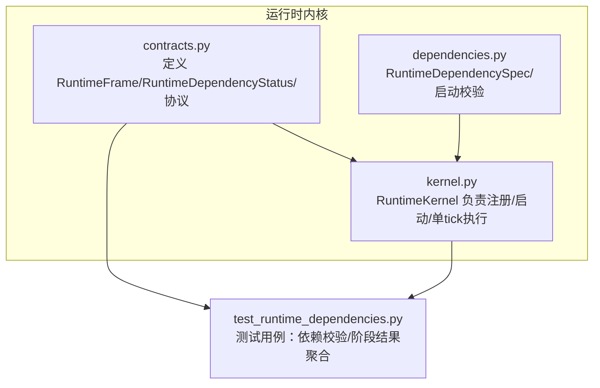
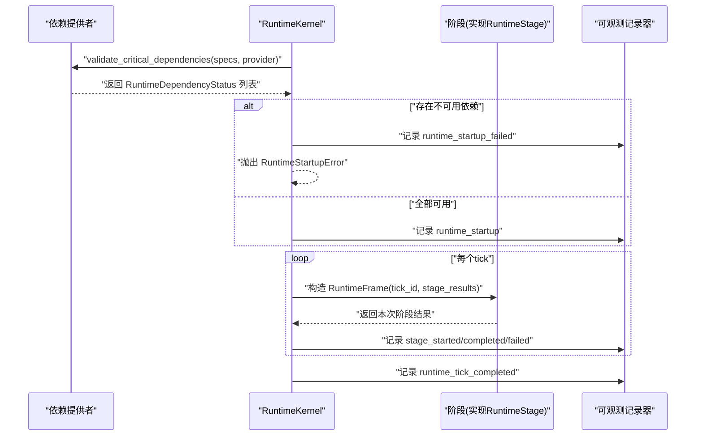
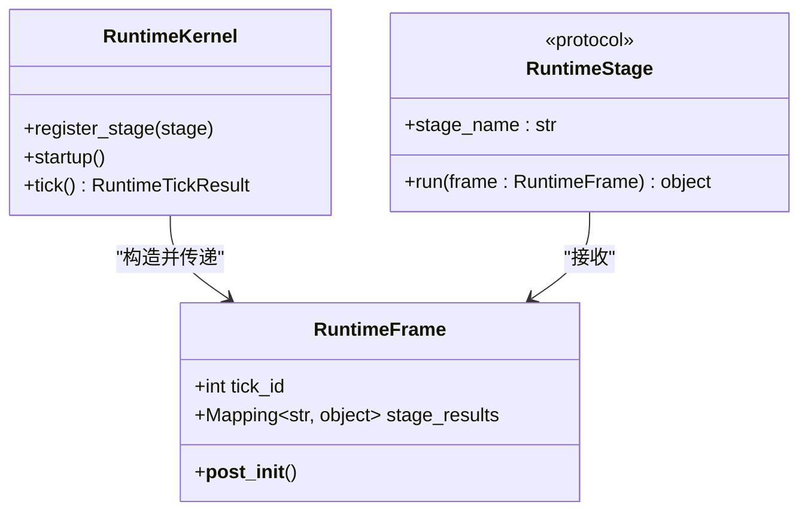
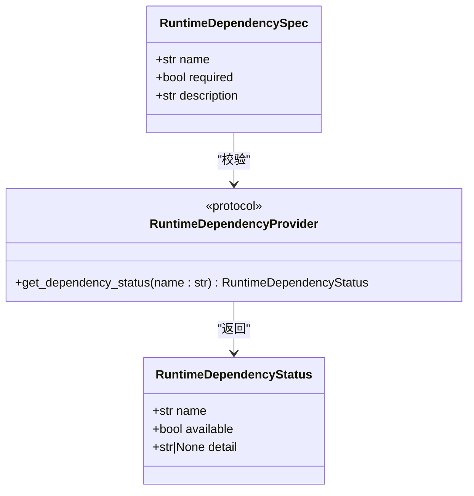
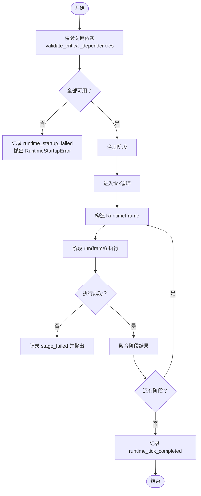
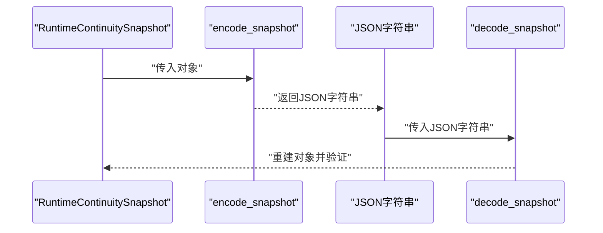
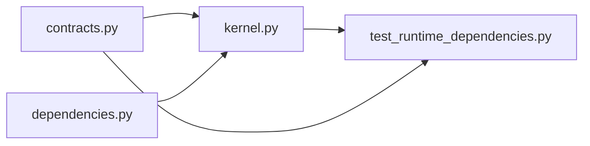

# 数据结构规范

<cite>
**本文引用的文件**
- [contracts.py](file://helios_v2/src/helios_v2/runtime/contracts.py)
- [kernel.py](file://helios_v2/src/helios_v2/runtime/kernel.py)
- [dependencies.py](file://helios_v2/src/helios_v2/runtime/dependencies.py)
- [test_runtime_dependencies.py](file://helios_v2/tests/test_runtime_dependencies.py)
- [engine.py](file://helios_v2/src/helios_v2/continuity_checkpoint/engine.py)
- [persistence.py](file://helios_v2/src/helios_v2/persistence/engine.py)
- [ARCHITECTURE_BOUNDARIES.md](file://helios_v2/docs/ARCHITECTURE_BOUNDARIES.md)
- [45-affect-memory-formation-and-durable-store/design.md](file://helios_v2/docs/requirements/45-affect-memory-formation-and-durable-store/design.md)
- [45-affect-memory-formation-and-durable-store/requirement.md](file://helios_v2/docs/requirements/45-affect-memory-formation-and-durable-store/requirement.md)
</cite>

## 目录
1. [引言](#引言)
2. [项目结构](#项目结构)
3. [核心组件](#核心组件)
4. [架构总览](#架构总览)
5. [详细组件分析](#详细组件分析)
6. [依赖关系分析](#依赖关系分析)
7. [性能考量](#性能考量)
8. [故障排查指南](#故障排查指南)
9. [结论](#结论)
10. [附录](#附录)

## 引言
本文件面向Helios v2运行时内核的数据结构规范，聚焦于标准化数据结构的设计与使用，重点覆盖以下内容：
- RuntimeFrame：运行时阶段执行的不可变输入契约，承载tick_id与前序阶段输出的只读映射。
- RuntimeDependencyStatus：关键依赖可用性报告，用于启动门禁校验与可观测事件记录。
- 设计原则与不变量：冻结语义、不可变性、类型约束与后置校验。
- 序列化机制：JSON序列化与持久化编码/解码策略。
- 使用示例：如何正确构造、传递与验证数据结构；如何在阶段间安全共享状态。
- 演进策略：兼容性设计、迁移路径与性能优化建议。

## 项目结构
Helios v2将运行时相关的核心数据结构与逻辑集中在runtime子包中，配合kernel驱动阶段有序执行，并通过dependencies提供启动门禁校验能力。测试用例展示了典型使用模式与边界行为。

**图示来源**
- [contracts.py:1-50](file://helios_v2/src/helios_v2/runtime/contracts.py#L1-L50)
- [kernel.py:1-145](file://helios_v2/src/helios_v2/runtime/kernel.py#L1-L145)
- [dependencies.py:1-40](file://helios_v2/src/helios_v2/runtime/dependencies.py#L1-L40)
- [test_runtime_dependencies.py:1-122](file://helios_v2/tests/test_runtime_dependencies.py#L1-L122)

**章节来源**
- [contracts.py:1-50](file://helios_v2/src/helios_v2/runtime/contracts.py#L1-L50)
- [kernel.py:1-145](file://helios_v2/src/helios_v2/runtime/kernel.py#L1-L145)
- [dependencies.py:1-40](file://helios_v2/src/helios_v2/runtime/dependencies.py#L1-L40)
- [test_runtime_dependencies.py:1-122](file://helios_v2/tests/test_runtime_dependencies.py#L1-L122)

## 核心组件
本节对RuntimeFrame与RuntimeDependencyStatus进行深入解析，涵盖字段定义、类型约束、设计原则与使用场景。

- RuntimeDependencyStatus
  - 字段与类型
    - name: str（依赖名）
    - available: bool（是否可用）
    - detail: str | None（可选详情说明）
  - 约束与语义
    - 由依赖提供者返回，用于启动门禁校验与可观测事件记录。
    - 可选detail用于补充不可用原因或诊断信息。
  - 使用场景
    - 启动阶段调用provider.get_dependency_status进行可用性检查。
    - 在kernel启动失败时，通过可观测事件记录缺失依赖列表。

- RuntimeFrame
  - 字段与类型
    - tick_id: int（当前tick编号）
    - stage_results: Mapping[str, object] | None（前序阶段输出的只读映射，默认None）
  - 不变量与冻结语义
    - 构造后不可变（frozen=True）。
    - 内部通过MappingProxyType冻结stage_results，防止外部修改。
    - 提供__post_init__在实例化后统一冻结映射。
  - 设计原则
    - 不可变性确保阶段执行期间的确定性与线程安全。
    - 只读映射避免阶段间无意的状态污染。
  - 使用场景
    - kernel在每个tick按注册顺序构造RuntimeFrame并传入各阶段run方法。
    - 后续阶段可安全读取前序阶段输出，但无法修改。

- RuntimeStage（契约）
  - stage_name: str（稳定且唯一的阶段名称）
  - run(frame: RuntimeFrame) -> object（执行一次生命周期切片）
  - 语义
    - kernel以不可变RuntimeFrame作为输入，阶段返回本次产出对象。
    - kernel负责收集并聚合阶段结果，形成RuntimeTickResult。

**章节来源**
- [contracts.py:8-50](file://helios_v2/src/helios_v2/runtime/contracts.py#L8-L50)

## 架构总览
下图展示了运行时内核如何组织数据结构与阶段执行流程，以及依赖可用性检查在启动阶段的作用。

**图示来源**
- [kernel.py:46-144](file://helios_v2/src/helios_v2/runtime/kernel.py#L46-L144)
- [dependencies.py:26-40](file://helios_v2/src/helios_v2/runtime/dependencies.py#L26-L40)
- [contracts.py:17-50](file://helios_v2/src/helios_v2/runtime/contracts.py#L17-L50)

## 详细组件分析

### RuntimeFrame 数据模型
RuntimeFrame是阶段执行的唯一输入契约，其不可变性与冻结映射确保了跨阶段状态的安全共享。

- 字段与约束
  - tick_id：严格为整数，表示当前执行tick。
  - stage_results：若非空，必须为映射类型；构造后被冻结为只读视图。
- 不变量保证
  - 实例化后不可修改；冻结后的映射禁止写入。
- 性能与复杂度
  - 冻结操作O(n)，n为映射项数；后续访问为O(1)。
- 使用示例（路径）
  - 构造与传递：参见测试用例中对RuntimeFrame的构造与阶段接收。
  - 防篡改验证：参见测试用例中对stage_results写入异常的断言。

**图示来源**
- [contracts.py:30-39](file://helios_v2/src/helios_v2/runtime/contracts.py#L30-L39)
- [kernel.py:98-104](file://helios_v2/src/helios_v2/runtime/kernel.py#L98-L104)
- [test_runtime_dependencies.py:84-111](file://helios_v2/tests/test_runtime_dependencies.py#L84-L111)

**章节来源**
- [contracts.py:30-39](file://helios_v2/src/helios_v2/runtime/contracts.py#L30-L39)
- [kernel.py:98-104](file://helios_v2/src/helios_v2/runtime/kernel.py#L98-L104)
- [test_runtime_dependencies.py:84-111](file://helios_v2/tests/test_runtime_dependencies.py#L84-L111)

### RuntimeDependencyStatus 数据模型
RuntimeDependencyStatus用于表达依赖可用性，是启动门禁与可观测事件的关键载体。

- 字段与约束
  - name：依赖标识符，需唯一且稳定。
  - available：布尔值，true表示可用，false表示不可用。
  - detail：可选字符串，用于补充不可用原因或诊断信息。
- 使用示例（路径）
  - 提供者实现：参见测试用例中的FakeDependencyProvider。
  - 启动校验：参见kernel.startup与dependencies.validate_critical_dependencies。

**图示来源**
- [contracts.py:8-15](file://helios_v2/src/helios_v2/runtime/contracts.py#L8-L15)
- [dependencies.py:8-15](file://helios_v2/src/helios_v2/runtime/dependencies.py#L8-L15)
- [test_runtime_dependencies.py:13-19](file://helios_v2/tests/test_runtime_dependencies.py#L13-L19)

**章节来源**
- [contracts.py:8-15](file://helios_v2/src/helios_v2/runtime/contracts.py#L8-L15)
- [dependencies.py:8-15](file://helios_v2/src/helios_v2/runtime/dependencies.py#L8-L15)
- [test_runtime_dependencies.py:13-19](file://helios_v2/tests/test_runtime_dependencies.py#L13-L19)

### 启动门禁与阶段执行流程
该流程体现了依赖可用性检查、阶段注册、逐阶段执行与可观测事件记录的协同工作。

**图示来源**
- [kernel.py:46-144](file://helios_v2/src/helios_v2/runtime/kernel.py#L46-L144)
- [dependencies.py:26-40](file://helios_v2/src/helios_v2/runtime/dependencies.py#L26-L40)

**章节来源**
- [kernel.py:46-144](file://helios_v2/src/helios_v2/runtime/kernel.py#L46-L144)
- [dependencies.py:26-40](file://helios_v2/src/helios_v2/runtime/dependencies.py#L26-L40)

### 序列化与持久化机制
- JSON序列化
  - 运行时契约对象本身未内置序列化方法，但可通过标准库或第三方工具进行序列化。
  - 对于需要持久化的场景，建议采用“编码器/解码器”模式，将契约对象投影为字典后再序列化。
- 连续性快照编码
  - 提供encode_snapshot/decode_snapshot函数，将RuntimeContinuitySnapshot编码为JSON字符串，解码时重建对象并触发验证。
  - 该模式可作为RuntimeFrame/RuntimeDependencyStatus等契约对象的序列化参考实现。

**图示来源**
- [engine.py:177-241](file://helios_v2/src/helios_v2/continuity_checkpoint/engine.py#L177-L241)

**章节来源**
- [engine.py:177-241](file://helios_v2/src/helios_v2/continuity_checkpoint/engine.py#L177-L241)

### 数据结构使用示例与最佳实践
- 正确构造RuntimeFrame
  - 通过kernel在每个tick自动构造，传入当前tick_id与前序阶段结果映射。
  - 避免直接修改stage_results；如需变更，请在阶段内部返回新的映射。
- 依赖可用性检查
  - 在kernel.startup中调用validate_critical_dependencies，确保所有required=true的依赖均可用。
  - 若存在不可用依赖，记录runtime_startup_failed并抛出RuntimeStartupError。
- 阶段间状态共享
  - 前序阶段返回的对象会被kernel收集并作为后续阶段的stage_results传入。
  - 由于stage_results被冻结，后续阶段只能读取，不能修改，从而保证一致性。

**章节来源**
- [kernel.py:75-144](file://helios_v2/src/helios_v2/runtime/kernel.py#L75-L144)
- [test_runtime_dependencies.py:36-84](file://helios_v2/tests/test_runtime_dependencies.py#L36-L84)

## 依赖关系分析
运行时内核的依赖关系清晰且低耦合：contracts定义契约，kernel组合契约与依赖校验，dependencies提供启动门禁，测试用例验证行为。

**图示来源**
- [contracts.py:1-50](file://helios_v2/src/helios_v2/runtime/contracts.py#L1-L50)
- [kernel.py:1-145](file://helios_v2/src/helios_v2/runtime/kernel.py#L1-L145)
- [dependencies.py:1-40](file://helios_v2/src/helios_v2/runtime/dependencies.py#L1-L40)
- [test_runtime_dependencies.py:1-122](file://helios_v2/tests/test_runtime_dependencies.py#L1-L122)

**章节来源**
- [contracts.py:1-50](file://helios_v2/src/helios_v2/runtime/contracts.py#L1-L50)
- [kernel.py:1-145](file://helios_v2/src/helios_v2/runtime/kernel.py#L1-L145)
- [dependencies.py:1-40](file://helios_v2/src/helios_v2/runtime/dependencies.py#L1-L40)
- [test_runtime_dependencies.py:1-122](file://helios_v2/tests/test_runtime_dependencies.py#L1-L122)

## 性能考量
- 冻结映射的成本
  - stage_results在构造时被冻结为只读视图，冻结成本与映射大小成正比；建议控制每tick传递的映射规模。
- 映射访问效率
  - 冻结后的MappingProxyType提供O(1)访问时间，适合频繁读取场景。
- 观测事件开销
  - 每个阶段的started/completed/failed事件会带来少量日志开销；在高吞吐场景中可根据需要调整日志级别。
- 序列化成本
  - JSON序列化/反序列化成本与对象体积和嵌套深度相关；对大对象建议分批传输或延迟序列化。

## 故障排查指南
- 启动失败
  - 现象：kernel.startup抛出RuntimeStartupError。
  - 排查：检查dependencies.validate_critical_dependencies返回的缺失依赖列表；确认provider.get_dependency_status实现正确。
- 阶段执行异常
  - 现象：阶段run抛出异常，记录stage_failed事件。
  - 排查：查看事件payload中的错误类型与持续时间；定位具体阶段并修复。
- 状态被修改
  - 现象：尝试写入RuntimeFrame.stage_results导致TypeError。
  - 排查：遵循不可变性原则，不在阶段内修改stage_results；如需变更，请返回新映射。

**章节来源**
- [kernel.py:54-73](file://helios_v2/src/helios_v2/runtime/kernel.py#L54-L73)
- [kernel.py:102-118](file://helios_v2/src/helios_v2/runtime/kernel.py#L102-L118)
- [test_runtime_dependencies.py:101-104](file://helios_v2/tests/test_runtime_dependencies.py#L101-L104)

## 结论
RuntimeFrame与RuntimeDependencyStatus构成了Helios v2运行时内核的标准化数据基石：前者以不可变性与冻结映射保障阶段间状态的一致性与安全性，后者以结构化可用性报告支撑启动门禁与可观测事件。通过契约化设计与严格的后置校验，系统在保证确定性的同时兼顾了可维护性与可扩展性。结合序列化与持久化策略，可在不破坏现有行为的前提下平滑演进。

## 附录

### 演进策略与兼容性
- 兼容性原则
  - 新增字段与功能保持向后兼容，不影响默认装配与现有行为。
  - 通过可选开关与增量启用，确保默认路径与历史存储格式不变。
- 迁移路径
  - 采用“先读取再写入”的策略，确保旧数据可被读取且新字段可选。
  - 对数据库结构采用受控ALTER TABLE，避免数据丢失。
- 性能优化建议
  - 控制每tick传递的映射规模，减少冻结与序列化成本。
  - 对大对象采用延迟序列化或分批处理，降低峰值内存占用。

**章节来源**
- [ARCHITECTURE_BOUNDARIES.md:246-247](file://helios_v2/docs/ARCHITECTURE_BOUNDARIES.md#L246-L247)
- [45-affect-memory-formation-and-durable-store/design.md:163-168](file://helios_v2/docs/requirements/45-affect-memory-formation-and-durable-store/design.md#L163-L168)
- [45-affect-memory-formation-and-durable-store/requirement.md:54-59](file://helios_v2/docs/requirements/45-affect-memory-formation-and-durable-store/requirement.md#L54-L59)