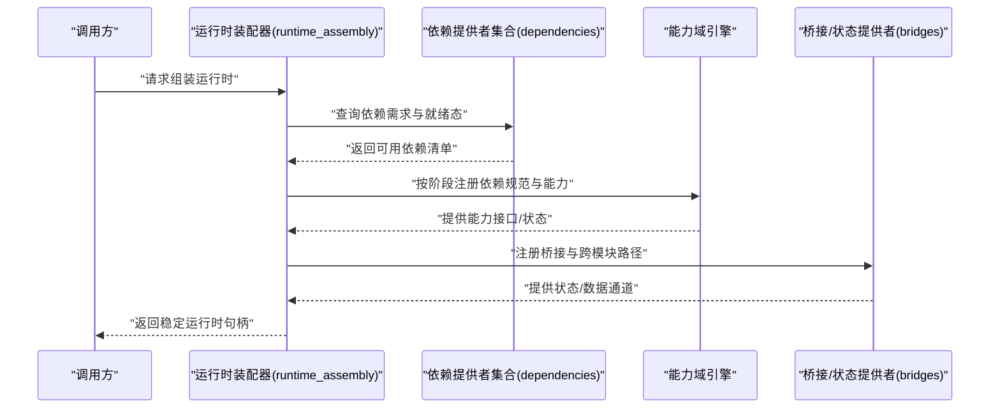
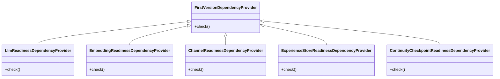
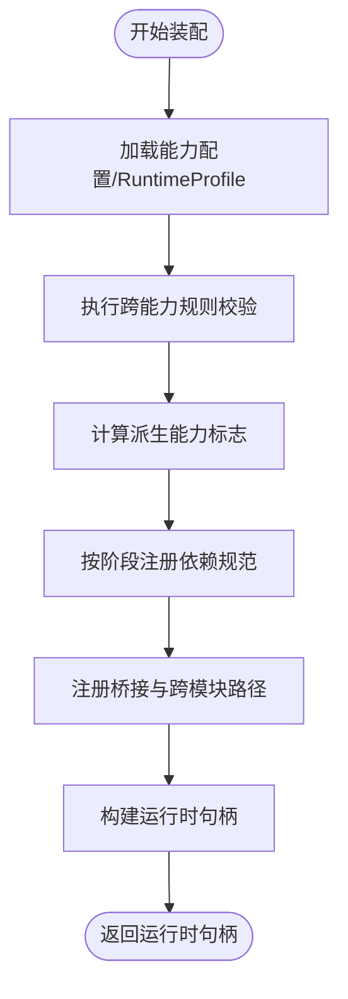
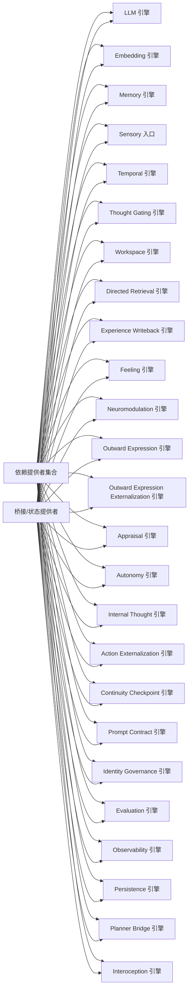
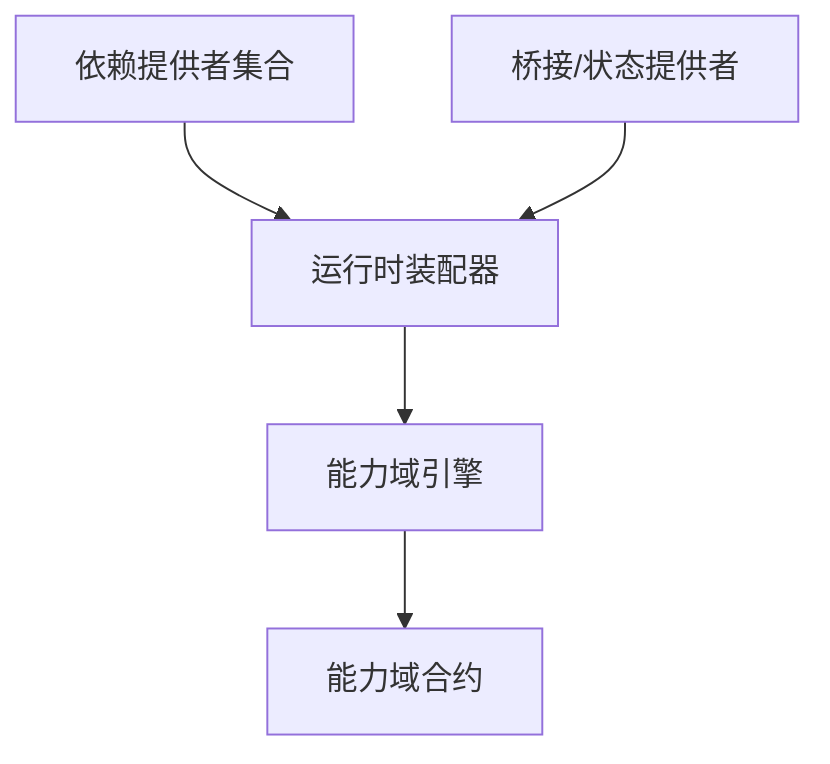

# 模块依赖管理

<cite>
**本文引用的文件**
- [requirements.md](file://helios_v2/docs/requirements/58-runtime-profile-capability-bundle/requirement.md)
- [task.md](file://helios_v2/docs/requirements/58-runtime-profile-capability-bundle/task.md)
- [__init__.py](file://helios_v2/src/helios_v2/composition/__init__.py)
- [dependencies.py](file://helios_v2/src/helios_v2/composition/dependencies.py)
- [runtime_assembly.py](file://helios_v2/src/helios_v2/composition/runtime_assembly.py)
- [bridges.py](file://helios_v2/src/helios_v2/composition/bridges.py)
- [engine.py](file://helios_v2/src/helios_v2/llm/engine.py)
- [contracts.py](file://helios_v2/src/helios_v2/llm/contracts.py)
- [engine.py](file://helios_v2/src/helios_v2/embedding/engine.py)
- [contracts.py](file://helios_v2/src/helios_v2/embedding/contracts.py)
- [engine.py](file://helios_v2/src/helios_v2/memory/engine.py)
- [contracts.py](file://helios_v2/src/helios_v2/memory/contracts.py)
- [engine.py](file://helios_v2/src/helios_v2/consciousness/engine.py)
- [engine.py](file://helios_v2/src/helios_v2/channel/engine.py)
- [engine.py](file://helios_v2/src/helios_v2/identity_governance/engine.py)
- [engine.py](file://helios_v2/src/helios_v2/evaluation/engine.py)
- [engine.py](file://helios_v2/src/helios_v2/observability/engine.py)
- [engine.py](file://helios_v2/src/helios_v2/persistence/engine.py)
- [engine.py](file://helios_v2/src/helios_v2/planner_bridge/engine.py)
- [engine.py](file://helios_v2/src/helios_v2/sensory/ingress.py)
- [engine.py](file://helios_v2/src/helios_v2/temporal/engine.py)
- [engine.py](file://helios_v2/src/helios_v2/thought_gating/engine.py)
- [engine.py](file://helios_v2/src/helios_v2/workspace/engine.py)
- [engine.py](file://helios_v2/src/helios_v2/directed_retrieval/engine.py)
- [engine.py](file://helios_v2/src/helios_v2/experience_writeback/engine.py)
- [engine.py](file://helios_v2/src/helios_v2/feeling/engine.py)
- [engine.py](file://helios_v2/src/helios_v2/neuromodulation/engine.py)
- [engine.py](file://helios_v2/src/helios_v2/outward_expression/engine.py)
- [engine.py](file://helios_v2/src/helios_v2/outward_expression_externalization/engine.py)
- [engine.py](file://helios_v2/src/helios_v2/appraisal/engine.py)
- [engine.py](file://helios_v2/src/helios_v2/autonomy/engine.py)
- [engine.py](file://helios_v2/src/helios_v2/internal_thought/engine.py)
- [engine.py](file://helios_v2/src/helios_v2/action_externalization/engine.py)
- [engine.py](file://helios_v2/src/helios_v2/continuity_checkpoint/engine.py)
- [engine.py](file://helios_v2/src/helios_v2/prompt_contract/engine.py)
- [engine.py](file://helios_v2/src/helios_v2/interoception/engine.py)
- [engine.py](file://helios_v2/src/helios_v2/sensory/ingress.py)
- [engine.py](file://helios_v2/src/helios_v2/temporal/engine.py)
- [engine.py](file://helios_v2/src/helios_v2/thought_gating/engine.py)
- [engine.py](file://helios_v2/src/helios_v2/workspace/engine.py)
- [engine.py](file://helios_v2/src/helios_v2/directed_retrieval/engine.py)
- [engine.py](file://helios_v2/src/helios_v2/experience_writeback/engine.py)
- [engine.py](file://helios_v2/src/helios_v2/feeling/engine.py)
- [engine.py](file://helios_v2/src/helios_v2/neuromodulation/engine.py)
- [engine.py](file://helios_v2/src/helios_v2/outward_expression/engine.py)
- [engine.py](file://helios_v2/src/helios_v2/outward_expression_externalization/engine.py)
- [engine.py](file://helios_v2/src/helios_v2/appraisal/engine.py)
- [engine.py](file://helios_v2/src/helios_v2/autonomy/engine.py)
- [engine.py](file://helios_v2/src/helios_v2/internal_thought/engine.py)
- [engine.py](file://helios_v2/src/helios_v2/action_externalization/engine.py)
- [engine.py](file://helios_v2/src/helios_v2/continuity_checkpoint/engine.py)
- [engine.py](file://helios_v2/src/helios_v2/prompt_contract/engine.py)
- [engine.py](file://helios_v2/src/helios_v2/interoception/engine.py)
- [test_runtime_dependencies.py](file://helios_v2/tests/test_runtime_dependencies.py)
- [test_runtime_composition.py](file://helios_v2/tests/test_runtime_composition.py)
- [test_llm_dependency_gate.py](file://helios_v2/tests/test_llm_dependency_gate.py)
</cite>

## 目录
1. [引言](#引言)
2. [项目结构](#项目结构)
3. [核心组件](#核心组件)
4. [架构总览](#架构总览)
5. [详细组件分析](#详细组件分析)
6. [依赖关系分析](#依赖关系分析)
7. [性能考虑](#性能考虑)
8. [故障排查指南](#故障排查指南)
9. [结论](#结论)
10. [附录](#附录)

## 引言
本文件系统性阐述 Helios v2 的模块依赖管理机制，覆盖依赖声明、解析与注入流程；依赖提供者接口与状态检查；运行时绑定过程；模块间依赖关系图谱、循环依赖检测与冲突解决策略；以及最佳实践、故障恢复与性能监控建议。内容基于 helios_v2/src/helios_v2/composition 下的依赖定义与装配实现，并结合各能力域（如 LLM、Embedding、Memory 等）的合约与引擎实现进行说明。

## 项目结构
Helios v2 将“组合装配”作为核心，围绕 composition 包组织依赖声明与运行时装配逻辑，同时在各能力域（如 llm、embedding、memory 等）提供合约与引擎实现，形成“声明-解析-注入-运行”的闭环。

```mermaid
graph TB
subgraph "组合装配层"
comp_init["composition/__init__.py<br/>导出 RuntimeProfile 等"]
deps["composition/dependencies.py<br/>依赖提供者集合"]
rt_asm["composition/runtime_assembly.py<br/>运行时装配与配置"]
bridges["composition/bridges.py<br/>桥接与状态提供者"]
end
subgraph "能力域引擎"
llm_eng["llm/engine.py"]
emb_eng["embedding/engine.py"]
mem_eng["memory/engine.py"]
sens_ing["sensory/ingress.py"]
temp_eng["temporal/engine.py"]
thg_eng["thought_gating/engine.py"]
ws_eng["workspace/engine.py"]
dr_eng["directed_retrieval/engine.py"]
ew_eng["experience_writeback/engine.py"]
feel_eng["feeling/engine.py"]
nm_eng["neuromodulation/engine.py"]
out_eng["outward_expression/engine.py"]
oex_eng["outward_expression_externalization/engine.py"]
app_eng["appraisal/engine.py"]
aut_eng["autonomy/engine.py"]
it_eng["internal_thought/engine.py"]
ae_eng["action_externalization/engine.py"]
cc_eng["continuity_checkpoint/engine.py"]
pc_eng["prompt_contract/engine.py"]
ig_eng["identity_governance/engine.py"]
eval_eng["evaluation/engine.py"]
obs_eng["observability/engine.py"]
pers_eng["persistence/engine.py"]
pb_eng["planner_bridge/engine.py"]
int_eng["interoception/engine.py"]
end
comp_init --> deps
comp_init --> rt_asm
comp_init --> bridges
deps --> llm_eng
deps --> emb_eng
deps --> mem_eng
deps --> sens_ing
deps --> temp_eng
deps --> thg_eng
deps --> ws_eng
deps --> dr_eng
deps --> ew_eng
deps --> feel_eng
deps --> nm_eng
deps --> out_eng
deps --> oex_eng
deps --> app_eng
deps --> aut_eng
deps --> it_eng
deps --> ae_eng
deps --> cc_eng
deps --> pc_eng
deps --> ig_eng
deps --> eval_eng
deps --> obs_eng
deps --> pers_eng
deps --> pb_eng
deps --> int_eng
```

图表来源
- [__init__.py:27-30](file://helios_v2/src/helios_v2/composition/__init__.py#L27-L30)
- [dependencies.py:227-512](file://helios_v2/src/helios_v2/composition/dependencies.py#L227-L512)
- [runtime_assembly.py:1-200](file://helios_v2/src/helios_v2/composition/runtime_assembly.py#L1-L200)
- [bridges.py:226-986](file://helios_v2/src/helios_v2/composition/bridges.py#L226-L986)

章节来源
- [__init__.py:27-30](file://helios_v2/src/helios_v2/composition/__init__.py#L27-L30)
- [dependencies.py:227-512](file://helios_v2/src/helios_v2/composition/dependencies.py#L227-L512)
- [runtime_assembly.py:1-200](file://helios_v2/src/helios_v2/composition/runtime_assembly.py#L1-L200)

## 核心组件
- 依赖提供者集合：集中定义各类依赖的可用性与就绪态检查，确保装配前的状态一致性。
- 运行时装配器：根据配置或能力集生成可运行的运行时句柄，负责阶段顺序、依赖规范与桥接路径的注册。
- 能力域引擎：实现具体功能，遵循合约接口，向装配器暴露依赖需求与提供能力。
- 桥接与状态提供者：在装配过程中提供跨模块的状态与数据通道，保证模块间解耦与可观察性。

章节来源
- [dependencies.py:227-512](file://helios_v2/src/helios_v2/composition/dependencies.py#L227-L512)
- [runtime_assembly.py:1-200](file://helios_v2/src/helios_v2/composition/runtime_assembly.py#L1-L200)
- [bridges.py:226-986](file://helios_v2/src/helios_v2/composition/bridges.py#L226-L986)

## 架构总览
Helios v2 的依赖管理采用“声明式依赖 + 运行时解析 + 注入式装配”的模式。装配器消费统一的能力配置（如 RuntimeProfile），在装配阶段完成依赖解析、就绪态校验与桥接注册，最终输出稳定的运行时句柄。

图表来源
- [runtime_assembly.py:1-200](file://helios_v2/src/helios_v2/composition/runtime_assembly.py#L1-L200)
- [dependencies.py:227-512](file://helios_v2/src/helios_v2/composition/dependencies.py#L227-L512)
- [bridges.py:226-986](file://helios_v2/src/helios_v2/composition/bridges.py#L226-L986)

## 详细组件分析

### 依赖提供者接口与状态检查
- 依赖提供者集合以类的形式封装不同能力的依赖声明与就绪态检查，例如 LLM 就绪检查、Embedding 就绪检查、通道就绪检查等。
- 提供者通过统一的接口对外暴露依赖需求，装配器据此决定是否满足装配条件。
- 就绪态检查通常包括外部服务可用性、配置完整性、前置能力存在性等。

图表来源
- [dependencies.py:227-512](file://helios_v2/src/helios_v2/composition/dependencies.py#L227-L512)

章节来源
- [dependencies.py:227-512](file://helios_v2/src/helios_v2/composition/dependencies.py#L227-L512)

### 运行时绑定与装配流程
- 装配器接收能力配置（如 RuntimeProfile），内部执行跨能力规则校验与派生标志计算。
- 装配器按既定阶段顺序注册依赖规范与桥接路径，确保行为字节级不变。
- 装配完成后输出运行时句柄，供后续阶段使用。

图表来源
- [runtime_assembly.py:1-200](file://helios_v2/src/helios_v2/composition/runtime_assembly.py#L1-L200)
- [requirements.md:61-82](file://helios_v2/docs/requirements/58-runtime-profile-capability-bundle/requirement.md#L61-L82)

章节来源
- [runtime_assembly.py:1-200](file://helios_v2/src/helios_v2/composition/runtime_assembly.py#L1-L200)
- [requirements.md:61-82](file://helios_v2/docs/requirements/58-runtime-profile-capability-bundle/requirement.md#L61-L82)

### 模块间依赖关系图谱
- 各能力域引擎通过合约接口暴露能力边界，装配器在装配阶段统一注册依赖与桥接。
- 桥接模块提供跨域状态与数据通道，降低模块间耦合度。
- 依赖关系由依赖提供者与装配器共同决定，避免硬编码耦合。

图表来源
- [dependencies.py:227-512](file://helios_v2/src/helios_v2/composition/dependencies.py#L227-L512)
- [bridges.py:226-986](file://helios_v2/src/helios_v2/composition/bridges.py#L226-L986)

章节来源
- [dependencies.py:227-512](file://helios_v2/src/helios_v2/composition/dependencies.py#L227-L512)
- [bridges.py:226-986](file://helios_v2/src/helios_v2/composition/bridges.py#L226-L986)

### 循环依赖检测与冲突解决策略
- 在装配阶段执行跨能力规则校验，若出现不合法的依赖组合，立即抛出装配错误，避免运行时不可预期行为。
- 当同时传入显式能力配置与重叠的松散参数时，装配器快速失败，防止静默覆盖与歧义行为。
- 通过统一的能力配置与就绪态检查，减少隐式依赖与循环依赖发生的可能性。

章节来源
- [requirements.md:106-108](file://helios_v2/docs/requirements/58-runtime-profile-capability-bundle/requirement.md#L106-L108)
- [runtime_assembly.py:1-200](file://helios_v2/src/helios_v2/composition/runtime_assembly.py#L1-L200)

### 依赖管理示例与最佳实践
- 声明模块依赖：在依赖提供者中定义所需能力与就绪态检查，确保装配前满足条件。
- 实现依赖提供者：继承基础提供者类，实现 check 方法，返回就绪态结果。
- 依赖验证：通过测试用例验证依赖解析与装配流程，确保行为不变与错误快速失败。
- 最佳实践：
  - 将能力配置收敛到统一入口（如 RuntimeProfile），避免分散配置。
  - 保持装配阶段只做解析与注册，不引入运行时性能开销。
  - 使用桥接模块隔离跨域交互，降低耦合度。
  - 对外部依赖（如 LLM、Embedding）增加就绪态检查与降级策略。

章节来源
- [requirements.md:32-97](file://helios_v2/docs/requirements/58-runtime-profile-capability-bundle/requirement.md#L32-L97)
- [task.md:31-54](file://helios_v2/docs/requirements/58-runtime-profile-capability-bundle/task.md#L31-L54)
- [test_runtime_dependencies.py:1-200](file://helios_v2/tests/test_runtime_dependencies.py#L1-L200)
- [test_runtime_composition.py:1-200](file://helios_v2/tests/test_runtime_composition.py#L1-L200)
- [test_llm_dependency_gate.py:1-200](file://helios_v2/tests/test_llm_dependency_gate.py#L1-L200)

## 依赖关系分析
- 组件内聚与耦合：依赖提供者与装配器高内聚，能力域引擎低耦合，通过合约接口交互。
- 直接与间接依赖：装配器直接依赖依赖提供者与桥接模块；能力域引擎仅依赖合约与装配器提供的桥接。
- 外部依赖与集成点：LLM、Embedding、Memory 等能力域通过各自的合约与引擎实现与装配器对接。
- 接口契约与实现细节：合约定义能力边界，引擎实现具体逻辑，装配器负责编排。

图表来源
- [dependencies.py:227-512](file://helios_v2/src/helios_v2/composition/dependencies.py#L227-L512)
- [runtime_assembly.py:1-200](file://helios_v2/src/helios_v2/composition/runtime_assembly.py#L1-L200)
- [bridges.py:226-986](file://helios_v2/src/helios_v2/composition/bridges.py#L226-L986)

章节来源
- [dependencies.py:227-512](file://helios_v2/src/helios_v2/composition/dependencies.py#L227-L512)
- [runtime_assembly.py:1-200](file://helios_v2/src/helios_v2/composition/runtime_assembly.py#L1-L200)
- [bridges.py:226-986](file://helios_v2/src/helios_v2/composition/bridges.py#L226-L986)

## 性能考虑
- 装配阶段无运行时性能影响：重构目标明确要求装配阶段重构不改变运行时性能。
- 依赖解析与就绪态检查应尽量轻量：避免在装配阶段进行昂贵操作，将复杂初始化推迟至运行时。
- 桥接模块应最小化跨域通信成本：通过状态缓存与批量处理降低通信频率。

## 故障排查指南
- 快速失败策略：当跨能力规则不满足或同时传入冲突配置时，装配器立即抛出装配错误，便于定位问题。
- 测试驱动验证：通过单元测试与集成测试覆盖依赖解析、装配流程与桥接路径，确保行为不变与错误可追踪。
- 日志与可观测性：保持现有日志与可观测性机制，配合测试用例定位异常。

章节来源
- [requirements.md:91-97](file://helios_v2/docs/requirements/58-runtime-profile-capability-bundle/requirement.md#L91-L97)
- [test_runtime_dependencies.py:1-200](file://helios_v2/tests/test_runtime_dependencies.py#L1-L200)
- [test_runtime_composition.py:1-200](file://helios_v2/tests/test_runtime_composition.py#L1-L200)
- [test_llm_dependency_gate.py:1-200](file://helios_v2/tests/test_llm_dependency_gate.py#L1-L200)

## 结论
Helios v2 的依赖管理以“声明-解析-注入-运行”为核心，通过统一的能力配置与依赖提供者集合，实现了模块间低耦合、高内聚的装配体系。装配器在装配阶段完成依赖解析与桥接注册，确保运行时行为稳定且可观察。配合严格的跨能力规则与快速失败策略，系统具备良好的可靠性与可维护性。

## 附录
- 相关实现文件路径参考：
  - [dependencies.py:227-512](file://helios_v2/src/helios_v2/composition/dependencies.py#L227-L512)
  - [runtime_assembly.py:1-200](file://helios_v2/src/helios_v2/composition/runtime_assembly.py#L1-L200)
  - [bridges.py:226-986](file://helios_v2/src/helios_v2/composition/bridges.py#L226-L986)
  - [requirements.md:32-121](file://helios_v2/docs/requirements/58-runtime-profile-capability-bundle/requirement.md#L32-L121)
  - [task.md:31-54](file://helios_v2/docs/requirements/58-runtime-profile-capability-bundle/task.md#L31-L54)