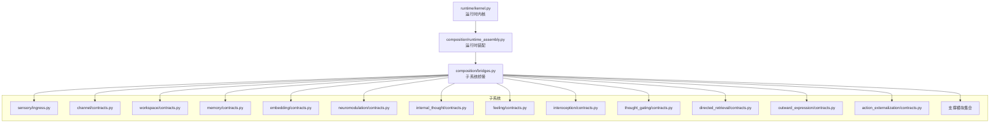
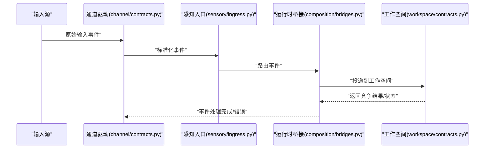
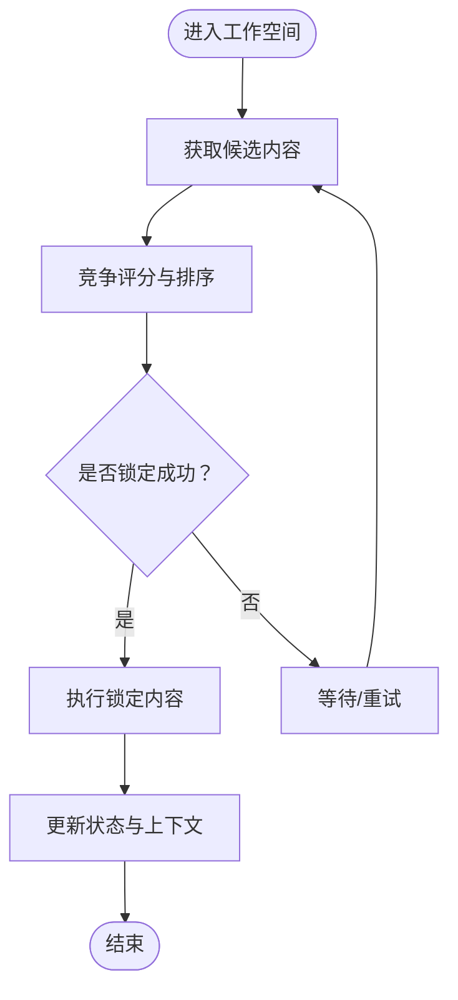
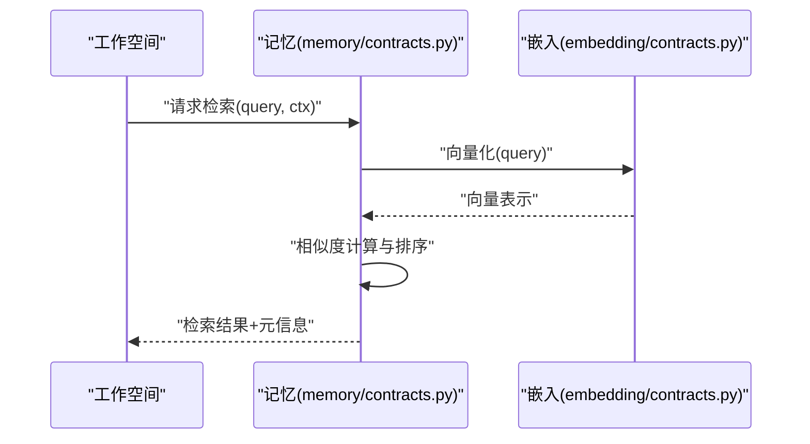
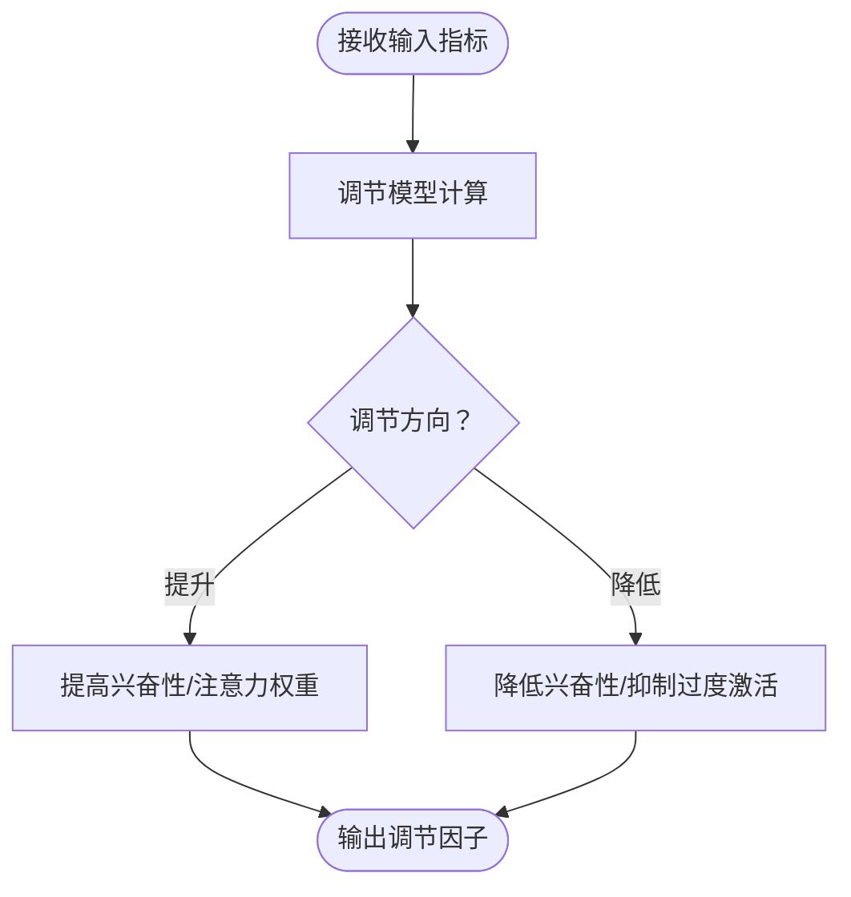
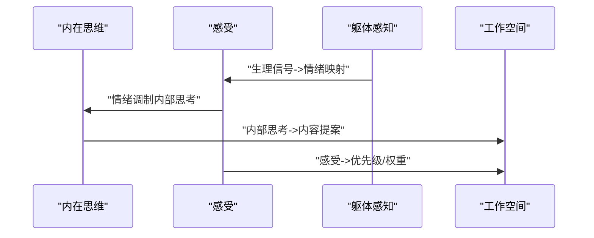
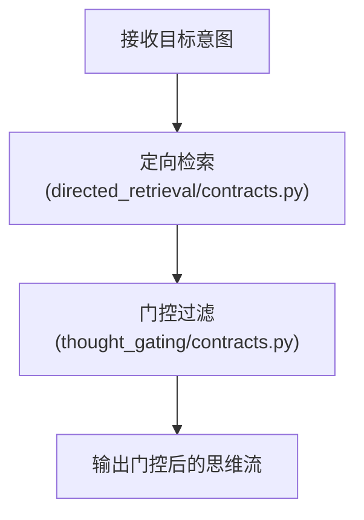
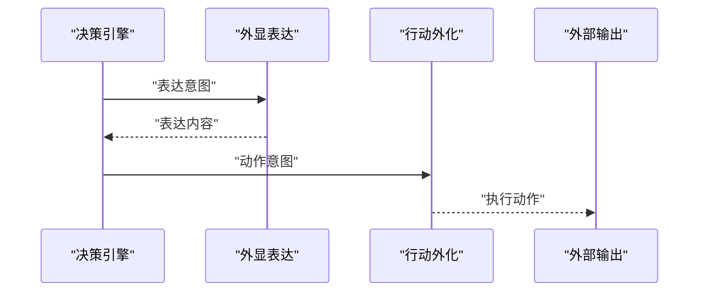
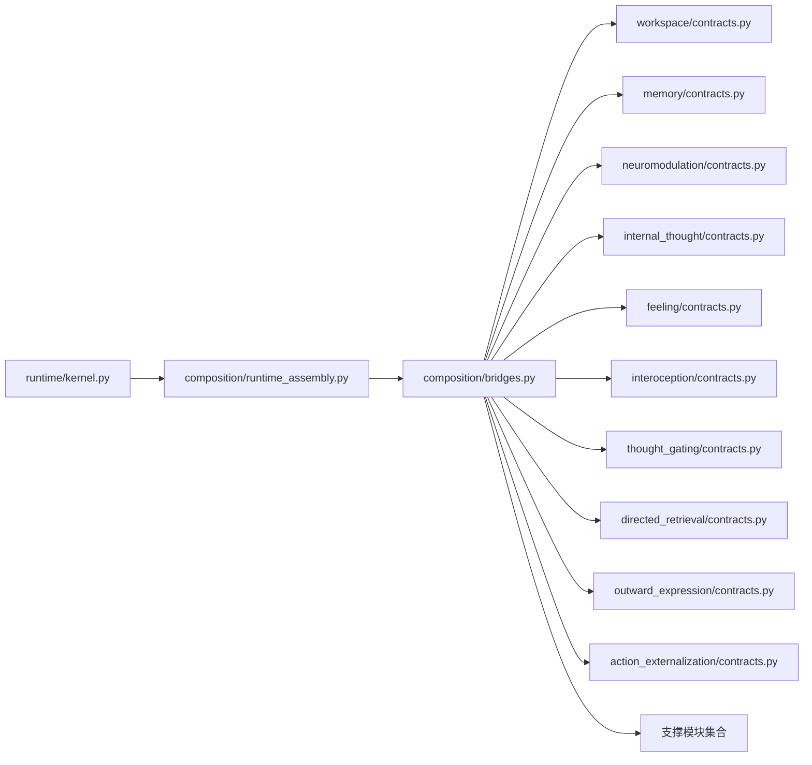

# 模块接口协议

<cite>
**本文引用的文件**
- [appraisal/contracts.py](file://helios_v2/src/helios_v2/appraisal/contracts.py)
- [workspace/contracts.py](file://helios_v2/src/helios_v2/workspace/contracts.py)
- [memory/contracts.py](file://helios_v2/src/helios_v2/memory/contracts.py)
- [neuromodulation/contracts.py](file://helios_v2/src/helios_v2/neuromodulation/contracts.py)
- [channel/contracts.py](file://helios_v2/src/helios_v2/channel/contracts.py)
- [prompt_contract/contracts.py](file://helios_v2/src/helios_v2/prompt_contract/contracts.py)
- [action_externalization/contracts.py](file://helios_v2/src/helios_v2/action_externalization/contracts.py)
- [runtime/kernel.py](file://helios_v2/src/helios_v2/runtime/kernel.py)
- [composition/runtime_assembly.py](file://helios_v2/src/helios_v2/composition/runtime_assembly.py)
- [composition/bridges.py](file://helios_v2/src/helios_v2/composition/bridges.py)
- [composition/dependencies.py](file://helios_v2/src/helios_v2/composition/dependencies.py)
- [sensory/ingress.py](file://helios_v2/src/helios_v2/sensory/ingress.py)
- [interoception/contracts.py](file://helios_v2/src/helios_v2/interoception/contracts.py)
- [feeling/contracts.py](file://helios_v2/src/helios_v2/feeling/contracts.py)
- [thought_gating/contracts.py](file://helios_v2/src/helios_v2/thought_gating/contracts.py)
- [directed_retrieval/contracts.py](file://helios_v2/src/helios_v2/directed_retrieval/contracts.py)
- [internal_thought/contracts.py](file://helios_v2/src/helios_v2/internal_thought/contracts.py)
- [planner_bridge/contracts.py](file://helios_v2/src/helios_v2/planner_bridge/contracts.py)
- [outward_expression/contracts.py](file://helios_v2/src/helios_v2/outward_expression/contracts.py)
- [outward_expression_externalization/contracts.py](file://helios_v2/src/helios_v2/outward_expression_externalization/contracts.py)
- [autonomy/contracts.py](file://helios_v2/src/helios_v2/autonomy/contracts.py)
- [identity_governance/contracts.py](file://helios_v2/src/helios_v2/identity_governance/contracts.py)
- [continuity_checkpoint/contracts.py](file://helios_v2/src/helios_v2/continuity_checkpoint/contracts.py)
- [evaluation/contracts.py](file://helios_v2/src/helios_v2/evaluation/contracts.py)
- [observability/contracts.py](file://helios_v2/src/helios_v2/observability/contracts.py)
- [persistence/contracts.py](file://helios_v2/src/helios_v2/persistence/contracts.py)
- [temporal/engine.py](file://helios_v2/src/helios_v2/temporal/engine.py)
- [llm/contracts.py](file://helios_v2/src/helios_v2/llm/contracts.py)
- [embedding/contracts.py](file://helios_v2/src/helios_v2/embedding/contracts.py)
- [README.md](file://helios_v2/README.md)
- [API_AND_OPS_CONTRACT_GUIDE.md](file://helios_v2/docs/API_AND_OPS_CONTRACT_GUIDE.md)
- [ARCHITECTURE_BOUNDARIES.md](file://helios_v2/docs/ARCHITECTURE_BOUNDARIES.md)
- [brain.mmd](file://helios_v2/docs/brain.mmd)
- [personality_contract.py](file://archive/helios_v1/personality_contract.py)
- [prompt_contract.py](file://archive/helios_v1/helios_io/prompt_contract.py)
- [optional_channel_contract.py](file://archive/helios_v1/helios_io/optional_channel_contract.py)
- [test_prompt_contract.py](file://archive/helios_v1/tests/test_prompt_contract.py)
- [test_memory_retrieval_contract.py](file://archive/helios_v1/tests/test_memory_retrieval_contract.py)
</cite>

## 目录
1. [引言](#引言)
2. [项目结构](#项目结构)
3. [核心组件](#核心组件)
4. [架构总览](#架构总览)
5. [详细组件分析](#详细组件分析)
6. [依赖关系分析](#依赖关系分析)
7. [性能考量](#性能考量)
8. [故障排查指南](#故障排查指南)
9. [结论](#结论)
10. [附录](#附录)

## 引言
本文件系统化阐述 Helios v2 的模块接口协议与契约规范，覆盖感知、工作空间、记忆、神经递质（多巴胺/去甲肾上腺素等）等核心子系统，并说明模块间通信协议、数据交换格式与事件传递机制。文档同时提供接口实现示例、测试方法与向后兼容策略，帮助开发者遵循契约进行扩展与集成。

## 项目结构
Helios v2 将大脑架构拆分为多个自治子系统，每个子系统通过 contracts.py 定义稳定的接口契约，engine.py 实现具体逻辑，runtime 组装这些子系统形成可运行内核。关键目录与职责如下：
- 感知与输入：sensory/ingress.py 负责外部信号接入；channel/contracts.py 规范通道驱动接口。
- 工作空间：workspace/contracts.py 定义竞争与状态管理契约。
- 记忆：memory/contracts.py 定义检索与存储契约；embedding/contracts.py 定义嵌入与索引契约。
- 神经递质：neuromodulation/contracts.py 定义多巴胺/去甲肾上腺素等系统的调节契约。
- 内在思维与情感：internal_thought/contracts.py、feeling/contracts.py、interoception/contracts.py。
- 思维门控与定向检索：thought_gating/contracts.py、directed_retrieval/contracts.py。
- 外显表达与行动外化：outward_expression/contracts.py、action_externalization/contracts.py。
- 运行时与组合：runtime/kernel.py、composition/runtime_assembly.py、composition/bridges.py。
- 其他支撑：planner_bridge/contracts.py、autonomy/contracts.py、identity_governance/contracts.py、continuity_checkpoint/contracts.py、evaluation/contracts.py、observability/contracts.py、persistence/contracts.py、temporal/engine.py、llm/contracts.py。

```mermaid
graph TB
subgraph "运行时内核"
K["kernel.py"]
RA["runtime_assembly.py"]
BR["bridges.py"]
end
subgraph "感知与输入"
S["sensory/ingress.py"]
C["channel/contracts.py"]
end
subgraph "工作空间"
W["workspace/contracts.py"]
end
subgraph "记忆"
M["memory/contracts.py"]
EMB["embedding/contracts.py"]
end
subgraph "神经递质"
N["neuromodulation/contracts.py"]
end
subgraph "内在思维与情感"
IT["internal_thought/contracts.py"]
F["feeling/contracts.py"]
ICP["interoception/contracts.py"]
end
subgraph "思维门控与定向检索"
TG["thought_gating/contracts.py"]
DR["directed_retrieval/contracts.py"]
end
subgraph "外显表达与行动外化"
OE["outward_expression/contracts.py"]
AE["action_externalization/contracts.py"]
end
subgraph "支撑模块"
PB["planner_bridge/contracts.py"]
AU["autonomy/contracts.py"]
IG["identity_governance/contracts.py"]
CC["continuity_checkpoint/contracts.py"]
EV["evaluation/contracts.py"]
OB["observability/contracts.py"]
PE["persistence/contracts.py"]
TM["temporal/engine.py"]
LLM["llm/contracts.py"]
end
K --> RA --> BR
S --> C
BR --> W
BR --> M
BR --> EMB
BR --> N
BR --> IT
BR --> F
BR --> ICP
BR --> TG
BR --> DR
BR --> OE
BR --> AE
BR --> PB
BR --> AU
BR --> IG
BR --> CC
BR --> EV
BR --> OB
BR --> PE
BR --> TM
BR --> LLM
```

图表来源
- [runtime/kernel.py](file://helios_v2/src/helios_v2/runtime/kernel.py)
- [composition/runtime_assembly.py](file://helios_v2/src/helios_v2/composition/runtime_assembly.py)
- [composition/bridges.py](file://helios_v2/src/helios_v2/composition/bridges.py)
- [sensory/ingress.py](file://helios_v2/src/helios_v2/sensory/ingress.py)
- [channel/contracts.py](file://helios_v2/src/helios_v2/channel/contracts.py)
- [workspace/contracts.py](file://helios_v2/src/helios_v2/workspace/contracts.py)
- [memory/contracts.py](file://helios_v2/src/helios_v2/memory/contracts.py)
- [embedding/contracts.py](file://helios_v2/src/helios_v2/embedding/contracts.py)
- [neuromodulation/contracts.py](file://helios_v2/src/helios_v2/neuromodulation/contracts.py)
- [internal_thought/contracts.py](file://helios_v2/src/helios_v2/internal_thought/contracts.py)
- [feeling/contracts.py](file://helios_v2/src/helios_v2/feeling/contracts.py)
- [interoception/contracts.py](file://helios_v2/src/helios_v2/interoception/contracts.py)
- [thought_gating/contracts.py](file://helios_v2/src/helios_v2/thought_gating/contracts.py)
- [directed_retrieval/contracts.py](file://helios_v2/src/helios_v2/directed_retrieval/contracts.py)
- [outward_expression/contracts.py](file://helios_v2/src/helios_v2/outward_expression/contracts.py)
- [action_externalization/contracts.py](file://helios_v2/src/helios_v2/action_externalization/contracts.py)
- [planner_bridge/contracts.py](file://helios_v2/src/helios_v2/planner_bridge/contracts.py)
- [autonomy/contracts.py](file://helios_v2/src/helios_v2/autonomy/contracts.py)
- [identity_governance/contracts.py](file://helios_v2/src/helios_v2/identity_governance/contracts.py)
- [continuity_checkpoint/contracts.py](file://helios_v2/src/helios_v2/continuity_checkpoint/contracts.py)
- [evaluation/contracts.py](file://helios_v2/src/helios_v2/evaluation/contracts.py)
- [observability/contracts.py](file://helios_v2/src/helios_v2/observability/contracts.py)
- [persistence/contracts.py](file://helios_v2/src/helios_v2/persistence/contracts.py)
- [temporal/engine.py](file://helios_v2/src/helios_v2/temporal/engine.py)
- [llm/contracts.py](file://helios_v2/src/helios_v2/llm/contracts.py)

章节来源
- [README.md](file://helios_v2/README.md)
- [API_AND_OPS_CONTRACT_GUIDE.md](file://helios_v2/docs/API_AND_OPS_CONTRACT_GUIDE.md)
- [ARCHITECTURE_BOUNDARIES.md](file://helios_v2/docs/ARCHITECTURE_BOUNDARIES.md)
- [brain.mmd](file://helios_v2/docs/brain.mmd)

## 核心组件
本节概述各功能模块的契约边界与交互方式，强调“稳定接口 + 可替换实现”的设计原则。

- 感知模块（sensory/ingress.py + channel/contracts.py）
  - 输入通道契约：定义通道驱动的注册、配置、事件回调与生命周期钩子。
  - 感知入口：统一将外部信号（文本、语音、视觉、QQ消息等）转换为内部事件流。
- 工作空间模块（workspace/contracts.py）
  - 契约要点：竞争窗口管理、优先级评分、状态切换、时间片分配。
- 记忆模块（memory/contracts.py + embedding/contracts.py）
  - 契约要点：检索、压缩、持久化、上下文注入；嵌入用于相似度匹配与索引。
- 神经递质模块（neuromodulation/contracts.py）
  - 契约要点：多巴胺/去甲肾上腺素等的动态调节、与认知/情感/动机的耦合。
- 内在思维与情感（internal_thought/contracts.py + feeling/contracts.py + interoception/contracts.py）
  - 契约要点：内在对话生成、主观感受建模、躯体信号感知与情绪化处理。
- 思维门控与定向检索（thought_gating/contracts.py + directed_retrieval/contracts.py）
  - 契约要点：思维连续性控制、目标导向的检索意图与结果整合。
- 外显表达与行动外化（outward_expression/contracts.py + action_externalization/contracts.py）
  - 契约要点：表达决策、动作提案、外部化输出与反馈闭环。
- 支撑模块（planner_bridge/contracts.py + autonomy/contracts.py + identity_governance/contracts.py + continuity_checkpoint/contracts.py + evaluation/contracts.py + observability/contracts.py + persistence/contracts.py + temporal/engine.py + llm/contracts.py）
  - 契约要点：计划-执行桥接、自主性驱动、身份治理、断点续跑、评估与可观测性、持久化、时间节奏、大模型推理。

章节来源
- [sensory/ingress.py](file://helios_v2/src/helios_v2/sensory/ingress.py)
- [channel/contracts.py](file://helios_v2/src/helios_v2/channel/contracts.py)
- [workspace/contracts.py](file://helios_v2/src/helios_v2/workspace/contracts.py)
- [memory/contracts.py](file://helios_v2/src/helios_v2/memory/contracts.py)
- [embedding/contracts.py](file://helios_v2/src/helios_v2/embedding/contracts.py)
- [neuromodulation/contracts.py](file://helios_v2/src/helios_v2/neuromodulation/contracts.py)
- [internal_thought/contracts.py](file://helios_v2/src/helios_v2/internal_thought/contracts.py)
- [feeling/contracts.py](file://helios_v2/src/helios_v2/feeling/contracts.py)
- [interoception/contracts.py](file://helios_v2/src/helios_v2/interoception/contracts.py)
- [thought_gating/contracts.py](file://helios_v2/src/helios_v2/thought_gating/contracts.py)
- [directed_retrieval/contracts.py](file://helios_v2/src/helios_v2/directed_retrieval/contracts.py)
- [outward_expression/contracts.py](file://helios_v2/src/helios_v2/outward_expression/contracts.py)
- [action_externalization/contracts.py](file://helios_v2/src/helios_v2/action_externalization/contracts.py)
- [planner_bridge/contracts.py](file://helios_v2/src/helios_v2/planner_bridge/contracts.py)
- [autonomy/contracts.py](file://helios_v2/src/helios_v2/autonomy/contracts.py)
- [identity_governance/contracts.py](file://helios_v2/src/helios_v2/identity_governance/contracts.py)
- [continuity_checkpoint/contracts.py](file://helios_v2/src/helios_v2/continuity_checkpoint/contracts.py)
- [evaluation/contracts.py](file://helios_v2/src/helios_v2/evaluation/contracts.py)
- [observability/contracts.py](file://helios_v2/src/helios_v2/observability/contracts.py)
- [persistence/contracts.py](file://helios_v2/src/helios_v2/persistence/contracts.py)
- [temporal/engine.py](file://helios_v2/src/helios_v2/temporal/engine.py)
- [llm/contracts.py](file://helios_v2/src/helios_v2/llm/contracts.py)

## 架构总览
Helios v2 采用“运行时内核 + 子系统契约 + 组合桥接”的分层架构。运行时内核负责调度与生命周期管理，组合模块负责装配与桥接不同子系统，子系统各自通过 contracts.py 提供稳定接口，engine.py 实现具体逻辑。

图表来源
- [runtime/kernel.py](file://helios_v2/src/helios_v2/runtime/kernel.py)
- [composition/runtime_assembly.py](file://helios_v2/src/helios_v2/composition/runtime_assembly.py)
- [composition/bridges.py](file://helios_v2/src/helios_v2/composition/bridges.py)

章节来源
- [runtime/kernel.py](file://helios_v2/src/helios_v2/runtime/kernel.py)
- [composition/runtime_assembly.py](file://helios_v2/src/helios_v2/composition/runtime_assembly.py)
- [composition/bridges.py](file://helios_v2/src/helios_v2/composition/bridges.py)

## 详细组件分析

### 感知模块（输入通道与协议）
- 通道契约（channel/contracts.py）
  - 定义通道驱动的注册、配置、事件回调与生命周期钩子，确保不同输入源（CLI、QQ、STT、TTS、Vision）以统一协议接入。
  - 关键点：事件类型、回调签名、错误传播、资源释放。
- 感知入口（sensory/ingress.py）
  - 将外部输入标准化为内部事件，支持多模态融合与预处理。
- 协议与数据交换
  - 输入事件结构：包含来源标识、时间戳、负载类型与载荷。
  - 输出事件结构：包含目标子系统、意图标签、上下文令牌。
- 事件传递机制
  - 通过运行时桥接转发至工作空间或记忆模块，触发后续处理链。

图表来源
- [channel/contracts.py](file://helios_v2/src/helios_v2/channel/contracts.py)
- [sensory/ingress.py](file://helios_v2/src/helios_v2/sensory/ingress.py)
- [composition/bridges.py](file://helios_v2/src/helios_v2/composition/bridges.py)
- [workspace/contracts.py](file://helios_v2/src/helios_v2/workspace/contracts.py)

章节来源
- [channel/contracts.py](file://helios_v2/src/helios_v2/channel/contracts.py)
- [sensory/ingress.py](file://helios_v2/src/helios_v2/sensory/ingress.py)
- [workspace/contracts.py](file://helios_v2/src/helios_v2/workspace/contracts.py)

### 工作空间模块（竞争与状态）
- 契约要点
  - 竞争窗口：多条候选内容/意图的竞争与评分。
  - 状态机：空闲、竞争、锁定、执行、清理。
  - 时间片：基于时间门控的时间分配与切换。
- 数据交换
  - 输入：来自感知与记忆的候选内容。
  - 输出：锁定的当前内容、状态变更事件。
- 错误处理
  - 竞争超时、评分异常、状态不一致时的回退策略。

图表来源
- [workspace/contracts.py](file://helios_v2/src/helios_v2/workspace/contracts.py)

章节来源
- [workspace/contracts.py](file://helios_v2/src/helios_v2/workspace/contracts.py)

### 记忆模块（检索与存储）
- 契约要点
  - 检索：基于语义相似度与上下文权重的定向检索。
  - 压缩：长期记忆压缩与去冗余。
  - 持久化：跨会话的可恢复存储。
- 嵌入契约（embedding/contracts.py）
  - 定义向量嵌入、索引构建与相似度查询接口。
- 数据交换
  - 输入：检索关键词、上下文令牌、时间窗口。
  - 输出：检索结果列表、相关度分数、元信息。
- 事件传递
  - 检索触发工作空间锁定，或作为定向检索的上游。

图表来源
- [memory/contracts.py](file://helios_v2/src/helios_v2/memory/contracts.py)
- [embedding/contracts.py](file://helios_v2/src/helios_v2/embedding/contracts.py)
- [workspace/contracts.py](file://helios_v2/src/helios_v2/workspace/contracts.py)

章节来源
- [memory/contracts.py](file://helios_v2/src/helios_v2/memory/contracts.py)
- [embedding/contracts.py](file://helios_v2/src/helios_v2/embedding/contracts.py)

### 神经递质模块（多巴胺/去甲肾上腺素）
- 契约要点
  - 动态调节：根据认知负荷、不确定性、奖励预测误差调整多巴胺/去甲肾上腺素水平。
  - 耦合机制：与工作空间竞争、记忆巩固、情感体验的耦合。
- 数据交换
  - 输入：任务难度、错误率、时间压力、情绪强度。
  - 输出：调节因子（如增强/抑制权重），影响后续决策与学习。
- 事件传递
  - 作为调节器参与工作空间评分与记忆压缩权重。

图表来源
- [neuromodulation/contracts.py](file://helios_v2/src/helios_v2/neuromodulation/contracts.py)

章节来源
- [neuromodulation/contracts.py](file://helios_v2/src/helios_v2/neuromodulation/contracts.py)

### 内在思维与情感（内部思考、感受与躯体感知）
- 内在思维（internal_thought/contracts.py）
  - 契约：内部对话生成、自我反思、问题分解与聚合。
- 感受（feeling/contracts.py）
  - 契约：主观感受建模、强度与极性、与记忆/动机的关联。
- 躯体感知（interoception/contracts.py）
  - 契约：心率、呼吸、压力等信号的感知与情绪化解释。
- 事件传递
  - 内在思维与感受共同影响工作空间锁定与表达决策。

图表来源
- [internal_thought/contracts.py](file://helios_v2/src/helios_v2/internal_thought/contracts.py)
- [feeling/contracts.py](file://helios_v2/src/helios_v2/feeling/contracts.py)
- [interoception/contracts.py](file://helios_v2/src/helios_v2/interoception/contracts.py)
- [workspace/contracts.py](file://helios_v2/src/helios_v2/workspace/contracts.py)

章节来源
- [internal_thought/contracts.py](file://helios_v2/src/helios_v2/internal_thought/contracts.py)
- [feeling/contracts.py](file://helios_v2/src/helios_v2/feeling/contracts.py)
- [interoception/contracts.py](file://helios_v2/src/helios_v2/interoception/contracts.py)
- [workspace/contracts.py](file://helios_v2/src/helios_v2/workspace/contracts.py)

### 思维门控与定向检索
- 思维门控（thought_gating/contracts.py）
  - 契约：控制思维连续性、抑制无关内容、维持焦点。
- 定向检索（directed_retrieval/contracts.py）
  - 契约：根据目标意图从记忆中提取相关内容，形成上下文。
- 数据交换
  - 输入：目标意图、当前上下文、时间窗口。
  - 输出：检索结果与门控后的思维流。

图表来源
- [thought_gating/contracts.py](file://helios_v2/src/helios_v2/thought_gating/contracts.py)
- [directed_retrieval/contracts.py](file://helios_v2/src/helios_v2/directed_retrieval/contracts.py)

章节来源
- [thought_gating/contracts.py](file://helios_v2/src/helios_v2/thought_gating/contracts.py)
- [directed_retrieval/contracts.py](file://helios_v2/src/helios_v2/directed_retrieval/contracts.py)

### 外显表达与行动外化
- 外显表达（outward_expression/contracts.py）
  - 契约：表达决策、语气/风格、渠道选择。
- 行动外化（action_externalization/contracts.py）
  - 契约：动作提案、可行性评估、外部化执行。
- 数据交换
  - 输入：表达意图、动作意图、上下文。
  - 输出：表达内容、动作序列、执行反馈。

图表来源
- [outward_expression/contracts.py](file://helios_v2/src/helios_v2/outward_expression/contracts.py)
- [action_externalization/contracts.py](file://helios_v2/src/helios_v2/action_externalization/contracts.py)

章节来源
- [outward_expression/contracts.py](file://helios_v2/src/helios_v2/outward_expression/contracts.py)
- [action_externalization/contracts.py](file://helios_v2/src/helios_v2/action_externalization/contracts.py)

### 支撑模块（自主性、身份治理、评估、可观测性、持久化、时间、LLM）
- 自主性（autonomy/contracts.py）
  - 契约：驱动与目标的自组织演化，避免过度外部约束。
- 身份治理（identity_governance/contracts.py）
  - 契约：自我概念的形成与修订，一致性与稳定性平衡。
- 评估（evaluation/contracts.py）
  - 契约：行为与结果的评估、诊断与溯源。
- 可观测性（observability/contracts.py）
  - 契约：运行时日志、指标、事件记录与可视化。
- 持久化（persistence/contracts.py）
  - 契约：状态与经验的跨会话保存与恢复。
- 时间（temporal/engine.py）
  - 契约：时间步进、节奏控制、门控与周期性。
- LLM（llm/contracts.py）
  - 契约：提示工程、推理与输出质量控制。

章节来源
- [autonomy/contracts.py](file://helios_v2/src/helios_v2/autonomy/contracts.py)
- [identity_governance/contracts.py](file://helios_v2/src/helios_v2/identity_governance/contracts.py)
- [evaluation/contracts.py](file://helios_v2/src/helios_v2/evaluation/contracts.py)
- [observability/contracts.py](file://helios_v2/src/helios_v2/observability/contracts.py)
- [persistence/contracts.py](file://helios_v2/src/helios_v2/persistence/contracts.py)
- [temporal/engine.py](file://helios_v2/src/helios_v2/temporal/engine.py)
- [llm/contracts.py](file://helios_v2/src/helios_v2/llm/contracts.py)

## 依赖关系分析
- 组件耦合
  - 运行时内核与装配模块高度内聚，子系统通过契约解耦。
  - 桥接模块承担跨子系统的协调与路由职责。
- 外部依赖
  - LLM 推理、嵌入向量化、数据库持久化等由独立依赖提供。
- 循环依赖
  - 通过契约与桥接避免直接循环引用，保持单向数据流。

图表来源
- [runtime/kernel.py](file://helios_v2/src/helios_v2/runtime/kernel.py)
- [composition/runtime_assembly.py](file://helios_v2/src/helios_v2/composition/runtime_assembly.py)
- [composition/bridges.py](file://helios_v2/src/helios_v2/composition/bridges.py)

章节来源
- [composition/dependencies.py](file://helios_v2/src/helios_v2/composition/dependencies.py)

## 性能考量
- 向量检索与相似度计算
  - 使用嵌入契约优化索引与批量查询，减少延迟。
- 竞争与门控
  - 控制候选数量与评分复杂度，避免过载。
- 时间门控与节流
  - 通过时间引擎限制高频操作，保证系统稳定性。
- 持久化与压缩
  - 记忆压缩与去冗余降低存储与I/O开销。
- LLM 推理
  - 通过提示契约与缓存策略减少重复计算。

## 故障排查指南
- 通道驱动问题
  - 检查通道契约中的事件回调是否正确注册与释放；确认输入事件格式与路由。
- 工作空间卡死
  - 检查竞争评分异常、状态机不一致与时间片分配；必要时触发回退流程。
- 记忆检索无结果
  - 检查嵌入向量化是否成功、索引是否完整、检索参数是否合理。
- 神经递质调节异常
  - 检查输入指标是否缺失或异常，调节模型参数是否越界。
- 外显表达/行动失败
  - 检查表达决策与动作提案的上下文完整性，以及外部输出渠道可用性。
- 可观测性与评估
  - 确认可观测性契约已启用，日志与指标采集正常；评估结果可溯源。

章节来源
- [channel/contracts.py](file://helios_v2/src/helios_v2/channel/contracts.py)
- [workspace/contracts.py](file://helios_v2/src/helios_v2/workspace/contracts.py)
- [memory/contracts.py](file://helios_v2/src/helios_v2/memory/contracts.py)
- [embedding/contracts.py](file://helios_v2/src/helios_v2/embedding/contracts.py)
- [neuromodulation/contracts.py](file://helios_v2/src/helios_v2/neuromodulation/contracts.py)
- [outward_expression/contracts.py](file://helios_v2/src/helios_v2/outward_expression/contracts.py)
- [action_externalization/contracts.py](file://helios_v2/src/helios_v2/action_externalization/contracts.py)
- [observability/contracts.py](file://helios_v2/src/helios_v2/observability/contracts.py)
- [evaluation/contracts.py](file://helios_v2/src/helios_v2/evaluation/contracts.py)

## 结论
Helios v2 的模块接口协议以“契约稳定、实现可替换”为核心设计原则，通过运行时内核与桥接模块实现子系统的松耦合协作。感知、工作空间、记忆、神经递质、内在思维与情感、思维门控与定向检索、外显表达与行动外化等模块均通过 contracts.py 明确定义接口，配合持久化、评估、可观测性与时间节奏等支撑模块，形成可扩展、可演化的智能体运行框架。

## 附录

### 接口实现示例（路径指引）
- 感知通道实现
  - 参考路径：[channel/contracts.py](file://helios_v2/src/helios_v2/channel/contracts.py)
- 工作空间实现
  - 参考路径：[workspace/contracts.py](file://helios_v2/src/helios_v2/workspace/contracts.py)
- 记忆检索实现
  - 参考路径：[memory/contracts.py](file://helios_v2/src/helios_v2/memory/contracts.py)
- 嵌入实现
  - 参考路径：[embedding/contracts.py](file://helios_v2/src/helios_v2/embedding/contracts.py)
- 神经递质调节实现
  - 参考路径：[neuromodulation/contracts.py](file://helios_v2/src/helios_v2/neuromodulation/contracts.py)
- 内在思维/感受/躯体感知实现
  - 参考路径：[internal_thought/contracts.py](file://helios_v2/src/helios_v2/internal_thought/contracts.py)
  - 参考路径：[feeling/contracts.py](file://helios_v2/src/helios_v2/feeling/contracts.py)
  - 参考路径：[interoception/contracts.py](file://helios_v2/src/helios_v2/interoception/contracts.py)
- 思维门控与定向检索实现
  - 参考路径：[thought_gating/contracts.py](file://helios_v2/src/helios_v2/thought_gating/contracts.py)
  - 参考路径：[directed_retrieval/contracts.py](file://helios_v2/src/helios_v2/directed_retrieval/contracts.py)
- 外显表达与行动外化实现
  - 参考路径：[outward_expression/contracts.py](file://helios_v2/src/helios_v2/outward_expression/contracts.py)
  - 参考路径：[action_externalization/contracts.py](file://helios_v2/src/helios_v2/action_externalization/contracts.py)
- 支撑模块实现
  - 参考路径：[autonomy/contracts.py](file://helios_v2/src/helios_v2/autonomy/contracts.py)
  - 参考路径：[identity_governance/contracts.py](file://helios_v2/src/helios_v2/identity_governance/contracts.py)
  - 参考路径：[continuity_checkpoint/contracts.py](file://helios_v2/src/helios_v2/continuity_checkpoint/contracts.py)
  - 参考路径：[evaluation/contracts.py](file://helios_v2/src/helios_v2/evaluation/contracts.py)
  - 参考路径：[observability/contracts.py](file://helios_v2/src/helios_v2/observability/contracts.py)
  - 参考路径：[persistence/contracts.py](file://helios_v2/src/helios_v2/persistence/contracts.py)
  - 参考路径：[temporal/engine.py](file://helios_v2/src/helios_v2/temporal/engine.py)
  - 参考路径：[llm/contracts.py](file://helios_v2/src/helios_v2/llm/contracts.py)

### 接口测试与兼容性
- 测试策略
  - 针对 contracts.py 的契约进行单元测试，验证输入输出格式与边界条件。
  - 使用合成数据与模拟事件驱动端到端集成测试。
- 向后兼容
  - 新增字段采用默认值策略；删除字段保留兼容层；严格遵循版本号与弃用周期。
- 文档与规范
  - 参考 API 与运维契约指南与架构边界文档，确保实现与设计一致。

章节来源
- [API_AND_OPS_CONTRACT_GUIDE.md](file://helios_v2/docs/API_AND_OPS_CONTRACT_GUIDE.md)
- [ARCHITECTURE_BOUNDARIES.md](file://helios_v2/docs/ARCHITECTURE_BOUNDARIES.md)
- [brain.mmd](file://helios_v2/docs/brain.mmd)

### 历史版本参考（v1）
- v1 中的提示契约与可选通道契约可用于理解接口演进与兼容策略。
- 参考路径：
  - [prompt_contract.py](file://archive/helios_v1/helios_io/prompt_contract.py)
  - [optional_channel_contract.py](file://archive/helios_v1/helios_io/optional_channel_contract.py)
  - [personality_contract.py](file://archive/helios_v1/personality_contract.py)
  - [test_prompt_contract.py](file://archive/helios_v1/tests/test_prompt_contract.py)
  - [test_memory_retrieval_contract.py](file://archive/helios_v1/tests/test_memory_retrieval_contract.py)

章节来源
- [prompt_contract.py](file://archive/helios_v1/helios_io/prompt_contract.py)
- [optional_channel_contract.py](file://archive/helios_v1/helios_io/optional_channel_contract.py)
- [personality_contract.py](file://archive/helios_v1/personality_contract.py)
- [test_prompt_contract.py](file://archive/helios_v1/tests/test_prompt_contract.py)
- [test_memory_retrieval_contract.py](file://archive/helios_v1/tests/test_memory_retrieval_contract.py)