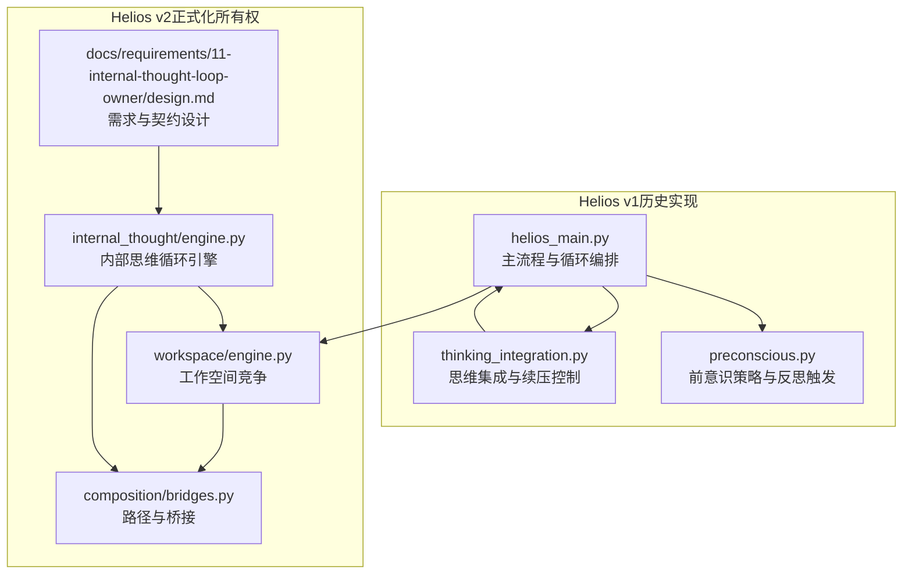
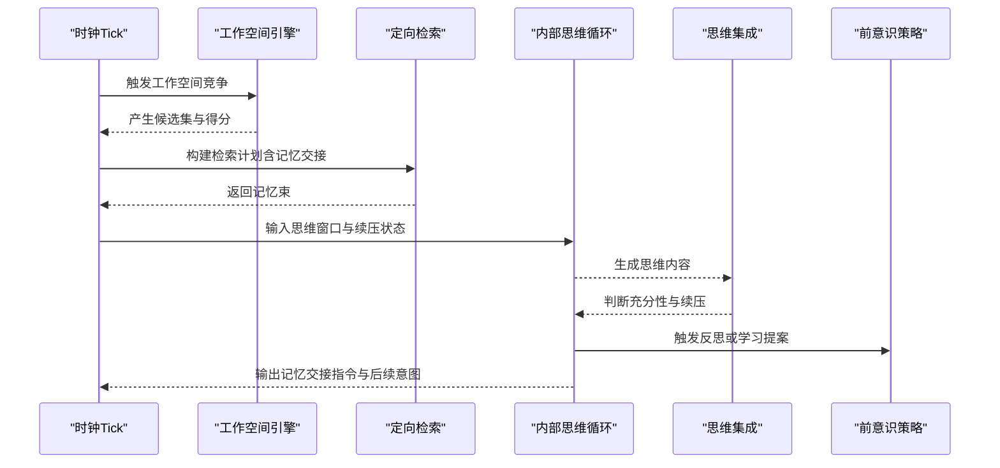
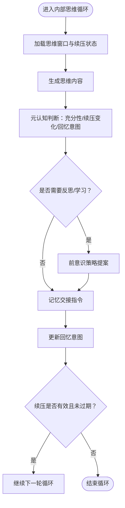
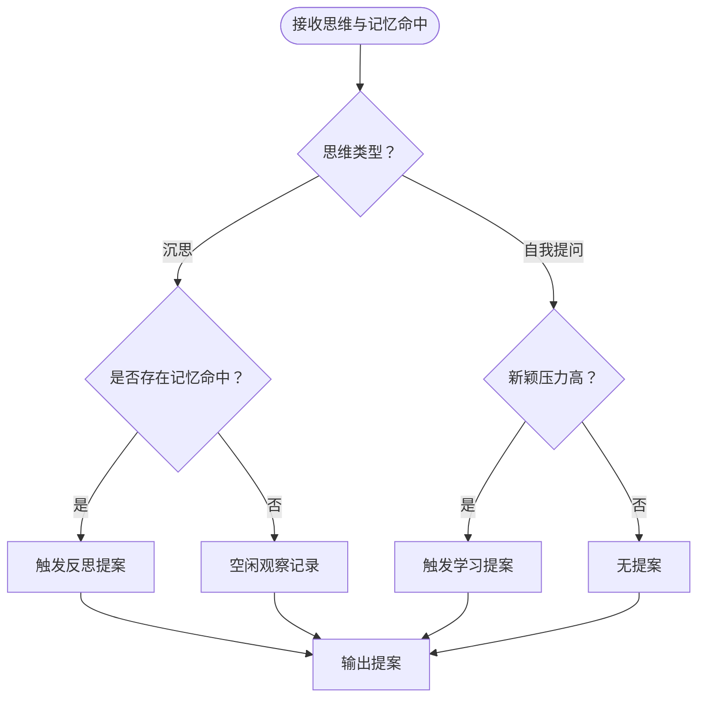
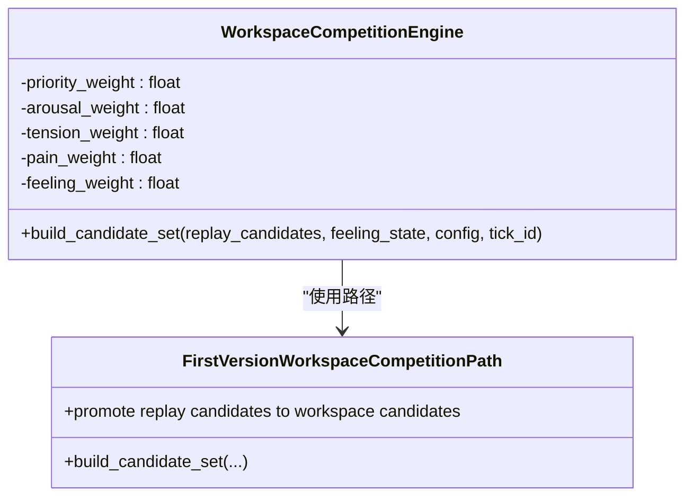
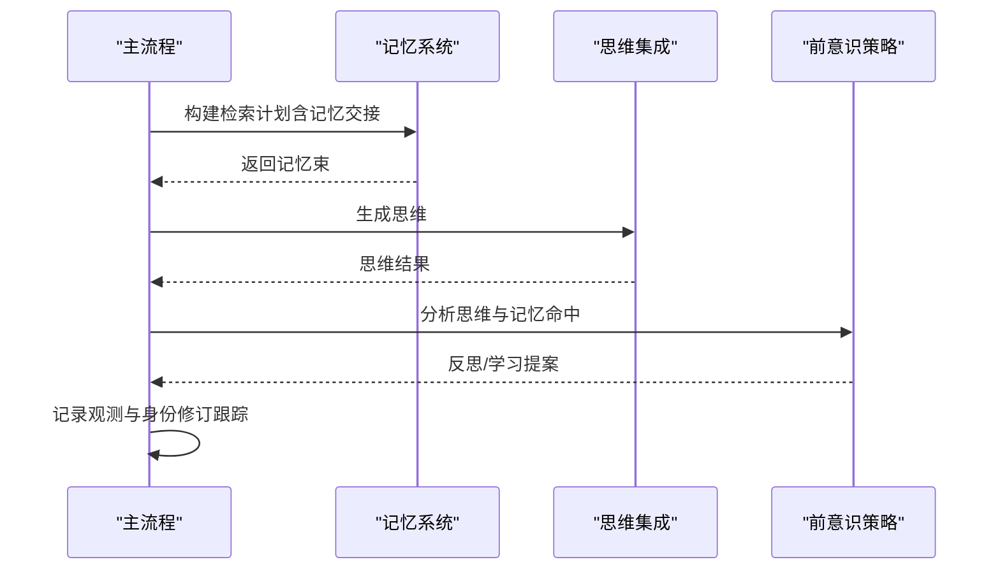
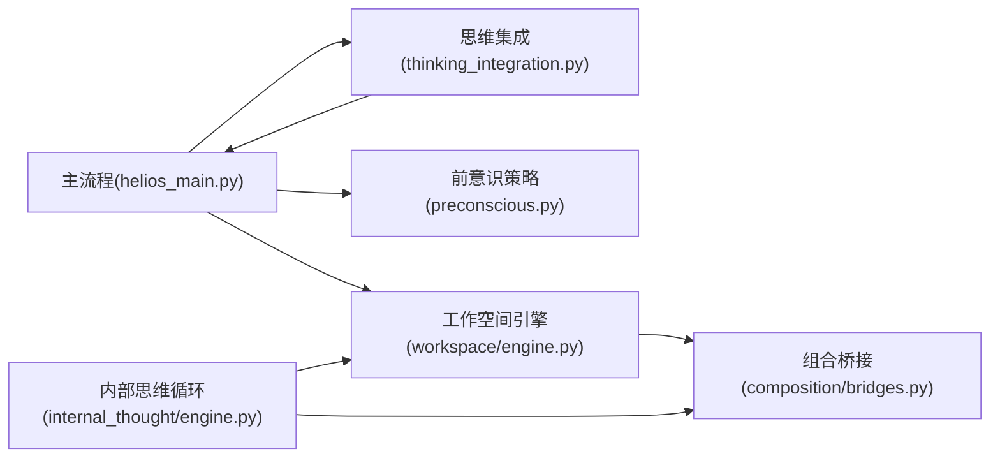

# 内省思维循环

<cite>
**本文引用的文件**   
- [helios_main.py](file://archive/helios_v1/helios_main.py)
- [thinking_integration.py](file://archive/helios_v1/cognition/thinking_integration.py)
- [preconscious.py](file://archive/helios_v1/cognition/preconscious.py)
- [design.md](file://helios_v2/docs/requirements/11-internal-thought-loop-owner/design.md)
- [engine.py](file://helios_v2/src/helios_v2/internal_thought/engine.py)
- [engine.py](file://helios_v2/src/helios_v2/workspace/engine.py)
- [bridges.py](file://helios_v2/src/helios_v2/composition/bridges.py)
- [test_internal_thought_engine.py](file://helios_v2/tests/test_internal_thought_engine.py)
- [test_thinking_integration_pbt.py](file://archive/helios_v1/tests/test_thinking_integration_pbt.py)
- [test_preconscious_policy.py](file://archive/helios_v1/tests/test_preconscious_policy.py)
</cite>

## 目录
1. [引言](#引言)
2. [项目结构](#项目结构)
3. [核心组件](#核心组件)
4. [架构总览](#架构总览)
5. [详细组件分析](#详细组件分析)
6. [依赖分析](#依赖分析)
7. [性能考量](#性能考量)
8. [故障排查指南](#故障排查指南)
9. [结论](#结论)
10. [附录](#附录)

## 引言
本文件聚焦于Helios内省思维循环模块，系统阐述其生成机制、思考序列维护、反思过程控制逻辑，以及与工作空间竞争、情感反馈的交互关系。文档覆盖思维模板系统、自指逻辑、元认知处理与思考深度控制，并通过状态机设计、递归处理与终止条件说明，给出可操作的使用示例与优化建议。

## 项目结构
内省思维循环在Helios v1中由主流程驱动，结合记忆定向检索与思维集成引擎；在Helios v2中，该循环被正式化为“内部思维循环”所有权模块，强调契约化设计与可观察性。整体结构如下：

**图示来源**
- [helios_main.py:1140-1281](file://archive/helios_v1/helios_main.py#L1140-L1281)
- [thinking_integration.py:866-895](file://archive/helios_v1/cognition/thinking_integration.py#L866-L895)
- [preconscious.py](file://archive/helios_v1/cognition/preconscious.py)
- [engine.py](file://helios_v2/src/helios_v2/internal_thought/engine.py)
- [engine.py](file://helios_v2/src/helios_v2/workspace/engine.py)
- [bridges.py](file://helios_v2/src/helios_v2/composition/bridges.py)
- [design.md:1-18](file://helios_v2/docs/requirements/11-internal-thought-loop-owner/design.md#L1-L18)

**章节来源**
- [helios_main.py:1140-1281](file://archive/helios_v1/helios_main.py#L1140-L1281)
- [design.md:1-18](file://helios_v2/docs/requirements/11-internal-thought-loop-owner/design.md#L1-L18)

## 核心组件
- 思维生成与续压控制：v1通过思维集成引擎管理思考深度、续压衰减与终止条件；v2将此职责明确为内部思维循环的所有权边界。
- 前意识策略与反思触发：在v1中，前意识策略根据思维类型与记忆命中决定是否触发反思或学习行为。
- 工作空间竞争与上下文窗口：v2的工作空间引擎将情感与记忆回放缓冲转化为候选，参与竞争以形成报告性意识窗口。
- 记忆定向检索与模板化意图：v1在循环中构建检索计划，携带上一周期的记忆交接指令，形成“模板化回忆意图”。

**章节来源**
- [thinking_integration.py:866-895](file://archive/helios_v1/cognition/thinking_integration.py#L866-L895)
- [preconscious.py](file://archive/helios_v1/cognition/preconscious.py)
- [engine.py](file://helios_v2/src/helios_v2/workspace/engine.py)
- [engine.py](file://helios_v2/src/helios_v2/internal_thought/engine.py)

## 架构总览
内省思维循环的总体流程包括：工作空间竞争形成思维窗口 → 定向检索与模板化意图 → 思维生成与元认知判断 → 反思与续压控制 → 记忆交接与后续循环。

**图示来源**
- [helios_main.py:1140-1281](file://archive/helios_v1/helios_main.py#L1140-L1281)
- [engine.py](file://helios_v2/src/helios_v2/workspace/engine.py)
- [engine.py](file://helios_v2/src/helios_v2/internal_thought/engine.py)
- [thinking_integration.py:866-895](file://archive/helios_v1/cognition/thinking_integration.py#L866-L895)
- [preconscious.py](file://archive/helios_v1/cognition/preconscious.py)

## 详细组件分析

### 组件A：思维生成与续压控制（v1 → v2契约化）
- 生成机制：v1在主流程中调用思维集成引擎生成思维内容；v2将此过程作为内部思维循环的“已验证请求”的执行阶段，强调契约化输入与输出。
- 续压与终止：v1通过续压状态对象记录来源思维、原因、过期Tick与累计携带次数；当续压水平降至阈值以下或过期时清空续压，停止继续循环。
- 元认知判断：v2内部思维引擎负责从检索窗口、续压状态、请求与思维内容综合推导充分性、续压变化、回忆意图与记忆交接指令。

**图示来源**
- [thinking_integration.py:866-895](file://archive/helios_v1/cognition/thinking_integration.py#L866-L895)
- [engine.py](file://helios_v2/src/helios_v2/internal_thought/engine.py)

**章节来源**
- [thinking_integration.py:866-895](file://archive/helios_v1/cognition/thinking_integration.py#L866-L895)
- [engine.py](file://helios_v2/src/helios_v2/internal_thought/engine.py)

### 组件B：前意识策略与反思触发
- 触发规则：当最近一次思维为沉思型且存在记忆命中时，优先触发反思；当思维为自我提问且处于新颖压力下，倾向触发学习行为。
- 提案载体：策略返回行为名称、来源类型、约束等，供后续决策使用。

**图示来源**
- [preconscious.py](file://archive/helios_v1/cognition/preconscious.py)

**章节来源**
- [preconscious.py](file://archive/helios_v1/cognition/preconscious.py)
- [test_preconscious_policy.py:82-112](file://archive/helios_v1/tests/test_preconscious_policy.py#L82-L112)

### 组件C：工作空间竞争与上下文窗口
- 竞争权重：v2工作空间引擎对优先级、唤醒度、紧张度、疼痛感与情感强度加权，生成候选得分，用于形成思维窗口。
- 路径桥接：组合层提供确定性路径，将强制巩固的回放缓冲直接转化为工作空间候选，保留来源与情感证明。

**图示来源**
- [engine.py](file://helios_v2/src/helios_v2/workspace/engine.py)
- [bridges.py:624-646](file://helios_v2/src/helios_v2/composition/bridges.py#L624-L646)

**章节来源**
- [engine.py](file://helios_v2/src/helios_v2/workspace/engine.py)
- [bridges.py:624-646](file://helios_v2/src/helios_v2/composition/bridges.py#L624-L646)

### 组件D：v1主流程中的内省循环（端到端）
- 循环步骤：构建检索计划（携带记忆交接）、定向检索、生成思维、前意识策略提案、动作桥接提案、记录观测快照。
- 续压衰减：在空闲Tick中，续压状态按策略衰减，最终可能触发“无思维”的空闲观察。

**图示来源**
- [helios_main.py:1140-1281](file://archive/helios_v1/helios_main.py#L1140-L1281)
- [test_thinking_integration_pbt.py:784-802](file://archive/helios_v1/tests/test_thinking_integration_pbt.py#L784-L802)

**章节来源**
- [helios_main.py:1140-1281](file://archive/helios_v1/helios_main.py#L1140-L1281)
- [test_thinking_integration_pbt.py:784-802](file://archive/helios_v1/tests/test_thinking_integration_pbt.py#L784-L802)

## 依赖分析
- v1主流程依赖思维集成引擎与前意识策略；v2内部思维循环依赖工作空间引擎与组合层路径。
- 续压状态在v1中贯穿主流程与思维集成；在v2中由内部思维循环统一推导与更新。
- 记忆交接指令在v1中由主流程构建检索计划时携带；在v2中由内部思维循环产出并传递给后续阶段。

**图示来源**
- [helios_main.py:1140-1281](file://archive/helios_v1/helios_main.py#L1140-L1281)
- [thinking_integration.py:866-895](file://archive/helios_v1/cognition/thinking_integration.py#L866-L895)
- [engine.py](file://helios_v2/src/helios_v2/workspace/engine.py)
- [bridges.py:624-646](file://helios_v2/src/helios_v2/composition/bridges.py#L624-L646)
- [engine.py](file://helios_v2/src/helios_v2/internal_thought/engine.py)

**章节来源**
- [helios_main.py:1140-1281](file://archive/helios_v1/helios_main.py#L1140-L1281)
- [engine.py](file://helios_v2/src/helios_v2/internal_thought/engine.py)

## 性能考量
- 续压衰减策略：在空闲Tick中降低续压水平，避免无效循环；合理设置过期Tick与衰减幅度，平衡思考深度与资源消耗。
- 检索计划限制：限定检索数量与目标层级，防止过度回放导致的认知负担。
- 候选评分权重：在工作空间竞争中，适度调整情感与优先级权重，提升窗口质量与稳定性。
- 测试验证：通过PBT测试确保续压状态在空闲Tick下的正确衰减与循环终止。

**章节来源**
- [test_thinking_integration_pbt.py:784-802](file://archive/helios_v1/tests/test_thinking_integration_pbt.py#L784-L802)
- [engine.py](file://helios_v2/src/helios_v2/workspace/engine.py)

## 故障排查指南
- 续压未触发：检查思维类型与内容是否满足反思条件；确认前意识策略的提案分支。
- 循环未终止：核查续压状态的level、expires_at_tick与carry_count；确认空闲Tick衰减逻辑生效。
- 记忆交接异常：核对检索计划的metadata与selected_memory_refs；检查内部思维循环的记忆交接指令生成。
- 上下文窗口不稳定：调整工作空间竞争权重与强制巩固策略；验证回放缓冲来源与情感证明。

**章节来源**
- [thinking_integration.py:866-895](file://archive/helios_v1/cognition/thinking_integration.py#L866-L895)
- [preconscious.py](file://archive/helios_v1/cognition/preconscious.py)
- [engine.py](file://helios_v2/src/helios_v2/workspace/engine.py)

## 结论
内省思维循环在Helios中经历了从流程混入到契约化所有权的演进。v1通过主流程与思维集成引擎实现了基本的反思与续压控制；v2则以“内部思维循环”为核心，明确了契约边界、可观测性与可扩展性。结合工作空间竞争与情感反馈，该循环能够稳定地维持思考序列、控制思考深度并在必要时进行自指式反思与自我修订。

## 附录

### 使用示例与最佳实践
- 定制思维模板：在检索计划中设置recall_intent与metadata，引导后续循环的回忆意图与交接指令。
- 控制思考深度：通过续压状态的level与expires_at_tick调节循环次数；在空闲Tick中观察衰减效果。
- 优化思维效率：限制检索数量与层级，调整工作空间权重，减少无关回放对窗口质量的影响。
- 反馈闭环：利用前意识策略的反思与学习提案，结合身份治理模块，形成持续改进的元认知闭环。

**章节来源**
- [helios_main.py:1140-1281](file://archive/helios_v1/helios_main.py#L1140-L1281)
- [engine.py](file://helios_v2/src/helios_v2/internal_thought/engine.py)
- [engine.py](file://helios_v2/src/helios_v2/workspace/engine.py)
- [design.md:1-18](file://helios_v2/docs/requirements/11-internal-thought-loop-owner/design.md#L1-L18)