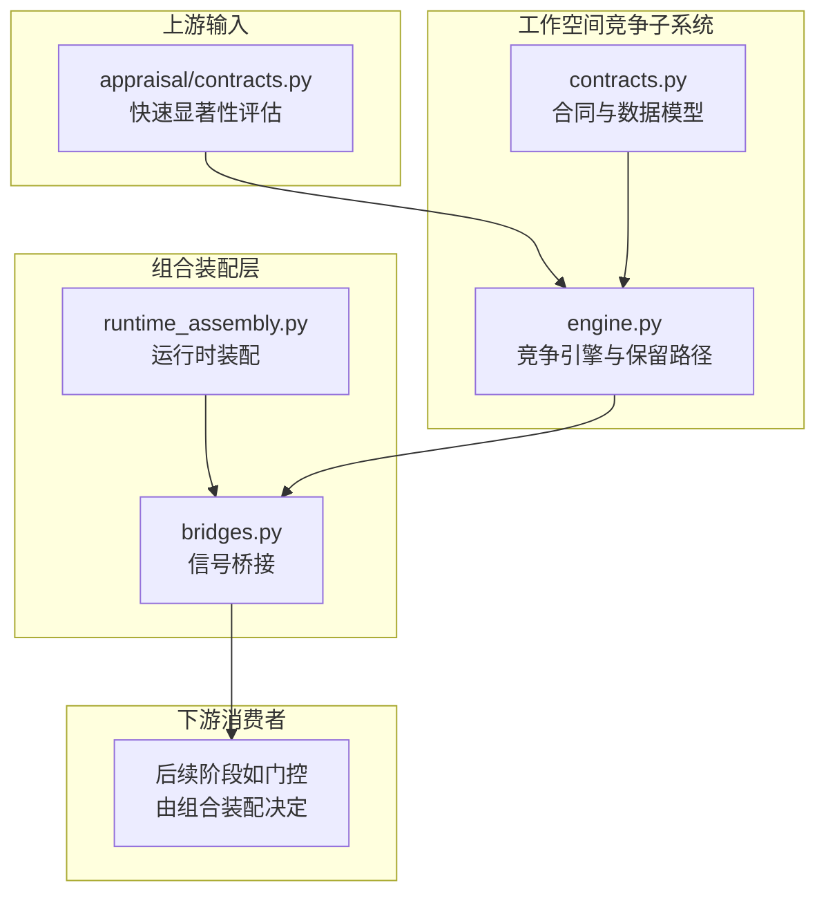
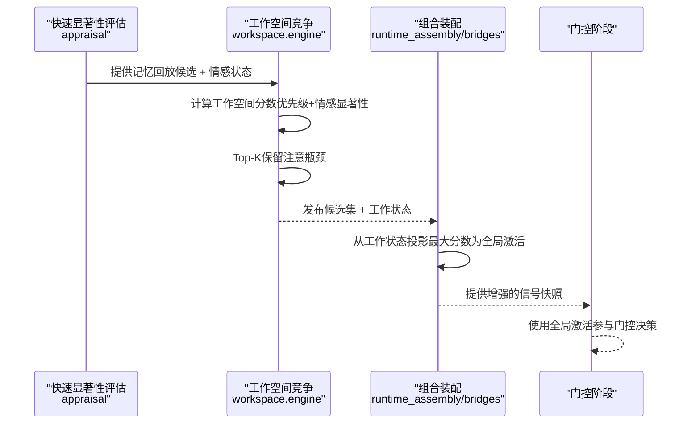
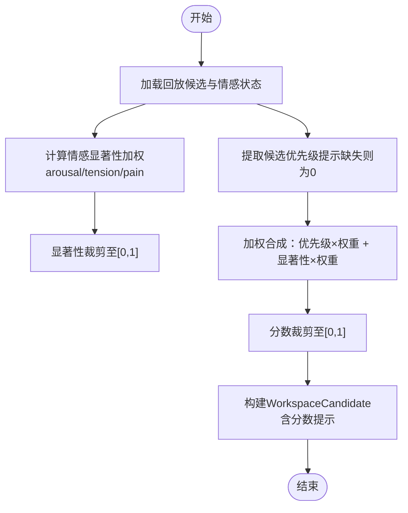
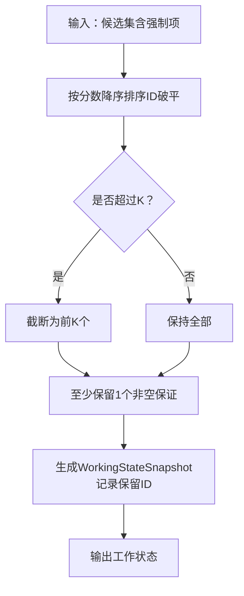
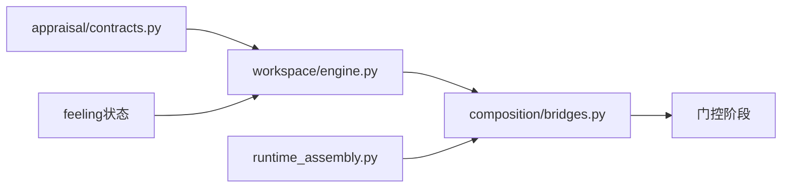

# 工作空间竞争

<cite>
**本文引用的文件**
- [workspace/engine.py](file://helios_v2/src/helios_v2/workspace/engine.py)
- [workspace/contracts.py](file://helios_v2/src/helios_v2/workspace/contracts.py)
- [appraisal/contracts.py](file://helios_v2/src/helios_v2/appraisal/contracts.py)
- [composition/runtime_assembly.py](file://helios_v2/src/helios_v2/composition/runtime_assembly.py)
- [composition/bridges.py](file://helios_v2/src/helios_v2/composition/bridges.py)
- [tests/test_workspace_engine.py](file://helios_v2/tests/test_workspace_engine.py)
- [tests/test_runtime_composition.py](file://helios_v2/tests/test_runtime_composition.py)
- [docs/requirements/46-workspace-competition-de-shim/design.md](file://helios_v2/docs/requirements/46-workspace-competition-de-shim/design.md)
- [docs/requirements/46-workspace-competition-de-shim/task.md](file://helios_v2/docs/requirements/46-workspace-competition-de-shim/task.md)
- [docs/requirements/48-workspace-grounded-gate-activation/design.md](file://helios_v2/docs/requirements/48-workspace-grounded-gate-activation/design.md)
- [docs/requirements/48-workspace-grounded-gate-activation/requirement.md](file://helios_v2/docs/requirements/48-workspace-grounded-gate-activation/requirement.md)
- [docs/OWNER_GUIDE.md](file://helios_v2/docs/OWNER_GUIDE.md)
</cite>

## 目录
1. [引言](#引言)
2. [项目结构](#项目结构)
3. [核心组件](#核心组件)
4. [架构总览](#架构总览)
5. [详细组件分析](#详细组件分析)
6. [依赖分析](#依赖分析)
7. [性能考虑](#性能考虑)
8. [故障排查指南](#故障排查指南)
9. [结论](#结论)
10. [附录](#附录)

## 引言
本文件面向Helios v2中的“工作空间竞争”模块，系统化阐述其动态分配机制、思维进程协调算法与资源竞争策略。重点覆盖以下方面：
- 竞争评分系统：基于记忆回放候选的优先级提示与内感受情感显著性（arousal/tension/pain）的加权合成。
- 优先级调度与注意瓶颈：通过有界Top-K保留策略，形成工作状态快照，确保非空集合与确定性排序。
- 冲突解决与去重逻辑：在候选集中保留强制合并项，同时对保留集进行稳定排序与去重。
- 并发控制与性能优化：确定性计算、无锁数据结构、按需排序与阈值裁剪。
- 与快速显著性评估（Rapid Salience Appraisal）及内省思维（Feeling）的交互：显著性信号作为竞争权重的一部分，影响全局激活水平，进而驱动后续门控。

## 项目结构
工作空间竞争位于“workspace”子系统，围绕以下关键文件展开：
- 合同与接口定义：workspace/contracts.py
- 核心引擎实现：workspace/engine.py
- 组合装配与桥接：composition/runtime_assembly.py、composition/bridges.py
- 测试验证：tests/test_workspace_engine.py、tests/test_runtime_composition.py
- 需求与设计文档：docs/requirements/46…、docs/requirements/48…

图表来源
- [workspace/contracts.py](file://helios_v2/src/helios_v2/workspace/contracts.py)
- [workspace/engine.py](file://helios_v2/src/helios_v2/workspace/engine.py)
- [composition/runtime_assembly.py](file://helios_v2/src/helios_v2/composition/runtime_assembly.py)
- [composition/bridges.py](file://helios_v2/src/helios_v2/composition/bridges.py)
- [appraisal/contracts.py](file://helios_v2/src/helios_v2/appraisal/contracts.py)

章节来源
- [workspace/contracts.py](file://helios_v2/src/helios_v2/workspace/contracts.py)
- [workspace/engine.py](file://helios_v2/src/helios_v2/workspace/engine.py)
- [composition/runtime_assembly.py](file://helios_v2/src/helios_v2/composition/runtime_assembly.py)
- [composition/bridges.py](file://helios_v2/src/helios_v2/composition/bridges.py)
- [appraisal/contracts.py](file://helios_v2/src/helios_v2/appraisal/contracts.py)

## 核心组件
- 竞争路径（Competition Path）
  - 将记忆回放候选与内感受情感状态结合，生成带工作空间分数提示的候选集。
  - 关键点：权重可学习/可配置；分数经阈值裁剪至[0,1]；保留强制合并项不变。
- 保留路径（Retention Path）
  - 基于工作空间分数进行有界Top-K选择，形成工作状态快照。
  - 关键点：至少保留一个；确定性排序（分数降序，ID作为破平）；非空保证。
- 数据模型
  - WorkspaceCandidate、WorkspaceCandidateSet、WorkingStateSnapshot等不可变数据结构，确保并发安全与可追踪性。
- 组合装配
  - 在语义内存装配下启用真实竞争；默认装配保持常量行为。
  - 将工作空间激活投影到全局激活水平，驱动后续门控。

章节来源
- [workspace/engine.py:358-381](file://helios_v2/src/helios_v2/workspace/engine.py#L358-L381)
- [workspace/engine.py:61-74](file://helios_v2/src/helios_v2/workspace/engine.py#L61-L74)
- [workspace/contracts.py](file://helios_v2/src/helios_v2/workspace/contracts.py)
- [docs/requirements/46-workspace-competition-de-shim/design.md:30-74](file://helios_v2/docs/requirements/46-workspace-competition-de-shim/design.md#L30-L74)
- [docs/requirements/48-workspace-grounded-gate-activation/design.md:28-60](file://helios_v2/docs/requirements/48-workspace-grounded-gate-activation/design.md#L28-L60)

## 架构总览
工作空间竞争在“认知循环”的阶段顺序中先于门控阶段执行，其结果被后续阶段消费。在语义内存装配下，工作空间分数直接影响全局激活水平，从而改变门控得分。

图表来源
- [workspace/engine.py:358-381](file://helios_v2/src/helios_v2/workspace/engine.py#L358-L381)
- [composition/runtime_assembly.py](file://helios_v2/src/helios_v2/composition/runtime_assembly.py)
- [composition/bridges.py](file://helios_v2/src/helios_v2/composition/bridges.py)
- [docs/requirements/48-workspace-grounded-gate-activation/design.md:28-60](file://helios_v2/docs/requirements/48-workspace-grounded-gate-activation/design.md#L28-L60)

## 详细组件分析

### 竞争评分系统
- 输入
  - replay_candidates：来自记忆回放的候选元组，每个候选包含优先级提示（可为空）。
  - feeling_state：内感受情感状态，包含arousal、tension、pain_like等维度。
  - config：工作空间竞争配置（权重、保留上限等）。
- 计算流程
  - 情感显著性：对arousal、tension、pain_like进行加权求和，并裁剪至[0,1]。
  - 候选分数：priority_hint与情感显著性的加权合成，同样裁剪至[0,1]。
  - 输出：为每个候选生成带workspace_score_hint的WorkspaceCandidate，并汇总为WorkspaceCandidateSet。
- 权重与稳定性
  - 权重可学习/可配置；裁剪函数确保数值稳定性与边界一致性。
  - 若priority_hint缺失，默认视为0.0，避免偏置。

图表来源
- [workspace/engine.py:358-381](file://helios_v2/src/helios_v2/workspace/engine.py#L358-L381)
- [docs/requirements/46-workspace-competition-de-shim/design.md:30-54](file://helios_v2/docs/requirements/46-workspace-competition-de-shim/design.md#L30-L54)

章节来源
- [workspace/engine.py:358-381](file://helios_v2/src/helios_v2/workspace/engine.py#L358-L381)
- [workspace/engine.py:349-356](file://helios_v2/src/helios_v2/workspace/engine.py#L349-L356)
- [docs/requirements/46-workspace-competition-de-shim/design.md:30-54](file://helios_v2/docs/requirements/46-workspace-competition-de-shim/design.md#L30-L54)

### 优先级调度与注意瓶颈
- 排序规则
  - 以workspace_score_hint降序为主，若相等则以候选ID升序作为破平，确保确定性。
- 保留策略
  - 保留Top-K，K由配置决定；当候选集非空时，至少保留一个。
  - 保留集ID集合用于后续工作状态快照。
- 不变式
  - 所有原始候选（包括强制合并项）均保留在候选集中，仅保留集受限。
  - 保留过程不引入下游契约变更，仅影响工作状态。

图表来源
- [workspace/engine.py:61-74](file://helios_v2/src/helios_v2/workspace/engine.py#L61-L74)
- [docs/requirements/46-workspace-competition-de-shim/design.md:58-74](file://helios_v2/docs/requirements/46-workspace-competition-de-shim/design.md#L58-L74)

章节来源
- [workspace/engine.py:61-74](file://helios_v2/src/helios_v2/workspace/engine.py#L61-L74)
- [workspace/engine.py:138-166](file://helios_v2/src/helios_v2/workspace/engine.py#L138-L166)
- [docs/requirements/46-workspace-competition-de-shim/design.md:58-74](file://helios_v2/docs/requirements/46-workspace-competition-de-shim/design.md#L58-L74)

### 冲突解决与去重逻辑
- 冲突来源
  - 多个候选可能具有相同分数；通过候选ID进行确定性破平，避免非确定性。
- 去重策略
  - 保留集ID采用tuple存储，天然去重；若上游重复输入，保留集仍唯一。
- 强制项保留
  - 候选集中保留强制合并项，确保下游处理的完整性与一致性。

章节来源
- [workspace/engine.py:61-74](file://helios_v2/src/helios_v2/workspace/engine.py#L61-L74)
- [workspace/engine.py:255-265](file://helios_v2/src/helios_v2/workspace/engine.py#L255-L265)

### 与快速显著性评估、内省思维的交互
- 快速显著性评估（Rapid Salience Appraisal）
  - 提供多维显著性向量（threat/reward/novelty/social/uncertainty），并与工作空间竞争的“情感显著性”维度协同。
  - 在语义内存装配下，显著性评估为真实信号，驱动后续神经调节与门控。
- 内省思维（Feeling）
  - 工作空间竞争直接使用内感受情感状态（arousal/tension/pain）计算情感显著性，形成跨阶段的一致性。
  - 全局激活水平在门控阶段被真实工作空间激活所替代，体现“真实竞争”的下游效应。

章节来源
- [appraisal/contracts.py:27-49](file://helios_v2/src/helios_v2/appraisal/contracts.py#L27-L49)
- [docs/requirements/48-workspace-grounded-gate-activation/design.md:13-24](file://helios_v2/docs/requirements/48-workspace-grounded-gate-activation/design.md#L13-L24)
- [docs/OWNER_GUIDE.md:68-79](file://helios_v2/docs/OWNER_GUIDE.md#L68-L79)

### 组合装配与桥接
- 语义内存装配开关
  - 仅在同时具备持久化存储与嵌入网关时启用真实工作空间竞争；默认装配保持常量行为。
- 激活投影
  - 从工作空间结果中取保留候选的最大分数作为全局激活水平，写入信号快照。
- 错误处理
  - 缺失或类型错误的工作空间结果将触发硬失败，不进行静默回退。

章节来源
- [docs/requirements/48-workspace-grounded-gate-activation/requirement.md:41-47](file://helios_v2/docs/requirements/48-workspace-grounded-gate-activation/requirement.md#L41-L47)
- [docs/requirements/48-workspace-grounded-gate-activation/design.md:28-60](file://helios_v2/docs/requirements/48-workspace-grounded-gate-activation/design.md#L28-L60)
- [composition/bridges.py](file://helios_v2/src/helios_v2/composition/bridges.py)

## 依赖分析
- 内部依赖
  - engine依赖contracts中的数据模型与协议；保留路径与竞争路径分别实现不同职责。
- 上游依赖
  - 依赖appraisal提供的显著性信号与feeling提供的内感受状态。
- 下游依赖
  - 通过组合装配桥接到门控阶段，影响全局激活水平。
- 外部依赖
  - 语义内存装配（存储+嵌入）为真实竞争启用条件；测试中验证默认装配与语义装配的行为差异。

图表来源
- [workspace/engine.py](file://helios_v2/src/helios_v2/workspace/engine.py)
- [composition/bridges.py](file://helios_v2/src/helios_v2/composition/bridges.py)
- [composition/runtime_assembly.py](file://helios_v2/src/helios_v2/composition/runtime_assembly.py)
- [appraisal/contracts.py](file://helios_v2/src/helios_v2/appraisal/contracts.py)

章节来源
- [workspace/engine.py](file://helios_v2/src/helios_v2/workspace/engine.py)
- [composition/bridges.py](file://helios_v2/src/helios_v2/composition/bridges.py)
- [composition/runtime_assembly.py](file://helios_v2/src/helios_v2/composition/runtime_assembly.py)
- [appraisal/contracts.py](file://helios_v2/src/helios_v2/appraisal/contracts.py)

## 性能考虑
- 时间复杂度
  - 分数计算：O(N)，N为候选数量。
  - 排序与Top-K：O(N log N)，随后截断至O(K log K)。
- 空间复杂度
  - 候选集与工作状态均为不可变元组，内存占用与候选数量线性相关。
- 优化建议
  - 优先级权重与保留上限可学习/可配置，便于在不同任务场景下调优。
  - 对超大候选集可考虑分批处理或增量Top-K维护，减少峰值内存。
  - 裁剪与加权操作为标量运算，适合SIMD优化（视具体实现而定）。

## 故障排查指南
- 常见问题
  - 无候选或保留集为空：检查上游候选生成与强制项保留逻辑。
  - 分数异常或越界：确认权重与裁剪函数正确配置。
  - 门控结果不变：确认已启用语义内存装配且工作空间结果可用。
- 定位方法
  - 使用测试用例验证：优先级+情感显著性的合成、Top-K保留、非空保证、默认装配行为。
  - 观察组合装配桥接是否正确读取工作空间结果并投影全局激活。
- 参考测试
  - 工作空间引擎测试：验证真实分数、有界保留、确定性与不变式。
  - 运行时组合测试：验证语义装配下的真实激活投影。

章节来源
- [tests/test_workspace_engine.py](file://helios_v2/tests/test_workspace_engine.py)
- [tests/test_runtime_composition.py](file://helios_v2/tests/test_runtime_composition.py)
- [docs/requirements/46-workspace-competition-de-shim/task.md:38-53](file://helios_v2/docs/requirements/46-workspace-competition-de-shim/task.md#L38-L53)
- [docs/requirements/48-workspace-grounded-gate-activation/requirement.md:41-47](file://helios_v2/docs/requirements/48-workspace-grounded-gate-activation/requirement.md#L41-L47)

## 结论
工作空间竞争模块通过“真实竞争+注意瓶颈”的设计，实现了对思维进程的动态协调与资源约束。其评分系统融合了优先级与情感显著性，保留路径确保了确定性与非空性，组合装配则将真实激活水平注入门控阶段。该模块在默认装配下保持兼容，在语义内存装配下提供真实信号，满足从快速评估到门控决策的端到端闭环。

## 附录

### 使用示例与最佳实践
- 配置竞争参数
  - 权重与保留上限：通过配置对象传入，支持学习/可调。
  - 默认装配：保持常量行为；语义装配：启用真实竞争。
- 监控竞争状态
  - 通过发布的工作空间候选集与工作状态快照观察保留ID与分数分布。
  - 在组合装配中读取全局激活水平，验证真实竞争对门控的影响。
- 调试竞争异常
  - 使用测试用例定位问题：分数越界、保留集为空、排序不确定等。
  - 确认上游显著性评估与内感受状态的可用性与一致性。

章节来源
- [workspace/engine.py:358-381](file://helios_v2/src/helios_v2/workspace/engine.py#L358-L381)
- [workspace/engine.py:61-74](file://helios_v2/src/helios_v2/workspace/engine.py#L61-L74)
- [composition/bridges.py](file://helios_v2/src/helios_v2/composition/bridges.py)
- [tests/test_workspace_engine.py](file://helios_v2/tests/test_workspace_engine.py)
- [tests/test_runtime_composition.py](file://helios_v2/tests/test_runtime_composition.py)