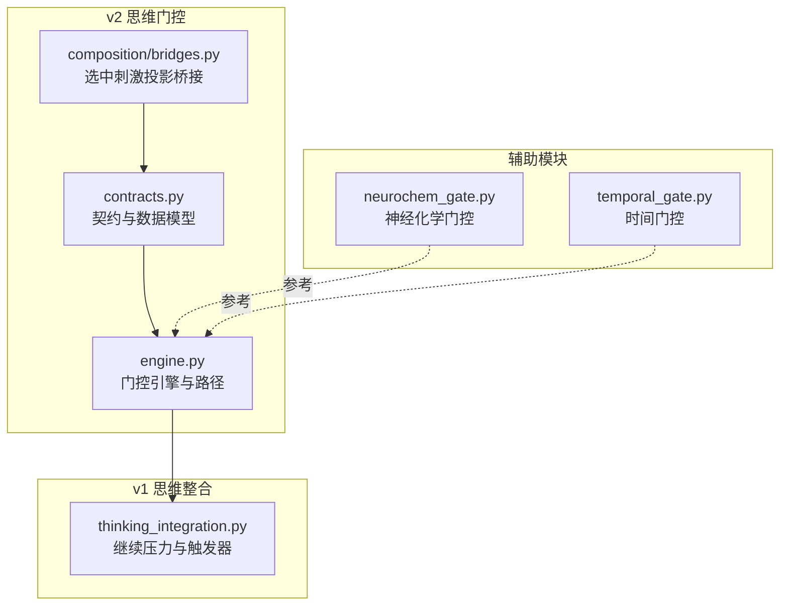
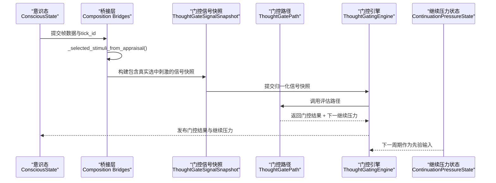
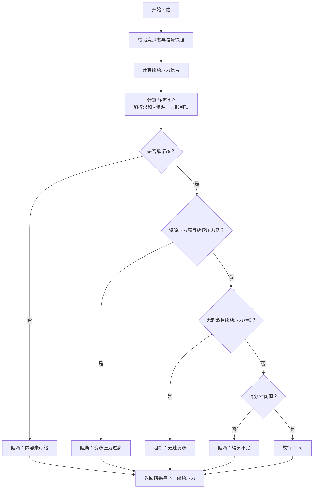
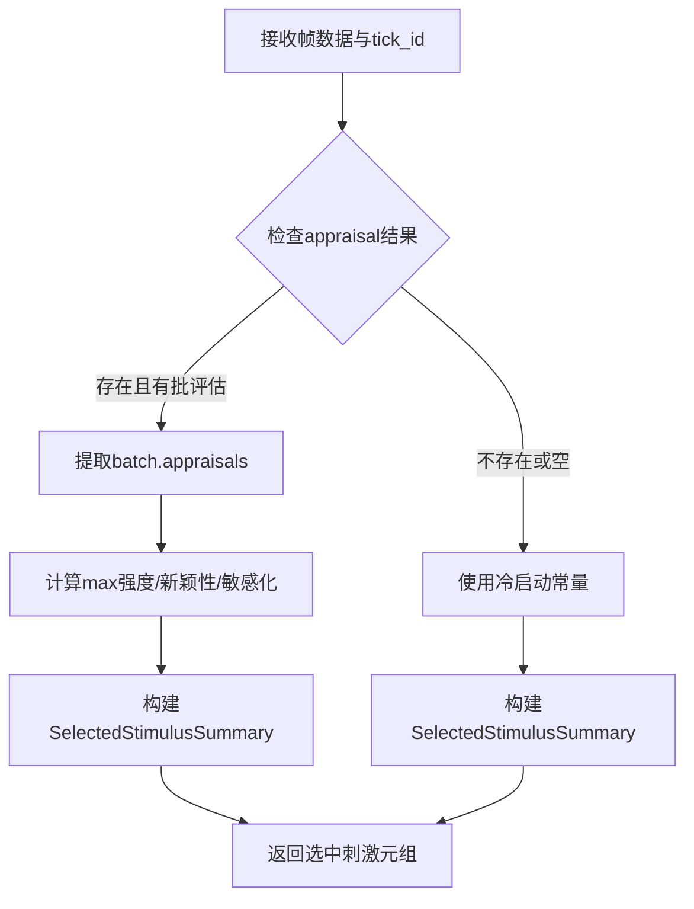
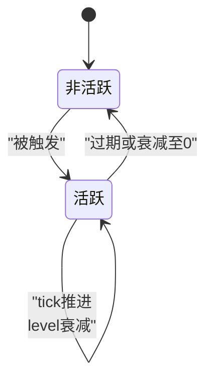
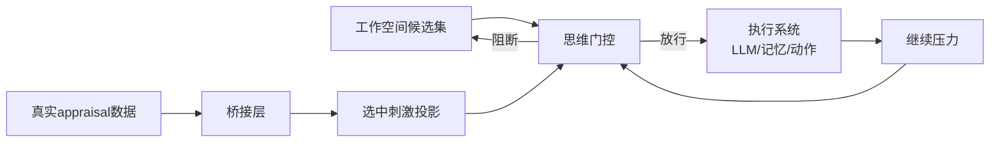
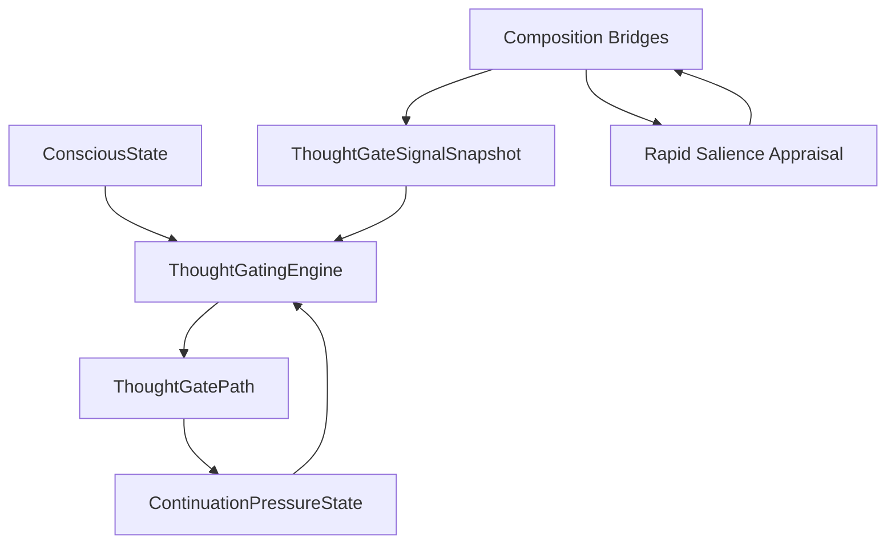

# 思维门控

<cite>
**本文引用的文件**
- [thought_gating/engine.py](file://helios_v2/src/helios_v2/thought_gating/engine.py)
- [thought_gating/contracts.py](file://helios_v2/src/helios_v2/thought_gating/contracts.py)
- [composition/bridges.py](file://helios_v2/src/helios_v2/composition/bridges.py)
- [thinking_integration.py](file://archive/helios_v1/cognition/thinking_integration.py)
- [neurochem_gate.py](file://archive/helios_v1/neurochem_gate.py)
- [temporal_gate.py](file://archive/helios_v1/temporal_gate.py)
- [53-workload-pressure-from-interoception/requirement.md](file://helios_v2/docs/requirements/53-workload-pressure-from-interoception/requirement.md)
- [53-workload-pressure-from-interoception/design.md](file://helios_v2/docs/requirements/53-workload-pressure-from-interoception/design.md)
- [63-selected-stimuli-and-default-ignition-source/design.md](file://helios_v2/docs/requirements/63-selected-stimuli-and-default-ignition-source/design.md)
</cite>

## 目录
1. [简介](#简介)
2. [项目结构](#项目结构)
3. [核心组件](#核心组件)
4. [架构总览](#架构总览)
5. [详细组件分析](#详细组件分析)
6. [依赖关系分析](#依赖关系分析)
7. [性能考量](#性能考量)
8. [故障排查指南](#故障排查指南)
9. [结论](#结论)
10. [附录](#附录)

## 简介
本文件为 Helios 思维门控模块的技术文档，聚焦于"抑制机制、继续压力、门控状态转换与控制逻辑"。文档系统性阐述：
- 门控阈值设定与决策规则
- 压力累积与负载抑制算法
- 开闭状态判断与响应延迟控制
- 状态机设计、概率与动态调整策略
- 与工作空间竞争、执行系统的协调关系
- **新增**：基于真实appraisal数据的实时选中刺激投影机制
并提供可操作的使用示例（参数配置、状态监控、异常调试），以及关键流程的可视化图示。

## 项目结构
思维门控位于 v2 模块的 thought_gating 子系统中，采用"契约-引擎"分层：契约定义输入输出与约束，引擎实现确定性门控评估路径；同时在 v1 中保留了早期的思维整合与继续压力实现，作为历史对照与兼容参考。

**图表来源**
- [thought_gating/contracts.py:1-305](file://helios_v2/src/helios_v2/thought_gating/contracts.py#L1-L305)
- [thought_gating/engine.py:1-349](file://helios_v2/src/helios_v2/thought_gating/engine.py#L1-L349)
- [composition/bridges.py:1380-1470](file://helios_v2/src/helios_v2/composition/bridges.py#L1380-L1470)
- [thinking_integration.py:1-800](file://archive/helios_v1/cognition/thinking_integration.py#L1-L800)
- [neurochem_gate.py:1-200](file://archive/helios_v1/neurochem_gate.py#L1-L200)
- [temporal_gate.py:1-161](file://archive/helios_v1/temporal_gate.py#L1-L161)

**章节来源**
- [thought_gating/contracts.py:1-305](file://helios_v2/src/helios_v2/thought_gating/contracts.py#L1-L305)
- [thought_gating/engine.py:1-349](file://helios_v2/src/helios_v2/thought_gating/engine.py#L1-L349)
- [composition/bridges.py:1380-1470](file://helios_v2/src/helios_v2/composition/bridges.py#L1380-L1470)
- [thinking_integration.py:1-800](file://archive/helios_v1/cognition/thinking_integration.py#L1-L800)

## 核心组件
- 门控信号快照（ThoughtGateSignalSnapshot）：封装当前周期内所有归一化输入，包括工作负载压力、全局激活、时间信号、驱动紧迫度、DMN 可用性、**选中刺激集（来自真实appraisal数据）**、神经递质唤醒等。
- 决策策略（ThoughtGatePath）：定义门控评估路径协议，v2 提供"第一版确定性路径"和"觉醒感知路径"，后者引入神经递质唤醒项。
- 继续压力状态（ContinuationPressureState）：记录延续压力的活跃/非活跃、强度、来源、过期 tick、携带计数等。
- 门控结果（ThoughtGateResult）：包含决策、得分、主导原因、阻断原因、贡献信号明细、**选中刺激集**等。
- **新增**：选中刺激投影（Selected Stimulus Projection）：从03快速显著性评估阶段结果中提取真实刺激数据，实现真正的实时投影机制。
- 引擎（ThoughtGatingEngine）：对外暴露评估接口，负责输入校验、调用路径、结果校验与发布操作构建。

**章节来源**
- [thought_gating/contracts.py:81-118](file://helios_v2/src/helios_v2/thought_gating/contracts.py#L81-L118)
- [thought_gating/contracts.py:120-160](file://helios_v2/src/helios_v2/thought_gating/contracts.py#L120-L160)
- [thought_gating/contracts.py:202-249](file://helios_v2/src/helios_v2/thought_gating/contracts.py#L202-L249)
- [composition/bridges.py:1625-1635](file://helios_v2/src/helios_v2/composition/bridges.py#L1625-L1635)
- [thought_gating/engine.py:70-80](file://helios_v2/src/helios_v2/thought_gating/engine.py#L70-L80)
- [thought_gating/engine.py:282-306](file://helios_v2/src/helios_v2/thought_gating/engine.py#L282-L306)

## 架构总览
v2 的思维门控以"确定性路径"为核心，结合 v1 的继续压力与触发器思想，形成闭环：外部输入经归一化后进入门控引擎，依据策略计算门控得分并判定是否放行；若放行则产生继续压力状态，用于下一周期的抑制作用；若阻断，则根据阻断原因进行延迟或等待。**新增的实时投影机制确保选中刺激来自真实的appraisal数据，而非硬编码常量**。

**图表来源**
- [composition/bridges.py:1387-1415](file://helios_v2/src/helios_v2/composition/bridges.py#L1387-L1415)
- [composition/bridges.py:1625-1635](file://helios_v2/src/helios_v2/composition/bridges.py#L1625-L1635)
- [thought_gating/engine.py:289-306](file://helios_v2/src/helios_v2/thought_gating/engine.py#L289-L306)
- [thought_gating/engine.py:113-218](file://helios_v2/src/helios_v2/thought_gating/engine.py#L113-L218)
- [thought_gating/contracts.py:202-249](file://helios_v2/src/helios_v2/thought_gating/contracts.py#L202-L249)

## 详细组件分析

### 门控评分与抑制机制
- 评分构成（v2 第一版）：
  - 刺激信号权重：0.30（来自真实appraisal数据的选中刺激）
  - 继续压力信号权重：0.30
  - 全局激活水平权重：0.20
  - 驱动紧迫度权重：0.10
  - 时间信号权重：0.10
  - DMN 可用性（布尔项）：+0.10（当可用时）
  - 工作负载压力抑制项：-workload_pressure × 0.45
  - 神经递质唤醒项（可选）：+arousal_contribution（仅在路径启用且存在唤醒时）
- 决策规则：
  - 若非承诺态：阻断（conscious_content_not_eligible）
  - 若资源压力过高且继续压力不足：阻断（resource_pressure_too_high）
  - 若无显著刺激且继续压力为零：阻断（continuation_absent_and_no_stimulus）
  - 若门控得分低于阈值：阻断（gate_score_too_low）
  - 否则放行（fire），并记录主导触发原因（继续压力优先于显著刺激）

**图表来源**
- [thought_gating/engine.py:113-218](file://helios_v2/src/helios_v2/thought_gating/engine.py#L113-L218)

**章节来源**
- [thought_gating/engine.py:113-218](file://helios_v2/src/helios_v2/thought_gating/engine.py#L113-L218)

### 实时选中刺激投影机制
**更新** Requirement 63实施后，选中刺激现在来自真实的appraisal数据而非硬编码常量：

- 投影函数实现：
  - 从帧数据中获取 rapid_salience_appraisal 阶段结果
  - 从批量评估中提取最大显著性强度、新颖性信号和敏感化信号
  - 构建 SelectedStimulusSummary 对象，包含唯一ID、来源类型、通道ID和信号值
  - 当appraisal结果缺失或批次为空时，使用文档化的冷启动常量作为后备
- 数据流处理：
  - 强度、新颖性和敏感化信号均经过0-1区间钳制
  - 信号值保留四位小数精度
  - 使用 tick_id 生成唯一的刺激ID
- 冷启动后备机制：
  - 强度：0.65（匹配FirstVersionAggregateEstimator）
  - 新颖性：0.6（匹配FirstVersionDimensionEstimator）
  - 敏感化：0.3（匹配FirstVersionDimensionEstimator）

**图表来源**
- [composition/bridges.py:1625-1635](file://helios_v2/src/helios_v2/composition/bridges.py#L1625-L1635)
- [63-selected-stimuli-and-default-ignition-source/design.md:64-93](file://helios_v2/docs/requirements/63-selected-stimuli-and-default-ignition-source/design.md#L64-L93)

**章节来源**
- [composition/bridges.py:1625-1635](file://helios_v2/src/helios_v2/composition/bridges.py#L1625-L1635)
- [63-selected-stimuli-and-default-ignition-source/design.md:64-93](file://helios_v2/docs/requirements/63-selected-stimuli-and-default-ignition-source/design.md#L64-L93)

### 继续压力与状态转换
- 继续压力状态（ContinuationPressureState）：
  - active：是否处于活跃状态
  - level：0~1 的强度
  - origin_thought_id：触发该继续压力的思考来源
  - reason：触发原因（如 continuation_pressure）
  - expires_at_tick：过期 tick（可为空表示不过期）
  - carry_count：连续携带计数
- 状态演进规则（v2）：
  - 若非活跃：直接返回非活跃
  - 若已过期：转为非活跃
  - 否则：强度衰减（idle_decay，默认 0.1），若衰减至 0 或以下：非活跃；否则保持活跃并增加携带计数
- 与 v1 的对比：
  - v1 使用"冷却衰减"和"类型冷却"等策略，v2 将其抽象为统一的继续压力状态与衰减规则，便于跨周期复用

**图表来源**
- [thought_gating/engine.py:89-110](file://helios_v2/src/helios_v2/thought_gating/engine.py#L89-L110)
- [thought_gating/contracts.py:120-160](file://helios_v2/src/helios_v2/thought_gating/contracts.py#L120-L160)
- [thinking_integration.py:538-665](file://archive/helios_v1/cognition/thinking_integration.py#L538-L665)

**章节来源**
- [thought_gating/engine.py:89-110](file://helios_v2/src/helios_v2/thought_gating/engine.py#L89-L110)
- [thought_gating/contracts.py:120-160](file://helios_v2/src/helios_v2/thought_gating/contracts.py#L120-L160)
- [thinking_integration.py:538-665](file://archive/helios_v1/cognition/thinking_integration.py#L538-L665)

### 门控阈值与动态调整
- 固定阈值（v2 第一版）：
  - fire_threshold：0.55
  - resource_pressure_block_threshold：0.9
  - idle_decay：0.1
- 动态调整建议（基于需求文档）：
  - 工作负载压力应来源于真实运行时负载（CPU/内存压力通道），而非常量 0.1
  - 压力值需单调非减地随负载上升而上升，并在合成桥接层中转发为"原始有界负载事实"
  - 门控权重（×0.45）与阻断阈值由门控拥有者维护，不因桥接层变化而改变

**章节来源**
- [thought_gating/engine.py:82-87](file://helios_v2/src/helios_v2/thought_gating/engine.py#L82-L87)
- [53-workload-pressure-from-interoception/requirement.md:11-21](file://helios_v2/docs/requirements/53-workload-pressure-from-interoception/requirement.md#L11-L21)
- [53-workload-pressure-from-interoception/design.md:14-23](file://helios_v2/docs/requirements/53-workload-pressure-from-interoception/design.md#L14-L23)

### 压力累积与开闭判断
- 压力来源：
  - v2：workload_pressure 来自合成桥接层（应来自真实运行时负载通道）
  - v1：load_pressure 来自稳态负荷、疲劳压力与行为队列深度
- 开闭判断：
  - 放行条件：承诺态 + 得分≥阈值 + 无资源压力阻断
  - 阻断条件：资源压力过高、无触发源、得分不足、非承诺态
  - **新增**：选中刺激来自真实appraisal数据，提供更准确的刺激强度、新颖性和敏感化信号
- 响应延迟控制：
  - 通过继续压力衰减与过期 tick 控制重复触发频率
  - v1 中的"生成间隔"与"类型冷却"可视为延迟策略的历史映射

**章节来源**
- [thought_gating/engine.py:168-201](file://helios_v2/src/helios_v2/thought_gating/engine.py#L168-L201)
- [thinking_integration.py:289-343](file://archive/helios_v1/cognition/thinking_integration.py#L289-L343)

### 与工作空间竞争、执行系统的协调
- v1 思维整合（内部思考循环）：
  - 通过 InternalThoughtTrigger 计算 gate_score 并决定是否生成内部思考
  - 结合 DMN 活动、ICRI、时间动态、驱动紧迫度、继续压力、资源压力等
  - 生成后产出继续压力计划，用于下一周期抑制
- 协调关系：
  - 思维门控负责"是否允许进入思考窗口"的最终裁决
  - 继续压力作为抑制因子，降低后续周期的门控得分
  - 执行系统（如 LLM 推理、记忆写回）在门控放行后介入
  - **新增**：实时选中刺激投影确保门控决策基于当前真实的appraisal数据

**图表来源**
- [thinking_integration.py:344-467](file://archive/helios_v1/cognition/thinking_integration.py#L344-L467)
- [thought_gating/engine.py:113-218](file://helios_v2/src/helios_v2/thought_gating/engine.py#L113-L218)
- [composition/bridges.py:1625-1635](file://helios_v2/src/helios_v2/composition/bridges.py#L1625-L1635)

**章节来源**
- [thinking_integration.py:344-467](file://archive/helios_v1/cognition/thinking_integration.py#L344-L467)

## 依赖关系分析
- 输入依赖：
  - ConsciousState：提供状态标识与来源工作态标识
  - ThoughtGateSignalSnapshot：提供归一化信号与元信息，**包含来自真实appraisal数据的选中刺激**
- 内部依赖：
  - ThoughtGatePath：封装决策策略（v2 提供两种路径）
  - ContinuationPressureState：作为先验状态参与下一周期评估
  - **新增**：Composition Bridges：负责从appraisal数据中投影选中刺激
- 外部依赖：
  - 合成桥接层：将真实运行时负载（CPU/内存）转化为 workload_pressure
  - **新增**：03快速显著性评估阶段：提供真实appraisal数据源

**图表来源**
- [thought_gating/engine.py:289-306](file://helios_v2/src/helios_v2/thought_gating/engine.py#L289-L306)
- [thought_gating/contracts.py:274-305](file://helios_v2/src/helios_v2/thought_gating/contracts.py#L274-L305)
- [composition/bridges.py:1387-1415](file://helios_v2/src/helios_v2/composition/bridges.py#L1387-L1415)

**章节来源**
- [thought_gating/engine.py:274-305](file://helios_v2/src/helios_v2/thought_gating/engine.py#L274-L305)

## 性能考量
- 计算复杂度：门控评估为 O(N)（N 为选中刺激数量），主要开销在加权求和与阈值比较
- 内存占用：状态对象冻结不可变，适合跨阶段传递与缓存
- 实时性：workload_pressure 应来自实时通道，避免常量导致的"虚假压力"或"迟滞"
- **新增**：选中刺激投影开销：appraisal数据提取与信号聚合，但仅在每tick一次，开销可控
- 可扩展性：路径接口（ThoughtGatePath）支持新增策略（如觉醒感知路径），无需修改契约

## 故障排查指南
- 常见错误与定位：
  - 输入校验失败：意识态或信号快照 ID 缺失、单位区间越界
  - 结果校验失败：决策与阻断原因不一致、贡献信号名为空
  - 阻断原因：资源压力过高、无触发源、得分不足、内容未就绪
  - **新增**：选中刺激投影失败：appraisal数据缺失、批次为空、信号值越界
- 调试步骤：
  - 检查 workload_pressure 是否来自真实通道（而非常量 0.1）
  - 核对继续压力衰减与过期 tick 设置
  - 对比贡献信号明细，确认权重分配是否合理
  - 在合成桥接层验证压力通道与值域一致性
  - **新增**：验证appraisal数据完整性，检查冷启动后备机制是否正常工作
  - **新增**：监控选中刺激信号强度、新颖性和敏感化值的范围

**章节来源**
- [thought_gating/engine.py:27-67](file://helios_v2/src/helios_v2/thought_gating/engine.py#L27-L67)
- [thought_gating/contracts.py:219-249](file://helios_v2/src/helios_v2/thought_gating/contracts.py#L219-L249)
- [composition/bridges.py:1625-1635](file://helios_v2/src/helios_v2/composition/bridges.py#L1625-L1635)

## 结论
v2 思维门控以确定性路径为核心，结合继续压力状态与真实运行时负载，形成稳定、可解释的抑制与放行机制。**Requirement 63的实施实现了真正的实时投影机制，使选中刺激来自真实的appraisal数据而非硬编码常量**，显著提升了门控决策的准确性。通过清晰的契约与路径分离，既保证了门控策略的可控性，也为未来引入更复杂的动态调整（如基于神经递质的唤醒耦合）预留了空间。与工作空间竞争和执行系统的协同，确保了从"是否进入思考窗口"到"如何持续思考"的完整闭环。

## 附录

### 使用示例

- 配置门控参数
  - 设定门控阈值与衰减：在策略中设置 fire_threshold、resource_pressure_block_threshold、idle_decay
  - 设定权重：在门控得分计算中调整各信号权重（如工作负载压力抑制权重）
  - 示例路径：[门控策略与权重:82-151](file://helios_v2/src/helios_v2/thought_gating/engine.py#L82-L151)

- 监控门控状态
  - 观察 ThoughtGateResult 的 decision、gate_score、dominant_reason、blocked_reasons
  - 追踪 ContinuationPressureState 的 active、level、expires_at_tick、carry_count
  - **新增**：监控选中刺激信号质量，包括强度、新颖性和敏感化值
  - 示例路径：[门控结果与状态契约:202-160](file://helios_v2/src/helios_v2/thought_gating/contracts.py#L202-L160)

- 调试门控异常
  - 若出现"资源压力过高"阻断：检查合成桥接层是否正确转发真实负载压力
  - 若出现"无触发源"阻断：确认选中刺激集与继续压力是否合理
  - 若出现"得分不足"阻断：调整权重或阈值，或提升输入信号强度
  - **新增**：若出现"选中刺激投影失败"：检查appraisal数据完整性，验证冷启动后备机制
  - 示例路径：[阻断规则与调试要点:168-201](file://helios_v2/src/helios_v2/thought_gating/engine.py#L168-L201)

- 与工作空间竞争、执行系统的协调
  - 在思维整合阶段（v1）：通过 InternalThoughtTrigger 计算 gate_score 并决定生成
  - 在门控阶段（v2）：以门控结果为准绳，决定是否放行到执行系统
  - **新增**：实时选中刺激投影确保门控决策基于当前真实的appraisal数据
  - 示例路径：[思维整合与门控衔接:344-467](file://archive/helios_v1/cognition/thinking_integration.py#L344-L467)

- **新增**：配置实时选中刺激投影
  - 确保03快速显著性评估阶段正常运行
  - 验证appraisal数据格式符合预期
  - 监控冷启动后备机制的触发条件
  - 示例路径：[选中刺激投影实现:1625-1635](file://helios_v2/src/helios_v2/composition/bridges.py#L1625-L1635)