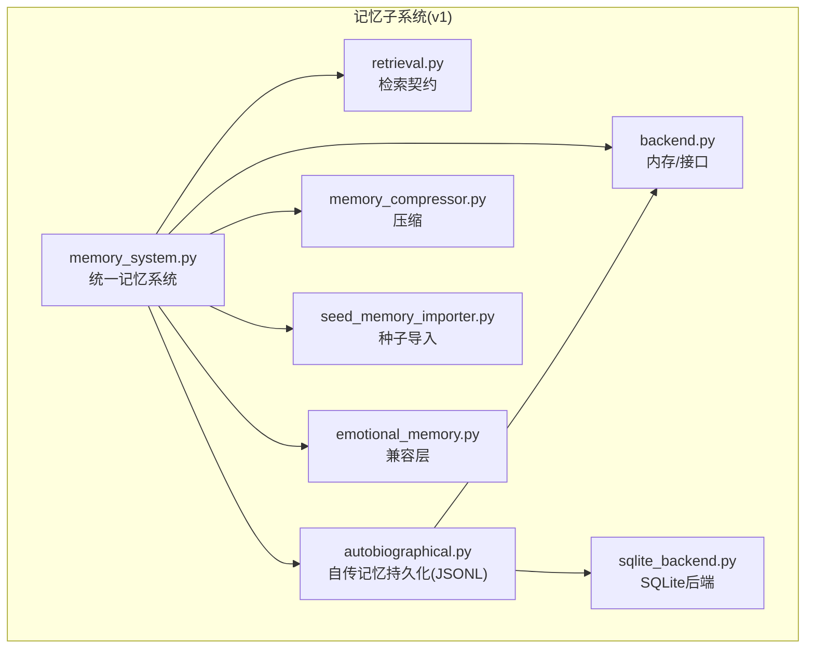
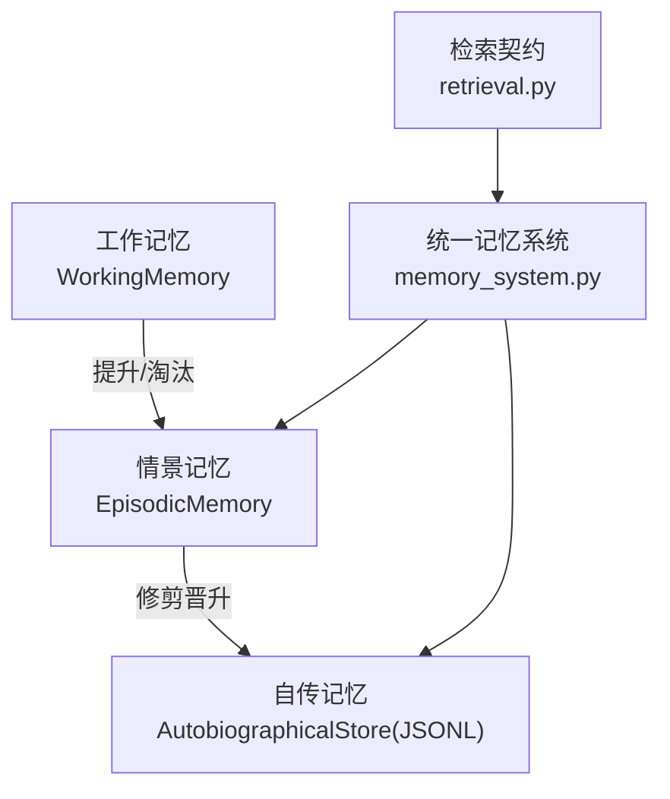
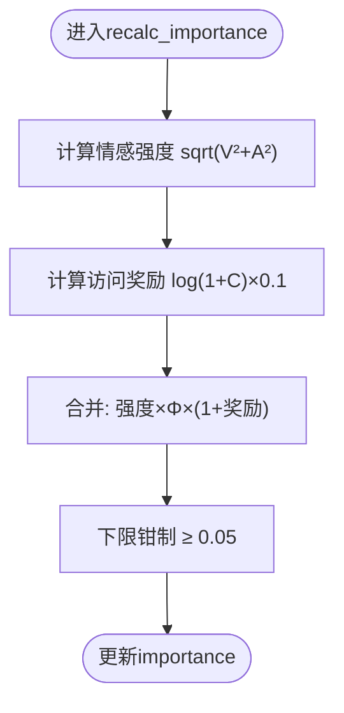
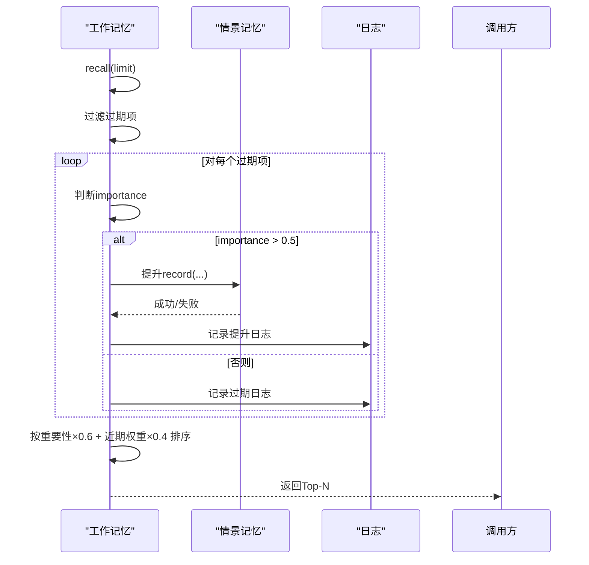
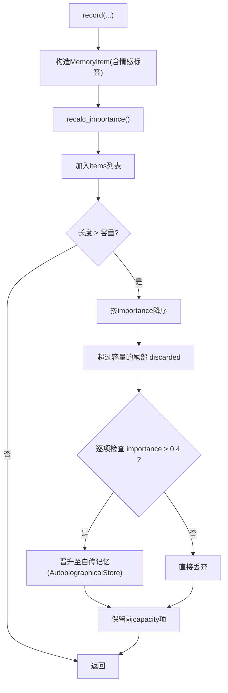
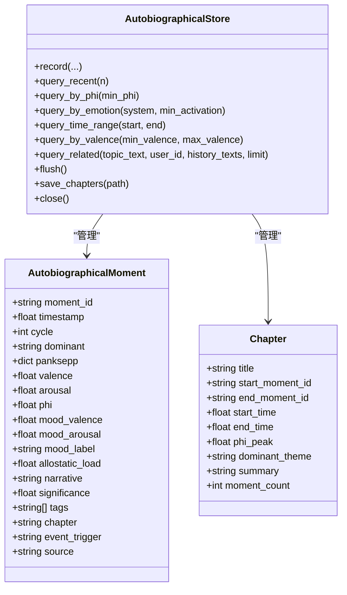
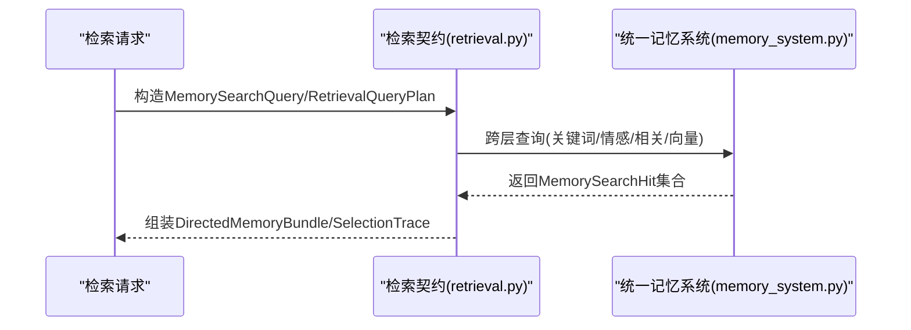
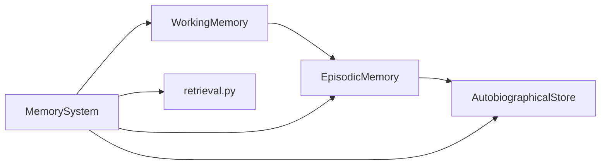

# 情景记忆

<cite>
**本文引用的文件**
- [memory_system.py](file://archive/helios_v1/memory/memory_system.py)
- [autobiographical.py](file://archive/helios_v1/memory/autobiographical.py)
- [retrieval.py](file://archive/helios_v1/memory/retrieval.py)
- [emotional_memory.py](file://archive/helios_v1/memory/emotional_memory.py)
- [backend.py](file://archive/helios_v1/memory/backend.py)
- [sqlite_backend.py](file://archive/helios_v1/memory/sqlite_backend.py)
- [memory_compressor.py](file://archive/helios_v1/memory/memory_compressor.py)
- [seed_memory_importer.py](file://archive/helios_v1/memory/seed_memory_importer.py)
- [__init__.py](file://archive/helios_v1/memory/__init__.py)
</cite>

## 目录
1. [简介](#简介)
2. [项目结构](#项目结构)
3. [核心组件](#核心组件)
4. [架构总览](#架构总览)
5. [详细组件分析](#详细组件分析)
6. [依赖分析](#依赖分析)
7. [性能考量](#性能考量)
8. [故障排查指南](#故障排查指南)
9. [结论](#结论)
10. [附录](#附录)

## 简介
本文件面向Helios情景记忆系统，聚焦于“如何将当前时刻的感知体验转化为可存储的情景记忆”，涵盖以下主题：
- 编码机制：从工作记忆到情景记忆的提升策略、情感标签生成与绑定上下文
- 存储结构：MemoryItem统一数据模型、工作记忆环形缓冲、情景记忆列表与修剪策略、自传记忆持久化
- 检索算法：基于情感相似度的召回、标签过滤、近期加权、与统一检索契约的对接
- 生命周期管理：TTL过期、重要性重算、容量修剪、跨层级晋升（情景→自传）
- 时间戳与优先级：时间衰减、访问计数、重要性公式、排序权重
- 性能优化：批量持久化、自动归档、压缩与种子导入、SQLite后端
- 与工作空间的关系：工作记忆作为“当前会话暂存”，在重要性阈值与容量压力下向情景记忆迁移

## 项目结构
Helios v1记忆子系统位于archive/helios_v1/memory，采用模块化设计，包含：
- memory_system.py：统一记忆系统，定义MemoryItem与四大记忆类型（工作、情景、语义、自传）及其交互
- autobiographical.py：自传记忆持久化（JSONL追加写入、章节管理、自动归档）
- retrieval.py：跨层检索契约（查询计划、命中结果、选择轨迹等）
- backend.py / sqlite_backend.py：内存与SQLite后端接口与实现
- memory_compressor.py：压缩与摘要生成
- seed_memory_importer.py：种子记忆导入
- emotional_memory.py：兼容层（历史遗留类型）

**图示来源**
- [memory_system.py:1-200](file://archive/helios_v1/memory/memory_system.py#L1-L200)
- [autobiographical.py:127-236](file://archive/helios_v1/memory/autobiographical.py#L127-L236)
- [retrieval.py:1-165](file://archive/helios_v1/memory/retrieval.py#L1-L165)
- [backend.py:1-200](file://archive/helios_v1/memory/backend.py#L1-L200)
- [sqlite_backend.py:1-200](file://archive/helios_v1/memory/sqlite_backend.py#L1-L200)
- [memory_compressor.py:1-200](file://archive/helios_v1/memory/memory_compressor.py#L1-L200)
- [seed_memory_importer.py:1-200](file://archive/helios_v1/memory/seed_memory_importer.py#L1-L200)
- [emotional_memory.py:1-28](file://archive/helios_v1/memory/emotional_memory.py#L1-L28)

**章节来源**
- [memory_system.py:1-200](file://archive/helios_v1/memory/memory_system.py#L1-L200)
- [autobiographical.py:1-120](file://archive/helios_v1/memory/autobiographical.py#L1-L120)
- [retrieval.py:1-80](file://archive/helios_v1/memory/retrieval.py#L1-L80)

## 核心组件
- MemoryItem：记忆原子单元，包含身份、时间戳、TTL、内容、摘要、情感向量（效价/唤醒/Φ）、情感标签、重要性、访问计数、标签集合等；提供touch、is_expired、recalc_importance、to_dict等方法
- WorkingMemory：容量有限的环形缓冲，TTL过期与重要性驱动的提升策略，支持手动提升与容量淘汰时的提升
- EpisodicMemory：情景记忆容器，按重要性修剪，支持情感相似度召回、标签召回、近期获取、情感模式统计、与自传记忆的晋升
- AutobiographicalStore：自传记忆持久化存储，JSONL追加写入、章节管理、自动归档、多维查询（时间/情感/Φ）
- 检索契约：统一的查询计划、命中结果、选择轨迹与向量检索提供者接口

**章节来源**
- [memory_system.py:58-118](file://archive/helios_v1/memory/memory_system.py#L58-L118)
- [memory_system.py:183-320](file://archive/helios_v1/memory/memory_system.py#L183-L320)
- [memory_system.py:326-650](file://archive/helios_v1/memory/memory_system.py#L326-L650)
- [autobiographical.py:44-121](file://archive/helios_v1/memory/autobiographical.py#L44-L121)
- [autobiographical.py:127-236](file://archive/helios_v1/memory/autobiographical.py#L127-L236)
- [retrieval.py:14-165](file://archive/helios_v1/memory/retrieval.py#L14-L165)

## 架构总览
情景记忆在Helios中的位置与交互如下：
- 感知体验经由工作记忆暂存，当重要性或容量触发时提升为情景记忆
- 情景记忆在修剪阶段根据重要性阈值晋升至自传记忆，并参与情感模式统计
- 检索通过统一契约进行跨层查询，支持关键词、情感、相关性与向量策略
- 自传记忆以JSONL持久化，具备章节管理与自动归档能力

**图示来源**
- [memory_system.py:183-320](file://archive/helios_v1/memory/memory_system.py#L183-L320)
- [memory_system.py:326-488](file://archive/helios_v1/memory/memory_system.py#L326-L488)
- [autobiographical.py:127-236](file://archive/helios_v1/memory/autobiographical.py#L127-L236)
- [retrieval.py:14-165](file://archive/helios_v1/memory/retrieval.py#L14-L165)

## 详细组件分析

### MemoryItem与重要性计算
- 字段与职责：id、memory_type、timestamp、ttl、last_accessed、content、summary、valence、arousal、phi、emotional_tag、importance、access_count、tags
- 重要性公式：importance = sqrt(V² + A²) × Φ × (1 + log(1 + C) × 0.1)，并下限钳制
- 生命周期：touch更新last_accessed与access_count；is_expired依据timestamp与ttl判断

**图示来源**
- [memory_system.py:97-106](file://archive/helios_v1/memory/memory_system.py#L97-L106)

**章节来源**
- [memory_system.py:58-118](file://archive/helios_v1/memory/memory_system.py#L58-L118)
- [memory_system.py:97-106](file://archive/helios_v1/memory/memory_system.py#L97-L106)

### 工作记忆（WorkingMemory）
- 容量与TTL：默认容量15，TTL默认300秒
- 提升策略：recall时对过期条目进行清理，若importance > 0.5则在过期前提升至情景记忆；容量溢出时淘汰最旧条目，同样满足阈值则提升
- 排序：最近访问优先 + 重要性权重混合排序

**图示来源**
- [memory_system.py:227-262](file://archive/helios_v1/memory/memory_system.py#L227-L262)
- [memory_system.py:278-296](file://archive/helios_v1/memory/memory_system.py#L278-L296)

**章节来源**
- [memory_system.py:183-320](file://archive/helios_v1/memory/memory_system.py#L183-L320)

### 情景记忆（EpisodicMemory）
- 容量与修剪：默认容量500，按importance降序保留，超出部分按阈值（0.4）晋升至自传记忆后丢弃
- 情感相似度召回：基于情感向量距离与近期因子加权打分
- 标签召回：按情感标签筛选并按重要性排序
- 情绪模式统计：记录标签转换频次，用于模式识别
- 持久化：支持序列化为负载、从负载恢复、文件级原子写入

**图示来源**
- [memory_system.py:356-394](file://archive/helios_v1/memory/memory_system.py#L356-L394)
- [memory_system.py:442-468](file://archive/helios_v1/memory/memory_system.py#L442-L468)
- [memory_system.py:470-482](file://archive/helios_v1/memory/memory_system.py#L470-L482)

**章节来源**
- [memory_system.py:326-650](file://archive/helios_v1/memory/memory_system.py#L326-L650)

### 自传记忆持久化（AutobiographicalStore）
- 数据模型：AutobiographicalMoment（情感快照、心境、异稳态、叙事、显著性、标签、章节、触发事件、来源）、Chapter（章节元数据）
- 记录：生成唯一moment_id，计算显著性与标签，维护章节状态
- 查询：最近N、按Φ阈值、按情感系统、按时间范围、按效价、按相关性检索
- 章节管理：基于时刻数量与Φ尖峰自动开启新章节
- 持久化：JSONL追加写入，自动归档（超过50000行），保留最近5000条
- 统计与叙事：提供统计概览与自动生成自传文本

**图示来源**
- [autobiographical.py:44-121](file://archive/helios_v1/memory/autobiographical.py#L44-L121)
- [autobiographical.py:127-236](file://archive/helios_v1/memory/autobiographical.py#L127-L236)
- [autobiographical.py:324-402](file://archive/helios_v1/memory/autobiographical.py#L324-L402)

**章节来源**
- [autobiographical.py:1-709](file://archive/helios_v1/memory/autobiographical.py#L1-L709)

### 检索契约与统一检索
- 查询计划：包含当前刺激、回忆意图、目标层级、限制数量、检索策略等
- 命中结果：包含memory_id、memory_type、score、summary、content、tags、timestamp等
- 选择轨迹：记录各层级候选数、选择数与查询来源
- 向量提供者：空实现保持向量策略可用但惰性

**图示来源**
- [retrieval.py:101-165](file://archive/helios_v1/memory/retrieval.py#L101-L165)
- [memory_system.py:395-432](file://archive/helios_v1/memory/memory_system.py#L395-L432)

**章节来源**
- [retrieval.py:1-165](file://archive/helios_v1/memory/retrieval.py#L1-L165)
- [memory_system.py:395-432](file://archive/helios_v1/memory/memory_system.py#L395-L432)

### 与工作空间的关系与认知决策作用
- 工作记忆作为“当前会话暂存”，承载即时体验与思考片段
- 重要性阈值与容量压力是向情景记忆迁移的关键触发条件
- 情景记忆提供情感相似度召回，为认知决策提供“情绪背景”与“情境参考”
- 自传记忆提供长期叙事与主题线索，支撑一致性与自我理解

**章节来源**
- [memory_system.py:183-320](file://archive/helios_v1/memory/memory_system.py#L183-L320)
- [memory_system.py:326-436](file://archive/helios_v1/memory/memory_system.py#L326-L436)

## 依赖分析
- 内聚性：MemoryItem与四大记忆类型内聚良好，围绕统一的数据模型与生命周期管理
- 耦合点：
  - WorkingMemory依赖EpisodicMemory引用以执行提升
  - EpisodicMemory依赖AutobiographicalStore引用以执行修剪时的晋升
  - 检索契约与具体实现解耦，便于扩展不同检索策略
- 外部依赖：JSON、时间、UUID、日志、工具函数clamp/safe_div

**图示来源**
- [memory_system.py:196-206](file://archive/helios_v1/memory/memory_system.py#L196-L206)
- [memory_system.py:342-354](file://archive/helios_v1/memory/memory_system.py#L342-L354)
- [retrieval.py:1-165](file://archive/helios_v1/memory/retrieval.py#L1-L165)

**章节来源**
- [memory_system.py:183-320](file://archive/helios_v1/memory/memory_system.py#L183-L320)
- [memory_system.py:326-488](file://archive/helios_v1/memory/memory_system.py#L326-L488)

## 性能考量
- 重要性重算与排序：recalc_importance与recall排序在高频场景下需注意复杂度
- 批量持久化：EpisodicMemory与AutobiographicalStore均支持批量序列化/写入，降低I/O开销
- 自动归档：AutobiographicalStore在JSONL超阈后归档并保留最近5000条，平衡存储效率与查询性能
- 压缩与种子导入：memory_compressor与seed_memory_importer用于减少冗余与加速初始化
- SQLite后端：sqlite_backend提供可选的持久化后端，适合需要SQL查询与事务的场景

**章节来源**
- [memory_system.py:484-632](file://archive/helios_v1/memory/memory_system.py#L484-L632)
- [autobiographical.py:405-470](file://archive/helios_v1/memory/autobiographical.py#L405-L470)
- [sqlite_backend.py:1-200](file://archive/helios_v1/memory/sqlite_backend.py#L1-L200)
- [memory_compressor.py:1-200](file://archive/helios_v1/memory/memory_compressor.py#L1-L200)
- [seed_memory_importer.py:1-200](file://archive/helios_v1/memory/seed_memory_importer.py#L1-L200)

## 故障排查指南
- 情景记忆保存失败：检查EpisodicMemory.save_to_file的异常处理与日志输出
- 自传记忆加载/写入错误：关注AutobiographicalStore.flush/save_chapters/close的IO异常与JSON解析异常
- 归档失败：检查_archive_rotation逻辑与文件权限
- 检索无结果：核对检索策略、目标层级与查询文本标准化

**章节来源**
- [memory_system.py:564-632](file://archive/helios_v1/memory/memory_system.py#L564-L632)
- [autobiographical.py:405-470](file://archive/helios_v1/memory/autobiographical.py#L405-L470)
- [autobiographical.py:437-470](file://archive/helios_v1/memory/autobiographical.py#L437-L470)

## 结论
Helios情景记忆系统通过MemoryItem统一建模，结合工作记忆的暂存与提升、情景记忆的情感相似度召回与修剪晋升、自传记忆的持久化与章节管理，形成了从“当前体验”到“长期叙事”的闭环。检索契约确保了跨层查询的一致性与可观测性。通过重要性公式、TTL与容量修剪，系统在稳定性与可塑性之间取得平衡。

## 附录
- 代码示例路径（不展示具体代码内容）：
  - 创建情景记忆：[record(...):356-394](file://archive/helios_v1/memory/memory_system.py#L356-L394)
  - 从工作记忆提升：[recall/promote_to_episodic/_promote_item:227-312](file://archive/helios_v1/memory/memory_system.py#L227-L312)
  - 情感相似度召回：[recall_by_affect:395-407](file://archive/helios_v1/memory/memory_system.py#L395-L407)
  - 获取检索上下文：[get_recall_context:415-431](file://archive/helios_v1/memory/memory_system.py#L415-L431)
  - 修剪与晋升：[_prune/_promote_to_autobiographical:442-482](file://archive/helios_v1/memory/memory_system.py#L442-L482)
  - 自传记忆记录与查询：[record/query_*:170-269](file://archive/helios_v1/memory/autobiographical.py#L170-L269)
  - 自动归档与统计：[_check_archive_rotation/get_statistics:437-470](file://archive/helios_v1/memory/autobiographical.py#L437-L470)
  - 检索契约与命中结果：[MemorySearchQuery/MemorySearchHit:101-124](file://archive/helios_v1/memory/retrieval.py#L101-L124)