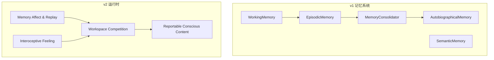
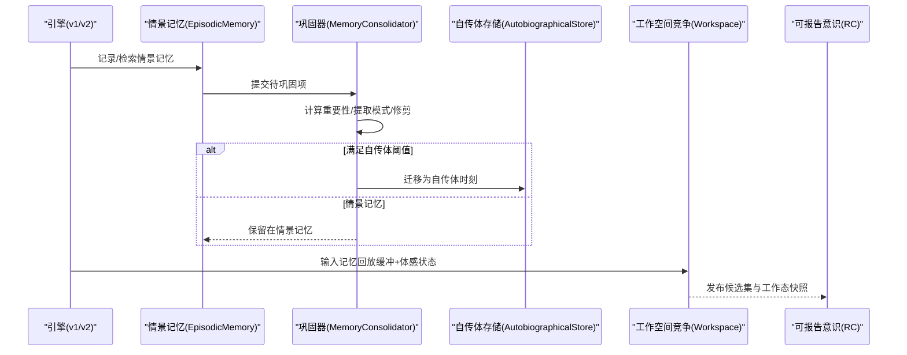
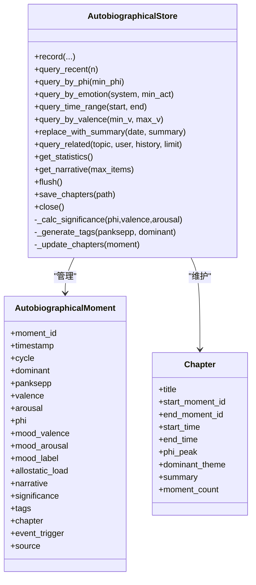
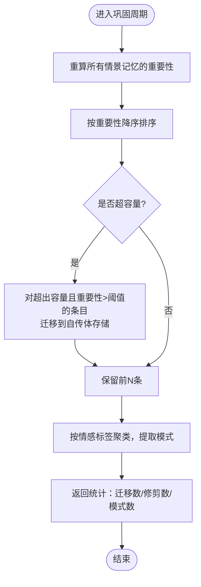
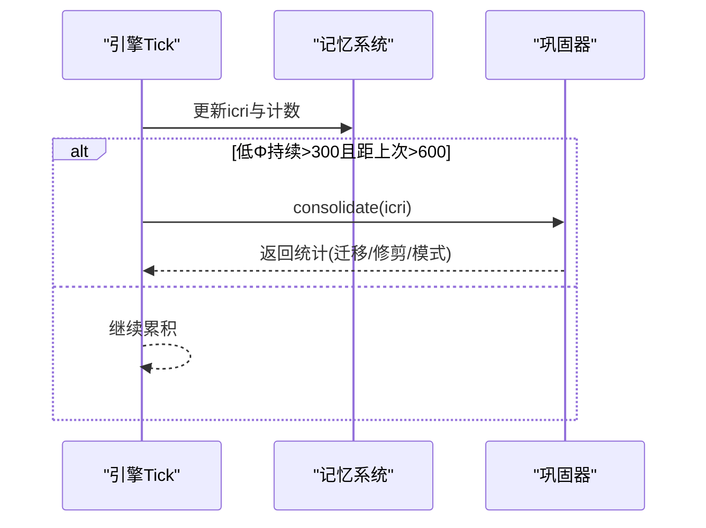
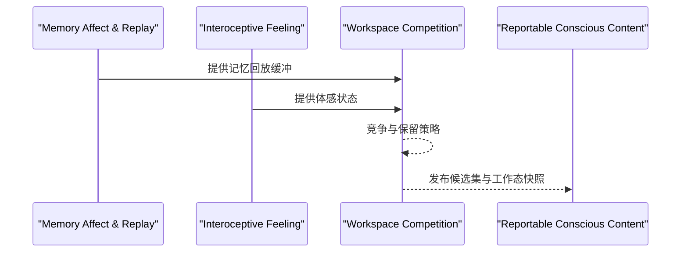
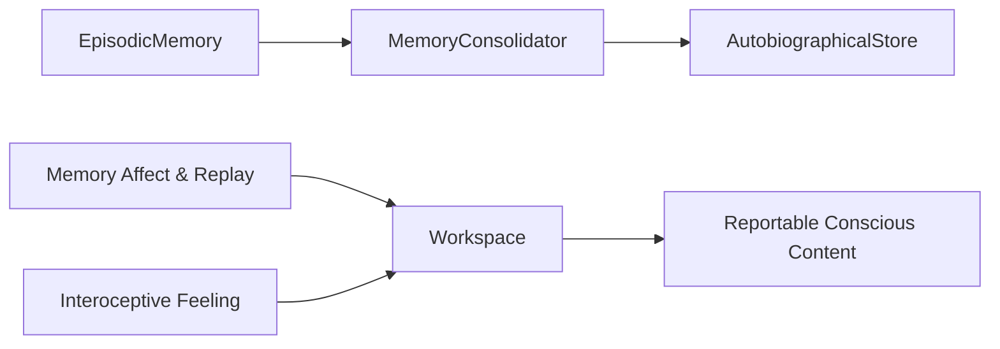

# 自传体记忆

<cite>
**本文引用的文件**
- [autobiographical.py](file://archive/helios_v1/memory/autobiographical.py)
- [memory_system.py](file://archive/helios_v1/memory/memory_system.py)
- [helios_main.py](file://archive/helios_v1/helios_main.py)
- [test_consolidation_scheduling.py](file://archive/helios_v1/tests/test_consolidation_scheduling.py)
- [test_consolidation_pbt.py](file://archive/helios_v1/tests/test_consolidation_pbt.py)
- [test_autobiographical_store.py](file://archive/helios_v1/tests/test_autobiographical_store.py)
- [test_autobiographical_store_pbt.py](file://archive/helios_v1/tests/test_autobiographical_store_pbt.py)
- [test_episodic_memory_bounded.py](file://archive/helios_v1/tests/test_episodic_memory_bounded.py)
- [design.md](file://helios_v2/docs/requirements/61-prediction-mismatch-from-appraisal/design.md)
- [requirement.md](file://helios_v2/docs/requirements/61-prediction-mismatch-from-appraisal/requirement.md)
- [stages.py](file://helios_v2/src/helios_v2/runtime/stages.py)
- [workspace\__init__.py](file://helios_v2/src/helios_v2/workspace/__init__.py)
- [workspace\contracts.py](file://helios_v2/src/helios_v2/workspace/contracts.py)
- [workspace\engine.py](file://helios_v2/src/helios_v2/workspace/engine.py)
- [test_memory_usage_monitoring.py](file://archive/helios_v1/tests/test_memory_usage_monitoring.py)
</cite>

## 目录
1. [简介](#简介)
2. [项目结构](#项目结构)
3. [核心组件](#核心组件)
4. [架构总览](#架构总览)
5. [详细组件分析](#详细组件分析)
6. [依赖分析](#依赖分析)
7. [性能考虑](#性能考虑)
8. [故障排查指南](#故障排查指南)
9. [结论](#结论)
10. [附录](#附录)

## 简介
本文件面向Helios自传体记忆系统，围绕“自传体记忆的特殊编码机制（基于预测不匹配证据）”展开，系统阐述其与情景记忆的区别、形成条件、存储位置、检索触发机制，以及在身份认同与长期记忆整合中的作用。文档同时给出自传体记忆的创建逻辑、情感强度计算、巩固决策过程，并说明其如何参与工作空间竞争与意识层面的内容选择；最后提供调试方法与性能监控指标。

## 项目结构
Helios v1与v2两套实现共同支撑自传体记忆能力：
- v1：以MemorySystem为核心，包含WorkingMemory、EpisodicMemory、SemanticMemory与AutobiographicalMemory等；通过MemoryConsolidator在静息期进行巩固，将高重要性情景记忆迁移到自传体存储。
- v2：引入workspace层与interoceptive feeling层，强调“预测不匹配证据”来自真实评估（而非常数），并通过工作空间竞争将候选记忆转化为可报告的意识内容。

图示来源
- [memory_system.py:1-120](file://archive/helios_v1/memory/memory_system.py#L1-L120)
- [stages.py:1126-1158](file://helios_v2/src/helios_v2/runtime/stages.py#L1126-L1158)

章节来源
- [memory_system.py:1-120](file://archive/helios_v1/memory/memory_system.py#L1-L120)
- [stages.py:1126-1158](file://helios_v2/src/helios_v2/runtime/stages.py#L1126-L1158)

## 核心组件
- 自传体存储（AutobiographicalStore/AutobiographicalMemory）
  - 提供JSONL追加持久化、章节管理、显著性评分与检索接口。
- 情景记忆（EpisodicMemory）
  - 带情感标签与重要性评分的记忆容器，支持修剪与向自传体存储的迁移。
- 记忆巩固器（MemoryConsolidator）
  - 在静息期根据阈值与重要性进行模式抽取、修剪与迁移。
- v2预测不匹配证据（Requirement 61）
  - 将“预测不匹配”信号从真实评估结果派生，而非硬编码常数，驱动自传体形成路径。
- 工作空间竞争（Workspace）
  - 将记忆回放缓冲与体感状态作为输入，产出候选集与工作态快照，参与意识内容选择。

章节来源
- [autobiographical.py:127-709](file://archive/helios_v1/memory/autobiographical.py#L127-L709)
- [memory_system.py:326-488](file://archive/helios_v1/memory/memory_system.py#L326-L488)
- [memory_system.py:992-1060](file://archive/helios_v1/memory/memory_system.py#L992-L1060)
- [requirement.md:1-35](file://helios_v2/docs/requirements/61-prediction-mismatch-from-appraisal/requirement.md#L1-L35)
- [design.md:1-24](file://helios_v2/docs/requirements/61-prediction-mismatch-from-appraisal/design.md#L1-L24)
- [workspace\__init__.py:1-52](file://helios_v2/src/helios_v2/workspace/__init__.py#L1-L52)

## 架构总览
自传体记忆在v1中由“情景记忆→巩固→自传体存储”的流水线驱动；在v2中，预测不匹配证据成为自传体形成的“真实信号”，并通过工作空间竞争进入可报告的意识层面。

图示来源
- [memory_system.py:992-1060](file://archive/helios_v1/memory/memory_system.py#L992-L1060)
- [autobiographical.py:127-236](file://archive/helios_v1/memory/autobiographical.py#L127-L236)
- [stages.py:1126-1158](file://helios_v2/src/helios_v2/runtime/stages.py#L1126-L1158)

## 详细组件分析

### 自传体存储与章节管理
- 数据模型
  - 自传时刻（AutobiographicalMoment）：包含情感快照（Panksepp七系统、效价、唤醒、Φ）、心境与异稳态、叙事摘要、标签、章节归属与来源。
  - 章节（Chapter）：记录章节标题、起止时刻与时间、主导主题、高峰Φ、总结与时刻数。
- 持久化策略
  - JSONL追加写入，崩溃安全；定期flush与归档（超过一定行数后保留最近N条）。
- 显著性与标签
  - 显著性=Φ主导向量（60%）+极端效价（20%）+高唤醒（20%）。
  - 标签基于Panksepp系统激活阈值生成，最多5个。
- 章节滚动
  - 基于Φ尖峰或固定数量（如≥50）触发新章节；章节内主导主题随Φ权重更新。

图示来源
- [autobiographical.py:127-709](file://archive/helios_v1/memory/autobiographical.py#L127-L709)

章节来源
- [autobiographical.py:127-236](file://archive/helios_v1/memory/autobiographical.py#L127-L236)
- [autobiographical.py:550-698](file://archive/helios_v1/memory/autobiographical.py#L550-L698)

### 情景记忆与重要性计算
- 重要性公式：重要性 = sqrt(V² + A²) × Φ × (1 + log(1 + C) × 0.1)，并下限夹紧至0.05，上限夹紧至1.0。
- 访问次数bonus：每次访问增加log(1+C)×0.1，鼓励高价值记忆的再激活。
- 修剪策略：按重要性降序保留，超过阈值（Promotion Threshold）的条目在修剪前迁移到自传体存储。

图示来源
- [memory_system.py:992-1060](file://archive/helios_v1/memory/memory_system.py#L992-L1060)
- [memory_system.py:442-488](file://archive/helios_v1/memory/memory_system.py#L442-L488)
- [test_episodic_memory_bounded.py:158-216](file://archive/helios_v1/tests/test_episodic_memory_bounded.py#L158-L216)

章节来源
- [memory_system.py:97-106](file://archive/helios_v1/memory/memory_system.py#L97-L106)
- [memory_system.py:442-488](file://archive/helios_v1/memory/memory_system.py#L442-L488)
- [test_episodic_memory_bounded.py:158-216](file://archive/helios_v1/tests/test_episodic_memory_bounded.py#L158-L216)

### 自传体记忆的创建逻辑与巩固决策
- 创建条件
  - 情景记忆重要性超过阈值（Promotion Threshold≈0.4）并在修剪阶段被迁移。
  - v2中，若存在“预测不匹配证据”（来自真实评估的新颖性/不确定性），将直接引导形成自传体记忆路径。
- 巩固决策
  - v1：静息期累积低Φ（icri<0.3）计数达阈值（>300），且距离上次巩固超过600 tick，执行一次巩固。
  - v2：预测不匹配证据作为“真实惊喜”信号，参与工作空间竞争，推动自传体候选进入可报告意识。

图示来源
- [helios_main.py:1689-1712](file://archive/helios_v1/helios_main.py#L1689-L1712)
- [test_consolidation_scheduling.py:218-356](file://archive/helios_v1/tests/test_consolidation_scheduling.py#L218-L356)

章节来源
- [helios_main.py:1689-1712](file://archive/helios_v1/helios_main.py#L1689-L1712)
- [test_consolidation_scheduling.py:218-356](file://archive/helios_v1/tests/test_consolidation_scheduling.py#L218-L356)
- [requirement.md:1-35](file://helios_v2/docs/requirements/61-prediction-mismatch-from-appraisal/requirement.md#L1-L35)
- [design.md:1-24](file://helios_v2/docs/requirements/61-prediction-mismatch-from-appraisal/design.md#L1-L24)

### 情感强度计算与巩固阈值
- 情感强度：sqrt(V² + A²)，用于衡量效价与唤醒的综合强度。
- 重要性计算：重要性 = 强度 × Φ × (1 + 访问bonus)，并夹紧至[0.05, 1.0]。
- 促进阈值：Promotion Threshold≈0.4，确保只有高价值记忆迁移到自传体存储。
- 测试验证：属性测试覆盖了高Φ与重要性的促进条件、低Φ不促进、以及重要性随访问次数增长的单调性。

章节来源
- [memory_system.py:97-106](file://archive/helios_v1/memory/memory_system.py#L97-L106)
- [test_consolidation_pbt.py:176-233](file://archive/helios_v1/tests/test_consolidation_pbt.py#L176-L233)
- [test_consolidation_pbt.py:220-233](file://archive/helios_v1/tests/test_consolidation_pbt.py#L220-L233)
- [test_consolidation_pbt.py:339-370](file://archive/helios_v1/tests/test_consolidation_pbt.py#L339-L370)
- [test_episodic_memory_bounded.py:158-216](file://archive/helios_v1/tests/test_episodic_memory_bounded.py#L158-L216)

### 工作空间竞争与意识内容选择
- 输入
  - MemoryReplayCandidate（记忆回放缓冲）
  - InteroceptiveFeelingState（体感状态）
- 输出
  - WorkspaceCandidateSet（候选集）
  - WorkingStateSnapshot（工作态快照）
- 后续
  - ReportableConsciousContent阶段从工作空间输出中提取材料，形成可报告的意识内容。

图示来源
- [workspace\contracts.py:253-289](file://helios_v2/src/helios_v2/workspace/contracts.py#L253-L289)
- [workspace\engine.py:1-45](file://helios_v2/src/helios_v2/workspace/engine.py#L1-L45)
- [stages.py:1126-1158](file://helios_v2/src/helios_v2/runtime/stages.py#L1126-L1158)

章节来源
- [workspace\__init__.py:1-52](file://helios_v2/src/helios_v2/workspace/__init__.py#L1-L52)
- [workspace\contracts.py:253-289](file://helios_v2/src/helios_v2/workspace/contracts.py#L253-L289)
- [workspace\engine.py:1-45](file://helios_v2/src/helios_v2/workspace/engine.py#L1-L45)
- [stages.py:1126-1158](file://helios_v2/src/helios_v2/runtime/stages.py#L1126-L1158)

### 自传体记忆与情景记忆的区别
- 形成条件
  - 情景记忆：高重要性（>Promotion Threshold）+高Φ+高情感强度，在修剪阶段迁移。
  - 自传体记忆：除上述条件外，v2中若存在“预测不匹配证据”（真实新颖性/不确定性），将直接导向自传体形成路径。
- 存储位置
  - 情景记忆：EpisodicMemory（运行时内存）。
  - 自传体记忆：AutobiographicalStore（JSONL持久化，跨会话）。
- 检索触发机制
  - 情景记忆：按情感相似度、标签、时间范围检索。
  - 自传体记忆：按Φ峰值、情感系统、效价范围、时间范围与相关性检索。

章节来源
- [memory_system.py:326-488](file://archive/helios_v1/memory/memory_system.py#L326-L488)
- [autobiographical.py:239-269](file://archive/helios_v1/memory/autobiographical.py#L239-L269)
- [requirement.md:1-35](file://helios_v2/docs/requirements/61-prediction-mismatch-from-appraisal/requirement.md#L1-L35)

### 自传体记忆在身份认同与长期整合中的作用
- 章节与主导主题：章节以Φ尖峰或时间跨度为界滚动，章节内的主导主题随时刻更新，体现长期整合与自我叙事的阶段性特征。
- 相关性检索：支持按话题、用户ID与历史文本进行相关性打分，辅助身份相关的记忆整合与自我反思。

章节来源
- [autobiographical.py:640-698](file://archive/helios_v1/memory/autobiographical.py#L640-L698)
- [autobiographical.py:574-608](file://archive/helios_v1/memory/autobiographical.py#L574-L608)

## 依赖分析
- v1内部耦合
  - EpisodicMemory依赖MemoryConsolidator进行修剪与迁移；AutobiographicalStore作为持久化后端。
- v2外部依赖
  - Workspace依赖MemoryReplayCandidate与InteroceptiveFeelingState；后续Reportable Conscious Content消费工作空间输出。

图示来源
- [memory_system.py:326-488](file://archive/helios_v1/memory/memory_system.py#L326-L488)
- [autobiographical.py:127-236](file://archive/helios_v1/memory/autobiographical.py#L127-L236)
- [stages.py:1126-1158](file://helios_v2/src/helios_v2/runtime/stages.py#L1126-L1158)

章节来源
- [memory_system.py:326-488](file://archive/helios_v1/memory/memory_system.py#L326-L488)
- [autobiographical.py:127-236](file://archive/helios_v1/memory/autobiographical.py#L127-L236)
- [stages.py:1126-1158](file://helios_v2/src/helios_v2/runtime/stages.py#L1126-L1158)

## 性能考虑
- 重要性计算复杂度
  - O(N)遍历与重算，N为情景记忆条目数；建议在批量操作时合并调用recalc_all_importance。
- 持久化写入
  - JSONL追加写入，flush频率与归档策略影响I/O开销；建议结合业务负载调整flush间隔。
- 工作空间竞争
  - 候选集规模与评分策略直接影响注意力分配与响应延迟，需根据资源约束设置保留窗口。

## 故障排查指南
- 巩固调度未触发
  - 检查icri是否长期低于阈值、计数器是否正确递增与重置；参考调度测试用例验证逻辑。
- 迁移比例异常
  - 核对Promotion Threshold与重要性计算；使用属性测试验证高Φ与重要性促进条件。
- 自传体存储异常
  - 查看JSONL写入/归档日志，确认flush与归档阈值；检查章节元数据保存是否成功。
- 内存使用异常
  - 使用内存使用监控工具查看各子系统统计；关注容量告警与压力评分。

章节来源
- [test_consolidation_scheduling.py:218-356](file://archive/helios_v1/tests/test_consolidation_scheduling.py#L218-L356)
- [test_consolidation_pbt.py:176-233](file://archive/helios_v1/tests/test_consolidation_pbt.py#L176-L233)
- [test_autobiographical_store.py](file://archive/helios_v1/tests/test_autobiographical_store.py)
- [test_autobiographical_store_pbt.py](file://archive/helios_v1/tests/test_autobiographical_store_pbt.py)
- [test_memory_usage_monitoring.py:242-266](file://archive/helios_v1/tests/test_memory_usage_monitoring.py#L242-L266)

## 结论
Helios的自传体记忆体系在v1中通过“情景记忆→巩固→自传体存储”的稳健流程实现长期叙事整合；在v2中，将“预测不匹配证据”从真实评估中派生，使自传体形成更具生态有效性，并通过工作空间竞争进入可报告意识。情感强度计算与巩固阈值确保了高价值经验的保留与迁移，而章节化与相关性检索则为身份认同与自我叙事提供了结构化支撑。

## 附录
- 自传体存储典型操作
  - 记录：record(...)，返回AutobiographicalMoment
  - 查询：query_recent()/query_by_phi()/query_by_emotion()/query_time_range()/query_by_valence()
  - 相关性检索：query_related(topic, user, history, limit)
  - 统计与叙事：get_statistics()/get_narrative(max_items)
  - 持久化：flush()/save_chapters()/close()
- 巩固统计字段
  - patterns_extracted：提取的模式数量
  - memories_promoted：迁移到自传体的条目数
  - items_pruned：修剪的条目数

章节来源
- [autobiographical.py:239-426](file://archive/helios_v1/memory/autobiographical.py#L239-L426)
- [memory_system.py:1013-1060](file://archive/helios_v1/memory/memory_system.py#L1013-L1060)