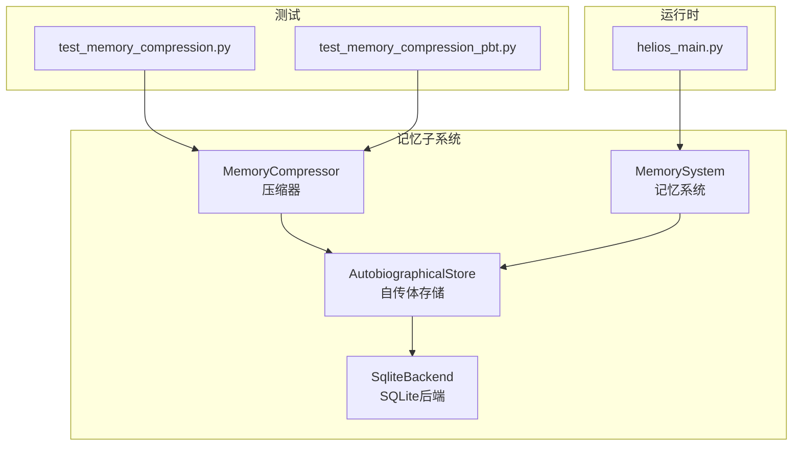
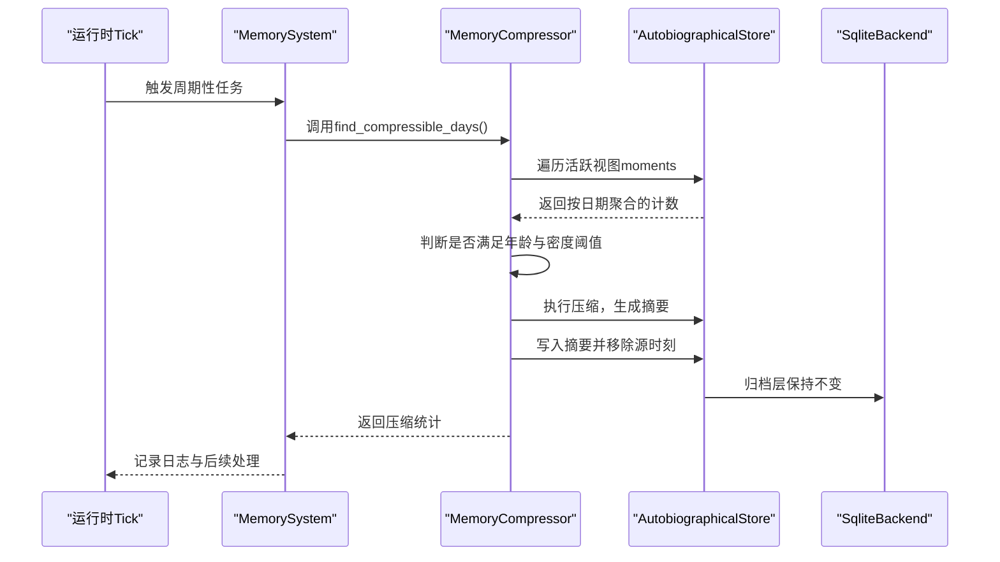
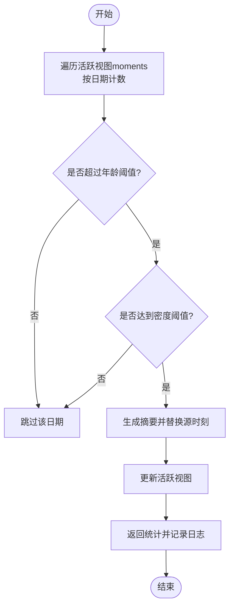
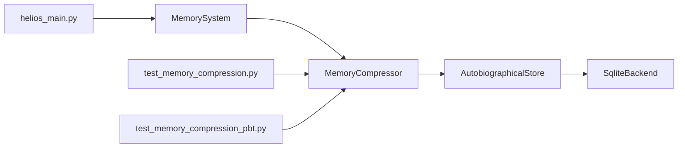

# 记忆压缩

<cite>
**本文引用的文件**
- [memory_compressor.py](file://archive/helios_v1/memory/memory_compressor.py)
- [autobiographical.py](file://archive/helios_v1/memory/autobiographical.py)
- [memory_system.py](file://archive/helios_v1/memory/memory_system.py)
- [sqlite_backend.py](file://archive/helios_v1/memory/sqlite_backend.py)
- [test_memory_compression.py](file://archive/helios_v1/tests/test_memory_compression.py)
- [test_memory_compression_pbt.py](file://archive/helios_v1/tests/test_memory_compression_pbt.py)
- [helios_main.py](file://archive/helios_v1/helios_main.py)
- [MODULE_REVIEW_MATRIX.zh-CN.md](file://archive/helios_v1/docs/MODULE_REVIEW_MATRIX.zh-CN.md)
- [brain_helios.mmd](file://archive/helios_v1/docs/brain_helios.mmd)
</cite>

## 目录
1. [引言](#引言)
2. [项目结构](#项目结构)
3. [核心组件](#核心组件)
4. [架构总览](#架构总览)
5. [详细组件分析](#详细组件分析)
6. [依赖关系分析](#依赖关系分析)
7. [性能考量](#性能考量)
8. [故障排查指南](#故障排查指南)
9. [结论](#结论)
10. [附录](#附录)

## 引言
本文件面向Helios记忆压缩系统，围绕“主动视图”自传体记忆的压缩与存储优化展开，目标是：
- 解释压缩的必要性：在长期运行中，自传体记忆会持续增长，若不进行压缩，会导致活跃视图膨胀、检索与推理成本上升。
- 描述压缩算法与策略：基于时间阈值与密度阈值的触发条件，对旧且密集的记忆日进行聚合，生成摘要以替换原始时刻，同时保留归档层的完整记录。
- 分析信息保真度与质量评估：通过测试用例验证压缩后活跃视图规模下降但归档数据保持不变，并在日志中输出统计信息。
- 给出可操作的策略示例：基于情感强度、重要性与时间衰减的优先级与阈值设定思路。
- 说明压缩后的记忆重构与完整性验证：如何从摘要回溯到源时刻，以及如何验证完整性。
- 提供性能监控、内存使用优化与压缩比评估指标建议。
- 说明压缩系统与存储系统的集成方式与配置选项。

## 项目结构
与记忆压缩直接相关的模块主要位于archive/helios_v1/memory目录，测试位于archive/helios_v1/tests，运行时主循环在archive/helios_v1/helios_main.py中，设计与评审文档在archive/helios_v1/docs中。

图表来源
- [memory_compressor.py:1-120](file://archive/helios_v1/memory/memory_compressor.py#L1-L120)
- [autobiographical.py:1-200](file://archive/helios_v1/memory/autobiographical.py#L1-L200)
- [memory_system.py:1-200](file://archive/helios_v1/memory/memory_system.py#L1-L200)
- [sqlite_backend.py:1-200](file://archive/helios_v1/memory/sqlite_backend.py#L1-L200)
- [test_memory_compression.py:1-91](file://archive/helios_v1/tests/test_memory_compression.py#L1-L91)
- [test_memory_compression_pbt.py:1-110](file://archive/helios_v1/tests/test_memory_compression_pbt.py#L1-L110)
- [helios_main.py:1682-1712](file://archive/helios_v1/helios_main.py#L1682-L1712)

章节来源
- [memory_compressor.py:1-120](file://archive/helios_v1/memory/memory_compressor.py#L1-L120)
- [autobiographical.py:1-200](file://archive/helios_v1/memory/autobiographical.py#L1-L200)
- [memory_system.py:1-200](file://archive/helios_v1/memory/memory_system.py#L1-L200)
- [sqlite_backend.py:1-200](file://archive/helios_v1/memory/sqlite_backend.py#L1-L200)
- [test_memory_compression.py:1-91](file://archive/helios_v1/tests/test_memory_compression.py#L1-L91)
- [test_memory_compression_pbt.py:1-110](file://archive/helios_v1/tests/test_memory_compression_pbt.py#L1-L110)
- [helios_main.py:1682-1712](file://archive/helios_v1/helios_main.py#L1682-L1712)

## 核心组件
- 压缩器（MemoryCompressor）：负责识别可压缩的旧且密集的记忆日，执行压缩并生成摘要，更新活跃视图。
- 自传体存储（AutobiographicalStore）：维护活跃视图中的时刻列表与归档层的持久化，支持按日期聚合与写回。
- 记忆系统（MemorySystem）：协调记忆巩固与压缩等周期性任务，触发压缩流程。
- SQLite后端（SqliteBackend）：提供持久化存储能力，支撑归档层的数据读写。
- 测试套件：覆盖确定性与属性驱动的压缩行为验证，确保活跃视图缩小而归档数据不变。

章节来源
- [memory_compressor.py:27-120](file://archive/helios_v1/memory/memory_compressor.py#L27-L120)
- [autobiographical.py:1-200](file://archive/helios_v1/memory/autobiographical.py#L1-L200)
- [memory_system.py:1-200](file://archive/helios_v1/memory/memory_system.py#L1-L200)
- [sqlite_backend.py:1-200](file://archive/helios_v1/memory/sqlite_backend.py#L1-L200)
- [test_memory_compression.py:33-91](file://archive/helios_v1/tests/test_memory_compression.py#L33-L91)
- [test_memory_compression_pbt.py:53-110](file://archive/helios_v1/tests/test_memory_compression_pbt.py#L53-L110)

## 架构总览
下图展示了压缩流程在系统中的位置与交互：

图表来源
- [helios_main.py:1682-1712](file://archive/helios_v1/helios_main.py#L1682-L1712)
- [memory_system.py:1-200](file://archive/helios_v1/memory/memory_system.py#L1-L200)
- [memory_compressor.py:37-120](file://archive/helios_v1/memory/memory_compressor.py#L37-L120)
- [autobiographical.py:1-200](file://archive/helios_v1/memory/autobiographical.py#L1-L200)
- [sqlite_backend.py:1-200](file://archive/helios_v1/memory/sqlite_backend.py#L1-L200)

## 详细组件分析

### 压缩器（MemoryCompressor）
- 触发条件
  - 年龄阈值：仅对超过一定天数的历史时刻进行考虑。
  - 密度阈值：单日时刻数量达到阈值才认为可压缩。
- 处理流程
  - 统计活跃视图中每个日期的时刻数量。
  - 过滤掉未达年龄阈值的日期。
  - 对达到密度阈值的日期执行压缩。
  - 生成摘要对象，包含日期、摘要文本、情感弧、关键事件与源ID列表。
  - 更新活跃视图：删除源时刻，插入一个带前缀的压缩标识的摘要时刻。
- 输出与日志
  - 返回压缩统计（如压缩天数、压缩时刻数、生成摘要数）。
  - 在日志中输出压缩统计信息，便于监控。

图表来源
- [memory_compressor.py:37-120](file://archive/helios_v1/memory/memory_compressor.py#L37-L120)

章节来源
- [memory_compressor.py:27-120](file://archive/helios_v1/memory/memory_compressor.py#L27-L120)
- [test_memory_compression.py:34-78](file://archive/helios_v1/tests/test_memory_compression.py#L34-L78)
- [test_memory_compression_pbt.py:53-110](file://archive/helios_v1/tests/test_memory_compression_pbt.py#L53-L110)

### 自传体存储（AutobiographicalStore）
- 职责
  - 维护活跃视图中的时刻列表（moments）。
  - 提供按日期字符串格式化的工具函数，用于聚合与比较。
  - 支持flush与持久化写回，保证归档层数据不被压缩过程破坏。
- 与压缩器协作
  - 压缩器调用其内部日期格式化逻辑进行分组。
  - 压缩后写回活跃视图，归档层保持原样。

章节来源
- [autobiographical.py:1-200](file://archive/helios_v1/memory/autobiographical.py#L1-L200)
- [memory_compressor.py:37-60](file://archive/helios_v1/memory/memory_compressor.py#L37-L60)

### 记忆系统（MemorySystem）
- 职责
  - 协调周期性任务，包括记忆巩固与压缩。
  - 当满足条件时触发压缩流程，并在完成后执行后续任务。
- 与运行时集成
  - 在主循环中根据稳定性阈值与低Phi计数触发巩固与压缩。

章节来源
- [memory_system.py:1-200](file://archive/helios_v1/memory/memory_system.py#L1-L200)
- [helios_main.py:1682-1712](file://archive/helios_v1/helios_main.py#L1682-L1712)

### SQLite后端（SqliteBackend）
- 职责
  - 提供持久化能力，支撑归档层的数据读写。
- 与压缩器协作
  - 压缩过程不影响归档层，确保历史数据完整。

章节来源
- [sqlite_backend.py:1-200](file://archive/helios_v1/memory/sqlite_backend.py#L1-L200)

### 压缩后的记忆重构与完整性验证
- 重构机制
  - 摘要时刻包含源ID列表，可通过这些ID在归档层或索引中回溯到原始时刻。
  - 可在需要时将摘要还原为原始时刻集合，以满足深度检索需求。
- 完整性验证
  - 统计层面：核对压缩前后活跃视图数量变化与生成摘要数量。
  - 数据层面：校验归档层文件行数不变，确保未丢失原始记录。
  - 日志层面：确认压缩统计信息被正确记录。

章节来源
- [memory_compressor.py:15-25](file://archive/helios_v1/memory/memory_compressor.py#L15-L25)
- [test_memory_compression.py:56-78](file://archive/helios_v1/tests/test_memory_compression.py#L56-L78)
- [test_memory_compression_pbt.py:78-110](file://archive/helios_v1/tests/test_memory_compression_pbt.py#L78-L110)

### 压缩策略示例
- 基于情感强度的优先级
  - 将高情感强度（如恐惧、兴奋）的密集日优先压缩，降低活跃视图中的高激活区域。
- 基于重要性的阈值
  - 结合内在价值评分或外部标注，对高重要性时刻设置更高密度阈值，避免误压。
- 基于时间衰减的策略
  - 使用更长的年龄阈值处理长期稳定事件，较短阈值处理近期波动事件，平衡新鲜度与压缩效率。

章节来源
- [MODULE_REVIEW_MATRIX.zh-CN.md:64-64](file://archive/helios_v1/docs/MODULE_REVIEW_MATRIX.zh-CN.md#L64-L64)

## 依赖关系分析
- 压缩器依赖自传体存储进行活跃视图聚合与更新。
- 自传体存储依赖SQLite后端进行持久化。
- 记忆系统在主循环中触发压缩器，形成闭环。
- 测试用例验证压缩器的行为与副作用（活跃视图缩小、归档层不变、日志统计）。

图表来源
- [memory_compressor.py:1-120](file://archive/helios_v1/memory/memory_compressor.py#L1-L120)
- [autobiographical.py:1-200](file://archive/helios_v1/memory/autobiographical.py#L1-L200)
- [sqlite_backend.py:1-200](file://archive/helios_v1/memory/sqlite_backend.py#L1-L200)
- [memory_system.py:1-200](file://archive/helios_v1/memory/memory_system.py#L1-L200)
- [helios_main.py:1682-1712](file://archive/helios_v1/helios_main.py#L1682-L1712)
- [test_memory_compression.py:1-91](file://archive/helios_v1/tests/test_memory_compression.py#L1-L91)
- [test_memory_compression_pbt.py:1-110](file://archive/helios_v1/tests/test_memory_compression_pbt.py#L1-L110)

章节来源
- [memory_compressor.py:1-120](file://archive/helios_v1/memory/memory_compressor.py#L1-L120)
- [autobiographical.py:1-200](file://archive/helios_v1/memory/autobiographical.py#L1-L200)
- [sqlite_backend.py:1-200](file://archive/helios_v1/memory/sqlite_backend.py#L1-L200)
- [memory_system.py:1-200](file://archive/helios_v1/memory/memory_system.py#L1-L200)
- [helios_main.py:1682-1712](file://archive/helios_v1/helios_main.py#L1682-L1712)
- [test_memory_compression.py:1-91](file://archive/helios_v1/tests/test_memory_compression.py#L1-L91)
- [test_memory_compression_pbt.py:1-110](file://archive/helios_v1/tests/test_memory_compression_pbt.py#L1-L110)

## 性能考量
- 压缩触发频率
  - 建议结合运行时稳定性监控与低Phi计数策略，避免频繁压缩带来的抖动。
- 内存使用优化
  - 压缩后活跃视图规模显著下降，有助于降低检索与推理阶段的内存占用。
- 压缩比评估
  - 可通过“压缩前活跃视图条目数/压缩后活跃视图条目数”与“生成摘要数/压缩时刻数”衡量压缩效果。
- I/O开销
  - 压缩过程主要在内存中聚合与替换，归档层不变更；若需回溯，应建立索引以减少查询成本。

章节来源
- [helios_main.py:1682-1712](file://archive/helios_v1/helios_main.py#L1682-L1712)
- [test_memory_compression.py:56-78](file://archive/helios_v1/tests/test_memory_compression.py#L56-L78)
- [test_memory_compression_pbt.py:78-110](file://archive/helios_v1/tests/test_memory_compression_pbt.py#L78-L110)

## 故障排查指南
- 症状：压缩未生效
  - 检查是否满足年龄与密度阈值；确认活跃视图中存在足够旧且密集的日期。
  - 查看日志中是否存在“Memory compression”相关统计。
- 症状：活跃视图未缩小
  - 核对测试用例中的断言逻辑，确保压缩后活跃视图条目数减少。
- 症状：归档层数据丢失
  - 确认压缩过程未修改归档文件；测试用例已验证归档行数不变。
- 症状：压缩统计缺失
  - 检查日志级别与记录逻辑，确保统计信息被输出。

章节来源
- [test_memory_compression.py:34-91](file://archive/helios_v1/tests/test_memory_compression.py#L34-L91)
- [test_memory_compression_pbt.py:53-110](file://archive/helios_v1/tests/test_memory_compression_pbt.py#L53-L110)
- [memory_compressor.py:100-120](file://archive/helios_v1/memory/memory_compressor.py#L100-L120)

## 结论
Helios的记忆压缩系统通过明确的触发条件与摘要生成机制，在保持归档层完整性的同时，有效降低了活跃视图规模，提升了检索与推理效率。测试用例验证了核心行为：压缩后活跃视图缩小、归档层不变、日志统计可用。未来可在情感强度、重要性与时间衰减方面进一步细化策略，并完善回溯与完整性验证机制。

## 附录
- 设计与评审参考
  - 模块审查矩阵指出压缩规则需符合新的记忆层次与意识流价值判断。
  - 脑图文档提供了系统整体架构视图，有助于理解压缩在整个记忆体系中的定位。

章节来源
- [MODULE_REVIEW_MATRIX.zh-CN.md:64-64](file://archive/helios_v1/docs/MODULE_REVIEW_MATRIX.zh-CN.md#L64-L64)
- [brain_helios.mmd:1-200](file://archive/helios_v1/docs/brain_helios.mmd#L1-L200)