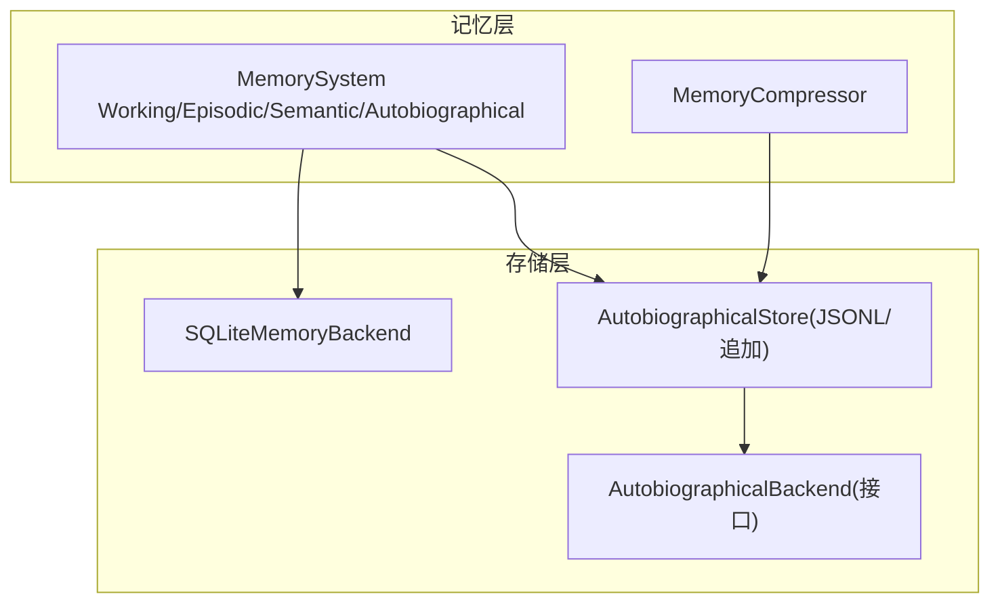
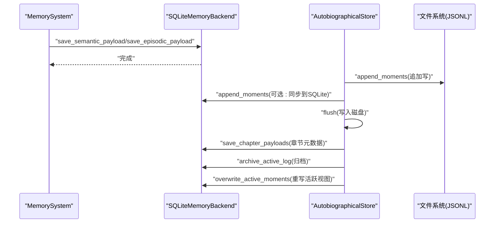
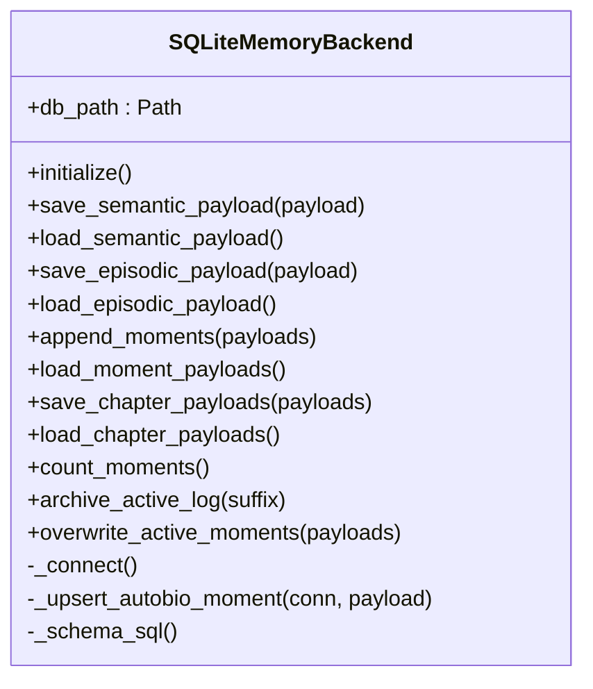
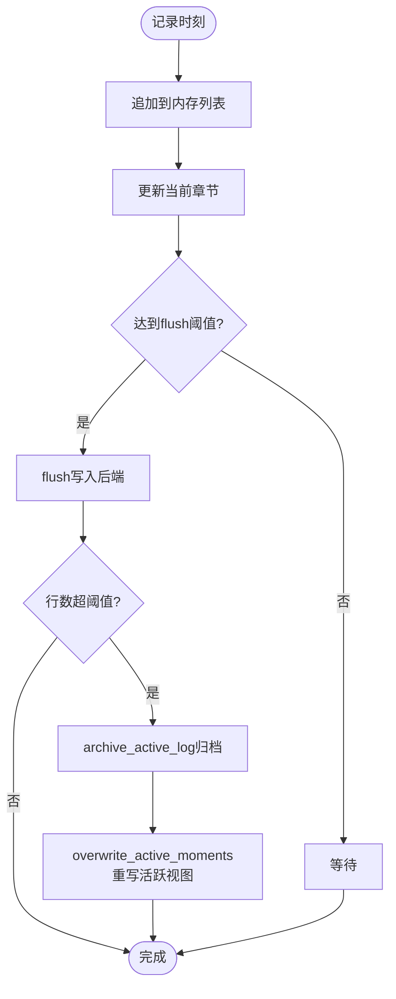
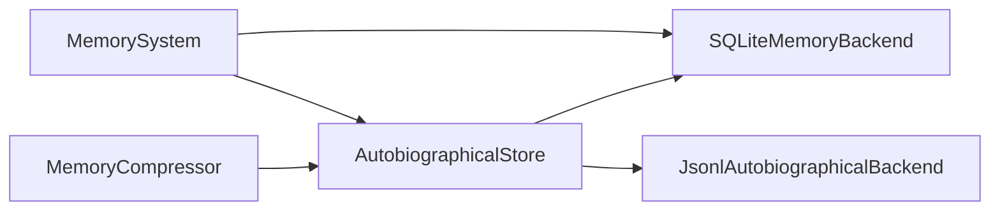

# 记忆后端存储

<cite>
**本文引用的文件**
- [sqlite_backend.py](file://archive/helios_v1/memory/sqlite_backend.py)
- [backend.py](file://archive/helios_v1/memory/backend.py)
- [memory_system.py](file://archive/helios_v1/memory/memory_system.py)
- [autobiographical.py](file://archive/helios_v1/memory/autobiographical.py)
- [memory_compressor.py](file://archive/helios_v1/memory/memory_compressor.py)
- [persistence.py](file://archive/helios_v1/utils/persistence.py)
- [test_memory_sqlite_backend.py](file://archive/helios_v1/tests/test_memory_sqlite_backend.py)
- [init_memory_backend.py](file://archive/helios_v1/scripts/init_memory_backend.py)
- [__init__.py](file://archive/helios_v1/memory/__init__.py)
</cite>

## 目录
1. [简介](#简介)
2. [项目结构](#项目结构)
3. [核心组件](#核心组件)
4. [架构总览](#架构总览)
5. [详细组件分析](#详细组件分析)
6. [依赖分析](#依赖分析)
7. [性能考虑](#性能考虑)
8. [故障排查指南](#故障排查指南)
9. [结论](#结论)
10. [附录](#附录)

## 简介
本文件面向Helios记忆后端存储系统，聚焦于v1阶段的SQLite持久化实现与配套的内存-磁盘混合架构。文档深入解析存储架构设计、数据模型与持久化策略，覆盖以下要点：
- SQLite后端表结构、索引与查询优化
- 内存缓存与落盘策略（追加写、自动归档）
- 事务管理与一致性保障
- 存储配置示例与并发控制
- 备份恢复、迁移与版本兼容
- 性能监控指标、容量规划与故障恢复流程
- 扩展性与多后端支持能力

## 项目结构
围绕记忆后端的核心文件与职责如下：
- memory/sqlite_backend.py：SQLite持久化后端，提供语义/情景/自传记忆的SQL存储与归档
- memory/backend.py：抽象后端接口（MemoryBackend、AutobiographicalBackend）及目录/JSONL实现
- memory/memory_system.py：记忆系统主体（WorkingMemory、EpisodicMemory、SemanticMemory等），定义数据模型与持久化载荷
- memory/autobiographical.py：自传记忆存储（JSONL/追加写）与章节管理，支持与SQLite后端双向互通
- memory/memory_compressor.py：自传记忆压缩工具，将历史日粒度大量时刻压缩为摘要
- utils/persistence.py：通用状态持久化工具（原子写、容错读、版本戳）
- tests/test_memory_sqlite_backend.py：SQLite后端功能与集成测试
- scripts/init_memory_backend.py：初始化SQLite后端数据库脚本
- memory/__init__.py：导出入口，包含SQLite后端

**图表来源**
- [memory_system.py](file://archive/helios_v1/memory/memory_system.py)
- [sqlite_backend.py](file://archive/helios_v1/memory/sqlite_backend.py)
- [autobiographical.py](file://archive/helios_v1/memory/autobiographical.py)
- [backend.py](file://archive/helios_v1/memory/backend.py)

**章节来源**
- [__init__.py](file://archive/helios_v1/memory/__init__.py)
- [init_memory_backend.py](file://archive/helios_v1/scripts/init_memory_backend.py)

## 核心组件
- SQLiteMemoryBackend：实现MemoryBackend与AutobiographicalBackend，负责语义/情景/自传记忆的SQL持久化、索引与归档
- AutobiographicalStore：自传记忆的内存镜像与磁盘JSONL追加写，支持章节管理、自动归档与压缩
- MemorySystem：记忆系统主体，定义MemoryItem与各记忆类型的数据结构与持久化载荷
- MemoryCompressor：对历史日粒度过量时刻进行压缩，降低活跃视图体积
- StatePersistence：通用状态持久化工具，提供原子写与容错读

**章节来源**
- [sqlite_backend.py](file://archive/helios_v1/memory/sqlite_backend.py)
- [autobiographical.py](file://archive/helios_v1/memory/autobiographical.py)
- [memory_system.py](file://archive/helios_v1/memory/memory_system.py)
- [memory_compressor.py](file://archive/helios_v1/memory/memory_compressor.py)
- [persistence.py](file://archive/helios_v1/utils/persistence.py)

## 架构总览
SQLite后端与自传记忆存储协同工作：
- 语义/情景记忆：由MemorySystem生成持久化载荷，写入SQLite
- 自传记忆：AutobiographicalStore以JSONL追加写入，定期flush到磁盘；同时可经由SQLite后端实现跨会话持久化
- 归档与压缩：当JSONL超过阈值时自动归档并保留最近N条；历史日大量时刻可压缩为摘要

**图表来源**
- [sqlite_backend.py](file://archive/helios_v1/memory/sqlite_backend.py)
- [autobiographical.py](file://archive/helios_v1/memory/autobiographical.py)

## 详细组件分析

### SQLiteMemoryBackend（SQLite后端）
- 初始化与模式迁移
  - 创建数据库目录，建立schema_migrations表用于版本跟踪
  - 一次性执行建表与索引创建，确保表存在且具备必要索引
- 语义记忆（memory_semantic）
  - 主键memory_id，唯一键memory_key，便于按key快速检索
  - payload_json、tags_json、confidence、updated_at字段支撑检索与排序
- 情景记忆（memory_episodic）
  - 主键memory_id，timestamp索引支持时间序列检索
  - payload_json、tags_json、importance、emotional_tag、updated_at
- 自传记忆（memory_autobio）
  - 主键moment_id，timestamp索引支持时间序列检索
  - tags_json、source_json、payload_json、updated_at
- 章节元数据（memory_autobio_chapters）
  - 主键chapter_key，start_time/end_time索引
- 归档表（memory_autobio_archive）
  - 复合主键(archive_batch, moment_id)，archive_batch索引
- 写入策略
  - 语义/情景：先清空旧表，再批量插入，保证“最终一致性”
  - 自传：ON CONFLICT(moment_id) DO UPDATE实现UPSERT，避免重复
- 归档与重写
  - archive_active_log：将活跃视图迁移到归档表并清空活跃表
  - overwrite_active_moments：重写活跃视图，仅保留最新N条
- 连接管理
  - 使用上下文管理器创建sqlite3连接，row_factory为sqlite3.Row，finally中关闭连接

**图表来源**
- [sqlite_backend.py](file://archive/helios_v1/memory/sqlite_backend.py)

**章节来源**
- [sqlite_backend.py](file://archive/helios_v1/memory/sqlite_backend.py)

### AutobiographicalStore（自传记忆存储）
- 数据模型
  - AutobiographicalMoment：包含情感快照、心境、叙事、标签、章节、来源等
  - Chapter：章节元数据（标题、起止moment_id/时间、主导主题、摘要、数量）
- 写入与刷新
  - record：生成moment_id，计算significance，更新当前章节
  - flush：将未持久化的moment追加写入后端（JSONL或SQLite）
  - save_chapters：保存章节元数据
- 查询与统计
  - query_recent/query_by_phi/query_by_emotion/query_time_range/query_by_valence
  - get_statistics/get_narrative
- 自动归档与重写
  - 当JSONL行数超过阈值（如50000）时，按时间戳归档，保留最近N条（如5000）并重写活跃视图
- 压缩
  - replace_with_summary：将某日的多个moment替换为摘要占位
  - MemoryCompressor：按日期聚合、提取关键事件、生成摘要

**图表来源**
- [autobiographical.py](file://archive/helios_v1/memory/autobiographical.py)

**章节来源**
- [autobiographical.py](file://archive/helios_v1/memory/autobiographical.py)
- [memory_compressor.py](file://archive/helios_v1/memory/memory_compressor.py)

### MemorySystem（记忆系统）
- 数据模型
  - MemoryItem：id、memory_type、timestamp、ttl、last_accessed、content、summary、情感标签、重要性、访问计数、tags
  - WorkingMemory：环形缓冲+TTL，容量上限，默认300秒，容量溢出时优先提升重要性高的条目
  - EpisodicMemory：容量上限（默认500），按重要性修剪，高重要性在修剪前提升至自传存储
  - SemanticMemory：键值存储+标签索引，支持置信度衰减
- 持久化载荷
  - EpisodicMemory/SemanticMemory提供to_persistence_payload/load_from_payload，用于与后端交换数据
- 重要性计算
  - importance = sqrt(V² + A²) × Φ × (1 + log(1 + C) × 0.1)，并有最小阈值保护

**章节来源**
- [memory_system.py](file://archive/helios_v1/memory/memory_system.py)

### 抽象后端与兼容实现
- MemoryBackend：抽象语义/情景记忆的保存/加载
- AutobiographicalBackend：抽象自传记忆的追加/加载/章节/计数/归档/重写
- DirectoryMemoryBackend：基于JSON文件的兼容实现
- JsonlAutobiographicalBackend：基于JSONL的自传记忆后端

**章节来源**
- [backend.py](file://archive/helios_v1/memory/backend.py)

## 依赖分析
- SQLiteMemoryBackend依赖sqlite3与json，实现SQL建表、索引、UPSERT、批量写入与归档
- AutobiographicalStore依赖AutobiographicalBackend（默认JsonlAutobiographicalBackend），可切换为SQLite后端
- MemorySystem与后端通过持久化载荷解耦，既可对接SQLite也可对接文件后端
- MemoryCompressor依赖AutobiographicalStore的内存视图与日期分组能力

**图表来源**
- [sqlite_backend.py](file://archive/helios_v1/memory/sqlite_backend.py)
- [autobiographical.py](file://archive/helios_v1/memory/autobiographical.py)
- [backend.py](file://archive/helios_v1/memory/backend.py)

**章节来源**
- [__init__.py](file://archive/helios_v1/memory/__init__.py)

## 性能考虑
- 表与索引
  - memory_semantic(memory_key)：按key检索语义事实
  - memory_episodic(timestamp)：按时间顺序检索情景记忆
  - memory_autobio(timestamp)：按时间顺序检索自传时刻
  - memory_autobio_archive(archive_batch)：按批次检索归档
- 写入路径
  - 语义/情景：DELETE + 批量INSERT，适合一次性全量替换
  - 自传：UPSERT按moment_id去重，避免重复写入
- 归档与重写
  - 大体量JSONL自动归档，保留最近N条，降低活跃视图扫描成本
- 建议
  - 对高频查询字段建立合适索引
  - 控制批量写入大小，避免长事务
  - 在高写入场景下评估归档频率与保留窗口

[本节为通用指导，无需具体文件分析]

## 故障排查指南
- 初始化失败
  - 确认数据库路径可写，目录已创建
  - 检查schema_migrations与建表SQL执行情况
- 写入异常
  - SQLite写入失败通常抛出sqlite3.Error；检查权限与磁盘空间
  - JSONL写入失败记录错误日志，检查文件句柄与磁盘可用空间
- 数据不一致
  - 语义/情景写入采用“清空+全量插入”，若中断可能导致中间态；重启后应能重建
  - 自传写入采用追加写，结合flush与归档流程，确保崩溃安全
- 测试验证
  - 使用测试用例验证表结构、载荷往返、归档与重写流程

**章节来源**
- [test_memory_sqlite_backend.py](file://archive/helios_v1/tests/test_memory_sqlite_backend.py)
- [sqlite_backend.py](file://archive/helios_v1/memory/sqlite_backend.py)
- [autobiographical.py](file://archive/helios_v1/memory/autobiographical.py)

## 结论
Helios记忆后端采用“内存高速缓存 + 磁盘持久化”的混合架构：MemorySystem负责运行时的高性能内存操作，AutobiographicalStore提供崩溃安全的JSONL追加写，SQLite后端提供结构化查询与跨会话持久化能力。通过索引、批量写入、自动归档与压缩，系统在可用性与性能之间取得平衡，并为未来扩展（如多后端、向量化检索）预留了接口。

[本节为总结，无需具体文件分析]

## 附录

### 存储配置示例
- 初始化SQLite后端
  - 使用命令行脚本初始化数据库文件，指定db-path
  - 示例：python scripts/init_memory_backend.py --db-path data/memory_backend.sqlite3
- 运行时配置
  - MemorySystem.backend：可注入SQLiteMemoryBackend实例
  - AutobiographicalStore.backend：可注入SQLiteMemoryBackend以启用双写
  - flush_interval：控制自传记忆flush频率（默认10条）
  - 归档阈值：JSONL行数超过阈值（如50000）触发归档，保留最近N条（如5000）

**章节来源**
- [init_memory_backend.py](file://archive/helios_v1/scripts/init_memory_backend.py)
- [autobiographical.py](file://archive/helios_v1/memory/autobiographical.py)
- [sqlite_backend.py](file://archive/helios_v1/memory/sqlite_backend.py)

### 事务管理与并发控制
- 事务特性
  - 语义/情景写入：单次提交，保证批量原子性
  - 自传写入：UPSERT单条提交，避免重复
- 并发控制
  - SQLite默认WAL模式可提升并发读写；生产环境建议开启WAL
  - JSONL追加写采用逐条追加，配合flush减少部分写风险
- 建议
  - 对高并发写入场景，考虑拆分写入批次与归档窗口
  - 使用只读副本或连接池（如应用侧）以提升读性能

[本节为通用指导，无需具体文件分析]

### 备份与恢复
- 备份
  - SQLite：直接复制.db文件；或使用sqlite3.dump生成SQL备份
  - JSONL：归档文件按时间戳命名，保留历史版本
- 恢复
  - SQLite：将备份文件替换为当前.db，重启服务
  - JSONL：从归档文件恢复到活跃视图，或使用overwrite_active_moments重写
- 迁移
  - 通过MemorySystem的持久化载荷在不同后端间迁移
  - 自传记忆可通过AutobiographicalStore的load/save流程迁移

**章节来源**
- [sqlite_backend.py](file://archive/helios_v1/memory/sqlite_backend.py)
- [autobiographical.py](file://archive/helios_v1/memory/autobiographical.py)

### 版本兼容与演进
- schema_migrations：记录模式版本，避免重复建表
- 载荷版本：语义/情景/自传记忆载荷包含version字段，便于向前/向后兼容
- 接口演进：AutobiographicalBackend抽象允许替换实现（如从JSONL迁移到SQLite）

**章节来源**
- [sqlite_backend.py](file://archive/helios_v1/memory/sqlite_backend.py)
- [memory_system.py](file://archive/helios_v1/memory/memory_system.py)

### 性能监控与容量规划
- 监控指标
  - SQLite：表行数、索引命中率、写入延迟、归档批次数量
  - JSONL：活跃行数、归档频率、flush耗时
- 容量规划
  - 估算自传记忆增长速率，设定归档阈值与保留窗口
  - 评估语义/情景记忆载荷大小，合理设置批量写入批次

[本节为通用指导，无需具体文件分析]

### 扩展性与多后端支持
- 后端抽象：AutobiographicalBackend/MemoryBackend定义清晰接口
- 多实现：DirectoryMemoryBackend、JsonlAutobiographicalBackend、SQLiteMemoryBackend
- 未来扩展：可引入向量化检索后端、分布式KV后端，通过适配器接入

**章节来源**
- [backend.py](file://archive/helios_v1/memory/backend.py)
- [__init__.py](file://archive/helios_v1/memory/__init__.py)